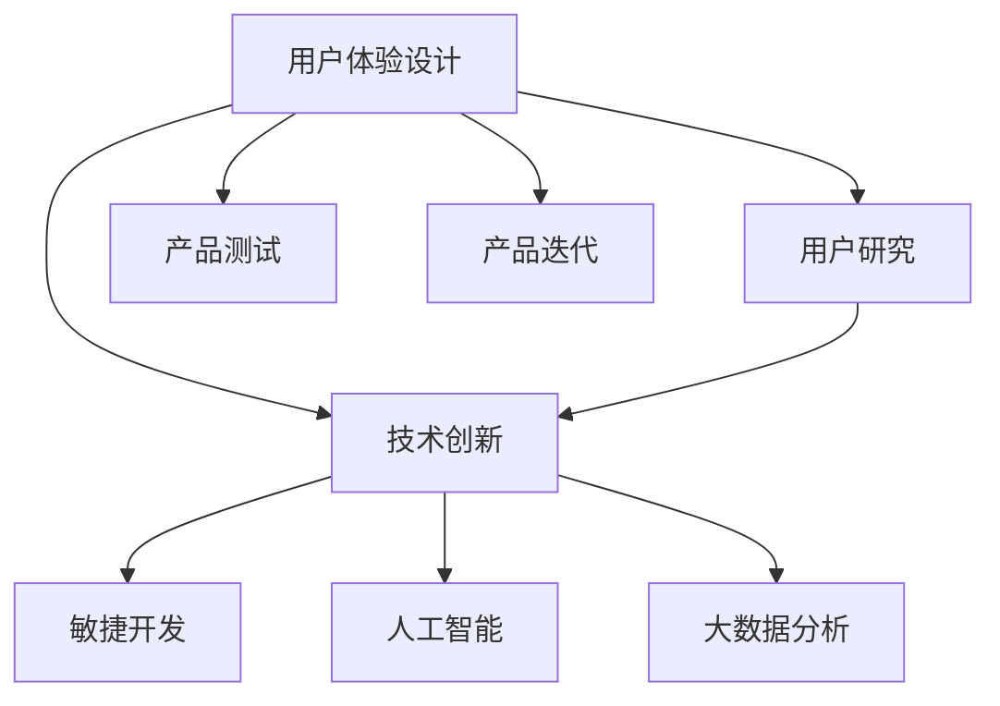

                 

## 1. 背景介绍

### 1.1 问题由来

在快速发展的科技浪潮中，技术能力的日益增强成为企业持续创新和竞争优势的重要保障。如何利用这些技术能力进行高效、合理的产品设计，成为了现代企业亟待解决的难题。产品设计的成功与否直接关系到企业的市场竞争力，其核心在于技术应用与用户需求的有机结合。

### 1.2 问题核心关键点

要成功进行产品设计，必须明确几个核心关键点：
- **用户需求分析**：深入理解用户需求，准确把握用户的痛点和期望。
- **技术应用定位**：确定技术能力在产品设计中的应用方向和范围。
- **流程优化与管理**：设计合理的研发流程，确保技术创新与市场需求的快速对接。
- **产品测试与迭代**：通过持续的产品测试和迭代，优化产品性能和用户体验。

### 1.3 问题研究意义

掌握技术能力在产品设计中的应用，对于提升企业创新能力、提高产品质量、增强用户体验具有重要意义：
1. **提升创新能力**：通过技术手段加速产品研发，缩短产品上市周期，持续推出创新产品。
2. **提高产品质量**：利用先进技术改进产品性能，提升用户体验和满意度。
3. **增强用户体验**：通过数据分析和人工智能技术，提供个性化、智能化的产品服务。
4. **优化产品迭代**：通过快速的产品测试和迭代，不断优化产品设计和功能，适应市场变化。

## 2. 核心概念与联系

### 2.1 核心概念概述

为了更好地理解技术能力在产品设计中的应用，本文将介绍几个关键概念：

- **用户体验设计（User Experience Design, UED）**：关注用户与产品互动的每一个细节，旨在提升用户的整体满意度和使用体验。
- **用户研究（User Research）**：通过调研和访谈等方式，深入了解用户需求和行为习惯，为产品设计提供数据支撑。
- **技术创新（Technological Innovation）**：利用前沿技术手段，实现产品功能的突破和性能的提升。
- **敏捷开发（Agile Development）**：采用迭代、快速反馈的开发模式，确保产品设计与开发的同步进行。
- **人工智能（Artificial Intelligence, AI）**：利用机器学习、深度学习等技术，提升产品智能化的水平。
- **大数据分析（Big Data Analysis）**：通过大规模数据处理和分析，为产品决策提供科学依据。

这些概念之间的逻辑关系可以通过以下Mermaid流程图来展示：



这个流程图展示了技术能力在产品设计中的关键概念及其相互关系：

1. 用户体验设计基于用户研究的结果，引导技术创新。
2. 技术创新通过敏捷开发和人工智能手段不断提升产品性能。
3. 大数据分析为产品设计提供数据支持，并推动产品的持续迭代。

## 3. 核心算法原理 & 具体操作步骤

### 3.1 算法原理概述

基于技术能力的产品设计，其核心在于利用先进的技术手段，结合用户需求，设计出具有创新性和实用性的产品。技术能力的应用主要包括以下几个方面：

1. **用户需求分析**：通过用户研究，了解用户的需求、行为和心理特征，为产品设计提供基础。
2. **技术创新定位**：确定技术能力在产品中的具体应用方向和范围，制定技术应用方案。
3. **流程优化与管理**：设计高效的产品设计流程，确保技术应用与用户需求无缝对接。
4. **产品测试与迭代**：通过持续的产品测试和迭代，优化产品性能和用户体验。

### 3.2 算法步骤详解

基于技术能力的产品设计流程主要包括以下几个关键步骤：

**Step 1: 用户研究与需求分析**
- 设计问卷、访谈、焦点小组等调研方法，收集用户的基本需求和期望。
- 使用数据分析工具（如Google Analytics、Tableau等）对用户行为进行统计分析，发现潜在需求。
- 结合用户反馈，绘制用户画像，制定用户需求清单。

**Step 2: 技术创新定位**
- 评估现有技术的能力和局限性，选择适合的技术栈和工具。
- 根据用户需求，确定技术应用的具体方向和功能需求。
- 设计技术架构，明确技术实现路径和关键点。

**Step 3: 流程优化与管理**
- 设计敏捷开发流程，采用Scrum或Kanban等方法，确保产品设计与开发同步进行。
- 引入项目管理工具（如Jira、Trello等），跟踪项目进度，协调资源分配。
- 建立跨部门协作机制，确保技术与设计的有效沟通和配合。

**Step 4: 产品设计与原型制作**
- 根据用户需求和技术定位，设计产品原型和交互设计。
- 使用原型设计工具（如Sketch、Figma等）制作高保真的交互原型。
- 进行用户测试，收集反馈，不断优化设计方案。

**Step 5: 产品实现与测试**
- 基于技术架构和设计方案，进行产品开发和功能实现。
- 利用自动化测试工具（如Selenium、Jest等）确保代码质量，避免常见Bug。
- 进行性能测试和安全测试，确保产品稳定性和可靠性。

**Step 6: 产品上线与迭代**
- 根据测试结果和用户反馈，进行产品上线和发布。
- 利用数据分析工具监控产品表现，收集用户反馈。
- 持续迭代产品功能，提升用户体验和满意度。

### 3.3 算法优缺点

基于技术能力的产品设计有以下优点：
1. **创新能力强**：通过技术应用，可以快速推出具有创新性的产品，满足用户多样化需求。
2. **用户体验佳**：利用用户体验设计，确保产品功能和界面设计贴合用户需求，提升使用体验。
3. **迭代速度快**：采用敏捷开发模式，能够快速反馈用户需求，进行产品迭代和优化。
4. **数据驱动决策**：通过大数据分析，提供科学的决策依据，减少产品设计的盲目性。

同时，该方法也存在一些局限性：
1. **技术依赖性强**：产品设计的成功与否高度依赖于技术实现和应用效果。
2. **复杂度高**：涉及技术栈、用户需求、项目管理等多方面因素，需要综合考虑。
3. **成本较高**：技术应用和创新往往需要较高的研发投入，可能影响产品上市时间。
4. **风险较大**：新技术的应用可能带来未知的风险和问题，需要充分评估和测试。

尽管存在这些局限性，但总体而言，基于技术能力的产品设计方法在大数据、人工智能等技术日新月异的背景下，成为企业提升产品竞争力的重要手段。

### 3.4 算法应用领域

基于技术能力的产品设计在多个领域都有广泛应用，例如：

- **移动应用**：利用人工智能技术进行推荐系统设计，提升用户体验和留存率。
- **智能家居**：结合物联网和大数据技术，实现智能家居设备的互联互通和个性化控制。
- **金融科技**：通过区块链和人工智能技术，提升金融产品的安全性和用户体验。
- **智慧城市**：利用大数据分析和人工智能技术，优化城市管理和服务，提升市民生活质量。
- **工业互联网**：结合物联网和人工智能技术，实现工业设备的智能监控和预测性维护。

这些领域的应用，展示了技术能力在产品设计中的巨大潜力，也为其他行业提供了可借鉴的案例和经验。

## 4. 数学模型和公式 & 详细讲解 & 举例说明

### 4.1 数学模型构建

基于技术能力的产品设计，可以通过数学模型来描述和优化设计过程。以下是一个简单的产品设计数学模型示例：

- **用户需求评分模型**：根据用户调研数据，对用户需求进行评分，量化用户对不同功能的需求程度。
- **技术能力评估模型**：对现有技术栈和工具进行评估，确定其在产品设计中的应用能力。
- **流程优化模型**：通过项目管理工具，对产品设计流程进行建模，优化资源分配和任务进度。

### 4.2 公式推导过程

以用户需求评分模型为例，假设用户需求有n个，每个需求评分从1到5，使用以下公式计算综合评分：

$$
\text{综合评分} = \frac{1}{n} \sum_{i=1}^{n} \text{评分}_i
$$

其中 $\text{评分}_i$ 为第i个需求的用户评分。

通过公式推导，可以得到一个直观的用户需求综合评分，用于指导产品设计优先级和资源分配。

### 4.3 案例分析与讲解

以一款智能推荐系统为例，分析如何利用技术能力进行产品设计：

**用户需求分析**：通过问卷调研，收集用户对推荐内容的多样化需求和个性化期望。

**技术创新定位**：选择推荐算法（如协同过滤、内容推荐等），确定数据存储和处理方案。

**流程优化与管理**：采用敏捷开发模式，定期进行用户反馈收集和迭代。

**产品设计与原型制作**：设计推荐界面和交互设计，制作高保真原型，进行用户测试。

**产品实现与测试**：实现推荐算法和界面开发，进行自动化测试和性能测试。

**产品上线与迭代**：根据用户反馈和数据分析，进行产品迭代和优化，提升用户体验。

## 5. 项目实践：代码实例和详细解释说明

### 5.1 开发环境搭建

要进行基于技术能力的产品设计，需要搭建一个全面的开发环境，包括以下关键组件：

1. **开发工具**：选择IDE（如Visual Studio Code、Eclipse等）和文本编辑器（如Sublime Text、Atom等），支持代码编写和调试。
2. **版本控制**：使用Git等版本控制系统，管理代码变更和团队协作。
3. **持续集成/持续部署（CI/CD）**：利用Jenkins、GitLab CI等工具，自动化构建和部署，确保产品快速迭代。
4. **项目管理**：使用Jira、Trello等工具，跟踪任务进度，协调资源分配。
5. **协作平台**：使用Slack、Microsoft Teams等协作工具，确保团队沟通和信息共享。

### 5.2 源代码详细实现

以智能推荐系统为例，展示一个基本的推荐算法实现：

**算法原理**：使用协同过滤算法，根据用户历史行为数据进行推荐。

```python
import pandas as pd
import numpy as np
from scipy.spatial.distance import cosine

# 读取用户行为数据
data = pd.read_csv('user_behavior.csv')

# 构建用户-物品评分矩阵
user_item = data[['user', 'item', 'rating']].pivot_table(index='user', columns='item', values='rating').fillna(0)

# 计算用户相似度
def user_similarity(user1, user2):
    return 1 - cosine(user_item[user1].values, user_item[user2].values)

# 推荐系统实现
def recommend(user, top_n=10):
    similarity_scores = {}
    for i, item in user_item.items():
        if i != user:
            similarity_scores[i] = user_similarity(user, i)
    top_items = sorted(similarity_scores, key=similarity_scores.get, reverse=True)[:top_n]
    return top_items
```

**代码解读与分析**：
- 读取用户行为数据，构建用户-物品评分矩阵。
- 定义用户相似度计算函数，基于余弦相似度计算用户之间的相似度。
- 实现推荐系统函数，根据用户和相似用户的行为数据，推荐可能感兴趣的物品。

### 5.3 代码解读与分析

**代码实现细节**：
- 使用Pandas库读取和处理数据，利用pivot_table方法构建用户-物品评分矩阵。
- 利用Scipy库计算余弦相似度，计算用户之间的相似度。
- 实现推荐系统函数，根据用户相似度和评分数据，推荐可能感兴趣的物品。

**代码性能优化**：
- 数据处理过程中，可以采用并行计算（如多线程、分布式计算）提高处理效率。
- 数据存储和读取过程中，可以采用分布式数据库（如Hadoop、Spark）优化性能。
- 算法实现过程中，可以采用向量量化、降维等方法优化计算效率。

**运行结果展示**：
- 可以通过可视化工具（如Matplotlib、Seaborn等）展示推荐结果，直观展示推荐效果。
- 可以通过日志和监控工具（如ELK Stack、Prometheus等）监控推荐系统的运行状态和性能指标。

## 6. 实际应用场景

### 6.1 移动应用

基于技术能力的产品设计在移动应用领域有广泛应用。例如，通过人工智能技术优化推荐算法，提升用户粘性和留存率。移动应用的推荐系统可以采用协同过滤、基于内容的推荐、深度学习推荐等技术，根据用户行为和偏好，实时推荐相关内容或服务。

### 6.2 智能家居

智能家居领域，结合物联网和大数据技术，实现设备的互联互通和个性化控制。通过智能语音助手（如Alexa、Google Assistant等），用户可以语音控制家庭设备，如灯光、空调、安防系统等。

### 6.3 金融科技

金融科技领域，通过区块链和大数据分析技术，提升金融产品的安全性和用户体验。例如，利用区块链技术进行资产管理和交易，通过大数据分析进行风险评估和用户行为分析。

### 6.4 智慧城市

智慧城市领域，利用大数据分析和人工智能技术，优化城市管理和服务，提升市民生活质量。例如，通过智能交通系统优化交通流量，通过智能环境监测系统提高城市环境质量。

### 6.5 工业互联网

工业互联网领域，结合物联网和人工智能技术，实现工业设备的智能监控和预测性维护。例如，通过传感器数据采集和分析，预测设备故障并进行预防性维护，提高生产效率和设备寿命。

## 7. 工具和资源推荐

### 7.1 学习资源推荐

为了帮助开发者掌握基于技术能力的产品设计，推荐以下学习资源：

1. **《用户体验设计原则》（原书：The Design of Everyday Things）**：由著名设计大师Don Norman所著，详细介绍了用户体验设计的原则和实践。
2. **《敏捷软件开发》（原书：Agile Software Development）**：由Robert C. Martin、Eric R. Sink、David Thomas等作者合著，介绍了敏捷开发的基本原理和实践方法。
3. **《深度学习实战》（原书：Deep Learning with Python）**：由François Chollet著，介绍了深度学习在产品设计中的应用实例。
4. **《大数据分析与实践》（原书：Data Science for Business）**：由Peter Kouvelis等作者合著，介绍了大数据分析和应用的基本方法和工具。

通过对这些资源的系统学习，相信你能更好地理解和掌握基于技术能力的产品设计方法。

### 7.2 开发工具推荐

以下是几款用于基于技术能力的产品设计的常用工具：

1. **开发工具**：选择IDE（如Visual Studio Code、Eclipse等）和文本编辑器（如Sublime Text、Atom等），支持代码编写和调试。
2. **版本控制**：使用Git等版本控制系统，管理代码变更和团队协作。
3. **持续集成/持续部署（CI/CD）**：利用Jenkins、GitLab CI等工具，自动化构建和部署，确保产品快速迭代。
4. **项目管理**：使用Jira、Trello等工具，跟踪任务进度，协调资源分配。
5. **协作平台**：使用Slack、Microsoft Teams等协作工具，确保团队沟通和信息共享。

合理利用这些工具，可以显著提升基于技术能力的产品设计效率，加速产品迭代和创新。

### 7.3 相关论文推荐

以下是几篇奠基性的相关论文，推荐阅读：

1. **《人工智能产品设计原则》**：探讨如何利用人工智能技术优化产品设计和用户体验。
2. **《敏捷开发：原则、实践与模式》**：详细介绍了敏捷开发的基本原则、实践方法和模式。
3. **《大数据分析与产品设计》**：探讨了大数据分析在产品设计中的应用方法和实践。
4. **《用户体验设计的心理学基础》**：分析了用户体验设计的心理学基础，提供了设计心理学方法论。

这些论文代表了大数据、人工智能等技术在产品设计中的最新进展，有助于深入理解相关技术和方法。

## 8. 总结：未来发展趋势与挑战

### 8.1 总结

本文系统介绍了基于技术能力的产品设计方法，包括用户体验设计、用户研究、技术创新定位、流程优化与管理、产品测试与迭代等关键环节。通过深入分析技术应用和用户需求，设计出具有创新性和实用性的产品。

通过本文的系统梳理，可以看到，基于技术能力的产品设计方法正在成为现代企业产品设计的重要手段。技术应用与用户需求的有机结合，能够显著提升产品的竞争力和用户体验。

### 8.2 未来发展趋势

展望未来，基于技术能力的产品设计将呈现以下几个发展趋势：

1. **技术融合趋势**：技术能力将与用户体验设计、数据分析、人工智能等手段深度融合，形成更加智能、高效的产品设计模式。
2. **数据驱动设计**：数据驱动的设计模式将逐渐普及，通过数据分析和用户行为预测，优化产品设计和功能。
3. **个性化设计**：利用人工智能和大数据技术，实现个性化推荐和定制化服务，提升用户体验和满意度。
4. **跨界创新**：结合不同领域的知识和能力，实现跨界创新和融合，推动更多创新产品的出现。
5. **伦理和安全性**：技术应用过程中，需要更加注重数据隐私、伦理和安全性，确保用户信息的安全和合理使用。

这些趋势凸显了基于技术能力的产品设计的广阔前景，将为产品设计带来更多创新和变革。

### 8.3 面临的挑战

尽管基于技术能力的产品设计具有巨大的发展潜力，但也面临着诸多挑战：

1. **技术复杂性**：技术能力的应用需要综合考虑多种技术栈和工具，增加了设计和开发的复杂度。
2. **数据质量**：数据分析和应用过程中，数据质量问题可能影响产品设计和决策。
3. **用户体验设计**：用户体验设计需要不断迭代和优化，可能面临需求变化和市场竞争的压力。
4. **成本和资源**：技术应用和创新往往需要较高的研发投入和资源，可能影响产品上市时间。
5. **市场响应速度**：产品设计和开发过程中，需要快速响应市场需求和竞争变化，对团队的灵活性和响应速度提出了更高要求。

### 8.4 研究展望

为了克服这些挑战，未来的研究需要在以下几个方面寻求新的突破：

1. **技术简化**：探索更加简单、高效的技术应用方法，降低设计和开发的复杂度。
2. **数据质量提升**：采用先进的数据处理和分析技术，提高数据质量和应用效果。
3. **用户体验优化**：通过不断迭代和优化用户体验设计，提升用户满意度和粘性。
4. **成本控制**：通过合理的资源分配和项目管理，优化研发投入，提升产品上市效率。
5. **市场响应提升**：采用敏捷开发和快速迭代的模式，提升团队的市场响应速度和灵活性。

这些研究方向将推动基于技术能力的产品设计向更高层次发展，为企业提供更加智能、高效的产品设计和解决方案。

## 9. 附录：常见问题与解答

**Q1: 如何选择合适的技术栈和工具？**

A: 选择合适的技术栈和工具需要考虑以下几个方面：
1. 技术能力：评估现有技术栈和工具的适用性和可行性。
2. 用户需求：根据用户需求和业务场景，选择适合的技术栈和工具。
3. 开发团队：考虑开发团队的熟练度和经验，选择易于上手的工具和框架。
4. 资源支持：评估技术栈和工具的资源支持情况，包括社区、文档、开源组件等。

**Q2: 如何进行有效的用户研究？**

A: 有效的用户研究需要遵循以下步骤：
1. 明确研究目标：确定研究的具体目标和问题。
2. 选择研究方法：选择合适的调研方法（如问卷、访谈、焦点小组等）。
3. 收集数据：通过多种方式收集用户反馈和行为数据。
4. 数据分析：对收集到的数据进行分析和统计，发现用户需求和痛点。
5. 用户画像：根据分析结果，绘制用户画像，制定用户需求清单。

**Q3: 如何实现敏捷开发？**

A: 实现敏捷开发需要遵循以下几个关键点：
1. 敏捷原则：遵循敏捷开发的12个基本原则，确保团队的高效协作和灵活性。
2. Scrum方法：采用Scrum方法进行项目管理，通过短迭代和持续反馈，优化产品设计和开发。
3. Kanban板：使用Kanban板进行任务管理和进度跟踪，确保资源的合理分配和任务进度可视化。
4. 持续集成：采用持续集成和持续部署（CI/CD）工具，自动化构建和部署，确保产品快速迭代和发布。

**Q4: 如何利用人工智能进行产品设计？**

A: 利用人工智能进行产品设计需要以下步骤：
1. 确定AI应用场景：确定人工智能在产品设计中的具体应用场景和功能需求。
2. 选择AI算法：根据应用场景，选择合适的AI算法和模型。
3. 数据准备：收集和处理数据，确保数据质量和完整性。
4. 模型训练和优化：利用AI算法进行模型训练和优化，确保模型的准确性和鲁棒性。
5. 产品集成：将训练好的AI模型集成到产品中，进行实际应用和验证。

**Q5: 如何优化用户体验设计？**

A: 优化用户体验设计需要遵循以下几个步骤：
1. 用户调研：通过问卷、访谈等方法，深入了解用户需求和行为习惯。
2. 用户画像：根据调研结果，绘制用户画像，明确用户角色和需求。
3. 原型设计：设计高保真原型，进行用户测试和反馈收集。
4. 持续迭代：根据用户反馈和测试结果，不断优化产品设计和界面，提升用户体验。

通过深入理解和掌握以上问题，相信你能够更好地掌握基于技术能力的产品设计方法和实践技巧，设计出更多具有创新性和实用性的产品。

