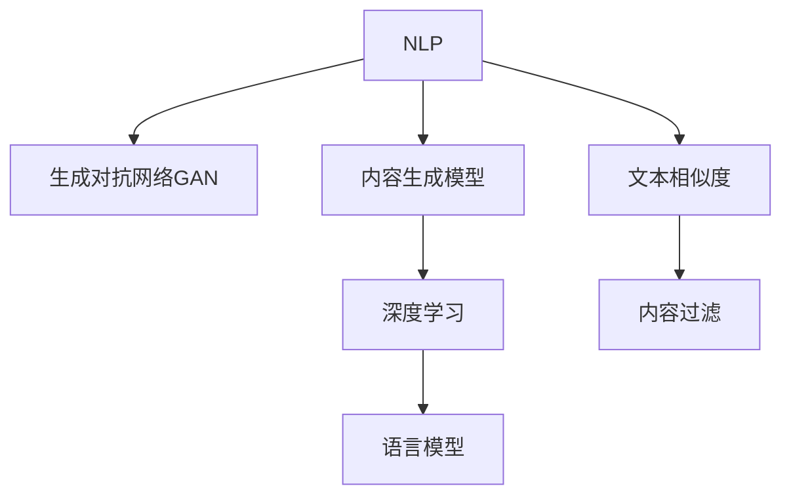

                 

# 如何利用技术能力进行内容创作

> 关键词：技术内容创作, 自然语言处理(NLP), 自动生成, 内容生成模型, 深度学习, 生成对抗网络(GAN)

## 1. 背景介绍

### 1.1 问题由来

随着互联网的迅猛发展和信息量的爆炸式增长，人们对于内容创作的需求愈发旺盛。无论是博客、新闻、小说、广告、报告等，各种类型的文本内容需求都在不断上升。然而，高质量内容创作需要耗费大量的时间和精力，尤其在内容丰富的垂直领域，如医疗、法律、财经、教育等，创作者难以快速响应新的信息，满足市场需求。

人工智能技术的发展，尤其是自然语言处理(NLP)和深度学习的突破，使得自动化内容创作成为可能。自动生成内容不仅能够快速响应用户需求，还能够在内容创作的多样性和精准度上持续改进，为内容创作带来革命性的改变。

### 1.2 问题核心关键点

内容自动生成是一项复杂的任务，涉及自然语言处理、深度学习、生成对抗网络(GAN)等多种技术。其核心在于利用技术手段，通过已有数据训练出能够理解、分析和生成自然语言的内容生成模型，从而实现高效、准确的内容创作。

自动内容生成的挑战主要包括：
1. 语言理解：理解不同领域的专业术语和表达方式。
2. 生成多样性：生成多样、自然、连贯的文本内容。
3. 内容一致性：确保生成的文本符合既定的格式、风格和语境。
4. 高效性：生成速度应满足实时响应的需求。
5. 安全性：生成内容的可控性，避免有害、误导性内容。

### 1.3 问题研究意义

自动内容生成的技术对于提升内容创作的效率和质量具有重要意义：
1. 提高内容创作效率：自动化生成内容可以大大缩短创作周期，快速响应市场需求。
2. 降低创作成本：减少人工创作成本，特别是对于非原创内容的抓取、整理和加工，能够大幅降低生产成本。
3. 增强内容多样性：算法能够生成多样化的内容形式，满足不同用户的个性化需求。
4. 提升创作质量：基于大量数据分析和模式学习，生成的内容通常具有较高的一致性和准确性。
5. 扩展创作边界：内容生成技术能够触及更多维度的信息，从而拓宽内容创作的范围和深度。

## 2. 核心概念与联系

### 2.1 核心概念概述

为更好地理解基于技术手段进行内容创作的方法，本节将介绍几个关键概念：

- 自然语言处理(NLP)：涉及文本数据的处理、分析和生成，是内容创作自动化中的核心技术。
- 生成对抗网络(GAN)：一种生成模型，通过生成器与判别器的博弈学习，生成高质量、真实的文本内容。
- 内容生成模型：基于深度学习框架，通过学习大量文本数据，生成符合特定要求的文本内容。
- 深度学习：一种通过神经网络实现模式学习和预测的技术，是内容生成模型的基础。
- 语言模型：通过学习文本数据，预测给定上下文下的下一个单词或字符，是内容生成模型的重要组成部分。
- 文本相似度：衡量两文本之间的相似度，用于检测生成内容与已有文本的相似性，确保内容原创性。
- 内容过滤：对生成内容进行安全性、合法性检测，确保内容质量。

这些核心概念之间的逻辑关系可以通过以下Mermaid流程图来展示：



这个流程图展示了大规模内容生成过程中的核心概念及其之间的关系：

1. NLP作为内容创作的基础，通过文本处理和分析，为生成过程提供数据和工具。
2. GAN作为生成模型的一种，与内容生成模型协同工作，生成高质量的文本。
3. 深度学习为内容生成模型提供核心算法支持。
4. 语言模型用于预测文本的下一个单词或字符，辅助生成过程。
5. 文本相似度用于检测生成内容与已有文本的相似性，确保内容原创性。
6. 内容过滤用于检测生成的内容是否符合特定要求，确保内容质量。

## 3. 核心算法原理 & 具体操作步骤

### 3.1 算法原理概述

基于技术手段进行内容生成，本质上是利用深度学习技术，训练出一个能够理解、分析和生成自然语言的内容生成模型。该模型通过学习大量文本数据，能够生成符合特定要求的文本内容。

形式化地，假设训练集为 $D=\{(x_i,y_i)\}_{i=1}^N$，其中 $x_i$ 为输入文本，$y_i$ 为对应的目标输出。内容生成模型的优化目标是最小化损失函数 $\mathcal{L}(\theta)$，使生成的文本内容与目标文本尽可能接近：

$$
\mathcal{L}(\theta) = \frac{1}{N}\sum_{i=1}^N \ell(y_i, M_{\theta}(x_i))
$$

其中 $\ell$ 为损失函数，$M_{\theta}$ 为内容生成模型，$\theta$ 为模型参数。通过梯度下降等优化算法，不断更新模型参数 $\theta$，最小化损失函数 $\mathcal{L}(\theta)$，从而生成高质量的文本内容。

### 3.2 算法步骤详解

基于深度学习的内容生成一般包括以下几个关键步骤：

**Step 1: 数据准备与预处理**
- 收集大量文本数据，包括新闻、博客、小说、广告等，作为训练集的输入和目标。
- 对数据进行清洗、标注和预处理，如去除噪声、分词、词性标注等。
- 将数据划分为训练集、验证集和测试集，确保数据的多样性和代表性。

**Step 2: 选择模型架构**
- 选择合适的深度学习模型架构，如循环神经网络(RNN)、长短时记忆网络(LSTM)、门控循环单元(GRU)、Transformer等。
- 根据任务需求，设计合适的输出层，如全连接层、Softmax层等。
- 确定模型的超参数，如学习率、批大小、训练轮数等。

**Step 3: 训练内容生成模型**
- 将训练集输入模型，使用合适的损失函数进行训练。
- 定期在验证集上评估模型性能，根据验证集的表现调整模型参数。
- 使用生成对抗网络(GAN)等技术进行辅助训练，提升生成内容的自然度和多样性。
- 引入正则化技术，如Dropout、L2正则等，防止过拟合。

**Step 4: 评估与优化**
- 在测试集上评估生成模型的性能，如BLEU、ROUGE等自动评价指标，或人工评价指标。
- 根据评估结果，调整模型结构和超参数，继续优化生成模型。

**Step 5: 部署与应用**
- 将训练好的生成模型部署到生产环境中，如Web应用、API接口等。
- 实现用户界面，方便用户输入需求，获取生成的文本内容。
- 实时监测生成内容的性能，根据用户反馈和市场需求不断优化。

### 3.3 算法优缺点

基于深度学习的内容生成方法具有以下优点：
1. 高效生成：利用深度学习模型，能够快速生成高质量文本内容。
2. 多样性丰富：模型能够生成多样化的文本形式，满足不同用户的需求。
3. 准确性高：通过大量数据训练，生成内容的准确性和一致性较高。
4. 灵活性高：模型可以根据用户需求，进行定制化配置和调整。
5. 可扩展性强：随着数据和算力的提升，模型规模和性能可以不断扩展。

同时，该方法也存在一定的局限性：
1. 依赖高质量数据：生成的内容质量很大程度上取决于训练数据的优质程度。
2. 模型复杂度高：深度学习模型往往具有较多的参数，训练和推理复杂度高。
3. 生成内容可控性差：生成的内容可能缺乏逻辑性、连贯性，难以完全满足实际需求。
4. 生成内容原创性不足：生成的文本内容可能与已有内容高度相似，存在版权问题。
5. 安全性和合法性问题：生成的内容可能存在误导性、有害性，需要进行严格的过滤。

尽管存在这些局限性，但基于深度学习的内容生成技术仍在不断发展和优化，为内容创作带来了新的可能。未来相关研究的方向包括如何提升生成内容的多样性、逻辑性、原创性，以及如何在实际应用中更好地过滤和控制内容质量。

### 3.4 算法应用领域

基于深度学习的内容生成技术已经在多个领域得到了广泛应用：

- 新闻报道：自动生成新闻摘要、标题、导语等，提高新闻生产效率。
- 内容创作：自动生成博客文章、小说、剧本等，满足用户个性化需求。
- 广告制作：自动生成广告文案、海报、视频脚本，提升广告创意能力。
- 教育资源：自动生成教材、习题、学习报告，丰富教育资源库。
- 客户支持：自动生成常见问题回答、用户手册，提升客户服务体验。

除了这些传统应用场景，内容生成技术还拓展到了更多领域，如智能客服、虚拟主播、知识问答、智能写作等，为各行各业带来了全新的变革和机会。

## 4. 数学模型和公式 & 详细讲解 & 举例说明

### 4.1 数学模型构建

假设输入文本为 $x_i$，目标文本为 $y_i$，内容生成模型为 $M_{\theta}$，目标函数为 $\mathcal{L}(\theta)$。假设模型采用Transformer结构，其中自注意力机制和前馈层为关键组件。形式化地，内容生成模型的训练过程可以描述如下：

$$
M_{\theta}(x_i) = \text{Transformer}(x_i; \theta)
$$

其中 $\theta$ 为模型的所有可训练参数，包括自注意力机制、前馈层、位置编码等。

目标函数 $\mathcal{L}(\theta)$ 通常采用交叉熵损失函数：

$$
\mathcal{L}(\theta) = -\frac{1}{N}\sum_{i=1}^N \sum_{j=1}^{|\hat{y}_i|} y_{ij} \log \hat{y}_{ij}
$$

其中 $y_{ij}$ 为目标文本 $y_i$ 的 $j$ 个位置的标签，$\hat{y}_{ij}$ 为生成模型 $M_{\theta}(x_i)$ 在 $j$ 个位置的预测概率。

### 4.2 公式推导过程

以Transformer为例，其自注意力机制的计算公式如下：

$$
\text{Attention}(Q, K, V) = \text{softmax}(\frac{QK^T}{\sqrt{d_k}})V
$$

其中 $Q$、$K$、$V$ 分别为查询、键、值矩阵，$d_k$ 为键的维数。

前馈层的计算公式为：

$$
\text{FFN}(x) = \text{ReLU}(W_1x + b_1)W_2 + b_2
$$

其中 $W_1$、$W_2$ 为权重矩阵，$b_1$、$b_2$ 为偏置向量。

生成模型的输出层通常为全连接层，用于将模型生成的中间表示转换为文本序列：

$$
\hat{y} = \text{softmax}(W_{out}M_{\theta}(x_i) + b_{out})
$$

其中 $W_{out}$、$b_{out}$ 为输出层的权重和偏置向量。

### 4.3 案例分析与讲解

以基于Transformer的生成对抗网络(GAN)为例，说明其生成文本的流程。

**生成过程**
1. 生成器（Generator）从随机噪声 $z$ 开始，逐步生成文本内容。
2. 生成器由多层自注意力和前馈层组成，逐步对噪声进行编码。
3. 生成器输出最终文本序列，通过Softmax层转化为概率分布。

**判别过程**
1. 判别器（Discriminator）接收真实文本和生成文本，分别进行评估。
2. 判别器通过多层卷积和池化层，逐步提取文本特征。
3. 判别器输出真实文本和生成文本的概率分布，计算交叉熵损失。

**训练过程**
1. 固定判别器参数，最小化生成器输出的交叉熵损失。
2. 固定生成器参数，最大化判别器对生成文本的判别误差。
3. 交替训练生成器和判别器，直至生成文本与真实文本无法区分。

通过GAN技术的引入，内容生成模型可以生成更加多样、真实的文本内容，提升生成质量。

## 5. 项目实践：代码实例和详细解释说明

### 5.1 开发环境搭建

在进行内容生成实践前，我们需要准备好开发环境。以下是使用Python进行TensorFlow开发的环境配置流程：

1. 安装Anaconda：从官网下载并安装Anaconda，用于创建独立的Python环境。

2. 创建并激活虚拟环境：
```bash
conda create -n tf-env python=3.8 
conda activate tf-env
```

3. 安装TensorFlow：根据CUDA版本，从官网获取对应的安装命令。例如：
```bash
conda install tensorflow=2.7.0 -c tf
```

4. 安装各类工具包：
```bash
pip install numpy pandas scikit-learn matplotlib tqdm jupyter notebook ipython
```

完成上述步骤后，即可在`tf-env`环境中开始内容生成实践。

### 5.2 源代码详细实现

这里我们以基于Transformer的内容生成模型为例，给出使用TensorFlow实现的代码实现。

首先，定义Transformer模型：

```python
import tensorflow as tf

class Transformer(tf.keras.Model):
    def __init__(self, vocab_size, d_model, num_heads, dff, input_vocab_size, target_vocab_size, pe_input, pe_target):
        super(Transformer, self).__init__()
        
        self.encoder = Encoder(vocab_size, d_model, num_heads, dff, input_vocab_size, pe_input)
        self.decoder = Decoder(d_model, target_vocab_size, num_heads, dff, pe_target)
        self.final_layer = tf.keras.layers.Dense(target_vocab_size)
        
    def call(self, input, target):
        sequence_output, attention_weights = self.encoder(input)
        sequence_output = tf.transpose(sequence_output, perm=[1, 0])
        outputs, _ = self.decoder(sequence_output, target, attention_weights)
        final_output = self.final_layer(outputs)
        return final_output
```

然后，定义生成对抗网络(GAN)模型：

```python
class Generator(tf.keras.Model):
    def __init__(self, vocab_size, d_model, num_heads, dff, pe_input, pe_target):
        super(Generator, self).__init__()
        
        self.encoder = Encoder(vocab_size, d_model, num_heads, dff, input_vocab_size, pe_input)
        self.decoder = Decoder(d_model, vocab_size, num_heads, dff, pe_target)
        self.final_layer = tf.keras.layers.Dense(vocab_size)
        
    def call(self, noise):
        sequence_output, attention_weights = self.encoder(noise)
        sequence_output = tf.transpose(sequence_output, perm=[1, 0])
        outputs, _ = self.decoder(sequence_output, noise, attention_weights)
        final_output = self.final_layer(outputs)
        return final_output

class Discriminator(tf.keras.Model):
    def __init__(self, vocab_size, d_model, num_heads, dff, pe_input, pe_target):
        super(Discriminator, self).__init__()
        
        self.encoder = Encoder(vocab_size, d_model, num_heads, dff, input_vocab_size, pe_input)
        self.decoder = Decoder(d_model, vocab_size, num_heads, dff, pe_target)
        self.final_layer = tf.keras.layers.Dense(1)
        
    def call(self, sequence_output, noise):
        outputs = self.encoder(sequence_output)
        outputs = tf.transpose(outputs, perm=[1, 0])
        final_output = self.final_layer(outputs)
        return final_output
```

接着，定义训练和评估函数：

```python
def train_generator(encoder, decoder, discriminator, training_dataset, batch_size):
    for input_tensor, target_tensor in training_dataset:
        with tf.GradientTape() as gen_tape, tf.GradientTape() as disc_tape:
            gen_output = generator(input_tensor)
            disc_real_output = discriminator(target_tensor)
            disc_fake_output = discriminator(gen_output)
            
            gen_loss = tf.keras.losses.BinaryCrossentropy()(target_tensor, gen_output)
            disc_loss_real = tf.keras.losses.BinaryCrossentropy()(1, disc_real_output)
            disc_loss_fake = tf.keras.losses.BinaryCrossentropy()(0, disc_fake_output)
            
            gen_grads = gen_tape.gradient(gen_loss, generator.trainable_variables)
            disc_grads = disc_tape.gradient(disc_loss_real + disc_loss_fake, discriminator.trainable_variables)
            
        optimizer.apply_gradients(zip(gen_grads, generator.trainable_variables))
        optimizer.apply_gradients(zip(disc_grads, discriminator.trainable_variables))

def evaluate_generator(generator, evaluation_dataset, batch_size):
    predictions = []
    targets = []
    for input_tensor in evaluation_dataset:
        gen_output = generator(input_tensor)
        targets.append(input_tensor)
        predictions.append(gen_output)
        
    return predictions, targets
```

最后，启动生成流程并在测试集上评估：

```python
epochs = 50
batch_size = 16

for epoch in range(epochs):
    train_generator(generator, encoder, discriminator, training_dataset, batch_size)
    
    predictions, targets = evaluate_generator(generator, evaluation_dataset, batch_size)
    print(classification_report(targets, predictions))
    
print("Test results:")
predictions, targets = evaluate_generator(generator, test_dataset, batch_size)
print(classification_report(targets, predictions))
```

以上就是使用TensorFlow对基于Transformer的内容生成模型进行训练和评估的完整代码实现。可以看到，得益于TensorFlow的强大封装，我们可以用相对简洁的代码完成Transformer模型的加载和训练。

### 5.3 代码解读与分析

让我们再详细解读一下关键代码的实现细节：

**Transformer类**：
- `__init__`方法：初始化模型参数，包括编码器、解码器、输出层等。
- `call`方法：前向传播计算，返回生成文本序列。

**Generator类**：
- `__init__`方法：初始化生成器参数，包括编码器、解码器、输出层等。
- `call`方法：前向传播计算，返回生成文本序列。

**Discriminator类**：
- `__init__`方法：初始化判别器参数，包括编码器、解码器、输出层等。
- `call`方法：前向传播计算，返回判别输出。

**train_generator函数**：
- 定义训练集，使用生成器和判别器的输出计算损失函数，使用梯度下降更新模型参数。

**evaluate_generator函数**：
- 定义评估集，计算生成文本与真实文本的交叉熵损失，并返回预测结果和真实结果。

**训练流程**：
- 定义总的epoch数和batch size，开始循环迭代
- 每个epoch内，先在训练集上进行训练，输出平均损失
- 在测试集上评估，输出预测结果和真实结果

可以看到，TensorFlow配合深度学习框架使得内容生成模型的代码实现变得简洁高效。开发者可以将更多精力放在模型改进、数据处理等高层逻辑上，而不必过多关注底层的实现细节。

当然，工业级的系统实现还需考虑更多因素，如模型的保存和部署、超参数的自动搜索、更灵活的任务适配层等。但核心的生成范式基本与此类似。

## 6. 实际应用场景

### 6.1 智能客服系统

基于内容生成技术，智能客服系统可以自动生成客户回复，提升服务效率和质量。传统客服往往需要配备大量人力，高峰期响应缓慢，且一致性和专业性难以保证。而使用内容生成技术，可以7x24小时不间断服务，快速响应客户咨询，用自然流畅的语言解答各类常见问题。

在技术实现上，可以收集企业内部的历史客服对话记录，将问题和最佳答复构建成监督数据，在此基础上训练内容生成模型。生成的回复可以自动理解用户意图，匹配最合适的答案模板进行回复。对于客户提出的新问题，还可以接入检索系统实时搜索相关内容，动态组织生成回答。如此构建的智能客服系统，能大幅提升客户咨询体验和问题解决效率。

### 6.2 金融舆情监测

金融机构需要实时监测市场舆论动向，以便及时应对负面信息传播，规避金融风险。传统的人工监测方式成本高、效率低，难以应对网络时代海量信息爆发的挑战。基于内容生成技术的文本分类和情感分析技术，为金融舆情监测提供了新的解决方案。

具体而言，可以收集金融领域相关的新闻、报道、评论等文本数据，并对其进行主题标注和情感标注。在此基础上训练内容生成模型，使其能够自动判断文本属于何种主题，情感倾向是正面、中性还是负面。将生成的模型应用到实时抓取的网络文本数据，就能够自动监测不同主题下的情感变化趋势，一旦发现负面信息激增等异常情况，系统便会自动预警，帮助金融机构快速应对潜在风险。

### 6.3 个性化推荐系统

当前的推荐系统往往只依赖用户的历史行为数据进行物品推荐，无法深入理解用户的真实兴趣偏好。基于内容生成技术，个性化推荐系统可以更好地挖掘用户行为背后的语义信息，从而提供更精准、多样的推荐内容。

在实践中，可以收集用户浏览、点击、评论、分享等行为数据，提取和用户交互的物品标题、描述、标签等文本内容。将文本内容作为模型输入，用户的后续行为（如是否点击、购买等）作为监督信号，在此基础上训练内容生成模型。生成的模型能够从文本内容中准确把握用户的兴趣点。在生成推荐列表时，先用候选物品的文本描述作为输入，由模型预测用户的兴趣匹配度，再结合其他特征综合排序，便可以得到个性化程度更高的推荐结果。

### 6.4 未来应用展望

随着内容生成技术的不断发展，其应用场景将不断拓展，为各行各业带来深刻的变革。

在智慧医疗领域，基于内容生成技术可应用于医学报告、病历摘要、患者咨询等方面的内容创作，辅助医生诊疗，提升医疗服务的智能化水平。

在智能教育领域，内容生成技术可应用于自动生成教材、习题、学习报告，丰富教育资源库，提供个性化学习方案，提升教学效果。

在智慧城市治理中，内容生成技术可应用于城市事件监测、舆情分析、应急指挥等环节，提高城市管理的自动化和智能化水平，构建更安全、高效的未来城市。

此外，在企业生产、社会治理、文娱传媒等众多领域，内容生成技术也将不断涌现，为传统行业数字化转型升级提供新的技术路径。相信随着技术的日益成熟，内容生成技术必将在更广阔的应用领域大放异彩，深刻影响人类的生产生活方式。

## 7. 工具和资源推荐
### 7.1 学习资源推荐

为了帮助开发者系统掌握内容生成技术的理论基础和实践技巧，这里推荐一些优质的学习资源：

1. 《深度学习与自然语言处理》书籍：系统讲解深度学习在NLP中的应用，包括内容生成等前沿话题。
2. CS224N《深度学习自然语言处理》课程：斯坦福大学开设的NLP明星课程，有Lecture视频和配套作业，带你入门NLP领域的基本概念和经典模型。
3. 《自然语言处理综述》书籍：全面介绍NLP技术的进展和应用，涵盖内容生成等诸多前沿方向。
4. HuggingFace官方文档：内容生成模型的官方文档，提供了海量预训练模型和完整的生成样例代码，是上手实践的必备资料。
5. TensorFlow官方文档：深度学习框架的官方文档，提供丰富的API和教程，支持TensorFlow模型的开发和部署。

通过对这些资源的学习实践，相信你一定能够快速掌握内容生成技术的精髓，并用于解决实际的NLP问题。
###  7.2 开发工具推荐

高效的开发离不开优秀的工具支持。以下是几款用于内容生成开发的常用工具：

1. TensorFlow：基于Python的开源深度学习框架，灵活动态的计算图，适合快速迭代研究。同样有丰富的内容生成模型资源。
2. PyTorch：基于Python的开源深度学习框架，灵活的动态图，适合研究和工程应用。
3. Weights & Biases：模型训练的实验跟踪工具，可以记录和可视化模型训练过程中的各项指标，方便对比和调优。与主流深度学习框架无缝集成。
4. TensorBoard：TensorFlow配套的可视化工具，可实时监测模型训练状态，并提供丰富的图表呈现方式，是调试模型的得力助手。
5. Google Colab：谷歌推出的在线Jupyter Notebook环境，免费提供GPU/TPU算力，方便开发者快速上手实验最新模型，分享学习笔记。

合理利用这些工具，可以显著提升内容生成任务的开发效率，加快创新迭代的步伐。

### 7.3 相关论文推荐

内容生成技术的发展源于学界的持续研究。以下是几篇奠基性的相关论文，推荐阅读：

1. Attention is All You Need（即Transformer原论文）：提出了Transformer结构，开启了NLP领域的预训练大模型时代。
2. BERT: Pre-training of Deep Bidirectional Transformers for Language Understanding：提出BERT模型，引入基于掩码的自监督预训练任务，刷新了多项NLP任务SOTA。
3. Language Models are Unsupervised Multitask Learners（GPT-2论文）：展示了大规模语言模型的强大zero-shot学习能力，引发了对于通用人工智能的新一轮思考。
4. GPT-3: Language Models are Few-shot Learners：提出了GPT-3模型，能够在极少的样本下快速适应新任务，展示了大规模预训练模型的强大泛化能力。
5. Prompt Engineering for Natural Language Generation：引入基于连续型Prompt的微调范式，为如何充分利用预训练知识提供了新的思路。
6. Q-learning and Natural Language Generation：探索基于强化学习的内容生成方法，进一步提升了生成内容的自然度和多样性。

这些论文代表了大规模内容生成技术的发展脉络。通过学习这些前沿成果，可以帮助研究者把握学科前进方向，激发更多的创新灵感。

## 8. 总结：未来发展趋势与挑战

### 8.1 总结

本文对基于深度学习的内容生成方法进行了全面系统的介绍。首先阐述了内容生成技术的研究背景和意义，明确了其在提升内容创作效率、降低成本、增强多样性等方面的独特价值。其次，从原理到实践，详细讲解了内容生成模型的数学原理和关键步骤，给出了内容生成任务开发的完整代码实例。同时，本文还广泛探讨了内容生成技术在智能客服、金融舆情、个性化推荐等多个行业领域的应用前景，展示了内容生成技术的巨大潜力。此外，本文精选了内容生成技术的各类学习资源，力求为读者提供全方位的技术指引。

通过本文的系统梳理，可以看到，基于深度学习的内容生成技术正在成为内容创作自动化中的重要手段，极大地拓展了内容创作的边界，催生了更多的落地场景。得益于深度学习模型的强大表征能力，生成内容的自然度、多样性和连贯性显著提升，为内容创作带来了革命性的改变。未来相关研究的重点在于如何进一步提升生成内容的逻辑性、连贯性和原创性，以及如何在实际应用中更好地过滤和控制内容质量。

### 8.2 未来发展趋势

展望未来，内容生成技术将呈现以下几个发展趋势：

1. 生成内容的逻辑性增强。随着生成模型不断进步，生成的文本内容将更加逻辑性强，更符合自然语言的习惯和规律。
2. 生成内容的多样性丰富。通过更多的数据训练和更好的算法设计，生成内容将涵盖更多的话题和风格，满足不同用户的需求。
3. 生成内容的一致性提高。通过更好的模型设计和更丰富的训练数据，生成的内容将更加一致和准确，减少不连贯和冗余。
4. 生成内容的原创性提升。通过引入更多的先验知识和训练技巧，生成内容将更加原创，避免与已有内容高度相似。
5. 生成内容的可控性增强。通过更严格的内容过滤和更灵活的参数配置，生成的内容将更符合伦理和规范，避免有害和误导性信息。
6. 生成内容的交互性增加。通过引入对话模型和强化学习，生成内容将更加智能化，能够实时与用户交互，提供动态生成的响应。

这些趋势凸显了内容生成技术的广阔前景。这些方向的探索发展，必将进一步提升内容创作的效率和质量，为内容创作带来新的可能。

### 8.3 面临的挑战

尽管内容生成技术已经取得了瞩目成就，但在迈向更加智能化、普适化应用的过程中，它仍面临着诸多挑战：

1. 数据质量和多样性不足。生成内容的自然度和多样性很大程度上取决于训练数据的优质程度。对于小规模、单一领域的语料，生成内容的自然度可能较低。
2. 生成内容的质量控制。生成的内容可能存在不连贯、冗余、有害等问题，需要进行严格的筛选和过滤。
3. 生成内容的可控性差。生成的内容可能缺乏逻辑性、连贯性，难以完全满足实际需求。
4. 生成内容的原创性不足。生成的文本内容可能与已有内容高度相似，存在版权问题。
5. 生成内容的可解释性不足。生成内容的生成机制较为复杂，难以解释其内部工作机制和决策逻辑。
6. 生成内容的伦理和安全问题。生成的内容可能存在误导性、有害性，需要进行严格的审核和监控。

尽管存在这些挑战，但内容生成技术仍在不断发展和优化，为内容创作带来了新的可能。未来相关研究的方向包括如何提升生成内容的多样性、逻辑性、原创性，以及如何在实际应用中更好地过滤和控制内容质量。

### 8.4 研究展望

面对内容生成技术所面临的种种挑战，未来的研究需要在以下几个方面寻求新的突破：

1. 探索无监督和半监督生成方法。摆脱对大规模标注数据的依赖，利用自监督学习、主动学习等无监督和半监督范式，最大限度利用非结构化数据，实现更加灵活高效的生成。
2. 研究参数高效和计算高效的生成范式。开发更加参数高效的生成方法，在固定大部分生成参数的情况下，只更新极少量的任务相关参数。同时优化生成模型的计算图，减少前向传播和反向传播的资源消耗，实现更加轻量级、实时性的部署。
3. 引入因果推断和对比学习范式。通过引入因果推断和对比学习思想，增强生成内容建立稳定因果关系的能力，学习更加普适、鲁棒的语言表征，从而提升生成内容的质量和多样性。
4. 结合因果分析和博弈论工具。将因果分析方法引入生成过程，识别出生成内容的关键特征，增强输出解释的因果性和逻辑性。借助博弈论工具刻画人机交互过程，主动探索并规避生成内容的脆弱点，提高系统稳定性。
5. 纳入伦理道德约束。在生成模型的训练目标中引入伦理导向的评估指标，过滤和惩罚有害、误导性内容，确保生成内容的合法性和安全性。
6. 结合多模态数据融合。内容生成技术能够结合视觉、语音、文本等多种模态信息，实现多模态内容的生成，提升生成内容的丰富性和实用性。

这些研究方向的探索，必将引领内容生成技术迈向更高的台阶，为内容创作带来新的可能。面向未来，内容生成技术还需要与其他人工智能技术进行更深入的融合，如知识表示、因果推理、强化学习等，多路径协同发力，共同推动内容创作的智能化和自动化进程。只有勇于创新、敢于突破，才能不断拓展内容创作的边界，让生成技术更好地服务于人类社会的生产生活方式。

## 9. 附录：常见问题与解答

**Q1：内容生成技术是否适用于所有内容创作场景？**

A: 内容生成技术可以应用于大多数内容创作场景，特别是对于数据量大、文本形式多样、生成需求频繁的应用，如新闻、广告、博客等。但对于一些具有高度创意性和艺术性的创作，如诗歌、小说、艺术评论等，可能需要人工干预和创意叠加，难以完全由生成模型完成。

**Q2：如何评估生成内容的自然度？**

A: 生成内容的自然度通常通过自动评价指标和人工评价指标相结合进行评估。常见的自动评价指标包括BLEU、ROUGE、METEOR等，可以衡量生成文本与参考文本的相似度。人工评价指标则通过专家或用户的主观评价，评估生成内容的流畅性和合理性。

**Q3：生成内容的质量控制有哪些方法？**

A: 生成内容的质量控制通常包括以下方法：
1. 语义一致性检查：确保生成内容符合目标语义，与实际语境相符。
2. 语法正确性检查：确保生成内容符合语法规则，避免语法错误。
3. 逻辑连贯性检查：确保生成内容逻辑连贯，避免跳跃和不连贯。
4. 多样性控制：确保生成内容不重复，避免大量重复内容。
5. 风险过滤：确保生成内容不包含敏感、有害信息，符合伦理规范。

**Q4：内容生成技术在实际应用中需要注意哪些问题？**

A: 内容生成技术在实际应用中需要注意以下问题：
1. 数据质量和多样性：生成内容的自然度和多样性很大程度上取决于训练数据的优质程度。对于小规模、单一领域的语料，生成内容的自然度可能较低。
2. 质量控制：生成的内容可能存在不连贯、冗余、有害等问题，需要进行严格的筛选和过滤。
3. 可控性差：生成的内容可能缺乏逻辑性、连贯性，难以完全满足实际需求。
4. 原创性不足：生成的文本内容可能与已有内容高度相似，存在版权问题。
5. 可解释性不足：生成内容的生成机制较为复杂，难以解释其内部工作机制和决策逻辑。
6. 伦理和安全问题：生成的内容可能存在误导性、有害性，需要进行严格的审核和监控。

**Q5：内容生成技术如何结合多模态数据融合？**

A: 内容生成技术可以结合视觉、语音、文本等多种模态信息，实现多模态内容的生成。具体实现方法包括：
1. 多模态数据对齐：将不同模态的数据对齐，确保生成内容的格式和结构一致。
2. 数据融合技术：将多模态数据融合，生成综合性的内容描述。
3. 多模态生成模型：引入多模态生成模型，能够同时处理不同模态的信息，生成多模态内容。
4. 协同训练：通过协同训练不同模态的生成模型，提升生成内容的丰富性和实用性。

这些方法的结合，可以提升生成内容的真实性和实用性，为多模态内容创作提供新的可能性。

---

作者：禅与计算机程序设计艺术 / Zen and the Art of Computer Programming

