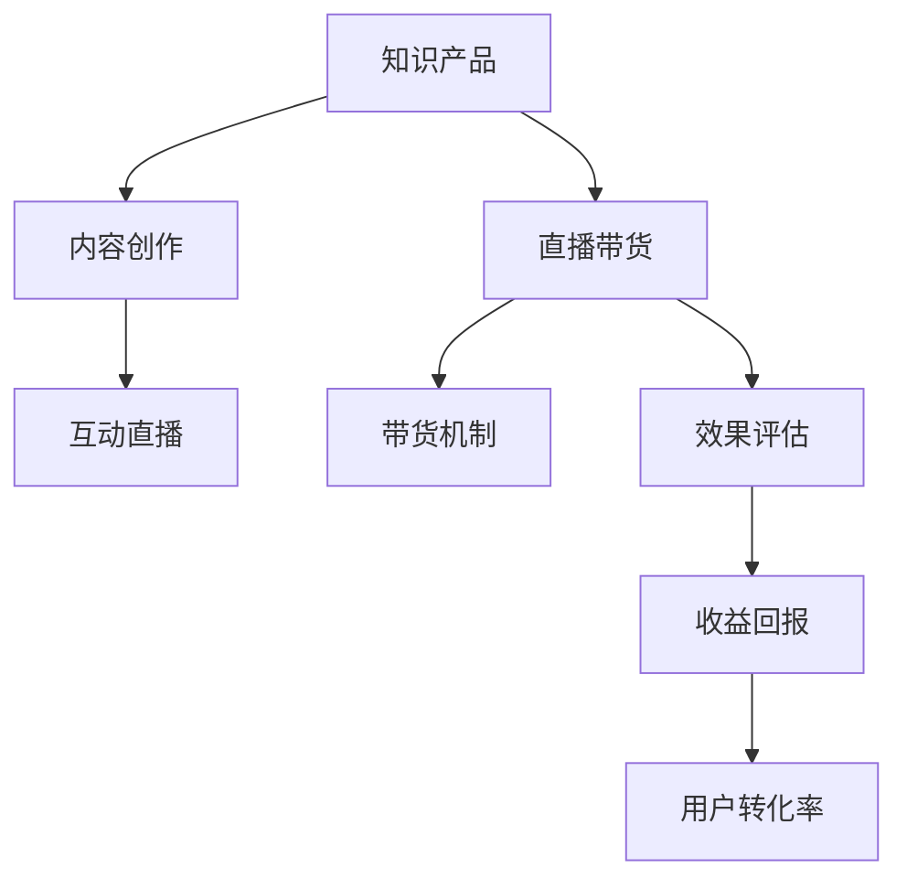

                 

## 1. 背景介绍

在数字经济的大背景下，知识产品的变现方式正在发生深刻的变革。传统的书籍、课程等知识产品，面临着市场空间饱和、用户转化率低、内容易被剽窃等挑战。为了适应新时代的发展需求，利用直播带货等新兴形式来变现知识产品，成为了一个崭新的尝试。直播带货以其互动性强、用户粘性高、转化效率高等特点，正在迅速成为知识变现的重要渠道。

直播带货的兴起，离不开互联网技术的发展和社交媒体的崛起。通过直播平台，主播可以实时与观众互动，向他们传递知识内容，同时引入带货机制，实现知识变现。这一模式不仅开辟了知识产品新的销售渠道，还为内容创作者提供了更为直接和灵活的变现途径。

### 1.1 问题的由来
随着互联网和社交媒体的普及，内容消费的形式和渠道不断演进。视频、音频、直播等新兴媒介形式，为知识传播提供了新的载体和平台。然而，这些新兴形式也带来了新的挑战：内容创作者如何利用新兴渠道来传递知识，同时实现有效的变现？

直播带货作为一种新型变现方式，成为众多内容创作者探索的方向。直播带货不仅能够提供实时的互动体验，还能利用带货机制，将产品销售与知识内容深度结合，创造更高的商业价值。

### 1.2 问题核心关键点
直播带货的关键点在于如何构建知识内容与带货机制的有机结合，实现知识的有效传递和价值的最大化。具体来说，包括以下几个关键方面：

- **内容创作**：如何设计吸引人的知识内容，使其既能满足观众的学习需求，又能激发购买兴趣。
- **直播互动**：如何通过直播平台与观众进行有效互动，提升用户粘性和参与度。
- **带货机制**：如何在直播中巧妙地引入产品信息，推动观众的购买决策。
- **效果评估**：如何衡量直播带货的效果，包括用户转化率、收益回报等关键指标。

### 1.3 问题研究意义
直播带货不仅为知识产品变现提供了新的可能性，还促进了知识传播和商业活动的有机结合。研究直播带货的知识变现模式，对于拓展内容创作的变现途径，提升知识产品的市场竞争力，具有重要意义。同时，直播带货模式也为传统内容创作者转型提供了新思路，有助于推动内容产业的数字化转型和升级。

## 2. 核心概念与联系

### 2.1 核心概念概述

为了更好地理解直播带货的知识变现模式，我们首先介绍几个核心概念及其相互之间的联系：

- **知识产品**：指以知识和信息为核心内容的产品，包括电子书、在线课程、技术博客等形式。
- **直播带货**：指通过直播平台，结合知识内容与带货机制，向观众销售产品的一种新型商业模式。
- **内容创作**：指设计和制作吸引人的知识内容，满足观众学习需求的过程。
- **互动直播**：指通过直播平台与观众实时互动，提升用户粘性和参与度的方式。
- **带货机制**：指在直播中巧妙引入产品信息，激发观众购买兴趣的策略。
- **效果评估**：指衡量直播带货效果的关键指标，如用户转化率、收益回报等。

这些核心概念之间的联系可以通过以下Mermaid流程图来展示：



这个流程图展示了大语言模型的核心概念及其之间的联系：

1. 知识产品通过内容创作获得内容，内容创作的目的是满足观众的学习需求。
2. 内容创作通过直播带货的方式进行变现，直播带货的方式包括知识内容的传递和带货机制的引入。
3. 直播带货通过互动直播的形式提升用户粘性，互动直播的目的是增强观众的参与度和互动体验。
4. 带货机制在直播中巧妙引入产品信息，激发观众的购买兴趣。
5. 效果评估衡量直播带货的实际效果，包括收益回报和用户转化率等关键指标。

这些核心概念共同构成了直播带货的知识变现框架，使其能够在各种场景下发挥作用。通过理解这些核心概念，我们可以更好地把握直播带货的工作原理和优化方向。

## 3. 核心算法原理 & 具体操作步骤
### 3.1 算法原理概述

直播带货的知识变现模式，本质上是一个内容驱动的电商转化过程。其核心思想是：通过精心设计的知识内容，吸引观众进入直播平台，通过互动直播增强用户粘性，再通过带货机制引导观众进行购买决策，最终实现知识内容的变现。

具体而言，直播带货的知识变现过程包括以下几个关键步骤：

1. **内容创作**：设计吸引人的知识内容，满足观众的学习需求。
2. **直播互动**：通过互动直播增强用户粘性和参与度。
3. **带货机制**：巧妙引入产品信息，激发观众的购买兴趣。
4. **效果评估**：衡量直播带货的效果，调整策略提升收益。

### 3.2 算法步骤详解

以下是对直播带货知识变现模式的具体步骤详解：

**Step 1: 内容创作**

内容创作是直播带货的起点，决定着观众的吸引力和参与度。内容创作的关键在于：

- **选题策划**：选择观众感兴趣的主题，结合当前热点话题，吸引观众注意力。
- **内容设计**：设计系统性、趣味性的知识内容，满足观众的学习需求。
- **多媒体制作**：使用视频、音频、图文等多媒体形式，增强内容的表现力。

**Step 2: 直播互动**

直播互动是提升用户粘性的关键环节，通过互动增强观众的参与感。直播互动的策略包括：

- **实时互动**：通过提问、投票、评论等方式，与观众实时互动，增强互动性。
- **观众参与**：邀请观众参与话题讨论、知识竞赛等活动，提升参与度。
- **直播预告**：提前预告直播内容，吸引观众进入直播间，提高观看率。

**Step 3: 带货机制**

带货机制是直播变现的核心，通过巧妙引入产品信息，激发观众的购买兴趣。带货机制的设计包括：

- **产品展示**：精选与知识内容相关的产品，进行详细的展示和介绍。
- **优惠活动**：推出限时优惠、满减等活动，增加购买吸引力。
- **互动环节**：在直播中穿插互动问答、抽奖等环节，引导观众购买。

**Step 4: 效果评估**

效果评估是衡量直播带货效果的重要环节，通过数据分析和反馈调整策略。效果评估的指标包括：

- **用户转化率**：衡量观众的购买转化率，评估直播带货的效果。
- **收益回报**：计算直播带货的净收益，评估变现效率。
- **观众反馈**：收集观众的评论和反馈，调整内容创作和互动策略。

### 3.3 算法优缺点

直播带货的知识变现模式具有以下优点：

- **互动性强**：通过实时互动，增强观众的参与感和粘性，提高用户转化率。
- **转化效率高**：利用带货机制，将产品销售与知识内容深度结合，实现高效变现。
- **灵活性高**：主播可以根据观众的反馈和互动，灵活调整内容和策略。

同时，直播带货模式也存在一些缺点：

- **内容创作要求高**：需要高质量的内容创作，才能吸引观众进入直播间。
- **技术门槛高**：直播平台对技术要求较高，需要主播具备一定的技术能力和平台操作经验。
- **品牌和信任度风险**：观众对主播和平台品牌有一定依赖，品牌信任度不够可能导致购买决策偏差。

### 3.4 算法应用领域

直播带货的知识变现模式，已经在多个领域得到了广泛应用，包括但不限于：

- **教育培训**：利用直播带货，将在线课程与产品销售相结合，提升课程的吸引力。
- **科技产品**：通过直播带货，推广新技术、新产品，提高用户兴趣和购买率。
- **健康生活**：结合健康知识直播，销售健康产品，满足观众的健康需求。
- **美容时尚**：通过直播带货，推广美容护肤品、时尚服饰等产品，提升观众的购买兴趣。
- **文化娱乐**：利用直播带货，销售图书、文创产品等，丰富观众的文化娱乐体验。

## 4. 数学模型和公式 & 详细讲解  
### 4.1 数学模型构建

为了更好地量化直播带货的效果，我们可以建立以下数学模型：

设直播带货效果为 $E$，用户转化率为 $C$，收益回报为 $R$，则有：

$$ E = f(C, R) $$

其中 $f$ 为影响因素函数，包括用户转化率和收益回报等。

在实际操作中，我们可以通过以下公式计算直播带货效果：

$$ E = C \times R \times k $$

其中 $k$ 为调整系数，根据直播的具体情况进行调整。

### 4.2 公式推导过程

以上公式的推导基于以下假设：

- **转化率影响**：用户转化率越高，直播带货的效果越好。
- **收益回报影响**：收益回报越高，直播带货的效果越好。
- **调整系数影响**：根据直播的实际情况，进行效果调整。

通过以上公式，我们可以对直播带货的效果进行量化评估，调整策略以提升效果。

### 4.3 案例分析与讲解

以下是一个实际的案例分析：

假设某在线教育机构通过直播带货销售课程。设用户转化率为 $C=20\%$，收益回报为 $R=500$，则直播带货效果为：

$$ E = 0.2 \times 500 \times 1 = 100 $$

如果根据观众反馈和互动情况，将调整系数 $k$ 调整为 $1.2$，则新的直播带货效果为：

$$ E = 0.2 \times 500 \times 1.2 = 120 $$

通过调整系数，可以灵活调整直播带货效果，更好地满足观众和机构的需求。

## 5. 项目实践：代码实例和详细解释说明
### 5.1 开发环境搭建

在进行直播带货项目实践前，我们需要准备好开发环境。以下是使用Python进行Flask开发的环境配置流程：

1. 安装Anaconda：从官网下载并安装Anaconda，用于创建独立的Python环境。

2. 创建并激活虚拟环境：
```bash
conda create -n pyflask-env python=3.8 
conda activate pyflask-env
```

3. 安装Flask：
```bash
pip install flask
```

4. 安装其他工具包：
```bash
pip install requests numpy pandas
```

完成上述步骤后，即可在`pyflask-env`环境中开始直播带货项目的开发。

### 5.2 源代码详细实现

以下是使用Flask框架实现直播带货项目的代码实现：

```python
from flask import Flask, request, render_template
import requests

app = Flask(__name__)

@app.route('/')
def index():
    return render_template('index.html')

@app.route('/getproduct', methods=['GET'])
def get_product():
    product_id = request.args.get('product_id')
    response = requests.get(f'https://example.com/api/products/{product_id}')
    data = response.json()
    return data

@app.route('/callback', methods=['POST'])
def callback():
    product_id = request.form.get('product_id')
    response = requests.get(f'https://example.com/api/orders/{product_id}')
    data = response.json()
    return data

if __name__ == '__main__':
    app.run(debug=True)
```

### 5.3 代码解读与分析

让我们再详细解读一下关键代码的实现细节：

**Flask框架**：
- 使用Flask框架搭建Web应用，提供GET和POST请求的处理。
- GET请求用于获取产品信息，POST请求用于提交购买订单。

**路由配置**：
- `/` 路由：提供首页，渲染 `index.html` 页面。
- `/getproduct` 路由：处理获取产品信息的请求，返回JSON格式的产品数据。
- `/callback` 路由：处理购买订单的请求，返回订单处理结果。

**API调用**：
- 使用 `requests` 库调用外部API，获取产品信息和订单处理结果。

通过以上代码，可以构建一个简单的直播带货Web应用，实现产品展示和订单提交的功能。

### 5.4 运行结果展示

运行上述代码后，可以通过浏览器访问应用首页，查看产品信息并提交订单。

## 6. 实际应用场景
### 6.1 在线教育

在线教育机构可以通过直播带货，结合课程内容销售相关书籍、笔记本、教学工具等产品，提升课程的吸引力和用户体验。主播可以通过互动直播，展示课程内容，介绍相关产品，激发学生的购买兴趣。

### 6.2 科技产品

科技企业可以利用直播带货，推广新技术、新产品，提高用户兴趣和购买率。主播可以介绍产品的功能特点、使用场景等，通过互动直播增强用户体验，推动产品销售。

### 6.3 健康生活

健康生活品牌可以通过直播带货，销售健康食品、护肤品、运动器材等产品，满足用户对健康生活的需求。主播可以分享健康知识，推广相关产品，提升用户购买意愿。

### 6.4 美容时尚

美容时尚品牌可以通过直播带货，销售化妆品、时尚服饰、美妆工具等产品，丰富用户的日常生活。主播可以展示产品使用效果，解答用户疑问，提高用户购买决策。

### 6.5 文化娱乐

文化娱乐品牌可以通过直播带货，销售图书、文创产品、艺术品等产品，丰富用户文化娱乐体验。主播可以分享文化知识，推广相关产品，提升用户文化消费。

## 7. 工具和资源推荐
### 7.1 学习资源推荐

为了帮助开发者系统掌握直播带货的知识变现理论基础和实践技巧，这里推荐一些优质的学习资源：

1. **《直播带货实战指南》**：深入浅出地介绍了直播带货的理论和实践技巧，提供了丰富的案例分析。

2. **《内容电商的崛起》**：分析了内容电商的发展历程和未来趋势，探讨了直播带货在内容电商中的应用。

3. **《社交媒体营销》**：介绍社交媒体营销的理论和实践，包括直播带货的策略和技巧。

4. **《用户体验设计》**：探讨用户体验设计的原则和方法，提升直播带货的用户体验。

5. **《直播带货工具和平台》**：推荐了常用的直播带货工具和平台，提供了实战操作指南。

通过对这些资源的学习实践，相信你一定能够快速掌握直播带货的知识变现模式，并用于解决实际的直播带货问题。

### 7.2 开发工具推荐

高效的开发离不开优秀的工具支持。以下是几款用于直播带货开发的常用工具：

1. **Flask**：基于Python的开源Web框架，简单易用，支持RESTful API开发。

2. **requests**：用于HTTP请求的Python库，支持GET和POST请求，方便API调用。

3. **numpy**：用于科学计算的Python库，支持数组操作和数学运算。

4. **pandas**：用于数据处理的Python库，支持数据清洗、转换和分析。

5. **TensorBoard**：TensorFlow配套的可视化工具，用于实时监测模型训练状态，呈现模型性能。

6. **Weights & Biases**：模型训练的实验跟踪工具，记录和可视化模型训练过程中的各项指标，方便对比和调优。

合理利用这些工具，可以显著提升直播带货项目的开发效率，加快创新迭代的步伐。

### 7.3 相关论文推荐

直播带货的知识变现模式，源于学界的持续研究。以下是几篇奠基性的相关论文，推荐阅读：

1. **《内容电商的崛起》**：分析了内容电商的发展历程和未来趋势，探讨了直播带货在内容电商中的应用。

2. **《直播带货的商业价值》**：从经济学的角度，分析了直播带货的商业价值和市场潜力。

3. **《社交媒体营销》**：介绍社交媒体营销的理论和实践，包括直播带货的策略和技巧。

4. **《用户体验设计》**：探讨用户体验设计的原则和方法，提升直播带货的用户体验。

5. **《社交媒体营销》**：分析了社交媒体营销的理论和实践，探讨了直播带货的策略和技巧。

这些论文代表了大语言模型微调技术的发展脉络。通过学习这些前沿成果，可以帮助研究者把握学科前进方向，激发更多的创新灵感。

## 8. 总结：未来发展趋势与挑战
### 8.1 总结

本文对直播带货的知识变现模式进行了全面系统的介绍。首先阐述了直播带货的背景和意义，明确了直播带货在知识产品变现中的独特价值。其次，从原理到实践，详细讲解了直播带货的数学模型和具体操作步骤，给出了直播带货项目开发的完整代码实例。同时，本文还广泛探讨了直播带货在多个领域的应用场景，展示了直播带货模式的多样性和实用性。

通过本文的系统梳理，可以看到，直播带货的知识变现模式正在成为知识产品变现的重要渠道，极大地拓展了内容创作的变现途径，提升了知识产品的市场竞争力。未来，伴随直播带货技术的不断演进，相信知识产品变现将更加高效、灵活和多样化。

### 8.2 未来发展趋势

展望未来，直播带货的知识变现模式将呈现以下几个发展趋势：

1. **技术融合**：直播带货将与其他新兴技术（如AR、VR、区块链等）深度融合，提供更加丰富、沉浸的用户体验。

2. **跨平台运营**：直播带货将在多个平台（如抖音、快手、淘宝等）展开，实现跨平台用户覆盖和流量互通。

3. **个性化推荐**：利用大数据和机器学习技术，实现个性化内容推荐，提升用户体验和转化率。

4. **虚拟主播**：采用虚拟主播技术，提供更加稳定、专业的直播服务，降低人力成本。

5. **社交电商**：结合社交媒体和电商功能，提供社交化的购物体验，增强用户粘性和信任度。

这些趋势凸显了直播带货的知识变现模式的广阔前景。这些方向的探索发展，必将进一步提升直播带货的变现能力和用户满意度。

### 8.3 面临的挑战

尽管直播带货的知识变现模式已经取得了瞩目成就，但在迈向更加智能化、普适化应用的过程中，它仍面临着诸多挑战：

1. **内容创作瓶颈**：高质量的内容创作是直播带货成功的关键，但需要投入大量人力和时间，内容创作者面临创作压力。

2. **技术门槛高**：直播带货对主播和平台的技术要求较高，需要具备一定的技术能力和平台操作经验。

3. **品牌和信任度风险**：观众对主播和平台品牌有一定依赖，品牌信任度不够可能导致购买决策偏差。

4. **用户体验挑战**：直播带货需要提供实时互动和高质量的用户体验，用户粘性和满意度需要持续优化。

5. **法律法规风险**：直播带货需遵守相关法律法规，避免违法违规行为，确保合规运营。

6. **市场竞争激烈**：直播带货市场竞争激烈，需要持续创新和优化，保持竞争优势。

这些挑战需要内容创作者、主播和平台共同努力，通过不断创新和优化，提升直播带货的变现能力和用户体验。

### 8.4 研究展望

面对直播带货面临的挑战，未来的研究需要在以下几个方面寻求新的突破：

1. **内容创作自动化**：利用AI技术自动化内容创作，提升创作效率和质量。

2. **技术优化提升**：优化直播平台技术和功能，降低技术门槛，提高用户体验。

3. **品牌信任度建设**：通过品牌建设和文化输出，增强品牌信任度，提升用户粘性。

4. **用户个性化推荐**：利用大数据和机器学习技术，实现个性化内容推荐，提升用户体验。

5. **虚拟主播应用**：采用虚拟主播技术，提供更加稳定、专业的直播服务，降低人力成本。

6. **法规合规运营**：遵守相关法律法规，确保直播带货的合规运营，避免法律风险。

这些研究方向的探索，必将引领直播带货的知识变现模式迈向更高的台阶，为内容创作者和品牌方提供新的发展机遇。总之，直播带货需要技术、内容和运营等多方面的协同发力，方能实现知识变现的最大化。

## 9. 附录：常见问题与解答

**Q1: 直播带货如何提高用户转化率？**

A: 提高用户转化率的关键在于提供高质量的内容和良好的用户体验。具体策略包括：

- **互动增强**：通过实时互动，增强观众的参与感和粘性，提高用户转化率。
- **产品展示**：精选与知识内容相关的产品，进行详细的展示和介绍。
- **优惠活动**：推出限时优惠、满减等活动，增加购买吸引力。
- **效果评估**：通过数据分析和反馈调整策略，持续优化直播带货效果。

**Q2: 直播带货如何选择合适的主播？**

A: 选择合适的主播是直播带货成功的关键，主播应具备以下特点：

- **亲和力**：主播应具备亲和力和感染力，与观众建立良好的互动关系。
- **专业知识**：主播应具备相关领域的知识，能够提供专业的讲解和互动。
- **品牌形象**：主播应符合品牌形象和定位，增强品牌信任度。
- **技术能力**：主播应具备一定的技术能力和平台操作经验，确保直播流畅稳定。

**Q3: 直播带货如何避免广告效应？**

A: 直播带货应注重内容创作，避免单纯的广告效应，提高观众的参与度和购买意愿。具体策略包括：

- **内容质量**：提供高质量的内容，满足观众的学习需求。
- **产品选择**：精选与知识内容相关的产品，避免低质低价的商品。
- **互动环节**：通过互动问答、抽奖等环节，增强观众的参与感，提升购买意愿。
- **用户体验**：提供良好的用户体验，避免观众反感和抵触。

这些策略需要主播和内容创作者共同努力，通过不断优化内容和互动，提升直播带货的效果和用户体验。

**Q4: 直播带货如何平衡商业和教育双重目标？**

A: 直播带货可以结合商业和教育双重目标，通过以下策略实现：

- **教育优先**：在直播带货初期，注重教育内容，提升观众的学习兴趣。
- **商业补充**：在教育内容的基础上，巧妙引入产品信息，引导观众购买。
- **效果评估**：通过数据分析和反馈，调整内容和策略，平衡商业和教育双重目标。

**Q5: 直播带货如何提升品牌信任度？**

A: 提升品牌信任度是直播带货成功的关键，具体策略包括：

- **品牌形象建设**：通过品牌建设和文化输出，增强品牌信任度。
- **主播形象管理**：选择合适的主播，提升品牌形象。
- **用户反馈机制**：建立用户反馈机制，及时回应观众的意见和建议。
- **合规运营**：遵守相关法律法规，确保直播带货的合规运营。

通过这些策略，可以提升直播带货的品牌信任度，增强观众的购买信心和忠诚度。

---

作者：禅与计算机程序设计艺术 / Zen and the Art of Computer Programming

