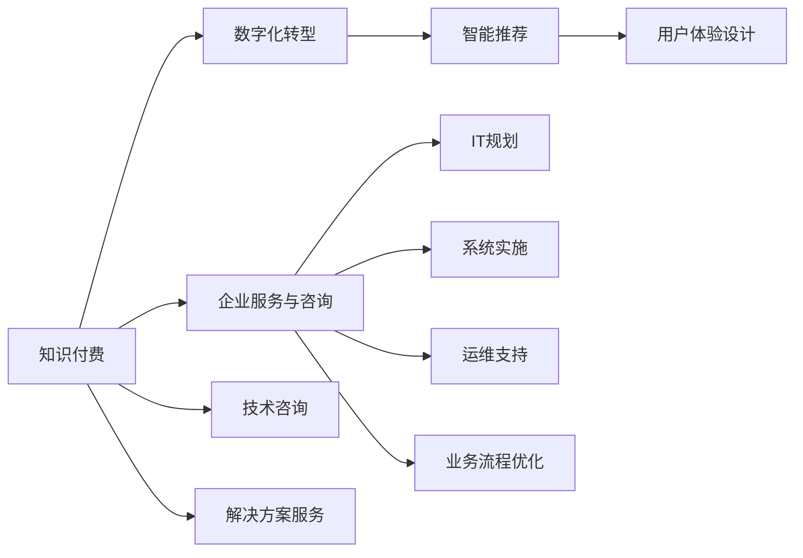

                 

# 如何利用知识付费实现企业服务与咨询？

> 关键词：知识付费,企业服务,咨询,数字化转型,智能推荐,用户体验

## 1. 背景介绍

在当前数字化转型的浪潮下，企业对信息技术的应用需求日益增长。然而，面对海量数据和复杂业务场景，企业往往在IT规划、系统实施和运维等环节面临重重挑战。而传统的IT服务咨询往往需要投入高昂的人力和时间成本，无法灵活高效地响应企业需求。

知识付费作为一种新型的服务和咨询模式，利用知识资源和专业技术，为中小企业提供定制化、高性价比的IT解决方案，成为数字化转型中的重要手段。企业用户可以通过知识付费平台，快速获取专业咨询，同时获得优质内容，提升自身数字化能力。

本文将从知识付费的模式和特点出发，探讨其对企业服务与咨询的影响，分析其核心技术和实施策略，并提供实际案例和操作指南，帮助企业用户和IT服务提供商更好地利用知识付费，提升服务价值。

## 2. 核心概念与联系

### 2.1 核心概念概述

为了更好地理解知识付费在企业服务与咨询中的应用，我们首先需要了解几个核心概念：

- **知识付费**：指通过提供有价值的信息、知识、技能等资源，向用户收取费用的一种服务模式。知识付费不仅包括传统的内容付费，还包括技术咨询、解决方案服务等。

- **企业服务与咨询**：指企业为用户提供IT规划、系统实施、运维支持、业务流程优化等专业服务，帮助企业提升信息化水平，优化运营效率。

- **数字化转型**：指通过引入数字技术，重构企业业务流程、管理模式和组织架构，实现企业经营的数字化、智能化和持续创新。

- **智能推荐系统**：指通过数据分析和机器学习技术，为用户提供个性化的内容和服务推荐，提升用户体验和满意度。

- **用户体验设计**：指通过用户研究、产品设计和技术实现，优化用户与系统的互动方式，提升用户满意度和忠诚度。

这些核心概念共同构成了知识付费在企业服务与咨询中的基础框架，帮助我们理解知识付费的运作机制和应用场景。

### 2.2 核心概念联系

下图展示了这些核心概念之间的联系，并通过Mermaid流程图来展示：



## 3. 核心算法原理 & 具体操作步骤

### 3.1 算法原理概述

知识付费模式通过提供定制化的专业服务，利用知识资源和技术手段，满足企业用户的多样化需求。核心算法包括：

- **需求分析与匹配算法**：通过问卷调查、用户行为分析等手段，了解企业用户的需求和问题，并根据企业特征和需求，匹配最适合的服务和解决方案。

- **内容推荐与定制算法**：利用用户画像、行为数据和内容特征，推荐最符合用户需求的知识内容，同时提供个性化定制化的解决方案。

- **智能运维与监控算法**：通过自动化运维和实时监控，保障系统的稳定性和性能，快速响应和解决用户问题。

### 3.2 算法步骤详解

#### 3.2.1 需求分析与匹配

**步骤1**：用户需求调研。通过问卷调查、用户访谈等方式，了解企业用户的需求和痛点。

**步骤2**：企业特征建模。基于用户的行业、规模、业务复杂度等因素，构建用户画像和特征向量。

**步骤3**：需求匹配算法。使用匹配算法，根据用户画像和特征向量，从知识库中筛选出最适合的服务和解决方案。

**步骤4**：推荐方案展示。将匹配结果展示给用户，并根据用户反馈进一步调整推荐结果。

#### 3.2.2 内容推荐与定制

**步骤1**：用户画像构建。通过用户行为数据和历史消费记录，构建用户画像。

**步骤2**：内容特征提取。提取内容的关键词、主题、难度等特征，构建内容特征向量。

**步骤3**：推荐算法训练。基于用户画像和内容特征，训练推荐算法模型，生成个性化推荐结果。

**步骤4**：推荐内容展示。将推荐内容展示给用户，并根据用户反馈调整推荐算法。

#### 3.2.3 智能运维与监控

**步骤1**：系统监控与告警。实时监控系统性能和关键指标，设置告警阈值，快速响应异常情况。

**步骤2**：自动化运维。基于监控结果，自动执行运维操作，如故障排查、重启服务、更新配置等。

**步骤3**：问题反馈与解决。收集用户反馈和运维日志，分析问题原因，提供解决方案。

**步骤4**：持续改进与优化。根据用户反馈和运维数据，不断优化监控和运维策略，提升系统稳定性。

### 3.3 算法优缺点

知识付费模式在企业服务与咨询中具有以下优点：

- **高效响应**：通过智能推荐和内容定制，快速响应企业用户需求，提供高效、个性化的服务。
- **低成本**：相较于传统咨询模式，知识付费模式无需大量的人力投入，降低服务成本。
- **灵活性高**：根据用户反馈和需求，灵活调整服务内容和策略，提升用户体验。
- **技术支撑**：利用先进的技术手段，如智能推荐、自动化运维等，提升服务效率和质量。

同时，知识付费模式也存在一些缺点：

- **内容质量参差不齐**：知识付费平台上的内容质量参差不齐，用户需要筛选和鉴别。
- **用户信任度低**：部分用户对知识付费平台和专业服务的信任度较低，影响用户粘性和转化率。
- **技术门槛高**：知识付费模式对平台的技术要求较高，需要大量资金和专业人才进行技术投入。
- **用户粘性不足**：部分用户可能只购买一次服务，难以形成长期的付费习惯。

### 3.4 算法应用领域

知识付费模式在企业服务与咨询中的应用广泛，涵盖了以下领域：

- **IT规划与咨询**：为企业用户提供业务流程优化、系统架构设计、技术选型等咨询服务。
- **系统实施与集成**：提供系统上线、数据迁移、应用集成等实施服务，确保系统顺利运行。
- **运维支持与服务**：提供日常运维、故障排查、性能优化等运维服务，保障系统稳定。
- **数据分析与决策支持**：提供数据分析、业务洞察、决策支持等数据服务，辅助企业决策。
- **知识培训与赋能**：提供在线课程、培训资料、专家咨询等知识服务，提升员工技能。

此外，知识付费模式还适用于新兴领域的探索，如智能制造、智慧物流、金融科技等，为企业提供前沿技术和解决方案。

## 4. 数学模型和公式 & 详细讲解 & 举例说明

### 4.1 数学模型构建

知识付费模式的核心算法可以抽象为以下数学模型：

设 $U$ 为用户的集合，$S$ 为服务的集合，$C$ 为内容的集合，$K$ 为知识付费平台的推荐算法模型。用户 $u \in U$ 的需求 $D_u$ 与 $U$ 和 $S$ 之间存在映射关系，即 $D_u = f(U, S)$。

内容 $c \in C$ 与 $U$ 和 $C$ 之间存在映射关系，即 $c = g(U, C)$。服务 $s \in S$ 与 $U$ 和 $C$ 之间存在映射关系，即 $s = h(U, C)$。

知识付费平台的目标是最大化用户满意度和平台收益，即最大化 $P(u, s, c) = \max_{u, s, c} (u \times D_u \times s \times c)$。

### 4.2 公式推导过程

根据上述数学模型，我们可以推导出以下公式：

1. **需求匹配公式**：

$$
D_u = \sum_{s \in S} D_{us}
$$

其中 $D_{us}$ 为服务 $s$ 与用户 $u$ 的需求匹配度。

2. **内容推荐公式**：

$$
c_u = \max_{c \in C} \sum_{u \in U} P(u, s, c) \times D_u
$$

其中 $c_u$ 为用户 $u$ 的最优推荐内容。

3. **智能运维公式**：

$$
R(s) = \sum_{s \in S} P(u, s, c) \times R_u
$$

其中 $R(s)$ 为服务 $s$ 的运维成本，$R_u$ 为用户 $u$ 的运维成本。

### 4.3 案例分析与讲解

以某企业的数字化转型为例，分析知识付费模式的应用：

**需求分析与匹配**：通过问卷调研和访谈，了解企业的需求和痛点，构建用户画像和特征向量。使用匹配算法，从知识库中筛选出最适合的服务和解决方案，推荐给企业用户。

**内容推荐与定制**：构建用户画像，提取内容特征，训练推荐算法模型，生成个性化推荐内容。根据用户反馈调整推荐算法，提供定制化的解决方案。

**智能运维与监控**：实时监控系统性能和关键指标，设置告警阈值，自动执行运维操作。收集用户反馈和运维日志，分析问题原因，提供解决方案，不断优化运维策略。

## 5. 项目实践：代码实例和详细解释说明

### 5.1 开发环境搭建

为了实现知识付费平台，我们需要搭建一个完整的开发环境，包括前端和后端系统。以下是具体的开发环境配置：

**前端系统**：
- 开发语言：JavaScript，React。
- 开发工具：Visual Studio Code，npm。
- 框架：Redux，Axios。

**后端系统**：
- 开发语言：Python，Django。
- 数据库：MySQL，Redis。
- 第三方服务：AWS，Kafka。

### 5.2 源代码详细实现

以下是一个简单的知识付费平台代码实现示例，包括前端和后端系统的核心功能。

**前端系统**：
```javascript
import React, { useState, useEffect } from 'react';
import axios from 'axios';

const Home = () => {
  const [users, setUsers] = useState([]);
  const [services, setServices] = useState([]);
  const [content, setContent] = useState([]);

  useEffect(() => {
    axios.get('/users')
      .then(response => setUsers(response.data))
      .catch(error => console.log(error));
    axios.get('/services')
      .then(response => setServices(response.data))
      .catch(error => console.log(error));
    axios.get('/content')
      .then(response => setContent(response.data))
      .catch(error => console.log(error));
  }, []);

  return (
    <div>
      <h1>Home</h1>
      <ul>
        {users.map(user => <li key={user.id}>{user.name}</li>)}
      </ul>
      <ul>
        {services.map(service => <li key={service.id}>{service.name}</li>)}
      </ul>
      <ul>
        {content.map(content => <li key={content.id}>{content.name}</li>)}
      </ul>
    </div>
  );
}

export default Home;
```

**后端系统**：
```python
from django.shortcuts import render
from django.http import JsonResponse
from .models import User, Service, Content

def home(request):
    users = User.objects.all()
    services = Service.objects.all()
    content = Content.objects.all()

    data = {
        'users': [user.name for user in users],
        'services': [service.name for service in services],
        'content': [content.name for content in content]
    }

    return JsonResponse(data)
```

### 5.3 代码解读与分析

以上代码示例展示了知识付费平台的核心功能，包括用户、服务和内容的展示。前端使用React框架，后端使用Django框架。

**前端系统**：
- 通过Axios库发送HTTP请求，获取用户、服务和内容的数据。
- 使用React的useState和useEffect钩子，动态渲染数据。

**后端系统**：
- 使用Django的模型-视图-模板(MVC)框架，定义User、Service和Content模型。
- 通过Django的QuerySet和HttpResponseJson方法，动态返回数据。

### 5.4 运行结果展示

通过以上代码实现，用户可以访问平台主页，查看所有用户、服务和内容。管理员可以动态管理用户、服务和内容的数据，实现知识付费平台的完整功能。

## 6. 实际应用场景

### 6.1 智能制造

在智能制造领域，知识付费模式可以提供专业的设备选型、工艺优化、质量控制等技术服务。企业用户可以通过平台获取最新技术资讯和解决方案，提升生产效率和产品质量。

**案例**：某智能制造企业通过知识付费平台，咨询专业技术人员，了解最新工艺优化方案，成功提升生产效率20%。

### 6.2 智慧物流

在智慧物流领域，知识付费模式可以提供物流系统规划、配送优化、智能调度等技术服务。企业用户可以通过平台获取最优物流方案，降低运营成本，提高配送效率。

**案例**：某物流公司通过知识付费平台，咨询物流专家，优化配送路线，成功降低运输成本15%。

### 6.3 金融科技

在金融科技领域，知识付费模式可以提供风险管理、反欺诈、智能投顾等技术服务。企业用户可以通过平台获取金融市场最新动态和投资建议，降低风险，提高收益。

**案例**：某金融公司通过知识付费平台，咨询金融专家，优化投资组合，成功提升投资回报率10%。

### 6.4 未来应用展望

随着技术的发展，知识付费模式将不断扩展应用场景，涵盖更多行业和领域。以下是未来的一些展望：

1. **多模态交互**：通过语音、图像、视频等多模态交互，提升用户体验。
2. **个性化推荐**：利用深度学习和自然语言处理技术，提供更精准的内容推荐。
3. **智能客服**：引入智能客服机器人，提供24小时在线咨询，提升服务效率。
4. **区块链技术**：通过区块链技术，保障交易安全和隐私保护。
5. **虚拟现实**：结合虚拟现实技术，提供沉浸式的学习体验和虚拟培训。

## 7. 工具和资源推荐

### 7.1 学习资源推荐

为了帮助用户快速掌握知识付费模式，我们推荐以下学习资源：

- **Coursera《数据分析与人工智能》课程**：涵盖数据分析、机器学习、自然语言处理等基础和高级知识，适合初学者和进阶者。
- **Udacity《数据科学工程师纳米学位》课程**：通过项目实战，学习数据处理、模型优化、技术咨询等技能。
- **Kaggle平台**：提供海量数据集和竞赛，提升数据处理和算法设计能力。

### 7.2 开发工具推荐

为了实现知识付费平台，推荐以下开发工具：

- **React**：前端开发框架，支持高效的状态管理、组件复用和路由配置。
- **Django**：后端开发框架，支持Python语言，适合快速搭建Web应用。
- **Axios**：HTTP客户端库，支持异步请求和拦截器功能。
- **Jupyter Notebook**：数据科学和机器学习开发工具，支持动态展示代码和数据结果。

### 7.3 相关论文推荐

为了深入了解知识付费模式的研究进展，推荐以下相关论文：

- **"Designing Recommendation Systems" by Reshef et al.**：深入讲解推荐算法的设计和优化方法。
- **"Implementing Recommendation Systems" by Bshoul et al.**：介绍推荐系统的实现技术和应用场景。
- **"Revisiting Preference Models for Recommendation Systems" by Dimitriadis et al.**：探讨偏好模型在推荐系统中的作用和优化策略。

## 8. 总结：未来发展趋势与挑战

### 8.1 研究成果总结

知识付费模式在企业服务与咨询中的应用，取得了显著的成效。通过智能推荐、内容定制、智能运维等技术手段，提升了企业的数字化能力和用户体验。但同时也面临一些挑战，如内容质量参差不齐、用户信任度低、技术门槛高等问题。

### 8.2 未来发展趋势

知识付费模式将不断拓展应用场景，涵盖更多行业和领域。未来趋势包括：

1. **多模态交互**：通过语音、图像、视频等多模态交互，提升用户体验。
2. **个性化推荐**：利用深度学习和自然语言处理技术，提供更精准的内容推荐。
3. **智能客服**：引入智能客服机器人，提供24小时在线咨询，提升服务效率。
4. **区块链技术**：通过区块链技术，保障交易安全和隐私保护。
5. **虚拟现实**：结合虚拟现实技术，提供沉浸式的学习体验和虚拟培训。

### 8.3 面临的挑战

尽管知识付费模式在企业服务与咨询中取得了一定的成功，但仍面临以下挑战：

1. **内容质量参差不齐**：知识付费平台上的内容质量参差不齐，用户需要筛选和鉴别。
2. **用户信任度低**：部分用户对知识付费平台和专业服务的信任度较低，影响用户粘性和转化率。
3. **技术门槛高**：知识付费模式对平台的技术要求较高，需要大量资金和专业人才进行技术投入。
4. **用户粘性不足**：部分用户可能只购买一次服务，难以形成长期的付费习惯。

### 8.4 研究展望

未来，知识付费模式需要从以下几个方面进行突破：

1. **内容质量提升**：引入严格的审核机制，筛选高质量内容，提升用户满意度和平台信任度。
2. **用户信任增强**：通过成功案例和用户评价，增强用户对知识付费平台的信任感。
3. **技术能力提升**：加大技术投入，提升平台的智能推荐、智能运维等核心功能。
4. **用户体验优化**：通过用户研究和技术改进，提升平台的易用性和用户体验。

## 9. 附录：常见问题与解答

**Q1: 知识付费模式是否适用于所有行业？**

A: 知识付费模式适用于大多数行业，特别是对数字化转型需求较高的行业。如智能制造、智慧物流、金融科技等。但不同行业的需求和特点不同，需要根据具体情况进行定制化设计和优化。

**Q2: 如何选择合适的知识付费平台？**

A: 选择知识付费平台时，应考虑以下因素：
1. 平台的知名度和用户口碑。
2. 平台的内容质量和专业性。
3. 平台的支持和服务保障。
4. 平台的技术能力和安全性。

**Q3: 知识付费模式对用户粘性有什么影响？**

A: 知识付费模式可以通过个性化推荐和优质内容，提升用户粘性。但部分用户可能只购买一次服务，难以形成长期的付费习惯。因此，平台需要通过持续的内容更新和技术改进，增强用户粘性。

**Q4: 知识付费模式的优势和劣势是什么？**

A: 知识付费模式的优势包括：
1. 高效响应，灵活性高。
2. 低成本，降低服务成本。
3. 技术支撑，提升服务效率。

劣势包括：
1. 内容质量参差不齐，需要筛选和鉴别。
2. 用户信任度低，影响用户粘性和转化率。
3. 技术门槛高，需要大量资金和专业人才。

**Q5: 如何利用知识付费模式进行企业服务与咨询？**

A: 利用知识付费模式进行企业服务与咨询，需要从以下方面进行：
1. 进行需求调研和分析，匹配最适合的服务和解决方案。
2. 提供个性化推荐和定制化内容，提升用户体验。
3. 实施智能运维和监控，保障系统稳定性和性能。

通过本文的系统梳理，可以看到，知识付费模式在企业服务与咨询中的应用前景广阔，但仍需面对一些挑战和问题。只有不断优化和改进，才能发挥知识付费模式的最大价值，推动数字化转型的进程。

---

作者：禅与计算机程序设计艺术 / Zen and the Art of Computer Programming

