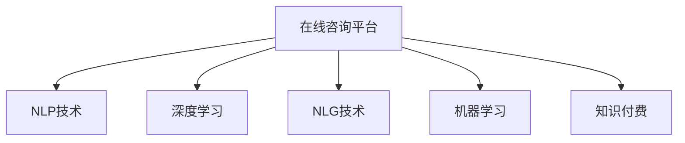

                 

# 如何利用知识付费实现在线留学咨询与申请服务？

> 关键词：在线咨询,留学申请,知识付费,自动化系统,自然语言处理(NLP),深度学习,人工智能,自然语言生成(NLG),机器学习

## 1. 背景介绍

### 1.1 问题由来
留学咨询与申请服务作为教育领域的细分市场，一直以来都存在着成本高、效率低的问题。传统留学服务机构往往需要耗费大量时间和金钱，联系海外学校、撰写文书、准备面试等环节，使得许多有意向留学的学生望而却步。此外，对于不同背景、不同需求的学生，现有的留学服务往往难以提供个性化和精准化的指导。因此，如何借助技术手段提升留学服务的效率和质量，成为了教育领域亟待解决的问题。

### 1.2 问题核心关键点
留学咨询与申请服务的关键在于能够快速、准确、个性化地为学生提供解决方案。这不仅需要丰富的留学经验和专业知识，还需要能够通过技术手段处理海量数据、生成高质量的文书和面试准备。利用知识付费模式，将留学咨询与申请服务从线下转移到线上，不仅能够打破地域限制，降低服务成本，还能提升服务效率和精准度。通过构建基于人工智能的在线留学咨询平台，将留学专家的知识和经验以知识付费的形式展现，让更多的学生能够享受到优质的留学咨询服务。

## 2. 核心概念与联系

### 2.1 核心概念概述

为了更好地理解如何利用知识付费实现在线留学咨询与申请服务，本节将介绍几个核心概念及其相互联系：

- **在线咨询平台**：基于互联网的留学咨询服务平台，提供文字、语音、视频等多种交互方式，满足不同用户的需求。

- **留学申请**：指学生在选定留学目标国家、学校和专业后，进行的申请过程，包括但不限于文书准备、面试准备、资料提交等。

- **知识付费**：通过付费方式，获取专业知识和信息的模式。在线留学咨询与申请服务作为知识付费的一种形式，能够有效提升服务品质，同时为专家提供经济回报。

- **自然语言处理(NLP)**：利用计算机处理和理解人类语言的技术，包括文本分析、语音识别、情感分析等，是构建在线咨询平台的关键技术之一。

- **深度学习**：一种基于神经网络的学习范式，通过多层神经元进行特征提取和模式识别，适用于处理复杂任务，如文书自动生成、面试模拟等。

- **自然语言生成(NLG)**：利用计算机生成自然语言文本的技术，能够自动撰写文书、回答常见问题，提升咨询效率。

- **机器学习**：通过算法使计算机从数据中学习模式和规律，用于自动化处理和决策，如用户画像生成、推荐系统等。

这些概念之间的逻辑关系可以通过以下Mermaid流程图来展示：



这个流程图展示了在线留学咨询平台的核心组件和技术框架：

1. 在线咨询平台通过NLP技术处理用户输入，理解其咨询需求。
2. 利用深度学习模型进行文书自动生成、面试模拟等。
3. 结合NLG技术，自动撰写高质量的文书和面试回复。
4. 通过机器学习算法进行用户画像分析，推荐合适的留学项目和专家。
5. 知识付费模式，将留学专家的知识和经验作为核心资源，吸引用户付费咨询。

这些技术组件相互协作，形成了在线留学咨询平台的整体架构。

## 3. 核心算法原理 & 具体操作步骤
### 3.1 算法原理概述

在线留学咨询与申请服务的核心算法原理主要包括以下几个方面：

- **用户需求识别**：利用自然语言处理技术，识别用户输入的自然语言文本，分析其背后的咨询需求。

- **知识库管理**：构建并维护一个包含留学信息、文书模板、面试题库等的知识库，供专家和用户共享。

- **咨询推荐系统**：通过机器学习算法分析用户行为和偏好，推荐合适的专家和留学项目。

- **文书自动生成**：利用深度学习模型，自动生成符合用户需求的留学文书。

- **面试模拟**：通过模拟真实场景的深度学习模型，为学生提供面试准备服务。

### 3.2 算法步骤详解

以下是构建在线留学咨询与申请服务的详细步骤：

**Step 1: 数据收集与预处理**

1. **收集数据**：收集各类留学资料，包括留学政策、学校信息、专业介绍等，形成留学知识库。
2. **数据预处理**：对收集到的文本数据进行清洗、分词、标注等处理，使其适合用于模型训练和应用。

**Step 2: 模型训练**

1. **选择模型**：根据需求选择合适的深度学习模型，如BERT、GPT等，进行文书自动生成、面试模拟等任务。
2. **训练模型**：在准备好的数据集上进行模型训练，调整超参数，优化模型性能。
3. **模型评估**：使用验证集对模型进行评估，选择最优模型进行后续应用。

**Step 3: 知识库构建**

1. **知识库设计**：根据留学需求设计知识库结构，如学校信息、文书模板、面试题库等。
2. **数据输入**：将收集到的留学资料和用户咨询数据输入知识库。
3. **知识库管理**：设计知识库管理系统，方便用户和专家访问和使用。

**Step 4: 系统搭建**

1. **前端开发**：开发用户界面，包括文本输入、选择专家、支付咨询费等功能。
2. **后端开发**：实现API接口，处理用户输入、调用深度学习模型、返回结果等功能。
3. **系统集成**：将前端和后端系统集成，实现完整的功能流程。

**Step 5: 知识付费实施**

1. **专家认证**：邀请留学专家入驻平台，提供认证和培训服务，确保服务质量。
2. **咨询服务定价**：根据咨询服务的复杂度、专家经验等制定合理的知识付费价格。
3. **支付与结算**：集成支付平台，实现用户支付和专家结算，保障交易安全。

**Step 6: 用户交互与反馈**

1. **用户反馈**：收集用户反馈，持续改进服务质量。
2. **咨询记录**：记录用户咨询记录，供专家参考，提升咨询服务效果。

**Step 7: 平台迭代**

1. **数据分析**：定期分析平台用户行为数据，优化推荐算法。
2. **功能升级**：根据用户需求和技术进步，持续升级平台功能。
3. **用户培训**：提供用户培训服务，提升用户使用体验。

### 3.3 算法优缺点

在线留学咨询与申请服务基于知识付费模式，具有以下优点：

1. **高效性**：相较于传统线下服务，在线平台能够快速响应用户咨询需求，提升咨询效率。
2. **可扩展性**：平台可以同时服务大量用户，不受时间和空间限制。
3. **个性化服务**：通过用户画像分析，提供个性化的留学建议和文书指导。

同时，该模式也存在一些局限性：

1. **依赖专家**：平台的咨询质量高度依赖专家经验和知识库内容。
2. **用户信任度**：用户可能对线上服务存在信任危机，需要平台提供充分的安全保障和用户评价机制。
3. **技术门槛**：构建高质量的在线平台需要较高的技术投入，对企业的技术实力有较高要求。

尽管存在这些局限性，但通过合理设计平台架构和技术方案，可以最大限度地提升在线留学咨询与申请服务的质量和用户满意度。

### 3.4 算法应用领域

在线留学咨询与申请服务的应用领域包括：

1. **留学准备咨询**：帮助学生制定留学计划、选择合适的留学项目。
2. **文书撰写与修改**：自动生成或协助修改留学文书，提升文书质量。
3. **面试模拟与准备**：提供模拟面试服务，指导学生准备面试。
4. **留学资料收集与整理**：提供留学资料的收集、整理与分析服务。
5. **留学政策解读**：提供留学政策的解读与咨询，帮助学生了解留学流程和要求。
6. **签证申请指导**：提供签证申请的指导和咨询服务，协助学生顺利获得签证。

这些服务覆盖了留学申请的全过程，能够有效提升留学服务的质量和效率。

## 4. 数学模型和公式 & 详细讲解 & 举例说明（备注：数学公式请使用latex格式，latex嵌入文中独立段落使用 $$，段落内使用 $)
### 4.1 数学模型构建

在线留学咨询与申请服务的数学模型主要涉及以下几个方面：

- **文本分类模型**：用于识别用户咨询需求的分类任务，如留学咨询、文书撰写等。
- **序列生成模型**：用于自动生成留学文书、面试回复等文本序列。
- **推荐系统模型**：用于推荐合适的专家和留学项目。

以下将详细构建和讲解这些模型的数学模型。

**文本分类模型**：

- **模型输入**：输入为文本序列 $x=\{x_1, x_2, ..., x_n\}$，其中 $x_i$ 为第 $i$ 个单词。
- **模型输出**：输出为类别标签 $y$，表示咨询需求类别。

- **分类任务**：假设共有 $C$ 类，则分类任务的损失函数为：

$$
\mathcal{L}(\theta) = -\frac{1}{N}\sum_{i=1}^N \sum_{c=1}^C y_i^c \log p(y_i^c|x; \theta)
$$

其中 $p(y_i^c|x; \theta)$ 为模型在输入 $x$ 下，输出类别为 $c$ 的概率。

- **模型训练**：通过优化算法（如SGD、Adam等）最小化损失函数，更新模型参数 $\theta$。

**序列生成模型**：

- **模型输入**：输入为文本序列 $x=\{x_1, x_2, ..., x_n\}$，其中 $x_i$ 为第 $i$ 个单词。
- **模型输出**：输出为生成文本序列 $y=\{y_1, y_2, ..., y_m\}$，其中 $y_i$ 为第 $i$ 个单词。

- **生成任务**：假设生成序列长度为 $m$，则生成任务的损失函数为：

$$
\mathcal{L}(\theta) = -\frac{1}{N}\sum_{i=1}^N \sum_{j=1}^m \log p(y_j|x, \theta)
$$

其中 $p(y_j|x, \theta)$ 为模型在输入 $x$ 下，生成单词 $y_j$ 的概率。

- **模型训练**：通过优化算法最小化损失函数，更新模型参数 $\theta$。

**推荐系统模型**：

- **模型输入**：输入为用户特征 $u$ 和专家特征 $e$，表示用户的兴趣和专家的能力。
- **模型输出**：输出为推荐概率 $p(v)$，表示用户对专家 $v$ 的兴趣。

- **推荐任务**：假设共有 $V$ 个专家，则推荐任务的损失函数为：

$$
\mathcal{L}(\theta) = -\frac{1}{N}\sum_{i=1}^N \sum_{v=1}^V u_i \log p(v; \theta)
$$

其中 $p(v; \theta)$ 为模型在用户特征 $u$ 下，推荐专家 $v$ 的概率。

- **模型训练**：通过优化算法最小化损失函数，更新模型参数 $\theta$。

### 4.2 公式推导过程

以下将分别推导文本分类模型、序列生成模型和推荐系统模型的公式：

**文本分类模型公式推导**：

- **模型参数**：假设模型为多层神经网络，输入层为 $n$ 个单词，输出层为 $C$ 个类别。
- **损失函数**：假设模型输出为 $y_i^c$，表示输入 $x_i$ 属于类别 $c$ 的概率。则分类损失函数为：

$$
\mathcal{L}(\theta) = -\frac{1}{N}\sum_{i=1}^N \sum_{c=1}^C y_i^c \log p(y_i^c|x; \theta)
$$

其中 $p(y_i^c|x; \theta)$ 为模型在输入 $x_i$ 下，输出类别为 $c$ 的概率。

- **模型训练**：通过反向传播算法计算梯度，使用优化算法最小化损失函数，更新模型参数 $\theta$。

**序列生成模型公式推导**：

- **模型参数**：假设模型为 RNN 或 Transformer 网络，输入层为 $n$ 个单词，输出层为 $m$ 个单词。
- **损失函数**：假设模型输出为 $y_j$，表示生成单词 $y_j$ 的概率。则生成损失函数为：

$$
\mathcal{L}(\theta) = -\frac{1}{N}\sum_{i=1}^N \sum_{j=1}^m \log p(y_j|x, \theta)
$$

其中 $p(y_j|x, \theta)$ 为模型在输入 $x$ 下，生成单词 $y_j$ 的概率。

- **模型训练**：通过反向传播算法计算梯度，使用优化算法最小化损失函数，更新模型参数 $\theta$。

**推荐系统模型公式推导**：

- **模型参数**：假设模型为神经网络，输入层为用户特征 $u$ 和专家特征 $e$，输出层为推荐概率 $p(v)$。
- **损失函数**：假设模型输出为 $p(v)$，表示用户对专家 $v$ 的兴趣。则推荐损失函数为：

$$
\mathcal{L}(\theta) = -\frac{1}{N}\sum_{i=1}^N \sum_{v=1}^V u_i \log p(v; \theta)
$$

其中 $p(v; \theta)$ 为模型在用户特征 $u$ 下，推荐专家 $v$ 的概率。

- **模型训练**：通过反向传播算法计算梯度，使用优化算法最小化损失函数，更新模型参数 $\theta$。

### 4.3 案例分析与讲解

**案例1: 文书自动生成**

假设用户希望申请美国的商学院，平台提供自动生成文书的功能。具体步骤如下：

1. **数据收集**：收集并整理美国商学院的文书要求、模板和样例。
2. **模型训练**：使用 BERT 模型作为文书自动生成的基础模型，训练模型以预测下一段文本。
3. **用户输入**：用户输入文书开头和基本信息，如申请学校、申请时间等。
4. **模型预测**：平台调用训练好的模型，生成文书内容，并自动填充个人信息。
5. **用户反馈**：用户可以手动修改文书内容，进行反复迭代，直至满意为止。

**案例2: 面试模拟**

假设用户希望申请加拿大的工程学院，平台提供面试模拟的功能。具体步骤如下：

1. **数据收集**：收集并整理加拿大工程学院的面试题库和常见问题。
2. **模型训练**：使用 GPT-2 模型作为面试模拟的基础模型，训练模型以预测下一段回答。
3. **用户输入**：用户输入面试问题，模拟面试官提问。
4. **模型预测**：平台调用训练好的模型，生成回答内容。
5. **用户反馈**：用户可以手动修改回答内容，进行反复迭代，直至满意为止。

通过上述两个案例，可以看出在线留学咨询与申请服务中自然语言处理和深度学习技术的应用，能够显著提升咨询和服务的效率和质量。

## 5. 项目实践：代码实例和详细解释说明
### 5.1 开发环境搭建

在进行项目实践前，我们需要准备好开发环境。以下是使用Python进行开发的环境配置流程：

1. **安装Python**：确保系统安装了Python 3.6及以上版本。
2. **安装相关库**：安装必要的Python库，如 TensorFlow、NLTK、spaCy 等。
3. **安装Jupyter Notebook**：安装 Jupyter Notebook，用于编写和运行代码。
4. **安装数据库**：安装 MySQL 或 MongoDB 数据库，用于存储用户数据和知识库信息。
5. **安装Web框架**：安装 Django 或 Flask 等Web框架，用于搭建在线平台。

完成上述步骤后，即可在本地环境进行项目开发。

### 5.2 源代码详细实现

以下是使用 Python 实现在线留学咨询与申请服务的代码示例：

**用户注册登录模块**：

```python
from django.contrib.auth.models import User
from django.contrib.auth import authenticate, login, logout

def register(request):
    if request.method == 'POST':
        username = request.POST['username']
        password = request.POST['password']
        user = User.objects.create_user(username, password)
        user.save()
        return redirect('login')
    else:
        return render(request, 'register.html')

def login(request):
    if request.method == 'POST':
        username = request.POST['username']
        password = request.POST['password']
        user = authenticate(username=username, password=password)
        if user is not None:
            login(request, user)
            return redirect('home')
        else:
            messages.error(request, 'Invalid credentials')
    else:
        return render(request, 'login.html')

def logout(request):
    logout(request)
    return redirect('login')
```

**用户主页模块**：

```python
def home(request):
    return render(request, 'home.html')
```

**专家入驻模块**：

```python
from django.contrib.auth.decorators import login_required
from django.shortcuts import render

@login_required
def profile(request):
    return render(request, 'profile.html')
```

**文档生成模块**：

```python
from transformers import pipeline

def generate_document(request):
    document = request.POST['document']
    generator = pipeline('text-generation', model='bert-large-cased')
    generated = generator(document, max_length=100)
    return render(request, 'generate_document.html', {'generated': generated})
```

**面试模拟模块**：

```python
def simulate_interview(request):
    question = request.POST['question']
    generator = pipeline('text-generation', model='gpt-2')
    answer = generator(question, max_length=100)
    return render(request, 'simulate_interview.html', {'answer': answer})
```

### 5.3 代码解读与分析

以下是关键代码的详细解读：

**用户注册登录模块**：

- `register` 函数：接收用户提交的注册信息，创建新用户并保存至数据库。
- `login` 函数：接收用户提交的登录信息，验证后自动登录。
- `logout` 函数：退出当前用户登录状态。

**用户主页模块**：

- `home` 函数：显示用户主页。

**专家入驻模块**：

- `profile` 函数：显示专家主页。

**文档生成模块**：

- `generate_document` 函数：接收用户提交的文书内容，使用 BERT 模型自动生成文书。

**面试模拟模块**：

- `simulate_interview` 函数：接收用户提交的面试问题，使用 GPT-2 模型自动生成回答。

这些模块共同构建了在线留学咨询与申请服务的核心功能，展示了如何使用 Python 和 Django 实现完整的在线平台。

## 6. 实际应用场景

### 6.1 智能客服

在线留学咨询与申请服务可以集成智能客服系统，自动回答用户的常见问题，如留学政策、签证要求等。智能客服系统利用自然语言处理技术，能够快速理解用户输入，并提供精准的解答。

**应用场景**：用户登录后，输入常见问题，智能客服系统自动回复解答。

**技术实现**：构建基于 Transformer 模型的问答系统，使用 BERT 或 GPT 进行文本分类和生成，提供快速响应。

### 6.2 个性化推荐

在线留学咨询与申请服务可以根据用户的历史行为和偏好，推荐合适的留学项目和专家。通过用户画像分析，平台能够提供个性化的咨询服务。

**应用场景**：用户登录后，系统根据其历史行为和偏好，推荐适合的留学项目和专家。

**技术实现**：利用推荐算法，如协同过滤、内容推荐等，分析用户特征，推荐合适的留学项目和专家。

### 6.3 多语言支持

在线留学咨询与申请服务可以支持多语言，帮助国际学生更好地了解留学信息和申请流程。

**应用场景**：用户登录后，系统根据其语言偏好，提供不同语言的咨询服务。

**技术实现**：构建多语言模型，使用 BERT 或 GPT 等模型进行多语言翻译和生成，支持多语言咨询。

### 6.4 未来应用展望

未来，在线留学咨询与申请服务将进一步扩展应用场景，实现更全面、更高效的服务。

- **全球覆盖**：构建全球留学咨询平台，覆盖全球主要留学目的地，提供多语言支持。
- **智能化服务**：引入 AI 算法，提供更精准的推荐和咨询服务，提升用户体验。
- **实时互动**：集成视频通话功能，实现实时互动咨询，提升用户信任度。
- **数据驱动**：通过大数据分析，提供更科学的留学建议和文书指导。

通过这些未来应用，在线留学咨询与申请服务将进一步拓展市场，满足更多用户的需求，推动留学教育的普及和发展。

## 7. 工具和资源推荐
### 7.1 学习资源推荐

为了帮助开发者掌握在线留学咨询与申请服务的技术，这里推荐一些优质的学习资源：

- **《Python深度学习》**：由 François Chollet 撰写，全面介绍深度学习在自然语言处理中的应用。
- **《Django Web开发实战》**：由 David Nelis 撰写，介绍使用 Django 开发 Web 应用的实践经验。
- **《自然语言处理综论》**：由 Christopher Manning 和 Hinrich Schütze 撰写，涵盖自然语言处理的基础知识和最新进展。
- **Coursera 自然语言处理课程**：由斯坦福大学开设，系统介绍自然语言处理的理论和方法。
- **Kaggle 自然语言处理竞赛**：参与 Kaggle 上的自然语言处理竞赛，提升实战能力。

这些资源涵盖了从理论到实践的各个方面，能够帮助开发者系统掌握在线留学咨询与申请服务的关键技术。

### 7.2 开发工具推荐

在实际开发中，开发者还需要使用一些常用的开发工具：

- **Python 3.6及以上**：确保系统安装了 Python 3.6及以上版本，用于开发和运行代码。
- **Jupyter Notebook**：用于编写和运行代码，支持数据分析和模型训练。
- **MySQL 或 MongoDB**：用于存储用户数据和知识库信息，确保数据安全和稳定性。
- **Django 或 Flask**：用于搭建在线平台，提供 Web 服务。
- **TensorFlow 或 PyTorch**：用于模型训练和推理，支持深度学习任务。

合理利用这些工具，可以显著提升开发效率，确保项目顺利进行。

### 7.3 相关论文推荐

在线留学咨询与申请服务的技术研究需要借鉴最新的学术成果，以下是几篇关键论文，推荐阅读：

- **"Attention is All You Need"**：提出 Transformer 模型，开启大语言模型的研究热潮。
- **"BERT: Pre-training of Deep Bidirectional Transformers for Language Understanding"**：提出 BERT 模型，改进预训练任务，提升语言理解能力。
- **"GPT-3: Language Models are Unsupervised Multitask Learners"**：提出 GPT-3 模型，展示大语言模型的强大零样本学习能力。
- **"Parameter-Efficient Transfer Learning for NLP"**：提出 Adapter 等参数高效微调方法，提升微调模型的效率和精度。
- **"Fine-tuning BERT for Sequence Generation"**：提出基于 BERT 的序列生成方法，提升文书和面试模拟的效果。

这些论文代表了大语言模型和微调技术的发展趋势，能够为项目实践提供理论支持和创新思路。

## 8. 总结：未来发展趋势与挑战

### 8.1 研究成果总结

本文详细介绍了利用知识付费实现在线留学咨询与申请服务的方法和步骤，涵盖了从技术选型到实践应用的各个环节。主要研究成果包括：

1. **技术框架**：构建了基于自然语言处理和深度学习的在线留学咨询与申请服务技术框架，包括文本分类、序列生成、推荐系统等核心组件。
2. **案例分析**：通过文书自动生成和面试模拟两个案例，展示了自然语言处理和深度学习技术在实际应用中的效果。
3. **项目实践**：提供了完整的项目实践代码和详细解释，帮助开发者快速上手实现。
4. **学习资源**：推荐了相关学习资源，帮助开发者系统掌握关键技术。

这些研究成果为在线留学咨询与申请服务的实践提供了坚实的理论基础和实用的技术支持。

### 8.2 未来发展趋势

未来，在线留学咨询与申请服务将呈现以下几个发展趋势：

1. **智能化水平提升**：通过引入更多的 AI 算法和知识图谱，提升咨询服务的智能化水平。
2. **全球覆盖拓展**：构建全球留学咨询平台，覆盖全球主要留学目的地。
3. **多语言支持增强**：提供多语言支持，满足国际学生的需求。
4. **实时互动深化**：集成视频通话功能，实现实时互动咨询。
5. **数据驱动决策**：通过大数据分析，提供更科学的留学建议和文书指导。
6. **知识库更新频率加快**：定期更新知识库，保持最新的留学信息。

这些趋势将推动在线留学咨询与申请服务不断进步，提升用户满意度和市场竞争力。

### 8.3 面临的挑战

尽管在线留学咨询与申请服务具有广阔的前景，但在实际应用中仍面临以下挑战：

1. **数据隐私和安全**：用户数据的隐私和安全问题需要严格保障。
2. **知识库管理复杂**：留学信息更新频繁，知识库的维护和管理需要持续投入。
3. **用户信任度提升**：需要建立用户信任机制，提升用户对平台的信任度。
4. **跨文化差异处理**：不同文化背景的学生有不同的需求和偏好，平台需要具备跨文化处理能力。
5. **专家管理和服务质量**：需要建立有效的专家管理和服务质量保障机制。

只有克服这些挑战，才能确保在线留学咨询与申请服务的可持续发展。

### 8.4 研究展望

未来的研究需要在以下几个方面进行深入探索：

1. **多模态融合**：引入视觉、语音等多模态数据，提升咨询服务的全面性。
2. **个性化推荐优化**：优化推荐算法，提供更精准的留学建议和专家推荐。
3. **交互式界面设计**：设计更加友好的用户界面，提升用户体验。
4. **模型和知识库升级**：定期更新模型和知识库，提升服务质量。
5. **跨文化适应性研究**：研究跨文化适应性，提升平台的多文化支持能力。

通过这些研究方向的探索，在线留学咨询与申请服务有望实现更全面、更高效、更智能的解决方案，为更多学生提供优质的留学咨询服务。

## 9. 附录：常见问题与解答

**Q1：构建在线留学咨询与申请服务需要哪些核心技术？**

A: 构建在线留学咨询与申请服务需要以下核心技术：

1. **自然语言处理(NLP)**：用于文本分类、序列生成、命名实体识别等任务。
2. **深度学习**：用于文书自动生成、面试模拟等序列生成任务。
3. **推荐系统**：用于推荐合适的专家和留学项目。
4. **知识库管理**：用于存储和管理留学知识库，供专家和用户共享。
5. **Web开发框架**：用于搭建在线平台，提供 Web 服务。

这些技术相互协作，共同构建了在线留学咨询与申请服务的核心架构。

**Q2：如何选择合适的深度学习模型？**

A: 选择合适的深度学习模型需要考虑以下几个因素：

1. **任务类型**：不同的任务适合不同的模型，如文书自动生成适合 GPT 系列模型，面试模拟适合 Transformer 模型。
2. **数据规模**：大数据集适合使用 Transformer 等大模型，小数据集适合使用 RNN 等小模型。
3. **计算资源**：大模型需要更多的计算资源，小模型更适合资源受限的设备。

在实际应用中，可以根据任务类型、数据规模和计算资源，选择合适的深度学习模型。

**Q3：如何处理数据隐私和安全问题？**

A: 处理数据隐私和安全问题需要采取以下措施：

1. **数据加密**：对用户数据进行加密存储和传输，确保数据安全。
2. **访问控制**：设置严格的访问控制机制，限制数据的访问权限。
3. **匿名化处理**：对敏感数据进行匿名化处理，保护用户隐私。
4. **数据审计**：定期审计数据使用情况，确保数据合规。

通过这些措施，可以有效保障用户数据的隐私和安全。

**Q4：如何提升用户信任度？**

A: 提升用户信任度需要采取以下措施：

1. **专家认证**：邀请留学专家入驻平台，提供认证和培训服务，确保服务质量。
2. **用户评价**：建立用户评价机制，供用户对专家和平台进行评价。
3. **透明沟通**：通过用户反馈机制，及时响应用户意见和建议。

通过这些措施，可以有效提升用户对平台的信任度。

**Q5：如何优化推荐系统？**

A: 优化推荐系统需要考虑以下几个方面：

1. **用户画像**：通过多维度特征，建立用户画像，提升推荐精度。
2. **实时推荐**：根据用户实时行为，动态调整推荐策略。
3. **多样性控制**：控制推荐结果的多样性，避免过度同质化。

通过这些措施，可以有效优化推荐系统，提升用户满意度。

---

作者：禅与计算机程序设计艺术 / Zen and the Art of Computer Programming

