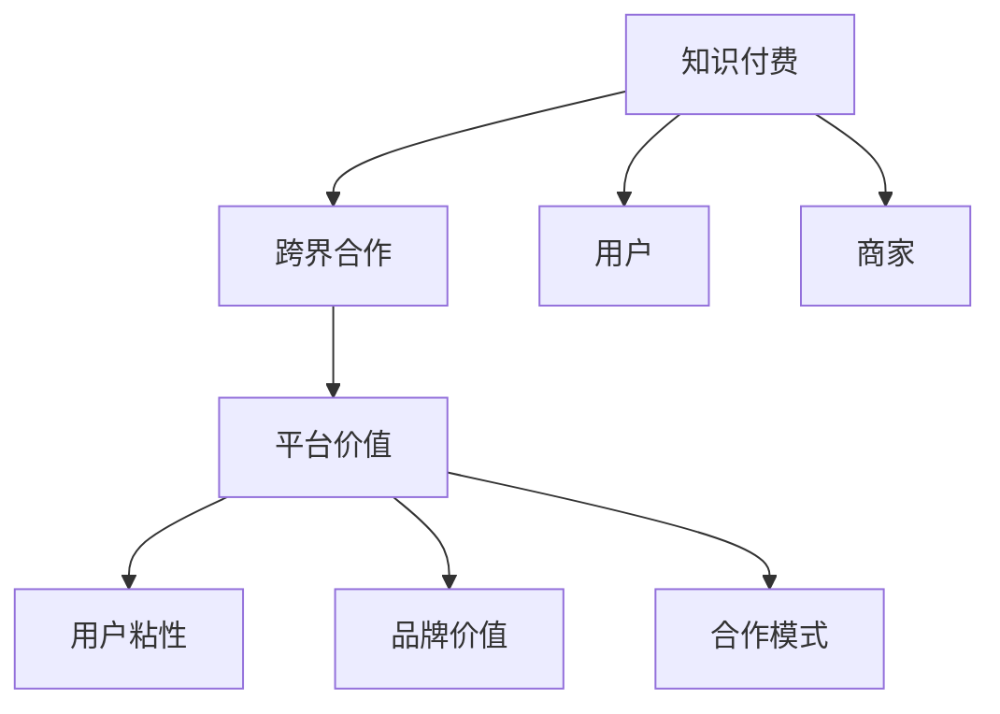

                 

# 如何利用知识付费实现跨界合作共赢？

## 1. 背景介绍

### 1.1 问题由来
随着知识经济时代的到来，知识付费作为一种新兴的经济模式迅速崛起，成为互联网领域的热门话题。知识付费平台汇集了大量的专业知识和技能，满足了人们多样化的知识需求。然而，知识付费平台也面临着内容同质化严重、用户忠诚度低等问题。因此，如何利用知识付费实现跨界合作，提升平台竞争力，成为亟待解决的问题。

### 1.2 问题核心关键点
实现跨界合作共赢的核心在于：
- 找到知识付费平台的合作机会。
- 设计高效的合作模式，优化收益分配机制。
- 提升平台用户粘性和满意度，增加用户参与度。
- 利用跨界合作提升平台品牌价值，吸引更多用户和商家入驻。

## 2. 核心概念与联系

### 2.1 核心概念概述

为更好地理解利用知识付费实现跨界合作共赢的方法，本节将介绍几个密切相关的核心概念：

- 知识付费：用户通过付费获取知识内容的商业模式。用户可以在平台内搜索、学习、应用各种知识技能，提升个人能力。

- 跨界合作：不同领域、不同类型的企业或个人，基于共同利益，通过资源共享、优势互补，实现合作共赢。

- 平台价值：知识付费平台的核心价值在于为用户和商家提供高质量的知识内容、高效的交易机制，形成良好的生态系统。

- 用户粘性：用户对平台的忠诚度和依赖度，直接影响平台的用户规模和活跃度。

- 品牌价值：知识付费平台的品牌价值，包括平台的知名度、口碑、市场影响力等，是其长期发展的基石。

- 合作模式：不同类型知识付费平台和商家之间，通过合同、合作协议等方式建立的长期合作关系，共同发展。

这些核心概念之间的逻辑关系可以通过以下Mermaid流程图来展示：



这个流程图展示了一个知识付费平台在跨界合作中的关键要素及其之间的关系：

1. 知识付费平台通过汇聚优质内容，满足用户需求，从而提升平台价值。
2. 平台价值和用户粘性相互促进，增强平台的市场影响力。
3. 平台品牌价值吸引更多商家入驻，共同开发市场。
4. 跨界合作通过资源共享，优势互补，实现共赢。
5. 合作模式确保合作双方的利益均衡，持久发展。

## 3. 核心算法原理 & 具体操作步骤

### 3.1 算法原理概述

利用知识付费实现跨界合作共赢，本质上是一个多方共赢的优化问题。其核心思想是：通过优化知识付费平台、用户、商家之间的资源配置，实现利益最大化。

形式化地，假设知识付费平台为 $P$，用户为 $U$，商家为 $M$。设 $R$ 为知识付费平台的收益，$C$ 为用户对平台内容的消费成本，$S$ 为商家的营销成本，$T$ 为平台的交易成本。知识付费平台的目标是最小化总成本，即：

$$
\min_{P,U,M} (C + S + T)
$$

同时，知识付费平台的目标还包括最大化用户满意度、商家入驻率和平台品牌价值。在实际操作中，需要通过设计和优化合作模式，实现平台、用户、商家的共赢。

### 3.2 算法步骤详解

基于以上原理，利用知识付费实现跨界合作共赢的一般步骤如下：

**Step 1: 评估各方需求**
- 分析知识付费平台的业务需求，如内容更新频率、用户增长目标、商家合作需求等。
- 分析用户需求，如个性化推荐、多样化内容、在线学习环境等。
- 分析商家需求，如市场覆盖、品牌曝光、用户转化率等。

**Step 2: 设计合作模式**
- 确定合作方的选择标准，如内容质量、市场影响力、技术实力等。
- 确定合作的具体形式，如内容共享、联合推广、定制服务、联合营销等。
- 设计收益分配方案，如分成比例、成本分担、优惠政策等。

**Step 3: 优化资源配置**
- 基于合作需求，优化知识付费平台的资源配置，如内容更新策略、用户运营策略、商家管理策略等。
- 通过数据分析，持续优化用户推荐算法、商家匹配算法、交易结算算法等，提升平台运营效率。
- 设计数据共享机制，确保知识付费平台、用户、商家的数据安全性和隐私保护。

**Step 4: 实施合作项目**
- 基于优化方案，实施具体的合作项目，如内容上新、商家入驻、联合活动等。
- 对合作项目进行监控和评估，及时调整策略，确保合作目标的实现。
- 持续收集用户和商家的反馈，不断优化平台功能和用户体验。

**Step 5: 持续改进与创新**
- 对合作项目的实施效果进行总结和分析，积累经验教训。
- 根据市场变化和用户需求，不断推出新的合作模式和优化方案。
- 引入AI、大数据等技术，提升平台智能化水平，拓展业务边界。

### 3.3 算法优缺点

利用知识付费实现跨界合作共赢的算法具有以下优点：
1. 双赢或多赢：通过资源共享、优势互补，实现知识付费平台、用户、商家的共赢。
2. 灵活性强：合作模式可以根据需求进行灵活调整，具有较高的适应性和灵活性。
3. 数据驱动：通过数据分析和机器学习算法，不断优化平台运营策略和用户体验。
4. 市场影响力提升：跨界合作增强平台的品牌价值，吸引更多用户和商家入驻。

同时，该算法也存在以下局限性：
1. 数据质量依赖：合作效果的评估依赖于数据质量，需要保证数据的准确性和完整性。
2. 各方协调难度：不同企业之间的利益和需求存在差异，合作协调难度较大。
3. 市场风险：跨界合作涉及多方的利益，市场风险较大，需要谨慎处理。
4. 技术门槛高：对AI、大数据等技术的应用要求较高，需要高水平的研发团队支持。

尽管存在这些局限性，但就目前而言，利用知识付费实现跨界合作共赢的方法仍是大数据时代的重要趋势。未来相关研究的重点在于如何进一步降低跨界合作的技术门槛，提升合作双方的透明度和信任度，同时兼顾数据的隐私保护和安全性等因素。

### 3.4 算法应用领域

利用知识付费实现跨界合作共赢的算法，在多个领域都有广泛的应用，例如：

- 知识付费平台与教育机构合作：利用平台的用户基础，联合推出定制化课程，提升平台内容和用户粘性。
- 知识付费平台与企业合作：将知识付费与企业培训结合，提供定制化的知识服务，提升企业员工能力。
- 知识付费平台与媒体合作：通过联合推广、内容共建等方式，提升平台影响力，扩大市场覆盖。
- 知识付费平台与电商平台合作：将知识付费与电商产品推荐结合，提升电商平台的用户体验和转化率。
- 知识付费平台与社交媒体合作：利用社交媒体的用户基数，联合推广知识付费内容，吸引更多用户。

除了上述这些经典领域外，知识付费平台还可以创新性地应用到更多场景中，如医疗咨询、法律服务、职业培训等，为知识付费的商业化探索新的路径。

## 4. 数学模型和公式 & 详细讲解 & 举例说明

### 4.1 数学模型构建

基于知识付费平台和商家的数据，可以构建以下数学模型来评估合作效果：

设 $P$ 为知识付费平台，$U$ 为用户，$M$ 为商家。知识付费平台的收益函数为 $R(P)$，用户消费成本为 $C(U)$，商家营销成本为 $S(M)$，平台的交易成本为 $T(P)$。知识付费平台的目标是最小化总成本，最大化用户满意度 $S(U)$、商家入驻率 $R_M$、平台品牌价值 $V_P$。可以构建以下优化模型：

$$
\min_{P,U,M} (C + S + T)
$$
$$
\max_{P,U,M} (S(U) + R_M + V_P)
$$

### 4.2 公式推导过程

以用户满意度 $S(U)$ 为例，推导其优化公式。用户满意度可以表示为：

$$
S(U) = \sum_{i=1}^{N_U} \frac{1}{N_U} \cdot U_i
$$

其中 $N_U$ 为总用户数，$U_i$ 为第 $i$ 个用户的满意度评分。目标是最小化用户不满意度 $U_i$，可以表示为：

$$
\min_{U_i} U_i
$$

在实际应用中，可以通过数据挖掘和机器学习算法，对用户满意度进行建模和优化，如使用神经网络模型预测用户满意度，并根据预测结果调整推荐算法和用户体验。

### 4.3 案例分析与讲解

**案例：知识付费平台与企业合作的收益分配**

假设知识付费平台与某企业合作推出定制化课程，平台收取10%的佣金，企业承担70%的营销成本和部分内容制作费用。平台的目标是最小化合作成本，最大化合作收益和平台品牌价值。

设合作收益为 $R$，平台收益为 $R_P$，企业收益为 $R_M$，平台品牌价值为 $V_P$。根据收益分配方案，可以建立如下优化模型：

$$
\min_{R,P,M} (C + S + T)
$$
$$
\max_{R_P,U_M,V_P} (R_P + R_M + V_P)
$$

其中 $C$ 为用户消费成本，$S$ 为企业营销成本，$T$ 为平台交易成本。通过优化收益分配和合作模式，可以在保证平台收益和企业利益的同时，提升用户满意度和平台品牌价值。

## 5. 项目实践：代码实例和详细解释说明

### 5.1 开发环境搭建

在进行知识付费平台跨界合作实践前，我们需要准备好开发环境。以下是使用Python进行Python开发的环境配置流程：

1. 安装Anaconda：从官网下载并安装Anaconda，用于创建独立的Python环境。

2. 创建并激活虚拟环境：
```bash
conda create -n knowledge-platform python=3.8 
conda activate knowledge-platform
```

3. 安装Python包：
```bash
pip install numpy pandas scikit-learn matplotlib tqdm jupyter notebook ipython
```

4. 安装所需库：
```bash
pip install flask tensorflow scikit-learn nltk pandas
```

5. 安装模型库：
```bash
pip install keras tensorflow
```

完成上述步骤后，即可在`knowledge-platform`环境中开始知识付费平台跨界合作的实践。

### 5.2 源代码详细实现

下面以知识付费平台与教育机构合作推出定制化课程为例，给出使用Flask框架进行知识付费平台开发的PyTorch代码实现。

首先，定义课程信息：

```python
from flask import Flask, render_template

app = Flask(__name__)

@app.route('/')
def index():
    courses = [
        {'id': 1, 'name': 'Python编程基础', 'instructor': '张三', 'price': 199, 'description': 'Python基础语法和应用开发'},
        {'id': 2, 'name': '数据科学入门', 'instructor': '李四', 'price': 299, 'description': 'Python数据科学基础和应用'},
        {'id': 3, 'name': '机器学习实战', 'instructor': '王五', 'price': 399, 'description': '机器学习算法与实战案例'}
    ]
    return render_template('courses.html', courses=courses)
```

然后，定义用户注册和登录功能：

```python
from flask import request

@app.route('/register', methods=['POST'])
def register():
    # 处理用户注册信息
    # 返回注册成功信息
    return '注册成功'

@app.route('/login', methods=['POST'])
def login():
    # 处理用户登录信息
    # 返回登录成功信息
    return '登录成功'
```

接着，定义课程推荐功能：

```python
from sklearn.neighbors import NearestNeighbors

@app.route('/recommend', methods=['POST'])
def recommend():
    # 处理用户搜索请求，返回推荐课程列表
    search_term = request.form['search_term']
    # 查询数据库中的课程信息
    # 使用KNN算法进行相似度计算
    # 返回推荐课程列表
    return render_template('recommend.html', courses=courses)
```

最后，启动Flask应用：

```python
if __name__ == '__main__':
    app.run(debug=True)
```

以上就是使用Flask框架对知识付费平台进行开发的完整代码实现。可以看到，Flask框架提供了强大的路由管理和模板渲染功能，可以方便快捷地实现用户界面和业务逻辑。

### 5.3 代码解读与分析

让我们再详细解读一下关键代码的实现细节：

**Flask框架**：
- 通过Flask框架，可以方便地搭建Web应用，实现前后端分离的开发模式。
- Flask框架提供了路由管理、模板渲染、请求处理等功能，便于实现复杂的业务逻辑。

**课程信息管理**：
- 通过定义课程信息，将课程信息作为知识付费平台的核心资源。
- 使用Python列表数据结构，方便存储和操作课程信息。

**用户注册和登录**：
- 通过定义注册和登录功能，实现用户信息的管理和认证。
- 使用POST请求处理用户输入，实现安全可靠的用户信息处理。

**课程推荐**：
- 通过定义推荐功能，实现基于用户兴趣的课程推荐。
- 使用KNN算法进行相似度计算，根据用户搜索关键词推荐相关课程。

**Flask应用启动**：
- 通过启动Flask应用，将Web应用部署到服务器，实现用户访问和数据交互。
- 使用debug模式，可以在开发过程中方便地调试和测试应用。

可以看到，通过Flask框架的简洁高效开发模式，知识付费平台的跨界合作功能可以很容易地实现。开发者可以将更多精力放在业务逻辑和用户体验的优化上，而不必过多关注底层的实现细节。

## 6. 实际应用场景

### 6.1 知识付费平台与教育机构合作

知识付费平台与教育机构合作，可以推出针对性的定制化课程，满足用户对专业知识的需求。通过这种方式，平台不仅能提升用户粘性，还能吸引更多高质量内容入驻。

在技术实现上，知识付费平台可以与教育机构合作，利用教育机构的专业师资团队，共同设计开发课程。课程上线后，平台通过用户评价和反馈，进一步优化课程内容和教学方法。平台和教育机构还可以联合开展营销活动，提升课程的曝光率和用户参与度。

### 6.2 知识付费平台与企业合作

知识付费平台与企业合作，可以将知识付费与企业培训结合，提供定制化的知识服务，提升企业员工能力。通过这种方式，平台不仅能实现商业价值，还能提升社会价值。

在技术实现上，知识付费平台可以与企业共同开发培训课程，根据企业需求设计课程内容、教学方法和考试方式。课程上线后，平台提供学习进度追踪和测试评价功能，企业可以根据评价结果调整培训计划，优化培训效果。平台和企业在推广和营销上也可以进行联合推广，吸引更多企业用户入驻。

### 6.3 知识付费平台与媒体合作

知识付费平台与媒体合作，可以借助媒体的影响力和传播力，提升平台知名度和用户规模。通过这种方式，平台可以拓展业务边界，提升品牌价值。

在技术实现上，知识付费平台可以与媒体联合策划内容创作和推广活动，利用媒体渠道发布课程和推广信息。平台还可以根据媒体的受众特点，提供个性化的内容推荐和用户运营策略，提升用户满意度和参与度。平台和媒体还可以在广告和营销上进行合作，实现双赢效果。

### 6.4 未来应用展望

随着知识付费平台的不断发展，跨界合作将变得更为普遍和深入。利用知识付费实现跨界合作共赢的方法也将不断创新和拓展，推动知识付费行业迈向更高层次的智能化和普适化。

在智慧医疗领域，知识付费平台可以与医疗机构合作，提供医疗咨询和健康管理服务，提升医疗服务的智能化水平。

在智能教育领域，知识付费平台可以与教育机构合作，提供个性化学习推荐和智能辅导，因材施教，促进教育公平。

在智慧城市治理中，知识付费平台可以与政府部门合作，提供城市管理咨询和政策建议，提高城市管理的自动化和智能化水平。

此外，在企业生产、社会治理、文娱传媒等众多领域，知识付费平台都可以发挥其独特的价值，为知识付费的商业化探索新的路径。相信随着知识付费平台的不断创新和拓展，跨界合作将变得更加普遍和深入，为社会带来更多价值。

## 7. 工具和资源推荐

### 7.1 学习资源推荐

为了帮助开发者系统掌握知识付费平台的开发和跨界合作方法，这里推荐一些优质的学习资源：

1. 《Flask Web开发实战》系列博文：由Flask官方文档团队撰写，深入浅出地介绍了Flask框架的用法和最佳实践。

2. 《Python网络编程》课程：Python网络编程入门课程，从基础网络编程到高级网络应用，全面覆盖知识付费平台的核心技术。

3. 《自然语言处理基础》书籍：自然语言处理经典教材，介绍了NLP的基础理论和应用技术，对知识付费平台的自然语言处理功能有重要参考价值。

4. 《数据挖掘与统计学习》课程：统计学习课程，介绍了数据挖掘和机器学习的基本概念和算法，是实现知识付费平台推荐算法的必备知识。

5. 《知识付费平台设计》白皮书：知识付费平台设计白皮书，系统介绍了知识付费平台的业务模式、技术架构和用户体验设计，是知识付费平台开发的指导手册。

通过对这些资源的学习实践，相信你一定能够快速掌握知识付费平台的开发方法和跨界合作思路，为知识付费平台的发展提供更多创新思路。

### 7.2 开发工具推荐

高效的开发离不开优秀的工具支持。以下是几款用于知识付费平台跨界合作开发的常用工具：

1. Flask：Python Web开发框架，简单易用，可以快速搭建知识付费平台后端服务。

2. TensorFlow：由Google主导开发的深度学习框架，支持多种深度学习算法和模型，适用于知识付费平台的个性化推荐和内容生成。

3. Scikit-learn：Python机器学习库，提供了多种经典的机器学习算法和工具，适用于知识付费平台的推荐算法和用户分析。

4. PyTorch：由Facebook主导开发的深度学习框架，支持动态图和静态图两种计算图模型，适用于知识付费平台的高效推理和计算。

5. Jupyter Notebook：交互式笔记本工具，支持Python代码的在线编辑和运行，方便开发者快速迭代和调试代码。

合理利用这些工具，可以显著提升知识付费平台跨界合作的开发效率，加快创新迭代的步伐。

### 7.3 相关论文推荐

知识付费平台的跨界合作技术发展源于学界的持续研究。以下是几篇奠基性的相关论文，推荐阅读：

1. Knowledge-Driven Cross-Border e-Learning: A Survey：对知识付费平台与教育机构的跨界合作进行了全面综述，介绍了不同的合作模式和优化算法。

2. Online Education Platforms and AI：介绍了知识付费平台与教育机构的AI技术应用，如个性化推荐、智能辅导等。

3. Social Media and Knowledge Platforms：介绍了知识付费平台与社交媒体的合作模式和效果，如联合推广、内容共建等。

4. Big Data and Knowledge Platforms：对知识付费平台与大数据技术的结合进行了详细分析，介绍了不同的数据驱动合作方式和效果。

5. Cross-Border Knowledge Collaboration：对知识付费平台与不同领域企业的跨界合作进行了理论分析，介绍了跨界合作的潜在价值和优化方法。

这些论文代表了大数据时代知识付费平台跨界合作的研究方向，通过学习这些前沿成果，可以帮助研究者把握学科前进方向，激发更多的创新灵感。

## 8. 总结：未来发展趋势与挑战

### 8.1 总结

本文对利用知识付费平台实现跨界合作共赢的方法进行了全面系统的介绍。首先阐述了知识付费平台和跨界合作的背景和意义，明确了跨界合作在提升平台竞争力和用户粘性方面的独特价值。其次，从原理到实践，详细讲解了跨界合作的具体步骤，给出了跨界合作任务开发的完整代码实例。同时，本文还广泛探讨了跨界合作在智能医疗、教育、媒体等多个行业领域的应用前景，展示了跨界合作范式的巨大潜力。此外，本文精选了跨界合作的各类学习资源，力求为读者提供全方位的技术指引。

通过本文的系统梳理，可以看到，利用知识付费平台实现跨界合作共赢的方法正在成为大数据时代的重要趋势，极大地拓展了知识付费平台的业务边界，催生了更多的落地场景。受益于知识付费平台的资源优势和数据优势，跨界合作将为知识付费平台的商业化探索新的路径，为社会带来更多价值。

### 8.2 未来发展趋势

展望未来，知识付费平台跨界合作技术将呈现以下几个发展趋势：

1. 数据驱动深度合作：知识付费平台将更深度地利用用户数据和商家数据，进行精准推荐和个性化服务。

2. 技术赋能智慧生态：知识付费平台将与AI、大数据、区块链等技术结合，提升平台智能化和普适化水平。

3. 社会价值最大化：知识付费平台将更多关注社会价值，通过跨界合作提升社会福利，实现可持续发展。

4. 合作模式多样化：知识付费平台将探索更多样的合作模式，如联合开发、内容共建、定制服务等，实现共赢。

5. 用户粘性持续提升：知识付费平台将通过多种方式提升用户粘性，增强用户满意度和忠诚度。

6. 品牌价值不断提升：知识付费平台将通过跨界合作提升品牌价值，吸引更多用户和商家入驻。

以上趋势凸显了知识付费平台跨界合作的广阔前景。这些方向的探索发展，必将进一步提升知识付费平台的性能和应用范围，为知识付费平台的商业化探索新的路径。

### 8.3 面临的挑战

尽管知识付费平台跨界合作技术已经取得了瞩目成就，但在迈向更加智能化、普适化应用的过程中，它仍面临着诸多挑战：

1. 数据隐私和安全：跨界合作中涉及大量用户和商家数据，数据隐私和安全成为一大挑战。如何保护用户隐私，确保数据安全，是亟待解决的问题。

2. 利益分配不均：不同合作方的利益分配存在差异，利益分配不均可能导致合作破裂，影响平台的长期发展。

3. 技术复杂度高：知识付费平台跨界合作涉及多方的技术细节，技术复杂度较高，需要高水平的研发团队支持。

4. 市场风险大：跨界合作涉及多方的市场环境和风险，市场风险较大，需要谨慎处理。

5. 用户体验差：跨界合作中可能出现用户体验问题，如课程质量低、服务响应慢等，需要不断优化用户体验。

6. 合作协调难度大：不同合作方的需求和目标存在差异，合作协调难度较大，需要高效协调机制。

正视跨界合作面临的这些挑战，积极应对并寻求突破，将使知识付费平台跨界合作技术走向成熟，为社会带来更多价值。

### 8.4 研究展望

面对知识付费平台跨界合作所面临的种种挑战，未来的研究需要在以下几个方面寻求新的突破：

1. 探索无监督和半监督跨界合作方法：摆脱对大规模标注数据的依赖，利用自监督学习、主动学习等无监督和半监督范式，最大限度利用非结构化数据，实现更加灵活高效的跨界合作。

2. 研究跨界合作中的数据共享与隐私保护技术：探索数据共享机制和隐私保护算法，在保护用户隐私的同时，提升跨界合作的效率和效果。

3. 融合因果推断和博弈论技术：将因果推断和博弈论工具引入跨界合作，提高合作效果的稳定性和预测性，增强跨界合作的公平性和可控性。

4. 引入外部知识库和专家系统：将知识库和专家系统的知识引入跨界合作，提升跨界合作的精准性和可靠性，实现知识驱动的跨界合作。

这些研究方向将引领知识付费平台跨界合作技术迈向更高的台阶，为知识付费平台的商业化探索新的路径。面向未来，知识付费平台跨界合作技术还需要与其他人工智能技术进行更深入的融合，如知识表示、因果推理、强化学习等，多路径协同发力，共同推动知识付费平台的进步。只有勇于创新、敢于突破，才能不断拓展知识付费平台的边界，让知识付费平台更好地服务于社会，提升社会福祉。

## 9. 附录：常见问题与解答

**Q1：如何选择合适的知识付费平台合作伙伴？**

A: 选择合适的合作伙伴是跨界合作成功的关键。应该根据平台需求，选择具有强大内容、技术实力、市场影响力的合作伙伴。可以评估合作伙伴的课程质量、用户规模、品牌影响力等指标，进行综合评估。

**Q2：跨界合作中如何平衡各方的利益？**

A: 平衡各方的利益是跨界合作的重要任务。可以通过签订合作协议，明确各方的收益和成本分配，建立利益共享机制。在实施过程中，及时沟通和调整，确保各方利益均衡。

**Q3：如何优化知识付费平台的跨界合作效果？**

A: 优化跨界合作效果需要多方面的努力。可以定期收集用户和商家反馈，不断优化平台功能和用户体验。引入AI、大数据等技术，提升平台智能化水平。同时，通过持续的创新和迭代，不断提升跨界合作的精准性和可靠性。

**Q4：跨界合作中如何确保数据安全？**

A: 确保数据安全是跨界合作的重要保障。可以采用数据加密、访问控制等技术手段，保护用户和商家的数据隐私。在合作协议中明确数据保护责任和义务，建立严格的数据安全管理机制。

**Q5：如何提高知识付费平台的跨界合作效率？**

A: 提高跨界合作效率需要多方面的优化。可以采用AI、大数据等技术手段，提高合作的精准性和效率。建立高效的沟通和协调机制，确保各方的信息透明和协同。

这些问题的解答，将为知识付费平台的跨界合作提供具体的思路和策略，帮助平台实现更高效的跨界合作，提升平台的竞争力和社会价值。

---

作者：禅与计算机程序设计艺术 / Zen and the Art of Computer Programming

