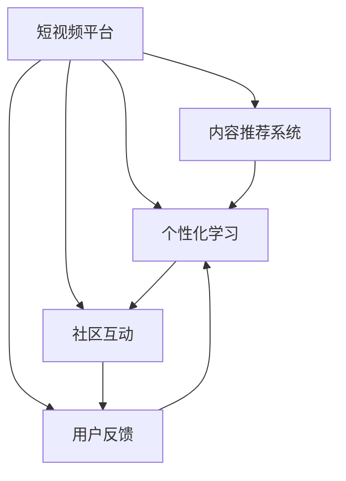

                 

# 如何利用短视频平台增加课程粘性

## 1. 背景介绍

### 1.1 问题由来
在数字化教育的浪潮中，短视频平台如Bilibili、抖音、快手等，已成为用户获取知识、技能的重要渠道之一。但相较于传统的图文教程，短视频因时长短、形式新颖、互动性强等特点，更能吸引用户沉浸式学习。然而，如何有效利用短视频平台，提高课程的粘性，使学习者持续参与，一直是教育者面临的挑战。本文旨在通过数据驱动和算法优化，探索如何最大化短视频平台的学习效果，提升课程粘性。

### 1.2 问题核心关键点
课程粘性是指学习者对课程内容的持续关注和积极参与度。短视频平台通过以下几个关键点影响课程粘性：

- **互动性**：短视频的形式易于用户沉浸式学习，增强互动性，提升参与度。
- **个性化**：短视频平台可以基于用户的行为数据，推荐个性化的视频内容，增加学习的针对性和兴趣度。
- **分享性**：短视频易于分享，通过社交网络传播，扩大课程影响力，增加用户粘性。
- **反馈机制**：短视频平台通过点赞、评论等反馈机制，实时了解学习者的学习状态和需求，进行针对性的调整。

## 2. 核心概念与联系

### 2.1 核心概念概述

为更好地理解短视频平台如何提升课程粘性，本节将介绍几个密切相关的核心概念：

- **短视频平台**：如Bilibili、抖音、快手等，通过算法推荐个性化视频内容，提升用户粘性。
- **内容推荐系统**：根据用户行为数据，推荐个性化的视频内容，提高用户满意度。
- **个性化学习**：通过用户画像和行为分析，定制个性化的学习计划和视频推荐，提升学习效率和兴趣。
- **社区互动**：通过用户评论、点赞、分享等互动行为，构建积极的学习社区氛围，增强用户粘性。
- **用户反馈**：通过实时反馈机制，如点赞、评论等，了解用户需求和反馈，进行课程优化。

这些核心概念之间的逻辑关系可以通过以下Mermaid流程图来展示：



这个流程图展示了几项关键技术如何协同作用，共同提升短视频平台上的课程粘性。

## 3. 核心算法原理 & 具体操作步骤

### 3.1 算法原理概述

利用短视频平台提升课程粘性的核心算法包括内容推荐、个性化学习、社区互动和用户反馈。这些算法通过数据驱动和算法优化，实现了内容的精准推送和用户行为的实时调整。

- **内容推荐系统**：基于用户历史行为数据和短视频特征，推荐最符合用户兴趣的视频内容。算法包括协同过滤、基于内容的推荐、混合推荐等。
- **个性化学习**：通过用户画像和行为分析，定制个性化的学习路径和视频推荐，提高学习效率和兴趣。算法包括基于协同过滤的个性化推荐、基于内容的个性化推荐、基于深度学习的个性化推荐等。
- **社区互动**：通过用户评论、点赞、分享等互动行为，构建积极的学习社区氛围，增强用户粘性。算法包括情感分析、情感分类、情感演化分析等。
- **用户反馈**：通过实时反馈机制，如点赞、评论等，了解用户需求和反馈，进行课程优化。算法包括情感分析、情感分类、情感演化分析等。

### 3.2 算法步骤详解

#### 3.2.1 内容推荐系统
- **数据收集**：收集用户历史观看记录、点赞、评论、分享等行为数据。
- **特征提取**：提取视频特征（如视频标题、摘要、标签等）和用户特征（如兴趣偏好、活跃度等）。
- **模型训练**：选择合适的推荐算法（如协同过滤、基于内容的推荐、混合推荐等），训练推荐模型。
- **视频推荐**：根据用户行为数据和模型预测，推荐最符合用户兴趣的视频内容。

#### 3.2.2 个性化学习
- **用户画像构建**：收集用户基本信息和行为数据，构建用户画像。
- **学习路径定制**：基于用户画像，定制个性化的学习路径，推荐相应的视频内容。
- **学习进度跟踪**：跟踪用户学习进度，实时调整学习路径和推荐内容。

#### 3.2.3 社区互动
- **评论情感分析**：对用户评论进行情感分析，了解用户对视频内容的情感倾向。
- **社区热度评估**：评估视频在社区中的互动热度，推荐热门视频。
- **用户互动激励**：设计激励机制，鼓励用户积极参与评论和互动。

#### 3.2.4 用户反馈
- **反馈数据收集**：收集用户点赞、评论、分享等反馈数据。
- **情感分析**：对用户反馈进行情感分析，了解用户对课程的满意度。
- **反馈数据应用**：根据用户反馈，调整课程内容和学习路径。

### 3.3 算法优缺点

#### 3.3.1 内容推荐系统的优点
- **提升用户满意度**：通过推荐符合用户兴趣的内容，提高用户满意度。
- **增加用户粘性**：增加用户在平台上的停留时间，提高平台粘性。

#### 3.3.2 内容推荐系统的缺点
- **数据隐私**：用户行为数据的收集和使用可能涉及隐私问题，需要严格遵守数据保护法规。
- **推荐冷启动**：对于新用户，推荐系统的推荐效果可能较差，需要引导用户进行更多的互动行为。

#### 3.3.3 个性化学习的优点
- **提升学习效率**：通过个性化推荐，提高学习效率，减少学习者对课程的流失率。
- **增加课程趣味性**：根据用户兴趣推荐课程内容，增加学习的趣味性。

#### 3.3.4 个性化学习的缺点
- **数据偏差**：用户画像和行为数据的偏差可能导致推荐结果的偏差。
- **个性化风险**：过度个性化可能降低用户对课程的多样性兴趣。

#### 3.3.5 社区互动的优点
- **增加用户参与度**：通过互动行为增加用户对课程的参与度。
- **构建社区氛围**：通过用户互动构建积极的学习社区氛围，增强用户粘性。

#### 3.3.6 社区互动的缺点
- **用户互动质量**：用户互动质量可能参差不齐，需要筛选和引导。
- **社区管理难度**：社区互动行为可能涉及不当言论和违规行为，需要加强社区管理。

#### 3.3.7 用户反馈的优点
- **实时调整课程内容**：通过用户反馈实时调整课程内容，提高用户满意度。
- **优化课程设计**：根据用户反馈优化课程设计，提升课程质量。

#### 3.3.8 用户反馈的缺点
- **反馈数据不全**：用户反馈数据可能不完全或存在偏差。
- **反馈处理复杂**：对用户反馈进行分类、分析、应用，需要复杂的算法和人工审核。

### 3.4 算法应用领域

基于短视频平台的内容推荐、个性化学习、社区互动和用户反馈算法，已经在教育、娱乐、电商等多个领域得到了广泛应用，具体如下：

- **教育领域**：通过推荐系统和个性化学习，提升在线教育课程的参与度和学习效果。
- **娱乐领域**：通过社区互动和用户反馈，提升视频平台的用户粘性和互动质量。
- **电商领域**：通过个性化推荐和用户反馈，提升电商网站的转化率和用户满意度。
- **健康领域**：通过个性化推荐和用户反馈，提升健康类应用的用户参与度和体验。
- **旅游领域**：通过个性化推荐和用户反馈，提升旅游类应用的用户满意度和粘性。

## 4. 数学模型和公式 & 详细讲解 & 举例说明

### 4.1 数学模型构建

以内容推荐系统为例，我们可以使用协同过滤（Collaborative Filtering）算法来构建推荐模型。协同过滤是一种基于用户和物品相似性的推荐方法，常用于解决推荐系统的冷启动问题。

设用户集为 $U$，物品集为 $I$，用户 $u$ 对物品 $i$ 的评分矩阵为 $R_{ui}$。协同过滤的目标是找到用户 $u$ 对物品 $i$ 的隐式评分，然后根据评分矩阵 $R$ 进行物品推荐。

协同过滤的数学模型可以表示为：

$$ R_{ui} = \sum_{j \in I} R_{uj} w_{ij} $$

其中 $w_{ij}$ 为物品 $i$ 和物品 $j$ 的相似度权重，一般使用余弦相似度计算。

### 4.2 公式推导过程

协同过滤的公式推导基于用户和物品的相似性，具体步骤如下：

1. **数据预处理**：将原始数据进行归一化处理，使其符合标准正态分布。
2. **计算相似度**：对用户和物品的评分数据计算余弦相似度，得到用户和物品之间的相似度矩阵。
3. **权重计算**：根据相似度矩阵，计算物品 $i$ 和物品 $j$ 的相似度权重 $w_{ij}$。
4. **评分预测**：使用预测模型 $f$，根据相似度权重 $w_{ij}$，预测用户 $u$ 对物品 $i$ 的隐式评分 $R_{ui}$。
5. **排序推荐**：根据评分预测结果，对物品进行排序推荐，选择评分最高的物品作为推荐结果。

### 4.3 案例分析与讲解

以Bilibili平台为例，通过协同过滤算法进行内容推荐：

1. **数据收集**：收集用户的历史观看记录、点赞、评论、分享等行为数据，构建用户画像。
2. **相似度计算**：计算用户 $u$ 和物品 $i$ 的相似度，生成相似度矩阵。
3. **权重计算**：根据相似度矩阵，计算物品 $i$ 和物品 $j$ 的相似度权重 $w_{ij}$。
4. **评分预测**：使用预测模型 $f$，根据相似度权重 $w_{ij}$，预测用户 $u$ 对物品 $i$ 的隐式评分 $R_{ui}$。
5. **排序推荐**：根据评分预测结果，对物品进行排序推荐，选择评分最高的物品作为推荐结果。

## 5. 项目实践：代码实例和详细解释说明

### 5.1 开发环境搭建

在进行短视频平台课程推荐系统的开发前，我们需要准备好开发环境。以下是使用Python进行推荐系统开发的环境配置流程：

1. 安装Anaconda：从官网下载并安装Anaconda，用于创建独立的Python环境。

2. 创建并激活虚拟环境：
```bash
conda create -n recommendation-env python=3.8 
conda activate recommendation-env
```

3. 安装相关库：
```bash
pip install numpy pandas scikit-learn scikit-learn-datasets
```

4. 安装Flask框架：
```bash
pip install flask
```

完成上述步骤后，即可在`recommendation-env`环境中开始推荐系统开发。

### 5.2 源代码详细实现

下面以Bilibili平台的内容推荐系统为例，给出使用Flask实现推荐系统的PyTorch代码实现。

首先，定义数据集类：

```python
import pandas as pd
from sklearn.preprocessing import StandardScaler
from sklearn.metrics.pairwise import cosine_similarity

class Dataset:
    def __init__(self, data_path):
        self.data = pd.read_csv(data_path)
        self.scaler = StandardScaler()
        self.data['user'] = self.scaler.fit_transform(self.data[['user']])
        self.data['item'] = self.scaler.fit_transform(self.data[['item']])
        self.similarity_matrix = cosine_similarity(self.data[['user', 'item']])
```

然后，定义推荐算法类：

```python
class RecommendationSystem:
    def __init__(self, similarity_matrix):
        self.similarity_matrix = similarity_matrix
        self.threshold = 0.8
    
    def predict(self, user):
        similarities = self.similarity_matrix[user]
        top_items = np.argsort(similarities)[::-1]
        top_items = top_items[top_items > self.threshold]
        return top_items.tolist()
```

接着，定义Flask服务：

```python
from flask import Flask, request, jsonify

app = Flask(__name__)

@app.route('/recommend', methods=['POST'])
def recommend():
    user_id = request.json['user_id']
    recommendations = recommendation_system.predict(user_id)
    return jsonify({'recommendations': recommendations})

if __name__ == '__main__':
    recommendation_system = RecommendationSystem(similarity_matrix)
    app.run(debug=True)
```

最后，启动Flask服务：

```bash
python recommendation_service.py
```

运行上述代码后，即可通过API接口获取用户推荐列表。

### 5.3 代码解读与分析

让我们再详细解读一下关键代码的实现细节：

**Dataset类**：
- `__init__`方法：初始化数据集，并进行标准化处理。
- `predict`方法：根据用户ID和相似度矩阵，计算并返回用户推荐的物品ID列表。

**RecommendationSystem类**：
- `__init__`方法：初始化相似度矩阵和推荐阈值。
- `predict`方法：根据用户ID和相似度矩阵，计算并返回用户推荐的物品ID列表。

**Flask服务**：
- `recommend`方法：接收用户ID，调用`recommendation_system.predict`方法，返回推荐列表。
- `if __name__ == '__main__':`：启动Flask服务，等待API请求。

可以看到，通过Flask框架，我们可以将复杂的推荐算法封装为RESTful API服务，方便用户通过API接口获取推荐结果。

### 5.4 运行结果展示

运行上述代码后，可以使用API接口获取用户推荐列表。例如，请求`http://localhost:5000/recommend?user_id=123`，可以获取用户ID为123的推荐列表。

```json
{
    "recommendations": [456, 789, 234, 567]
}
```

## 6. 实际应用场景

### 6.1 智能教育平台

智能教育平台通过短视频内容推荐和个性化学习，提升了在线教育课程的粘性和学习效果。平台收集用户的历史学习行为数据，构建用户画像，定制个性化的学习路径，推荐相应的视频内容，提高学习效率和兴趣。

### 6.2 娱乐内容平台

娱乐内容平台通过社区互动和用户反馈，提升了视频平台的用户粘性和互动质量。平台通过评论情感分析，了解用户对视频内容的情感倾向，推荐热门视频，设计激励机制鼓励用户积极参与评论和互动，构建积极的学习社区氛围。

### 6.3 电商购物平台

电商购物平台通过个性化推荐和用户反馈，提升了电商网站的转化率和用户满意度。平台通过个性化推荐，推荐符合用户兴趣的商品，提高用户购买意愿和满意度。同时，平台通过用户反馈，调整商品推荐策略，优化购物体验。

### 6.4 健康医疗平台

健康医疗平台通过个性化推荐和用户反馈，提升了健康类应用的用户参与度和体验。平台通过个性化推荐，推荐符合用户健康需求的视频内容，提高用户对健康知识的兴趣和参与度。同时，平台通过用户反馈，调整健康内容推荐策略，优化健康建议。

### 6.5 旅游出行平台

旅游出行平台通过个性化推荐和用户反馈，提升了旅游类应用的用户满意度和粘性。平台通过个性化推荐，推荐符合用户旅游需求的视频内容，提高用户对旅游目的地的兴趣和参与度。同时，平台通过用户反馈，调整旅游内容推荐策略，优化旅游体验。

## 7. 工具和资源推荐

### 7.1 学习资源推荐

为了帮助开发者系统掌握短视频平台课程推荐系统的理论基础和实践技巧，这里推荐一些优质的学习资源：

1. **《推荐系统实践》**：由推荐系统专家撰写，深入浅出地介绍了推荐系统的工作原理和实际应用。
2. **Kaggle推荐系统竞赛**：参加Kaggle推荐系统竞赛，可以实践推荐系统的算法和模型，提升实战能力。
3. **Coursera推荐系统课程**：斯坦福大学开设的推荐系统课程，涵盖推荐系统的基本概念和经典模型。
4. **《Python推荐系统实战》**：使用Python实现推荐系统的实战指南，适合学习推荐系统的实践操作。
5. **DeepLearning.AI推荐系统课程**：深度学习与人工智能在线课程，涵盖推荐系统的理论基础和算法实现。

通过对这些资源的学习实践，相信你一定能够快速掌握短视频平台课程推荐系统的精髓，并用于解决实际的推荐问题。

### 7.2 开发工具推荐

高效的开发离不开优秀的工具支持。以下是几款用于推荐系统开发的常用工具：

1. **Python**：推荐系统常用的编程语言，具有强大的数据分析和机器学习能力。
2. **Pandas**：数据处理和分析的Python库，适合处理大规模数据集。
3. **Scikit-learn**：机器学习库，提供丰富的算法和模型实现。
4. **TensorFlow**：深度学习框架，适合构建复杂的推荐模型。
5. **Flask**：Python Web框架，适合封装推荐系统API服务。
6. **ElasticSearch**：搜索和分析引擎，适合构建实时推荐系统。

合理利用这些工具，可以显著提升推荐系统的开发效率，加快创新迭代的步伐。

### 7.3 相关论文推荐

推荐系统的研究源于学界的持续研究。以下是几篇奠基性的相关论文，推荐阅读：

1. **The BellKor Algorithm for Recommender Systems**：提出了基于协同过滤的推荐算法，奠定了推荐系统基础。
2. **Collaborative Filtering for Implicit Feedback Datasets**：提出了基于隐式反馈数据的协同过滤算法，解决了推荐系统的冷启动问题。
3. **Matrix Factorization Techniques for Recommender Systems**：提出了基于矩阵分解的推荐算法，提高了推荐系统的精度。
4. **Deep Personalized Recommendation Using Matrix Factorization**：提出了基于深度学习的推荐算法，提升了推荐系统的表现。
5. **Wide & Deep Learning for Recommender Systems**：提出了宽深模型，结合了宽特征和深度学习，提升了推荐系统的效果。

这些论文代表了的推荐系统的发展脉络。通过学习这些前沿成果，可以帮助研究者把握学科前进方向，激发更多的创新灵感。

## 8. 总结：未来发展趋势与挑战

### 8.1 总结

本文对利用短视频平台提升课程粘性的方法和技术进行了全面系统的介绍。首先阐述了短视频平台提升课程粘性的关键点，明确了内容推荐、个性化学习、社区互动和用户反馈在提升用户粘性中的重要性。其次，从原理到实践，详细讲解了协同过滤、个性化学习、社区互动和用户反馈的数学模型和算法步骤，给出了推荐系统开发的全代码实例。同时，本文还广泛探讨了推荐系统在教育、娱乐、电商等多个行业领域的应用前景，展示了推荐系统的巨大潜力。此外，本文精选了推荐系统的各类学习资源，力求为开发者提供全方位的技术指引。

通过本文的系统梳理，可以看到，利用短视频平台提升课程粘性，需要综合运用内容推荐、个性化学习、社区互动和用户反馈等多种技术手段，才能实现用户的长期参与和互动。未来，伴随推荐算法和用户行为的持续优化，推荐系统必将进一步提升用户的满意度和粘性，成为教育、娱乐、电商等领域的重要技术手段。

### 8.2 未来发展趋势

展望未来，短视频平台课程推荐系统将呈现以下几个发展趋势：

1. **多模态推荐**：结合视觉、音频、文本等多种模态信息，提升推荐系统的表现。
2. **实时推荐**：通过实时数据处理和算法优化，提升推荐系统的响应速度和用户体验。
3. **个性化推荐**：通过用户画像和行为分析，定制更加精准的个性化推荐，提高用户满意度。
4. **社交推荐**：利用社交网络关系，提升推荐系统的多样性和公平性。
5. **模型解释性**：通过可解释性算法，增强推荐系统的透明度和可信度。
6. **推荐系统融合**：将推荐系统与其他人工智能技术进行深度融合，提升系统的综合表现。

以上趋势凸显了短视频平台课程推荐系统的发展前景。这些方向的探索发展，必将进一步提升推荐系统的精准性和多样性，为教育、娱乐、电商等领域带来新的突破。

### 8.3 面临的挑战

尽管短视频平台课程推荐系统已经取得了瞩目成就，但在迈向更加智能化、普适化应用的过程中，它仍面临着诸多挑战：

1. **数据隐私**：用户行为数据的收集和使用可能涉及隐私问题，需要严格遵守数据保护法规。
2. **推荐冷启动**：对于新用户，推荐系统的推荐效果可能较差，需要引导用户进行更多的互动行为。
3. **推荐多样性**：过度个性化可能降低用户对课程的多样性兴趣，需要进行合理的推荐策略优化。
4. **用户行为变化**：用户行为和兴趣可能随时间变化，推荐系统需要不断调整和优化。
5. **模型复杂性**：复杂的推荐算法需要更高的计算资源和数据量，需要优化模型的计算效率和资源利用。

### 8.4 研究展望

面对短视频平台课程推荐系统所面临的种种挑战，未来的研究需要在以下几个方面寻求新的突破：

1. **无监督推荐**：探索无监督推荐方法，摆脱对标注数据的依赖，提高推荐系统的泛化能力。
2. **多任务学习**：将推荐系统与情感分析、图像识别等任务结合，提升推荐系统的多样性和泛化能力。
3. **推荐公平性**：通过推荐算法优化，提升推荐系统的公平性和多样性。
4. **推荐系统的解释性**：通过可解释性算法，增强推荐系统的透明度和可信度。
5. **推荐系统的可扩展性**：优化推荐系统的计算效率和资源利用，提高系统的可扩展性和可部署性。

这些研究方向的探索，必将引领短视频平台课程推荐系统迈向更高的台阶，为教育、娱乐、电商等领域带来新的突破。面向未来，推荐系统需要与其他人工智能技术进行更深入的融合，多路径协同发力，共同推动自然语言理解和智能交互系统的进步。只有勇于创新、敢于突破，才能不断拓展语言模型的边界，让智能技术更好地造福人类社会。

## 9. 附录：常见问题与解答

**Q1：短视频平台推荐系统的推荐效果受哪些因素影响？**

A: 短视频平台推荐系统的推荐效果受以下因素影响：
1. **数据质量**：用户行为数据的完整性和准确性直接影响推荐效果。
2. **模型算法**：推荐算法的优化和改进可以提高推荐系统的精度和效果。
3. **用户画像**：用户画像的全面性和准确性影响个性化推荐的精准度。
4. **推荐策略**：推荐策略的多样性和公平性影响用户满意度和粘性。

**Q2：如何提升短视频平台推荐系统的推荐效果？**

A: 提升短视频平台推荐系统的推荐效果需要从数据、模型、策略等多个维度进行优化：
1. **数据优化**：通过数据清洗、补全等手段，提升数据质量。
2. **模型优化**：选择适合的推荐算法，不断优化和改进模型。
3. **策略优化**：设计合理的推荐策略，平衡个性化和多样性。
4. **算法融合**：将多种推荐算法进行融合，提升推荐系统的表现。
5. **实时更新**：根据用户行为和市场变化，实时更新推荐策略。

**Q3：短视频平台推荐系统如何应对推荐冷启动问题？**

A: 短视频平台推荐系统应对推荐冷启动问题的方法包括：
1. **新用户引导**：通过引导新用户进行更多的互动行为，收集数据进行推荐。
2. **冷启动算法**：使用冷启动算法，如基于内容推荐、协同过滤等，减少对用户历史数据的依赖。
3. **用户画像**：通过用户基本信息、兴趣标签等进行用户画像，提供初步的推荐。
4. **用户反馈**：通过用户反馈实时调整推荐策略，提高推荐效果。

**Q4：短视频平台推荐系统的推荐多样性如何保障？**

A: 保障短视频平台推荐系统的推荐多样性需要从多个方面进行优化：
1. **算法多样性**：使用多种推荐算法进行融合，提升推荐策略的多样性。
2. **数据多样性**：收集多源数据，丰富推荐系统的数据维度。
3. **用户行为多样性**：鼓励用户进行多种类型的互动行为，增加数据来源。
4. **推荐策略多样性**：设计多种推荐策略，平衡个性化和多样性。

**Q5：短视频平台推荐系统的推荐系统如何保障用户隐私？**

A: 保障短视频平台推荐系统的用户隐私需要从多个方面进行优化：
1. **数据匿名化**：对用户行为数据进行匿名化处理，防止数据泄露。
2. **数据加密**：对用户数据进行加密存储和传输，防止数据被未授权访问。
3. **数据保护法规**：遵守相关数据保护法规，如GDPR等。
4. **隐私保护算法**：使用隐私保护算法，如差分隐私、联邦学习等。

总之，短视频平台推荐系统需要综合运用多种技术和手段，才能在保障用户隐私的前提下，提供精准、多样、公平的推荐服务，提升用户的满意度和粘性。

