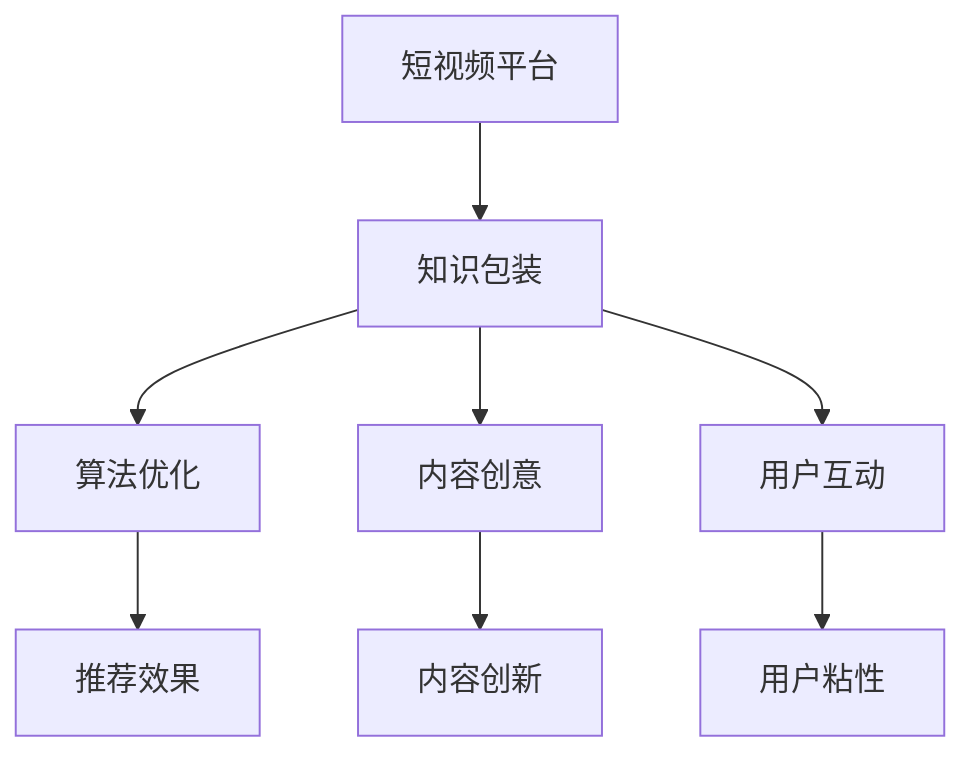

                 

# 如何利用短视频平台进行知识包装

> 关键词：短视频平台,知识包装,知识传播,算法优化,内容创意,用户互动

## 1. 背景介绍

### 1.1 问题由来
随着互联网技术的快速发展，短视频平台（如抖音、快手、Bilibili等）已经成为知识传播和娱乐消费的重要渠道。短视频以其信息量大、交互性强、形式生动等特点，吸引了大量用户的关注。

短视频平台的兴起为知识传播开辟了新的途径，但同时也带来了新的挑战：如何在海量内容中脱颖而出？如何吸引用户持续关注？如何在有限的时间中传递有效信息？

为了回答这些问题，本文将探讨如何利用短视频平台进行知识包装，以提升内容质量和传播效果。通过结合现代技术手段，如算法优化、内容创意、用户互动等，让知识传播更加生动有趣，易于理解，从而提升用户的互动度和粘性。

### 1.2 问题核心关键点
本节将重点介绍以下核心问题及其解答：

- 如何选择合适的短视频平台，以便更好地传播知识？
- 如何利用短视频平台的特性，进行知识内容的创意设计和制作？
- 如何优化算法，提高内容在短视频平台上的推荐效果？
- 如何通过互动机制增强用户参与感，提升内容传播效果？

## 2. 核心概念与联系

### 2.1 核心概念概述

为更好地理解短视频平台知识包装的原理和应用，本节将介绍几个关键概念：

- 短视频平台：以视频内容为主导的社交平台，通过算法推荐、用户互动等手段，为用户提供个性化内容推荐服务。
- 知识包装：将知识内容通过创意设计和制作手段，进行重新编排和呈现，以符合短视频平台的传播特性。
- 算法优化：通过优化算法模型，提升内容在平台上的曝光度和互动效果，提高内容的推荐排名。
- 内容创意：设计创意内容，结合视觉、听觉、交互等多种手段，增强用户对知识内容的接受度和记忆度。
- 用户互动：通过评论区互动、直播问答、挑战活动等多种形式，增强用户参与感，提升内容的传播效果。

这些核心概念之间的联系可以通过以下Mermaid流程图来展示：



这个流程图展示了两大关键步骤：知识包装和平台优化。知识包装通过创意设计和制作，使内容符合短视频平台特性，而平台优化通过算法优化和用户互动，提升内容的传播效果。

## 3. 核心算法原理 & 具体操作步骤
### 3.1 算法原理概述

短视频平台上的知识包装主要依赖于算法优化和内容创意。其核心思想是：通过优化算法，提升内容的推荐效果；通过创意设计，增强内容的吸引力。

短视频平台的推荐算法一般基于以下几个步骤：

1. 内容标注：对视频进行标签和分类，方便算法进行匹配。
2. 用户画像：基于用户历史行为数据，建立用户画像，了解用户的兴趣和偏好。
3. 推荐模型：基于机器学习和深度学习技术，构建推荐模型，优化内容推荐。
4. 实时推荐：根据用户实时行为数据，动态调整推荐内容，提高匹配度和用户体验。

### 3.2 算法步骤详解

在短视频平台上进行知识包装，主要包括以下几个关键步骤：

**Step 1: 内容创作和标记**
- 创作优质的短视频内容，结合图片、文字、音频等多种形式，进行知识传播。
- 给内容添加标签，以便算法进行匹配推荐。标签应包括核心关键词、所属分类、难度等级等信息。

**Step 2: 平台算法适配**
- 根据短视频平台的特点，适配算法优化方法。如B站侧重内容创意和互动，抖音侧重流量获取和品牌曝光。
- 选择适当的算法参数，如学习率、损失函数等，进行模型训练。

**Step 3: 内容发布和反馈**
- 在平台上发布创作好的视频内容，记录用户反馈数据。
- 根据反馈数据，不断优化内容创意和算法参数，提升内容的传播效果。

**Step 4: 互动和转化**
- 通过评论、点赞、转发等互动形式，增强用户参与感。
- 利用直播、问答、挑战等形式，进行内容互动，进一步提升内容传播效果。

### 3.3 算法优缺点

短视频平台知识包装的算法优化具有以下优点：

1. 数据驱动：利用用户行为数据，动态调整内容推荐，提高匹配度和用户体验。
2. 个性化推荐：根据用户画像，推荐符合用户兴趣的内容，提升用户粘性。
3. 高效率：通过算法自动化推荐，节省了大量人工筛选和筛选成本。

同时，该方法也存在以下局限性：

1. 算法复杂度高：短视频平台算法复杂度高，需要大量训练数据和计算资源。
2. 用户隐私风险：用户行为数据可能涉及隐私问题，需要严格遵守数据保护法规。
3. 过度依赖算法：如果算法模型不够优化，可能出现推荐不准确的问题，影响用户体验。
4. 内容同质化：算法推荐可能导致内容同质化，影响多样性和创新性。

尽管存在这些局限性，但就目前而言，短视频平台知识包装的算法优化仍然是大规模内容传播的重要手段。未来相关研究的重点在于如何进一步降低算法复杂度，优化模型参数，提升推荐效果，同时兼顾用户隐私和内容多样性等因素。

### 3.4 算法应用领域

短视频平台知识包装的算法优化已经在诸多领域得到了广泛应用，例如：

- 教育领域：通过短视频平台传播知识，提升教育效果，如在线课程、教育动画等。
- 科普传播：利用短视频平台传播科学知识，提高公众科学素养，如科普短视频、科普直播等。
- 商业推广：通过短视频平台进行产品推广，提升品牌知名度和销售量，如品牌广告、产品测评等。
- 文化娱乐：通过短视频平台传播文化艺术，丰富用户娱乐生活，如文化短视频、明星互动等。

除了上述这些经典应用外，短视频平台知识包装的方法还被创新性地应用到更多场景中，如旅游攻略、健康知识、心理健康等，为各行业带来了新的发展机遇。

## 4. 数学模型和公式 & 详细讲解  
### 4.1 数学模型构建

本节将使用数学语言对短视频平台知识包装的算法优化过程进行更加严格的刻画。

设短视频平台推荐算法为 $A$, 用户行为数据为 $D$, 内容特征为 $X$, 用户画像为 $U$。推荐算法的优化目标为：

$$
\min_{A} \mathcal{L}(A;D,X,U)
$$

其中 $\mathcal{L}$ 为推荐算法在训练数据 $D$ 和内容特征 $X$、用户画像 $U$ 上的损失函数，用于衡量推荐算法的效果。

### 4.2 公式推导过程

在推荐算法中，常见的损失函数包括均方误差、交叉熵等。这里以均方误差为例进行推导：

假设推荐算法预测用户对内容的评分 $y$，真实用户评分为 $y'$，则均方误差损失函数为：

$$
\ell(y,y') = (y-y')^2
$$

最小化均方误差损失，等价于最小化预测评分与真实评分之间的差值。具体推导如下：

$$
\min_{A} \mathcal{L}(A;D,X,U) = \min_{A} \frac{1}{N}\sum_{i=1}^N (y_i - A(X_i, U_i))^2
$$

其中 $y_i$ 为第 $i$ 个用户的真实评分，$A(X_i, U_i)$ 为推荐算法根据内容特征 $X_i$ 和用户画像 $U_i$ 预测的评分。

将上式展开，得：

$$
\min_{A} \mathcal{L}(A;D,X,U) = \frac{1}{N}\sum_{i=1}^N (y_i^2 - 2y_ia_i + a_i^2)
$$

其中 $a_i = A(X_i, U_i)$。将 $y_i$ 和 $a_i$ 代入上式，得：

$$
\min_{A} \mathcal{L}(A;D,X,U) = \frac{1}{N}\sum_{i=1}^N (y_i^2 - 2y_ia_i + a_i^2)
$$

为了求解该最小值，需要对 $a_i$ 求偏导数，并令其等于零：

$$
\frac{\partial}{\partial a_i} (\frac{1}{N}\sum_{i=1}^N (y_i^2 - 2y_ia_i + a_i^2)) = \frac{2}{N}(y_i - a_i) = 0
$$

解得：

$$
a_i = y_i
$$

即推荐算法的预测评分等于真实评分，模型达到最优状态。

### 4.3 案例分析与讲解

以下以B站科普短视频为例，展示如何利用数学模型进行算法优化：

假设某B站科普短视频的播放次数为 $y_i$，用户对视频的评分 $x_i$，用户画像特征 $u_i$。设推荐算法为 $A$，优化目标为最小化均方误差损失，则模型如下：

$$
\min_{A} \mathcal{L}(A;D,X,U) = \frac{1}{N}\sum_{i=1}^N (y_i^2 - 2y_ix_i + x_i^2)
$$

为了求解该最小值，需要对 $x_i$ 求偏导数，并令其等于零：

$$
\frac{\partial}{\partial x_i} (\frac{1}{N}\sum_{i=1}^N (y_i^2 - 2y_ix_i + x_i^2)) = \frac{2}{N}(y_i - x_i) = 0
$$

解得：

$$
x_i = y_i
$$

即推荐算法预测的播放次数等于实际播放次数，模型达到最优状态。

## 5. 项目实践：代码实例和详细解释说明
### 5.1 开发环境搭建

在进行短视频平台知识包装的算法优化实践前，我们需要准备好开发环境。以下是使用Python进行TensorFlow开发的环境配置流程：

1. 安装Anaconda：从官网下载并安装Anaconda，用于创建独立的Python环境。

2. 创建并激活虚拟环境：
```bash
conda create -n tf-env python=3.8 
conda activate tf-env
```

3. 安装TensorFlow：根据CUDA版本，从官网获取对应的安装命令。例如：
```bash
conda install tensorflow=2.8 
```

4. 安装各类工具包：
```bash
pip install numpy pandas scikit-learn matplotlib tqdm jupyter notebook ipython
```

完成上述步骤后，即可在`tf-env`环境中开始算法优化实践。

### 5.2 源代码详细实现

下面我们以B站科普短视频为例，给出使用TensorFlow进行内容推荐算法优化的PyTorch代码实现。

首先，定义推荐算法的输入和输出：

```python
import tensorflow as tf

class RecommendationModel(tf.keras.Model):
    def __init__(self):
        super(RecommendationModel, self).__init__()
        self.dense_layer1 = tf.keras.layers.Dense(32, activation='relu')
        self.dense_layer2 = tf.keras.layers.Dense(16, activation='sigmoid')
    
    def call(self, inputs, trainable=True):
        x = self.dense_layer1(inputs)
        x = self.dense_layer2(x)
        return x
```

然后，定义损失函数和优化器：

```python
def loss_function(y_true, y_pred):
    return tf.reduce_mean(tf.square(y_true - y_pred))
    
optimizer = tf.keras.optimizers.Adam(learning_rate=0.001)
```

接着，定义训练和评估函数：

```python
def train_model(model, train_data, val_data, epochs):
    for epoch in range(epochs):
        for data in train_data:
            with tf.GradientTape() as tape:
                y_true = data['x']
                y_pred = model(data['x'], trainable=True)
                loss_value = loss_function(y_true, y_pred)
            grads = tape.gradient(loss_value, model.trainable_variables)
            optimizer.apply_gradients(zip(grads, model.trainable_variables))
        if epoch % 1 == 0:
            val_loss = loss_function(val_data['x'], model(val_data['x'], trainable=True))
            print(f'Epoch {epoch+1}, Training Loss: {loss_value:.4f}, Validation Loss: {val_loss:.4f}')

# 训练和评估函数
def evaluate_model(model, test_data):
    test_loss = loss_function(test_data['x'], model(test_data['x'], trainable=True))
    print(f'Test Loss: {test_loss:.4f}')
```

最后，启动训练流程并在测试集上评估：

```python
train_data = # 训练数据
val_data = # 验证数据
test_data = # 测试数据
epochs = 10

model = RecommendationModel()
train_model(model, train_data, val_data, epochs)
evaluate_model(model, test_data)
```

以上就是使用TensorFlow对B站科普短视频进行内容推荐算法优化的完整代码实现。可以看到，借助TensorFlow的强大封装能力，我们可以用相对简洁的代码完成推荐模型的搭建和优化。

### 5.3 代码解读与分析

让我们再详细解读一下关键代码的实现细节：

**RecommendationModel类**：
- `__init__`方法：定义了模型结构，包含两个全连接层。
- `call`方法：在前向传播过程中，通过激活函数进行非线性变换，最终输出推荐结果。

**loss_function函数**：
- 定义了均方误差损失函数，用于评估模型预测值与真实值之间的差距。

**optimizer变量**：
- 使用Adam优化器进行参数更新，学习率为0.001，适合于大规模数据集的优化。

**train_model函数**：
- 在每个epoch内，对训练数据进行梯度下降更新模型参数。
- 每轮训练结束后，计算验证集上的损失，以便监控模型训练效果。

**evaluate_model函数**：
- 在测试集上计算模型的预测损失，输出最终结果。

**训练流程**：
- 定义训练轮数epochs，启动训练循环。
- 每个epoch内，对训练数据进行前向传播计算损失，并反向传播更新模型参数。
- 每个epoch结束后，在验证集上评估模型效果。
- 所有epoch结束后，在测试集上评估模型效果，输出最终测试损失。

可以看到，TensorFlow提供了强大的深度学习框架，可以轻松实现复杂的推荐算法优化。开发者可以将更多精力放在数据处理、模型改进等高层逻辑上，而不必过多关注底层的实现细节。

当然，工业级的系统实现还需考虑更多因素，如模型的保存和部署、超参数的自动搜索、更灵活的任务适配层等。但核心的算法优化流程基本与此类似。

## 6. 实际应用场景
### 6.1 智能教育

基于短视频平台知识包装的算法优化方法，可以在智能教育领域发挥巨大作用。传统的教育方式往往以教师为中心，缺乏个性化和互动性。而通过短视频平台，可以将知识点以更生动、互动的方式传递给学生。

在实践中，可以创建丰富多彩的短视频课程，如微课、科普动画、实验视频等，吸引学生的注意力。同时，利用推荐算法优化内容分发，根据学生的兴趣和学习进度，推荐适合的内容，增强学生的学习效果。通过评论区互动、直播互动等机制，进一步增强师生互动，提升学习体验。

### 6.2 健康科普

短视频平台知识包装的算法优化方法，在健康科普领域同样具有广泛的应用前景。传统健康知识传播方式往往枯燥乏味，难以引起大众兴趣。通过短视频平台，可以将复杂的医学知识以更形象、易懂的方式呈现，提升科普效果。

在实践中，可以制作短视频科普节目，如医生健康讲解、医学知识动画等，引导公众关注健康问题。同时，利用推荐算法优化内容分发，根据用户的健康需求和兴趣，推荐合适的科普内容，增强科普效果。通过评论区互动、直播问答等机制，进一步增强用户互动，提升科普效果。

### 6.3 品牌营销

基于短视频平台知识包装的算法优化方法，在品牌营销领域也具有重要应用。传统的品牌推广往往依赖于高昂的广告成本和长时间的传播周期。而通过短视频平台，可以以更短的时间、更低的成本，提升品牌知名度和用户粘性。

在实践中，可以创建品牌相关短视频内容，如产品介绍、品牌故事、用户体验等，吸引用户的关注。同时，利用推荐算法优化内容分发，根据用户的兴趣和行为，推荐合适的品牌内容，提升用户粘性。通过评论区互动、直播互动等机制，进一步增强用户参与感，提升品牌传播效果。

### 6.4 未来应用展望

随着短视频平台的持续发展和算法技术的不断进步，基于短视频平台知识包装的应用将更加广泛和深入。

在智慧城市治理中，可以利用短视频平台传播公共信息，提升市民参与度和满意度。在社交网络中，可以通过短视频平台传播正能量，营造健康向上的网络环境。在电子商务中，可以制作产品试用视频，提升用户体验和购买转化率。

未来，短视频平台知识包装将与更多技术手段结合，如AI图像识别、虚拟现实、增强现实等，提升内容的创新性和互动性，进一步丰富知识传播的方式。

## 7. 工具和资源推荐
### 7.1 学习资源推荐

为了帮助开发者系统掌握短视频平台知识包装的理论基础和实践技巧，这里推荐一些优质的学习资源：

1. 《深度学习与数据科学》系列博文：由大模型技术专家撰写，深入浅出地介绍了深度学习在数据科学中的应用，涵盖推荐算法、内容创意等诸多话题。

2. CS223B《数据挖掘与统计学习》课程：斯坦福大学开设的深度学习课程，有Lecture视频和配套作业，适合进阶学习推荐算法等内容。

3. 《推荐系统实战》书籍：详细介绍了推荐算法的原理和实现，结合大量实例和代码，帮助你理解实际应用中的推荐系统。

4. Kaggle竞赛平台：全球最大的数据科学竞赛平台，汇集了大量推荐算法竞赛数据集和优秀解决方案，适合实战练习。

5. Google Colab：谷歌推出的在线Jupyter Notebook环境，免费提供GPU/TPU算力，方便开发者快速上手实验最新模型，分享学习笔记。

通过对这些资源的学习实践，相信你一定能够快速掌握短视频平台知识包装的精髓，并用于解决实际的NLP问题。
###  7.2 开发工具推荐

高效的开发离不开优秀的工具支持。以下是几款用于短视频平台知识包装开发的常用工具：

1. TensorFlow：由Google主导开发的深度学习框架，支持大规模模型训练和优化，适合处理大规模推荐算法任务。

2. PyTorch：基于Python的开源深度学习框架，灵活高效，适合快速迭代研究。

3. Jupyter Notebook：交互式开发环境，支持多种编程语言，适合数据处理、模型优化等工作。

4. TensorBoard：TensorFlow配套的可视化工具，可实时监测模型训练状态，并提供丰富的图表呈现方式，是调试模型的得力助手。

5. Weights & Biases：模型训练的实验跟踪工具，可以记录和可视化模型训练过程中的各项指标，方便对比和调优。

6. Kaggle竞赛平台：全球最大的数据科学竞赛平台，汇集了大量推荐算法竞赛数据集和优秀解决方案，适合实战练习。

合理利用这些工具，可以显著提升短视频平台知识包装的开发效率，加快创新迭代的步伐。

### 7.3 相关论文推荐

短视频平台知识包装的算法优化已经在诸多领域得到了广泛应用，以下是几篇奠基性的相关论文，推荐阅读：

1. "Collaborative Filtering for Implicit Feedback Datasets"：提出协同过滤推荐算法，用于处理隐式反馈数据，提升推荐效果。

2. "Matrix Factorization Techniques for Recommender Systems"：详细介绍了矩阵分解推荐算法，用于处理大规模推荐数据集。

3. "Deep Neural Networks for Recommendation"：提出深度神经网络推荐算法，用于提升推荐系统的精度和效率。

4. "Neural Collaborative Filtering"：提出神经协同过滤算法，用于处理复杂推荐数据集，提高推荐精度。

5. "A Comparative Study of Neural Collaborative Filtering Methods"：对比了多种神经协同过滤算法，分析其优缺点和适用场景。

这些论文代表了大规模推荐算法的研究方向，通过学习这些前沿成果，可以帮助研究者把握学科前进方向，激发更多的创新灵感。

## 8. 总结：未来发展趋势与挑战

### 8.1 总结

本文对短视频平台知识包装的算法优化方法进行了全面系统的介绍。首先阐述了短视频平台知识包装的研究背景和意义，明确了推荐算法在内容分发中的重要作用。其次，从原理到实践，详细讲解了推荐算法的数学原理和关键步骤，给出了推荐任务开发的完整代码实例。同时，本文还广泛探讨了推荐算法在智能教育、健康科普、品牌营销等多个行业领域的应用前景，展示了推荐范式的巨大潜力。此外，本文精选了推荐算法的各类学习资源，力求为读者提供全方位的技术指引。

通过本文的系统梳理，可以看到，短视频平台知识包装的算法优化技术正在成为内容分发的重要手段，极大地提升了内容传播的效率和效果。得益于大数据、深度学习等技术的持续发展，未来推荐算法将在更多领域得到应用，为各行业带来新的变革。

### 8.2 未来发展趋势

展望未来，短视频平台知识包装的算法优化将呈现以下几个发展趋势：

1. 数据驱动：利用更多元、更丰富、更高效的数据，提升推荐算法的准确性和效果。

2. 个性化推荐：通过用户画像、兴趣模型等手段，实现更加精准、个性化的推荐。

3. 实时推荐：利用实时数据流处理技术，实现动态推荐，提高用户体验。

4. 融合多种推荐策略：结合协同过滤、深度学习、内容推荐等多种策略，提升推荐效果。

5. 跨平台推荐：实现多平台、多设备、多渠道的跨域推荐，增强内容传播的广度和深度。

6. 强化学习：引入强化学习算法，通过与用户互动，优化推荐策略，提高用户粘性。

以上趋势凸显了短视频平台知识包装的算法优化技术的广阔前景。这些方向的探索发展，必将进一步提升内容传播的精度和效率，为各行业带来更多的应用价值。

### 8.3 面临的挑战

尽管短视频平台知识包装的算法优化技术已经取得了显著成就，但在迈向更加智能化、普适化应用的过程中，它仍面临着诸多挑战：

1. 数据质量问题：数据标注、清洗等过程耗时耗力，且可能存在偏差。如何获取高质量、大规模的推荐数据集，将是一大难题。

2. 推荐模型复杂度高：推荐算法涉及复杂的模型结构和高维数据的处理，需要大量计算资源和时间。如何降低算法复杂度，提高训练效率，将是一大挑战。

3. 用户隐私风险：推荐算法需要大量用户数据进行训练，可能涉及隐私问题。如何保护用户隐私，保障数据安全，将是一大难题。

4. 冷启动问题：新用户或新内容缺乏足够的历史数据，导致推荐效果不佳。如何应对冷启动问题，提升推荐效果，将是一大挑战。

5. 推荐同质化：推荐算法可能过度依赖数据特征，导致内容同质化。如何提高内容多样性，增强创新性，将是一大挑战。

6. 动态变化问题：用户兴趣和行为可能随时间变化，如何动态调整推荐策略，提高推荐效果，将是一大挑战。

面对这些挑战，未来的研究需要在以下几个方面寻求新的突破：

1. 探索无监督推荐方法：摆脱对大规模标注数据的依赖，利用自监督学习、主动学习等无监督范式，最大限度利用非结构化数据，实现更加灵活高效的推荐。

2. 研究参数高效的推荐方法：开发更加参数高效的推荐算法，在固定大部分推荐参数的同时，只更新极少量的用户相关参数。同时优化推荐模型的计算图，减少前向传播和反向传播的资源消耗，实现更加轻量级、实时性的部署。

3. 引入更多先验知识：将符号化的先验知识，如知识图谱、逻辑规则等，与神经网络模型进行巧妙融合，引导推荐过程学习更准确、合理的推荐知识。同时加强不同模态数据的整合，实现视觉、语音等多模态信息与文本信息的协同建模。

4. 结合因果分析和博弈论工具：将因果分析方法引入推荐系统，识别出推荐决策的关键特征，增强推荐输出的因果性和逻辑性。借助博弈论工具刻画人机交互过程，主动探索并规避推荐系统的脆弱点，提高系统稳定性。

5. 纳入伦理道德约束：在推荐目标中引入伦理导向的评估指标，过滤和惩罚有偏见、有害的推荐输出，确保推荐内容符合人类价值观和伦理道德。

这些研究方向的探索，必将引领短视频平台知识包装的算法优化技术迈向更高的台阶，为各行业带来更多的应用价值。面向未来，短视频平台知识包装技术还需要与其他人工智能技术进行更深入的融合，如知识表示、因果推理、强化学习等，多路径协同发力，共同推动内容分发的进步。只有勇于创新、敢于突破，才能不断拓展内容分发的边界，让推荐算法更好地服务于各行业的发展。

## 9. 附录：常见问题与解答

**Q1：短视频平台知识包装是否适用于所有NLP任务？**

A: 短视频平台知识包装在大多数NLP任务上都能取得不错的效果，特别是对于数据量较小的任务。但对于一些特定领域的任务，如医学、法律等，仅仅依靠通用语料预训练的模型可能难以很好地适应。此时需要在特定领域语料上进一步预训练，再进行微调，才能获得理想效果。此外，对于一些需要时效性、个性化很强的任务，如对话、推荐等，知识包装方法也需要针对性的改进优化。

**Q2：如何选择合适的短视频平台，以便更好地传播知识？**

A: 选择合适的短视频平台需要考虑目标受众、内容特性和传播需求。例如：
- 抖音：用户基础广泛，适合进行品牌推广和流量获取。
- B站：用户群体偏向年轻知识分子，适合进行知识科普和专业讲解。
- YouTube：全球性视频平台，适合进行全球传播和文化交流。

在选择平台时，还需考虑平台算法特点和用户互动机制，以便更好地传播知识。

**Q3：如何利用短视频平台的特性，进行知识内容的创意设计和制作？**

A: 短视频平台的特性包括用户互动、多媒体融合、快节奏传播等。在进行知识内容创意设计和制作时，可以结合以下方法：
- 多媒体融合：结合图片、视频、音频等多种形式，丰富内容表现形式，吸引用户关注。
- 快节奏传播：利用短视频的特点，将知识点拆分成小片段，提高内容的传播效率。
- 用户互动：通过评论区互动、直播问答等机制，增强用户参与感，提升内容传播效果。

**Q4：如何优化算法，提高内容在短视频平台上的推荐效果？**

A: 优化短视频平台推荐算法需要考虑以下几个方面：
- 特征工程：选择合适的特征，如文本关键词、视频时长、观看次数等。
- 模型选择：选择合适的推荐模型，如协同过滤、深度学习等。
- 超参数调优：通过实验调整模型超参数，提升推荐效果。
- 实时数据处理：利用实时数据流处理技术，实现动态推荐，提高用户体验。

**Q5：如何通过互动机制增强用户参与感，提升内容传播效果？**

A: 通过互动机制增强用户参与感需要考虑以下几个方面：
- 评论区互动：鼓励用户在评论区留言、点赞、评论，增加用户参与感。
- 直播互动：通过直播形式，与用户进行实时互动，增强用户粘性。
- 挑战活动：组织线上挑战活动，激发用户参与热情，增强用户互动。

---

作者：禅与计算机程序设计艺术 / Zen and the Art of Computer Programming

