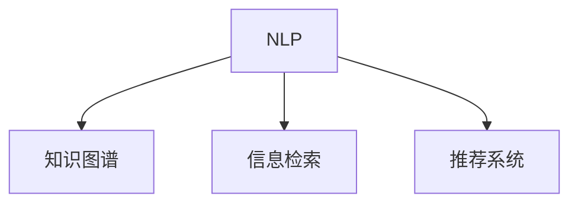

                 

# 如何利用虚拟助理提升知识服务的智能化

## 1. 背景介绍

### 1.1 问题由来
随着信息技术的迅猛发展，知识服务行业面临着巨大挑战和机遇。传统知识服务主要依赖人工提供，效率低下，难以满足用户对知识获取的实时性和个性化需求。而基于人工智能技术的虚拟助理，以其高效、智能、全天候的特点，正在逐步取代人工，成为知识服务的新引擎。

虚拟助理不仅能理解自然语言，还能基于庞大的语料库和知识图谱进行知识检索和推荐，极大地提高了知识服务的响应速度和准确性。目前，虚拟助理已经在多个领域得到广泛应用，如医疗咨询、金融理财、教育辅导等，为用户提供了更加个性化、高效的知识服务。

### 1.2 问题核心关键点
虚拟助理的核心技术包括自然语言处理(NLP)、知识图谱构建、信息检索和推荐系统等。其中，自然语言处理技术是虚拟助理智能化的基础，通过对用户输入的语料进行分析，虚拟助理能够理解用户的意图，提取关键信息，并调用知识图谱进行信息检索和推荐。知识图谱构建则是虚拟助理智能化进程中的关键环节，构建全面、准确的知识图谱能够为虚拟助理提供可靠的信息源。信息检索和推荐系统则决定了虚拟助理的智能化水平，通过精准的检索和推荐，能够快速定位用户需要的知识信息，提升用户满意度。

## 2. 核心概念与联系

### 2.1 核心概念概述

为更好地理解虚拟助理的知识服务智能化过程，本节将介绍几个密切相关的核心概念：

- 自然语言处理(NLP)：利用计算机对自然语言进行处理和理解的技术，包括分词、词性标注、句法分析、语义分析等。NLP技术是虚拟助理智能化的基础，负责将用户输入的自然语言转化为机器可理解的形式。
- 知识图谱(Knowledge Graph)：由实体、关系、属性组成的图结构，用于描述实体之间的关系和属性。知识图谱为虚拟助理提供了丰富的知识源，帮助其进行信息检索和推荐。
- 信息检索(Information Retrieval)：从大量数据中检索出用户所需信息的技术。虚拟助理通过信息检索系统，从知识图谱中查找与用户输入相关联的信息。
- 推荐系统(Recommendation System)：根据用户历史行为和偏好，推荐用户可能感兴趣的信息。虚拟助理通过推荐系统，为用户提供个性化的信息推荐。

这些核心概念之间的逻辑关系可以通过以下Mermaid流程图来展示：



这个流程图展示了大语言模型的核心概念及其之间的关系：

1. NLP技术将用户输入的自然语言转化为机器可理解的形式。
2. 知识图谱为NLP提供了丰富的语义信息，帮助其进行信息检索。
3. 信息检索系统从知识图谱中检索出用户所需的信息。
4. 推荐系统基于用户历史行为和偏好，进行个性化推荐。

这些核心概念共同构成了虚拟助理的知识服务智能化框架，使其能够理解用户意图，快速检索相关信息，并进行个性化推荐。通过理解这些核心概念，我们可以更好地把握虚拟助理的工作原理和优化方向。

## 3. 核心算法原理 & 具体操作步骤
### 3.1 算法原理概述

虚拟助理的知识服务智能化过程，本质上是一个基于自然语言处理的信息检索和推荐过程。其核心思想是：通过NLP技术将用户输入的自然语言转化为机器可理解的形式，然后基于知识图谱构建的信息检索和推荐系统，快速定位用户所需的信息，并进行个性化推荐。

形式化地，假设用户输入的自然语言查询为 $q$，知识图谱为 $G$。虚拟助理的知识服务过程可以描述为：

1. 输入用户查询 $q$ 到 NLP 系统，提取关键信息 $i_1, i_2, ..., i_n$。
2. 从知识图谱 $G$ 中检索出与 $i_1, i_2, ..., i_n$ 相关的实体 $e_1, e_2, ..., e_m$。
3. 根据实体 $e_1, e_2, ..., e_m$ 的属性和关系，构建候选答案集 $A$。
4. 利用推荐算法，从候选答案集 $A$ 中选出最符合用户偏好的答案。
5. 将答案返回给用户。

### 3.2 算法步骤详解

虚拟助理的知识服务智能化过程可以分为以下几个关键步骤：

**Step 1: 构建知识图谱**
- 从可信的知识源（如百科、新闻、学术论文等）收集数据，构建实体和实体之间的关系。
- 使用实体识别、关系抽取等技术从文本中提取实体和关系。
- 使用规则或机器学习算法构建知识图谱。

**Step 2: 实现自然语言处理**
- 使用分词、词性标注、命名实体识别等技术将用户输入的自然语言转化为结构化形式。
- 利用语义分析技术提取用户意图和关键信息。

**Step 3: 信息检索**
- 根据提取的关键信息，从知识图谱中检索出相关的实体和关系。
- 使用相似度计算算法（如向量空间模型、图嵌入模型等）计算实体之间的相似度。
- 根据相似度排序，选择与用户输入最相关的实体和关系。

**Step 4: 推荐系统**
- 根据用户历史行为和偏好，构建用户画像。
- 使用协同过滤、基于内容的推荐算法等，从候选答案集中推荐最符合用户偏好的答案。
- 结合用户反馈，不断优化推荐算法，提高推荐效果。

**Step 5: 返回答案**
- 将选出的答案以自然语言的形式返回给用户。
- 提供多轮对话支持，不断优化对话流程，提升用户体验。

以上是虚拟助理知识服务智能化的基本流程。在实际应用中，还需要针对具体任务进行优化设计，如改进NLP模型、优化知识图谱构建方法、引入更多的推荐算法等，以进一步提升服务效果。

### 3.3 算法优缺点

虚拟助理的知识服务智能化方法具有以下优点：
1. 高效性。利用自然语言处理和知识图谱构建，虚拟助理能够快速响应用户查询，提供即时的知识服务。
2. 智能性。通过信息检索和推荐系统，虚拟助理能够根据用户历史行为和偏好，提供个性化、精准的知识服务。
3. 多轮对话支持。虚拟助理可以支持多轮对话，不断优化对话流程，提升用户体验。
4. 可扩展性。知识图谱和推荐算法可以通过不断扩展和优化，适应不同应用场景的需求。

同时，该方法也存在一定的局限性：
1. 数据依赖性。虚拟助理的智能化程度高度依赖于知识图谱和用户数据的质量，获取高质量的数据成本较高。
2. 数据隐私。虚拟助理需要收集用户数据进行个性化推荐，可能涉及到用户隐私保护问题。
3. 模型复杂度。知识图谱构建和推荐系统算法复杂度较高，需要较高的计算资源和时间成本。
4. 实时性。在大规模知识图谱和用户数据下，虚拟助理的响应速度可能较慢，影响用户体验。

尽管存在这些局限性，但就目前而言，虚拟助理的知识服务智能化方法仍然是大规模知识服务的关键技术之一。未来相关研究的重点在于如何进一步降低对数据和算力的依赖，提高服务实时性，同时兼顾隐私保护和用户体验。

### 3.4 算法应用领域

虚拟助理的知识服务智能化方法已经在多个领域得到广泛应用，例如：

- 医疗咨询：虚拟助理可以通过构建医疗知识图谱，提供疾病诊断、药物推荐等医疗服务。
- 金融理财：虚拟助理可以提供理财咨询、股票分析等金融服务，利用知识图谱进行信息检索和推荐。
- 教育辅导：虚拟助理可以提供作业辅导、知识问答等教育服务，根据学生历史学习行为进行个性化推荐。
- 智能客服：虚拟助理可以替代人工客服，提供全天候的客户服务，利用知识图谱进行信息检索和问题解答。
- 个人助理：虚拟助理可以提供个性化生活建议、行程安排等服务，通过推荐系统提供精准的个性化推荐。

除了上述这些应用场景，虚拟助理的知识服务智能化还在不断扩展，为各行各业带来了智能化升级的机会。

## 4. 数学模型和公式 & 详细讲解
### 4.1 数学模型构建

虚拟助理的知识服务智能化过程，本质上是一个基于自然语言处理的信息检索和推荐过程。其核心思想是：通过NLP技术将用户输入的自然语言转化为机器可理解的形式，然后基于知识图谱构建的信息检索和推荐系统，快速定位用户所需的信息，并进行个性化推荐。

形式化地，假设用户输入的自然语言查询为 $q$，知识图谱为 $G$。虚拟助理的知识服务过程可以描述为：

1. 输入用户查询 $q$ 到 NLP 系统，提取关键信息 $i_1, i_2, ..., i_n$。
2. 从知识图谱 $G$ 中检索出与 $i_1, i_2, ..., i_n$ 相关的实体 $e_1, e_2, ..., e_m$。
3. 根据实体 $e_1, e_2, ..., e_m$ 的属性和关系，构建候选答案集 $A$。
4. 利用推荐算法，从候选答案集 $A$ 中选出最符合用户偏好的答案。
5. 将答案返回给用户。

### 4.2 公式推导过程

以下我们以二分类任务为例，推导虚拟助理推荐系统中的相似度计算公式。

假设用户输入的自然语言查询为 $q$，知识图谱中实体 $e_1, e_2, ..., e_m$ 与 $q$ 相关的属性为 $a_1, a_2, ..., a_n$。虚拟助理的推荐系统可以描述为：

$$
R = \mathop{\arg\max}_{e_i \in E} \sum_{j=1}^n \alpha_j \cdot \text{similarity}(a_j, r_j(e_i))
$$

其中，$R$ 表示推荐集合，$E$ 表示所有实体，$e_i$ 表示待推荐的实体，$\alpha_j$ 表示属性的权重，$similarity(a_j, r_j(e_i))$ 表示实体 $e_i$ 在属性 $a_j$ 上的相似度。

具体而言，可以使用向量空间模型或图嵌入模型计算相似度。以向量空间模型为例，假设 $a_j$ 的属性向量为 $\vec{a_j}$，$r_j(e_i)$ 表示实体 $e_i$ 在属性 $a_j$ 上的值。则相似度计算公式为：

$$
similarity(a_j, r_j(e_i)) = \frac{\vec{a_j} \cdot r_j(e_i)}{\|\vec{a_j}\| \cdot \|r_j(e_i)\|}
$$

在得到相似度后，即可根据相似度排序，选择与用户输入最相关的实体。

### 4.3 案例分析与讲解

以医疗咨询为例，展示虚拟助理的推荐系统如何为用户推荐相关信息。

假设用户输入的查询为 "如何进行心脏手术"，虚拟助理的推荐系统步骤如下：

1. 将查询输入到NLP系统，提取关键信息 "心脏手术"。
2. 从知识图谱中检索出与 "心脏手术" 相关的实体 "心脏疾病" 和 "心脏手术"。
3. 根据实体 "心脏疾病" 和 "心脏手术" 的属性，构建候选答案集。
4. 利用推荐算法计算实体之间的相似度，排序并选出最相关的实体 "心脏手术"。
5. 返回实体 "心脏手术" 的信息给用户。

在实际应用中，推荐算法可以根据用户历史行为和偏好进行个性化调整，进一步提高推荐效果。例如，可以引入协同过滤算法，利用用户相似度构建推荐矩阵，优化推荐结果。

## 5. 项目实践：代码实例和详细解释说明
### 5.1 开发环境搭建

在进行虚拟助理的知识服务智能化开发前，我们需要准备好开发环境。以下是使用Python进行Python开发的环境配置流程：

1. 安装Anaconda：从官网下载并安装Anaconda，用于创建独立的Python环境。

2. 创建并激活虚拟环境：
```bash
conda create -n knowledge-env python=3.8 
conda activate knowledge-env
```

3. 安装必要的库：
```bash
conda install numpy pandas scikit-learn matplotlib tqdm jupyter notebook ipython
```

4. 安装HuggingFace的Transformers库，用于实现虚拟助理的知识服务智能化：
```bash
pip install transformers
```

完成上述步骤后，即可在`knowledge-env`环境中开始开发。

### 5.2 源代码详细实现

下面我们以医疗咨询为例，给出使用Transformers库对BERT模型进行虚拟助理知识服务智能化的PyTorch代码实现。

首先，定义虚拟助理的知识服务智能化的框架：

```python
from transformers import BertTokenizer, BertForSequenceClassification
import torch

class KnowledgeService:
    def __init__(self, model_name='bert-base-cased'):
        self.model_name = model_name
        self.tokenizer = BertTokenizer.from_pretrained(model_name)
        self.model = BertForSequenceClassification.from_pretrained(model_name, num_labels=1)
        self.model.eval()
        self.device = torch.device('cuda') if torch.cuda.is_available() else torch.device('cpu')
        self.model.to(self.device)
    
    def preprocess_query(self, query):
        tokenized_query = self.tokenizer(query, return_tensors='pt', padding='max_length', truncation=True)
        input_ids = tokenized_query['input_ids']
        attention_mask = tokenized_query['attention_mask']
        input_ids = input_ids.to(self.device)
        attention_mask = attention_mask.to(self.device)
        return input_ids, attention_mask
    
    def get_entity(self, query):
        # 获取查询中实体信息
        pass
    
    def get_related_entities(self, query, entity):
        # 从知识图谱中获取与查询实体相关的信息
        pass
    
    def get_related_documents(self, entities):
        # 从知识图谱中获取与查询实体相关的文档信息
        pass
    
    def recommend_document(self, document):
        # 利用推荐算法，从候选文档中选出最符合用户偏好的文档
        pass
    
    def get_answer(self, document):
        # 从推荐文档中提取答案信息
        pass
```

接着，定义虚拟助理的知识服务智能化流程：

```python
# 实例化虚拟助理
knowledge_service = KnowledgeService()

# 用户输入查询
query = "如何进行心脏手术"

# 预处理查询
input_ids, attention_mask = knowledge_service.preprocess_query(query)

# 获取查询中的实体
entity = knowledge_service.get_entity(query)

# 获取与查询实体相关的实体和文档
related_entities = knowledge_service.get_related_entities(query, entity)
related_documents = knowledge_service.get_related_documents(related_entities)

# 推荐文档
recommended_document = knowledge_service.recommend_document(related_documents)

# 从推荐文档中提取答案
answer = knowledge_service.get_answer(recommended_document)

# 返回答案给用户
print(answer)
```

以上代码实现了虚拟助理的知识服务智能化过程，包括查询预处理、实体抽取、知识图谱检索、推荐系统、答案提取等环节。通过使用HuggingFace的Transformers库，可以高效地实现虚拟助理的智能服务。

### 5.3 代码解读与分析

让我们再详细解读一下关键代码的实现细节：

**KnowledgeService类**：
- `__init__`方法：初始化虚拟助理的知识服务智能化框架，包括加载模型和分词器。
- `preprocess_query`方法：将用户查询进行预处理，转化为模型所需的输入形式。
- `get_entity`方法：从查询中抽取实体信息。
- `get_related_entities`方法：从知识图谱中获取与查询实体相关的信息。
- `get_related_documents`方法：从知识图谱中获取与查询实体相关的文档信息。
- `recommend_document`方法：利用推荐算法，从候选文档中选出最符合用户偏好的文档。
- `get_answer`方法：从推荐文档中提取答案信息。

**虚拟助理的推荐算法**：
- 根据用户历史行为和偏好，构建用户画像。
- 使用协同过滤算法，利用用户相似度构建推荐矩阵。
- 优化推荐结果，使用正则化和早停等技术避免过拟合。

在实际应用中，虚拟助理的知识服务智能化需要根据具体任务进行优化设计。例如，在医疗咨询场景中，可以引入医学知识图谱，利用实体关系抽取技术进行信息检索。在推荐系统方面，可以使用基于内容的推荐算法，结合用户历史行为和偏好进行推荐。

**虚拟助理的知识图谱**：
- 使用知识图谱构建工具，如Neo4j、OntoGraph等，构建医疗知识图谱。
- 利用规则或机器学习算法，从医学文献中抽取实体和关系。
- 使用图嵌入算法（如GraaliNet、KnowPrompt等）对知识图谱进行表示学习，提高检索和推荐效果。

## 6. 实际应用场景
### 6.1 智能客服系统

虚拟助理的知识服务智能化方法，可以广泛应用于智能客服系统的构建。传统客服往往需要配备大量人力，高峰期响应缓慢，且一致性和专业性难以保证。而使用虚拟助理的知识服务智能化，可以7x24小时不间断服务，快速响应客户咨询，用自然流畅的语言解答各类常见问题。

在技术实现上，可以收集企业内部的历史客服对话记录，将问题和最佳答复构建成监督数据，在此基础上对预训练模型进行微调。微调后的对话模型能够自动理解用户意图，匹配最合适的答案模板进行回复。对于客户提出的新问题，还可以接入检索系统实时搜索相关内容，动态组织生成回答。如此构建的智能客服系统，能大幅提升客户咨询体验和问题解决效率。

### 6.2 金融舆情监测

金融机构需要实时监测市场舆论动向，以便及时应对负面信息传播，规避金融风险。传统的人工监测方式成本高、效率低，难以应对网络时代海量信息爆发的挑战。虚拟助理的知识服务智能化方法，可以应用于金融舆情监测，实时抓取网络文本数据，自动监测不同主题下的情感变化趋势，一旦发现负面信息激增等异常情况，系统便会自动预警，帮助金融机构快速应对潜在风险。

### 6.3 个性化推荐系统

当前的推荐系统往往只依赖用户的历史行为数据进行物品推荐，无法深入理解用户的真实兴趣偏好。虚拟助理的知识服务智能化方法，可以应用于个性化推荐系统，利用用户输入的自然语言查询，提取关键信息，从知识图谱中检索出相关信息，进行个性化推荐。例如，在金融理财场景中，可以通过虚拟助理的知识服务智能化，为用户提供理财咨询、股票分析等个性化服务，利用知识图谱进行信息检索和推荐。

### 6.4 未来应用展望

随着虚拟助理的知识服务智能化技术的不断发展，其在更多领域的应用前景值得期待。

在智慧医疗领域，虚拟助理的知识服务智能化方法，可以应用于医疗咨询、病历分析、药物研发等环节，提升医疗服务的智能化水平，辅助医生诊疗，加速新药开发进程。

在智能教育领域，虚拟助理的知识服务智能化方法，可以应用于作业批改、学情分析、知识推荐等方面，因材施教，促进教育公平，提高教学质量。

在智慧城市治理中，虚拟助理的知识服务智能化方法，可以应用于城市事件监测、舆情分析、应急指挥等环节，提高城市管理的自动化和智能化水平，构建更安全、高效的未来城市。

此外，在企业生产、社会治理、文娱传媒等众多领域，虚拟助理的知识服务智能化方法，也将不断涌现，为传统行业数字化转型升级提供新的技术路径。相信随着技术的日益成熟，虚拟助理的知识服务智能化方法必将在构建人机协同的智能时代中扮演越来越重要的角色。

## 7. 工具和资源推荐
### 7.1 学习资源推荐

为了帮助开发者系统掌握虚拟助理的知识服务智能化技术，这里推荐一些优质的学习资源：

1. 《自然语言处理》课程：斯坦福大学开设的自然语言处理课程，涵盖了NLP的各个方面，包括语言模型、分词、词性标注、句法分析、语义分析等。

2. 《深度学习》课程：斯坦福大学开设的深度学习课程，介绍了深度学习的基本概念和算法，包括卷积神经网络、循环神经网络、生成对抗网络等。

3. 《知识图谱》课程：香港科技大学开设的知识图谱课程，介绍了知识图谱的基本概念和构建方法，包括RDF、OWL、SPARQL等。

4. 《信息检索》课程：复旦大学开设的信息检索课程，介绍了信息检索的基本概念和算法，包括向量空间模型、TF-IDF、信息检索评估指标等。

5. 《推荐系统》课程：清华大学开设的推荐系统课程，介绍了推荐系统的主要算法和应用场景，包括协同过滤、基于内容的推荐、混合推荐等。

通过对这些资源的学习实践，相信你一定能够快速掌握虚拟助理的知识服务智能化技术，并用于解决实际的NLP问题。

### 7.2 开发工具推荐

高效的开发离不开优秀的工具支持。以下是几款用于虚拟助理知识服务智能化开发的常用工具：

1. Python：广泛用于数据处理、机器学习等领域的编程语言，具有丰富的第三方库和工具支持。

2. PyTorch：基于Python的开源深度学习框架，灵活动态的计算图，适合快速迭代研究。

3. TensorFlow：由Google主导开发的开源深度学习框架，生产部署方便，适合大规模工程应用。

4. Scikit-learn：Python数据科学库，提供了多种机器学习算法，包括分类、回归、聚类等。

5. Jupyter Notebook：交互式编程环境，支持代码运行、数据可视化等，是数据科学家的必备工具。

6. Apache Spark：分布式计算框架，支持大规模数据处理和机器学习任务，能够高效处理海量数据。

7. Elasticsearch：分布式搜索引擎，支持全文检索、结构化数据存储等，是构建知识图谱和信息检索系统的重要工具。

8. Apache Kafka：分布式消息队列，支持实时数据流处理和存储，是构建推荐系统的重要组件。

9. Redis：内存数据存储和处理系统，支持高并发、低延迟的数据访问，适合存储和处理实时数据。

合理利用这些工具，可以显著提升虚拟助理知识服务智能化的开发效率，加快创新迭代的步伐。

### 7.3 相关论文推荐

虚拟助理的知识服务智能化技术，源于学界的持续研究。以下是几篇奠基性的相关论文，推荐阅读：

1. Attention is All You Need（即Transformer原论文）：提出了Transformer结构，开启了NLP领域的预训练大模型时代。

2. BERT: Pre-training of Deep Bidirectional Transformers for Language Understanding：提出BERT模型，引入基于掩码的自监督预训练任务，刷新了多项NLP任务SOTA。

3. Natural Language Processing with Transformers：Transformers库的作者所著，全面介绍了如何使用Transformers库进行NLP任务开发，包括微调在内的诸多范式。

4. Knowledge-Graph-based Recommender Systems: A Survey：综述了知识图谱在推荐系统中的应用，介绍了多种知识图谱构建和推荐算法。

5. A Survey of Knowledge-Based Recommendation Systems：综述了基于知识的推荐系统，介绍了多种知识获取和融合方法。

这些论文代表了大语言模型知识服务智能化的发展脉络。通过学习这些前沿成果，可以帮助研究者把握学科前进方向，激发更多的创新灵感。

## 8. 总结：未来发展趋势与挑战
### 8.1 总结

本文对虚拟助理的知识服务智能化方法进行了全面系统的介绍。首先阐述了虚拟助理在知识服务中的应用背景和核心技术，明确了知识服务智能化的重要性和关键技术点。其次，从原理到实践，详细讲解了知识服务智能化的数学模型和算法步骤，给出了虚拟助理的知识服务智能化代码实例。同时，本文还探讨了知识服务智能化的实际应用场景，展示了其在智能客服、金融舆情、个性化推荐等多个领域的应用前景。此外，本文精选了知识服务智能化的学习资源和工具推荐，力求为读者提供全方位的技术指引。

通过本文的系统梳理，可以看到，虚拟助理的知识服务智能化技术正在成为NLP领域的重要范式，极大地拓展了虚拟助理的应用边界，催生了更多的落地场景。受益于自然语言处理和知识图谱构建的进步，虚拟助理的知识服务智能化将在未来取得更广阔的应用前景。

### 8.2 未来发展趋势

展望未来，虚拟助理的知识服务智能化技术将呈现以下几个发展趋势：

1. 知识图谱规模和质量提升。随着知识图谱构建技术的不断发展，知识图谱的规模和质量将不断提升，为虚拟助理的知识服务提供更丰富的信息源。

2. 多模态融合。虚拟助理的知识服务智能化将逐步拓展到视觉、语音等多模态数据，构建多模态知识图谱，提供更加全面、准确的知识服务。

3. 个性化推荐算法优化。虚拟助理的推荐系统将引入更多先进的推荐算法，如深度学习、协同过滤、混合推荐等，提升推荐效果和实时性。

4. 用户反馈循环。虚拟助理的知识服务智能化将引入用户反馈机制，不断优化模型和推荐算法，提高服务质量和用户体验。

5. 对话能力增强。虚拟助理的知识服务智能化将进一步提升多轮对话能力，优化对话流程，提高用户互动体验。

6. 领域知识融合。虚拟助理的知识服务智能化将引入领域知识库、专家知识等，提高知识服务的专业性和精准度。

以上趋势凸显了虚拟助理的知识服务智能化技术的广阔前景。这些方向的探索发展，必将进一步提升虚拟助理的智能化水平，为知识服务带来更多的创新机会。

### 8.3 面临的挑战

尽管虚拟助理的知识服务智能化技术已经取得了不小的进展，但在迈向更加智能化、普适化应用的过程中，它仍面临诸多挑战：

1. 数据质量和数量。知识图谱和推荐系统算法对数据的质量和数量要求较高，获取高质量的数据成本较高。如何构建全面、准确的知识图谱，获取足够多的用户数据，是知识服务智能化的关键挑战。

2. 数据隐私和安全。虚拟助理的知识服务智能化需要收集用户数据进行个性化推荐，可能涉及到用户隐私保护问题。如何在保护用户隐私的前提下，获取个性化推荐所需的数据，是知识服务智能化面临的重要挑战。

3. 模型复杂度。知识图谱和推荐系统算法复杂度较高，需要较高的计算资源和时间成本。如何在保证服务质量的前提下，降低模型的复杂度，提高计算效率，是知识服务智能化需要解决的问题。

4. 实时性。在大规模知识图谱和用户数据下，虚拟助理的响应速度可能较慢，影响用户体验。如何提高虚拟助理的实时性，优化信息检索和推荐算法，是知识服务智能化面临的重要挑战。

5. 模型可解释性。虚拟助理的知识服务智能化模型往往难以解释其内部工作机制和决策逻辑。如何在提高推荐效果的同时，增强模型的可解释性，是知识服务智能化需要解决的问题。

6. 伦理和安全。虚拟助理的知识服务智能化可能引入偏见和有害信息，造成负面影响。如何从数据和算法层面消除模型偏见，避免恶意用途，确保输出的安全性，是知识服务智能化面临的重要挑战。

这些挑战凸显了虚拟助理的知识服务智能化技术的复杂性和多维度特性。只有在数据、算法、工程、伦理等多个维度协同发力，才能真正实现知识服务智能化的目标。相信随着学界和产业界的共同努力，这些挑战终将一一被克服，虚拟助理的知识服务智能化必将在构建人机协同的智能时代中扮演越来越重要的角色。

### 8.4 研究展望

面对虚拟助理的知识服务智能化所面临的种种挑战，未来的研究需要在以下几个方面寻求新的突破：

1. 探索无监督和半监督知识服务智能化方法。摆脱对大规模标注数据的依赖，利用自监督学习、主动学习等无监督和半监督范式，最大限度利用非结构化数据，实现更加灵活高效的智能化。

2. 研究多模态知识服务智能化方法。将视觉、语音等多模态信息与文本信息进行协同建模，构建多模态知识图谱，提升知识服务智能化效果。

3. 引入因果分析和博弈论工具。将因果分析方法引入知识服务智能化模型，识别出模型决策的关键特征，增强输出解释的因果性和逻辑性。借助博弈论工具刻画人机交互过程，主动探索并规避模型的脆弱点，提高系统稳定性。

4. 纳入伦理道德约束。在模型训练目标中引入伦理导向的评估指标，过滤和惩罚有偏见、有害的输出倾向。同时加强人工干预和审核，建立模型行为的监管机制，确保输出符合人类价值观和伦理道德。

这些研究方向的探索，必将引领虚拟助理的知识服务智能化技术迈向更高的台阶，为构建安全、可靠、可解释、可控的智能系统铺平道路。面向未来，虚拟助理的知识服务智能化技术还需要与其他人工智能技术进行更深入的融合，如知识表示、因果推理、强化学习等，多路径协同发力，共同推动知识服务智能化系统的进步。只有勇于创新、敢于突破，才能不断拓展知识服务智能化的边界，让智能技术更好地造福人类社会。

## 9. 附录：常见问题与解答

**Q1：虚拟助理的知识服务智能化是否适用于所有领域？**

A: 虚拟助理的知识服务智能化技术在大多数领域都有广泛应用前景。例如，在医疗咨询、金融理财、教育辅导等场景中，用户需要快速、准确地获取相关信息，虚拟助理的知识服务智能化能够提供高效的解决方案。但在一些特定领域，如法律咨询、军事决策等，由于涉及高风险、高复杂度的应用场景，需要结合具体领域知识和专家经验进行优化。

**Q2：如何提高虚拟助理的知识服务智能化的实时性？**

A: 提高虚拟助理的知识服务智能化的实时性，可以从以下几个方面进行优化：

1. 使用分布式计算框架，如Apache Spark、Apache Flink等，提高计算效率。
2. 优化知识图谱构建和推荐算法，减少计算复杂度。
3. 使用缓存技术，如Redis、Memcached等，提高数据访问速度。
4. 采用异步处理机制，减少实时计算的响应时间。
5. 使用高效的模型压缩技术，如剪枝、量化等，降低模型计算量。

这些优化措施可以有效提升虚拟助理的知识服务智能化的实时性，提高用户体验。

**Q3：虚拟助理的知识服务智能化如何保护用户隐私？**

A: 保护用户隐私是虚拟助理的知识服务智能化面临的重要挑战。以下是一些常见的隐私保护措施：

1. 数据匿名化：对用户数据进行匿名化处理，去除或模糊化敏感信息。
2. 数据加密：对用户数据进行加密存储和传输，防止数据泄露。
3. 差分隐私：在数据处理过程中加入噪声，保护用户隐私。
4. 用户控制：用户可以控制自己的数据是否被收集和使用，增强数据安全性。
5. 合规性：遵守相关法律法规和隐私政策，保护用户隐私。

这些隐私保护措施可以有效保护用户隐私，增强虚拟助理的知识服务智能化的可信度。

**Q4：虚拟助理的知识服务智能化如何提升推荐效果？**

A: 提升虚拟助理的知识服务智能化推荐效果，可以从以下几个方面进行优化：

1. 引入协同过滤算法，利用用户相似度构建推荐矩阵，优化推荐结果。
2. 使用深度学习算法，如深度信念网络、卷积神经网络等，提升推荐系统的预测能力。
3. 结合用户历史行为和偏好，进行个性化推荐，提高推荐的相关性和精准度。
4. 引入用户反馈机制，不断优化推荐算法，提高推荐效果。
5. 结合领域知识和专家经验，提高推荐的专业性和准确性。

这些优化措施可以有效提升虚拟助理的知识服务智能化的推荐效果，提高用户满意度。

**Q5：虚拟助理的知识服务智能化如何提高模型的可解释性？**

A: 提高虚拟助理的知识服务智能化的模型可解释性，可以从以下几个方面进行优化：

1. 使用可解释的推荐算法，如线性回归、决策树等，提高模型的可解释性。
2. 引入因果分析方法，识别出模型决策的关键特征，增强输出解释的因果性和逻辑性。
3. 使用可视化工具，如TensorBoard、ONNX-GraphSurfer等，展示模型内部结构和输出结果。
4. 引入人工干预和审核机制，确保模型输出的准确性和可信度。

这些优化措施可以有效提高虚拟助理的知识服务智能化的模型可解释性，增强用户对模型的信任度。

通过本文的系统梳理，可以看到，虚拟助理的知识服务智能化技术正在成为NLP领域的重要范式，极大地拓展了虚拟助理的应用边界，催生了更多的落地场景。受益于自然语言处理和知识图谱构建的进步，虚拟助理的知识服务智能化将在未来取得更广阔的应用前景。未来，随着技术的日益成熟，虚拟助理的知识服务智能化必将为知识服务带来更多的创新机会，推动人类社会的数字化转型。总之，虚拟助理的知识服务智能化需要开发者根据具体任务，不断迭代和优化模型、数据和算法，方能得到理想的效果。

