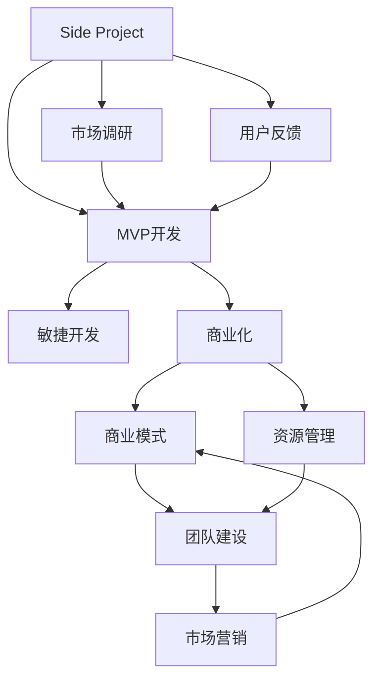

                 

# 如何将Side Project转化为主业

## 1. 背景介绍

### 1.1 问题由来
在当今快速发展的技术环境下，许多程序员、开发者和创新者都拥有一或多个Side Project。这些Side Project不仅能带来精神上的满足，还能促进行业内知识的共享和交流。但随着这些项目逐渐成熟，很多开发者开始思考如何将Side Project转化为主业，以便更好地实现自己的技术梦想和职业目标。

### 1.2 问题核心关键点
将Side Project转化为主业涉及多个方面，包括但不限于：
- **技术可行性**：评估Side Project是否具备转化为商业产品的技术基础。
- **市场潜力**：了解目标市场的需求和竞争态势。
- **商业模式**：选择合适的商业模式，如订阅制、广告收入、SaaS等。
- **团队建设**：组建和管理一支高效的团队，包括前端、后端、设计和产品等角色。
- **资源管理**：合理分配和管理资金、时间和人力资源。
- **市场营销**：制定有效的市场推广策略，提高产品知名度。

### 1.3 问题研究意义
将Side Project转化为主业不仅是技术实现，更是商业策略、市场运营和团队管理的综合挑战。成功的转化将带来显著的职业成长、业务增长和社会影响力。然而，失败的风险也较高，因此需要系统性地理解和处理这一过程。

## 2. 核心概念与联系

### 2.1 核心概念概述

为更好地理解将Side Project转化为主业的过程，本节将介绍几个关键概念：

- **Side Project**：个人或团队在业余时间开发的项目，旨在探索新想法、解决特定问题或为未来商业化做准备。
- **商业化**：将产品或技术转化为商业模式，实现盈利。
- **最小可行产品(MVP)**：产品功能最小化的早期版本，用于测试市场反应。
- **精益创业(Lean Startup)**：一种创业方法论，强调快速迭代和用户反馈，快速构建最小可行产品以最小化风险。
- **敏捷开发**：一种迭代开发和持续改进的软件开发方法，旨在提升团队对市场变化和用户需求的响应速度。
- **商业模式画布(Business Model Canvas)**：一种战略管理工具，帮助明确产品价值主张、渠道、客户关系、收入流和关键资源等。

这些核心概念之间相互关联，构成了将Side Project转化为商业产品的基本框架。

### 2.2 核心概念原理和架构的 Mermaid 流程图



这个流程图展示了Side Project转化为主业的主要步骤：

1. 从Side Project开始，进行市场调研和用户反馈。
2. 基于调研结果，开发最小可行产品(MVP)。
3. 采用敏捷开发方法，持续迭代改进。
4. 基于MVP和用户反馈，进行商业化探索。
5. 设计商业模式。
6. 组建和管理团队。
7. 管理资源。
8. 进行市场营销推广。

## 3. 核心算法原理 & 具体操作步骤
### 3.1 算法原理概述

将Side Project转化为商业产品，本质上是一种迭代式产品开发和市场验证过程。其核心思想是：通过构建最小可行产品(MVP)，快速验证市场和用户需求，基于反馈不断迭代改进，直至找到可行的商业模式和推广策略。

这一过程遵循了“构建-测量-学习”(Iterate-Expose-Adapt)的敏捷开发和精益创业理念，强调快速响应市场变化，迭代优化产品功能，通过数据驱动决策。

### 3.2 算法步骤详解

#### 3.2.1 MVP开发

1. **初步分析**：评估Side Project的技术可行性，识别核心功能和关键问题。
2. **定义需求**：基于用户调研和市场需求，确定MVP的功能点。
3. **快速开发**：使用敏捷开发方法，快速构建MVP，强调功能最小化和可操作性。
4. **测试与反馈**：将MVP投放市场，收集用户反馈，识别主要问题和改进方向。
5. **迭代优化**：基于用户反馈，不断迭代MVP功能，直至满足核心需求。

#### 3.2.2 商业化探索

1. **市场定位**：确定MVP的目标市场和用户群体。
2. **模式选择**：探索不同的商业模式，如订阅制、广告收入、SaaS等。
3. **定价策略**：基于成本、市场需求和竞争态势，制定合理的定价策略。
4. **收入模型**：设计收入流，确保可持续盈利。

#### 3.2.3 商业模式设计

1. **价值主张**：明确产品为用户提供的主要价值。
2. **渠道选择**：选择合适的销售和分销渠道。
3. **客户关系**：确定如何与客户建立并维护长期关系。
4. **收入流**：明确收入来源和生成方式。
5. **关键资源**：识别和规划所需的资源和能力。
6. **关键伙伴**：确定必要的合作伙伴和生态系统。

#### 3.2.4 团队建设与资源管理

1. **角色划分**：明确团队成员的角色和职责。
2. **招聘与培训**：招聘具有相关技能和经验的人才，并提供必要的培训。
3. **组织架构**：设计高效的组织结构和沟通机制。
4. **项目管理**：采用敏捷项目管理方法，提升团队效率。
5. **资源分配**：合理分配和管理资金、时间和人力资源。

#### 3.2.5 市场营销推广

1. **品牌建设**：塑造产品的品牌形象和市场定位。
2. **营销策略**：制定并实施有效的市场推广策略。
3. **用户获取**：通过多种渠道吸引和获取目标用户。
4. **用户留存**：提高用户粘性和长期留存率。

### 3.3 算法优缺点

#### 3.3.1 优点

1. **快速迭代**：敏捷开发和精益创业方法允许快速迭代和测试，快速响应市场变化。
2. **用户驱动**：通过用户反馈指导产品开发，确保产品满足市场需求。
3. **资源高效**：根据市场反应和用户反馈优化资源配置，减少不必要的投入。
4. **低风险高回报**：通过逐步验证市场和用户需求，降低失败风险，提高盈利潜力。

#### 3.3.2 缺点

1. **资源限制**：初期阶段可能资源有限，需要合理安排和优先处理。
2. **市场不确定性**：市场需求和竞争态势可能变化，需要灵活应对。
3. **团队管理挑战**：需要有效管理和协调跨部门和跨团队的合作。
4. **技术风险**：技术实现可能遇到复杂问题，需要持续技术攻关。

### 3.4 算法应用领域

将Side Project转化为主业的算法适用于各类初创企业和技术团队，包括但不限于：

1. **初创科技公司**：基于技术创新和市场需求，开发并推广新产品。
2. **自由职业者**：将个人技术项目转化为商业化服务或产品。
3. **开源项目维护者**：将开源项目产品化，寻找商业机会。
4. **企业内部孵化器**：推动企业内部创新项目向商业产品转化。
5. **高校实验室**：将研究成果转化为商业产品，促进科技成果转化。

## 4. 数学模型和公式 & 详细讲解 & 举例说明

### 4.1 数学模型构建

假设Side Project的功能集合为 $F=\{f_1, f_2, ..., f_n\}$，用户反馈为 $U=\{u_1, u_2, ..., u_m\}$，MVP的功能点为 $M=\{m_1, m_2, ..., m_k\}$。

则目标是最小化用户反馈和需求之间的差异，即：

$$
\min_{M} \sum_{i=1}^{m} d(u_i, M)
$$

其中 $d$ 为用户反馈与MVP功能的匹配度。

### 4.2 公式推导过程

使用距离度量（如欧几里得距离）计算用户反馈与MVP功能的匹配度：

$$
d(u_i, M) = \sum_{j=1}^{k} |u_{i,j} - M_j|
$$

其中 $u_{i,j}$ 为用户反馈中的第 $j$ 个功能需求，$M_j$ 为MVP中第 $j$ 个功能实现情况。

通过最小化上述差异，不断迭代优化MVP的功能集，直至找到满足用户需求的解决方案。

### 4.3 案例分析与讲解

假设Side Project为一个社交媒体应用，用户反馈包括“社交网络”、“消息推送”、“群组管理”等功能需求。MVP功能集为“消息推送”和“社交网络”，匹配度计算如下：

$$
d(u_1, M) = |1 - 1| + |1 - 1| = 0
$$
$$
d(u_2, M) = |0 - 0| + |1 - 1| = 0
$$
$$
d(u_3, M) = |1 - 0| + |1 - 0| = 2
$$

基于上述匹配度，MVP的“消息推送”和“社交网络”功能较好满足用户需求，“群组管理”则需要进一步优化。

## 5. 项目实践：代码实例和详细解释说明

### 5.1 开发环境搭建

1. **安装必要的开发工具**：
   - 安装Python：`pip install python`
   - 安装Docker：`sudo apt-get install docker-ce`
   - 安装Kubernetes：`sudo apt-get install kubectl`

2. **配置开发环境**：
   - 使用Docker创建开发容器：`docker run -it --name container -p 8080:8080 python`
   - 使用Kubernetes部署容器：`kubectl apply -f deployment.yaml`

3. **环境测试**：
   - 访问容器：`docker exec -it container python`
   - 验证服务：`kubectl get services`

### 5.2 源代码详细实现

```python
# 导入必要的库
import os
import requests
from flask import Flask, request, jsonify

# 初始化应用
app = Flask(__name__)

# 定义路由
@app.route('/')
def index():
    return jsonify({'message': 'Hello, World!'})

@app.route('/api/feedback', methods=['POST'])
def feedback():
    data = request.json
    # 处理用户反馈数据
    handle_feedback(data)
    return jsonify({'status': 'success'})

# 处理用户反馈
def handle_feedback(data):
    # 解析并处理数据
    # ...
    # 将数据保存到数据库或文件系统
    # ...
    return True

# 运行应用
if __name__ == '__main__':
    app.run(debug=True, host='0.0.0.0', port=8080)
```

### 5.3 代码解读与分析

1. **Flask框架**：使用Flask框架快速构建RESTful API服务，处理用户反馈数据。
2. **路由定义**：定义根路由和用户反馈路由，支持POST请求。
3. **反馈处理函数**：解析请求数据，调用`handle_feedback`函数处理用户反馈。
4. **数据存储**：将反馈数据保存到数据库或文件系统，方便后续分析和优化。
5. **应用启动**：使用`app.run`启动应用，支持调试模式，监听端口8080。

### 5.4 运行结果展示

通过访问`http://localhost:8080`，可以看到`Hello, World!`的欢迎信息。发送POST请求至`http://localhost:8080/api/feedback`，提交用户反馈数据，应用处理后返回成功状态。

## 6. 实际应用场景

### 6.1 社交媒体平台

Side Project团队可以将社交媒体应用从原型转化为商业产品，通过不断的市场测试和用户反馈，不断优化产品功能和用户体验。商业化探索可以采用订阅制、广告收入等模式，同时利用社交网络效应增加用户粘性。

### 6.2 在线教育平台

Side Project团队可以开发一个在线教育应用，通过用户调研和市场分析，设计符合用户需求的功能。商业化可以采用付费课程、广告收入等模式。采用敏捷开发方法，快速迭代优化产品，确保市场竞争力和用户满意度。

### 6.3 智能家居系统

Side Project团队可以开发智能家居应用，基于市场需求和技术实现，逐步构建功能丰富的产品。商业化可以采用SaaS模式，提供设备管理和控制服务。利用物联网技术，提升用户体验和设备互操作性。

### 6.4 未来应用展望

随着技术的发展，将Side Project转化为商业产品的可能性将进一步增加。未来的趋势包括：

1. **人工智能与物联网的融合**：集成AI和IoT技术，提升产品智能化水平。
2. **跨平台开发**：构建跨平台应用，覆盖更多设备和操作系统。
3. **云计算与边缘计算的结合**：利用云计算和边缘计算技术，提高产品可扩展性和响应速度。
4. **虚拟现实与增强现实**：通过VR/AR技术，增强产品互动性和用户体验。
5. **多语言支持**：支持多语言环境和用户交互，拓展全球市场。

## 7. 工具和资源推荐

### 7.1 学习资源推荐

1. **书籍**：
   - 《精益创业》（Eric Ries著）：介绍精益创业理念和实践方法。
   - 《代码整洁之道》（Robert C. Martin著）：强调代码质量和开发效率。

2. **在线课程**：
   - Coursera的《创业与创新》课程：介绍创业基础和创新方法。
   - Udemy的《敏捷开发实践》课程：讲解敏捷开发方法论和实践技巧。

3. **社区与论坛**：
   - GitHub：开源社区，提供丰富的资源和项目交流平台。
   - Stack Overflow：技术问答社区，帮助解决技术难题和获取行业资讯。

### 7.2 开发工具推荐

1. **编程语言**：
   - Python：广泛使用的通用编程语言，支持大量第三方库和框架。
   - JavaScript：Web开发的首选语言，支持前端和后端开发。

2. **开发框架**：
   - Flask：轻量级Web框架，适合快速搭建API服务。
   - Django：全栈Web框架，支持快速开发和管理复杂Web应用。

3. **版本控制**：
   - Git：分布式版本控制系统，支持代码协作和版本管理。
   - GitHub：基于Git的托管平台，提供代码托管、协作和社区交流。

### 7.3 相关论文推荐

1. **《最小可行产品：发现新创企业价值主张和收入模型》**：
   - 讨论最小可行产品对创业初期的价值和商业模式探索的重要性。

2. **《敏捷软件开发：原则、模式与实践》**：
   - 介绍敏捷开发的基本原则和实践方法，强调快速迭代和用户反馈。

3. **《精益创业：构建与领导精简和智能组织》**：
   - 描述精益创业理念和实践方法，推动产品快速迭代和市场验证。

## 8. 总结：未来发展趋势与挑战

### 8.1 研究成果总结

本文详细介绍了将Side Project转化为商业产品的核心概念、算法原理和具体操作步骤。通过分析MVP开发、商业化探索、商业模式设计等关键环节，揭示了技术可行性、市场潜力、团队建设和资源管理等关键因素。

### 8.2 未来发展趋势

1. **技术创新**：随着AI、IoT、VR/AR等技术的融合，产品功能将更加智能和丰富。
2. **市场多样化**：跨平台和国际化拓展将拓展产品市场，满足更多用户需求。
3. **生态系统构建**：构建开放生态系统，引入更多合作伙伴和开发者，提升产品竞争力。

### 8.3 面临的挑战

1. **市场竞争**：产品需要面对激烈的竞争环境，需要快速迭代和优化。
2. **资源管理**：合理分配和管理资金、时间和人力资源是关键挑战。
3. **团队协作**：跨部门和跨团队的协作需要高效管理和沟通。
4. **技术挑战**：持续技术攻关和迭代优化是实现产品成功的保障。

### 8.4 研究展望

未来研究可以从以下几个方面进行：
1. **技术架构优化**：研究更高效的技术架构和算法，提升产品性能和可扩展性。
2. **商业模式创新**：探索更多创新的商业模式，最大化产品价值和盈利能力。
3. **用户行为研究**：深入理解用户行为和需求，提高产品市场适应性。
4. **市场推广策略**：制定有效的市场推广策略，提高产品知名度和用户粘性。

## 9. 附录：常见问题与解答

**Q1：Side Project如何转化为商业产品？**

A: 通过最小可行产品(MVP)开发和市场验证，逐步优化产品功能和商业模式，最终实现商业化。

**Q2：如何选择合适的MVP功能？**

A: 根据用户调研和市场需求，选择最具核心价值和用户需求的功能点，优先开发和验证。

**Q3：如何管理团队资源？**

A: 使用敏捷开发方法，合理分配和管理团队成员的工作任务和优先级，确保高效协作和目标一致。

**Q4：如何应对市场竞争？**

A: 持续优化产品功能和用户体验，灵活调整市场策略，快速响应市场变化。

**Q5：如何处理用户反馈？**

A: 及时收集和分析用户反馈，识别主要问题和改进方向，快速迭代优化产品功能。

---

作者：禅与计算机程序设计艺术 / Zen and the Art of Computer Programming

