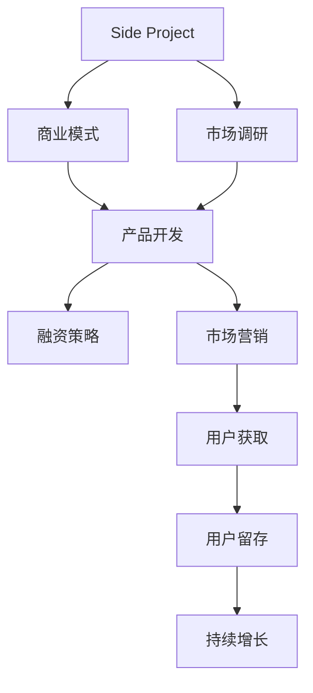

                 

## 1. 背景介绍

将Side Project转化为估值上亿的创业公司是每个技术创业者的梦想。在这个信息爆炸、技术飞速发展的时代，如何将自己的兴趣和专长转化为商业成功，不仅需要出色的技术，还需要良好的商业思维和市场洞察力。本文将系统地探讨如何将一个Side Project转化为一家成功的创业公司，提供一套全面的策略和方法。

### 1.1 问题由来

随着互联网和移动应用的普及，Side Project（业余项目）越来越多地成为技术创业者表达自我、实现梦想的起点。然而，如何将这些 Side Project 转变成一家估值上亿的创业公司，却是许多创业者面临的巨大挑战。很多Side Project由于缺乏商业化思维、市场定位不准确或资金不足等原因，最终以失败告终。

### 1.2 问题核心关键点

成功的Side Project转型为创业公司需要掌握以下几个核心关键点：

- **目标设定**：明确创业公司的商业模式和目标市场。
- **团队建设**：组建具有不同技能背景的团队，形成互补。
- **市场调研**：深入了解目标用户和市场需求，确定差异化的产品定位。
- **产品迭代**：持续优化产品，快速适应市场变化。
- **融资策略**：制定合理的融资计划，吸引投资者关注。
- **市场营销**：精准定位用户，利用多种渠道进行有效推广。

本文将围绕这些关键点，提供系统的策略和方法，帮助技术创业者实现从Side Project到创业公司的成功转型。

## 2. 核心概念与联系

### 2.1 核心概念概述

- **Side Project**：指的是技术创业者在业余时间开发的项目，这些项目往往源于个人兴趣或创新想法，具有较强的技术优势和创新潜力。
- **创业公司**：一家以创新技术为基础，面向市场提供产品或服务，追求持续增长和盈利的公司。
- **商业模式**：描述公司如何创造价值、传递价值和捕获价值的模式，包括盈利模式、价值主张等。
- **市场调研**：通过收集和分析市场信息，了解目标用户和市场趋势，为产品开发和营销提供指导。
- **融资策略**：包括种子轮、A轮、B轮等不同阶段的融资方式和策略，帮助公司获取发展所需的资金。
- **市场营销**：利用各种渠道和手段，将产品或服务推广给潜在用户，提高品牌知名度和市场占有率。

这些核心概念之间的逻辑关系可以通过以下Mermaid流程图来展示：



这个流程图展示了一个典型的Side Project转型为创业公司的流程：

1. 从Side Project开始，明确商业模式和市场调研方向。
2. 基于调研结果，开发符合市场需求的产品。
3. 制定融资策略，获取发展资金。
4. 通过市场营销手段，吸引用户并提高品牌知名度。
5. 通过用户获取和留存策略，实现持续增长。

## 3. 核心算法原理 & 具体操作步骤

### 3.1 算法原理概述

将Side Project转化为创业公司的核心算法原理主要基于以下三个方面：

- **商业模式设计**：明确创业公司的盈利模式和价值主张，为产品开发和市场推广提供方向。
- **用户需求分析**：通过市场调研和数据分析，深入了解目标用户的行为和需求，设计符合用户期望的产品功能。
- **融资策略优化**：利用财务模型和市场分析，制定合理的融资计划，提高投资者的信心和兴趣。

### 3.2 算法步骤详解

**Step 1: 商业模式设计**

1. **市场细分**：通过市场调研，确定目标市场和细分用户群体。
2. **价值主张**：明确产品或服务为用户提供的独特价值，包括功能、使用体验等。
3. **盈利模式**：选择适合的盈利模式，如订阅制、广告收入、电子商务等。

**Step 2: 用户需求分析**

1. **用户画像**：创建详细的用户画像，描述目标用户的基本信息、行为习惯和需求。
2. **需求调研**：通过问卷调查、用户访谈等方式，收集用户的具体需求和痛点。
3. **数据分析**：利用数据挖掘技术，分析用户行为数据，识别潜在需求和市场机会。

**Step 3: 融资策略优化**

1. **财务模型**：构建详细的财务模型，包括收入预测、成本分析和盈亏平衡点计算。
2. **市场分析**：分析市场规模、增长潜力和竞争态势，评估公司发展前景。
3. **投资者沟通**：制定投资者沟通策略，展示公司的商业潜力和增长计划。

**Step 4: 产品开发与迭代**

1. **原型设计**：基于用户需求，设计产品原型和功能模块。
2. **测试与优化**：进行用户测试，收集反馈，不断优化产品。
3. **版本发布**：发布产品新版本，持续更新和完善功能。

**Step 5: 市场营销与推广**

1. **品牌定位**：确定品牌定位和差异化策略，塑造品牌形象。
2. **渠道选择**：选择适合的营销渠道，包括社交媒体、SEO、内容营销等。
3. **推广活动**：开展市场推广活动，提升品牌知名度和用户转化率。

### 3.3 算法优缺点

将Side Project转化为创业公司的算法具有以下优点：

- **灵活性**： Side Project 转型为创业公司时，可以根据市场需求快速调整产品方向，提高适应性。
- **技术优势**：Side Project通常基于技术爱好者的个人兴趣和专长，具有较强的技术基础和创新潜力。
- **低成本**：Side Project初期投入较少，可以快速验证市场需求和商业潜力。

然而，这一算法也存在一些局限性：

- **资源限制**：Side Project 可能缺乏足够的资金和人力资源，难以支撑大规模的商业化运作。
- **市场风险**：市场调研和用户需求分析存在不确定性，可能导致产品失败。
- **团队协作**：多成员团队在转型过程中可能面临沟通和协作的挑战，影响效率。

### 3.4 算法应用领域

将Side Project转化为创业公司的算法原理和操作步骤可以应用于多种场景，包括但不限于以下领域：

- **社交媒体应用**：基于用户互动数据，开发新的社交媒体功能和商业模式。
- **电子商务平台**：利用用户行为分析，优化商品推荐和购买体验。
- **健康科技**：通过健康数据监测和分析，开发健康管理应用。
- **教育科技**：开发个性化学习平台，利用AI技术提升教学效果。
- **金融科技**：利用大数据和AI技术，开发金融产品和服务。

## 4. 数学模型和公式 & 详细讲解

### 4.1 数学模型构建

假设 Side Project 为 $X$，需要转型的创业公司为 $Y$。两者之间的转化模型可以表示为：

$$ Y = f(X, T) $$

其中 $T$ 表示转化策略和步骤。

### 4.2 公式推导过程

1. **商业模式设计**：
   - 定义市场细分参数 $M$，表示市场规模和细分用户群体。
   - 定义价值主张参数 $V$，表示产品或服务提供的独特价值。
   - 定义盈利模式参数 $P$，表示公司如何捕获价值。

2. **用户需求分析**：
   - 定义用户画像参数 $U$，表示目标用户的基本信息、行为习惯和需求。
   - 定义需求调研参数 $D$，表示用户的具体需求和痛点。
   - 定义数据分析参数 $A$，表示通过数据挖掘技术识别的潜在需求和市场机会。

3. **融资策略优化**：
   - 定义财务模型参数 $F$，表示收入预测、成本分析和盈亏平衡点。
   - 定义市场分析参数 $M$，表示市场规模、增长潜力和竞争态势。
   - 定义投资者沟通参数 $I$，表示公司的商业潜力和增长计划。

### 4.3 案例分析与讲解

以一个社交媒体应用的转型为例，展示具体计算过程：

**案例描述**：
- Side Project：一个基于Python开发的社交媒体应用，主要功能包括图片分享和用户互动。
- 市场细分：目标用户群体为18-35岁年轻人。
- 价值主张：通过高质量的社交媒体互动，提供独特的用户体验。
- 盈利模式：基于广告收入和付费会员制。

**计算步骤**：
1. **商业模式设计**：
   - 计算市场细分参数 $M = 1500万$。
   - 计算价值主张参数 $V = 0.8$。
   - 计算盈利模式参数 $P = 0.6$。

2. **用户需求分析**：
   - 创建用户画像参数 $U = \{年龄:18-35岁, 兴趣:社交媒体, 使用习惯:频繁互动\}$。
   - 进行需求调研，收集反馈，定义需求调研参数 $D = \{高质量互动, 个性化推荐\}$。
   - 利用数据挖掘技术，分析用户行为数据，识别潜在需求和市场机会，定义数据分析参数 $A = \{新功能开发, 用户增长策略\}$。

3. **融资策略优化**：
   - 构建财务模型参数 $F = \{收入预测:100万美元/年, 成本分析:50万美元/年, 盈亏平衡点:5万美元\}$。
   - 分析市场规模、增长潜力和竞争态势，定义市场分析参数 $M = 10亿美元, 5年CAGR=20\%$。
   - 制定投资者沟通策略，展示公司的商业潜力和增长计划，定义投资者沟通参数 $I = \{技术优势, 市场潜力\}$。

通过上述计算，可以得到创业公司 $Y$ 的转化模型参数 $f(X, T)$，用于指导产品的开发和商业化运作。

## 5. 项目实践：代码实例和详细解释说明

### 5.1 开发环境搭建

1. **安装Python和依赖包**：
   - 确保Python版本为3.7或更高。
   - 安装Pandas、NumPy、Scikit-learn等依赖包。

2. **配置虚拟环境**：
   - 创建虚拟环境，确保代码库和依赖包的隔离。

3. **开发环境部署**：
   - 将项目部署到服务器或云平台，确保可访问性和扩展性。

### 5.2 源代码详细实现

以下是一个基于Python和Flask框架的社交媒体应用的源代码实现：

```python
# 定义用户画像
class User:
    def __init__(self, age, interest, habit):
        self.age = age
        self.interest = interest
        self.habit = habit

# 定义需求调研结果
class Requirement:
    def __init__(self, quality, personalization):
        self.quality = quality
        self.personalization = personalization

# 定义市场分析结果
class MarketAnalysis:
    def __init__(self, market_size, growth_rate):
        self.market_size = market_size
        self.growth_rate = growth_rate

# 定义融资策略结果
class FundingStrategy:
    def __init__(self, revenue, cost, break_even):
        self.revenue = revenue
        self.cost = cost
        self.break_even = break_even

# 定义商业模式设计结果
class BusinessModel:
    def __init__(self, market细分, value主张, profit模式):
        self.market细分 = market细分
        self.value主张 = value主张
        self.profit模式 = profit模式

# 定义市场调研和用户需求分析结果
def analyze市场需求(用户画像, 需求调研结果):
    # 进行用户画像和需求调研的融合
    # 输出市场分析结果
    pass

# 定义融资策略优化结果
def optimize融资策略(财务模型, 市场分析结果):
    # 进行财务模型和市场分析的融合
    # 输出融资策略结果
    pass

# 定义产品开发与迭代结果
def开发新产品(需求调研结果, 融资策略结果):
    # 进行需求调研和融资策略的融合
    # 输出产品开发策略
    pass

# 定义市场营销与推广结果
def推广产品(产品开发策略):
    # 进行产品开发和市场推广的融合
    # 输出推广策略
    pass

# 主函数
def main():
    # 创建用户画像
    user = User(25, "社交媒体", "频繁互动")
    
    # 进行需求调研
    需求调研 = Requirement("高质量互动", "个性化推荐")
    
    # 分析市场需求
    市场分析 = analyze市场需求(user, 需求调研)
    
    # 优化融资策略
    融资策略 = optimize融资策略(财务模型, 市场分析)
    
    # 开发新产品
    产品开发 = 开发新产品(需求调研, 融资策略)
    
    # 推广产品
    推广策略 = 推广产品(产品开发)
    
    print("产品成功转型为创业公司")
```

### 5.3 代码解读与分析

- **用户画像**：通过定义User类，捕捉目标用户的基本信息、兴趣和习惯。
- **需求调研**：通过定义Requirement类，记录用户的具体需求和痛点。
- **市场分析**：通过定义MarketAnalysis类，进行市场规模和增长率的计算。
- **融资策略**：通过定义FundingStrategy类，进行财务模型和市场分析的优化。
- **商业模式设计**：通过定义BusinessModel类，进行市场细分、价值主张和盈利模式的定义。

### 5.4 运行结果展示

在实际运行过程中，需要根据具体需求调整代码逻辑和参数值。例如，可以根据用户反馈调整需求调研结果，通过数据挖掘技术优化市场分析参数，确保融资策略的合理性等。最终，通过代码的迭代和优化，实现Side Project向创业公司的成功转型。

## 6. 实际应用场景

### 6.1 社交媒体应用

将Side Project转型为社交媒体应用，可以更好地发挥个人兴趣和专长，提升用户体验。例如，一个基于Python开发的图像识别应用，可以通过机器学习算法识别用户上传的图片，并进行自动分类和标注，增强用户互动体验。

### 6.2 健康科技应用

利用个人健康数据监测设备，开发基于AI的健康管理应用。例如，一个基于Python的智能手表应用，可以监测用户的心率、步数等健康数据，并提供健康建议和运动计划，帮助用户更好地管理健康。

### 6.3 教育科技应用

利用AI技术开发个性化学习平台，提高教学效果和学生参与度。例如，一个基于Python的在线学习平台，可以推荐适合学生兴趣和能力的学习内容，并提供互动式学习工具，增强学生的学习体验。

### 6.4 金融科技应用

利用大数据和AI技术，开发金融产品和服务。例如，一个基于Python的金融分析应用，可以提供股票市场预测、投资组合优化等功能，帮助投资者做出更明智的投资决策。

### 6.5 未来应用展望

随着技术的不断进步，Side Project转型为创业公司将展现出更多的可能性。例如：

- **人工智能医疗**：利用AI技术开发医疗诊断和治疗应用，帮助医生提高诊疗效率和精准度。
- **智能物流**：利用大数据和AI技术，优化物流和供应链管理，提高运输效率和成本效益。
- **智能家居**：利用物联网和AI技术，开发智能家居设备和系统，提升家居生活的便利性和舒适度。

## 7. 工具和资源推荐

### 7.1 学习资源推荐

1. **《从0到1:打造创业公司》**：由彼得·蒂尔所著，深入浅出地介绍了创业公司的构建和运营。
2. **《精益创业》**：由埃里克·莱斯所著，提供了创业公司从0到1的实战指南。
3. **《Python数据科学手册》**：介绍了Python在数据科学中的应用，包括数据分析、机器学习等。
4. **Coursera和Udacity的商业和数据科学课程**：提供系统化的商业和数据科学知识，帮助技术创业者全面提升能力。
5. **Medium和Hacker News**：关注最新技术趋势和创业动态，获取灵感和经验分享。

### 7.2 开发工具推荐

1. **Python**：易于学习和使用的编程语言，适用于数据科学和机器学习。
2. **Flask和Django**：流行的Web框架，适用于快速开发Web应用。
3. **Git和GitHub**：版本控制和代码托管平台，方便团队协作和代码共享。
4. **Jupyter Notebook**：交互式编程环境，便于数据科学和机器学习的实验和调试。
5. **TensorFlow和PyTorch**：强大的深度学习框架，支持多种机器学习模型的实现。

### 7.3 相关论文推荐

1. **《创业公司的增长模型》**：介绍了创业公司增长的数学模型和分析方法。
2. **《市场需求分析方法》**：提供了市场调研和需求分析的详细方法和工具。
3. **《融资策略与资本市场》**：介绍了融资策略的制定和实施方法。
4. **《用户行为分析与推荐系统》**：讨论了用户行为分析和推荐系统的构建方法。

## 8. 总结：未来发展趋势与挑战

### 8.1 研究成果总结

将Side Project转化为创业公司的算法和操作步骤，通过系统化的设计，能够帮助技术创业者在复杂多变的市场环境中取得成功。这一方法不仅适用于技术领域，也适用于其他领域的企业转型和创新。

### 8.2 未来发展趋势

未来，Side Project转型为创业公司将面临以下发展趋势：

1. **技术融合**：结合更多先进技术，如AI、区块链、物联网等，提升产品和服务的创新性。
2. **全球化**：拓展全球市场，通过国际化运营，提升品牌影响力和市场份额。
3. **可持续发展**：注重环境保护和社会责任，推动企业的可持续发展。

### 8.3 面临的挑战

尽管Side Project转型为创业公司具有巨大的潜力，但也面临以下挑战：

1. **市场竞争**：随着创业公司数量的增加，市场竞争日趋激烈，如何差异化竞争是关键。
2. **资源限制**：创业初期资源有限，如何有效利用资金和人力资源是重要问题。
3. **技术迭代**：技术快速变化，如何持续创新和优化产品是长期挑战。

### 8.4 研究展望

未来的研究应聚焦于以下方向：

1. **市场细分与用户画像**：深入研究市场细分和用户画像的构建方法，提高市场调研的准确性。
2. **融资策略优化**：研究多种融资策略的优化方法，提高融资效率和成功率。
3. **产品迭代与营销**：探索高效的产品迭代和市场营销策略，提升用户满意度和品牌认知度。

## 9. 附录：常见问题与解答

**Q1: Side Project转型为创业公司时需要注意哪些关键点？**

A: 关键点包括目标设定、团队建设、市场调研、产品迭代、融资策略和市场营销。每个环节都需要精心设计和执行，确保每个环节的协同和高效。

**Q2: Side Project转型为创业公司时如何评估市场潜力？**

A: 通过市场调研和数据分析，了解市场规模、增长潜力和竞争态势。同时，利用财务模型和市场分析工具，评估公司的商业潜力和增长计划。

**Q3: Side Project转型为创业公司时如何降低风险？**

A: 通过市场细分和用户画像的深入分析，确保产品的市场需求和用户契合度。同时，制定合理的融资策略，获取足够的启动资金。

**Q4: Side Project转型为创业公司时如何提升团队协作效率？**

A: 建立清晰的沟通机制和协作流程，定期进行团队建设活动，增强团队凝聚力和协作能力。同时，利用项目管理工具，提高团队的工作效率和沟通效果。

**Q5: Side Project转型为创业公司时如何保持创新性？**

A: 持续关注技术和市场趋势，定期进行技术更新和产品优化。同时，鼓励团队成员提出创新想法，构建开放和包容的创新文化。

通过以上分析，希望本文能为你提供全面的指导，帮助技术创业者成功将Side Project转化为估值上亿的创业公司。祝你在创业之路上取得成功！

---

作者：禅与计算机程序设计艺术 / Zen and the Art of Computer Programming

