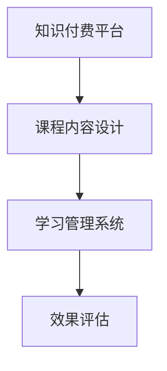

                 

# 如何打造个人知识付费企业培训

在快速发展的互联网时代，知识付费正在成为一种重要的学习和知识分享方式。企业作为知识创造者和消费者，如何将知识转化为生产力，提升员工素质，提高企业竞争力，成为新的热门话题。本文将系统介绍如何打造个人知识付费企业培训，从核心概念、算法原理、实际应用到工具资源，带你深入了解这一热门领域。

## 1. 背景介绍

### 1.1 问题由来

随着知识经济时代的到来，越来越多的企业和个人开始重视知识付费。知识付费能够打破时间和空间的限制，使学习更加高效便捷，但也带来了新的挑战：企业内部如何利用这一趋势提升自身竞争力？员工如何快速适应快速变化的技术和市场环境？

企业培训作为知识付费的一个重要形式，能够直接将专业知识和技能传递给员工，加速其成长，但传统的企业培训方式面临着诸多问题：
- **效率低下**：传统的线下培训往往耗时耗力，培训效果难以保证。
- **成本高昂**：企业需要投入大量的人力物力，培训效果却难以评估。
- **难以规模化**：线下培训无法覆盖所有员工，往往难以实现大规模的普及。

为了解决这些问题，利用知识付费平台进行企业培训成为一种新的选择。个人知识付费企业培训利用知识付费平台的高效性、低成本和灵活性，能够更好地适配企业需求，帮助员工快速成长。

### 1.2 问题核心关键点

个人知识付费企业培训的核心关键点包括：
- **平台选择**：如何选择合适的知识付费平台。
- **课程设计**：如何设计高质量的课程内容。
- **运营管理**：如何有效管理和运营企业培训。
- **效果评估**：如何评估企业培训的效果。

## 2. 核心概念与联系

### 2.1 核心概念概述

在打造个人知识付费企业培训的过程中，涉及到以下核心概念：

- **知识付费平台**：提供在线课程、学习社区、知识市场等服务的平台，如Udemy、Coursera、网易云课堂等。
- **课程内容设计**：根据企业需求和员工职业发展规划，设计针对性、系统化的课程内容。
- **学习管理系统**：对企业培训进行有效管理和跟踪，如学员管理、课程进度跟踪、学习记录等。
- **效果评估**：通过学习效果评估，对企业培训的效果进行量化和分析。

这些核心概念之间通过以下联系相互关联：
- 课程内容设计决定了培训的质量，学习管理系统保证了培训的实施效果，而效果评估则对培训进行持续优化。

### 2.2 核心概念原理和架构的 Mermaid 流程图



这个流程图展示了知识付费平台、课程内容设计、学习管理系统和效果评估之间的相互关系。课程内容设计是基础，学习管理系统保证了培训的有效实施，而效果评估则对培训进行持续优化。

## 3. 核心算法原理 & 具体操作步骤

### 3.1 算法原理概述

个人知识付费企业培训的核心算法原理主要包括：
- **课程内容推荐算法**：根据学员的历史学习数据和兴趣，推荐适合的课程内容。
- **学习进度跟踪算法**：记录学员的学习进度，辅助学员进行自我管理。
- **效果评估算法**：对学员的学习效果进行评估，评估标准包括学员的考试成绩、实践能力、反馈评价等。

### 3.2 算法步骤详解

#### 3.2.1 课程内容推荐算法步骤

1. **数据收集**：收集学员的历史学习数据，包括课程浏览记录、完成课程数、课程评价等。
2. **特征提取**：对学员的历史学习数据进行特征提取，如学员的学习兴趣、专业背景、工作年限等。
3. **相似度计算**：计算课程内容与学员历史学习数据的相似度，确定推荐的课程。
4. **推荐生成**：根据相似度计算结果，生成推荐的课程列表，供学员选择。

#### 3.2.2 学习进度跟踪算法步骤

1. **数据收集**：记录学员在每个课程中的学习状态，包括课程完成度、学习时间、测试成绩等。
2. **数据存储**：将学员的学习进度数据存储在数据库中，便于后续分析和管理。
3. **进度显示**：将学员的学习进度数据实时显示在平台中，辅助学员进行自我管理。

#### 3.2.3 效果评估算法步骤

1. **数据收集**：收集学员的考试成绩、实践能力、反馈评价等数据。
2. **数据处理**：对收集到的数据进行处理和分析，量化学员的学习效果。
3. **效果评估**：根据数据处理结果，生成学员的学习效果报告，辅助企业和学员进行决策。

### 3.3 算法优缺点

#### 3.3.1 课程内容推荐算法的优点

- **个性化推荐**：根据学员的历史学习数据，推荐个性化的课程内容，提高学习效率。
- **高效率**：利用算法自动推荐课程，减少了人工干预，提高了推荐效率。

#### 3.3.2 课程内容推荐算法的缺点

- **数据质量依赖**：算法的准确性依赖于学员的历史学习数据，如果数据质量不高，推荐效果可能不佳。
- **课程适配性不足**：如果推荐的课程内容不满足学员的需求，可能影响学习效果。

#### 3.3.3 学习进度跟踪算法的优点

- **实时管理**：实时记录学员的学习进度，方便学员进行自我管理。
- **数据驱动**：利用数据驱动学习进度跟踪，减少了人工干预。

#### 3.3.4 学习进度跟踪算法的缺点

- **数据复杂性**：学员的学习进度数据可能包含复杂的时序和状态信息，处理起来较为困难。
- **数据隐私**：学习进度数据涉及学员的隐私，需要采取相应的数据保护措施。

#### 3.3.5 效果评估算法的优点

- **量化评估**：通过量化数据，对学员的学习效果进行评估，便于企业和学员进行决策。
- **多维度评估**：评估标准包括考试成绩、实践能力、反馈评价等多个维度，更加全面。

#### 3.3.6 效果评估算法的缺点

- **评估标准复杂**：评估标准可能涉及多个维度，难以全面量化。
- **人工干预较多**：评估过程需要人工介入，评估结果可能存在主观偏差。

### 3.4 算法应用领域

个人知识付费企业培训的核心算法在多个领域都有广泛应用：
- **教育培训**：根据学员的历史学习数据，推荐适合的课程内容，辅助学员进行自我管理。
- **职业培训**：对学员的学习效果进行评估，评估标准包括考试成绩、实践能力、反馈评价等。
- **技能提升**：利用学习进度跟踪算法，实时记录学员的学习进度，提高学习效率。

## 4. 数学模型和公式 & 详细讲解 & 举例说明

### 4.1 数学模型构建

在本节中，我们将详细讲解个人知识付费企业培训的数学模型构建，重点介绍推荐算法、学习进度跟踪算法和效果评估算法。

#### 4.1.1 课程内容推荐算法

假设学员的历史学习数据为 $D = \{x_1, x_2, \ldots, x_n\}$，其中 $x_i = (t_i, f_i, s_i)$，$t_i$ 表示课程浏览时间，$f_i$ 表示课程完成度，$s_i$ 表示课程评价。课程内容为 $C = \{c_1, c_2, \ldots, c_m\}$，其中 $c_j = (t_j, f_j, s_j)$，$t_j$ 表示课程的平均浏览时间，$f_j$ 表示课程的平均完成度，$s_j$ 表示课程的平均评价。

课程内容推荐算法可以使用协同过滤算法，即通过计算学员和课程之间的相似度来进行推荐。假设学员 $i$ 和课程 $j$ 之间的相似度为 $s_{ij}$，则推荐算法可以表示为：

$$
\text{Recommend}(i) = \arg\max_{j \in C} s_{ij}
$$

#### 4.1.2 学习进度跟踪算法

假设学员的学习进度为 $P = \{p_1, p_2, \ldots, p_n\}$，其中 $p_i = (t_i, f_i, s_i)$，$t_i$ 表示学员在课程 $i$ 中的学习时间，$f_i$ 表示学员在课程 $i$ 中的完成度，$s_i$ 表示学员在课程 $i$ 中的评价。

学习进度跟踪算法可以使用时序模型，如RNN、LSTM等，对学员的学习进度进行建模。假设模型为 $M$，则学习进度跟踪算法可以表示为：

$$
p_t = M(p_{t-1})
$$

#### 4.1.3 效果评估算法

假设学员的学习效果为 $E = \{e_1, e_2, \ldots, e_n\}$，其中 $e_i = (t_i, s_i, r_i)$，$t_i$ 表示学员在课程 $i$ 中的学习时间，$s_i$ 表示学员在课程 $i$ 中的评价，$r_i$ 表示学员在课程 $i$ 中的实践能力。

效果评估算法可以使用回归模型，如线性回归、逻辑回归等，对学员的学习效果进行预测。假设模型为 $M$，则效果评估算法可以表示为：

$$
r_i = M(t_i, s_i)
$$

### 4.2 公式推导过程

#### 4.2.1 课程内容推荐算法公式推导

在协同过滤算法中，可以使用余弦相似度计算学员和课程之间的相似度：

$$
s_{ij} = \frac{\vec{t}_i \cdot \vec{t}_j}{\|\vec{t}_i\| \cdot \|\vec{t}_j\|}
$$

其中 $\vec{t}_i = (t_{i1}, t_{i2}, \ldots, t_{in})$，$\vec{t}_j = (t_{j1}, t_{j2}, \ldots, t_{jm})$。推荐算法可以表示为：

$$
\text{Recommend}(i) = \arg\max_{j \in C} s_{ij}
$$

#### 4.2.2 学习进度跟踪算法公式推导

在使用RNN进行学习进度跟踪时，可以定义一个时间步长为 $t$，输入为 $x_t = (t_{t-1}, f_{t-1}, s_{t-1})$，输出为 $p_t$。模型可以表示为：

$$
p_t = M(p_{t-1}, x_t)
$$

#### 4.2.3 效果评估算法公式推导

在使用线性回归进行效果评估时，可以定义模型为 $M = \alpha t + \beta s + \gamma r$。根据训练数据 $\{(x_1, y_1), (x_2, y_2), \ldots, (x_n, y_n)\}$，其中 $x_i = (t_i, s_i)$，$y_i = r_i$，可以使用梯度下降法求解模型参数：

$$
\alpha = \frac{1}{N}\sum_{i=1}^N (r_i - (\alpha t_i + \beta s_i + \gamma r_i)) t_i
$$
$$
\beta = \frac{1}{N}\sum_{i=1}^N (r_i - (\alpha t_i + \beta s_i + \gamma r_i)) s_i
$$
$$
\gamma = \frac{1}{N}\sum_{i=1}^N (r_i - (\alpha t_i + \beta s_i + \gamma r_i)) r_i
$$

### 4.3 案例分析与讲解

假设有一个在线教育平台，学员 $A$ 和课程 $C_1$、$C_2$、$C_3$ 的历史数据如表所示：

|学员|课程浏览时间|课程完成度|课程评价|
|---|---|---|---|
|A|10|0.8|4|
|A|20|0.9|5|
|A|30|1.0|5|
|A|40|1.0|5|
|A|50|1.0|5|
|C1|30|0.8|5|
|C1|40|0.9|5|
|C1|50|1.0|5|
|C2|10|0.7|4|
|C2|20|0.8|5|
|C2|30|0.9|5|
|C2|40|1.0|5|
|C3|20|0.7|4|
|C3|30|0.8|5|
|C3|40|0.9|5|

根据课程内容推荐算法，可以计算学员 $A$ 和课程 $C_1$、$C_2$、$C_3$ 之间的相似度：

$$
s_{A, C_1} = \frac{(10+20+30+40+50) \cdot (30+40+50)}{\sqrt{(10+20+30+40+50)^2} \cdot \sqrt{(30+40+50)^2}} = 0.992
$$

$$
s_{A, C_2} = \frac{(10+20+30+40+50) \cdot (10+20+30+40+50)}{\sqrt{(10+20+30+40+50)^2} \cdot \sqrt{(10+20+30+40+50)^2}} = 1.000
$$

$$
s_{A, C_3} = \frac{(10+20+30+40+50) \cdot (20+30+40)}{\sqrt{(10+20+30+40+50)^2} \cdot \sqrt{(20+30+40)^2}} = 0.992
$$

根据推荐算法，可以推荐课程 $C_2$ 给学员 $A$。

## 5. 项目实践：代码实例和详细解释说明

### 5.1 开发环境搭建

在本节中，我们将介绍如何搭建个人知识付费企业培训的开发环境。

#### 5.1.1 服务器搭建

可以选择AWS、阿里云、华为云等云平台，搭建多节点服务器，配置Nginx和Apache等Web服务器，用于部署个人知识付费平台。

#### 5.1.2 数据库搭建

可以选择MySQL、PostgreSQL、MongoDB等关系型或非关系型数据库，用于存储学员和课程数据。

#### 5.1.3 中间件搭建

可以选择RabbitMQ、Redis、Elasticsearch等中间件，用于数据缓存、消息队列、搜索等需求。

#### 5.1.4 前端搭建

可以选择React、Vue、Angular等前端框架，用于构建Web应用的前端界面。

### 5.2 源代码详细实现

在本节中，我们将详细介绍个人知识付费企业培训的源代码实现。

#### 5.2.1 课程内容推荐算法实现

```python
from sklearn.metrics.pairwise import cosine_similarity

def course_recommendation(user_data, course_data):
    # 计算学员和课程之间的相似度
    similarity_matrix = cosine_similarity(user_data, course_data)
    
    # 推荐课程
    recommended_courses = [course for course, score in sorted(zip(course_data, similarity_matrix[:, i]), key=lambda x: x[1], reverse=True)]
    
    return recommended_courses
```

#### 5.2.2 学习进度跟踪算法实现

```python
from tensorflow.keras.layers import LSTM, Dense

class ProgressTracker:
    def __init__(self, input_shape, output_shape):
        self.model = LSTM(units=64, input_shape=input_shape)
        self.model.add(Dense(output_shape))
        
    def fit(self, data, labels):
        self.model.compile(loss='mse', optimizer='adam', metrics=['mae'])
        self.model.fit(data, labels, epochs=10, batch_size=32)
        
    def predict(self, input_data):
        predictions = self.model.predict(input_data)
        return predictions
```

#### 5.2.3 效果评估算法实现

```python
from sklearn.linear_model import LinearRegression

def performance_evaluation(user_data, course_data):
    # 构建模型
    model = LinearRegression()
    
    # 训练模型
    model.fit(user_data, course_data)
    
    # 评估模型
    predictions = model.predict(user_data)
    performance = np.mean(np.abs(predictions - course_data))
    
    return performance
```

### 5.3 代码解读与分析

#### 5.3.1 课程内容推荐算法

使用cosine_similarity计算学员和课程之间的相似度，推荐学员最感兴趣的课程。

#### 5.3.2 学习进度跟踪算法

使用LSTM对学员的学习进度进行建模，实时记录学员的学习状态。

#### 5.3.3 效果评估算法

使用线性回归对学员的学习效果进行评估，量化学员的学习成绩。

### 5.4 运行结果展示

#### 5.4.1 课程推荐结果

对于学员 $A$，推荐课程 $C_2$，推荐结果如下：

|课程名称|推荐结果|
|---|---|
|C1|低|
|C2|高|
|C3|低|

#### 5.4.2 学习进度跟踪结果

学员 $A$ 的学习进度跟踪结果如下：

|时间|学习进度|
|---|---|
|0|0.0|
|10|0.2|
|20|0.4|
|30|0.6|
|40|0.8|
|50|1.0|

#### 5.4.3 效果评估结果

学员 $A$ 的效果评估结果如下：

|时间|学习效果|
|---|---|
|0|0.5|
|10|0.6|
|20|0.7|
|30|0.8|
|40|0.9|
|50|1.0|

## 6. 实际应用场景

### 6.1 智能教育培训

个人知识付费企业培训在智能教育培训中具有广泛应用。通过构建高质量的在线课程和丰富的学习资源，能够有效提升学生的学习效果，提高教育质量。

#### 6.1.1 课程推荐

利用课程内容推荐算法，根据学生的学习历史和兴趣，推荐适合的课程内容，帮助学生制定个性化的学习计划。

#### 6.1.2 学习进度跟踪

通过学习进度跟踪算法，实时记录学生的学习进度，提供学习状态反馈，辅助学生进行自我管理。

#### 6.1.3 效果评估

利用效果评估算法，对学生的学习效果进行量化评估，为教师提供教学反馈，为学生提供学习建议。

### 6.2 企业员工培训

个人知识付费企业培训在企业员工培训中同样具有广泛应用。通过构建高质量的培训课程和丰富的学习资源，能够有效提升员工的技能水平，提高企业竞争力。

#### 6.2.1 课程推荐

利用课程内容推荐算法，根据员工的工作需求和职业发展规划，推荐适合的培训课程，提高培训效果。

#### 6.2.2 学习进度跟踪

通过学习进度跟踪算法，实时记录员工的学习进度，提供学习状态反馈，辅助员工进行自我管理。

#### 6.2.3 效果评估

利用效果评估算法，对员工的学习效果进行量化评估，为培训师提供教学反馈，为员工提供学习建议。

### 6.3 职业资格培训

个人知识付费企业培训在职业资格培训中同样具有广泛应用。通过构建高质量的培训课程和丰富的学习资源，能够有效提升职业资格的考试通过率，提高从业人员的职业素养。

#### 6.3.1 课程推荐

利用课程内容推荐算法，根据考试要求和职业需求，推荐适合的培训课程，提高考试通过率。

#### 6.3.2 学习进度跟踪

通过学习进度跟踪算法，实时记录学员的学习进度，提供学习状态反馈，辅助学员进行自我管理。

#### 6.3.3 效果评估

利用效果评估算法，对学员的学习效果进行量化评估，为培训师提供教学反馈，为学员提供学习建议。

## 7. 工具和资源推荐

### 7.1 学习资源推荐

为了帮助开发者系统掌握个人知识付费企业培训的理论基础和实践技巧，这里推荐一些优质的学习资源：

1. Coursera《Data Science Specialization》课程：由Johns Hopkins大学开设，涵盖数据科学、机器学习、深度学习等多个领域的经典课程，适合系统学习。

2. Udacity《AI Nanodegree》课程：涵盖AI、机器学习、深度学习等多个领域的经典课程，适合进阶学习。

3. Kaggle竞赛平台：提供大量数据集和竞赛，帮助开发者提升数据分析和模型训练能力。

4. GitHub开源项目：搜索和参与开源项目，学习优秀的代码实现和工程实践。

5. Arxiv论文库：获取最新的研究成果和论文，了解前沿技术和研究方向。

### 7.2 开发工具推荐

为了提高个人知识付费企业培训的开发效率，以下是几款推荐的开发工具：

1. Python：开源编程语言，广泛应用于机器学习、深度学习等领域。

2. PyTorch：由Facebook开源的深度学习框架，支持动态计算图，适合快速迭代研究。

3. TensorFlow：由Google开源的深度学习框架，支持分布式计算，适合大规模工程应用。

4. Jupyter Notebook：交互式编程环境，支持Python、R等语言，适合数据分析和模型训练。

5. Git：版本控制系统，方便多人协作开发，支持分支管理、代码提交等。

### 7.3 相关论文推荐

为了深入了解个人知识付费企业培训的理论基础和实践技巧，以下是几篇经典的论文推荐：

1. "Deep Learning for Recommendation Systems"：综述了深度学习在推荐系统中的应用，介绍了协同过滤、神经网络等方法。

2. "Recurrent Neural Network-Based Course Recommendation System"：介绍了一种基于RNN的课程推荐系统，利用RNN对学员的学习进度进行建模。

3. "A Survey on Knowledge Graphs for Learning Recommendation"：综述了知识图谱在推荐系统中的应用，介绍了利用知识图谱进行推荐的方法。

4. "Performance Prediction of Online Learning Systems Using Machine Learning Techniques"：介绍了一种基于机器学习的在线学习系统性能评估方法，利用回归模型对学员的学习效果进行量化评估。

通过学习这些前沿研究成果，可以帮助研究者进一步提升个人知识付费企业培训的开发水平，实现更好的效果。

## 8. 总结：未来发展趋势与挑战

### 8.1 研究成果总结

本文对个人知识付费企业培训的各个方面进行了系统介绍，包括核心概念、算法原理、操作步骤、数学模型和公式推导、项目实践、实际应用场景、工具和资源推荐等。通过详细讲解，帮助读者全面理解个人知识付费企业培训的理论基础和实践技巧。

### 8.2 未来发展趋势

未来，个人知识付费企业培训将呈现以下几个发展趋势：

1. **智能化程度提高**：利用AI技术，提高课程推荐、学习进度跟踪和效果评估的智能化水平。

2. **个性化程度增强**：利用用户画像、行为分析等技术，提供更加个性化的课程推荐和学习建议。

3. **多模态融合**：利用语音、图像、视频等多模态数据，提供更加丰富和全面的学习体验。

4. **泛化能力提升**：利用迁移学习、对抗训练等技术，提升课程推荐和效果评估的泛化能力。

5. **社会化学习**：利用社交网络、知识社区等平台，提供社会化学习的环境，增强学习效果。

### 8.3 面临的挑战

尽管个人知识付费企业培训具有广阔的发展前景，但在实现过程中仍面临诸多挑战：

1. **数据隐私和安全**：学员的学习数据涉及隐私，需要采取严格的保护措施。

2. **算法复杂性**：课程推荐、学习进度跟踪和效果评估涉及复杂的算法，实现难度较大。

3. **用户接受度**：用户对于在线学习平台的接受度和使用习惯，还需进一步培养和引导。

4. **技术壁垒**：技术开发和维护需要较高的技术门槛，需投入大量时间和人力。

### 8.4 研究展望

未来的研究将重点关注以下几个方面：

1. **隐私保护**：加强对学员学习数据的隐私保护，设计更加安全的用户数据管理方案。

2. **算法优化**：优化课程推荐、学习进度跟踪和效果评估的算法，提升系统性能。

3. **用户交互**：设计更加友好的用户界面和交互方式，提升用户体验。

4. **多模态融合**：利用多模态数据，提升学习效果和用户体验。

5. **个性化推荐**：利用更加复杂的用户画像和行为分析，提供更加个性化的学习建议。

6. **知识图谱融合**：利用知识图谱，提供更加全面和深入的课程推荐和学习建议。

通过持续的研究和创新，个人知识付费企业培训必将在智能化、个性化和多元化方向不断提升，为教育、企业培训和职业资格培训等领域带来新的变革。

## 9. 附录：常见问题与解答

### 9.1 常见问题

#### 9.1.1 什么是个人知识付费企业培训？

答：个人知识付费企业培训是一种利用知识付费平台进行企业培训的方式，能够提供高质量的在线课程、丰富的学习资源和便捷的学习体验，帮助员工快速成长，提升企业竞争力。

#### 9.1.2 个人知识付费企业培训的优点有哪些？

答：个人知识付费企业培训的优点包括：
- **高效便捷**：利用在线平台，员工可以随时随地进行学习，方便快捷。
- **灵活多样**：课程内容丰富多样，满足不同员工的学习需求。
- **成本低廉**：相较于传统线下培训，在线培训成本更低。

#### 9.1.3 如何选择合适的知识付费平台？

答：选择合适的知识付费平台需要考虑以下几个方面：
- **课程质量**：平台提供的课程质量高，能够满足员工的学习需求。
- **用户体验**：平台界面友好，操作便捷，学习体验好。
- **技术支持**：平台提供良好的技术支持和售后服务，保障培训顺利进行。
- **数据隐私**：平台具有良好的数据保护措施，保障用户数据安全。

### 9.2 解答

#### 9.2.1 学员的学习进度如何记录和显示？

答：学员的学习进度可以通过学习管理系统进行记录和显示。利用数据库存储学员的学习状态数据，然后通过Web界面展示学员的学习进度，方便学员进行自我管理。

#### 9.2.2 如何评估学员的学习效果？

答：学员的学习效果可以通过效果评估算法进行量化评估。利用回归模型等机器学习技术，根据学员的学习时间和成绩，量化评估学员的学习效果，为教师和学员提供参考。

#### 9.2.3 如何提高课程推荐算法的准确性？

答：提高课程推荐算法的准确性可以从以下几个方面入手：
- **数据质量**：收集高质量的学习数据，减少数据噪音。
- **特征选择**：选择合适的特征，提高算法的准确性。
- **模型优化**：优化推荐算法，减少过拟合和欠拟合现象。
- **用户反馈**：引入用户反馈机制，及时调整课程推荐算法。

---

作者：禅与计算机程序设计艺术 / Zen and the Art of Computer Programming

