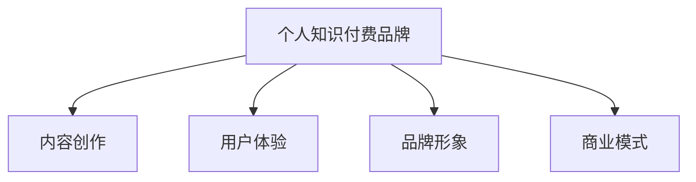

                 

# 如何打造个人知识付费品牌

> 关键词：个人知识付费品牌,知识付费,内容创作,品牌打造,商业模式

## 1. 背景介绍

### 1.1 问题由来
在信息爆炸的时代，知识的获取和传播途径越来越多，个人通过知识付费实现变现的需求日益高涨。知识付费不仅仅是教育和培训的延伸，更是个人品牌和商业价值的直接体现。如何打造具有个人特色的知识付费品牌，成为每个知识创作者必须面对的课题。

### 1.2 问题核心关键点
知识付费品牌打造的核心关键点在于内容质量、用户体验、品牌形象和商业模式。只有在这四个方面下足功夫，才能在竞争激烈的知识市场中脱颖而出，实现可持续的商业变现。

### 1.3 问题研究意义
个人知识付费品牌的成功打造，不仅可以提升创作者的经济收入，还能进一步巩固其在知识领域的地位，扩大其影响力。更重要的是，通过知识付费，创作者能够与更多人建立连接，促进知识的共享和传播，为社会创造更大的价值。

## 2. 核心概念与联系

### 2.1 核心概念概述

为更好地理解个人知识付费品牌打造方法，本节将介绍几个密切相关的核心概念：

- 个人知识付费品牌：指个人或团队基于特定知识领域，通过提供有价值的内容和服务，构建的可持续运营的知识付费平台。
- 内容创作：指知识创作者将自身专业知识、经验和见解转化为可消费的、具有教育意义的内容的过程。
- 用户体验：指用户在消费知识内容时的感受和满意度，包括内容的可理解性、互动性、个性化等。
- 品牌形象：指品牌在消费者心目中的印象和认知，包括品牌故事、视觉风格、服务态度等。
- 商业模式：指个人知识付费品牌基于何种策略和模式进行盈利，包括定价策略、渠道选择、收益分配等。

这些核心概念之间的逻辑关系可以通过以下Mermaid流程图来展示：



这个流程图展示了一个个人知识付费品牌构建的基本框架：

1. 以内容创作为核心，提供高质量的知识产品。
2. 通过提升用户体验，吸引和留住用户。
3. 塑造和传播品牌形象，增强用户粘性。
4. 根据商业模式选择盈利方式，实现可持续运营。

这些概念共同构成了个人知识付费品牌的构建基础，帮助创作者制定出系统化的品牌发展战略。

## 3. 核心算法原理 & 具体操作步骤
### 3.1 算法原理概述

个人知识付费品牌的打造，本质上是一种基于用户需求和市场反馈的动态优化过程。其核心思想是：

1. **内容优化**：根据用户反馈，不断调整和提升内容质量，使其更符合目标用户群体的需求和偏好。
2. **用户体验提升**：通过技术手段和设计思维，提高内容消费的便利性和互动性，提升用户满意度。
3. **品牌塑造**：通过持续的品牌传播和互动活动，塑造独特而富有吸引力的品牌形象，增强用户认同感。
4. **商业策略设计**：根据市场需求和竞争环境，选择适合的定价策略和渠道模式，最大化商业利益。

### 3.2 算法步骤详解

个人知识付费品牌的打造一般包括以下几个关键步骤：

**Step 1: 市场调研与用户画像分析**
- 收集目标用户的偏好、行为数据，分析其需求和痛点。
- 制作详细用户画像，明确目标用户群体的特点。

**Step 2: 内容定位与策略制定**
- 基于用户画像，确定内容主题和风格。
- 制定内容创作计划，包括发布频率、互动方式等。

**Step 3: 内容制作与分发**
- 按计划进行内容创作，确保高质量和创新性。
- 选择合适的分发渠道，如个人网站、社交媒体、知识平台等。

**Step 4: 用户体验优化**
- 收集用户反馈，进行内容调整和功能优化。
- 设计互动环节，如问答、讨论、直播等，提升用户参与度。

**Step 5: 品牌形象塑造**
- 制定品牌故事和视觉风格，打造统一的对外形象。
- 开展品牌活动和社交媒体营销，增强品牌曝光度。

**Step 6: 商业模式设计**
- 选择合适的盈利模式，如订阅、按需付费、课程销售等。
- 设计合理的定价策略和收益分配方案。

**Step 7: 持续优化与迭代**
- 定期收集用户反馈和市场信息，调整品牌策略和内容计划。
- 持续创新和改进，保持品牌竞争力。

以上是打造个人知识付费品牌的一般流程。在实际应用中，还需要针对具体用户的特性和市场环境进行细化设计，如多渠道推广、个性化推荐、社区管理等，以进一步提升品牌的影响力和用户粘性。

### 3.3 算法优缺点

个人知识付费品牌打造方法具有以下优点：
1. 满足用户个性化需求。通过个性化推荐和互动，实现精准的内容匹配。
2. 提升知识传播效率。借助新媒体渠道，快速扩大品牌影响力。
3. 增加创作者收入。通过知识付费，实现内容变现，提高创作动力。
4. 促进知识创新。用户反馈和互动可以激发创作者的新灵感和新创意。

同时，该方法也存在一定的局限性：
1. 对创作者的要求高。需要创作者具有丰富的知识和领域经验，以及优秀的表达和沟通能力。
2. 市场竞争激烈。随着知识付费市场的快速发展，同质化竞争严重，品牌难以突围。
3. 内容质量难以保障。内容质量不稳定，可能导致用户流失。
4. 运营成本较高。品牌推广和用户维护需要持续投入资源，成本较高。

尽管存在这些局限性，但就目前而言，个人知识付费品牌打造已成为知识创作者实现商业变现的重要手段。未来相关研究的重点在于如何进一步降低运营成本，提高内容质量，增强用户粘性，同时兼顾品牌形象的塑造和商业模式的创新。

### 3.4 算法应用领域

个人知识付费品牌打造方法，在教育、咨询、技术、健康、心理等多个领域都有广泛应用：

- 教育领域：个人知识付费品牌可提供各类在线课程、教育咨询服务，满足学生和家长对个性化教育的需求。
- 咨询领域：咨询师或专家通过知识付费品牌提供专业建议，解答用户咨询，实现高端咨询变现。
- 技术领域：工程师或开发者通过知识付费品牌分享技术经验，解决开发难题，吸引技术社区和企业的关注。
- 健康领域：健康专家和营养师通过知识付费品牌提供健康管理、营养建议等，推广健康生活方式。
- 心理领域：心理咨询师和心理学家通过知识付费品牌提供心理辅导、情感支持等服务，帮助用户缓解压力和焦虑。

除了上述这些经典领域外，个人知识付费品牌还被创新性地应用到更多场景中，如职场技能培训、艺术创作、家庭生活指导等，为不同用户群体提供个性化的知识服务。随着知识付费品牌的不断成熟，相信其应用范围将更加广泛，为社会带来更多的价值。

## 4. 数学模型和公式 & 详细讲解  
### 4.1 数学模型构建

本节将使用数学语言对个人知识付费品牌打造方法进行更加严格的刻画。

记品牌为目标用户群体 $U$ 提供的内容和服务的集合，用户对品牌的满意度为 $S$，品牌的市场份额为 $M$，品牌的影响力为 $I$，品牌的运营成本为 $C$。品牌打造的数学模型为：

$$
\max_{U, S, M, I, C} \{S \times M \times I - C\}
$$

其中，$S$、$M$、$I$ 分别代表用户满意度、市场份额、影响力，$C$ 代表运营成本。

通过优化上述模型，可以找到最大化品牌价值的最优策略。

### 4.2 公式推导过程

由于市场环境、用户需求和品牌定位等因素复杂多变，具体的数学推导过程难以直接展开。但可以明确的是，品牌打造的过程需要通过不断迭代优化，找到用户满意度、市场份额和影响力最大化且运营成本最低的均衡点。

在实际应用中，可以通过A/B测试、市场调研、用户反馈等手段，逐步调整和优化品牌策略，提升品牌价值。

### 4.3 案例分析与讲解

以某知名编程教育平台为例，该平台通过个人知识付费品牌打造，实现了从无到有、从有到优的快速成长。

- 初期调研：平台通过问卷调查、在线访谈等方式，收集了大量编程初学者的需求和痛点，明确了品牌定位。
- 内容制作：平台邀请了多位知名编程专家，按照需求制作了多门高质量课程，满足不同层次用户的需求。
- 用户互动：平台开展了在线讨论、实时答疑、社群分享等多种互动活动，增强用户粘性。
- 品牌塑造：平台通过社交媒体、博客、邮件等方式，持续传播品牌故事和技术分享，提升了品牌知名度和美誉度。
- 商业策略：平台采用了按需付费和订阅制的盈利模式，通过会员制度和积分体系，实现了用户留存和持续消费。

通过这一系列措施，平台不仅积累了大量忠实用户，还成功吸引了多家企业的商业合作，实现了从内容到品牌的全方位突破。

## 5. 项目实践：代码实例和详细解释说明
### 5.1 开发环境搭建

在进行品牌打造实践前，我们需要准备好开发环境。以下是使用Python进行开发的环境配置流程：

1. 安装Python：从官网下载并安装Python，并添加环境变量。
2. 安装必要的库：如Flask、Jinja、SQLAlchemy等，用于搭建网站和数据库。
3. 安装用户管理系统：如Flask-Login、Flask-Security，用于用户注册、登录、权限管理。
4. 安装知识管理系统：如Jekyll、Strapi，用于内容创建、发布、管理。
5. 安装分析工具：如Google Analytics、Mixpanel，用于用户行为分析和营销效果跟踪。

完成上述步骤后，即可在本地搭建起个人知识付费品牌的开发环境。

### 5.2 源代码详细实现

这里以一个简单的在线课程平台为例，展示如何实现个人知识付费品牌的核心功能。

1. 创建用户模型和管理系统：
```python
from flask_login import UserMixin, LoginManager
from flask_sqlalchemy import SQLAlchemy

db = SQLAlchemy()
login_manager = LoginManager()

class User(UserMixin, db.Model):
    id = db.Column(db.Integer, primary_key=True)
    username = db.Column(db.String(80), unique=True, nullable=False)
    email = db.Column(db.String(120), unique=True, nullable=False)
    password = db.Column(db.String(120), nullable=False)

@login_manager.user_loader
def load_user(user_id):
    return User.query.get(int(user_id))
```

2. 实现课程模型和管理系统：
```python
class Course(db.Model):
    id = db.Column(db.Integer, primary_key=True)
    title = db.Column(db.String(120), nullable=False)
    description = db.Column(db.Text, nullable=False)
    instructor = db.Column(db.String(80), nullable=False)
    price = db.Column(db.Float, nullable=False)

    def __repr__(self):
        return f"<Course {self.title}>"

courses = db.create_all()
```

3. 搭建前后端交互界面：
```python
from flask import Flask, render_template, request, redirect, url_for
from flask_sqlalchemy import SQLAlchemy

app = Flask(__name__)
app.config['SQLALCHEMY_DATABASE_URI'] = 'sqlite:///course.db'
app.config['SECRET_KEY'] = 'secret_key'

db.init_app(app)
login_manager.init_app(app)

@app.route('/')
def index():
    courses = Course.query.all()
    return render_template('index.html', courses=courses)

@app.route('/login', methods=['GET', 'POST'])
def login():
    if request.method == 'POST':
        # 处理登录请求
        pass
    return render_template('login.html')

@app.route('/signup', methods=['GET', 'POST'])
def signup():
    if request.method == 'POST':
        # 处理注册请求
        pass
    return render_template('signup.html')

@app.route('/register', methods=['GET', 'POST'])
def register():
    if request.method == 'POST':
        # 处理注册请求
        pass
    return render_template('register.html')

@app.route('/course/<id>')
def course(id):
    course = Course.query.get(id)
    return render_template('course.html', course=course)
```

4. 实现订单处理和支付功能：
```python
from flask_login import current_user
from flask_sqlalchemy import SQLAlchemy

class Order(db.Model):
    id = db.Column(db.Integer, primary_key=True)
    user_id = db.Column(db.Integer, db.ForeignKey('user.id'))
    course_id = db.Column(db.Integer, db.ForeignKey('course.id'))
    amount = db.Column(db.Float, nullable=False)
    status = db.Column(db.String(80), nullable=False)

@login_manager.user_loader
def load_user(user_id):
    return User.query.get(int(user_id))
```

以上是个人知识付费品牌开发的关键代码实现。通过Flask框架和SQLAlchemy库，实现了用户管理、课程管理、订单处理等功能，可以为品牌运营提供基础支撑。

### 5.3 代码解读与分析

让我们再详细解读一下关键代码的实现细节：

**用户模型和管理系统**：
- 使用Flask-Login扩展实现用户登录和权限管理。
- 用户模型包含用户名、邮箱、密码等关键信息。

**课程模型和管理系统**：
- 课程模型包含课程标题、描述、讲师、价格等关键属性。
- 通过SQLAlchemy库，实现课程的创建、查询和管理。

**前后端交互界面**：
- 使用Flask框架搭建前后端交互界面，通过模板引擎渲染页面。
- 实现登录、注册、课程浏览等功能。

**订单处理和支付功能**：
- 使用Flask-Login扩展实现订单关联用户和课程。
- 订单模型包含用户ID、课程ID、金额、状态等关键信息。

以上代码实现了个人知识付费品牌的基础功能，包括用户管理、课程管理、订单处理等。开发者可以根据具体需求，进一步扩展功能，如课程推荐、用户互动、数据分析等。

## 6. 实际应用场景
### 6.1 教育领域

个人知识付费品牌在教育领域有着广阔的应用前景。传统的教育资源分散、质量参差不齐，难以满足个性化需求。通过打造知识付费品牌，教育创作者可以整合优质教育资源，提供系统化、个性化的学习方案，实现教育领域的知识变现。

以某编程教育平台为例，该平台通过个性化编程课程、在线辅导和社区讨论等方式，吸引了大量编程学习者。平台还与多家知名企业合作，提供企业内部培训和认证服务，实现了从在线教育到企业培训的全面布局。

### 6.2 咨询领域

知识付费品牌在咨询领域同样有着巨大的市场潜力。专业的咨询师通过提供深入的专业知识和见解，帮助客户解决问题，实现高效咨询变现。

以某法律咨询平台为例，该平台通过打造专业法律咨询服务品牌，吸引了众多法律从业者和消费者。平台定期举办在线法律讲座和直播，解答客户咨询，还提供在线法律文档和案例分析，帮助客户快速获取法律知识。

### 6.3 技术领域

技术领域的知识创作者，通过打造个人品牌，可以快速积累技术社区和企业的关注，实现技术经验的变现。

以某技术博客为例，该博客通过分享编程技巧、软件开发经验等，吸引了大量技术爱好者和开发者。博客还开展在线编程直播和课程，帮助读者解决编程难题，实现从内容创作到商业变现的全链条发展。

### 6.4 未来应用展望

随着个人知识付费品牌的不断发展，未来将在更多领域得到应用，为社会带来变革性影响：

- 医疗健康领域：通过打造健康管理、营养咨询等知识付费品牌，帮助用户建立健康生活方式，实现健康知识的商业变现。
- 心理情感领域：心理咨询师和情感顾问通过知识付费品牌，提供心理辅导和情感支持，满足用户心理需求。
- 创意艺术领域：艺术家和设计师通过知识付费品牌，分享创作经验和设计思路，实现创意变现。

此外，知识付费品牌还将拓展到更多新兴领域，如智慧城市、智慧农业等，为各行各业带来新的价值。相信随着知识付费市场的不断成熟，个人知识付费品牌将成为知识创作者实现商业变现的重要手段，推动知识经济的发展。

## 7. 工具和资源推荐
### 7.1 学习资源推荐

为了帮助开发者系统掌握个人知识付费品牌打造的理论基础和实践技巧，这里推荐一些优质的学习资源：

1. **《内容创富：打造个人品牌》**：深入解析内容创富的核心要素，提供从内容创作到品牌运营的全方位指导。
2. **《知识付费：商业模式与实践》**：全面介绍知识付费的商业模式和运营策略，帮助创作者打造可持续的商业品牌。
3. **《NLP实践与技术》**：讲解自然语言处理技术在知识付费中的应用，提供内容推荐、情感分析等实用技巧。
4. **《用户心理学与行为设计》**：深入分析用户心理和行为规律，提供品牌塑造和用户体验优化的有效策略。
5. **《数据分析与业务决策》**：讲解数据分析在品牌运营中的应用，提供用户行为分析和市场决策的实用方法。

通过对这些资源的学习实践，相信你一定能够快速掌握个人知识付费品牌打造的核心方法，并用于解决实际的商业问题。

### 7.2 开发工具推荐

高效的开发离不开优秀的工具支持。以下是几款用于个人知识付费品牌开发的常用工具：

1. **Flask**：轻量级的Web框架，易于学习和使用，适用于快速搭建Web应用。
2. **SQLAlchemy**：高级SQL工具和ORM库，支持多种数据库，便于数据库设计和操作。
3. **Jinja**：模板引擎，提供灵活的HTML渲染能力，提高页面生成效率。
4. **Flask-Login**：用户认证扩展，提供用户登录、权限管理等功能，简化用户管理逻辑。
5. **Flask-Security**：用户认证和权限管理扩展，提供更强大的安全保障。
6. **Google Analytics**：网站分析工具，提供用户行为分析、流量跟踪等功能。
7. **Mixpanel**：用户行为分析工具，提供详细的用户行为路径和互动数据。

合理利用这些工具，可以显著提升个人知识付费品牌的开发效率，加快创新迭代的步伐。

### 7.3 相关论文推荐

个人知识付费品牌的成功打造，源于学界的持续研究。以下是几篇奠基性的相关论文，推荐阅读：

1. **《内容创富：打造个人品牌》**：介绍内容创富的理论和方法，为品牌打造提供系统化指导。
2. **《知识付费：商业模式与实践》**：分析知识付费的商业模型和市场策略，提供品牌运营的实用技巧。
3. **《用户行为分析与设计》**：研究用户心理和行为规律，提供品牌塑造和用户体验优化的有效策略。
4. **《数据分析与商业决策》**：讲解数据分析在品牌运营中的应用，提供用户行为分析和市场决策的实用方法。

这些论文代表了大品牌打造技术的发展脉络。通过学习这些前沿成果，可以帮助研究者把握学科前进方向，激发更多的创新灵感。

## 8. 总结：未来发展趋势与挑战
### 8.1 总结

本文对个人知识付费品牌打造方法进行了全面系统的介绍。首先阐述了个人知识付费品牌的背景和核心关键点，明确了打造品牌的目的是实现知识变现，提升个人价值。其次，从原理到实践，详细讲解了品牌打造的过程和关键步骤，给出了品牌运营的完整代码实现。同时，本文还广泛探讨了品牌打造方法在教育、咨询、技术等多个领域的应用前景，展示了品牌打造的广阔潜力。最后，本文精选了品牌打造的各类学习资源，力求为读者提供全方位的技术指引。

通过本文的系统梳理，可以看到，个人知识付费品牌的打造是一个系统性的工程，涉及内容创作、用户体验、品牌塑造和商业策略等多个方面。只有在这几个环节下足功夫，才能构建具有竞争力和影响力的个人品牌。

### 8.2 未来发展趋势

展望未来，个人知识付费品牌打造技术将呈现以下几个发展趋势：

1. **内容个性化和多样化**：随着大数据和AI技术的发展，个性化推荐和内容生成将更加精准，满足用户多样化需求。
2. **用户互动和社区化**：通过社交网络和社区平台，增强用户互动和参与度，建立品牌忠实用户群体。
3. **技术创新和融合**：结合区块链、VR/AR等新技术，提供更丰富、更具沉浸感的互动体验。
4. **多渠道融合**：打通线上线下渠道，实现多平台多渠道的全面覆盖，提升品牌影响力。
5. **国际化拓展**：将品牌拓展到全球市场，满足不同地区用户需求，实现全球化品牌运营。

以上趋势凸显了个人知识付费品牌打造技术的广阔前景。这些方向的探索发展，必将进一步提升品牌的影响力和用户粘性，推动知识经济的发展。

### 8.3 面临的挑战

尽管个人知识付费品牌打造技术已经取得了瞩目成就，但在迈向更加智能化、普适化应用的过程中，它仍面临着诸多挑战：

1. **内容质量难以保障**：创作者需具备高度的专业知识和表达能力，内容质量不稳定，可能导致用户流失。
2. **用户运营成本高**：品牌推广和用户维护需要持续投入资源，成本较高。
3. **市场竞争激烈**：同质化竞争严重，品牌难以突围。
4. **品牌忠诚度低**：用户忠诚度不足，需持续提供高质量内容和新体验，保持品牌吸引力。
5. **商业模式单一**：盈利模式相对单一，需探索更多多元化的变现方式。

尽管存在这些挑战，但个人知识付费品牌打造仍然具有广阔的市场前景。未来相关研究的重点在于如何进一步降低运营成本，提高内容质量，增强用户粘性，同时兼顾品牌形象的塑造和商业模式的创新。

### 8.4 研究展望

面对个人知识付费品牌打造所面临的挑战，未来的研究需要在以下几个方面寻求新的突破：

1. **内容自动化生成**：结合自然语言处理技术，实现内容自动化生成，提高内容创作效率和质量。
2. **用户互动模型**：研究用户行为规律和情感特征，建立智能互动模型，提供更个性化的互动体验。
3. **多渠道整合**：实现线上线下多渠道整合，提升品牌曝光度和用户参与度。
4. **数据驱动决策**：通过大数据分析和用户行为分析，指导品牌运营决策，提高运营效率和效果。
5. **技术融合创新**：结合区块链、VR/AR等新技术，提供更丰富、更具沉浸感的互动体验。

这些研究方向的探索，必将引领个人知识付费品牌打造技术迈向更高的台阶，为创作者提供更全面、更高效的品牌运营策略。只有勇于创新、敢于突破，才能不断拓展品牌边界，实现可持续的商业变现。

## 9. 附录：常见问题与解答
**Q1：打造个人知识付费品牌需要哪些核心能力？**

A: 打造个人知识付费品牌需要以下核心能力：
- **内容创作能力**：具有丰富的专业知识和表达能力，能够创作高质量、有价值的内容。
- **技术开发能力**：掌握Web开发、数据库设计等技术，能够搭建和管理品牌平台。
- **用户运营能力**：具备用户分析和管理能力，能够吸引、留住用户，提升用户粘性。
- **品牌塑造能力**：能够构建独特的品牌形象和故事，增强品牌认知度。
- **市场运营能力**：具备市场分析和营销推广能力，能够制定和执行有效的市场策略。

**Q2：如何提升品牌的影响力？**

A: 提升品牌影响力可以从以下几个方面入手：
- **内容质量**：持续提供高质量、有价值的内容，满足用户需求。
- **用户互动**：增强用户参与度和互动性，建立品牌忠实用户群体。
- **品牌传播**：通过社交媒体、博客、邮件等渠道，持续传播品牌故事和价值，扩大品牌知名度。
- **多渠道整合**：打通线上线下渠道，实现多平台多渠道的全面覆盖，提升品牌影响力。
- **用户反馈**：定期收集用户反馈和意见，不断优化和改进品牌策略，增强用户满意度。

**Q3：如何提高品牌的运营效率？**

A: 提高品牌运营效率可以从以下几个方面入手：
- **自动化流程**：利用自动化工具和脚本，简化重复性任务，提高工作效率。
- **数据驱动决策**：通过数据分析和用户行为分析，指导品牌运营决策，提高运营效率和效果。
- **用户管理**：建立用户管理系统，实现用户行为跟踪和个性化推荐，提升用户粘性。
- **多渠道整合**：打通线上线下渠道，实现多平台多渠道的全面覆盖，提升品牌曝光度和用户参与度。
- **技术创新**：结合新技术，提供更丰富、更具沉浸感的互动体验，增强用户体验。

**Q4：如何构建个人知识付费品牌的商业模式？**

A: 构建个人知识付费品牌的商业模式可以从以下几个方面入手：
- **订阅制**：按月或按年收费，提供持续性的内容和服务。
- **按需付费**：单次付费获取课程或内容，提供一次性服务。
- **课程销售**：通过课程销售实现商业变现，提供系统化的教育培训。
- **企业合作**：与企业合作，提供定制化解决方案，实现商业变现。
- **广告和赞助**：通过广告和赞助，获取品牌推广收入。

通过以上方式，可以实现个人知识付费品牌的商业变现，同时保持品牌的可持续性和创新性。

---

作者：禅与计算机程序设计艺术 / Zen and the Art of Computer Programming

