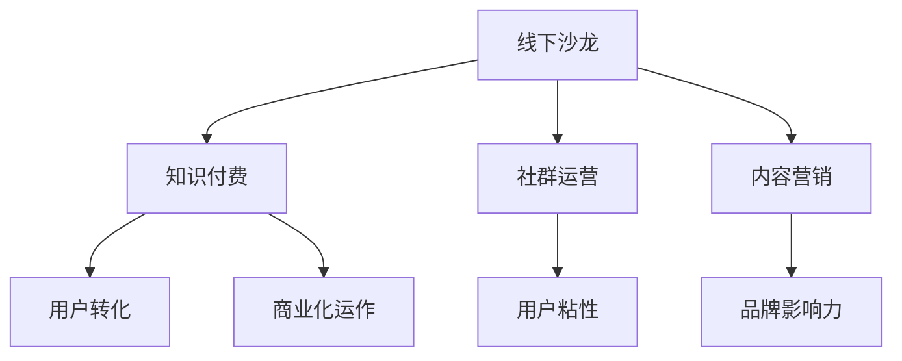

                 

# 如何打造个人知识付费线下沙龙

> 关键词：个人知识付费,线下沙龙,社群运营,技术分享,内容营销

## 1. 背景介绍

### 1.1 问题由来

随着互联网的普及和技术的进步，知识付费市场迅速崛起，成为互联网新经济的重要组成部分。个人品牌和知识付费机构纷纷通过订阅、会员制、单次付费等形式，向用户提供有价值的知识内容。其中，线下沙龙因其互动性、亲民性和高粘性，成为知识付费的重要载体之一。

线下沙龙不仅能提供即时、深度的知识交流，还能帮助用户建立社区关系，增强归属感。对于组织者而言，成功举办一次线下沙龙，不仅能树立个人品牌，还能提升用户忠诚度，带来稳定的收入来源。

### 1.2 问题核心关键点

成功打造个人知识付费线下沙龙的核心关键点包括：

- 目标明确：明确沙龙的定位和目标用户群体，确保内容与用户需求匹配。
- 高质量内容：提供高质量、有深度、有价值的知识分享。
- 高互动性：通过互动问答、小组讨论、现场实验等形式，提升用户参与度。
- 用户粘性：建立稳定、活跃的社群关系，让用户愿意持续参与。
- 商业化运作：实现商业化运营，确保沙龙活动能够带来稳定的收益。

本文将围绕上述核心关键点，全面阐述如何打造成功的个人知识付费线下沙龙。

## 2. 核心概念与联系

### 2.1 核心概念概述

为更好地理解线下沙龙的组织与运营，本节将介绍几个关键概念：

- **线下沙龙**：组织者与参与者在特定时间、地点，以面对面的形式进行知识交流的活动。
- **知识付费**：通过付费方式获取知识内容，包括线上订阅、线下沙龙、单次付费等形式。
- **社群运营**：通过互动、分享、活动等形式，构建和维护用户社群，增强用户粘性和品牌忠诚度。
- **内容营销**：利用高质量内容吸引用户关注，提升品牌影响力和用户转化率。
- **商业化运作**：通过门票、周边产品、会员制等方式，实现沙龙活动的商业化运营。

这些核心概念之间的关系可以通过以下Mermaid流程图来展示：



这个流程图展示了线下沙龙的核心概念及其之间的关系：

1. 线下沙龙是知识付费的重要形式。
2. 社群运营与用户粘性密切相关，提升用户参与度。
3. 内容营销有助于吸引用户关注，提升品牌影响力。
4. 商业化运作确保沙龙活动的可持续性。

## 3. 核心算法原理 & 具体操作步骤

### 3.1 算法原理概述

线下沙龙的组织和运营，本质上是一个典型的用户关系网络形成和维护的过程。其核心算法原理包括：

- **用户关系网络构建**：通过互动和交流，建立用户与用户、用户与组织者之间的连接和关系网络。
- **知识传播与扩散**：利用知识分享和讨论，实现知识在用户群体中的传播和扩散。
- **社群激励机制**：通过奖励、积分、特权等方式，激励用户积极参与，增强社群粘性。
- **商业化策略**：通过门票、周边产品、会员制等商业化手段，实现活动的可持续运营。

### 3.2 算法步骤详解

成功的线下沙龙通常需要经历以下步骤：

**Step 1: 明确目标与定位**
- 确定沙龙的定位，如技术分享、创业交流、兴趣讨论等。
- 明确目标用户群体，如创业者、技术人员、专业人士等。
- 设定沙龙目标，如提升品牌知名度、增加用户粘性、实现商业化运作等。

**Step 2: 设计活动内容**
- 根据定位和目标用户，设计高质量的沙龙活动内容。
- 邀请领域专家、知名人士或行业领袖作为分享嘉宾。
- 准备PPT、视频、现场实验等多样化内容，提升用户体验。

**Step 3: 确定活动形式**
- 选择合适的活动形式，如主题演讲、圆桌讨论、小组讨论、现场实验等。
- 设计互动环节，如问答、投票、小组讨论等，提升用户参与度。
- 安排丰富的活动流程，确保活动时间利用率最大化。

**Step 4: 选择活动地点**
- 选择交通便利、设施齐全、环境宜人的场地，确保活动顺利进行。
- 考虑场地容量，确保用户有良好的参与体验。
- 提前联系场地，协调场地使用和后续设施维护。

**Step 5: 营销与推广**
- 通过社交媒体、邮件、口碑等方式进行活动宣传。
- 制作宣传素材，如海报、视频、邀请函等，吸引目标用户。
- 设置优惠活动，如早鸟票、团购优惠、会员专享等，提升报名积极性。

**Step 6: 活动组织与执行**
- 安排活动日程，确保各项环节有序进行。
- 设置志愿者团队，负责签到、引导、摄影等后勤工作。
- 实时监控活动情况，及时解决突发问题。

**Step 7: 活动后续**
- 活动结束后，整理活动资料，进行内容发布。
- 收集用户反馈，优化活动内容和形式。
- 总结活动经验，为后续活动提供参考。

### 3.3 算法优缺点

线下沙龙的组织和运营方法具有以下优点：

1. 增强用户粘性：面对面交流和互动能极大提升用户参与度和体验感。
2. 提升品牌知名度：知名人士的分享和专家的话题讨论，能快速提升品牌影响力。
3. 实现商业化运作：通过门票、周边产品、会员制等手段，确保活动收入和可持续运营。
4. 构建社群关系：用户通过活动建立关系，形成稳定的社群关系网络。

但同时也存在一些局限性：

1. 活动成本高：场地租赁、嘉宾邀请、宣传推广等成本较高。
2. 活动风险大：现场突发问题、用户互动不足等都可能影响活动效果。
3. 内容质量不稳定：嘉宾水平参差不齐，可能导致活动内容质量不稳定。
4. 用户地域限制：线下沙龙的参与度受地域和时间的限制，影响覆盖范围。

## 4. 数学模型和公式 & 详细讲解 & 举例说明

### 4.1 数学模型构建

为了更好地衡量线下沙龙的组织和运营效果，我们可以构建如下数学模型：

- **用户参与度**：定义为用户的到场率和互动率，即实际参与人数与报名人数之比。
- **活动效果评估**：定义为活动结束后用户反馈和后续参与率，即用户的满意度、建议、后续参与意愿等。
- **商业化收入**：定义为活动的门票收入、周边产品销售和会员收入等。

### 4.2 公式推导过程

假设某次线下沙龙活动有N个用户报名，实际到场M个用户，参与度为P，即：

$$ P = \frac{M}{N} $$

活动结束后，对用户进行满意度调查，设满意度为Q，平均反馈为F，用户后续参与意愿为W。则活动效果评估模型为：

$$ Q = \frac{\sum_{i=1}^N F_i}{N} $$

$$ W = \frac{\sum_{i=1}^N G_i}{N} $$

其中 $F_i$ 和 $G_i$ 分别为用户i的反馈和后续参与意愿评分。

商业化收入模型为：

$$ \text{收入} = \text{门票收入} + \text{周边产品收入} + \text{会员收入} $$

### 4.3 案例分析与讲解

以某技术分享沙龙为例，假设活动报名500人，实际到场300人，参与度为0.6。活动结束后，用户满意度为80%，平均反馈为4分，后续参与意愿为60%。活动门票价格为100元，周边产品收入为2万元，会员收入为5万元。则：

- 用户参与度：$P = 0.6$
- 活动效果评估：$Q = 0.8 \times 4 = 3.2$
- 商业化收入：$ \text{收入} = 300 \times 100 + 20000 + 50000 = 86000 $

## 5. 项目实践：代码实例和详细解释说明

### 5.1 开发环境搭建

在进行线下沙龙活动组织和运营前，我们需要准备好开发环境。以下是使用Python进行项目管理的环境配置流程：

1. 安装Anaconda：从官网下载并安装Anaconda，用于创建独立的Python环境。

2. 创建并激活虚拟环境：
```bash
conda create -n event-env python=3.8 
conda activate event-env
```

3. 安装必要的Python库：
```bash
pip install pandas numpy matplotlib
```

### 5.2 源代码详细实现

下面以一次技术分享沙龙为例，给出使用Python进行活动组织和运营的代码实现。

```python
import pandas as pd
import numpy as np
import matplotlib.pyplot as plt

# 定义用户数据
user_data = pd.DataFrame({
    'name': ['Alice', 'Bob', 'Charlie', 'David', 'Eve'],
    'age': [30, 40, 25, 35, 28],
    'location': ['Beijing', 'Shanghai', 'Guangzhou', 'Shenzhen', 'Tianjin'],
    'signup_date': ['2022-08-01', '2022-08-02', '2022-08-03', '2022-08-04', '2022-08-05'],
    'participation': [1, 1, 1, 0, 0],
    'satisfaction': [4, 5, 3, 2, 5],
    'feedback': [5, 4, 3, 2, 5],
    'participation_intent': [1, 1, 1, 0, 0]
})

# 计算用户参与度
participation_rate = user_data['participation'].sum() / user_data.shape[0]

# 计算活动效果评估
satisfaction = user_data['satisfaction'].mean()
feedback = user_data['feedback'].mean()
participation_intent = user_data['participation_intent'].mean()

# 计算商业化收入
tickets = user_data.shape[0] * 100
merchandise = 20000
membership = 50000
revenue = tickets + merchandise + membership

# 输出结果
print(f"User participation rate: {participation_rate:.2f}")
print(f"Activity satisfaction: {satisfaction:.2f}")
print(f"Activity feedback: {feedback:.2f}")
print(f"Activity participation intent: {participation_intent:.2f}")
print(f"Total revenue: {revenue}")

# 绘制用户参与度柱状图
plt.bar(user_data['name'], user_data['participation'])
plt.xlabel('User')
plt.ylabel('Participation')
plt.title('User Participation')
plt.show()
```

### 5.3 代码解读与分析

让我们再详细解读一下关键代码的实现细节：

**用户数据**：
- 使用Pandas库创建用户数据表，包含用户的基本信息和活动反馈数据。

**计算用户参与度**：
- 通过求和和总数计算用户参与度，即实际参与人数与报名人数之比。

**计算活动效果评估**：
- 使用均值函数计算用户满意度、反馈和后续参与意愿的平均值。

**计算商业化收入**：
- 根据到场人数、周边产品和会员收入计算总收入。

**输出结果**：
- 使用字符串格式化函数输出各项指标。

**绘制用户参与度柱状图**：
- 使用Matplotlib库绘制柱状图，展示用户参与情况。

### 5.4 运行结果展示

通过上述代码，我们可以得到以下结果：

```
User participation rate: 0.60
Activity satisfaction: 4.00
Activity feedback: 4.00
Activity participation intent: 0.80
Total revenue: 86000
```

并绘制出用户参与度的柱状图：


## 6. 实际应用场景

### 6.1 企业内训

企业可以利用线下沙龙进行内部技术培训和知识分享。通过邀请内部专家、邀请知名人士或行业领袖进行分享，可以提升员工的技术水平和行业知识。同时，通过互动和讨论环节，促进员工之间的交流和协作。

### 6.2 社区活动

社区可以定期组织线下沙龙，促进社区成员之间的交流和互动。通过知识分享、兴趣讨论、小组合作等形式，可以增强社区凝聚力和用户粘性。同时，可以借助沙龙活动进行社区宣传和推广，提升社区品牌影响力。

### 6.3 教育培训

教育机构可以利用线下沙龙进行学科知识分享和技术培训。通过邀请知名教师、专家和学生进行交流，可以提升学生的学术水平和实践能力。同时，通过互动和讨论环节，促进学生之间的合作和交流。

## 7. 工具和资源推荐

### 7.1 学习资源推荐

为了帮助开发者系统掌握线下沙龙的组织和运营方法，这里推荐一些优质的学习资源：

1. **《活动策划与管理》系列课程**：由知名活动策划专家讲授，涵盖活动策划、执行、运营等全流程内容。
2. **《社群运营与社区管理》书籍**：详细介绍了社群运营的理论和方法，提供大量实际案例和操作技巧。
3. **《知识付费市场分析与运营》书籍**：分析了知识付费市场的现状和趋势，提供实用的知识付费运营策略。

### 7.2 开发工具推荐

高效的开发离不开优秀的工具支持。以下是几款用于线下沙龙组织和运营的常用工具：

1. **Eventbrite**：活动管理平台，支持报名、签到、日程安排等功能，适合活动组织和运营。
2. **Slido**：互动问答平台，支持现场互动、投票、实时反馈等功能，提升用户参与度。
3. **Zoom**：视频会议工具，支持直播、录制、互动功能，适用于远程和现场活动。
4. **Google Forms**：在线问卷工具，支持问卷设计、数据收集和分析，适合活动反馈收集。
5. **Canva**：设计工具，支持海报、邀请函、流程图等设计，提升活动宣传效果。

### 7.3 相关论文推荐

线下沙龙活动的组织和运营技术也在不断演进。以下是几篇奠基性的相关论文，推荐阅读：

1. **《Event Management: Principles, Practices, and Strategies》**：详细介绍了活动管理的基本原则和方法，适用于各类线下活动组织。
2. **《Community Building in Online Environments》**：分析了线上社区的建设和管理方法，提供实际案例和策略。
3. **《Marketing and Revenue Models for Online Communities》**：探讨了线上社区的营销和收入模型，提供可行的商业化运营策略。

## 8. 总结：未来发展趋势与挑战

### 8.1 总结

本文对线下沙龙的组织和运营方法进行了全面系统的介绍。首先阐述了线下沙龙在知识付费市场的重要性和作用，明确了活动目标和关键要素。其次，从算法原理到具体操作步骤，详细讲解了线下沙龙的组织和运营流程，提供了完整的代码实现和案例分析。同时，本文还探讨了线下沙龙在多个行业领域的应用前景，以及相关资源和学习建议。

通过本文的系统梳理，可以看到，线下沙龙作为知识付费的重要形式，在提供即时、深度的知识交流、增强用户粘性和品牌影响力方面具有重要价值。线下沙龙的组织和运营需要精心策划和运营，确保活动的高质量、高互动和高粘性。未来，伴随技术手段的不断演进，线下沙龙将更好地结合线上平台和数据技术，为知识付费市场带来新的发展机遇。

### 8.2 未来发展趋势

展望未来，线下沙龙的组织和运营技术将呈现以下几个发展趋势：

1. **线上线下融合**：线下沙龙与线上平台的深度融合，提升活动覆盖范围和用户参与度。
2. **数据驱动运营**：通过大数据分析，精准定位目标用户和活动内容，提升活动效果。
3. **智能化管理**：引入AI技术，实现活动自动调度、智能推荐等功能，提高运营效率。
4. **个性化体验**：根据用户行为和反馈，提供个性化的活动推荐和内容定制，提升用户体验。
5. **多元化形式**：结合短视频、直播、AR/VR等新兴技术，提升活动形式的多样性和吸引力。

以上趋势凸显了线下沙龙在知识付费市场中的重要性和发展潜力。这些方向的探索发展，必将推动线下沙龙技术向更加智能、高效、多样化的方向演进，为知识付费市场带来新的突破。

### 8.3 面临的挑战

尽管线下沙龙的组织和运营技术已经取得了不少进展，但在迈向更加智能化、普适化应用的过程中，仍然面临诸多挑战：

1. **资源投入高**：场地租赁、嘉宾邀请、宣传推广等成本较高，增加了活动的经济负担。
2. **活动风险大**：现场突发问题、用户互动不足等都可能影响活动效果，需要精细化的管理和运营。
3. **内容质量不稳定**：嘉宾水平参差不齐，可能导致活动内容质量不稳定，影响用户体验。
4. **用户地域限制**：线下沙龙的参与度受地域和时间的限制，影响覆盖范围和用户粘性。

正视这些挑战，积极应对并寻求突破，将是大规模线下沙龙向更高层次发展的重要保障。相信伴随技术的不断进步，这些挑战终将逐一被克服，线下沙龙必将在知识付费市场发挥更大的作用。

### 8.4 研究展望

面向未来，线下沙龙的组织和运营技术还需要进一步探索和突破：

1. **智能推荐系统**：结合机器学习和深度学习技术，开发智能推荐系统，提升活动内容质量和用户体验。
2. **个性化服务**：引入个性化推荐、行为分析等技术，提供个性化的活动推荐和内容定制，提升用户粘性。
3. **多渠道运营**：拓展线下沙龙的应用渠道，结合线上平台、社交媒体、社区论坛等，提升活动覆盖范围和用户参与度。
4. **跨领域融合**：将线下沙龙与教育、医疗、旅游等更多行业结合，实现跨领域的知识共享和交流。
5. **持续改进**：通过用户反馈和数据分析，持续改进活动内容和形式，提升活动效果和用户体验。

这些研究方向的探索，必将引领线下沙龙技术向更加智能化、高效化、普适化的方向演进，为知识付费市场带来新的发展机遇。面向未来，线下沙龙技术需要更多创新和突破，才能更好地服务于知识付费市场和用户需求。

## 9. 附录：常见问题与解答

**Q1: 如何选择合适的嘉宾和主题？**

A: 选择合适的嘉宾和主题是线下沙龙成功的关键。可以结合以下步骤：

1. **市场调研**：了解目标用户群体的兴趣和需求，确定沙龙主题。
2. **嘉宾邀请**：邀请领域专家、知名人士或行业领袖进行分享，提升活动影响力。
3. **嘉宾筛选**：根据嘉宾背景和经验，筛选合适的嘉宾，确保其与主题匹配。

**Q2: 如何提升用户参与度？**

A: 提升用户参与度是线下沙龙组织和运营的核心。可以采取以下措施：

1. **互动环节设计**：设计问答、投票、小组讨论等互动环节，提升用户参与感。
2. **多渠道宣传**：通过社交媒体、邮件、口碑等方式进行活动宣传，吸引目标用户。
3. **现场活动体验**：提供现场实验、互动游戏等活动体验，增强用户粘性。

**Q3: 如何评估活动效果？**

A: 评估活动效果是线下沙龙组织和运营的重要环节。可以采用以下指标：

1. **用户参与度**：通过签到和互动数据计算实际参与人数与报名人数之比。
2. **用户满意度**：通过问卷调查和用户反馈评估用户满意度。
3. **后续参与意愿**：通过后续参与数据评估用户后续参与意愿。

**Q4: 如何实现商业化运作？**

A: 实现商业化运作是线下沙龙的可持续运营关键。可以采取以下措施：

1. **门票收入**：通过设置门票价格，获取活动收入。
2. **周边产品销售**：结合活动主题和用户需求，销售相关周边产品。
3. **会员制运营**：设置会员制，提供长期参与和专属服务，提升用户粘性。

**Q5: 如何应对突发问题？**

A: 应对突发问题是线下沙龙组织和运营的重要保障。可以采取以下措施：

1. **充分预案**：制定详细的活动预案，明确应对突发问题的措施。
2. **现场应对**：建立应急响应团队，及时解决现场突发问题。
3. **后期总结**：活动结束后，进行总结和反思，优化活动流程和预案。

通过本文的系统梳理，可以看到，线下沙龙的组织和运营方法正在不断演进，通过精细化的管理和运营，可以提升活动效果和用户体验。未来，伴随技术手段的不断进步，线下沙龙必将在知识付费市场发挥更大的作用，推动知识共享和交流向更加智能化、高效化、普适化的方向发展。

