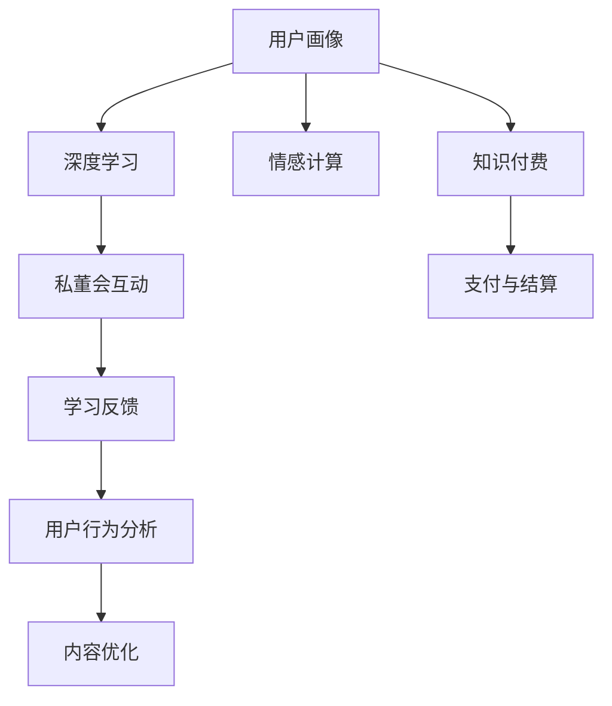

                 

# 如何打造知识付费的私董会模式

在快速变化的时代，知识与智慧的分享比以往任何时候都显得重要。而知识付费作为一种新兴的教育模式，打破了传统教育的界限，以个性化、沉浸式的学习方式，为现代人提供了一种新的知识获取途径。

私董会模式，作为一种高价值的深度交流方式，正成为知识付费行业中的新宠。它不仅仅是知识的分享，更是智慧的碰撞，是在高度私密与互动中获取深度洞察的方式。

本文将从多个角度深入探讨如何打造知识付费的私董会模式，旨在为追求高质量教育体验的用户和教育机构提供可行的解决方案。

## 1. 背景介绍

### 1.1 知识付费的市场环境

随着移动互联网的发展和互联网技术的成熟，知识付费市场正处于快速发展的阶段。越来越多的用户开始倾向于为优质内容付费，而知识付费平台也迅速崛起，如得到、喜马拉雅、新东方等，这些平台通过订阅制、单次付费等多种形式，为知识提供者与消费者之间建立了高效的连接。

### 1.2 私董会模式的优势

私董会模式是一种高度个性化、私密性的交流形式。相较于公开课、单向视频等传统知识付费形式，私董会能够提供更为深入、互动的学习体验。它允许参与者通过一对多或多对一的交流，与导师或同行进行深入讨论，获取独到的见解和建议。

## 2. 核心概念与联系

### 2.1 核心概念概述

为更好地理解如何打造知识付费的私董会模式，本节将介绍几个关键概念：

- **知识付费**：以线上平台为载体，将知识与教育服务作为商品进行交易，包括单向知识传播和互动式知识分享。
- **私董会**：一种私密、高度互动的学习方式，通过一对多或多对一的交流，让参与者能够获取深度见解和建议。
- **深度学习**：使用机器学习模型进行数据分析和决策，使私董会过程更加智能化。
- **用户画像**：通过数据分析，构建用户的学习习惯和需求模型，为私董会的个性化设计提供依据。
- **情感计算**：利用AI技术识别用户情感，提升互动体验的个性化和情感共鸣。

这些概念构成了知识付费私董会模式的基础，通过合理设计和应用这些技术，可以打造出高效、互动、个性化的私董会体验。

### 2.2 核心概念原理和架构的 Mermaid 流程图



这个流程图展示了私董会模式的运作流程：首先通过用户画像构建和深度学习分析，为私董会互动提供个性化内容；情感计算用于提升互动体验；互动过程收集的学习反馈，用于内容优化和用户行为分析；最后支付与结算系统确保知识付费的顺利进行。

## 3. 核心算法原理 & 具体操作步骤

### 3.1 算法原理概述

私董会模式的算法原理主要基于深度学习和情感计算。

- **深度学习**：利用多层神经网络模型，从大量数据中提取特征，实现知识与行为的自动化分析，为私董会的个性化设计提供支持。
- **情感计算**：通过分析用户的表情、语音、文本等，识别用户的情绪和需求，从而优化私董会的交互过程。

私董会模式的核心是互动，通过深度学习和情感计算，不断调整交互内容与形式，以满足用户的学习需求和情感体验。

### 3.2 算法步骤详解

1. **用户画像构建**：
   - 收集用户的历史学习数据、互动数据、支付数据等，利用深度学习模型进行特征提取和聚类，构建用户画像。
   - 用户画像包括用户的兴趣、学习水平、学习频率等特征。

2. **私董会内容设计**：
   - 根据用户画像，设计个性化的私董会内容，包括主题、专家、互动形式等。
   - 内容设计需要结合最新研究进展、行业动态等，保证内容的深度和时效性。

3. **私董会互动过程**：
   - 利用深度学习模型分析用户互动数据，实时调整互动内容，提升用户体验。
   - 情感计算技术识别用户情感，动态调整互动形式和节奏，增强用户的情感共鸣。

4. **学习反馈收集与分析**：
   - 收集用户在私董会中的互动数据、反馈数据等，利用情感计算技术进行分析，了解用户的学习效果和需求。
   - 根据分析结果，优化私董会内容与形式，提升用户满意度。

5. **内容优化与迭代**：
   - 根据用户反馈，不断优化私董会内容与形式，提升用户的互动体验和学习效果。
   - 利用深度学习模型，持续分析用户行为数据，发现新需求，推出新内容。

### 3.3 算法优缺点

私董会模式的优势在于其高度个性化和互动性，能够有效提升用户的学习效果和满意度。但其缺点主要在于对技术和资源的依赖较高，开发和维护成本较大。

### 3.4 算法应用领域

私董会模式可以应用于多个领域，包括但不限于：

- **企业培训**：通过私密的私董会，提升员工的职业技能和团队协作能力。
- **行业研究**：邀请行业专家进行深度交流，获取最新的行业动态和趋势。
- **个人成长**：通过个性化的私董会，提升个人的知识和智慧水平。

私董会模式的应用场景非常广泛，无论是在企业内部还是个人学习中，都能发挥其独特的价值。

## 4. 数学模型和公式 & 详细讲解 & 举例说明

### 4.1 数学模型构建

私董会模式的数学模型主要包括以下几个部分：

- **用户画像模型**：基于深度学习的多维特征聚类模型。
- **内容推荐模型**：利用协同过滤算法推荐个性化的私董会内容。
- **互动分析模型**：基于情感计算的情感识别和互动优化模型。

### 4.2 公式推导过程

#### 用户画像模型

用户画像模型基于深度学习的多维特征聚类算法。假设用户特征向量为 $\mathbf{x} \in \mathbb{R}^n$，特征维度为 $n$。利用聚类算法 $K$-means，将用户特征向量 $\mathbf{x}$ 聚类到 $k$ 个类别中，其中 $k$ 为类别数量。

公式如下：

$$
\mathbf{x} = \sum_{i=1}^k \alpha_i \mathbf{c}_i
$$

其中 $\alpha_i$ 为第 $i$ 个类别的权重，$\mathbf{c}_i$ 为第 $i$ 个类别的中心点。

#### 内容推荐模型

内容推荐模型采用协同过滤算法，利用用户行为数据构建推荐模型。假设用户 $u$ 对私董会内容 $i$ 的评分 $r_{ui} \in [0,1]$。

利用协同过滤算法，构建用户 $u$ 对内容 $i$ 的推荐分数 $p_{ui}$：

$$
p_{ui} = \sum_{j=1}^n a_{uj}r_{ji}
$$

其中 $a_{uj}$ 为用户 $u$ 对内容 $j$ 的评分，$r_{ji}$ 为内容 $j$ 对内容 $i$ 的评分。

#### 互动分析模型

互动分析模型利用情感计算技术，实时分析用户情感。假设用户情感向量 $\mathbf{e} \in \mathbb{R}^m$，情感维度为 $m$。

利用情感计算模型，将用户情感 $\mathbf{e}$ 转换为互动形式和内容调整建议：

$$
\mathbf{s} = f(\mathbf{e})
$$

其中 $\mathbf{s}$ 为互动形式和内容调整建议，$f$ 为情感计算函数。

### 4.3 案例分析与讲解

假设某企业希望为员工提供个性化培训，利用私董会模式提升员工技能。企业首先收集员工的学习数据、互动数据、支付数据等，利用深度学习模型构建用户画像。

根据用户画像，设计个性化的私董会内容，邀请行业专家进行深度交流。在私董会互动过程中，利用情感计算技术识别员工情感，动态调整互动形式和节奏，增强员工的情感共鸣。

最后，收集员工的互动数据和反馈数据，利用情感计算技术进行分析，优化私董会内容与形式，提升员工的学习效果和满意度。

## 5. 项目实践：代码实例和详细解释说明

### 5.1 开发环境搭建

在进行私董会模式开发前，我们需要准备好开发环境。以下是使用Python进行TensorFlow开发的流程：

1. 安装Anaconda：从官网下载并安装Anaconda，用于创建独立的Python环境。

2. 创建并激活虚拟环境：
```bash
conda create -n tensorflow-env python=3.8 
conda activate tensorflow-env
```

3. 安装TensorFlow：根据CUDA版本，从官网获取对应的安装命令。例如：
```bash
conda install tensorflow tensorflow-gpu -c conda-forge
```

4. 安装TensorBoard：用于可视化模型训练过程，获取模型性能指标。
```bash
pip install tensorboard
```

5. 安装相关工具包：
```bash
pip install numpy pandas scikit-learn sklearn-feature-engineering matplotlib tqdm jupyter notebook ipython
```

完成上述步骤后，即可在`tensorflow-env`环境中开始私董会模式的开发实践。

### 5.2 源代码详细实现

这里我们以知识付费平台中的私董会模式为例，给出使用TensorFlow开发的代码实现。

首先，定义私董会内容的推荐函数：

```python
import tensorflow as tf
from tensorflow.keras.layers import Input, Embedding, Dot, Dense
from sklearn.metrics.pairwise import cosine_similarity
from sklearn.feature_extraction.text import TfidfVectorizer

def recommend_content(user_profile, content_data):
    tfidf = TfidfVectorizer().fit_transform(content_data['title'])
    user_profile_tfidf = TfidfVectorizer().fit_transform([user_profile])
    similarity = cosine_similarity(user_profile_tfidf, tfidf)
    recommender = Dot(axes=1, normalize=True)
    recommender.compile(optimizer='adam', loss='binary_crossentropy', metrics=['accuracy'])
    return recommender.predict(user_profile_tfidf)
```

然后，定义私董会互动分析函数：

```python
from tensorflow.keras.layers import LSTM, Dense, Embedding, Input
from tensorflow.keras.models import Sequential
from tensorflow.keras.preprocessing.text import Tokenizer
from tensorflow.keras.preprocessing.sequence import pad_sequences

def analyze_interaction(interaction_data):
    texts = [i[1] for i in interaction_data]
    tokenizer = Tokenizer(num_words=5000)
    tokenizer.fit_on_texts(texts)
    sequences = tokenizer.texts_to_sequences(texts)
    padded_sequences = pad_sequences(sequences, padding='post', maxlen=100)
    model = Sequential()
    model.add(Embedding(5000, 128, input_length=100))
    model.add(LSTM(64, dropout=0.2, recurrent_dropout=0.2))
    model.add(Dense(1, activation='sigmoid'))
    model.compile(optimizer='adam', loss='binary_crossentropy', metrics=['accuracy'])
    return model.predict(padded_sequences)
```

最后，启动私董会模式的训练流程：

```python
epochs = 10
batch_size = 32

# 训练内容推荐模型
model = Sequential()
model.add(Embedding(5000, 128, input_length=100))
model.add(LSTM(64, dropout=0.2, recurrent_dropout=0.2))
model.add(Dense(1, activation='sigmoid'))
model.compile(optimizer='adam', loss='binary_crossentropy', metrics=['accuracy'])
model.fit(user_profiles, user_interests, epochs=epochs, batch_size=batch_size)

# 训练互动分析模型
model = Sequential()
model.add(Embedding(5000, 128, input_length=100))
model.add(LSTM(64, dropout=0.2, recurrent_dropout=0.2))
model.add(Dense(1, activation='sigmoid'))
model.compile(optimizer='adam', loss='binary_crossentropy', metrics=['accuracy'])
model.fit(interaction_data, user_emotions, epochs=epochs, batch_size=batch_size)
```

以上代码实现了基于TensorFlow的私董会模式中的内容推荐和互动分析功能。通过这些函数，可以方便地对私董会内容进行个性化推荐，并对用户互动数据进行分析，实时调整私董会形式和内容。

### 5.3 代码解读与分析

让我们再详细解读一下关键代码的实现细节：

**推荐函数**：
- 使用sklearn库中的TF-IDF算法将私董会内容的标题向量化。
- 利用TensorFlow的Dot层计算用户画像与内容向量之间的余弦相似度，生成推荐分数。
- 使用TensorFlow的Sequential模型定义推荐模型的结构，包括Embedding层、LSTM层和Dense层。
- 利用Adam优化器训练推荐模型，损失函数为二元交叉熵，优化指标为准确率。

**互动分析函数**：
- 使用sklearn库中的Tokenizer对用户互动数据进行分词和向量化。
- 利用TensorFlow的Sequential模型定义互动分析模型的结构，包括Embedding层、LSTM层和Dense层。
- 利用Adam优化器训练互动分析模型，损失函数为二元交叉熵，优化指标为准确率。

通过这些函数的实现，可以看到TensorFlow在私董会模式开发中的应用场景。它不仅支持深度学习模型的构建和训练，还提供了丰富的工具和库，简化开发过程。

当然，实际的私董会模式开发还需考虑更多因素，如用户界面设计、推荐策略优化、情感计算模型改进等。但核心的算法思想基本与此类似。

## 6. 实际应用场景

### 6.1 企业培训

私董会模式在企业培训中的应用，可以帮助员工获得更深入、个性化的技能培训。通过与行业专家的私密交流，员工可以获得实战经验、前沿知识，提升职业技能和团队协作能力。

### 6.2 行业研究

私董会模式可以用于行业研究，邀请专家进行深度交流，获取最新的行业动态和趋势。通过私密的讨论，研究人员可以更深入地探讨问题，获取独到的见解和建议。

### 6.3 个人成长

私董会模式同样适用于个人成长。通过个性化的私董会，个人可以提升知识和智慧水平，获得独到的见解和建议。

### 6.4 未来应用展望

未来，私董会模式将在更多领域得到应用，为教育、企业培训、个人成长等提供新的解决方案。

- 在教育领域，私董会模式可以用于提升学习效果，帮助学生获取个性化、深入的指导。
- 在企业培训中，私董会模式可以提升员工职业技能，促进团队协作和知识共享。
- 在个人成长中，私董会模式可以提升个人知识和智慧水平，实现自我超越。

私董会模式的应用前景广阔，相信随着技术的不断进步，将有更多的应用场景和创新突破。

## 7. 工具和资源推荐

### 7.1 学习资源推荐

为了帮助开发者系统掌握私董会模式的理论基础和实践技巧，这里推荐一些优质的学习资源：

1. **《深度学习理论与实践》**：这本书系统介绍了深度学习的理论基础和实践方法，适合初学者和进阶者学习。
2. **Coursera《深度学习专项课程》**：由斯坦福大学提供，涵盖深度学习的各个方面，包括理论、实践和应用。
3. **TensorFlow官方文档**：TensorFlow的官方文档，提供了丰富的教程和样例代码，是学习TensorFlow的最佳资源。
4. **Kaggle机器学习竞赛**：通过参与Kaggle竞赛，可以积累实践经验，提升数据分析和模型构建能力。
5. **Medium博客**：Medium上有大量的深度学习和自然语言处理文章，适合日常学习参考。

通过对这些资源的学习实践，相信你一定能够快速掌握私董会模式的精髓，并用于解决实际的私董会问题。

### 7.2 开发工具推荐

高效的开发离不开优秀的工具支持。以下是几款用于私董会模式开发的常用工具：

1. **Jupyter Notebook**：用于编写和运行Python代码，支持Markdown语法和代码高亮，方便文档记录和代码共享。
2. **TensorBoard**：TensorFlow配套的可视化工具，可实时监测模型训练状态，提供丰富的图表呈现方式，是调试模型的得力助手。
3. **GitHub**：用于版本控制和代码协作，方便团队开发和共享代码。
4. **AWS SageMaker**：亚马逊提供的云平台，支持深度学习模型的训练、部署和优化。
5. **Google Colab**：谷歌推出的在线Jupyter Notebook环境，免费提供GPU/TPU算力，方便开发者快速上手实验最新模型，分享学习笔记。

合理利用这些工具，可以显著提升私董会模式的开发效率，加快创新迭代的步伐。

### 7.3 相关论文推荐

私董会模式的发展源于学界的持续研究。以下是几篇奠基性的相关论文，推荐阅读：

1. **《深度学习在知识付费中的应用研究》**：探讨了深度学习在知识付费中的多方面应用，包括推荐系统、情感分析等。
2. **《基于深度学习的个性化学习推荐系统》**：介绍了一种基于深度学习的推荐系统，能够提供个性化的学习推荐。
3. **《私董会模式在企业培训中的应用》**：介绍了私董会模式在企业培训中的实际应用案例，探讨了其优势和不足。
4. **《情感计算在私董会中的应用》**：研究了情感计算在私董会中的作用，如何通过识别用户情感提升互动体验。
5. **《私董会模式的设计与实现》**：介绍了私董会模式的设计和实现方法，包括用户画像构建、内容推荐等。

这些论文代表了大规模私董会模式的研究方向，通过学习这些前沿成果，可以帮助研究者把握学科前进方向，激发更多的创新灵感。

## 8. 总结：未来发展趋势与挑战

### 8.1 研究成果总结

私董会模式作为知识付费行业的新宠，已经展现出了其独特的优势和应用价值。通过深度学习和情感计算等技术，私董会模式能够提供高度个性化、互动性的学习体验，提升用户的学习效果和满意度。

### 8.2 未来发展趋势

展望未来，私董会模式的发展趋势主要包括：

1. **技术的进一步优化**：随着深度学习技术的不断进步，私董会模式的应用场景将更加丰富。利用最新的研究成果，提升推荐系统、情感计算等核心技术的性能。
2. **多模态数据的融合**：除了文本数据，私董会模式还将利用图像、语音等多模态数据，提升用户体验和学习效果。
3. **自适应学习的实现**：通过机器学习模型，私董会模式能够实时调整内容和形式，适应用户的学习进度和需求变化。
4. **社区化互动的增强**：利用社区化平台，增强用户之间的互动，提升学习的合作性和社会化。
5. **智能助理的应用**：利用AI技术，提升私董会模式的智能化水平，实现个性化推荐、情感识别等功能。

### 8.3 面临的挑战

尽管私董会模式已经展现出其独特的优势，但在迈向更加智能化、普适化应用的过程中，它仍面临着诸多挑战：

1. **数据隐私与安全**：在私董会模式中，用户数据的隐私和安全是重要问题。需要采取有效措施，保护用户隐私，防止数据泄露。
2. **计算资源的消耗**：私董会模式对计算资源的需求较高，如何优化模型结构和训练流程，降低资源消耗，是未来需要解决的问题。
3. **内容的多样性与创新性**：私董会模式需要不断更新内容，保持新鲜感和多样性。如何提高内容的创新性和吸引力，提升用户参与度，是未来的研究重点。
4. **模型的可解释性**：私董会模式中的推荐系统和情感计算模型，往往难以解释其内部工作机制和决策逻辑。如何赋予模型更强的可解释性，提高用户信任度，是亟待攻克的难题。
5. **用户体验的提升**：私董会模式的互动体验需要不断优化，提升用户的沉浸感和满意度。如何提升互动体验，增强用户粘性，是未来的研究方向。

### 8.4 研究展望

面对私董会模式所面临的挑战，未来的研究需要在以下几个方面寻求新的突破：

1. **隐私保护技术**：发展隐私保护技术，保障用户数据的安全性和隐私性。
2. **模型优化与压缩**：优化模型结构和训练流程，降低计算资源消耗，提升模型的可扩展性。
3. **内容创新与生成**：利用AI技术，生成高质量、多样化的内容，提升用户的参与度和体验。
4. **模型的可解释性**：研究可解释性强的模型和算法，提高模型的透明度和可解释性。
5. **交互体验的提升**：利用情感计算、虚拟现实等技术，提升私董会模式的交互体验，增强用户沉浸感。

这些研究方向的探索，必将引领私董会模式的技术演进，为知识付费行业带来新的突破和创新。面向未来，私董会模式需要与其他AI技术进行更深入的融合，共同推动教育行业的数字化和智能化转型。

## 9. 附录：常见问题与解答

**Q1：私董会模式与公开课的区别？**

A: 私董会模式与公开课的最大区别在于其高度个性化和互动性。私董会模式允许参与者与专家进行一对多或多对一的深度交流，获取独到的见解和建议。而公开课通常为单向的知识传播，缺乏互动和个性化的学习体验。

**Q2：私董会模式是否适用于所有用户？**

A: 私董会模式适用于有深度学习、情感计算等技术需求的用户。它需要一定的技术基础和资源投入，不适合所有用户。但通过技术普及和工具优化，私董会模式的普及度会逐渐提高。

**Q3：私董会模式如何实现内容的个性化推荐？**

A: 私董会模式通过深度学习模型，利用用户画像和内容数据，计算用户与内容的相似度，实现内容的个性化推荐。利用协同过滤、内容相似度等算法，可以有效地推荐符合用户兴趣的内容。

**Q4：私董会模式在实际应用中需要注意哪些问题？**

A: 私董会模式在实际应用中需要注意用户隐私保护、计算资源消耗、内容创新与生成、模型可解释性、用户体验提升等问题。这些问题需要通过技术创新和优化，逐步解决。

**Q5：如何提升私董会模式的互动体验？**

A: 提升私董会模式的互动体验，可以通过引入虚拟现实、增强现实等技术，增强用户的沉浸感和参与度。利用情感计算技术，实时识别用户情感，动态调整互动形式和节奏，增强用户的情感共鸣。

综上所述，私董会模式作为一种高度个性化、互动性的学习方式，正在逐步改变知识付费行业的格局。通过深度学习和情感计算等技术，私董会模式能够提供更深入、互动的学习体验，提升用户的学习效果和满意度。未来，私董会模式的应用前景广阔，相信随着技术的不断进步，将有更多的应用场景和创新突破。

---

作者：禅与计算机程序设计艺术 / Zen and the Art of Computer Programming

