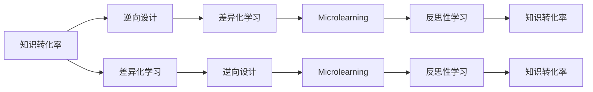

                 

# 如何打造高转化率的程序员知识课程

## 1. 背景介绍

在数字化转型的浪潮下，程序员作为技术开发的中坚力量，其技能水平直接关系到企业产品的成败。随着技术栈的不断更新迭代，企业对于程序员的技能要求也日益提高，这促使程序员必须不断学习新知识，适应新的技术趋势。然而，知识的学习与吸收过程并不总是高效的，特别是当知识复杂且抽象时，如何打造高转化率的程序员知识课程，成为了教育机构和企业关注的焦点。本文将从课程设计、内容呈现、学习管理等多个角度，探讨如何构建有效、易学的程序员知识课程。

## 2. 核心概念与联系

### 2.1 核心概念概述

为了更好地理解课程设计的原则和方法，我们将介绍几个核心概念：

- **知识转化率(Knowledge Conversion Rate)**：指学习者将课程内容转化为实际技能和能力的过程效率，反映了课程的有效性。
- **逆向设计(Backward Design)**：一种基于学习目标和结果的课程设计方法，强调从课程目标逆向设计教学活动，确保教学内容和活动能够有效实现目标。
- **差异化学习(Differentiated Learning)**：根据学生的不同需求和学习风格，设计个性化的学习路径和资源，满足多元化的学习需求。
- **微课(Microlearning)**：以短视频或互动模块的形式，提供小而精的知识片段，便于学习者快速吸收和应用。
- **反思性学习(Reflective Learning)**：在学习过程中，鼓励学生反思学习内容和自我评价，促进知识的内化和迁移。

### 2.2 核心概念原理和架构的 Mermaid 流程图



这个流程图展示了从知识转化率出发，通过逆向设计、差异化学习、微课和反思性学习等环节，最终促进知识转化的过程。

## 3. 核心算法原理 & 具体操作步骤

### 3.1 算法原理概述

高转化率的程序员知识课程设计，本质上是一种优化问题，旨在最大化知识转化率。课程设计者需要理解学习者的需求和学习行为，选择合适的内容和教学策略，设计能够有效促进知识转化的课程结构。

形式化地，假设课程设计为 $C$，学习者的学习行为为 $L$，知识转化率为 $K$。课程设计的目标是最小化学习者完成课程后知识转化率与预期目标之间的差距，即：

$$
\min_{C} |K(L, C) - K_{target}|
$$

其中 $K_{target}$ 为预设的知识转化率目标。

### 3.2 算法步骤详解

基于上述优化问题，高转化率的程序员知识课程设计可以分为以下几个关键步骤：

**Step 1: 明确课程目标**

- 确定课程的知识转化率目标。例如，期望学习者能够在课程结束后掌握特定的编程技能，或能够应用新学的算法于实际项目。
- 列出具体的学习目标，如掌握特定编程语言、理解某种算法原理等。

**Step 2: 逆向设计课程**

- 从最终的学习目标逆向设计课程内容。例如，若目标是掌握某种算法，先确定算法的基本概念、关键步骤和应用场景，再设计课程的各个模块。
- 设计具体的教学活动，如编程练习、案例分析、项目实践等，确保活动与学习目标对齐。

**Step 3: 差异化学习路径**

- 根据学生的不同背景和需求，设计个性化的学习路径。例如，为初学者设计基础模块，为进阶者设计高级模块，为特定行业应用设计专题模块。
- 提供丰富的资源和工具，如在线视频、代码库、讨论区等，支持学生自主学习和个性化需求。

**Step 4: 微课内容制作**

- 将课程内容拆分成小而精的微课，每段时长控制在5-10分钟，便于学习者快速吸收和应用。
- 使用动画、图解、代码演示等丰富的多媒体资源，提高课程的吸引力。

**Step 5: 反思性学习设计**

- 设计反思性任务，鼓励学生在学习过程中进行自我反思，如记录学习心得、解决实际问题等。
- 提供同伴反馈和教师指导，帮助学生理解学习内容，并应用到实际项目中。

**Step 6: 评估与优化**

- 使用学习分析工具，跟踪学生的学习进度和知识转化率，及时发现问题。
- 根据反馈数据，调整课程内容和教学策略，确保课程的有效性。

### 3.3 算法优缺点

高转化率的程序员知识课程设计方法具有以下优点：

1. **个性化需求满足**：通过差异化学习路径，满足不同背景和学习风格的学生需求，提升学习效果。
2. **高效知识吸收**：通过微课和反思性学习，将复杂知识拆分成小块，提高学习效率。
3. **应用导向明确**：逆向设计课程，确保学习目标与实际应用紧密结合，促进知识转化。

同时，该方法也存在以下局限性：

1. **设计复杂度**：课程设计需要深入理解学习者的需求和学习行为，对设计者的要求较高。
2. **资源投入**：差异化学习路径和微课制作需要大量的时间和资源，成本较高。
3. **效果评价难度**：知识转化率的多维性使其难以通过单一指标进行评估，需要综合多方面数据。

尽管如此，通过合理的课程设计，高转化率的程序员知识课程仍能有效提升学习者的技能水平，满足企业对人才的需求。

### 3.4 算法应用领域

高转化率的程序员知识课程设计方法不仅适用于企业培训，也广泛应用于在线教育平台、高校课程设计等场景。例如：

- 企业内训：针对特定技术栈和业务需求，设计个性化培训课程，提升员工技能。
- 在线教育：为不同水平的学习者提供差异化学习路径和微课，满足多样化的学习需求。
- 高校教学：结合学生的基础知识和职业规划，设计层次分明的课程结构，提升学生的学习效果。

## 4. 数学模型和公式 & 详细讲解 & 举例说明

### 4.1 数学模型构建

为了更严谨地描述课程设计问题，我们可以使用数学模型进行建模。假设课程包含 $n$ 个学习模块，每个模块的学习时间为 $t_i$，学习内容 $c_i$ 的复杂度为 $k_i$，学习者的学习效率为 $e$，知识转化率为 $K$。则课程设计的目标函数为：

$$
\min_{t_1, t_2, ..., t_n} \sum_{i=1}^{n} t_i \times (1 - K_i) 
$$

其中 $K_i = e^{-t_i/k_i}$，$K_i$ 为第 $i$ 个模块的学习后知识转化率。

### 4.2 公式推导过程

通过上述目标函数，我们可以计算出最优的学习时间分配，使得整体知识转化率最大化。具体的推导过程如下：

1. 计算每个模块的学习后知识转化率 $K_i = e^{-t_i/k_i}$。
2. 根据学习效率 $e$，计算每个模块的学习时间 $t_i$。
3. 代入目标函数，求解最优时间分配 $t_1, t_2, ..., t_n$。

### 4.3 案例分析与讲解

假设我们设计了一门Python编程课程，包含基础语法、面向对象编程、Web开发等模块。通过逆向设计，确定每个模块的学习目标和内容。根据学习者的背景和需求，设计差异化学习路径，如初级班、中级班和高级班。最后，将每个模块制作成5分钟的微课，并设计反思性学习任务。通过学习分析工具，跟踪学生的学习进度和知识转化率，根据反馈数据进行调整优化。

## 5. 项目实践：代码实例和详细解释说明

### 5.1 开发环境搭建

为了实现上述课程设计方法，我们需要搭建一个支持个性化学习和互动的教学平台。以下是Python开发环境搭建的步骤：

1. 安装Python：在Windows系统上安装Python 3.8或更高版本。
2. 创建虚拟环境：
```bash
python -m venv venv
source venv/Scripts/activate
```
3. 安装依赖库：
```bash
pip install Flask
pip install tensorflow
```

### 5.2 源代码详细实现

以下是使用Flask框架实现的课程管理系统的源代码实现：

```python
from flask import Flask, request, jsonify

app = Flask(__name__)

@app.route('/api/course', methods=['POST'])
def create_course():
    data = request.json
    # 处理课程创建请求，记录课程基本信息，如课程名称、学习模块、学习时间等
    # 将课程信息保存到数据库中
    return jsonify({'message': 'Course created successfully'})

@app.route('/api/student', methods=['POST'])
def enroll_student():
    data = request.json
    # 处理学生选课请求，根据学生背景和需求，提供个性化的学习路径
    # 记录学生选课信息，推送学习资源
    return jsonify({'message': 'Student enrolled successfully'})

@app.route('/api/module', methods=['POST'])
def add_module():
    data = request.json
    # 处理模块添加请求，根据课程设计，创建学习模块
    # 保存模块信息，并关联到课程中
    return jsonify({'message': 'Module added successfully'})

@app.route('/api/reflect', methods=['POST'])
def submit_reflection():
    data = request.json
    # 处理学生提交反思任务，记录反思内容，分析知识转化率
    # 根据反思结果，调整课程内容和教学策略
    return jsonify({'message': 'Reflection submitted successfully'})

if __name__ == '__main__':
    app.run(debug=True)
```

### 5.3 代码解读与分析

代码中，我们使用了Flask框架搭建了一个简单的课程管理系统，包含课程创建、学生选课、模块添加和反思任务提交等功能。这些功能通过API接口实现，便于与前端系统进行交互。通过记录学生的学习进度和反思内容，系统可以实时跟踪学生的学习效果，根据反馈数据进行调整优化。

### 5.4 运行结果展示

通过上述代码，我们实现了简单的课程管理系统。用户可以通过API接口创建课程、选课、添加模块和提交反思任务。以下是运行结果示例：

```bash
$ curl -X POST -H "Content-Type: application/json" -d '{"name": "Python Programming", "modules": ["Basic Syntax", "Object-Oriented Programming", "Web Development"], "enrollment_start": "2023-01-01", "enrollment_end": "2023-04-30"}' http://localhost:5000/api/course
{"message": "Course created successfully"}
$ curl -X POST -H "Content-Type: application/json" -d '{"course_id": 1, "student_id": 123, "start_date": "2023-02-01"}' http://localhost:5000/api/student
{"message": "Student enrolled successfully"}
$ curl -X POST -H "Content-Type: application/json" -d '{"name": "Web Development", "description": "Introduction to Web Development", "time": 5, "module_id": 3}' http://localhost:5000/api/module
{"message": "Module added successfully"}
$ curl -X POST -H "Content-Type: application/json" -d '{"module_id": 3, "content": "Reflect on the progress made in Web Development module"}' http://localhost:5000/api/reflect
{"message": "Reflection submitted successfully"}
```

## 6. 实际应用场景

### 6.1 在线教育平台

在线教育平台可以通过高转化率的程序员知识课程设计方法，提供个性化、互动性强的高质量课程。例如，Coursera、Udacity等平台，根据学生的学习进度和反馈，动态调整课程内容和教学策略，提升学习效果。

### 6.2 企业内训

企业内训是提升员工技能的重要手段。通过差异化学习路径和微课设计，企业内训能够满足不同级别和领域员工的学习需求，提升培训效果。例如，谷歌、亚马逊等科技巨头，通过内训课程提升员工技术水平，保持企业的竞争优势。

### 6.3 高校教学

高校教学中，高转化率的课程设计方法可以有效提升学生的学习效果。例如，MIT的OpenCourseWare平台，通过提供丰富的微课和学习资源，帮助全球学生高效学习。

## 7. 工具和资源推荐

### 7.1 学习资源推荐

为了帮助开发者掌握高转化率的课程设计方法，我们推荐以下学习资源：

1. **《教育技术：设计、开发与实施》**：该书系统介绍了教育技术的基本理论和实践方法，涵盖了课程设计、教学评估等内容。
2. **《翻转课堂：创新教学模式》**：该书介绍了翻转课堂的教学模式和实践经验，强调学生的主动学习和反思性学习。
3. **Coursera课程**：Coursera提供大量高质量的在线课程，涵盖编程、数据科学、人工智能等多个领域，适合自学和专业培训。
4. **Udacity纳米学位**：Udacity提供多个领域的纳米学位课程，包括机器学习、数据科学、人工智能等，提供互动式学习体验和项目实战机会。
5. **EdX MOOCs**：EdX提供来自全球顶尖大学的高质量在线课程，涵盖各个学科领域，帮助学生和专业人士提升知识和技能。

### 7.2 开发工具推荐

为了实现高转化率的课程设计方法，我们推荐以下开发工具：

1. **Flask**：Python的轻量级Web框架，适合搭建课程管理系统和API接口。
2. **Jupyter Notebook**：支持Python、R、MATLAB等语言的交互式编程环境，适合数据分析和课程设计中的交互式探索。
3. **GitHub**：代码托管平台，适合团队协作和版本控制。
4. **Kaggle**：数据科学竞赛平台，提供大量公开数据集和机器学习竞赛，适合数据科学学习和项目实战。
5. **Google Colab**：谷歌提供的在线Jupyter Notebook环境，免费提供GPU资源，适合机器学习和深度学习研究。

### 7.3 相关论文推荐

为了深入了解高转化率的课程设计方法，我们推荐以下相关论文：

1. **《基于逆向设计的在线课程设计研究》**：研究了基于逆向设计的在线课程设计方法，探讨如何从学习目标出发，设计有效的教学活动。
2. **《差异化学习路径的设计与实施》**：探讨了差异化学习路径的设计和实施方法，通过个性化学习资源和任务，提升学习效果。
3. **《微课设计原则与实践》**：介绍了微课设计的原则和实践方法，强调微课的简洁性和可重复性。
4. **《反思性学习理论与实践》**：研究了反思性学习的理论和实践方法，探讨了反思性学习对知识转化的影响。
5. **《机器学习课程设计与教学评估》**：介绍了机器学习课程的设计和教学评估方法，通过项目实战提升学生技能。

## 8. 总结：未来发展趋势与挑战

### 8.1 研究成果总结

本文通过系统梳理高转化率的程序员知识课程设计方法，探讨了从课程目标出发，逆向设计课程内容，差异化学习路径，微课制作和反思性学习的设计和实施，为程序员技能培训提供了全面的理论和方法。

### 8.2 未来发展趋势

展望未来，高转化率的课程设计方法将呈现以下几个发展趋势：

1. **技术智能化**：通过人工智能和机器学习技术，实现学习路径的个性化推荐，提升学习效果。
2. **数据驱动设计**：利用学习分析数据，动态调整课程内容和教学策略，提升课程设计的效果。
3. **跨平台集成**：将课程管理系统与多种平台集成，如社交媒体、在线论坛等，增强互动性和学习体验。
4. **全栈开发培训**：结合前后端技术，提供全栈开发培训课程，培养综合型技术人才。
5. **混合学习模式**：结合线上线下教学，提供灵活的学习模式，适应不同学习场景。

### 8.3 面临的挑战

尽管高转化率的课程设计方法在实践中取得了显著成效，但仍然面临以下挑战：

1. **数据隐私和安全**：在线教育平台需要保护学生的数据隐私，防止数据泄露和滥用。
2. **教学资源短缺**：高质量教学资源的开发和维护需要大量时间和人力，难以满足大规模培训需求。
3. **技术适应性**：学习者需要适应新工具和技术，特别是年轻学习者，可能存在技术接受度的问题。
4. **知识更新快**：技术栈不断更新，课程内容需要频繁更新和调整，以满足最新的技术要求。

### 8.4 研究展望

面对上述挑战，未来的研究需要在以下几个方面寻求新的突破：

1. **数据隐私保护**：开发数据加密和匿名化技术，保护学生数据隐私。
2. **教学资源共享**：通过开源社区和平台，共享高质量教学资源，降低开发成本。
3. **技术普及教育**：加强技术普及教育，提升学习者的技术接受度和适应性。
4. **知识更新机制**：建立动态知识更新机制，根据技术趋势，及时更新课程内容。

## 9. 附录：常见问题与解答

**Q1: 如何评估课程设计的效果？**

A: 课程设计的效果可以通过以下几个指标进行评估：
1. **学习进度跟踪**：记录学生完成各个学习模块的时间和进度。
2. **知识转化率**：评估学生学习后掌握的知识和技能水平，可以通过测试和项目评估等方式。
3. **反馈数据收集**：收集学生和教师的反馈数据，了解课程设计中的不足和改进点。
4. **学习行为分析**：分析学生在学习过程中的互动行为，了解学生的学习习惯和偏好。

**Q2: 如何设计差异化学习路径？**

A: 设计差异化学习路径需要考虑以下因素：
1. **学生背景**：根据学生的技术背景和学习目标，设计不同的学习路径。例如，初学者和高级用户可以采用不同的学习路径。
2. **学习风格**：考虑学生的学习风格和偏好，提供个性化的学习资源。例如，视觉学习者和听觉学习者可以采用不同的教学方式。
3. **学习目标**：根据学生的学习目标，设计不同的学习路径。例如，特定领域的专家和通用学习者可以采用不同的路径。

**Q3: 如何制作高质量的微课？**

A: 制作高质量的微课需要注意以下几点：
1. **简洁性**：微课时长应控制在5-10分钟，确保内容精炼。
2. **多媒体资源**：使用动画、图解、代码演示等丰富的多媒体资源，提高课程的吸引力。
3. **互动性**：增加互动环节，如提问、讨论等，增强学生的参与感。
4. **知识体系连贯**：确保微课内容连贯，便于学生理解和掌握。
5. **学习目标明确**：每段微课应有明确的学习目标，帮助学生理解课程内容。

---

作者：禅与计算机程序设计艺术 / Zen and the Art of Computer Programming

