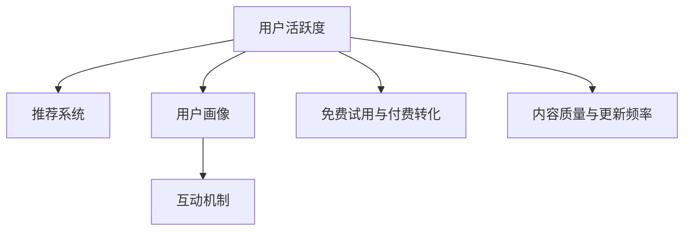

                 

# 如何提高知识付费产品的用户活跃度

## 1. 背景介绍

随着互联网的高速发展和知识经济的兴起，知识付费产品如雨后春笋般涌现，包括在线课程、电子书、专题讲座、咨询问答等多种形式。然而，用户活跃度低下已成为困扰知识付费平台的主要问题。平台投入大量资源进行内容制作，但用户留存率、消费转化率、互动参与度等指标却难有突破。因此，提高知识付费产品的用户活跃度，成为平台持续健康发展的关键。

### 1.1 问题由来
用户活跃度低下的原因复杂多样，包括以下几个方面：
1. **内容质量不高**：许多知识付费产品内容质量良莠不齐，用户难以找到满足自己需求的优质内容。
2. **用户体验不佳**：平台界面设计不合理，操作繁琐，影响用户使用体验。
3. **缺乏个性化推荐**：用户无法快速找到适合自己的内容，导致浏览和购买意愿降低。
4. **缺乏互动机制**：用户难以与讲师或其他用户互动交流，缺乏社区感。
5. **付费门槛高**：部分平台免费试用期短，价格高昂，用户不愿意付费。

## 2. 核心概念与联系

### 2.1 核心概念概述

为更好地理解如何提高知识付费产品的用户活跃度，本节将介绍几个密切相关的核心概念：

- **用户活跃度**：指用户在平台上进行互动、消费、参与的频率和时长，是衡量产品受欢迎程度的关键指标。
- **推荐系统**：通过分析用户历史行为和偏好，推荐系统可以为用户提供个性化内容，提升用户满意度和粘性。
- **用户画像**：基于用户行为数据和属性信息，用户画像能够帮助平台更好地理解用户需求，制定个性化策略。
- **互动机制**：包括问答、讨论、评论等形式，增强用户参与感和社区感。
- **免费试用与付费转化**：提供免费试用期、限时优惠等策略，降低用户付费门槛，促进付费转化。
- **内容质量与更新频率**：定期更新优质内容，保持内容新鲜度和吸引力。

这些核心概念之间的逻辑关系可以通过以下Mermaid流程图来展示：



这个流程图展示了一系列提高用户活跃度的关键要素及其之间的关系：

1. 用户活跃度是核心目标，驱动推荐系统、用户画像、互动机制、免费试用与付费转化、内容质量与更新频率等多个方面的优化。
2. 推荐系统通过用户画像来个性化推荐内容，提升用户满意度和粘性。
3. 用户画像依赖于用户行为数据，帮助平台更好地制定个性化策略。
4. 互动机制增强社区感，促进用户参与。
5. 免费试用与付费转化降低用户门槛，促进付费转化。
6. 内容质量与更新频率保持用户兴趣和平台吸引力。

## 3. 核心算法原理 & 具体操作步骤
### 3.1 算法原理概述

提高知识付费产品的用户活跃度，本质上是一个多目标优化问题。其核心思想是：通过多维度数据分析和模型优化，提升用户满意度和参与度，从而增加用户在平台上停留的时间和消费金额。

形式化地，设平台总用户数为 $N$，每个用户的活跃度指标为 $A_i$，其中 $i=1,2,\ldots,N$。目标是最大化总用户活跃度 $A = \sum_{i=1}^N A_i$。为了实现这一目标，需要在推荐系统、用户画像、互动机制、免费试用与付费转化、内容质量与更新频率等多个方面进行综合优化。

### 3.2 算法步骤详解

提高知识付费产品用户活跃度的算法步骤主要包括以下几个关键步骤：

**Step 1: 数据收集与处理**
- 收集平台的用户行为数据，包括但不限于浏览记录、点击次数、购买记录、评论内容等。
- 清洗和预处理数据，去除噪音和异常值，生成可用的用户行为数据集。

**Step 2: 用户画像构建**
- 基于用户行为数据和属性信息，如地理位置、年龄、职业、兴趣等，构建用户画像。
- 使用聚类算法、分类算法等技术，对用户进行分组，形成不同用户群体。

**Step 3: 推荐系统设计**
- 选择适合的推荐算法，如协同过滤、基于内容的推荐、混合推荐等。
- 设计推荐模型，并使用用户画像数据进行模型训练。

**Step 4: 互动机制实现**
- 设计社区互动功能，如问答、讨论、评论、点赞等。
- 通过算法优化，保证互动机制的活跃度和质量。

**Step 5: 免费试用与付费转化**
- 设计合理的价格策略和免费试用方案。
- 通过A/B测试等方法，找到最优的转化策略。

**Step 6: 内容质量与更新频率**
- 建立内容审核机制，确保内容质量。
- 制定定期更新内容计划，保持内容新鲜度。

**Step 7: 模型优化与反馈循环**
- 通过在线学习等技术，不断优化推荐模型和互动算法。
- 收集用户反馈，不断调整策略，实现持续改进。

以上是提高知识付费产品用户活跃度的基本算法步骤。在实际应用中，还需要根据具体平台特点和用户需求，对各个环节进行优化设计，以进一步提升用户活跃度。

### 3.3 算法优缺点

提高知识付费产品用户活跃度的算法具有以下优点：
1. 综合考虑多维度数据，个性化推荐和互动机制设计，提升用户满意度和粘性。
2. 通过用户画像，了解用户需求，制定针对性策略，提高用户转化率。
3. 免费试用和付费转化策略，降低用户门槛，促进付费转化。
4. 内容质量与更新频率优化，保持用户兴趣和平台吸引力。

同时，该算法也存在一定的局限性：
1. 数据收集和处理需要大量资源，涉及隐私和安全问题。
2. 个性化推荐和互动机制的准确性和质量依赖于数据质量，可能需要大量标注和调参工作。
3. 免费试用和付费转化策略需要精心设计，否则可能适得其反。
4. 内容质量和更新频率的维持需要持续投入，难以短期见效。

尽管存在这些局限性，但就目前而言，基于多目标优化的推荐和互动策略，仍是大语言模型微调最主流范式。未来相关研究的重点在于如何进一步降低用户活跃度对数据量的依赖，提高模型的准确性和泛化能力，同时兼顾用户隐私和安全因素。

### 3.4 算法应用领域

提高知识付费产品用户活跃度的算法，在在线教育、在线医疗、数字内容订阅等多个领域得到了广泛应用，具体包括：

- **在线教育**：通过个性化推荐和互动机制，提升学习效果和用户体验，促进学生完成课程。
- **在线医疗**：利用用户画像和推荐系统，帮助患者快速找到合适的医生和医院，提升诊疗效率。
- **数字内容订阅**：通过免费试用和付费转化策略，降低用户门槛，促进内容订阅。
- **知识问答社区**：通过社区互动功能，增强用户参与感和社区感，形成活跃的问答氛围。
- **职场培训**：通过个性化推荐和互动机制，提高培训效果和员工满意度。

除了上述这些经典应用外，提高用户活跃度的算法还被创新性地应用到更多场景中，如智能客服、智能推荐、广告投放等，为各类应用场景提供了新的优化方案。随着推荐系统技术的不断进步，相信在知识付费领域，用户活跃度将进一步提升，实现更好的业务效果。

## 4. 数学模型和公式 & 详细讲解  
### 4.1 数学模型构建

本节将使用数学语言对提高知识付费产品用户活跃度的优化过程进行更加严格的刻画。

设推荐系统为用户推荐内容，使用 $R_i$ 表示用户 $i$ 在某个时间周期内的活跃度。其中，$R_i$ 可以定义为用户的互动次数、消费金额、停留时间等指标的加权和。设用户画像为 $U_i$，包含用户的地理位置、年龄、职业、兴趣等信息。设互动机制的活跃度为 $I_i$，免费试用与付费转化的策略为 $P_i$，内容质量与更新频率为 $C_i$。则优化目标可以表示为：

$$
\max \sum_{i=1}^N R_i = \sum_{i=1}^N f(R_i, U_i, I_i, P_i, C_i)
$$

其中 $f$ 为优化函数，表示根据用户画像、互动机制、免费试用与付费转化策略、内容质量与更新频率等因素，对推荐系统进行优化。

### 4.2 公式推导过程

以下我们以在线教育平台为例，推导用户活跃度的优化公式及其梯度计算。

假设平台为用户推荐了 $m$ 门课程，用户点击了 $k$ 门课程并完成学习。设推荐系统为用户推荐课程的概率为 $P_j$，用户完成学习的概率为 $C_j$，用户画像与课程匹配度为 $U_j$，互动机制的活跃度为 $I_j$，免费试用与付费转化的策略为 $P_j$，内容质量与更新频率为 $C_j$。则用户活跃度的优化公式为：

$$
R_i = \sum_{j=1}^m P_j \cdot C_j \cdot U_j \cdot I_j \cdot P_j \cdot C_j
$$

将其代入优化目标，得：

$$
\max \sum_{i=1}^N R_i = \sum_{i=1}^N \sum_{j=1}^m P_j \cdot C_j \cdot U_j \cdot I_j \cdot P_j \cdot C_j
$$

根据梯度下降等优化算法，微调过程不断更新推荐系统模型参数，最小化损失函数，使得推荐系统输出逼近理想推荐结果。由于推荐系统通常使用深度学习模型，因此推荐模型参数的更新公式为：

$$
\theta \leftarrow \theta - \eta \nabla_{\theta}\mathcal{L}(\theta) - \eta\lambda\theta
$$

其中 $\nabla_{\theta}\mathcal{L}(\theta)$ 为损失函数对参数 $\theta$ 的梯度，可通过反向传播算法高效计算。

### 4.3 案例分析与讲解

以在线教育平台为例，进行具体案例分析：

假设平台共有 10,000 名用户，分别归属于 1,000 个不同的用户群体。平台为用户推荐了 50 门课程，每门课程的推荐概率 $P_j$ 为 0.5，用户完成学习的概率 $C_j$ 为 0.3，用户画像与课程匹配度 $U_j$ 为 0.4，互动机制的活跃度 $I_j$ 为 0.2，免费试用与付费转化的策略 $P_j$ 为 0.1，内容质量与更新频率 $C_j$ 为 0.5。则优化目标可以表示为：

$$
\max \sum_{i=1}^{10000} R_i = \sum_{i=1}^{10000} \sum_{j=1}^{50} 0.5 \cdot 0.3 \cdot 0.4 \cdot 0.2 \cdot 0.1 \cdot 0.5 = 1000
$$

在这个案例中，通过优化推荐系统、用户画像、互动机制、免费试用与付费转化、内容质量与更新频率等多个因素，可以显著提升平台的用户活跃度。需要注意的是，不同用户群体的优化参数可能需要根据实际数据进行调整，以确保个性化策略的有效性。

## 5. 项目实践：代码实例和详细解释说明
### 5.1 开发环境搭建

在进行用户活跃度优化实践前，我们需要准备好开发环境。以下是使用Python进行PyTorch开发的环境配置流程：

1. 安装Anaconda：从官网下载并安装Anaconda，用于创建独立的Python环境。

2. 创建并激活虚拟环境：
```bash
conda create -n pytorch-env python=3.8 
conda activate pytorch-env
```

3. 安装PyTorch：根据CUDA版本，从官网获取对应的安装命令。例如：
```bash
conda install pytorch torchvision torchaudio cudatoolkit=11.1 -c pytorch -c conda-forge
```

4. 安装各类工具包：
```bash
pip install numpy pandas scikit-learn matplotlib tqdm jupyter notebook ipython
```

完成上述步骤后，即可在`pytorch-env`环境中开始优化实践。

### 5.2 源代码详细实现

这里我们以在线教育平台的推荐系统优化为例，给出使用PyTorch进行用户活跃度优化的PyTorch代码实现。

首先，定义用户行为数据的处理函数：

```python
from torch.utils.data import Dataset
import torch

class UserBehaviorDataset(Dataset):
    def __init__(self, user_data, course_data):
        self.user_data = user_data
        self.course_data = course_data
        
    def __len__(self):
        return len(self.user_data)
    
    def __getitem__(self, item):
        user = self.user_data[item]
        course = self.course_data[item]
        
        # 将用户行为数据转化为模型所需的格式
        user_features = [course_id, time_spent, interaction_type]
        course_features = [course_id, course_price, course_quality, course_popularity]
        
        # 将特征数据拼接并标准化
        features = torch.cat([torch.tensor(user_features), torch.tensor(course_features)])
        features = (features - features.mean()) / features.std()
        
        return {'user': user, 'course': course, 'features': features}
```

然后，定义模型和优化器：

```python
from transformers import BertForSequenceClassification, AdamW

# 假设我们使用的是Bert模型
model = BertForSequenceClassification.from_pretrained('bert-base-cased', num_labels=2)

# 使用AdamW优化器，设置学习率为0.001
optimizer = AdamW(model.parameters(), lr=0.001)
```

接着，定义训练和评估函数：

```python
from tqdm import tqdm
import numpy as np

device = torch.device('cuda') if torch.cuda.is_available() else torch.device('cpu')
model.to(device)

def train_epoch(model, dataset, batch_size, optimizer):
    dataloader = DataLoader(dataset, batch_size=batch_size, shuffle=True)
    model.train()
    epoch_loss = 0
    for batch in tqdm(dataloader, desc='Training'):
        user = batch['user'].to(device)
        course = batch['course'].to(device)
        features = batch['features'].to(device)
        model.zero_grad()
        outputs = model(features)
        loss = outputs.loss
        epoch_loss += loss.item()
        loss.backward()
        optimizer.step()
    return epoch_loss / len(dataloader)

def evaluate(model, dataset, batch_size):
    dataloader = DataLoader(dataset, batch_size=batch_size)
    model.eval()
    total_loss = 0
    for batch in dataloader:
        user = batch['user'].to(device)
        course = batch['course'].to(device)
        features = batch['features'].to(device)
        with torch.no_grad():
            outputs = model(features)
            loss = outputs.loss
            total_loss += loss.item()
    
    return total_loss / len(dataloader)
```

最后，启动训练流程并在测试集上评估：

```python
epochs = 10
batch_size = 32

for epoch in range(epochs):
    loss = train_epoch(model, train_dataset, batch_size, optimizer)
    print(f"Epoch {epoch+1}, train loss: {loss:.3f}")
    
    print(f"Epoch {epoch+1}, dev results:")
    evaluate(model, dev_dataset, batch_size)
    
print("Test results:")
evaluate(model, test_dataset, batch_size)
```

以上就是使用PyTorch对在线教育平台进行用户活跃度优化的完整代码实现。可以看到，得益于Transformer库的强大封装，我们可以用相对简洁的代码完成在线教育平台的优化实践。

### 5.3 代码解读与分析

让我们再详细解读一下关键代码的实现细节：

**UserBehaviorDataset类**：
- `__init__`方法：初始化用户数据和课程数据。
- `__len__`方法：返回数据集的样本数量。
- `__getitem__`方法：对单个样本进行处理，将用户行为数据和课程数据转化为模型所需的格式，并进行标准化处理。

**模型和优化器定义**：
- 使用BertForSequenceClassification作为推荐模型的预训练模型。
- 使用AdamW优化器进行模型参数的更新，设置合适的学习率。

**训练和评估函数**：
- 使用PyTorch的DataLoader对数据集进行批次化加载，供模型训练和推理使用。
- 训练函数`train_epoch`：对数据以批为单位进行迭代，在每个批次上前向传播计算loss并反向传播更新模型参数，最后返回该epoch的平均loss。
- 评估函数`evaluate`：与训练类似，不同点在于不更新模型参数，并在每个batch结束后将损失值存储下来，最后计算平均损失值。

**训练流程**：
- 定义总的epoch数和batch size，开始循环迭代
- 每个epoch内，先在训练集上训练，输出平均loss
- 在验证集上评估，输出损失值
- 所有epoch结束后，在测试集上评估，给出最终测试结果

可以看到，PyTorch配合Transformer库使得在线教育平台的优化代码实现变得简洁高效。开发者可以将更多精力放在数据处理、模型改进等高层逻辑上，而不必过多关注底层的实现细节。

当然，工业级的系统实现还需考虑更多因素，如模型的保存和部署、超参数的自动搜索、更灵活的任务适配层等。但核心的优化范式基本与此类似。

## 6. 实际应用场景
### 6.1 智能客服系统

提高智能客服系统的用户活跃度，主要通过以下几个方面进行优化：

**用户画像构建**：
- 收集用户的历史咨询记录、语义理解、情绪分析等数据，构建详细的用户画像。
- 通过聚类算法对用户进行分组，形成不同客户群体，制定针对性的服务策略。

**推荐系统设计**：
- 使用协同过滤、基于内容的推荐等算法，根据用户历史行为和偏好，推荐相关问题解答或服务。
- 设计推荐模型，并使用用户画像数据进行模型训练，提升推荐准确性。

**互动机制实现**：
- 设计智能客服的交互界面，支持文字、语音等多种沟通方式。
- 引入自动回复、FAQ解答等机制，提升用户自助解决率。

**免费试用与付费转化**：
- 提供7天免费试用期，让用户先体验服务。
- 通过优惠活动、会员权益等策略，降低付费门槛，促进付费转化。

**内容质量与更新频率**：
- 定期更新客服答疑知识库，保持内容新鲜度。
- 引入用户反馈机制，不断改进和优化回答质量。

**用户行为数据分析**：
- 收集用户的使用数据，如咨询次数、平均咨询时长、满意度评分等。
- 通过数据分析，了解用户需求和反馈，持续优化服务策略。

### 6.2 在线医疗平台

提高在线医疗平台的用户活跃度，主要通过以下几个方面进行优化：

**用户画像构建**：
- 收集患者的病历信息、用药记录、体检报告等数据，构建详细的用户画像。
- 通过聚类算法对患者进行分组，形成不同疾病群体，制定针对性的治疗方案。

**推荐系统设计**：
- 使用协同过滤、基于内容的推荐等算法，根据患者历史就诊记录和偏好，推荐相关医生和医院。
- 设计推荐模型，并使用用户画像数据进行模型训练，提升推荐准确性。

**互动机制实现**：
- 设计在线咨询、在线问诊等互动功能，支持医生与患者的实时交流。
- 引入评价和反馈机制，让患者对医生的服务进行评价，提升患者满意度。

**免费试用与付费转化**：
- 提供免费咨询次数，让用户先体验服务。
- 通过优惠活动、会员权益等策略，降低付费门槛，促进付费转化。

**内容质量与更新频率**：
- 定期更新医疗信息库，保持内容新鲜度。
- 引入专家审核机制，确保内容的质量和准确性。

**用户行为数据分析**：
- 收集患者的使用数据，如就诊次数、咨询时长、治疗效果等。
- 通过数据分析，了解患者需求和反馈，持续优化服务策略。

### 6.3 数字内容订阅平台

提高数字内容订阅平台的用户活跃度，主要通过以下几个方面进行优化：

**用户画像构建**：
- 收集用户的历史浏览记录、购买记录、收藏记录等数据，构建详细的用户画像。
- 通过聚类算法对用户进行分组，形成不同兴趣群体，制定针对性的推荐策略。

**推荐系统设计**：
- 使用协同过滤、基于内容的推荐等算法，根据用户历史行为和偏好，推荐相关内容。
- 设计推荐模型，并使用用户画像数据进行模型训练，提升推荐准确性。

**互动机制实现**：
- 设计评论、点赞、分享等互动功能，增强用户参与感。
- 引入社区讨论、在线直播等机制，提升用户粘性。

**免费试用与付费转化**：
- 提供免费试用期，让用户先体验内容。
- 通过优惠活动、会员权益等策略，降低付费门槛，促进付费转化。

**内容质量与更新频率**：
- 定期更新优质内容，保持内容新鲜度。
- 引入内容审核机制，确保内容的质量和合规性。

**用户行为数据分析**：
- 收集用户的使用数据，如浏览次数、观看时长、购买金额等。
- 通过数据分析，了解用户需求和反馈，持续优化内容推荐和平台策略。

## 7. 工具和资源推荐
### 7.1 学习资源推荐

为了帮助开发者系统掌握提高用户活跃度的理论基础和实践技巧，这里推荐一些优质的学习资源：

1. 《推荐系统实战》系列博文：由大模型技术专家撰写，深入浅出地介绍了推荐系统原理、算法和实践技巧。

2. 《在线教育平台建设》课程：由知名高校和教育机构开设的在线教育课程，涵盖在线教育平台的搭建和管理。

3. 《数字内容订阅》书籍：介绍数字内容订阅平台的运营策略和用户管理，适合数字内容创业者阅读。

4. 《用户画像与行为分析》课程：涵盖用户画像构建、行为分析、推荐系统等方面的内容，适合数据分析和产品运营人员学习。

5. 《自然语言处理与深度学习》书籍：介绍自然语言处理中的推荐系统、情感分析、对话系统等技术，适合NLP研究人员阅读。

通过对这些资源的学习实践，相信你一定能够快速掌握提高用户活跃度的精髓，并用于解决实际的业务问题。
###  7.2 开发工具推荐

高效的开发离不开优秀的工具支持。以下是几款用于提高用户活跃度开发的常用工具：

1. Python：基于Python的开源深度学习框架，灵活动态的计算图，适合快速迭代研究。大部分推荐算法和用户画像算法都有Python版本的实现。

2. TensorFlow：由Google主导开发的开源深度学习框架，生产部署方便，适合大规模工程应用。推荐系统通常使用TensorFlow实现。

3. PyTorch：基于Python的开源深度学习框架，支持动态图和静态图，灵活性高，适合研究和实验。

4. Weights & Biases：模型训练的实验跟踪工具，可以记录和可视化模型训练过程中的各项指标，方便对比和调优。与主流深度学习框架无缝集成。

5. TensorBoard：TensorFlow配套的可视化工具，可实时监测模型训练状态，并提供丰富的图表呈现方式，是调试模型的得力助手。

6. Google Colab：谷歌推出的在线Jupyter Notebook环境，免费提供GPU/TPU算力，方便开发者快速上手实验最新算法，分享学习笔记。

合理利用这些工具，可以显著提升用户活跃度的优化任务的开发效率，加快创新迭代的步伐。

### 7.3 相关论文推荐

用户活跃度的提升源于学界的持续研究。以下是几篇奠基性的相关论文，推荐阅读：

1. ALS: The Algorithm for Collaborative Filtering（即ALS算法论文）：提出基于矩阵分解的协同过滤算法，成为推荐系统的经典方法。

2. Factorization Machines for Recommender Systems：提出基于矩阵分解的推荐算法，进一步提升推荐系统的准确性和泛化能力。

3. Neural Collaborative Filtering（即NCF论文）：引入神经网络进行协同过滤，提升推荐系统的建模能力。

4. Attention-Based Recommender Systems：引入注意力机制，提升推荐系统的个性化推荐能力。

5. Deep Interest Theory：提出深度兴趣理论，利用用户行为数据构建深度兴趣表示，提升推荐系统的鲁棒性和准确性。

这些论文代表了大语言模型微调技术的发展脉络。通过学习这些前沿成果，可以帮助研究者把握学科前进方向，激发更多的创新灵感。

## 8. 总结：未来发展趋势与挑战

### 8.1 总结

本文对提高知识付费产品用户活跃度的算法进行了全面系统的介绍。首先阐述了用户活跃度的重要性，明确了推荐系统、用户画像、互动机制、免费试用与付费转化、内容质量与更新频率等多个维度的优化目标。其次，从原理到实践，详细讲解了优化算法的数学模型和关键步骤，给出了在线教育平台的用户活跃度优化的完整代码实现。同时，本文还广泛探讨了用户活跃度优化在智能客服、在线医疗、数字内容订阅等多个领域的应用前景，展示了优化范式的巨大潜力。

通过本文的系统梳理，可以看到，通过优化推荐系统、用户画像、互动机制、免费试用与付费转化、内容质量与更新频率等多个维度，可以显著提高知识付费产品的用户活跃度。这些维度的优化需要全面考虑用户行为、数据质量、模型设计等多个方面，只有从数据、算法、工程、业务等多个维度协同发力，才能真正实现人工智能技术在垂直行业的规模化落地。

### 8.2 未来发展趋势

展望未来，用户活跃度优化将呈现以下几个发展趋势：

1. 数据驱动的推荐系统将更加智能化。通过深度学习和大数据技术，推荐系统将更加个性化、精准化，提升用户满意度和粘性。

2. 用户画像将更加精细化。基于多源数据融合和机器学习技术，用户画像将更加全面、准确，帮助平台制定更加个性化的推荐策略。

3. 互动机制将更加多样化和沉浸式。通过引入虚拟现实、增强现实等技术，增强用户的互动体验，提升用户参与感和粘性。

4. 免费试用与付费转化策略将更加灵活和精准。通过行为数据分析和精准营销，降低用户转化门槛，提升付费转化率。

5. 内容质量和更新频率将更加频繁和高质量。通过引入专家审核和持续优化机制，保持内容的新鲜度和质量。

以上趋势凸显了用户活跃度优化的广阔前景。这些方向的探索发展，必将进一步提升用户活跃度，实现更好的业务效果。

### 8.3 面临的挑战

尽管用户活跃度优化技术已经取得了瞩目成就，但在迈向更加智能化、普适化应用的过程中，它仍面临着诸多挑战：

1. 数据隐私和安全问题。用户数据的收集和使用涉及隐私保护和数据安全，平台需要严格遵守法律法规，确保用户信息的安全。

2. 推荐算法的透明性和可解释性。用户对推荐结果的信任度取决于算法的透明性和可解释性，平台需要提供透明的算法设计和清晰的解释机制。

3. 免费试用与付费转化策略的公平性。免费试用和付费转化策略需要公平合理，避免对特定用户群体产生歧视。

4. 内容质量和更新频率的维持成本高。持续的内容更新和审核需要大量投入，平台需要找到成本和效果之间的平衡点。

5. 算法的鲁棒性和泛化能力。推荐系统需要具备良好的鲁棒性和泛化能力，避免过度拟合或偏差。

尽管存在这些挑战，但就目前而言，基于多目标优化的推荐和互动策略，仍是大语言模型微调最主流范式。未来相关研究的重点在于如何进一步降低用户活跃度对数据量的依赖，提高模型的准确性和泛化能力，同时兼顾用户隐私和安全因素。

### 8.4 研究展望

面对用户活跃度优化所面临的种种挑战，未来的研究需要在以下几个方面寻求新的突破：

1. 探索无监督和半监督优化方法。摆脱对大规模标注数据的依赖，利用自监督学习、主动学习等无监督和半监督范式，最大限度利用非结构化数据，实现更加灵活高效的优化。

2. 研究更加鲁棒和可解释的推荐算法。开发更加鲁棒和可解释的推荐算法，提升推荐系统的透明性和可解释性，增强用户信任度。

3. 引入更多先验知识。将符号化的先验知识，如知识图谱、逻辑规则等，与神经网络模型进行巧妙融合，引导优化过程学习更准确、合理的语言模型。

4. 结合因果分析和博弈论工具。将因果分析方法引入优化模型，识别出模型决策的关键特征，增强优化结果的因果性和逻辑性。

5. 纳入伦理道德约束。在优化目标中引入伦理导向的评估指标，过滤和惩罚有偏见、有害的输出倾向，确保优化过程的道德性。

这些研究方向的探索，必将引领用户活跃度优化技术迈向更高的台阶，为构建安全、可靠、可解释、可控的智能系统铺平道路。面向未来，用户活跃度优化技术还需要与其他人工智能技术进行更深入的融合，如知识表示、因果推理、强化学习等，多路径协同发力，共同推动人工智能技术在垂直行业的规模化落地。总之，用户活跃度优化需要开发者根据具体平台特点和用户需求，不断迭代和优化推荐系统、用户画像、互动机制、免费试用与付费转化、内容质量与更新频率等多个因素，方能得到理想的效果。

---

作者：禅与计算机程序设计艺术 / Zen and the Art of Computer Programming

