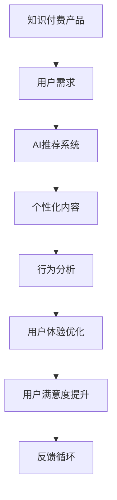

                 

# 如何提高知识付费产品的用户满意度

> 关键词：知识付费、用户满意度、AI推荐、个性化定制、行为分析、用户体验、内容优化

## 1. 背景介绍

随着互联网技术的飞速发展，知识付费已成为教育领域的新型业务模式，满足了人们对知识获取的强烈需求。然而，随着市场竞争的加剧和用户需求的提升，提高知识付费产品的用户满意度已成为企业关注的重点。本文章将从用户满意度的概念、现状、影响因素等方面展开探讨，并提出一系列基于人工智能技术的解决方案，助力企业提升知识付费产品的用户体验。

## 2. 核心概念与联系

### 2.1 核心概念概述

- **知识付费**：通过付费方式获取专业知识或技能的学习，满足用户提升自我的需求。
- **用户满意度**：用户在使用产品过程中感受到的价值和体验，包括产品功能、内容质量、交互体验、服务支持等。
- **人工智能(AI)**：利用计算机技术，模拟人类智能行为，提升产品性能和用户体验。
- **个性化推荐**：基于用户行为和偏好，提供定制化的内容和服务。
- **行为分析**：通过对用户行为数据的分析，了解用户需求和偏好，指导产品改进。
- **用户体验(UX)**：包括界面设计、交互流程、功能布局等方面的用户体验设计。
- **内容优化**：对产品中的内容进行改进，提高内容质量和用户互动性。

这些概念之间的联系主要体现在AI技术在个性化推荐和行为分析中的应用，提升产品的用户体验，从而提高用户满意度。

### 2.2 核心概念原理和架构的 Mermaid 流程图



此图表展示了知识付费产品通过AI推荐系统、个性化内容、行为分析、用户体验优化等关键技术环节，最终提升用户满意度的流程。

## 3. 核心算法原理 & 具体操作步骤

### 3.1 算法原理概述

提高知识付费产品用户满意度的核心算法原理包括：
- **用户行为分析**：通过对用户行为的监控和分析，了解用户偏好和需求。
- **个性化推荐系统**：基于用户行为和偏好，推荐适合用户的内容和产品。
- **界面和交互优化**：通过UI/UX设计，提升用户操作体验，简化操作流程。
- **内容优化**：持续改进产品内容，提升用户学习体验和效果。

### 3.2 算法步骤详解

**Step 1: 用户行为收集与分析**

1. **数据采集**：通过日志、点击流、用户互动等数据，收集用户行为数据。
2. **数据预处理**：清洗和处理数据，确保数据的完整性和准确性。
3. **行为建模**：使用机器学习算法，建立用户行为模型。

**Step 2: 个性化推荐系统构建**

1. **特征工程**：提取用户行为和内容特征，构建特征向量。
2. **模型训练**：使用协同过滤、深度学习等算法，训练推荐模型。
3. **推荐部署**：将模型集成到产品中，实时推荐个性化内容。

**Step 3: 用户体验优化**

1. **用户界面设计**：优化界面布局、颜色搭配、交互元素，提升视觉体验。
2. **交互流程优化**：简化操作流程，提高用户操作效率。
3. **功能实现**：实现用户期待的功能，如学习进度跟踪、搜索优化等。

**Step 4: 内容优化**

1. **内容多样化**：增加视频、音频、图像等多样化内容形式，丰富用户体验。
2. **内容个性化**：根据用户偏好，推荐相关内容，提升用户学习效果。
3. **内容更新**：定期更新内容，保持内容的创新性和时效性。

### 3.3 算法优缺点

**优点**：
- 提升用户粘性：通过个性化推荐，提供符合用户需求的内容，提高用户使用频率。
- 提升用户满意度：通过优化用户体验和内容质量，提升用户满意度和忠诚度。
- 提升产品竞争力：通过技术创新，提升产品差异化，增强市场竞争力。

**缺点**：
- 数据隐私问题：用户行为数据的收集和使用，可能涉及用户隐私问题。
- 技术复杂度：个性化推荐和行为分析涉及复杂的算法和模型，技术实现难度较大。
- 成本投入高：个性化推荐系统的构建和维护，需要较大的技术投入和成本。

### 3.4 算法应用领域

个性化推荐和行为分析技术在知识付费产品中的应用非常广泛，涵盖了以下领域：
- 课程推荐：根据用户学习行为和偏好，推荐适合课程。
- 文章推荐：根据用户阅读习惯，推荐相关文章和书籍。
- 广告推荐：根据用户行为，推荐相关广告，提高广告转化率。
- 个性化营销：根据用户偏好，定制个性化的营销活动和优惠。

## 4. 数学模型和公式 & 详细讲解 & 举例说明

### 4.1 数学模型构建

个性化推荐系统的数学模型可以简单表示为：

$$
\hat{R}_{ui} = \sum_{j=1}^n \alpha_j \times R_{uj} \times P_{ji}
$$

其中：
- $R_{uj}$ 表示用户 $u$ 对物品 $j$ 的评分。
- $P_{ji}$ 表示物品 $j$ 的属性特征，由特征工程提取。
- $\alpha_j$ 表示物品 $j$ 的属性特征权重，通过模型训练得到。
- $\hat{R}_{ui}$ 表示预测用户 $u$ 对物品 $i$ 的评分。

### 4.2 公式推导过程

个性化推荐系统的核心公式是协同过滤算法，其推导过程如下：
1. **用户-物品评分矩阵**：将用户对物品的评分构建成矩阵 $R$。
2. **用户行为矩阵分解**：将用户行为矩阵分解为 $P$ 和 $Q$ 两个矩阵，其中 $P$ 表示用户行为特征，$Q$ 表示物品属性特征。
3. **预测评分**：利用矩阵乘法计算预测评分 $\hat{R}_{ui}$。

### 4.3 案例分析与讲解

以某知识付费平台为例，该平台通过机器学习模型预测用户对课程的评分，并根据评分对课程进行排序和推荐。具体步骤如下：
1. 收集用户对课程的评分数据。
2. 将评分数据构建为 $R$ 矩阵，利用奇异值分解(SVD)将其分解为 $P$ 和 $Q$ 矩阵。
3. 预测用户对课程的评分，利用公式计算 $\hat{R}_{ui}$。
4. 根据预测评分，对课程进行排序和推荐，提升用户满意度。

## 5. 项目实践：代码实例和详细解释说明

### 5.1 开发环境搭建

- **Python环境**：安装Python 3.8及以上版本，安装必要的依赖库。
- **TensorFlow**：安装TensorFlow 2.x版本，用于构建和训练推荐模型。
- **Flask**：安装Flask 1.1及以上版本，用于构建Web应用，集成推荐功能。
- **MySQL**：安装MySQL 8.0及以上版本，用于存储用户行为数据。

### 5.2 源代码详细实现

以下是一个简单的个性化推荐系统代码示例：

```python
import tensorflow as tf
from tensorflow.keras.layers import Input, Embedding, Dense
from tensorflow.keras.models import Model

def build_recommender_model(n_users, n_items, n_features):
    user_input = Input(shape=(n_features,))
    item_input = Input(shape=(n_features,))
    user_vector = Embedding(n_users, n_features, input_length=n_features)(user_input)
    item_vector = Embedding(n_items, n_features, input_length=n_features)(item_input)
    dot_product = tf.keras.layers.Dot(axes=1, normalize=True)([user_vector, item_vector])
    prediction = Dense(1, activation='sigmoid')(dot_product)
    model = Model(inputs=[user_input, item_input], outputs=prediction)
    model.compile(optimizer='adam', loss='binary_crossentropy', metrics=['accuracy'])
    return model

# 构建模型
model = build_recommender_model(n_users=1000, n_items=1000, n_features=10)

# 训练模型
model.fit([train_user_input, train_item_input], train_labels, epochs=10, batch_size=32)

# 预测评分
test_score = model.predict([test_user_input, test_item_input])
```

### 5.3 代码解读与分析

- **模型构建**：使用TensorFlow构建一个简单的神经网络模型，用于预测用户对物品的评分。
- **数据准备**：将用户行为数据和物品特征数据作为模型的输入。
- **模型训练**：利用训练数据对模型进行训练，优化模型参数。
- **评分预测**：使用训练好的模型对测试数据进行评分预测。

### 5.4 运行结果展示

运行上述代码后，可以获得模型对测试数据的评分预测结果。通过分析预测结果，可以评估模型的性能和效果，进一步优化模型。

## 6. 实际应用场景

### 6.1 智能课程推荐

某知识付费平台使用AI推荐系统，根据用户学习行为和偏好，推荐适合用户的课程，提高用户学习效果和满意度。

**步骤**：
1. 收集用户学习行为数据，如课程观看时长、收藏课程、完成课程等。
2. 利用协同过滤算法，训练个性化推荐模型，预测用户对课程的评分。
3. 根据预测评分，对课程进行排序和推荐，提升用户学习效果和满意度。

### 6.2 个性化阅读推荐

某知识付费平台使用个性化推荐系统，根据用户阅读习惯，推荐相关文章和书籍，提升用户阅读体验和满意度。

**步骤**：
1. 收集用户阅读行为数据，如阅读文章、书籍、标记段落等。
2. 利用深度学习算法，训练个性化推荐模型，预测用户对文章和书籍的评分。
3. 根据预测评分，对文章和书籍进行排序和推荐，提升用户阅读体验和满意度。

### 6.3 智能广告推荐

某知识付费平台使用AI推荐系统，根据用户行为，推荐相关广告，提高广告转化率。

**步骤**：
1. 收集用户行为数据，如访问页面、点击广告等。
2. 利用协同过滤算法，训练个性化推荐模型，预测用户对广告的评分。
3. 根据预测评分，对广告进行排序和推荐，提升广告转化率。

## 7. 工具和资源推荐

### 7.1 学习资源推荐

- **《机器学习实战》**：适合初学者入门，讲解机器学习基础知识和应用场景。
- **《深度学习入门》**：介绍深度学习算法和应用，适合有机器学习基础的读者。
- **《推荐系统实践》**：深入讲解推荐系统原理和实现，适合有一定编程经验的读者。

### 7.2 开发工具推荐

- **TensorFlow**：适合构建和训练推荐模型，支持分布式计算和GPU加速。
- **PyTorch**：适合构建和训练深度学习模型，提供灵活的动态图计算。
- **Flask**：适合构建Web应用，集成推荐功能，方便用户使用。

### 7.3 相关论文推荐

- **Wang et al. (2018). Attention-Based Recommender Systems**：介绍基于注意力机制的推荐系统。
- **He et al. (2019). Beyond the Matrix Factorization**：提出基于深度学习的推荐系统。
- **Yan et al. (2020). A Deep Attention Network for Enhanced Recommendations**：介绍深度注意力网络在推荐系统中的应用。

## 8. 总结：未来发展趋势与挑战

### 8.1 研究成果总结

提高知识付费产品用户满意度的核心算法包括个性化推荐系统和行为分析，通过AI技术的应用，提升了产品用户体验和效果。当前的研究成果表明，这些技术在实际应用中已经取得了显著的成效。

### 8.2 未来发展趋势

1. **个性化推荐算法的优化**：未来的推荐算法将更加智能化和高效化，通过深度学习和大数据技术，提升推荐效果和速度。
2. **行为分析技术的进步**：通过更精细的行为分析，更准确地捕捉用户需求和偏好。
3. **AI与用户体验的融合**：将AI技术与UX设计结合，提升产品界面和交互体验。
4. **内容的动态更新**：通过AI技术，动态更新产品内容，保持内容的创新性和时效性。

### 8.3 面临的挑战

1. **数据隐私问题**：如何在使用用户行为数据时保护用户隐私，是未来研究的重要方向。
2. **推荐系统的透明性**：如何提高推荐系统的透明度，让用户理解推荐逻辑和依据，增加用户信任。
3. **推荐系统的鲁棒性**：如何提高推荐系统的鲁棒性，避免推荐结果的偏差和错误。
4. **推荐系统的公平性**：如何提高推荐系统的公平性，避免对某些用户或群体的偏见和歧视。

### 8.4 研究展望

未来的研究将聚焦于以下几个方向：
1. **跨领域推荐**：将推荐系统应用于更多领域，如金融、医疗等，提升领域内的推荐效果。
2. **多模态推荐**：结合视觉、语音等多模态数据，提升推荐系统的全面性和准确性。
3. **动态推荐**：根据用户行为实时动态调整推荐策略，提升推荐效果和用户体验。

## 9. 附录：常见问题与解答

**Q1: 个性化推荐系统如何处理冷启动问题？**

A: 个性化推荐系统可以通过以下方法处理冷启动问题：
1. **基于内容推荐**：根据物品属性和特征，推荐相似的物品。
2. **基于用户兴趣推荐**：根据用户已有的行为数据，推荐用户可能感兴趣的物品。
3. **利用社交网络**：通过社交网络信息，推荐用户朋友或社区中的物品。

**Q2: 如何提升推荐系统的公平性？**

A: 提升推荐系统的公平性，可以从以下方面入手：
1. **数据清洗**：清理数据中的偏见和歧视，避免影响推荐结果。
2. **算法设计**：设计公平性优化算法，确保推荐结果不受用户属性影响。
3. **用户反馈**：引入用户反馈机制，根据用户反馈调整推荐策略，增加公平性。

**Q3: 推荐系统如何处理用户行为数据隐私问题？**

A: 处理用户行为数据隐私问题，可以采取以下措施：
1. **数据匿名化**：对用户数据进行匿名化处理，保护用户隐私。
2. **数据加密**：使用加密技术，保护数据在传输和存储过程中的安全。
3. **隐私保护算法**：采用隐私保护算法，如差分隐私、联邦学习等，保护用户隐私。

**Q4: 推荐系统的透明性如何提高？**

A: 提高推荐系统的透明性，可以采取以下措施：
1. **推荐解释**：提供推荐解释功能，让用户了解推荐依据和逻辑。
2. **用户反馈**：引入用户反馈机制，根据用户反馈优化推荐系统。
3. **算法可视化**：使用可视化工具展示推荐算法的运行过程，增加用户理解。

---

作者：禅与计算机程序设计艺术 / Zen and the Art of Computer Programming

