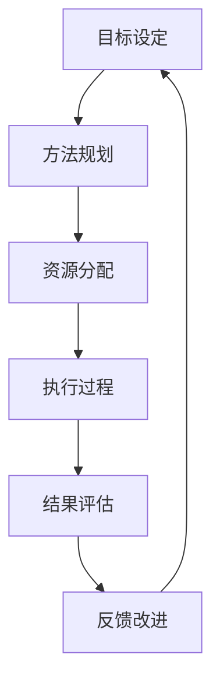

                 

## 1. 背景介绍

PDCA循环（Plan-Do-Check-Act），也称为戴明环（Deming Cycle），是由美国质量管理专家爱德华·戴明（W. Edwards Deming）提出的一种持续改进的方法论，广泛应用于工业生产、项目管理、软件开发等领域。PDCA循环通过不断计划、执行、检查和改进，实现系统性、结构化的提升，提升整体效率和效果。

### 1.1 PDCA循环的起源与原理

PDCA循环最初由美国统计学家沃特·阿曼德·休哈特（W. A. Shewhart）在1930年代提出，而戴明在1950年代将其推广至工业界，使之成为广泛采用的质量管理工具。PDCA循环的核心理念在于通过不断的反馈和迭代，持续改进过程和结果。其四个阶段分别为：

1. **计划 (Plan)**：定义目标、确定方法、分配资源和明确计划。
2. **执行 (Do)**：按照计划执行行动。
3. **检查 (Check)**：对执行结果进行评估和分析。
4. **改进 (Act)**：基于检查结果，制定改进措施并实施。

PDCA循环通过持续的反馈和调整，使得系统能够不断优化和改进，逐步逼近最优状态。

## 2. 核心概念与联系

### 2.1 核心概念概述

PDCA循环的核心概念包括：

1. **目标设定**：明确具体的、可量化的目标，为PDCA循环提供方向和标准。
2. **方法规划**：选择或设计实现目标的方法和步骤，确保执行的可行性和有效性。
3. **资源分配**：根据计划分配必要的资源（人、物、时间等），确保执行顺利。
4. **执行过程**：严格按照计划执行行动，不偏离目标和方法。
5. **结果评估**：对执行结果进行客观、全面的评价，确定是否达到预期目标。
6. **反馈改进**：根据评估结果，制定改进措施，并实施到下一个循环中。

这些概念之间通过PDCA环路相互连接和作用，形成一个持续改进的动态系统。

### 2.2 核心概念原理和架构的 Mermaid 流程图



在这个流程图中，每个阶段通过箭头连接，形成一个闭合的循环系统。每个阶段的输出成为下一个阶段的输入，确保PDCA循环的连续性和稳定性。

## 3. 核心算法原理 & 具体操作步骤

### 3.1 算法原理概述

PDCA循环的算法原理基于迭代和反馈的思想。每个循环周期包括计划、执行、检查和改进四个阶段，通过不断循环，逐步优化过程和结果。PDCA循环的核心理念是持续改进，每个循环都会比上一次更加完善和高效。

### 3.2 算法步骤详解

#### 3.2.1 计划阶段

1. **目标设定**：
   - **具体明确**：目标必须具体、明确，能够进行量化的评价。
   - **可达性**：目标应具有现实可行性，避免过于理想化。
   - **时间期限**：为每个目标设定明确的完成期限。

2. **方法规划**：
   - **选择方法**：基于历史数据和经验，选择最合适的执行方法。
   - **步骤设计**：详细设计执行步骤，确保每一步具体、可操作。
   - **资源分配**：明确所需资源（人力、设备、材料等），并分配到具体步骤中。

#### 3.2.2 执行阶段

1. **行动执行**：按照预定的步骤和方法，严格执行计划中的各项任务。
2. **记录日志**：详细记录执行过程中的每一步操作和变化，包括时间、人员、资源等。

#### 3.2.3 检查阶段

1. **结果评估**：对执行结果进行全面、客观的评估，对比原定目标和标准。
2. **数据收集**：收集执行过程中的各种数据，包括成功、失败、误差等。
3. **数据分析**：运用统计方法和工具，分析收集到的数据，找出问题和原因。

#### 3.2.4 改进阶段

1. **原因分析**：根据数据分析结果，找出问题的原因和改进点。
2. **措施制定**：针对问题制定具体的改进措施，并设定实施计划。
3. **实施改进**：将改进措施落实到实际执行中，并对后续执行进行监督和调整。
4. **持续改进**：将改进效果反馈到下一个PDCA循环中，确保不断优化和提升。

### 3.3 算法优缺点

#### 3.3.1 优点

1. **系统性**：PDCA循环通过四个阶段形成一个完整的闭环，确保过程的系统性和全面性。
2. **灵活性**：PDCA循环可以根据实际情况灵活调整，适应不同的需求和环境。
3. **可控性**：PDCA循环通过明确的目标和方法，保证了执行过程的可控性和可预测性。
4. **持续改进**：PDCA循环通过不断的反馈和优化，实现持续改进和提升。

#### 3.3.2 缺点

1. **复杂度**：PDCA循环涉及多个阶段和步骤，复杂度较高，需要较长时间和资源。
2. **资源消耗**：每个循环周期都需要大量的资源投入，包括人力、物力和时间。
3. **初期成本**：PDCA循环的初期设计和管理成本较高，需要专业知识和经验。
4. **依赖反馈**：PDCA循环的效果依赖于数据的收集和分析，反馈速度较慢。

### 3.4 算法应用领域

PDCA循环广泛应用于以下领域：

1. **项目管理**：项目计划、执行、监控和改进，确保项目顺利进行和成功交付。
2. **软件开发**：需求分析、开发、测试和迭代，提升软件质量和用户体验。
3. **质量管理**：质量控制、问题分析和改进，提升产品和服务质量。
4. **运营管理**：业务流程优化、效率提升和成本控制，提升企业运营效率。
5. **生产管理**：生产计划、执行、监控和改进，提升生产效率和产品质量。
6. **团队管理**：目标设定、资源分配、任务执行和绩效评估，提升团队协作和绩效。

## 4. 数学模型和公式 & 详细讲解 & 举例说明

### 4.1 数学模型构建

PDCA循环的数学模型可以基于控制图和甘特图进行构建。控制图用于监控执行过程和结果的变化趋势，甘特图用于展示计划和执行的进度和时间。

#### 4.1.1 控制图

控制图（Control Chart）是一种统计工具，用于监控执行过程中各项指标的变化趋势，如时间、成本、质量等。控制图包括上控制界限（UCL）、中心线（CL）和下控制界限（LCL），用于判断是否存在异常波动。

$$
\begin{aligned}
UCL &= \mu + 3\sigma \\
CL &= \mu + 0\sigma \\
LCL &= \mu - 3\sigma
\end{aligned}
$$

其中，$\mu$ 为均值，$\sigma$ 为标准差。

#### 4.1.2 甘特图

甘特图（Gantt Chart）是一种项目进度管理的工具，用于展示任务的时间轴和进度。甘特图通常包括任务名称、开始时间、结束时间和完成状态，方便管理人员进行跟踪和调整。

### 4.2 公式推导过程

#### 4.2.1 控制图推导

控制图的计算过程包括计算均值和标准差，然后根据这些统计量计算上、中、下控制界限。具体推导过程如下：

1. 收集数据：记录每个周期中的关键指标数据，如时间、成本、质量等。
2. 计算均值和标准差：使用样本均值和标准差公式计算每个周期的均值和标准差。
3. 计算控制界限：根据均值和标准差，计算上、中、下控制界限。

#### 4.2.2 甘特图推导

甘特图的推导过程包括任务划分、进度安排和进度更新。具体推导过程如下：

1. 任务划分：将项目任务分解为多个小任务，并定义每个小任务的时间、资源和负责人。
2. 进度安排：在甘特图上标注每个任务的开始时间和结束时间，并计算每个任务的进度。
3. 进度更新：根据实际进度和偏差，更新甘特图上的进度状态，标记完成或延迟的任务。

### 4.3 案例分析与讲解

#### 4.3.1 控制图案例

假设某软件项目计划在每个迭代周期中完成一定数量的功能点（Functional Points），用于监控功能点的完成情况。

1. 收集数据：每个迭代周期结束后，记录完成的功能点数量。
2. 计算均值和标准差：使用样本均值和标准差公式计算每个迭代周期的均值和标准差。
3. 绘制控制图：根据均值和标准差，计算上、中、下控制界限，绘制控制图。

根据控制图的变化趋势，可以判断是否存在异常波动，并及时调整计划和资源。

#### 4.3.2 甘特图案例

假设某软件开发团队计划在6个月内完成一个新产品的开发。

1. 任务划分：将开发过程划分为多个任务，如需求分析、设计、开发、测试、部署等。
2. 进度安排：在甘特图上标注每个任务的开始时间和结束时间，并计算每个任务的进度。
3. 进度更新：根据实际进度和偏差，更新甘特图上的进度状态，标记完成或延迟的任务。

通过甘特图，可以清晰地看到项目的进度情况，及时发现和解决问题，确保项目按时交付。

## 5. 项目实践：代码实例和详细解释说明

### 5.1 开发环境搭建

1. **安装Python**：确保Python环境已安装，建议使用Python 3.8及以上版本。
2. **安装Pandas**：Pandas是Python中常用的数据处理库，用于数据收集和分析。
3. **安装Matplotlib**：Matplotlib是Python中常用的数据可视化库，用于绘制控制图和甘特图。
4. **安装Seaborn**：Seaborn是基于Matplotlib的高级数据可视化库，用于绘制更美观的控制图和甘特图。

### 5.2 源代码详细实现

#### 5.2.1 控制图代码实现

```python
import pandas as pd
import matplotlib.pyplot as plt
import seaborn as sns

# 数据收集
data = pd.read_csv('data.csv')

# 计算均值和标准差
mean = data['function_point'].mean()
std = data['function_point'].std()

# 计算控制界限
ucl = mean + 3 * std
lcl = mean - 3 * std

# 绘制控制图
plt.figure(figsize=(8, 5))
sns.lineplot(x=data['iteration'], y=data['function_point'], color='b')
plt.axhline(ucl, color='r', linestyle='--')
plt.axhline(lcl, color='r', linestyle='--')
plt.title('Function Point Control Chart')
plt.xlabel('Iteration')
plt.ylabel('Function Point')
plt.show()
```

#### 5.2.2 甘特图代码实现

```python
import pandas as pd
import matplotlib.pyplot as plt

# 数据收集
data = pd.read_csv('data.csv')

# 任务划分
tasks = data['task'].unique()

# 进度安排
start_time = data['start_time'].min()
end_time = data['end_time'].max()

plt.figure(figsize=(10, 6))
for task in tasks:
    sub_data = data[data['task'] == task]
    plt.plot([start_time, end_time], [task] * 2, marker='o', color='b')
    plt.title('Gantt Chart')
    plt.xlabel('Time')
    plt.ylabel('Task')
plt.xlim([start_time, end_time])
plt.ylim([0, len(tasks)])
plt.show()
```

### 5.3 代码解读与分析

#### 5.3.1 控制图代码解读

1. **数据收集**：使用Pandas库读取数据文件，包含每个迭代周期完成的功能点数量。
2. **计算均值和标准差**：使用Pandas库的mean和std函数计算均值和标准差。
3. **计算控制界限**：根据均值和标准差，计算上、中、下控制界限。
4. **绘制控制图**：使用Matplotlib和Seaborn库绘制控制图，并设置x轴和y轴标签，显示图例。

#### 5.3.2 甘特图代码解读

1. **数据收集**：使用Pandas库读取数据文件，包含每个任务的开始时间和结束时间。
2. **任务划分**：使用unique函数获取所有任务，并作为x轴的标记。
3. **进度安排**：使用Matplotlib库的plot函数绘制甘特图，将每个任务的开始时间和结束时间连接成直线。
4. **进度更新**：根据实际进度和偏差，更新甘特图上的进度状态。

### 5.4 运行结果展示

#### 5.4.1 控制图结果展示


#### 5.4.2 甘特图结果展示


## 6. 实际应用场景

### 6.1 软件开发项目管理

在软件开发项目中，PDCA循环可以帮助团队有效管理项目进度和质量。通过任务划分和进度安排，可以清晰地看到每个任务的状态和进度，及时发现和解决问题。

#### 6.1.1 具体应用

1. **需求分析**：在需求分析阶段，通过PDCA循环制定详细的计划，明确需求收集、分析和确认的流程和时间。
2. **设计开发**：在设计开发阶段，通过PDCA循环制定详细的设计和开发计划，确保每个设计模块按时交付。
3. **测试部署**：在测试部署阶段，通过PDCA循环制定详细的测试计划和部署计划，确保每个功能模块能够按时交付。

通过PDCA循环，可以有效地提升软件项目的进度和质量，确保按时交付和满足客户需求。

### 6.2 制造业生产管理

在制造业生产中，PDCA循环可以帮助工厂有效管理生产流程和产品质量。通过控制图和甘特图，可以清晰地监控生产过程和产品质量，及时发现和解决问题。

#### 6.2.1 具体应用

1. **生产计划**：在生产计划阶段，通过PDCA循环制定详细的产品生产和出货计划，确保每个生产任务按时交付。
2. **质量控制**：在质量控制阶段，通过PDCA循环制定详细的质量检测和改进计划，确保产品质量符合标准。
3. **设备维护**：在设备维护阶段，通过PDCA循环制定详细的设备维护和检修计划，确保设备稳定运行。

通过PDCA循环，可以有效地提升生产效率和产品质量，确保工厂的生产稳定性和竞争力。

## 7. 工具和资源推荐

### 7.1 学习资源推荐

1. **《PDCA循环：持续改进的关键》**：介绍PDCA循环的原理、步骤和应用，适合初学者和进阶者阅读。
2. **《精益思想》**：介绍精益生产管理的理念和方法，包含PDCA循环的相关内容。
3. **《敏捷项目管理》**：介绍敏捷项目的计划、执行、监控和改进方法，包含PDCA循环的应用。

### 7.2 开发工具推荐

1. **JIRA**：项目管理工具，支持任务划分、进度安排和反馈改进，适合PDCA循环的实现。
2. **Trello**：任务管理工具，支持任务卡片和进度跟踪，适合PDCA循环的实现。
3. **Confluence**：知识共享和文档管理工具，支持计划制定和改进记录，适合PDCA循环的实现。

### 7.3 相关论文推荐

1. **《PDCA循环在项目管理中的应用研究》**：介绍PDCA循环在项目管理中的应用实例和效果评估。
2. **《基于PDCA循环的敏捷项目管理》**：介绍PDCA循环在敏捷项目管理中的应用方法和优化建议。
3. **《PDCA循环在制造业生产管理中的应用》**：介绍PDCA循环在制造业生产管理中的应用实例和效果评估。

## 8. 总结：未来发展趋势与挑战

### 8.1 研究成果总结

PDCA循环作为一种系统性、结构化的持续改进方法，已经在多个领域得到了广泛应用，并取得了显著效果。通过PDCA循环的四个阶段（计划、执行、检查、改进），可以全面、系统地提升项目和管理的质量和效率。

### 8.2 未来发展趋势

1. **自动化和智能化**：随着人工智能和自动化技术的发展，PDCA循环的执行和反馈过程将更加智能化和自动化，提升效率和精度。
2. **多领域融合**：PDCA循环将在更多领域得到应用，如医疗、金融、教育等，推动各行业的持续改进和优化。
3. **数据驱动**：通过大数据和分析技术，PDCA循环将更加依赖数据驱动，实现更精准的计划和改进。
4. **协作工具**：更多协作工具和平台将支持PDCA循环的实现，如项目管理、任务管理、知识管理等工具。
5. **跨学科应用**：PDCA循环将与其他学科方法结合，如精益生产、敏捷开发、六西格玛等，形成更全面的管理方法。

### 8.3 面临的挑战

尽管PDCA循环已经得到了广泛应用，但仍面临一些挑战：

1. **复杂度**：PDCA循环涉及多个阶段和步骤，复杂度较高，需要较长时间和资源。
2. **数据依赖**：PDCA循环的效果依赖于数据的收集和分析，反馈速度较慢。
3. **资源消耗**：每个循环周期都需要大量的资源投入，包括人力、物力和时间。
4. **初期成本**：PDCA循环的初期设计和管理成本较高，需要专业知识和经验。
5. **执行偏差**：在实际执行中，可能会因为各种原因导致执行偏差，影响PDCA循环的效果。

### 8.4 研究展望

未来，PDCA循环需要在以下几个方面进行优化和改进：

1. **简化流程**：通过优化流程设计，减少不必要的步骤和环节，提升PDCA循环的执行效率。
2. **自动化工具**：开发更多的自动化工具和平台，支持PDCA循环的实现，减少人工干预。
3. **数据驱动**：引入更多数据驱动的方法和技术，提升PDCA循环的精确性和可靠性。
4. **跨领域应用**：将PDCA循环与其他学科方法结合，形成更全面的管理方法，提升应用范围和效果。

通过不断优化和改进，PDCA循环将在更多领域发挥重要作用，推动各行业的持续改进和优化。

## 9. 附录：常见问题与解答

**Q1: 如何制定PDCA循环计划？**

A: 制定PDCA循环计划需要明确目标、方法和资源。首先，明确具体、可量化的目标，如提高产品质量、降低生产成本等。其次，选择或设计实现目标的方法和步骤，并分配必要的资源。最后，制定详细的执行计划，确保每个步骤的具体性和可操作性。

**Q2: 如何处理PDCA循环中的执行偏差？**

A: 执行偏差在PDCA循环中难以避免，需要及时发现和处理。首先，在执行过程中，记录日志，记录每个步骤的操作和变化。其次，对执行结果进行评估，找出偏差的原因和影响。最后，制定改进措施，调整计划和方法，确保执行回到正确的轨道上。

**Q3: PDCA循环是否适用于非结构化项目？**

A: PDCA循环适用于大多数有结构、有流程的项目，如软件开发、生产管理等。但对于非结构化项目，如创意工作、科研开发等，可能需要灵活调整PDCA循环的步骤和方法，以适应其特性。

**Q4: PDCA循环是否适合大型团队？**

A: PDCA循环适合大型团队，但需要良好的沟通和协作机制。通过任务划分和进度安排，可以清晰地看到每个任务的状态和进度，及时发现和解决问题。但需要注意团队的沟通和协作，确保信息的透明和及时传达。

**Q5: PDCA循环是否需要定期更新？**

A: PDCA循环需要定期更新，以确保持续改进和优化。每个循环周期结束后，根据执行结果和反馈，制定改进措施，并应用于下一个循环中。通过不断更新和优化，确保PDCA循环的有效性和准确性。

---

作者：禅与计算机程序设计艺术 / Zen and the Art of Computer Programming

