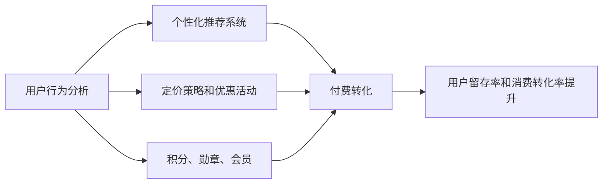

                 

## 1. 背景介绍

随着互联网和数字技术的发展，知识付费平台应运而生，为人们提供了一种便捷、高效的学习方式。然而，如何设计有效的用户激励机制，以提高用户粘性、提升平台收益，成为知识付费平台面临的重要挑战。

### 1.1 问题由来

当前，许多知识付费平台已经积累了大量用户，但用户流失率高、活跃度低、付费转化率低等问题仍然普遍存在。用户在平台上的停留时间短，付费意愿低，甚至频繁取消订阅，使得平台难以持续盈利。

为了解决这些问题，平台需要设计一种有效的用户激励机制，激发用户的学习兴趣和付费意愿，提高用户留存率和消费转化率。

### 1.2 问题核心关键点

设计有效的用户激励机制，需要解决以下关键问题：
1. **用户行为分析**：理解用户的学习需求和行为模式，找出用户流失的根本原因。
2. **个性化推荐**：根据用户的行为和偏好，提供个性化的课程推荐，增强用户体验。
3. **付费转化策略**：设计合理的定价策略和优惠活动，引导用户进行付费订阅。
4. **激励机制设计**：建立有效的积分、勋章、会员等激励机制，提高用户活跃度和忠诚度。

## 2. 核心概念与联系

### 2.1 核心概念概述

在设计知识付费用户激励机制时，涉及多个核心概念：

- **用户行为分析**：通过数据分析，理解用户的行为模式、需求和痛点，为激励机制设计提供依据。
- **个性化推荐系统**：根据用户的行为和偏好，推荐相关课程和内容，提高用户的学习体验和满意度。
- **定价策略和优惠活动**：设计合理的定价策略和优惠活动，吸引用户进行付费订阅。
- **积分、勋章、会员**：通过积分、勋章、会员等激励机制，提升用户活跃度和忠诚度。

### 2.2 核心概念原理和架构的 Mermaid 流程图



此图展示了知识付费平台用户激励机制的核心流程：通过用户行为分析，驱动个性化推荐系统、定价策略、积分系统等机制，最终实现用户留存率和消费转化率的提升。

## 3. 核心算法原理 & 具体操作步骤

### 3.1 算法原理概述

用户激励机制设计的核心在于理解用户行为，并通过合理的激励策略，增强用户粘性。常见的用户激励机制包括积分、勋章、会员、优惠券等。以下是这些机制的设计原理：

- **积分系统**：通过用户在平台上的行为，如观看视频、阅读文章、完成测验等，给予积分奖励，积分可用于兑换课程、购买商品等。
- **勋章系统**：根据用户的课程完成情况、学习时长、互动行为等，授予勋章，激励用户持续学习。
- **会员制度**：提供不同等级的会员，享受专属课程、优惠价格、优先服务等，吸引用户成为付费用户。
- **优惠券**：通过限时打折、首次订阅优惠等活动，吸引新用户进行首次付费，增加平台的初始用户量。

### 3.2 算法步骤详解

用户激励机制的设计涉及以下几个步骤：

1. **用户行为数据收集**：收集用户在平台上的行为数据，如观看时间、购买记录、课程完成情况等。
2. **数据分析和建模**：对用户行为数据进行分析，建立用户画像和行为模型，识别用户流失的潜在原因。
3. **激励机制设计**：根据用户画像和行为模型，设计相应的激励机制，如积分、勋章、会员等。
4. **激励机制实施**：在平台上部署激励机制，实时记录用户行为，更新积分、勋章、会员等级等。
5. **效果评估和优化**：定期评估激励机制的效果，根据用户反馈和数据分析结果进行优化调整。

### 3.3 算法优缺点

**优点**：
1. **提升用户活跃度**：通过积分、勋章、会员等激励机制，可以显著提高用户的平台使用频率和学习时长。
2. **促进付费转化**：合理的定价策略和优惠券可以吸引新用户进行付费订阅，增加平台的收益。
3. **增强用户粘性**：个性化的课程推荐和专属服务可以提升用户对平台的忠诚度。

**缺点**：
1. **成本较高**：设计和实施激励机制需要较高的运营成本，尤其是在优惠券和会员制度上。
2. **效果难以衡量**：激励机制的效果难以直接衡量，需要依赖长期的用户留存率和消费转化数据进行评估。
3. **过度依赖**：过度依赖积分、勋章等激励机制，可能导致用户为了获得奖励而学习，而非出于兴趣。

### 3.4 算法应用领域

用户激励机制可以应用于多种场景，包括但不限于：

- **在线教育**：通过积分、勋章等机制，提升用户的学习积极性和课程购买率。
- **知识付费**：通过会员制度和优惠券，吸引用户进行付费订阅。
- **内容平台**：通过积分、勋章等机制，提高用户的内容消费和平台粘性。

## 4. 数学模型和公式 & 详细讲解 & 举例说明

### 4.1 数学模型构建

用户激励机制的效果可以通过数学模型进行量化评估。假设平台上有 $N$ 个用户，$T$ 个课程。每个用户的学习行为可以用向量 $x_i$ 表示，其中 $x_{ij}=1$ 表示用户 $i$ 购买了课程 $j$，$x_{ij}=0$ 表示未购买。课程 $j$ 的收益可以用 $y_j$ 表示，其中 $y_{j}=1$ 表示课程 $j$ 有收益，$y_{j}=0$ 表示无收益。

用户激励机制的设计目标是最大化平台的总收益，即最大化 $y_j \cdot \sum_{i=1}^N x_{ij}$。通过以下数学模型来表示：

$$
\max_{x_i} \sum_{i=1}^N \sum_{j=1}^T x_{ij}y_j
$$

### 4.2 公式推导过程

为了最大化总收益，平台需要对用户行为进行建模，并设计合适的激励机制。常见的用户行为建模方法包括：

1. **协同过滤**：通过分析用户的行为数据，找到用户之间相似性较高的用户群体，从而进行个性化推荐。
2. **线性回归**：建立用户行为与课程收益之间的关系，预测用户的行为。

在建模后，平台可以设计激励机制，如积分系统。积分的计算公式为：

$$
S_i = \sum_{j=1}^T x_{ij}a_j
$$

其中 $a_j$ 为课程 $j$ 的积分权重，可以通过用户行为数据和课程收益进行计算。积分可以用于兑换课程、购买商品等。

### 4.3 案例分析与讲解

假设平台上有两个课程，课程 A 和课程 B，每个课程的积分权重分别为 2 和 1。某用户 $i$ 购买了这两个课程，积分计算公式为：

$$
S_i = 2 \cdot x_{iA} + 1 \cdot x_{iB}
$$

其中 $x_{iA}$ 和 $x_{iB}$ 分别为用户 $i$ 购买课程 A 和课程 B 的布尔变量。如果用户 $i$ 购买了这两个课程，则积分 $S_i$ 为 3，否则为 0。

用户可以积分兑换课程，兑换价格为 $p_j$，其中 $p_j$ 为课程 $j$ 的兑换价格。用户 $i$ 购买课程 $j$ 的收益为：

$$
R_i = \left\{
\begin{aligned}
&S_i - p_j \quad &&\text{如果用户 $i$ 购买了课程 $j$}\\
&0 &&\text{否则}
\end{aligned}
\right.
$$

平台需要最大化用户收益 $R_i$，即最大化 $S_i - p_j$。

## 5. 项目实践：代码实例和详细解释说明

### 5.1 开发环境搭建

用户激励机制的开发需要以下环境：

1. **编程语言**：Python
2. **数据处理库**：Pandas、NumPy
3. **机器学习库**：Scikit-learn
4. **数据分析库**：Matplotlib、Seaborn
5. **数据库**：MySQL、Redis

### 5.2 源代码详细实现

以下是一个简单的代码实现，用于计算用户的积分：

```python
import numpy as np

# 课程收益
y = np.array([1, 1])  # 课程A和课程B的收益

# 用户行为
x = np.array([[1, 1], [1, 0], [0, 1]])

# 积分权重
a = np.array([2, 1])  # 课程A和课程B的积分权重

# 计算用户积分
S = np.dot(x, a)
```

在实际应用中，需要根据用户的真实行为数据进行计算。

### 5.3 代码解读与分析

在上述代码中，我们使用了Numpy库进行数组操作，计算了用户的积分。计算公式为：

$$
S_i = \sum_{j=1}^T x_{ij}a_j
$$

其中 $x_{ij}$ 表示用户 $i$ 购买课程 $j$ 的行为，$a_j$ 表示课程 $j$ 的积分权重。

### 5.4 运行结果展示

运行上述代码，可以得到用户 $i$ 的积分计算结果。例如，对于用户 $i=1$，积分 $S_1$ 的计算结果为：

$$
S_1 = 2 \cdot 1 + 1 \cdot 1 = 3
$$

用户 $i=2$ 和 $i=3$ 的积分计算结果分别为：

$$
S_2 = 2 \cdot 1 + 1 \cdot 0 = 2
$$

$$
S_3 = 2 \cdot 0 + 1 \cdot 1 = 1
$$

## 6. 实际应用场景

### 6.1 在线教育

在线教育平台可以通过积分和勋章机制，提升用户的学习积极性和课程购买率。例如，平台可以根据用户的观看时间和课程完成情况，给予积分和勋章奖励，激励用户持续学习。

### 6.2 知识付费

知识付费平台可以通过会员制度和优惠券，吸引用户进行付费订阅。例如，平台可以提供不同等级的会员，享受专属课程、优惠价格、优先服务等，吸引用户成为付费用户。

### 6.3 内容平台

内容平台可以通过积分和勋章机制，提高用户的内容消费和平台粘性。例如，平台可以根据用户的内容消费行为，给予积分和勋章奖励，激励用户持续消费内容。

### 6.4 未来应用展望

随着技术的发展，用户激励机制将更加智能化和个性化。例如：

1. **动态定价**：根据用户的购买行为和平台数据，实时调整课程价格，吸引用户进行付费订阅。
2. **推荐引擎**：利用推荐算法，根据用户行为和偏好，动态推荐课程，提高用户的学习体验。
3. **情感分析**：通过分析用户的学习反馈，优化课程内容和激励机制，提升用户的满意度。

## 7. 工具和资源推荐

### 7.1 学习资源推荐

为了学习用户激励机制的设计和实现，推荐以下资源：

1. **《机器学习实战》**：一本经典的机器学习实战书籍，涵盖各种机器学习算法和实际应用案例。
2. **《深度学习》**：由斯坦福大学教授Christopher M. Bishop撰写的深度学习经典教材，全面介绍了深度学习的基本概念和实现方法。
3. **Coursera**：一个在线学习平台，提供各种机器学习、数据科学和深度学习的课程，涵盖了从入门到高级的内容。
4. **Kaggle**：一个数据科学竞赛平台，提供各种数据集和竞赛项目，可以通过实际项目练习用户激励机制的实现。
5. **博客和社区**：如Medium、GitHub等平台上的机器学习和数据分析博客，提供大量的实战案例和经验分享。

### 7.2 开发工具推荐

用户激励机制的开发需要以下工具：

1. **Python**：一种高效、易学的编程语言，广泛用于数据分析、机器学习和深度学习。
2. **Jupyter Notebook**：一个交互式编程环境，支持Python和其他编程语言的编写和运行，适合数据分析和机器学习任务。
3. **NumPy**：一个高效的数值计算库，支持多维数组和矩阵运算，适合科学计算和数据处理。
4. **Pandas**：一个数据处理库，支持各种数据格式和操作，适合数据清洗和分析。
5. **Matplotlib**：一个数据可视化库，支持各种图表的绘制，适合数据的可视化分析。

### 7.3 相关论文推荐

为了深入理解用户激励机制的设计，推荐以下论文：

1. **《A Study of Factorization Machine for Recommender System》**：一篇关于推荐系统的经典论文，提出了因子分解机算法，用于个性化推荐系统的设计。
2. **《Deep Customer Analytics for Recommendation System》**：一篇关于深度学习在推荐系统中的应用论文，提出了深度客户分析算法，用于用户行为预测和个性化推荐。
3. **《Customer Lifetime Value Prediction Based on Deep Learning》**：一篇关于客户生命周期价值预测的论文，提出了深度学习在客户行为分析中的应用，用于提升用户留存率和收益。
4. **《Incentive Design and Dynamics for Energy Markets》**：一篇关于能源市场激励机制设计的论文，用于激励用户参与能源市场的交易。
5. **《Incentive Mechanism Design for Smart Grids》**：一篇关于智能电网激励机制设计的论文，用于激励用户参与智能电网的运行和管理。

## 8. 总结：未来发展趋势与挑战

### 8.1 总结

本文系统地介绍了知识付费平台用户激励机制的设计原理和实现方法。通过用户行为分析、个性化推荐、定价策略和激励机制设计，可以有效提升用户留存率和消费转化率，增加平台的收益。

### 8.2 未来发展趋势

用户激励机制将随着技术的发展而不断演进，未来可能的发展趋势包括：

1. **智能化**：利用深度学习和推荐算法，根据用户行为和偏好，提供更加个性化和智能化的激励机制。
2. **多元化**：设计更加多样化的激励机制，如虚拟货币、排行榜等，满足不同用户群体的需求。
3. **国际化**：根据不同国家和地区的文化和消费习惯，设计符合本地化的激励机制。
4. **伦理化**：在设计激励机制时，考虑到用户隐私和伦理问题，确保数据安全和用户权益。

### 8.3 面临的挑战

用户激励机制的设计和实施面临以下挑战：

1. **数据隐私和安全**：在数据收集和分析过程中，需要确保用户隐私和数据安全，防止数据泄露和滥用。
2. **用户行为预测**：用户行为预测需要高精度的模型和大量的数据，但用户行为变化复杂，难以准确预测。
3. **激励机制设计**：激励机制的设计需要考虑多种因素，如用户行为、课程收益、平台收益等，找到最优的平衡点。
4. **平台运营成本**：设计和实施激励机制需要较高的运营成本，平台需要权衡成本和收益。

### 8.4 研究展望

未来的研究可以在以下几个方向进行：

1. **多模态数据融合**：利用多模态数据（如视频、音频、图像等）进行用户行为分析和个性化推荐，提升激励机制的效果。
2. **用户情感分析**：通过情感分析技术，理解用户的情感状态和反馈，优化激励机制的设计。
3. **持续学习和动态优化**：利用持续学习技术，实时更新模型和激励机制，动态优化用户体验和平台收益。
4. **跨平台协同优化**：通过跨平台数据共享和协同优化，提升平台的整体用户留存率和收益。

总之，用户激励机制是知识付费平台的重要组成部分，通过不断优化和创新，可以显著提升平台的用户粘性和收益。未来的研究需要综合考虑技术、用户和平台的多方面因素，设计更加科学和高效的用户激励机制。

## 9. 附录：常见问题与解答

### Q1: 用户激励机制的设计原理是什么？

A: 用户激励机制的设计原理是理解用户行为，通过合理的激励策略，增强用户粘性。常见的激励机制包括积分、勋章、会员、优惠券等。积分系统通过用户在平台上的行为，给予积分奖励，积分可用于兑换课程、购买商品等。勋章系统根据用户的课程完成情况、学习时长、互动行为等，授予勋章，激励用户持续学习。会员制度提供不同等级的会员，享受专属课程、优惠价格、优先服务等，吸引用户成为付费用户。优惠券通过限时打折、首次订阅优惠等活动，吸引新用户进行首次付费。

### Q2: 用户激励机制的效果如何评估？

A: 用户激励机制的效果可以通过以下指标进行评估：

1. **用户留存率**：衡量用户在平台上的活跃度和停留时间，反映激励机制对用户粘性的提升效果。
2. **课程购买率**：衡量用户对课程的购买意愿和付费转化率，反映激励机制对用户付费意愿的提升效果。
3. **学习时长**：衡量用户在学习课程上的投入时间，反映激励机制对用户学习积极性的提升效果。
4. **课程完成率**：衡量用户对课程的完成情况，反映激励机制对用户学习进度的激励效果。

通过长期的数据跟踪和分析，可以评估激励机制的效果，并进行优化调整。

### Q3: 如何设计合理的定价策略？

A: 设计合理的定价策略需要考虑以下几个因素：

1. **用户需求**：了解用户对课程的需求和支付能力，制定合理的定价策略。
2. **竞争分析**：分析竞争对手的定价策略，确保自身定价具有竞争力。
3. **成本控制**：控制课程的开发和运营成本，确保定价的合理性。
4. **促销活动**：设计合理的促销活动，吸引新用户进行首次付费。

常见的定价策略包括免费试用、阶梯定价、限时折扣等。

### Q4: 如何设计有效的激励机制？

A: 设计有效的激励机制需要考虑以下几个因素：

1. **用户行为分析**：通过数据分析，理解用户的行为模式和需求，设计合适的激励机制。
2. **个性化推荐**：根据用户的偏好和行为，提供个性化的课程和内容推荐，增强用户体验。
3. **积分和勋章**：设计积分和勋章机制，激励用户持续学习和完成课程。
4. **会员制度**：提供不同等级的会员，享受专属课程、优惠价格、优先服务等，吸引用户成为付费用户。
5. **优惠券**：通过限时打折、首次订阅优惠等活动，吸引新用户进行首次付费。

通过多方面的优化和调整，可以设计有效的激励机制，提高用户的留存率和付费转化率。

### Q5: 用户激励机制的未来发展方向是什么？

A: 用户激励机制的未来发展方向包括：

1. **智能化**：利用深度学习和推荐算法，提供更加个性化和智能化的激励机制。
2. **多元化**：设计更加多样化的激励机制，如虚拟货币、排行榜等，满足不同用户群体的需求。
3. **国际化**：根据不同国家和地区的文化和消费习惯，设计符合本地化的激励机制。
4. **伦理化**：在设计激励机制时，考虑到用户隐私和伦理问题，确保数据安全和用户权益。

通过不断的创新和优化，用户激励机制将更加科学和高效，提升用户的体验和平台的收益。

作者：禅与计算机程序设计艺术 / Zen and the Art of Computer Programming

