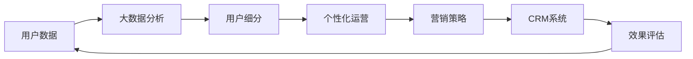

                 

# 如何进行有效的用户分层运营

> 关键词：用户分层,个性化运营,数据驱动,营销策略,CRM系统,大数据分析,数据可视化

## 1. 背景介绍

在数字化时代，用户数据成为了企业宝贵的资产。通过分析用户数据，企业可以更准确地了解用户需求，提供个性化的服务，提升用户满意度和忠诚度。然而，面对海量用户数据，如何高效、精确地对用户进行分层运营，成为每个企业必须面对的挑战。

用户分层运营是指根据用户的特征和行为，将用户分成不同的群体，并对不同群体采取不同的运营策略，从而实现精细化的用户管理。有效的用户分层运营可以显著提升企业的市场竞争力，优化营销效果，实现商业价值最大化。

本文将系统介绍用户分层运营的核心概念与技术，从理论到实践，详解其算法原理和具体操作步骤，同时提供案例分析、代码实现和实际应用建议，帮助企业掌握用户分层运营的关键技巧，实现精准营销和高效运营。

## 2. 核心概念与联系

### 2.1 核心概念概述

为了更好地理解用户分层运营，本节将介绍几个关键概念：

- **用户分层(User Segmentation)**：将用户根据其特征、行为或属性划分为不同群体的过程。
- **个性化运营(Personalization)**：针对不同用户群体提供个性化的产品、服务或营销策略。
- **数据驱动(Data-Driven)**：基于数据分析的结果进行决策，而非依赖经验和直觉。
- **营销策略(Marketing Strategy)**：企业在营销活动中采用的具体方案和措施。
- **CRM系统(Customer Relationship Management)**：企业管理客户关系的软件系统。
- **大数据分析(Big Data Analysis)**：从大规模数据中提取有价值信息和知识的过程。
- **数据可视化(Data Visualization)**：将数据转化为直观的图形展示，便于分析和理解。

这些概念共同构成了用户分层运营的基础框架，通过分析用户数据，将其划分为不同的群体，然后针对每个群体实施个性化的运营策略，从而实现营销和客户管理的优化。

### 2.2 核心概念原理和架构的 Mermaid 流程图



此流程图展示了用户分层运营的基本流程：首先收集用户数据，然后进行大数据分析，对用户进行细分，实施个性化运营，制定营销策略，最终通过CRM系统进行管理和评估。

## 3. 核心算法原理 & 具体操作步骤

### 3.1 算法原理概述

用户分层运营的算法原理主要包括以下几个步骤：

1. **数据收集**：收集用户的基本信息、行为数据和交互数据。
2. **数据预处理**：清洗、转换和整合数据，保证数据质量。
3. **用户细分**：运用机器学习算法对用户进行分类，形成不同的用户群体。
4. **个性化运营**：根据不同用户群体的特征和需求，制定和实施个性化的运营策略。
5. **效果评估**：通过数据分析和可视化，评估运营策略的效果，进行迭代优化。

### 3.2 算法步骤详解

#### 3.2.1 数据收集

数据收集是用户分层运营的第一步。通过多种渠道收集用户数据，如网站访问记录、电商平台购买记录、社交媒体互动数据等。

**主要数据来源**：
- **用户基本信息**：姓名、年龄、性别、地区等。
- **行为数据**：点击、浏览、购买、评价等。
- **交互数据**：聊天、邮件、电话等。

**数据收集工具**：
- **Web服务器日志**：记录网站访问和用户行为。
- **电商平台数据**：记录用户购买行为和产品评价。
- **社交媒体API**：获取用户在社交媒体上的互动数据。
- **CRM系统**：记录用户与客服的互动信息。

#### 3.2.2 数据预处理

数据预处理包括数据清洗、数据转换和数据整合，保证数据质量和一致性。

**数据清洗**：删除或修正缺失、错误或不完整的数据。
**数据转换**：将原始数据转化为适合分析的格式，如时间戳、特征编码等。
**数据整合**：将来自不同渠道的数据进行整合，形成统一的视图。

**常用预处理技术**：
- **缺失值处理**：使用均值、中位数、插值等方法填补缺失值。
- **数据格式转换**：将字符串、日期、文本等数据转化为数值型数据。
- **数据标准化**：将不同特征数据标准化，便于比较和分析。
- **数据去重**：去除重复数据，避免冗余信息。

#### 3.2.3 用户细分

用户细分是用户分层运营的核心步骤。通过机器学习算法对用户进行分类，形成不同的用户群体。

**常用细分算法**：
- **K-means聚类**：通过计算相似度将用户分成若干群组。
- **层次聚类**：通过自下而上的合并和自上而下的分裂，形成层次化的用户群体。
- **因子分析**：通过降维技术找出用户的主要特征，进行分类。
- **决策树**：根据特征和行为，将用户分类到不同的分支。

**用户细分步骤**：
1. **特征选择**：选择对用户分类有用的特征，如用户属性、行为、购买记录等。
2. **数据建模**：使用机器学习算法对用户数据进行建模，形成用户群体。
3. **结果验证**：评估细分结果的准确性和稳定性，进行优化调整。

#### 3.2.4 个性化运营

个性化运营是指针对不同用户群体，提供个性化的产品、服务或营销策略。

**个性化运营策略**：
- **内容推荐**：根据用户兴趣和行为，推荐相关产品或内容。
- **营销活动**：针对不同用户群体，定制个性化的营销活动，如优惠券、促销活动等。
- **客户服务**：根据用户需求，提供个性化的客户服务，如在线咨询、技术支持等。

**个性化运营工具**：
- **推荐系统**：通过协同过滤、基于内容的推荐算法，提供个性化内容。
- **营销自动化**：使用邮件营销、社交媒体广告等自动化工具，实现个性化营销。
- **CRM系统**：记录和分析用户互动信息，提供个性化客户服务。

#### 3.2.5 效果评估

效果评估是用户分层运营的最后一个环节。通过数据分析和可视化，评估运营策略的效果，进行迭代优化。

**常用评估指标**：
- **点击率**：用户点击广告或链接的比例。
- **转化率**：用户完成购买或其他目标行为的比例。
- **客户满意度**：用户对产品和服务的满意度评价。
- **客户流失率**：用户流失的比例。
- **投资回报率**：营销活动的投资回报率。

**效果评估工具**：
- **数据可视化工具**：如Tableau、Power BI等，将数据转化为直观的图形展示。
- **A/B测试工具**：通过对比测试，评估不同策略的效果。
- **CRM系统**：记录用户行为和反馈，进行综合评估。

### 3.3 算法优缺点

用户分层运营的算法具有以下优点：
1. **提升营销效果**：通过个性化运营，提高用户的参与度和满意度，提升营销效果。
2. **降低成本**：通过精准营销，避免无效的营销支出，降低运营成本。
3. **优化客户体验**：根据用户需求提供个性化的服务，提升客户体验。

然而，用户分层运营的算法也存在一些缺点：
1. **数据隐私问题**：收集和分析用户数据可能涉及隐私问题，需严格遵守法律法规。
2. **算法复杂度**：用户细分的算法复杂度较高，需要专业的数据科学团队支持。
3. **动态变化**：用户行为和需求会随着时间变化，需不断调整和优化运营策略。
4. **成本投入**：数据收集和处理需要投入大量资源，成本较高。

### 3.4 算法应用领域

用户分层运营在多个领域得到广泛应用，包括：

- **电子商务**：根据用户行为和偏好，提供个性化商品推荐和营销活动。
- **金融服务**：对不同客户群体提供个性化金融产品和服务，如信用卡、贷款等。
- **旅游行业**：根据用户兴趣和行为，推荐旅游目的地和行程，提高用户预订率。
- **媒体娱乐**：根据用户偏好，推荐电影、音乐、视频等内容，提升用户黏性。
- **医疗健康**：根据患者病史和行为，提供个性化治疗方案和健康建议。

## 4. 数学模型和公式 & 详细讲解 & 举例说明

### 4.1 数学模型构建

用户分层运营的数学模型主要包括以下几个部分：

- **用户特征矩阵**：将用户数据转化为特征矩阵，用于机器学习算法建模。
- **用户相似度矩阵**：计算用户之间的相似度，用于聚类和分类。
- **优化目标函数**：定义优化目标，如最大化点击率、转化率等。

### 4.2 公式推导过程

**用户特征矩阵**：
$$ X = [x_1, x_2, ..., x_n] $$
其中 $x_i$ 为第 $i$ 个用户的行为数据，如购买记录、浏览历史、点击次数等。

**用户相似度矩阵**：
$$ S = [s_{ij}] $$
其中 $s_{ij} = \cos\theta(x_i, x_j)$，计算用户 $i$ 和用户 $j$ 之间的余弦相似度。

**优化目标函数**：
$$ \maximize \quad \sum_{i=1}^N r_i $$
$$ \text{subject to} $$
$$ \quad r_i = \sum_{j=1}^N w_{ij}s_{ij} $$
其中 $r_i$ 为用户 $i$ 的评分，$w_{ij}$ 为权重矩阵，$s_{ij}$ 为相似度矩阵。

### 4.3 案例分析与讲解

假设有一个电商平台，收集了用户的历史购买记录、浏览记录和搜索记录，希望根据用户行为对用户进行分层运营。

**数据准备**：
- **用户ID**：1,2,3,...,10000
- **商品ID**：A1,A2,A3,...,A1000
- **购买记录**：用户ID,商品ID,购买日期,购买数量
- **浏览记录**：用户ID,商品ID,浏览日期
- **搜索记录**：用户ID,搜索词,搜索日期

**特征选择**：
- **购买次数**：用户购买商品的数量。
- **平均购买金额**：用户平均每次购买的金额。
- **浏览次数**：用户浏览商品的次数。
- **搜索次数**：用户搜索商品的次数。

**算法实现**：
1. **特征编码**：将用户行为转化为数值型特征。
2. **聚类分析**：使用K-means算法对用户进行聚类，得到5个用户群体。
3. **评分预测**：使用因子分析算法预测用户评分，得到每个用户的评分向量。
4. **个性化推荐**：根据用户评分向量，推荐相关商品。

## 5. 项目实践：代码实例和详细解释说明

### 5.1 开发环境搭建

为了实现用户分层运营，需要搭建一个集成多种工具的开发环境。

**主要工具**：
- **Python**：作为开发语言，方便数据处理和算法实现。
- **Pandas**：用于数据清洗和预处理。
- **Scikit-learn**：提供机器学习算法库，支持聚类、分类等操作。
- **Matplotlib**：用于数据可视化。
- **TensorFlow**：用于深度学习模型实现。
- **Flask**：用于Web应用开发。

**环境配置**：
1. **安装Python**：
   ```
   sudo apt-get update
   sudo apt-get install python3 python3-pip
   ```
2. **安装Pandas**：
   ```
   pip install pandas
   ```
3. **安装Scikit-learn**：
   ```
   pip install scikit-learn
   ```
4. **安装Matplotlib**：
   ```
   pip install matplotlib
   ```
5. **安装TensorFlow**：
   ```
   pip install tensorflow
   ```
6. **安装Flask**：
   ```
   pip install flask
   ```

### 5.2 源代码详细实现

以下是一个基于Scikit-learn的K-means聚类算法实现，用于对用户进行分层：

```python
from sklearn.cluster import KMeans
from sklearn.datasets import make_blobs
import matplotlib.pyplot as plt

# 生成随机数据
centers = [[1, 1], [-1, -1], [1, -1]]
X, _ = make_blobs(n_samples=300, centers=centers, cluster_std=0.5, random_state=0)

# 聚类分析
kmeans = KMeans(n_clusters=3)
kmeans.fit(X)

# 可视化
plt.scatter(X[:, 0], X[:, 1], c=kmeans.labels_)
plt.scatter(kmeans.cluster_centers_[:, 0], kmeans.cluster_centers_[:, 1], s=300, c='red')
plt.show()
```

### 5.3 代码解读与分析

**代码解读**：
1. **生成随机数据**：使用Scikit-learn的make_blobs生成随机数据，模拟用户的特征。
2. **聚类分析**：使用KMeans算法对用户数据进行聚类，得到3个用户群体。
3. **可视化**：使用Matplotlib可视化聚类结果，显示每个用户的标签和聚类中心。

**代码分析**：
1. **数据生成**：使用make_blobs生成模拟数据，包括3个聚类中心和300个样本。
2. **模型训练**：使用KMeans模型进行聚类，得到3个用户群体。
3. **结果可视化**：通过散点图展示聚类结果，便于理解和分析。

## 6. 实际应用场景

### 6.1 电子商务

电子商务平台可以通过用户分层运营，提升用户购买转化率和满意度。

**应用场景**：
- **用户画像**：收集用户购买记录、浏览记录、评价记录等数据，构建用户画像。
- **个性化推荐**：根据用户画像，提供个性化商品推荐，提高用户购买转化率。
- **营销活动**：针对不同用户群体，制定个性化的营销活动，如优惠券、促销活动等。

**案例分析**：
- **亚马逊**：通过用户分层运营，实现个性化商品推荐，提升用户购买转化率。
- **淘宝**：使用推荐系统，根据用户行为和偏好，提供个性化商品推荐，提高用户黏性。

### 6.2 金融服务

金融服务行业可以通过用户分层运营，优化客户管理和金融产品推广。

**应用场景**：
- **客户细分**：根据客户的资产规模、消费习惯、信用记录等特征，对客户进行细分。
- **个性化服务**：为不同客户群体提供个性化的金融产品和服务，如信用卡、贷款等。
- **风险控制**：通过分析客户的风险偏好和行为，制定个性化的风险控制策略。

**案例分析**：
- **招商银行**：通过用户分层运营，为不同客户群体提供个性化的金融产品和服务，提高客户满意度。
- **花旗银行**：使用推荐系统，根据客户的购买记录和行为，提供个性化的金融产品推荐，提升客户黏性。

### 6.3 旅游行业

旅游行业可以通过用户分层运营，提高用户预订率和满意度。

**应用场景**：
- **用户画像**：收集用户的旅游偏好、旅行历史、地理位置等数据，构建用户画像。
- **个性化推荐**：根据用户画像，推荐适合的旅游目的地和行程，提高用户预订率。
- **营销活动**：针对不同用户群体，定制个性化的旅游营销活动，如折扣优惠、活动推广等。

**案例分析**：
- **携程**：通过用户分层运营，提供个性化旅游推荐，提高用户预订转化率。
- **马蜂窝**：使用推荐系统，根据用户的旅游兴趣和行为，推荐适合的旅游目的地和行程，提升用户满意度。

### 6.4 媒体娱乐

媒体娱乐行业可以通过用户分层运营，提升用户黏性和满意度。

**应用场景**：
- **用户画像**：收集用户的兴趣爱好、观看记录、评价记录等数据，构建用户画像。
- **个性化推荐**：根据用户画像，推荐电影、电视剧、音乐等内容，提高用户黏性。
- **营销活动**：针对不同用户群体，定制个性化的内容营销活动，如预告片、广告推广等。

**案例分析**：
- **Netflix**：通过用户分层运营，提供个性化电影推荐，提升用户观看时间和满意度。
- **爱奇艺**：使用推荐系统，根据用户的观看记录和偏好，推荐适合的内容，提高用户黏性。

### 6.5 医疗健康

医疗健康行业可以通过用户分层运营，提高诊疗效果和患者满意度。

**应用场景**：
- **用户画像**：收集患者的病史、诊疗记录、生活习惯等数据，构建用户画像。
- **个性化治疗**：根据患者画像，制定个性化的治疗方案和健康建议。
- **风险控制**：通过分析患者的健康行为和风险因素，制定个性化的健康管理策略。

**案例分析**：
- **平安好医生**：通过用户分层运营，提供个性化的健康管理和诊疗服务，提高患者满意度。
- **春雨医生**：使用推荐系统，根据患者的健康行为和偏好，推荐适合的诊疗方案和健康建议，提升诊疗效果。

## 7. 工具和资源推荐

### 7.1 学习资源推荐

为了帮助开发者系统掌握用户分层运营的理论基础和实践技巧，这里推荐一些优质的学习资源：

1. **《Python数据科学手册》**：详细介绍Python在数据科学中的应用，包括数据清洗、特征工程、机器学习等。
2. **《数据科学导论》**：深入浅出地讲解数据科学的基本概念和应用，适合初学者和进阶者。
3. **《深度学习入门》**：介绍深度学习的基本理论和实践方法，涵盖TensorFlow、Keras等常用框架。
4. **《机器学习实战》**：通过实际案例，讲解机器学习算法的应用，适合实战练习。
5. **Coursera**：提供多种数据科学和机器学习的课程，涵盖从入门到进阶的内容。

### 7.2 开发工具推荐

高效的开发离不开优秀的工具支持。以下是几款用于用户分层运营开发的常用工具：

1. **Python**：作为开发语言，方便数据处理和算法实现。
2. **Pandas**：用于数据清洗和预处理，支持快速的数据操作和分析。
3. **Scikit-learn**：提供多种机器学习算法，支持聚类、分类、回归等操作。
4. **Matplotlib**：用于数据可视化，方便分析和展示结果。
5. **TensorFlow**：用于深度学习模型实现，支持多种架构和优化技术。
6. **Flask**：用于Web应用开发，方便数据接口和服务部署。

### 7.3 相关论文推荐

用户分层运营的研究源于学界的持续研究。以下是几篇奠基性的相关论文，推荐阅读：

1. **《Customer Segmentation in Retailing: A Survey of Applications and Techniques》**：综述了零售业中的用户细分方法和应用。
2. **《K-means++: The Advantages of Careful Seeding》**：提出K-means++算法，优化聚类中心的选取，提高聚类效果。
3. **《A Survey of Clustering Algorithms》**：综述了多种聚类算法及其应用，帮助理解各种算法的优缺点。
4. **《A New Method for Clustering Analysis》**：提出新的聚类算法，解决传统算法中的一些问题。
5. **《Advances in Deep Learning》**：介绍深度学习在多个领域的应用，包括用户分层运营。

## 8. 总结：未来发展趋势与挑战

### 8.1 研究成果总结

用户分层运营作为个性化运营的重要手段，已经在多个行业得到了广泛应用，并取得了显著的效果。通过数据驱动的算法和技术，企业可以更精准地对用户进行分层运营，提升营销效果和客户满意度。

### 8.2 未来发展趋势

展望未来，用户分层运营将呈现以下几个发展趋势：

1. **自动化和智能化**：随着AI技术的进步，自动化用户分层运营系统将逐步普及，减少人工干预，提高运营效率。
2. **跨平台协同**：用户行为不仅局限于单一平台，跨平台的协同运营将成为新的趋势，涵盖社交媒体、电商平台、移动应用等。
3. **实时动态调整**：用户行为和需求会随着时间变化，实时动态调整运营策略，保持运营效果最佳。
4. **数据隐私保护**：随着隐私保护法规的完善，用户分层运营需要更加注重数据隐私保护，避免数据泄露和滥用。
5. **模型解释性增强**：用户分层运营的算法需要具备更强的可解释性，便于人工理解和调整。

### 8.3 面临的挑战

尽管用户分层运营取得了显著的成效，但在迈向更加智能化、普适化应用的过程中，它仍面临着诸多挑战：

1. **数据质量问题**：数据收集和预处理过程中，可能存在数据缺失、噪声等问题，影响算法效果。
2. **算法复杂度**：用户分层的算法复杂度较高，需要专业的数据科学团队支持。
3. **隐私保护问题**：收集和分析用户数据可能涉及隐私问题，需严格遵守法律法规。
4. **模型过拟合**：用户分层模型的泛化能力有限，在特定场景下可能过拟合，影响实际效果。
5. **成本投入**：数据收集和处理需要投入大量资源，成本较高。

### 8.4 研究展望

未来用户分层运营的研究需要在以下几个方面寻求新的突破：

1. **无监督和半监督学习**：摆脱对大规模标注数据的依赖，利用无监督和半监督学习范式，提升用户分层的准确性。
2. **多模态数据融合**：将不同模态的数据融合，提高用户分层的全面性和准确性，如将文本数据与图像数据结合。
3. **自动化模型优化**：开发自动化模型优化技术，如自动调参、模型压缩等，提升用户分层的效率和效果。
4. **跨领域应用拓展**：将用户分层运营应用到更多领域，如教育、物流、能源等，拓展其应用范围。
5. **隐私保护技术**：研究隐私保护技术，如差分隐私、联邦学习等，确保用户数据的隐私和安全。

这些研究方向的探索，必将引领用户分层运营技术迈向更高的台阶，为构建智能、高效的客户运营系统提供新的思路和方法。总之，用户分层运营需要从数据、算法、工程、业务等多个维度协同发力，才能真正实现个性化运营的目标，提升企业的市场竞争力。

## 9. 附录：常见问题与解答

**Q1: 用户分层运营的具体流程是怎样的？**

A: 用户分层运营的具体流程包括以下几个步骤：
1. **数据收集**：收集用户的基本信息、行为数据和交互数据。
2. **数据预处理**：清洗、转换和整合数据，保证数据质量。
3. **用户细分**：运用机器学习算法对用户进行分类，形成不同的用户群体。
4. **个性化运营**：根据不同用户群体，提供个性化的产品、服务或营销策略。
5. **效果评估**：通过数据分析和可视化，评估运营策略的效果，进行迭代优化。

**Q2: 用户分层的目标是什么？**

A: 用户分层的目标是通过数据驱动的算法和技术，对用户进行精确分类，并根据不同用户群体的特征和需求，提供个性化的运营策略，提升用户满意度和忠诚度，优化营销效果。

**Q3: 用户分层运营在实际应用中需要注意哪些问题？**

A: 用户分层运营在实际应用中需要注意以下问题：
1. **数据隐私问题**：收集和分析用户数据可能涉及隐私问题，需严格遵守法律法规。
2. **算法复杂度**：用户分层的算法复杂度较高，需要专业的数据科学团队支持。
3. **动态变化**：用户行为和需求会随着时间变化，需不断调整和优化运营策略。
4. **成本投入**：数据收集和处理需要投入大量资源，成本较高。

**Q4: 用户分层运营有哪些实际应用场景？**

A: 用户分层运营在多个领域得到广泛应用，包括：
1. **电子商务**：提供个性化商品推荐和营销活动，提高用户购买转化率。
2. **金融服务**：提供个性化的金融产品和服务，优化客户管理。
3. **旅游行业**：提供个性化旅游推荐和营销活动，提高用户预订率。
4. **媒体娱乐**：提供个性化内容推荐和营销活动，提高用户黏性。
5. **医疗健康**：提供个性化诊疗方案和健康建议，提升诊疗效果。

**Q5: 用户分层运营的算法有哪些？**

A: 用户分层运营的算法包括：
1. **K-means聚类**：通过计算相似度将用户分成若干群组。
2. **层次聚类**：通过自下而上的合并和自上而下的分裂，形成层次化的用户群体。
3. **因子分析**：通过降维技术找出用户的主要特征，进行分类。
4. **决策树**：根据特征和行为，将用户分类到不同的分支。

**Q6: 用户分层运营的算法优缺点是什么？**

A: 用户分层运营的算法具有以下优点：
1. **提升营销效果**：通过个性化运营，提高用户的参与度和满意度，提升营销效果。
2. **降低成本**：通过精准营销，避免无效的营销支出，降低运营成本。
3. **优化客户体验**：根据用户需求提供个性化的服务，提升客户体验。

然而，用户分层运营的算法也存在一些缺点：
1. **数据隐私问题**：收集和分析用户数据可能涉及隐私问题，需严格遵守法律法规。
2. **算法复杂度**：用户分层的算法复杂度较高，需要专业的数据科学团队支持。
3. **动态变化**：用户行为和需求会随着时间变化，需不断调整和优化运营策略。
4. **成本投入**：数据收集和处理需要投入大量资源，成本较高。

---

作者：禅与计算机程序设计艺术 / Zen and the Art of Computer Programming

