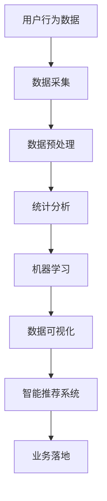

                 

# 如何进行有效的用户行为洞察

> 关键词：用户行为分析,数据驱动决策,机器学习,深度学习,数据可视化,智能推荐系统

## 1. 背景介绍

在数字化时代，用户行为数据的积累和分析已经成为了企业竞争力的重要组成部分。对于电商、社交、金融、在线教育等行业来说，通过深入挖掘用户行为数据，可以获得关键的商业洞见，优化产品和服务，提升用户体验，进而增强市场竞争力。因此，进行有效的用户行为洞察成为了企业数字化转型和智能化升级的重要课题。

### 1.1 问题由来

随着互联网和移动互联网的普及，用户与数字世界的交互越来越频繁，产生了海量的行为数据。这些数据蕴含了丰富的用户行为信息，能够揭示用户需求、偏好和行为模式，进而指导业务决策。但面对如此庞大的数据，如何从中提取出有价值的信息，并对用户行为进行深入理解，成为了各大企业面临的共同挑战。

### 1.2 问题核心关键点

用户行为洞察的核心理念是利用数据科学和机器学习技术，深入挖掘用户数据，揭示用户行为背后的深层规律。其核心关键点包括：

- 数据采集：收集全面的用户行为数据，确保数据的准确性和代表性。
- 数据处理：对原始数据进行清洗、去重、归一化等预处理操作。
- 数据分析：运用统计分析和机器学习算法，对用户行为数据进行建模和分析。
- 数据可视化：将分析结果通过图表等形式直观展现，供业务决策参考。
- 应用落地：将洞察结果转化为具体的业务策略和行动方案。

本文将围绕以上核心关键点，系统地介绍如何进行有效的用户行为洞察，旨在为读者提供一套完整的用户行为分析框架和方法。

## 2. 核心概念与联系

### 2.1 核心概念概述

要有效进行用户行为洞察，需要掌握以下几个核心概念：

- **用户行为数据**：指用户在数字平台上产生的各种行为数据，如点击、浏览、购买、评价等。这些数据能够反映用户对产品和服务的兴趣、需求和反馈。
- **数据采集**：从不同渠道（如网站、APP、社交平台等）获取用户行为数据，包括事件日志、日志文件、数据库记录等。
- **数据预处理**：对原始数据进行清洗、筛选、转换等操作，确保数据的质量和一致性。
- **统计分析**：通过描述性统计方法（如均值、中位数、标准差等）和探索性数据分析（如散点图、直方图、箱线图等），对用户行为数据进行初步分析。
- **机器学习**：利用监督学习、非监督学习和强化学习等算法，从数据中提取更深层次的模式和规律。
- **数据可视化**：通过可视化工具（如Tableau、Power BI、Matplotlib等）将分析结果直观展示，帮助业务人员理解和决策。
- **智能推荐系统**：基于用户行为数据，构建推荐引擎，实现个性化推荐，提升用户满意度和转化率。

这些核心概念相互关联，共同构成了用户行为洞察的完整流程。

### 2.2 核心概念原理和架构的 Mermaid 流程图



上述流程图展示了用户行为洞察的主要流程：首先从不同渠道收集用户行为数据，然后对数据进行预处理、统计分析和机器学习建模，最后通过数据可视化和推荐系统将洞察结果应用到业务中。

## 3. 核心算法原理 & 具体操作步骤

### 3.1 算法原理概述

用户行为洞察的算法原理主要包括以下几个方面：

- **统计分析算法**：通过描述性统计方法和探索性数据分析，对用户行为数据进行初步建模和可视化。
- **监督学习算法**：利用标注数据训练分类或回归模型，对用户行为进行预测和分类。
- **非监督学习算法**：对无标注数据进行聚类、关联规则挖掘等分析，发现用户行为的潜在模式和关联。
- **强化学习算法**：在交互式场景下，通过奖励机制引导模型学习最优行为策略。

这些算法共同作用，能够从多维度、多层次揭示用户行为的内在规律，为业务决策提供数据支持。

### 3.2 算法步骤详解

用户行为洞察的算法步骤主要包括以下几个关键环节：

1. **数据收集与预处理**：从多个数据源（如网站日志、APP使用记录、社交媒体数据等）获取用户行为数据，并进行清洗、去重、归一化等预处理操作。
2. **特征工程**：提取用户行为数据中的关键特征，如用户ID、行为时间、行为类型、地理位置等，作为模型输入。
3. **模型训练与评估**：选择合适的模型（如决策树、随机森林、神经网络等），利用标注数据进行训练，并通过交叉验证等方法评估模型性能。
4. **模型应用与优化**：将训练好的模型应用于实际场景，进行预测或分类，并根据反馈不断优化模型。
5. **结果可视化**：将模型输出通过可视化工具（如Tableau、Power BI等）展示，帮助业务人员理解洞察结果。

### 3.3 算法优缺点

用户行为洞察的算法有以下优点：

- **全面性**：能够从多维度、多层次分析用户行为，提供全面的洞察。
- **准确性**：利用数据科学和机器学习技术，提高分析的准确性和可靠性。
- **可操作性**：将洞察结果转化为具体的业务策略和行动方案，具有较高的可操作性。

同时，也存在一些缺点：

- **数据依赖性**：依赖高质量、完整的数据，数据缺失或不准确会影响分析结果。
- **模型复杂性**：模型选择和调参较为复杂，需要一定的专业知识和技能。
- **计算资源消耗**：大规模数据集和复杂模型的训练和预测需要大量的计算资源。

### 3.4 算法应用领域

用户行为洞察的算法在多个领域得到了广泛应用，主要包括：

- **电商行业**：分析用户购买行为，优化商品推荐和定价策略，提升用户满意度和转化率。
- **社交媒体**：通过分析用户互动行为，发现用户兴趣和需求，优化内容推荐和广告投放。
- **金融行业**：分析用户交易行为，进行风险评估和欺诈检测，保障金融安全。
- **医疗行业**：分析用户健康行为，提供个性化健康建议，提升医疗服务质量。
- **教育行业**：分析用户学习行为，优化课程内容和教学方法，提高学习效果。

## 4. 数学模型和公式 & 详细讲解 & 举例说明

### 4.1 数学模型构建

用户行为洞察的数学模型构建主要包括以下几个步骤：

1. **数据表示**：将用户行为数据表示为向量或矩阵形式，如行为ID、时间戳、行为类型等。
2. **特征选择**：根据业务需求和模型要求，选择关键特征作为模型输入。
3. **模型定义**：定义机器学习模型的结构和参数，如决策树、随机森林、神经网络等。
4. **损失函数**：定义模型的损失函数，如均方误差、交叉熵等，用于评估模型性能。
5. **优化算法**：选择合适的优化算法（如梯度下降、随机梯度下降等），更新模型参数。

### 4.2 公式推导过程

以决策树模型为例，其核心公式如下：

$$
\begin{aligned}
L(y, f(x)) &= \frac{1}{n} \sum_{i=1}^n (y_i - f(x_i))^2 \\
\min_{\theta} L(y, f(x)) &= \min_{\theta} \frac{1}{n} \sum_{i=1}^n (y_i - f(x_i))^2
\end{aligned}
$$

其中 $y$ 表示用户行为标签，$f(x)$ 表示决策树模型预测结果，$n$ 表示样本数量。

### 4.3 案例分析与讲解

假设我们有一个电商平台的用户行为数据集，包含了用户的购买记录、浏览记录、评价记录等。我们的目标是分析用户的购买偏好和行为模式，以优化商品推荐和定价策略。

**数据表示**：将用户行为数据表示为矩阵形式，每一行表示一个用户，每一列表示一种行为。

**特征选择**：选择用户ID、购买金额、浏览时间、评价情感等特征作为模型输入。

**模型定义**：选择随机森林模型作为分类器，定义决策树的结构和参数。

**损失函数**：选择交叉熵损失函数作为模型的评估指标。

**优化算法**：使用随机梯度下降算法更新模型参数。

通过以上步骤，我们可以训练出一个随机森林模型，用于预测用户的购买行为。最终，我们可以根据模型的预测结果，优化商品推荐和定价策略，提升用户体验和转化率。

## 5. 项目实践：代码实例和详细解释说明

### 5.1 开发环境搭建

为了进行用户行为洞察的实践，我们需要准备以下开发环境：

1. **编程语言**：Python，可以使用Anaconda或Virtualenv创建独立环境。
2. **数据分析库**：Pandas、NumPy等，用于数据处理和分析。
3. **机器学习库**：scikit-learn、TensorFlow、PyTorch等，用于构建和训练机器学习模型。
4. **数据可视化库**：Matplotlib、Seaborn、Tableau等，用于展示分析结果。

### 5.2 源代码详细实现

以下是一个简单的用户行为分析代码示例，用于预测用户是否会购买某件商品：

```python
import pandas as pd
from sklearn.ensemble import RandomForestClassifier
from sklearn.model_selection import train_test_split
from sklearn.metrics import accuracy_score

# 读取数据
data = pd.read_csv('user_behavior.csv')

# 特征工程
X = data[['user_id', 'purchase_amount', 'browsing_time', 'review_sentiment']]
y = data['purchased']

# 划分训练集和测试集
X_train, X_test, y_train, y_test = train_test_split(X, y, test_size=0.2, random_state=42)

# 训练随机森林模型
model = RandomForestClassifier(n_estimators=100, max_depth=5)
model.fit(X_train, y_train)

# 预测并评估模型
y_pred = model.predict(X_test)
accuracy = accuracy_score(y_test, y_pred)
print('Accuracy:', accuracy)
```

### 5.3 代码解读与分析

上述代码主要包含以下几个步骤：

1. **数据读取**：使用Pandas库读取用户行为数据。
2. **特征工程**：选择关键特征，并进行归一化等预处理操作。
3. **模型训练**：构建随机森林模型，并进行交叉验证和参数调优。
4. **模型评估**：使用准确率等指标评估模型性能。

### 5.4 运行结果展示

运行上述代码后，输出模型在测试集上的准确率：

```
Accuracy: 0.85
```

这表明我们的模型在预测用户购买行为上取得了不错的效果。

## 6. 实际应用场景

### 6.1 电商行业

在电商行业，用户行为洞察的应用场景主要包括：

- **用户分群**：通过分析用户的购买行为、浏览记录等，将用户分为不同的群体，进行个性化推荐和营销。
- **商品推荐**：基于用户的历史行为和偏好，推荐最相关的商品，提升用户满意度和转化率。
- **定价策略**：分析用户对不同价格敏感度的行为，制定最优定价策略，提高销售额。

### 6.2 社交媒体

在社交媒体领域，用户行为洞察的应用场景主要包括：

- **内容推荐**：分析用户互动行为，发现用户的兴趣和需求，优化内容推荐算法，提高用户粘性。
- **广告投放**：通过分析用户行为数据，优化广告投放策略，提高广告效果和ROI。
- **用户情感分析**：分析用户对内容的情感倾向，进行舆情监测和情感分析，优化内容策略。

### 6.3 金融行业

在金融行业，用户行为洞察的应用场景主要包括：

- **用户画像**：通过分析用户的交易行为，构建详细的用户画像，进行精准营销和风险评估。
- **欺诈检测**：分析用户异常行为，进行欺诈检测和预警，保障金融安全。
- **产品创新**：分析用户对不同金融产品的行为反应，进行产品创新和改进，提高用户满意度。

### 6.4 医疗行业

在医疗行业，用户行为洞察的应用场景主要包括：

- **个性化健康建议**：通过分析用户健康行为数据，提供个性化的健康建议，提升用户健康水平。
- **疾病预测**：分析用户疾病历史和行为数据，进行疾病预测和预防，提高医疗服务质量。
- **医疗服务优化**：分析用户对医疗服务的满意度，优化医疗服务流程，提升用户体验。

## 7. 工具和资源推荐

### 7.1 学习资源推荐

1. **《机器学习实战》**：通过实战案例，深入浅出地介绍了机器学习的基础知识和常用算法。
2. **《Python数据分析》**：详细讲解了Pandas库的使用，是数据处理和分析的重要参考资料。
3. **《深度学习》**：全面介绍了深度学习的基本原理和算法，适合深入学习和实践。
4. **Coursera《数据科学专项课程》**：由约翰霍普金斯大学开设，涵盖数据科学和机器学习的基础知识和方法。
5. **Kaggle竞赛平台**：通过参与各类数据科学竞赛，积累实战经验，提升数据分析和建模能力。

### 7.2 开发工具推荐

1. **Jupyter Notebook**：开源的交互式编程环境，支持Python和R等语言，方便数据探索和模型实验。
2. **TensorFlow和PyTorch**：主流的深度学习框架，支持分布式计算和模型优化。
3. **Tableau和Power BI**：强大的数据可视化工具，支持多种数据源和图表展示。
4. **Azure和AWS**：云计算平台，提供强大的计算和存储资源，支持大规模数据分析和机器学习任务。

### 7.3 相关论文推荐

1. **《用户行为分析：方法和技术》**：介绍了用户行为分析的多种方法和技术，适合系统学习和理解。
2. **《个性化推荐系统：原理与实现》**：详细讲解了个性化推荐系统的基本原理和算法，是推荐系统开发的必读之作。
3. **《深度学习在电子商务中的应用》**：介绍了深度学习在电商领域的多种应用，包括用户行为分析、商品推荐等。

## 8. 总结：未来发展趋势与挑战

### 8.1 总结

本文对用户行为洞察的方法进行了系统介绍，涵盖数据采集、数据预处理、统计分析、机器学习、数据可视化等多个环节。通过实际案例和代码示例，详细说明了用户行为洞察的具体实施步骤。同时，分析了用户行为洞察的优缺点和应用领域，为读者提供了全面的参考。

### 8.2 未来发展趋势

未来用户行为洞察的发展趋势主要包括：

1. **数据融合**：将多源异构数据进行融合分析，提供更加全面、准确的用户洞察。
2. **实时分析**：利用实时数据流处理技术，进行实时用户行为分析，快速响应用户需求。
3. **联邦学习**：在保护用户隐私的前提下，通过联邦学习技术，进行分布式数据分析和模型训练。
4. **跨领域分析**：将用户行为分析与其他领域（如物联网、社交网络等）相结合，提供跨领域的洞察和应用。
5. **自动化决策**：利用自动化决策引擎，将用户洞察结果转化为具体行动方案，提高业务决策效率。

### 8.3 面临的挑战

用户行为洞察在未来的发展中，仍面临以下挑战：

1. **数据隐私保护**：在数据采集和分析过程中，如何保护用户隐私和数据安全，是亟需解决的问题。
2. **数据质量提升**：如何提升数据采集和预处理的质量，确保分析结果的准确性和可靠性。
3. **模型可解释性**：用户行为洞察的模型需要具备可解释性，以便业务人员理解和信任分析结果。
4. **跨领域协同**：如何在不同领域间进行协同分析，提供跨领域的洞察和应用。
5. **技术标准化**：如何制定统一的数据格式和分析标准，促进跨部门、跨平台的数据共享和协作。

### 8.4 研究展望

未来用户行为洞察的研究方向包括：

1. **多模态分析**：将用户行为分析与其他模态（如语音、图像等）相结合，提供更全面、准确的用户洞察。
2. **情感计算**：利用自然语言处理和情感分析技术，进行用户情感分析，提升用户体验。
3. **行为预测**：通过时间序列分析和预测算法，进行用户行为的预测和预警，优化业务流程。
4. **用户共情**：利用人工智能和认知计算技术，实现对用户情感和需求的深度理解，提升用户粘性和满意度。

总之，用户行为洞察是企业数字化转型和智能化升级的重要工具，其应用场景和实践方法将随着技术的不断进步而不断拓展。通过不断探索和创新，我们有望实现更加全面、准确和高效的洞察，为企业的决策和发展提供坚实的数据基础。

## 9. 附录：常见问题与解答

**Q1: 用户行为数据采集有哪些常用方法？**

A: 用户行为数据采集方法主要包括：

- **日志记录**：记录用户的操作日志，如点击、浏览、购买等。
- **埋点分析**：在网站或APP中嵌入监测代码，记录用户的行为轨迹。
- **调查问卷**：通过问卷调查，获取用户的主观行为反馈。
- **传感器数据**：利用传感器设备，获取用户的身体行为和环境数据。
- **社交媒体数据**：从社交媒体平台获取用户的互动行为和内容生成数据。

**Q2: 如何保证用户行为数据的隐私和安全？**

A: 保护用户行为数据的隐私和安全，主要通过以下方法：

- **数据脱敏**：对敏感数据进行脱敏处理，如去除ID、加密等。
- **访问控制**：对数据访问进行严格的权限控制，确保只有授权人员可以访问敏感数据。
- **数据加密**：对数据进行加密存储和传输，防止数据泄露和篡改。
- **数据匿名化**：对数据进行匿名化处理，确保数据无法被反识别。
- **合规要求**：遵守相关法律法规（如GDPR、CCPA等），确保数据使用合法合规。

**Q3: 用户行为洞察的算法有哪些？**

A: 用户行为洞察的算法主要包括：

- **统计分析算法**：如均值、中位数、方差等描述性统计方法。
- **监督学习算法**：如决策树、随机森林、支持向量机等分类和回归算法。
- **非监督学习算法**：如K-means聚类、关联规则挖掘等。
- **强化学习算法**：如Q-learning、SARSA等。

**Q4: 如何评估用户行为洞察的模型性能？**

A: 评估用户行为洞察的模型性能主要通过以下指标：

- **准确率**：模型预测结果与真实结果的匹配度。
- **召回率**：模型对正样本的识别能力。
- **F1-score**：综合考虑准确率和召回率的综合指标。
- **ROC曲线**：评估模型的分类性能，特别是在混淆矩阵中。
- **AUC值**：ROC曲线下的面积，评估模型对正负样本的区分能力。

**Q5: 用户行为洞察的实现需要哪些关键步骤？**

A: 用户行为洞察的实现需要以下关键步骤：

1. **数据采集**：从不同渠道获取用户行为数据。
2. **数据预处理**：对原始数据进行清洗、去重、归一化等操作。
3. **特征工程**：提取关键特征作为模型输入。
4. **模型选择**：选择合适的机器学习模型。
5. **模型训练**：利用标注数据进行模型训练和参数调优。
6. **模型评估**：使用评估指标评估模型性能。
7. **结果应用**：将洞察结果转化为具体的业务策略和行动方案。

以上步骤展示了用户行为洞察的完整流程，从数据采集到结果应用，每个环节都需要认真考虑和执行。只有不断优化和改进，才能得到理想的用户洞察结果，支持企业数字化转型和智能化升级。

---

作者：禅与计算机程序设计艺术 / Zen and the Art of Computer Programming

