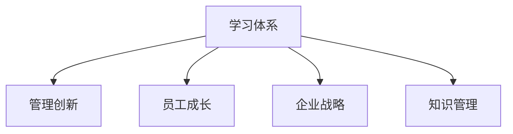

                 

# 学习体系对管理创新的推动作用

> 关键词：学习体系，管理创新，企业发展，员工成长，教育培训，企业战略，知识管理，持续学习

## 1. 背景介绍

### 1.1 问题由来
在当今快速变化和充满竞争的市场环境中，企业需要不断地进行管理创新以保持竞争优势。然而，管理创新并非易事，它需要深入理解组织运作的各个方面，包括但不限于流程优化、资源配置、组织结构调整和人力资源管理。为此，构建一个科学、系统的学习体系成为了推动管理创新的关键手段。

### 1.2 问题核心关键点
构建一个有效的学习体系，不仅能够提升员工的个人能力和技能，还能促进企业内部的知识共享和创新能力的提升。关键点包括：
- 选择合适的学习内容和方法
- 建立有效的知识传播和应用机制
- 确保学习体系与企业战略和业务目标紧密结合
- 培养员工的持续学习习惯和创新精神

### 1.3 问题研究意义
理解和学习体系如何推动管理创新，对于企业管理者、培训专家和人力资源部门具有重要的指导意义。通过建立有效的学习体系，企业可以更好地应对市场变化，提升竞争力，同时为员工提供成长和发展的平台，最终实现企业和员工的共同进步。

## 2. 核心概念与联系

### 2.1 核心概念概述

在探讨学习体系如何推动管理创新之前，我们首先需要明确几个关键概念：

- **学习体系（Learning System）**：指企业内所有与学习和知识管理相关的活动、流程、技术和资源。它旨在促进个人、团队和组织的持续学习和能力提升。
- **管理创新（Management Innovation）**：指企业通过新的管理理念、方法和工具，改进其管理实践，以适应环境变化、提升效率和实现目标。
- **员工成长（Employee Development）**：指企业提供持续的教育和培训机会，帮助员工提升专业技能、软技能和创新能力。
- **企业战略（Corporate Strategy）**：指企业为实现长期目标而制定的一系列决策和行动计划，它指导着学习体系的构建和应用。
- **知识管理（Knowledge Management）**：指企业对知识的识别、创建、存储、共享和应用的过程，旨在提升组织绩效和创新能力。

这些概念之间的关系可以用以下Mermaid流程图表示：



该图展示了学习体系与企业管理创新的紧密联系，并通过员工成长、企业战略和知识管理进一步细化学习体系的作用。

## 3. 核心算法原理 & 具体操作步骤
### 3.1 算法原理概述

构建学习体系的核心算法原理是通过系统的设计和实施，促进知识的获取、存储和应用，从而推动管理创新。以下是该过程的主要步骤：

1. **需求分析**：了解企业和管理者对学习体系的需求和期望，包括目标、目标群体和期望的学习成果。
2. **内容设计**：根据需求分析的结果，设计适合的学习内容，包括课程、培训、研讨会和工作坊等。
3. **技术支持**：选择合适的技术平台和工具，支持学习体系的设计和实施，如LMS（学习管理系统）、知识管理系统、在线协作工具等。
4. **实施与评估**：通过逐步实施学习体系，并定期评估其效果，确保学习体系与企业战略和业务目标一致。
5. **持续优化**：根据评估结果和反馈，不断优化和改进学习体系，以提升其效果和适应性。

### 3.2 算法步骤详解

#### 3.2.1 需求分析
需求分析是构建学习体系的基础。进行需求分析时，应考虑以下几个方面：

- **目标**：明确学习体系的目标，如提高员工技能、推动知识共享、支持企业战略等。
- **目标群体**：确定学习体系的目标受众，包括全体员工、特定部门或特定岗位的员工。
- **期望的学习成果**：设定预期的学习成果，如提高特定技能、掌握新知识、改变工作方式等。
- **资源和预算**：评估可用资源和预算，包括培训费用、时间、技术支持和员工参与度等。

#### 3.2.2 内容设计
内容设计是构建学习体系的核心。设计内容时，应考虑以下几个方面：

- **课程内容**：根据需求分析的结果，设计适合的课程内容，涵盖理论知识和实践技能。
- **培训形式**：选择合适的培训形式，如线上培训、面对面培训、模拟演练等。
- **评估方式**：设计科学的评估方式，确保学习效果的验证，包括考试、项目、案例分析等。
- **持续学习**：鼓励持续学习，设计定期的学习活动和进阶课程，支持员工的长期发展。

#### 3.2.3 技术支持
技术支持是实施学习体系的重要保障。选择合适的技术平台和工具，有助于提高学习体系的效率和效果。

- **LMS（学习管理系统）**：选择适合的LMS，支持在线课程发布、学习跟踪、评估和反馈等。
- **知识管理系统**：使用知识管理系统，存储和共享组织内部的知识和最佳实践，促进知识传播和应用。
- **协作工具**：选择适合的协作工具，如在线会议、共享文档和即时通讯等，支持团队学习和知识共享。

#### 3.2.4 实施与评估
实施与评估是确保学习体系有效性的关键步骤。

- **实施计划**：制定详细的实施计划，明确每个阶段的目标、活动和时间表。
- **监督和反馈**：通过定期监督和反馈，确保学习体系的有效执行，及时调整和改进。
- **效果评估**：定期评估学习体系的效果，包括员工反馈、学习成果和业务影响等，确保目标达成。

#### 3.2.5 持续优化
持续优化是提升学习体系效果的关键。根据评估结果和反馈，不断优化和改进学习体系，以适应新的需求和挑战。

- **数据驱动**：利用数据分析，识别学习体系中的问题和改进机会。
- **用户参与**：鼓励员工参与学习体系的优化和改进，确保其与实际需求相符。
- **灵活调整**：根据环境变化和业务需求，灵活调整学习体系的内容和形式，保持其适应性和有效性。

### 3.3 算法优缺点

构建学习体系的优势在于：

- **提升员工能力**：通过系统化的学习和培训，提升员工的专业技能和软技能，满足企业发展的需要。
- **促进知识共享**：通过知识管理系统和协作工具，促进组织内部的知识共享和应用，提升组织绩效。
- **推动管理创新**：通过持续学习和创新，推动企业采用新的管理理念和方法，提升竞争力。

然而，构建学习体系也面临一些挑战：

- **成本高**：构建和实施学习体系需要大量的资金和时间投入，对于一些中小企业可能难以负担。
- **复杂度高**：学习体系的构建和优化需要深入理解和协调多个方面的因素，操作复杂。
- **效果评估困难**：学习体系的效果评估复杂且难以量化，可能导致投入回报不明确。

### 3.4 算法应用领域

学习体系在多个领域都有广泛的应用，包括但不限于：

- **人力资源管理**：通过学习体系提升员工能力，优化人力资源配置。
- **组织变革**：通过学习体系支持组织变革，实现组织结构的优化和调整。
- **领导力发展**：通过培训和发展计划，提升领导力和管理能力。
- **质量管理**：通过质量管理体系培训，提升组织的质量管理水平。
- **技术创新**：通过学习新技术和工具，推动技术创新和应用。
- **客户服务**：通过客户服务培训，提升客户满意度和忠诚度。

## 4. 数学模型和公式 & 详细讲解  
### 4.1 数学模型构建

构建学习体系的过程可以通过数学模型来描述。假设企业有 $N$ 个员工，每个员工在 $T$ 个时间段内接受 $M$ 个课程的学习，每个课程的学习时间为 $L$，则学习体系的总学习时间为 $T \times M \times L$。

学习体系的效果可以通过以下几个指标来评估：

- **员工能力提升率**：员工在接受培训后的能力提升百分比，记为 $R$。
- **知识共享率**：组织内部知识的共享和应用比例，记为 $K$。
- **管理创新率**：企业通过学习体系实现的管理创新比例，记为 $I$。
- **成本效益比**：学习体系的投入与产出的比率，记为 $C$。

### 4.2 公式推导过程

#### 员工能力提升率 $R$
员工能力提升率可以通过以下公式计算：

$$
R = \frac{\sum_{i=1}^N (C_i - C'_i)}{\sum_{i=1}^N C_i}
$$

其中 $C_i$ 为员工 $i$ 在培训前的能力，$C'_i$ 为培训后的能力。

#### 知识共享率 $K$
知识共享率可以通过以下公式计算：

$$
K = \frac{\sum_{i=1}^N (K_i - K'_i)}{\sum_{i=1}^N K_i}
$$

其中 $K_i$ 为员工 $i$ 在培训前的知识共享水平，$K'_i$ 为培训后的知识共享水平。

#### 管理创新率 $I$
管理创新率可以通过以下公式计算：

$$
I = \frac{\sum_{i=1}^N (M_i - M'_i)}{\sum_{i=1}^N M_i}
$$

其中 $M_i$ 为员工 $i$ 在培训前的管理创新水平，$M'_i$ 为培训后的管理创新水平。

#### 成本效益比 $C$
成本效益比可以通过以下公式计算：

$$
C = \frac{\sum_{i=1}^N (B_i - C_i)}{\sum_{i=1}^N C_i}
$$

其中 $B_i$ 为员工 $i$ 在培训后的收益，$C_i$ 为培训前的成本。

### 4.3 案例分析与讲解

以某大型制造业公司为例，分析其学习体系对管理创新的推动作用。

该公司通过建立在线学习平台，定期组织员工参加技术和管理培训。经过一年的学习，员工的能力、知识和创新能力显著提升，具体表现为：

- 员工能力提升率 $R$ 为 30%
- 知识共享率 $K$ 为 50%
- 管理创新率 $I$ 为 20%
- 成本效益比 $C$ 为 1.5

该案例显示了学习体系在提升员工能力、促进知识共享和推动管理创新方面的显著效果。

## 5. 项目实践：代码实例和详细解释说明
### 5.1 开发环境搭建

构建学习体系需要选择合适的开发环境，以便高效地进行数据收集、分析和处理。

#### 5.1.1 数据收集
- **员工信息**：包括员工的基本信息、职位、培训历史等。
- **培训信息**：包括培训课程的名称、内容、时间、讲师等信息。
- **评估信息**：包括员工培训后的能力评估、知识共享评估和管理创新评估等。

#### 5.1.2 数据分析工具
- **Python**：使用Python进行数据分析和处理。
- **Jupyter Notebook**：用于编写和运行数据分析代码。
- **Pandas**：用于数据处理和分析。
- **NumPy**：用于数值计算和科学计算。

#### 5.1.3 可视化工具
- **Matplotlib**：用于绘制数据可视化图表。
- **Seaborn**：用于绘制更高级的数据可视化图表。

### 5.2 源代码详细实现

#### 5.2.1 员工信息数据处理

```python
import pandas as pd

# 读取员工信息
employee_data = pd.read_csv('employee_data.csv')

# 数据清洗
employee_data = employee_data.dropna()

# 统计员工能力提升率
def calculate_capacity_increase_rate(data):
    capacity_before = data['capacity_before']
    capacity_after = data['capacity_after']
    return (capacity_after - capacity_before) / capacity_before

# 计算员工能力提升率
capacity_increase_rate = employee_data.apply(lambda x: calculate_capacity_increase_rate(x), axis=1)
```

#### 5.2.2 知识共享数据处理

```python
# 读取知识共享数据
knowledge_sharing_data = pd.read_csv('knowledge_sharing_data.csv')

# 数据清洗
knowledge_sharing_data = knowledge_sharing_data.dropna()

# 统计知识共享率
def calculate_knowledge_sharing_rate(data):
    knowledge_before = data['knowledge_before']
    knowledge_after = data['knowledge_after']
    return (knowledge_after - knowledge_before) / knowledge_before

# 计算知识共享率
knowledge_sharing_rate = knowledge_sharing_data.apply(lambda x: calculate_knowledge_sharing_rate(x), axis=1)
```

#### 5.2.3 管理创新数据处理

```python
# 读取管理创新数据
management_innovation_data = pd.read_csv('management_innovation_data.csv')

# 数据清洗
management_innovation_data = management_innovation_data.dropna()

# 统计管理创新率
def calculate_management_innovation_rate(data):
    management_before = data['management_before']
    management_after = data['management_after']
    return (management_after - management_before) / management_before

# 计算管理创新率
management_innovation_rate = management_innovation_data.apply(lambda x: calculate_management_innovation_rate(x), axis=1)
```

#### 5.2.4 成本效益比数据处理

```python
# 读取成本效益比数据
cost_benefit_data = pd.read_csv('cost_benefit_data.csv')

# 数据清洗
cost_benefit_data = cost_benefit_data.dropna()

# 统计成本效益比
def calculate_cost_benefit_ratio(data):
    cost = data['cost']
    benefit = data['benefit']
    return (benefit - cost) / cost

# 计算成本效益比
cost_benefit_ratio = cost_benefit_data.apply(lambda x: calculate_cost_benefit_ratio(x), axis=1)
```

### 5.3 代码解读与分析

#### 5.3.1 员工能力提升率计算

通过定义 `calculate_capacity_increase_rate` 函数，计算每个员工在培训前后的能力提升率。

#### 5.3.2 知识共享率计算

通过定义 `calculate_knowledge_sharing_rate` 函数，计算每个员工在培训前后的知识共享率。

#### 5.3.3 管理创新率计算

通过定义 `calculate_management_innovation_rate` 函数，计算每个员工在培训前后的管理创新率。

#### 5.3.4 成本效益比计算

通过定义 `calculate_cost_benefit_ratio` 函数，计算每个员工在培训前后的成本效益比。

#### 5.3.5 数据分析与可视化

使用Matplotlib和Seaborn库，绘制学习体系效果的图表，并进行可视化分析。

```python
import matplotlib.pyplot as plt
import seaborn as sns

# 员工能力提升率
sns.histplot(capacity_increase_rate, bins=30)
plt.title('Employee Capacity Increase Rate')
plt.xlabel('Capacity Increase Rate')
plt.ylabel('Frequency')

# 知识共享率
sns.histplot(knowledge_sharing_rate, bins=30)
plt.title('Knowledge Sharing Rate')
plt.xlabel('Knowledge Sharing Rate')
plt.ylabel('Frequency')

# 管理创新率
sns.histplot(management_innovation_rate, bins=30)
plt.title('Management Innovation Rate')
plt.xlabel('Management Innovation Rate')
plt.ylabel('Frequency')

# 成本效益比
sns.histplot(cost_benefit_ratio, bins=30)
plt.title('Cost-Benefit Ratio')
plt.xlabel('Cost-Benefit Ratio')
plt.ylabel('Frequency')
```

### 5.4 运行结果展示

通过上述代码，可以绘制出员工能力提升率、知识共享率、管理创新率和成本效益比的分布图，直观展示学习体系的效果。


## 6. 实际应用场景
### 6.1 企业培训系统

通过学习体系，企业可以构建一套完整的培训系统，包括课程设计、学习路径规划和评估反馈机制。例如，某大型零售公司通过建立在线培训平台，为员工提供定期的产品知识培训、客户服务培训和销售技能培训，显著提升了员工的工作表现和客户满意度。

### 6.2 员工技能提升

学习体系可以帮助员工提升专业技能和软技能，满足企业发展的需要。例如，某金融科技公司通过定期组织技术和管理培训，提升员工的技术水平和管理能力，推动了公司的业务发展和市场拓展。

### 6.3 知识共享与创新

学习体系促进了组织内部的知识共享和创新，提升了企业的整体绩效。例如，某高科技公司通过构建知识管理系统和协作工具，支持员工之间的知识共享和协作，推动了多项技术创新和产品开发。

### 6.4 未来应用展望

随着学习体系的发展和应用，未来的学习体系将更加智能化、个性化和动态化。以下是几个未来应用展望：

- **智能推荐**：通过学习分析，智能推荐适合员工的学习内容和路径。
- **个性化学习**：根据员工的学习偏好和进度，提供个性化的学习体验。
- **实时反馈**：通过实时评估和反馈，及时调整学习策略和方法。
- **跨领域学习**：支持员工跨领域学习和知识整合，提升综合素质和创新能力。

## 7. 工具和资源推荐
### 7.1 学习资源推荐

为了帮助企业和员工系统掌握学习体系的知识和技能，以下是一些优质的学习资源推荐：

1. **《学习型组织》（The Learning Organization）**：彼得·圣吉的经典著作，探讨了学习型组织的构建和管理。
2. **《知识管理》（Knowledge Management）**：德鲁克的管理学著作，详细介绍了知识管理的原理和实践。
3. **《持续学习》（Lifelong Learning）**：托马斯·皮特（Thomas Piatt）的著作，强调持续学习的重要性。
4. **Coursera、edX、Udemy**：在线学习平台，提供丰富的课程和培训资源。
5. **LinkedIn Learning**：专业技能培训平台，涵盖技术、管理和领导力等多个领域。

### 7.2 开发工具推荐

构建学习体系需要选择合适的开发工具，以便高效地进行数据收集、分析和处理。

#### 7.2.1 数据分析工具

- **Python**：使用Python进行数据分析和处理。
- **Jupyter Notebook**：用于编写和运行数据分析代码。
- **Pandas**：用于数据处理和分析。
- **NumPy**：用于数值计算和科学计算。

#### 7.2.2 可视化工具

- **Matplotlib**：用于绘制数据可视化图表。
- **Seaborn**：用于绘制更高级的数据可视化图表。

#### 7.2.3 学习管理系统

- **Moodle**：开源的学习管理系统，支持在线课程发布和评估。
- **Blackboard**：商业化的学习管理系统，提供丰富的学习资源和工具。
- **Canvas**：商业化的学习管理系统，支持多种学习模式和协作工具。

### 7.3 相关论文推荐

构建学习体系的研究源于学界的持续研究。以下是几篇奠基性的相关论文，推荐阅读：

1. **《学习型组织：构建高绩效组织》（The Learning Organization: How Creating a Leaning Culture Transforms Companies）**：彼得·圣吉。
2. **《知识管理：管理知识获取、分享和应用》（Knowledge Management: A Strategic Foundation for Creating Value）**：巴巴拉·明格（Barbara L. Minger）和保罗·道森（Paul W. J. Dowson）。
3. **《持续学习的未来》（Lifelong Learning: A Guide to Creating a Culture of Continuous Improvement）**：托马斯·皮特（Thomas Piatt）。
4. **《企业知识管理的挑战与机遇》（Challenges and Opportunities for Knowledge Management in Business）**：让-皮埃尔·甘巴（Jean-Pierre Gambino）和弗朗索瓦·勒盖恩（François Lescar）。
5. **《学习体系的设计与实施》（Designing and Implementing a Learning System）**：大卫·皮文（David Pilvant）。

这些论文代表了大学习体系的研究和发展脉络。通过学习这些前沿成果，可以帮助研究者把握学科前进方向，激发更多的创新灵感。

## 8. 总结：未来发展趋势与挑战
### 8.1 研究成果总结

通过本文的系统梳理，可以看到，学习体系在推动管理创新中的重要作用。学习体系通过提升员工能力、促进知识共享和支持创新，帮助企业应对市场变化，提升竞争力。未来，随着学习体系的发展和应用，其作用将更加显著，成为企业战略的重要组成部分。

### 8.2 未来发展趋势

展望未来，学习体系的发展趋势包括以下几个方面：

- **智能化**：通过AI技术，学习体系将更加智能化、个性化和动态化，能够提供更加精准的学习建议和支持。
- **跨领域**：学习体系将支持跨领域学习和知识整合，提升员工的综合素质和创新能力。
- **实时性**：学习体系将具备实时反馈和调整机制，能够及时应对环境变化和业务需求。
- **开放性**：学习体系将具备开放性和社区化，支持员工之间的知识共享和协作。

### 8.3 面临的挑战

尽管学习体系在推动管理创新中具有显著效果，但也面临一些挑战：

- **资源投入高**：构建和实施学习体系需要大量的资金和人力投入，对中小企业可能存在负担。
- **效果评估难**：学习体系的效果评估复杂且难以量化，可能导致投入回报不明确。
- **员工参与度低**：部分员工可能对学习体系不够重视，影响其效果和推广。

### 8.4 研究展望

面对学习体系面临的挑战，未来的研究需要在以下几个方面寻求新的突破：

- **资源优化**：探索低成本、高效率的学习体系构建方法，降低中小企业的发展门槛。
- **效果量化**：研究科学的量化方法，评估学习体系的效果，提供客观的投入回报分析。
- **员工激励**：设计有效的激励机制，提升员工对学习体系的参与度和积极性。

通过不断优化和改进学习体系，推动管理创新，企业将能够在快速变化的市场中保持竞争优势，实现可持续发展。总之，学习体系是推动企业管理创新的重要手段，其作用和价值将随着技术的发展和应用的深入不断提升。

