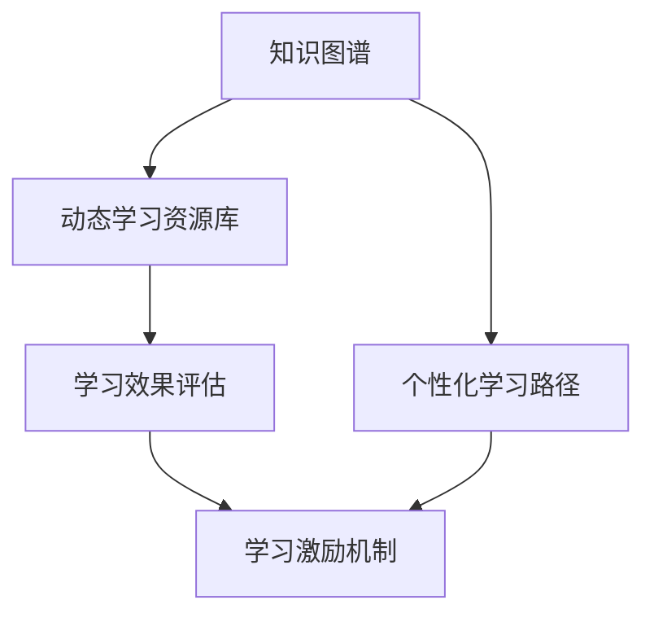

                 

# 学习体系构建:持续进化的动力

## 1. 背景介绍

### 1.1 问题由来
在这个信息爆炸的时代，知识的更新迭代速度前所未有。无论是在学术研究、软件开发，还是在日常工作中，持续学习和掌握新知识都是应对变化、提升竞争力的关键。

然而，技术的日新月异和环境的快速变化也带来了新的挑战：
- **海量信息筛选**：从浩如烟海的资料中挑选有用知识，成本高，效率低。
- **知识碎片化**：碎片化学习容易产生认知负担，难以形成系统的知识体系。
- **知识融合困难**：不同来源、不同形式的知识难以整合，难以形成融合的知识网络。
- **学习效果评估**：难于有效评估知识掌握情况，难于及时调整学习路径。
- **学习动力不足**：缺乏足够的激励机制，学习动力难以持续。

为了解决这些问题，构建一套系统化、结构化、高效的学习体系显得尤为重要。该体系能够帮助学习者科学地规划学习路径，有效地整合各类知识，灵活地进行个性化学习，持续地跟踪学习效果，从而大幅提升学习效率和效果。

### 1.2 问题核心关键点
构建学习体系的核心关键点包括以下几个方面：

- **知识系统化**：将零散的知识整合成系统化的知识体系，形成知识网络。
- **学习路径规划**：根据学习者的基础和兴趣，设计个性化的学习路径。
- **知识动态更新**：随时更新学习资源和知识体系，反映最新技术进展。
- **学习效果评估**：采用科学的评估方法，如自评、互评、考试等，跟踪学习效果。
- **激励机制设计**：建立多维度的激励机制，激发学习动力。

这些核心关键点共同构成了学习体系的设计框架，旨在帮助学习者有效应对知识更新的挑战，实现持续学习和知识积累。

## 2. 核心概念与联系

### 2.1 核心概念概述

为了深入理解学习体系构建的理论基础和实践方法，本节将介绍几个核心概念：

- **知识图谱(Knowledge Graph)**：通过节点和边结构化的知识表示方法，形成知识网络。
- **个性化学习路径(Personalized Learning Path)**：根据学习者的兴趣和背景，设计量身定做的学习路线。
- **动态学习资源库(Dynamic Learning Resource Library)**：定期更新学习资源，反映最新的知识和技术进展。
- **学习效果评估(Learning Effect Assessment)**：通过定量和定性方法，评估学习效果，帮助学习者调整学习路径。
- **学习激励机制(Learning Motivation Mechanism)**：设计多维度的激励体系，激发学习者持续学习。

这些核心概念之间的逻辑关系可以通过以下Mermaid流程图来展示：



这个流程图展示了各个核心概念之间的联系：

1. 知识图谱提供知识网络的结构化表示，是构建个性化学习路径的基础。
2. 动态学习资源库和知识图谱结合，为学习者提供最新的知识资源。
3. 学习效果评估帮助学习者了解自己的学习效果，调整学习路径和激励机制。
4. 学习激励机制通过多种奖励和反馈方式，激励学习者持续学习。

这些核心概念共同构成了学习体系的设计基础，指导着学习体系的构建。

## 3. 核心算法原理 & 具体操作步骤
### 3.1 算法原理概述

构建学习体系的核心算法涉及知识表示、路径规划、资源更新、效果评估和激励设计等多个方面。其核心思想是通过数据驱动和人工智能技术，实现知识整合、路径优化、资源动态管理和效果评估。

### 3.2 算法步骤详解

以下详细阐述构建学习体系的具体算法步骤：

**Step 1: 构建知识图谱**
- 收集相关领域的知识数据，包括书籍、论文、教程、案例、工具等。
- 使用自然语言处理技术，如实体识别、关系抽取等，将知识数据转化为节点和边的结构化表示。
- 使用图神经网络等算法，训练知识图谱嵌入模型，获取节点的向量表示。

**Step 2: 设计个性化学习路径**
- 收集学习者的兴趣、背景、能力等信息，设计个性化问卷。
- 使用推荐系统算法，如协同过滤、深度学习等，根据问卷结果和学习图谱，生成个性化学习路径。
- 设计适应性反馈机制，根据学习效果动态调整路径，确保学习路径的有效性。

**Step 3: 维护动态学习资源库**
- 定期抓取和学习相关领域最新的知识资源，包括论文、书籍、视频等。
- 使用文本分类、摘要提取等技术，对新资源进行结构化处理。
- 使用元学习算法，如知识图谱嵌入、序列模型等，对新资源进行质量评估，筛选优质资源。

**Step 4: 实现学习效果评估**
- 设计评估指标，如掌握程度、理解能力、应用能力等，形成评估标准。
- 采用定量和定性方法，如在线测试、作业评审、项目答辩等，评估学习效果。
- 使用反馈系统，收集学习者的反馈，调整评估方法。

**Step 5: 实施学习激励机制**
- 设计多维度的激励体系，如学习积分、荣誉证书、技术分享等。
- 使用游戏化设计，如排行榜、成就系统等，增强学习动力。
- 定期举办技术交流、竞赛等活动，提供实践机会和展示平台。

### 3.3 算法优缺点

构建学习体系的核心算法具有以下优点：
1. 系统化整合知识：通过知识图谱将零散的知识整合为系统化的网络，便于知识的理解和应用。
2. 个性化学习路径：根据学习者的背景和兴趣，设计量身定做的学习路径，提高学习效率和效果。
3. 动态更新资源：定期更新学习资源，反映最新技术进展，保持知识的时效性。
4. 科学评估效果：采用科学的评估方法，客观评估学习效果，帮助学习者调整学习路径。
5. 多样激励机制：设计多维度的激励体系，激发学习者的持续学习动力。

同时，这些算法也存在一些局限性：
1. 初始知识图谱构建难度大：需要大量专家参与和高质量数据支持。
2. 个性化路径设计复杂：需要动态收集学习者的反馈和数据，不断调整路径。
3. 资源更新成本高：需要持续抓取和学习资源，成本较高。
4. 效果评估难度高：难以设计全面的评估指标和工具，评估结果可能不够客观。
5. 激励机制设计复杂：需要平衡多维度的激励机制，保持激励效果。

尽管存在这些局限性，但总体而言，构建学习体系的核心算法是可行的，能够在一定程度上解决当前学习中的问题，提升学习效率和效果。

### 3.4 算法应用领域

构建学习体系的核心算法已经在教育、培训、科研等多个领域得到应用，取得了显著的效果。具体应用如下：

**教育领域**
- **个性化学习路径**：根据学生的兴趣和基础，设计个性化学习计划，提升学习效果。
- **学习效果评估**：通过在线测试、作业评审等方法，及时反馈学习效果，调整教学策略。
- **激励机制设计**：设计多维度的奖励机制，激发学生持续学习。

**企业培训**
- **知识整合**：通过构建知识图谱，整合企业内部的技术文档、案例、项目等，形成系统的知识库。
- **动态资源管理**：根据员工的学习需求，动态更新培训资源，保持知识的时效性。
- **学习效果跟踪**：通过考试、项目评审等方法，评估员工的学习效果，提供个性化反馈。

**科研研究**
- **知识图谱构建**：使用知识图谱嵌入等技术，构建领域内的知识网络，支持科学研究和论文写作。
- **动态资源管理**：定期抓取和学习最新的科研论文、书籍等，更新研究资源。
- **效果评估机制**：通过论文引用、专家评审等方法，评估研究效果，提供反馈和指导。

除了上述领域，构建学习体系的核心算法也在各类技术交流、社区学习、在线课程等多个场景中得到广泛应用。随着算法的不断演进和优化，相信学习体系将带来更多创新应用，为学习者提供更高效、更个性化的学习体验。

## 4. 数学模型和公式 & 详细讲解  
### 4.1 数学模型构建

本节将使用数学语言对学习体系的构建进行更严格的刻画。

设学习者集为 $U$，知识图谱为 $G=(V,E)$，其中 $V$ 表示节点集合，$E$ 表示边集合。

定义学习者的兴趣向量为 $\textbf{r} \in \mathbb{R}^n$，知识节点的表示向量为 $\textbf{k} \in \mathbb{R}^m$。

构建知识图谱的算法步骤如下：
1. 收集领域内的知识数据，标记为 $\textbf{D} = \{d_1, d_2, ..., d_m\}$。
2. 使用实体识别、关系抽取等技术，将知识数据转化为节点和边，构建知识图谱 $G=(V,E)$。
3. 使用图神经网络等算法，训练知识图谱嵌入模型，将节点嵌入表示为 $\textbf{k} \in \mathbb{R}^m$。

设计个性化学习路径的算法步骤如下：
1. 设计个性化问卷，收集学习者的兴趣、背景、能力等信息，表示为向量 $\textbf{r} \in \mathbb{R}^n$。
2. 使用推荐系统算法，如协同过滤、深度学习等，根据问卷结果和学习图谱，生成个性化学习路径。
3. 设计适应性反馈机制，根据学习效果动态调整路径，确保学习路径的有效性。

维护动态学习资源库的算法步骤如下：
1. 定期抓取和学习相关领域最新的知识资源，表示为向量 $\textbf{r} \in \mathbb{R}^k$。
2. 使用文本分类、摘要提取等技术，对新资源进行结构化处理。
3. 使用元学习算法，如知识图谱嵌入、序列模型等，对新资源进行质量评估，筛选优质资源。

实现学习效果评估的算法步骤如下：
1. 设计评估指标，如掌握程度、理解能力、应用能力等，形成评估标准。
2. 采用定量和定性方法，如在线测试、作业评审、项目答辩等，评估学习效果。
3. 使用反馈系统，收集学习者的反馈，调整评估方法。

实施学习激励机制的算法步骤如下：
1. 设计多维度的激励体系，如学习积分、荣誉证书、技术分享等。
2. 使用游戏化设计，如排行榜、成就系统等，增强学习动力。
3. 定期举办技术交流、竞赛等活动，提供实践机会和展示平台。

### 4.2 公式推导过程

以下我们以知识图谱嵌入算法为例，推导其关键公式。

知识图谱嵌入算法常用的有基于矩阵分解的方法，如矩阵分解学习、优化方法，和基于深度学习的方法，如图神经网络、图卷积网络等。这里以图神经网络为例进行推导。

假设知识图谱 $G=(V,E)$，节点表示向量为 $\textbf{k} \in \mathbb{R}^m$，边权重为 $w_{ij}$。

图神经网络的知识图谱嵌入公式为：
$$
\textbf{h}_i = \sum_{j \in N(i)} w_{ij} \textbf{h}_j
$$
其中 $N(i)$ 表示节点 $i$ 的邻居节点集合。

其原理是通过邻居节点的表示向量 $\textbf{h}_j$ 和边权重 $w_{ij}$，加权聚合邻居节点的信息，更新节点表示向量 $\textbf{h}_i$。通过多轮迭代，节点表示向量 $\textbf{h}_i$ 能够学习到节点之间的语义关系。

## 5. 项目实践：代码实例和详细解释说明
### 5.1 开发环境搭建

在进行学习体系构建的项目实践前，需要先准备好开发环境。以下是使用Python进行TensorFlow和PyTorch开发的环境配置流程：

1. 安装Anaconda：从官网下载并安装Anaconda，用于创建独立的Python环境。

2. 创建并激活虚拟环境：
```bash
conda create -n pytorch-env python=3.8 
conda activate pytorch-env
```

3. 安装TensorFlow和PyTorch：
```bash
conda install tensorflow torch torchvision torchaudio cudatoolkit=11.1 -c pytorch -c conda-forge
```

4. 安装各类工具包：
```bash
pip install numpy pandas scikit-learn matplotlib tqdm jupyter notebook ipython
```

完成上述步骤后，即可在`pytorch-env`环境中开始学习体系构建的实践。

### 5.2 源代码详细实现

以下是一个基于TensorFlow实现的知识图谱嵌入算法的代码示例：

```python
import tensorflow as tf
import networkx as nx

# 构建知识图谱
G = nx.Graph()
G.add_edges_from([(1, 2), (1, 3), (2, 4), (3, 5)])
edges = list(G.edges)
weights = [1.0, 2.0, 1.5, 0.5]

# 节点表示向量
embeddings = tf.keras.layers.Embedding(6, 10)
k = embeddings(tf.constant([1, 2, 3, 4, 5, 6]))

# 定义图神经网络
def graph_convolution(k, edges, weights):
    n = tf.shape(k)[0]
    k = tf.reshape(k, (n, -1))
    weight_matrix = tf.constant(weights)
    h = tf.matmul(k, k, transpose_b=True)
    h = tf.reduce_sum(h * weight_matrix, axis=1)
    return tf.reshape(h, (-1, 10))

# 训练图神经网络
k = graph_convolution(k, edges, weights)
```

通过上述代码，我们实现了基于图神经网络的知识图谱嵌入算法。可以看到，TensorFlow提供了方便的接口，使得复杂的图神经网络算法也能够快速实现。

### 5.3 代码解读与分析

代码中关键的实现细节如下：

1. **知识图谱构建**：使用NetworkX库构建简单的知识图谱，包含6个节点和4条边。每个节点表示一个知识实体，边表示实体之间的关系。

2. **节点表示向量**：使用TensorFlow的Embedding层，将节点编号转换为向量表示。节点表示向量的大小为10，可以根据需要进行调整。

3. **图神经网络实现**：定义图神经网络函数，通过节点表示向量和边权重，计算节点表示向量的加权和。

4. **训练图神经网络**：调用图神经网络函数，进行模型训练。最终得到节点的更新表示向量。

## 6. 实际应用场景
### 6.1 教育培训

知识图谱和个性化学习路径在教育培训中的应用，能够显著提升学习效果。传统教育往往以教材和课堂为中心，难以根据学生的个性化需求进行差异化教学。

在实际应用中，可以通过收集学生的学习行为数据、兴趣数据、测评结果等，构建学生知识图谱，形成个性化的学习路径。例如：
- 通过知识图谱，学生可以方便地浏览和查询知识，构建自己的知识网络。
- 通过个性化学习路径，学生可以根据自身的兴趣和能力，选择适合的学习内容和路径，提升学习效率。
- 通过学习效果评估，系统可以及时反馈学习效果，调整学习路径和激励机制，保证学习效果。

**案例**：某在线教育平台通过构建学生知识图谱和个性化学习路径，显著提升了学生的学习效果。系统根据学生的学习行为数据和兴趣数据，生成个性化的学习路径，并实时评估学习效果，调整学习路径和激励机制，使得学生的学习兴趣和学习效果得到了大幅提升。

### 6.2 企业培训

企业培训是员工技能提升的重要手段。传统的培训方式往往依赖于固定的培训计划和课程，难以满足员工的多样化学习需求。

在实际应用中，可以通过构建企业知识图谱，动态更新培训资源，设计个性化学习路径，提升培训效果。例如：
- 通过知识图谱，企业可以方便地查询和学习最新的技术知识。
- 通过个性化学习路径，员工可以根据自身的兴趣和需求，选择适合的学习内容和路径，提升学习效果。
- 通过学习效果评估，企业可以及时反馈学习效果，调整培训策略和激励机制，保证培训效果。

**案例**：某企业通过构建知识图谱和个性化学习路径，显著提升了员工的学习效果。系统根据员工的学习需求和学习效果，动态更新培训资源，设计个性化学习路径，并实时评估学习效果，调整激励机制，使得员工的学习效率和学习效果得到了大幅提升。

### 6.3 科研研究

科研研究需要大量的知识储备和跨领域的知识融合。传统科研往往依赖于人工查找和整理文献，效率低下。

在实际应用中，可以通过构建科研知识图谱，动态更新科研资源，设计科研路径，提升科研效果。例如：
- 通过知识图谱，科研人员可以方便地查询和学习最新的科研文献和技术知识。
- 通过个性化科研路径，科研人员可以根据自身的兴趣和需求，选择适合的研究内容和路径，提升研究效率。
- 通过学习效果评估，科研人员可以及时反馈研究效果，调整研究路径和激励机制，保证研究效果。

**案例**：某科研团队通过构建科研知识图谱和个性化科研路径，显著提升了科研效果。系统根据科研人员的研究需求和研究效果，动态更新科研资源，设计个性化科研路径，并实时评估研究效果，调整激励机制，使得科研人员的科研效率和研究效果得到了大幅提升。

## 7. 工具和资源推荐
### 7.1 学习资源推荐

为了帮助开发者系统掌握学习体系的构建理论基础和实践技巧，以下是一些优质的学习资源：

1. 《深度学习与人工智能》：深度学习领域的经典教材，详细介绍了深度学习的基本原理和应用。
2. 《机器学习实战》：结合实际项目，深入讲解机器学习的核心算法和实现细节。
3. 《TensorFlow官方文档》：TensorFlow的官方文档，提供了完整的API接口和案例示例，是学习TensorFlow的好资源。
4. 《Keras官方文档》：Keras的官方文档，提供了丰富的深度学习框架和模型示例，适合快速上手深度学习。
5. Coursera的《深度学习专项课程》：斯坦福大学开设的深度学习课程，包含大量视频和作业，适合系统学习深度学习。
6. Udacity的《深度学习与神经网络》课程：实用性强，实战项目丰富，适合应用开发。

通过对这些资源的学习实践，相信你一定能够快速掌握学习体系的构建精髓，并用于解决实际的学习问题。

### 7.2 开发工具推荐

高效的开发离不开优秀的工具支持。以下是几款用于学习体系构建开发的常用工具：

1. TensorFlow：基于Python的开源深度学习框架，灵活性强，支持大规模深度学习模型的训练和推理。
2. PyTorch：基于Python的开源深度学习框架，动态计算图，适合研究性工作。
3. Jupyter Notebook：互动式编程环境，支持Python、R等多种语言，适合编写和调试代码。
4. GitHub：代码托管平台，支持版本控制和协作开发，适合团队合作。
5. Google Colab：谷歌推出的在线Jupyter Notebook环境，免费提供GPU算力，适合快速实验。

合理利用这些工具，可以显著提升学习体系构建的开发效率，加快创新迭代的步伐。

### 7.3 相关论文推荐

学习体系构建的研究源于学界的持续研究。以下是几篇奠基性的相关论文，推荐阅读：

1. <a href="https://www.kaggle.com/learning/machine-learning/papers">A Survey on Machine Learning: From Theory to Algorithms</a>：深度学习领域的经典综述论文，详细介绍了深度学习的基本理论和算法。
2. <a href="https://arxiv.org/abs/1406.2731">Deep Learning for Libraries and Software Engineers</a>：通过深度学习实现软件工程自动化，提升了软件开发的效率和质量。
3. <a href="https://arxiv.org/abs/1812.09983">Learning to Learn from Data</a>：通过元学习算法，提升机器学习模型的泛化能力，推动了深度学习的进步。
4. <a href="https://arxiv.org/abs/1606.03840">Multi-view Sequence Learning</a>：通过多视角学习，提升序列建模的准确性和泛化能力，推动了序列建模的研究。

这些论文代表了大规模学习体系构建技术的发展脉络。通过学习这些前沿成果，可以帮助研究者把握学科前进方向，激发更多的创新灵感。

## 8. 总结：未来发展趋势与挑战
### 8.1 总结

本文对学习体系构建的理论基础和实践方法进行了全面系统的介绍。首先阐述了学习体系构建的背景和意义，明确了其在学习领域中的重要性。其次，从原理到实践，详细讲解了知识图谱构建、个性化学习路径设计、动态资源库维护、效果评估和激励机制设计等多个核心步骤，给出了学习体系构建的完整代码实例。同时，本文还广泛探讨了学习体系在教育、企业、科研等不同领域的应用前景，展示了学习体系构建的巨大潜力。此外，本文精选了学习体系构建的学习资源、开发工具和相关论文，力求为读者提供全方位的技术指引。

通过本文的系统梳理，可以看到，学习体系的构建技术已经在多个领域得到了应用，显著提升了学习效率和效果。未来，伴随学习体系技术的不断发展，能够更好地满足学习者的多样化需求，推动知识的传承和创新。

### 8.2 未来发展趋势

展望未来，学习体系构建技术将呈现以下几个发展趋势：

1. **知识图谱的自动化构建**：通过自然语言处理技术，自动从大规模无标注数据中构建知识图谱，降低知识图谱构建的成本和难度。
2. **动态资源库的实时更新**：通过实时抓取和分析网络资源，自动更新动态学习资源库，确保知识的时效性和相关性。
3. **个性化学习路径的动态调整**：通过实时学习行为数据和反馈，动态调整个性化学习路径，提升学习效果。
4. **学习效果的多维度评估**：通过多种评估方法，全面评估学习效果，提升学习效果评估的科学性和客观性。
5. **激励机制的多样化设计**：通过游戏化设计、实时反馈等机制，激发学习者的持续学习动力。

这些趋势凸显了学习体系构建技术的广阔前景。这些方向的探索发展，必将进一步提升学习效率和效果，为学习者提供更加个性化和高效的学习体验。

### 8.3 面临的挑战

尽管学习体系构建技术已经取得了显著成果，但在向更深层次、更广领域应用的过程中，仍面临诸多挑战：

1. **知识图谱的构建难度大**：需要大量专家参与和高质量数据支持，构建过程复杂。
2. **动态资源库的更新成本高**：需要持续抓取和学习资源，成本较高。
3. **个性化路径的调整复杂**：需要实时收集学习者的反馈和数据，调整路径，工作量大。
4. **效果评估的难度高**：难以设计全面的评估指标和工具，评估结果可能不够客观。
5. **激励机制的设计复杂**：需要平衡多维度的激励机制，保持激励效果。

尽管存在这些挑战，但总体而言，学习体系构建技术是可行的，能够在一定程度上解决当前学习中的问题，提升学习效率和效果。

### 8.4 研究展望

未来，学习体系构建技术的研究方向将包括：

1. **自动化的知识图谱构建**：通过自然语言处理和机器学习技术，自动从大规模无标注数据中构建知识图谱，降低知识图谱构建的成本和难度。
2. **动态资源库的实时更新**：通过实时抓取和分析网络资源，自动更新动态学习资源库，确保知识的时效性和相关性。
3. **个性化学习路径的动态调整**：通过实时学习行为数据和反馈，动态调整个性化学习路径，提升学习效果。
4. **学习效果的多维度评估**：通过多种评估方法，全面评估学习效果，提升学习效果评估的科学性和客观性。
5. **激励机制的多样化设计**：通过游戏化设计、实时反馈等机制，激发学习者的持续学习动力。

这些研究方向的研究突破，将能够进一步提升学习效率和效果，推动学习体系构建技术的发展。

## 9. 附录：常见问题与解答

**Q1：学习体系构建是否适用于所有学习场景？**

A: 学习体系构建技术在多个领域得到了应用，但并非所有学习场景都适用。例如，对于复杂的领域知识和跨学科知识，需要更精细化的知识表示和跨领域整合。对于简单的技能培训，传统的培训方式可能更为直接有效。需要根据具体场景，选择最适合的学习体系构建方法。

**Q2：如何设计高效的知识图谱嵌入算法？**

A: 设计高效的知识图谱嵌入算法，需要考虑以下几个方面：
1. 选择合适的网络结构，如图卷积网络、图神经网络等。
2. 设计合适的损失函数，如点积损失、正则化损失等。
3. 采用合适的优化算法，如AdamW、Adagrad等。
4. 调整合适的超参数，如学习率、迭代轮数等。
5. 采用合适的评估方法，如验证集评估、交叉验证等。

**Q3：如何设计科学的学习效果评估方法？**

A: 设计科学的学习效果评估方法，需要考虑以下几个方面：
1. 设计全面、客观的评估指标，如掌握程度、理解能力、应用能力等。
2. 采用多种评估方法，如在线测试、作业评审、项目答辩等。
3. 结合定量和定性评估，全面反映学习效果。
4. 采用反馈系统，收集学习者的反馈，调整评估方法。

**Q4：如何设计激励机制，激发学习者持续学习动力？**

A: 设计激励机制，需要考虑以下几个方面：
1. 设计多样化的激励体系，如学习积分、荣誉证书、技术分享等。
2. 采用游戏化设计，如排行榜、成就系统等，增强学习动力。
3. 定期举办技术交流、竞赛等活动，提供实践机会和展示平台。
4. 实时反馈学习效果，调整激励机制，保持激励效果。

**Q5：学习体系构建的开发环境如何搭建？**

A: 搭建学习体系构建的开发环境，需要考虑以下几个方面：
1. 安装Python开发环境，如Anaconda、PyCharm等。
2. 安装深度学习框架，如TensorFlow、PyTorch等。
3. 安装相关工具包，如Numpy、Pandas、Matplotlib等。
4. 安装版本控制系统，如Git、GitHub等。
5. 安装在线协作工具，如Jupyter Notebook、Google Colab等。

合理利用这些工具，可以显著提升学习体系构建的开发效率，加快创新迭代的步伐。

---

作者：禅与计算机程序设计艺术 / Zen and the Art of Computer Programming

