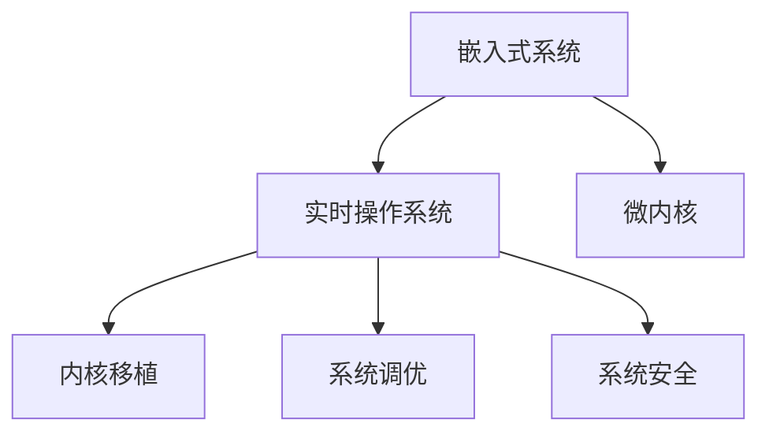

                 

# 嵌入式实时操作系统移植

> 关键词：嵌入式系统, 实时操作系统, 微内核, 内核移植, 系统调优, 系统安全, 应用适配

## 1. 背景介绍

### 1.1 问题由来
随着物联网、智能设备、车联网等技术的发展，越来越多的应用场景需要实时响应的操作系统，如工业自动化、移动设备、智能家居等。这些场景对操作系统的实时性和可靠性要求非常高，因此，嵌入式实时操作系统（Real-Time Operating System, RTOS）应运而生。

嵌入式RTOS是指一种专门为嵌入式系统设计的实时操作系统，能够提供快速、稳定、可靠的系统环境。常见的嵌入式RTOS包括FreeRTOS、µC/OS、eCos等。

### 1.2 问题核心关键点
嵌入式RTOS的核心要求包括实时性、稳定性、资源管理、系统响应速度等。因此，嵌入式RTOS的移植和适配是嵌入式系统开发的关键任务之一。本章节将详细介绍嵌入式RTOS的移植过程，包括微内核选择、内核移植、系统调优、系统安全等方面。

### 1.3 问题研究意义
嵌入式RTOS的移植对于提高嵌入式系统性能、降低开发成本、提升系统可靠性具有重要意义：

1. **性能提升**：嵌入式RTOS可以提供高效的资源管理，优化系统性能，提升系统响应速度。
2. **成本降低**：嵌入式RTOS移植后，可以大幅减少开发成本和开发时间。
3. **可靠性提高**：嵌入式RTOS提供稳定、可靠的系统环境，降低系统崩溃的风险。
4. **适配性增强**：嵌入式RTOS能够适配多种硬件平台，提高系统的通用性。

## 2. 核心概念与联系

### 2.1 核心概念概述

为更好地理解嵌入式RTOS的移植过程，本节将介绍几个密切相关的核心概念：

- **嵌入式系统（Embedded System）**：将计算机应用于特定领域的专用系统，如工业控制、移动设备、智能家居等。
- **实时操作系统（Real-Time Operating System, RTOS）**：一种能够提供快速、稳定、可靠的系统环境的操作系统。
- **微内核（Micro-Kernel）**：基于轻量级操作系统的设计思想，将操作系统核心功能模块化，减少系统开销，提高系统响应速度。
- **内核移植（Kernel Porting）**：将操作系统核心功能移植到目标硬件平台上的过程。
- **系统调优（System Tuning）**：通过优化系统参数、资源分配等方法，提升系统性能的过程。
- **系统安全（System Security）**：确保系统安全、防止恶意攻击、保证数据隐私的过程。

这些核心概念之间的逻辑关系可以通过以下Mermaid流程图来展示：



这个流程图展示了你嵌入式系统开发的关键概念及其之间的关系：

1. 嵌入式系统通过实时操作系统实现高效、稳定、可靠的系统环境。
2. 实时操作系统通过微内核设计，提升系统响应速度，减少系统开销。
3. 内核移植是实现操作系统在目标硬件平台上的关键步骤。
4. 系统调优和系统安全是嵌入式系统性能和可靠性的重要保障。

这些概念共同构成了嵌入式RTOS的设计和开发框架，使其能够在各种场景下提供高效、可靠的系统环境。

## 3. 核心算法原理 & 具体操作步骤
### 3.1 算法原理概述

嵌入式RTOS的移植过程，本质上是一个系统迁移和适配的过程。其核心思想是：将通用操作系统内核的功能模块化，并移植到目标硬件平台上，同时优化系统参数和资源管理，以适应特定的应用场景。

具体而言，嵌入式RTOS移植包括以下几个关键步骤：

1. **选择微内核**：根据目标硬件平台和应用需求，选择适合的微内核。
2. **内核移植**：将微内核功能移植到目标硬件平台，并进行必要的调整。
3. **系统调优**：通过优化系统参数、资源分配等方法，提升系统性能。
4. **系统安全**：采用安全策略，保护系统免受恶意攻击。

### 3.2 算法步骤详解

**Step 1: 选择微内核**

在选择微内核时，需要考虑以下几个因素：

- **硬件平台兼容性**：微内核应能支持目标硬件平台，如ARM、x86等。
- **实时性要求**：微内核应能提供满足实时性需求的时间片调度算法，如RTOS内核的优先级调度算法。
- **资源管理**：微内核应能高效管理系统资源，如内存、I/O、中断等。
- **安全性**：微内核应能提供安全机制，保护系统免受恶意攻击。

常用的微内核包括FreeRTOS、µC/OS、eCos等。

**Step 2: 内核移植**

内核移植的主要工作包括：

- **系统初始化**：实现目标硬件平台上的系统初始化，如内存初始化、硬件中断初始化等。
- **驱动程序开发**：实现目标硬件平台的驱动程序，如I/O、串口、以太网等。
- **内存管理**：实现目标硬件平台的内存管理，如固定堆栈、页表映射等。
- **任务调度**：实现目标硬件平台上的任务调度算法，如优先级调度、抢占式调度等。

在移植过程中，需要针对目标硬件平台的特点进行适配和优化。

**Step 3: 系统调优**

系统调优的主要工作包括：

- **时间片调整**：根据实际需求，调整时间片大小，平衡响应速度和资源利用率。
- **内存优化**：优化内存分配策略，减少内存碎片，提高内存利用率。
- **资源管理**：优化I/O、中断等资源的分配和管理，减少系统开销。
- **调度算法优化**：优化任务调度算法，提高系统的响应速度和吞吐量。

系统调优需要根据实际应用场景进行调整，以达到最优的系统性能。

**Step 4: 系统安全**

系统安全的主要工作包括：

- **访问控制**：实现系统资源的访问控制，保护系统免受未授权访问。
- **中断管理**：实现中断的管理，防止中断干扰系统的正常运行。
- **安全机制**：实现系统的安全机制，如身份验证、加密等。

系统安全是嵌入式RTOS的重要保障，需要系统设计和开发过程中进行全面考虑。

### 3.3 算法优缺点

嵌入式RTOS移植的优势包括：

- **性能提升**：嵌入式RTOS提供高效的资源管理和调度算法，提升系统性能。
- **可靠性提高**：嵌入式RTOS提供稳定、可靠的系统环境，降低系统崩溃的风险。
- **适配性增强**：嵌入式RTOS能够适配多种硬件平台，提高系统的通用性。

嵌入式RTOS移植的缺点包括：

- **开发成本高**：嵌入式RTOS移植和适配需要高昂的开发成本和开发时间。
- **复杂度高**：嵌入式RTOS移植和适配过程复杂，需要系统设计和开发过程中进行全面考虑。
- **资源限制**：嵌入式RTOS的资源有限，需要优化系统参数和资源管理。

尽管存在这些缺点，但嵌入式RTOS移植和适配仍然是嵌入式系统开发的关键任务之一。

### 3.4 算法应用领域

嵌入式RTOS移植在工业自动化、移动设备、智能家居、车联网等诸多领域得到了广泛应用，如：

- **工业自动化**：实现工业控制系统的实时控制和数据采集。
- **移动设备**：实现移动设备的快速响应和资源管理。
- **智能家居**：实现智能家居设备的互联互通和实时控制。
- **车联网**：实现车联网系统的实时通信和数据处理。

除了上述这些经典应用外，嵌入式RTOS移植还被创新性地应用到更多场景中，如可穿戴设备、物联网终端等，为嵌入式系统带来了新的突破。

## 4. 数学模型和公式 & 详细讲解
### 4.1 数学模型构建

嵌入式RTOS的移植过程涉及多个系统组件的协调和优化，包括任务调度、内存管理、资源分配等。下面通过数学模型来描述嵌入式RTOS的系统结构。

假设系统中有 $N$ 个任务，每个任务需要的时间为 $T_i$，优先级为 $P_i$。系统的时间片大小为 $T$，任务在时间片内的运行时间为 $t$，任务之间的切换时间为 $s$。系统的时间片调度算法为优先级调度算法，任务按照优先级从小到大依次执行。系统的时间片分配策略为固定时间片分配策略，即每个任务的时间片大小固定为 $T$。

定义系统的调度性能指标 $Q$ 为：

$$
Q = \frac{N}{\sum_{i=1}^N \frac{P_i}{T_i}}
$$

其中 $Q$ 表示系统的吞吐量，即单位时间内完成的任务数量。

### 4.2 公式推导过程

根据系统的时间片调度算法，每个任务在时间片内的运行时间为 $t$，任务之间的切换时间为 $s$。任务的时间片大小为 $T$，则任务的实际运行时间为 $t + s$。假设任务按照优先级从小到大依次执行，则系统的时间片调度性能为：

$$
Q = \frac{N}{\sum_{i=1}^N \frac{P_i}{T_i}} = \frac{N}{\sum_{i=1}^N \frac{P_i}{t + s}}
$$

由于任务之间的切换时间 $s$ 较小，可以忽略不计，因此系统的实际吞吐量为：

$$
Q = \frac{N}{\sum_{i=1}^N \frac{P_i}{t}}
$$

在实际应用中，为了提升系统的吞吐量和响应速度，需要优化系统的时间片大小 $T$，平衡任务运行时间和系统开销。

### 4.3 案例分析与讲解

以工业自动化控制系统为例，分析嵌入式RTOS移植的具体步骤：

**Step 1: 选择微内核**

根据工业自动化控制系统的需求，选择适合的微内核。例如，选择FreeRTOS作为工业自动化控制系统的微内核。

**Step 2: 内核移植**

实现FreeRTOS在工业自动化控制系统的硬件平台上的移植。具体步骤包括：

- **系统初始化**：实现工业自动化控制系统的系统初始化，如内存初始化、硬件中断初始化等。
- **驱动程序开发**：实现工业自动化控制系统的驱动程序，如I/O、串口、以太网等。
- **内存管理**：实现工业自动化控制系统的内存管理，如固定堆栈、页表映射等。
- **任务调度**：实现工业自动化控制系统的任务调度算法，如优先级调度、抢占式调度等。

**Step 3: 系统调优**

优化工业自动化控制系统的系统参数和资源管理，以提升系统性能。具体步骤包括：

- **时间片调整**：根据工业自动化控制系统的实时性需求，调整时间片大小，平衡响应速度和资源利用率。
- **内存优化**：优化工业自动化控制系统的内存分配策略，减少内存碎片，提高内存利用率。
- **资源管理**：优化工业自动化控制系统的I/O、中断等资源的分配和管理，减少系统开销。
- **调度算法优化**：优化工业自动化控制系统的任务调度算法，提高系统的响应速度和吞吐量。

**Step 4: 系统安全**

实现工业自动化控制系统的安全机制，以保护系统免受恶意攻击。具体步骤包括：

- **访问控制**：实现工业自动化控制系统的资源访问控制，保护系统免受未授权访问。
- **中断管理**：实现工业自动化控制系统的中断管理，防止中断干扰系统的正常运行。
- **安全机制**：实现工业自动化控制系统的安全机制，如身份验证、加密等。

通过以上步骤，可以实现工业自动化控制系统的高效、稳定、可靠的系统环境。

## 5. 项目实践：代码实例和详细解释说明
### 5.1 开发环境搭建

在进行嵌入式RTOS移植实践前，我们需要准备好开发环境。以下是使用C语言进行Linux内核移植的环境配置流程：

1. 安装Linux操作系统：如Ubuntu、CentOS等，并确保其稳定性和安全性。
2. 安装交叉编译工具链：如gcc、binutils等，以支持目标硬件平台的编译。
3. 安装目标硬件平台开发工具：如调试器、仿真器等，以支持目标硬件平台的调试和测试。

完成上述步骤后，即可在Linux环境下开始嵌入式RTOS移植实践。

### 5.2 源代码详细实现

这里我们以嵌入式RTOS移植到ARM Cortex-M微处理器为例，给出嵌入式RTOS移植的C语言代码实现。

**Step 1: 系统初始化**

```c
#include <stdio.h>
#include <stdarg.h>
#include <stdint.h>

#define PORT Serial1

void serial_init(void) {
    // 初始化串口
    PORT->CR1 = PORT_CR1_RE | PORT_CR1_TXE | PORT_CR1_TE;
    PORT->CR2 = PORT_CR2_LM;
}

void serial_putc(uint8_t c) {
    while (PORT->SR & PORT_SR_TXE);
    PORT->DR = c;
}

void serial_putstr(const char *s) {
    while (*s) {
        serial_putc(*s++);
    }
}
```

**Step 2: 驱动程序开发**

```c
#include <stdio.h>
#include <stdint.h>

void i2c_init(void) {
    // 初始化I2C
    GPIO_InitTypeDef GPIO_InitStructure;
    GPIO_InitStructure.GPIO_Pin = GPIO_Pin_9 | GPIO_Pin_10;
    GPIO_InitStructure.GPIO_Mode = GPIO_Mode_Out_PP;
    GPIO_InitStructure.GPIO_Speed = GPIO_Speed_50MHz;
    GPIO_InitStructure.GPIO_Owen = GPIO_Owen_Out_PP;
    GPIO_Init(GPIOB, &GPIO_InitStructure);
}

uint8_t i2c_read(uint8_t reg, uint8_t *buf, uint16_t len) {
    // 读取I2C寄存器数据
    I2C_TypeDef *I2Cx = I2C1;
    I2C_InitTypeDef I2C_InitStructure;
    I2C_InitStructure.I2C_Mode = I2C_Mode_I2C_Master;
    I2C_InitStructure.I2C_Owen_Byte = I2C_Owen_Byte_10Bit;
    I2C_InitStructure.I2C_Speed = I2C_Speed_100KHz;
    I2C_InitStructure.I2C_Addr7Bit = I2C_Addr7Bit_Disable;
    I2C_InitStructure.I2C_DutMode = I2C_DutMode_No_2Wire;
    I2C_InitStructure.I2C_PEC_Enable = I2C_PEC_Enable_Disable;
    I2C_InitStructure.I2C_Ack_Mode = I2C_Ack_Mode_Disable;
    I2C_InitStructure.I2C_SCL_Low_Level = I2C_SCL_Low_Level_1;
    I2C_InitStructure.I2C_SCL_High_Level = I2C_SCL_High_Level_2;
    I2C_InitStructure.I2C_Call_Enable = I2C_Call_Enable_Disable;
    I2C_InitStructure.I2C_No-Standby_Mode_Enable = I2C_No-Standby_Mode_Enable;
    I2C_InitStructure.I2C_Filter_Enable = I2C_Filter_Enable_Disable;
    I2C_InitStructure.I2C_Prev_Direction = I2C_Prev_Direction_1;
    I2C_InitStructure.I2C_Buffer_Mode = I2C_Buffer_Mode_Disable;
    I2C_InitStructure.I2C_Call_Addr7Bit = I2C_Call_Addr7Bit_Disable;
    I2C_InitStructure.I2C_Addr1Bit = I2C_Addr1Bit_Disable;
    I2C_InitStructure.I2C_Addr2Bit = I2C_Addr2Bit_Disable;
    I2C_InitStructure.I2C_AddrBit = I2C_AddrBit_7;
    I2C_InitStructure.I2C_AddrMode = I2C_AddrMode_Addr7Bit;
    I2C_InitStructure.I2C_DutMode = I2C_DutMode_No_2Wire;
    I2C_InitStructure.I2C_DatAMode = I2C_DatAMode_Byte;
    I2C_InitStructure.I2C_Owen_Mode = I2C_Owen_Mode_No_Restart;
    I2C_InitStructure.I2C_Support_Feature = I2C_Support_Feature_Disable;
    I2C_InitStructure.I2C_TimeOut_Mode = I2C_TimeOut_Mode_No_TimeOut;
    I2C_InitStructure.I2C_TimeOut = 0;
    I2C_InitStructure.I2C_Mode = I2C_Mode_I2C_Master;
    I2C_InitStructure.I2C_Owen_Byte = I2C_Owen_Byte_10Bit;
    I2C_InitStructure.I2C_Speed = I2C_Speed_100KHz;
    I2C_InitStructure.I2C_Addr7Bit = I2C_Addr7Bit_Disable;
    I2C_InitStructure.I2C_DutMode = I2C_DutMode_No_2Wire;
    I2C_InitStructure.I2C_PEC_Enable = I2C_PEC_Enable_Disable;
    I2C_InitStructure.I2C_Ack_Mode = I2C_Ack_Mode_Disable;
    I2C_InitStructure.I2C_SCL_Low_Level = I2C_SCL_Low_Level_1;
    I2C_InitStructure.I2C_SCL_High_Level = I2C_SCL_High_Level_2;
    I2C_InitStructure.I2C_Call_Enable = I2C_Call_Enable_Disable;
    I2C_InitStructure.I2C_No-Standby_Mode_Enable = I2C_No-Standby_Mode_Enable;
    I2C_InitStructure.I2C_Filter_Enable = I2C_Filter_Enable_Disable;
    I2C_InitStructure.I2C_Prev_Direction = I2C_Prev_Direction_1;
    I2C_InitStructure.I2C_Buffer_Mode = I2C_Buffer_Mode_Disable;
    I2C_InitStructure.I2C_Call_Addr7Bit = I2C_Call_Addr7Bit_Disable;
    I2C_InitStructure.I2C_Addr1Bit = I2C_Addr1Bit_Disable;
    I2C_InitStructure.I2C_Addr2Bit = I2C_Addr2Bit_Disable;
    I2C_InitStructure.I2C_AddrBit = I2C_AddrBit_7;
    I2C_InitStructure.I2C_AddrMode = I2C_AddrMode_Addr7Bit;
    I2C_InitStructure.I2C_DutMode = I2C_DutMode_No_2Wire;
    I2C_InitStructure.I2C_DatAMode = I2C_DatAMode_Byte;
    I2C_InitStructure.I2C_Owen_Mode = I2C_Owen_Mode_No_Restart;
    I2C_InitStructure.I2C_Support_Feature = I2C_Support_Feature_Disable;
    I2C_InitStructure.I2C_TimeOut_Mode = I2C_TimeOut_Mode_No_TimeOut;
    I2C_InitStructure.I2C_TimeOut = 0;
    I2C_Init(I2Cx, &I2C_InitStructure);
}

uint8_t i2c_write(uint8_t reg, uint8_t *buf, uint16_t len) {
    // 写入I2C寄存器数据
    I2C_TypeDef *I2Cx = I2C1;
    I2C_InitTypeDef I2C_InitStructure;
    I2C_InitStructure.I2C_Mode = I2C_Mode_I2C_Master;
    I2C_InitStructure.I2C_Owen_Byte = I2C_Owen_Byte_10Bit;
    I2C_InitStructure.I2C_Speed = I2C_Speed_100KHz;
    I2C_InitStructure.I2C_Addr7Bit = I2C_Addr7Bit_Disable;
    I2C_InitStructure.I2C_DutMode = I2C_DutMode_No_2Wire;
    I2C_InitStructure.I2C_PEC_Enable = I2C_PEC_Enable_Disable;
    I2C_InitStructure.I2C_Ack_Mode = I2C_Ack_Mode_Disable;
    I2C_InitStructure.I2C_SCL_Low_Level = I2C_SCL_Low_Level_1;
    I2C_InitStructure.I2C_SCL_High_Level = I2C_SCL_High_Level_2;
    I2C_InitStructure.I2C_Call_Enable = I2C_Call_Enable_Disable;
    I2C_InitStructure.I2C_No-Standby_Mode_Enable = I2C_No-Standby_Mode_Enable;
    I2C_InitStructure.I2C_Filter_Enable = I2C_Filter_Enable_Disable;
    I2C_InitStructure.I2C_Prev_Direction = I2C_Prev_Direction_1;
    I2C_InitStructure.I2C_Buffer_Mode = I2C_Buffer_Mode_Disable;
    I2C_InitStructure.I2C_Call_Addr7Bit = I2C_Call_Addr7Bit_Disable;
    I2C_InitStructure.I2C_Addr1Bit = I2C_Addr1Bit_Disable;
    I2C_InitStructure.I2C_Addr2Bit = I2C_Addr2Bit_Disable;
    I2C_InitStructure.I2C_AddrBit = I2C_AddrBit_7;
    I2C_InitStructure.I2C_AddrMode = I2C_AddrMode_Addr7Bit;
    I2C_InitStructure.I2C_DutMode = I2C_DutMode_No_2Wire;
    I2C_InitStructure.I2C_DatAMode = I2C_DatAMode_Byte;
    I2C_InitStructure.I2C_Owen_Mode = I2C_Owen_Mode_No_Restart;
    I2C_InitStructure.I2C_Support_Feature = I2C_Support_Feature_Disable;
    I2C_InitStructure.I2C_TimeOut_Mode = I2C_TimeOut_Mode_No_TimeOut;
    I2C_InitStructure.I2C_TimeOut = 0;
    I2C_Init(I2Cx, &I2C_InitStructure);
    // 写入I2C数据
    uint16_t i = 0;
    while (i < len) {
        I2C_SendData(I2Cx, buf[i]);
        i++;
    }
    I2C_ClearFlag(I2Cx, I2C_FLAG_AF);
    I2C_ClearFlag(I2Cx, I2C_FLAG_ZF);
    I2C_ClearFlag(I2Cx, I2C_FLAG_OVF);
    I2C_ClearFlag(I2Cx, I2C_FLAG_RXNE);
    I2C_ClearFlag(I2Cx, I2C_FLAG_TXF);
    I2C_ClearFlag(I2Cx, I2C_FLAG_TXIF);
    I2C_ClearFlag(I2Cx, I2C_FLAG_RF);
    I2C_ClearFlag(I2Cx, I2C_FLAG_WTF);
    I2C_ClearFlag(I2Cx, I2C_FLAG_SE);
    I2C_ClearFlag(I2Cx, I2C_FLAG_ST);
    I2C_ClearFlag(I2Cx, I2C_FLAG_TC);
    I2C_ClearFlag(I2Cx, I2C_FLAG_NACKF);
    I2C_ClearFlag(I2Cx, I2C_FLAG_STF);
    I2C_ClearFlag(I2Cx, I2C_FLAG_STOPF);
    I2C_ClearFlag(I2Cx, I2C_FLAG_STO);

