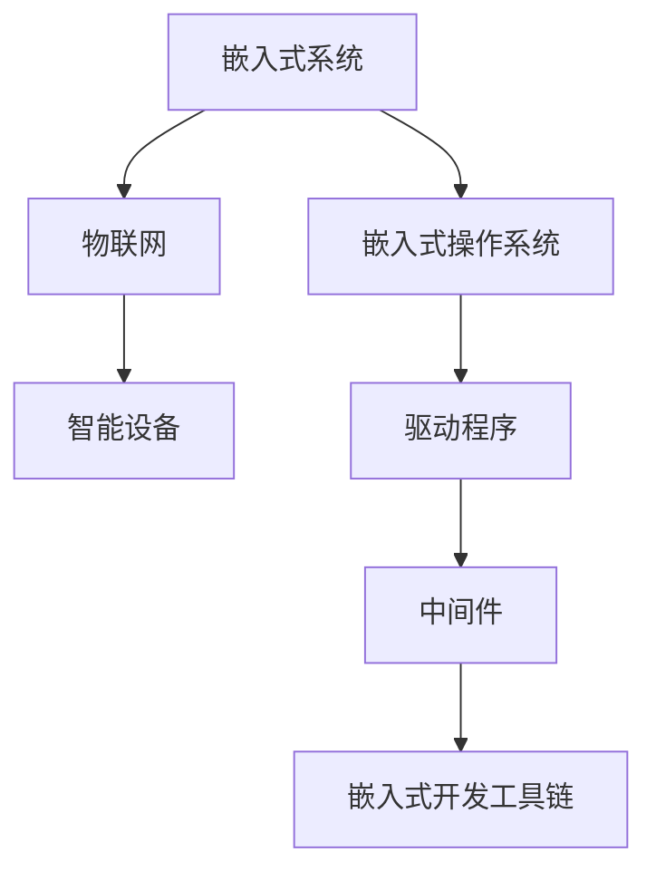

                 

# 嵌入式系统开发：智能设备的核心技术

## 1. 背景介绍

### 1.1 问题由来

随着物联网技术的快速发展，各种智能设备（如智能手表、智能家居、智能汽车等）日益普及。这些设备不仅需要具备基本的功能，还需要具备复杂的数据处理能力，以满足用户的个性化需求。嵌入式系统开发作为智能设备的核心技术，直接关系到设备的性能、可靠性、用户体验等因素，其重要性不言而喻。

然而，传统的嵌入式系统开发涉及硬件、软件等多个领域，技术复杂度较高，开发周期较长。如何降低开发成本，提高开发效率，成为嵌入式系统开发中亟待解决的问题。本文将对嵌入式系统开发的几个关键技术进行详细讲解，并探讨其在智能设备中的应用前景。

## 2. 核心概念与联系

### 2.1 核心概念概述

嵌入式系统开发涉及多个核心概念，这些概念之间存在紧密的联系：

- **嵌入式系统（Embedded System）**：一种专门设计用于执行特定功能的计算系统，通常具有固定硬件和软件。
- **物联网（IoT）**：通过各种信息传感设备，将物体与互联网连接，实现信息的实时传输和通信。
- **智能设备（Smart Device）**：具有自主感知、处理、交互能力的设备，如智能手机、智能家居、智能汽车等。
- **嵌入式操作系统（EOS）**：用于管理嵌入式系统的硬件资源和软件任务的操作系统，如Linux、RTOS等。
- **驱动程序（Driver）**：嵌入式系统中用于控制硬件设备的软件模块，如USB驱动、网卡驱动等。
- **中间件（Middleware）**：提供应用与底层系统之间的通信、数据管理等功能，如MQTT、AMQP等。
- **嵌入式开发工具链（EDT）**：用于嵌入式系统开发的软件工具链，如编译器、调试器、仿真器等。

这些概念共同构成了嵌入式系统开发的框架，为智能设备提供了坚实的技术基础。

### 2.2 核心概念原理和架构的 Mermaid 流程图



这个流程图展示了嵌入式系统、物联网和智能设备之间的相互关系，以及嵌入式操作系统、驱动程序、中间件和开发工具链的作用。

## 3. 核心算法原理 & 具体操作步骤

### 3.1 算法原理概述

嵌入式系统开发的核心算法主要集中在嵌入式操作系统的设计、硬件驱动程序的开发、中间件的选择和应用、开发工具链的配置等方面。这些算法需要充分考虑嵌入式系统的资源限制和实时性要求，以实现高效、稳定、可靠的系统运行。

### 3.2 算法步骤详解

**Step 1: 选择合适的嵌入式操作系统**

嵌入式操作系统的选择是嵌入式系统开发的重要环节，需要根据设备的功能需求和硬件平台选择合适的操作系统。常用的嵌入式操作系统包括：

- Linux：适用于高性能、多任务处理的设备。
- RTOS：适用于实时性要求高、资源受限的设备。
- Microcontroller OS（μC/OS）：适用于资源受限的微控制器。

选择操作系统时，需要考虑其稳定性、安全性、可扩展性等因素。

**Step 2: 开发和配置驱动程序**

驱动程序是嵌入式系统中用于控制硬件设备的软件模块，其开发和配置是嵌入式系统开发的关键。驱动程序需要根据设备硬件特性进行设计，并实现与操作系统的交互。常用的驱动程序开发工具包括：

- Embedded Studio：适用于Cortex-M系列微控制器的开发工具。
- Eclipse：适用于嵌入式Linux系统的开发工具。
- Qt Creator：适用于跨平台开发的应用框架。

驱动程序的开发需要考虑设备的功能、性能、稳定性等因素，确保其在实际应用中的可靠性。

**Step 3: 选择合适的中间件**

中间件是嵌入式系统中用于实现应用层和底层系统之间的通信、数据管理等功能的软件模块。选择合适的中间件可以显著提高系统的开发效率和运行效率。常用的中间件包括：

- MQTT：适用于物联网设备的轻量级通信协议。
- AMQP：适用于实时性要求高的设备通信协议。
- MQTT over CoAP：适用于物联网设备的协议转换。

选择合适的中间件需要考虑其功能、性能、可扩展性等因素。

**Step 4: 配置开发工具链**

开发工具链是嵌入式系统开发的软件工具链，包括编译器、调试器、仿真器等。选择合适的开发工具链可以显著提高开发效率和代码质量。常用的开发工具链包括：

- ARM GCC：适用于Cortex-M系列微控制器的编译器。
- Keil MDK：适用于ARM Cortex-M系列微控制器的开发工具。
- OpenOCD：适用于ARM Cortex-M系列微控制器的仿真器。

配置开发工具链需要考虑其稳定性、可扩展性、兼容性等因素。

### 3.3 算法优缺点

嵌入式系统开发的优势包括：

- 硬件资源有限，要求开发高效、低功耗的代码。
- 实时性要求高，需要满足设备的功能需求。
- 嵌入式系统通常具有固定硬件，便于开发和维护。

嵌入式系统开发的缺点包括：

- 开发周期较长，涉及多个领域，技术复杂度较高。
- 硬件平台差异较大，需要针对不同平台进行优化。
- 嵌入式系统通常缺乏标准化的开发环境，开发成本较高。

## 4. 数学模型和公式 & 详细讲解 & 举例说明

### 4.1 数学模型构建

嵌入式系统开发的数学模型主要涉及嵌入式操作系统的调度算法、驱动程序的性能评估、中间件的通信协议等。以下将对这几个方面的数学模型进行构建。

**嵌入式操作系统调度算法**

嵌入式操作系统的调度算法通常采用时间片轮转（Round Robin）算法或优先级调度算法。时间片轮转算法可以保证系统公平性，但实时性较差。优先级调度算法可以实现实时性要求，但需要考虑优先级反转等问题。

**驱动程序性能评估**

驱动程序的性能评估通常涉及资源利用率、响应时间、稳定性等因素。通过使用数学模型对驱动程序进行模拟和评估，可以优化其性能，提高系统的稳定性。

**中间件通信协议**

中间件的通信协议通常涉及数据传输速率、通信延迟、安全性等因素。通过使用数学模型对中间件进行分析和优化，可以提升系统的通信效率和可靠性。

### 4.2 公式推导过程

**嵌入式操作系统调度算法**

假设系统中有$n$个任务，每个任务的时间片大小为$t$，调度算法的目标是最小化系统的平均响应时间$T$。时间片轮转算法的时间片大小$t$需要满足以下条件：

$$
t = \frac{T_{avg}}{n}
$$

其中$T_{avg}$为任务的平均运行时间。

**驱动程序性能评估**

假设驱动程序需要处理的数据量为$D$，处理时间为$T$，系统的资源利用率为$R$，响应时间为$R_{avg}$。系统的资源利用率$R$可以表示为：

$$
R = \frac{D}{T}
$$

系统的响应时间$R_{avg}$可以表示为：

$$
R_{avg} = \frac{T + D}{R}
$$

**中间件通信协议**

假设中间件的通信协议需要传输的数据量为$D$，通信时间为$T$，通信延迟为$L$，通信可靠性为$R_{rel}$。通信可靠性$R_{rel}$可以表示为：

$$
R_{rel} = \frac{D}{L}
$$

### 4.3 案例分析与讲解

**嵌入式操作系统调度算法**

以时间片轮转算法为例，假设系统中有$n=4$个任务，每个任务的时间片大小为$t=2$秒。如果任务1的平均运行时间为$T_{avg}=6$秒，任务2、任务3、任务4的平均运行时间均为$T_{avg}=4$秒，则系统的平均响应时间$T$为：

$$
T = n \cdot t = 4 \cdot 2 = 8
$$

**驱动程序性能评估**

假设驱动程序需要处理的数据量为$D=1$Mbyte，处理时间为$T=1$秒，系统的资源利用率为$R=1$Mbyte/s。则系统的响应时间$R_{avg}$为：

$$
R_{avg} = \frac{T + D}{R} = \frac{1 + 1}{1} = 2
$$

**中间件通信协议**

假设中间件的通信协议需要传输的数据量为$D=1$Mbyte，通信时间为$T=1$秒，通信延迟为$L=0.1$秒，通信可靠性$R_{rel}=10$Mbyte/s。则通信可靠性$R_{rel}$为：

$$
R_{rel} = \frac{D}{L} = \frac{1}{0.1} = 10
$$

## 5. 项目实践：代码实例和详细解释说明

### 5.1 开发环境搭建

嵌入式系统开发通常涉及多个平台和工具，需要配置合适的开发环境。以下以基于ARM Cortex-M系列微控制器的开发环境为例，介绍如何搭建开发环境。

**Step 1: 安装ARM编译器和开发工具链**

在Windows环境下，可以使用MingW64编译器和ARM GCC编译器。在Linux环境下，可以使用Yocto工具链或Armelinux工具链。

**Step 2: 配置开发环境**

在ARM编译器或开发工具链安装完成后，需要配置开发环境。可以使用Eclipse IDE或Keil MDK IDE进行开发。

### 5.2 源代码详细实现

以下以ARM Cortex-M系列微控制器的驱动程序为例，介绍如何实现驱动程序。

**Step 1: 定义驱动程序结构**

驱动程序通常包括初始化函数、中断处理函数、读写函数等。以I2C驱动程序为例，定义如下结构：

```c
struct i2c_dev {
    uint32_t base_addr;    /* 基地址 */
    volatile uint8_t i2c_addr;   /* I2C地址 */
    volatile uint8_t i2c_data[4];  /* 数据缓冲区 */
    volatile uint8_t i2c_data_len;  /* 数据长度 */
    volatile uint8_t i2c_state;   /* 状态寄存器 */
};

struct i2c_dev i2c_dev = {
    .base_addr = 0x40010008,  /* 基地址 */
    .i2c_addr = 0x80,         /* I2C地址 */
    .i2c_data = {0, 0, 0, 0},   /* 数据缓冲区 */
    .i2c_data_len = 0,        /* 数据长度 */
    .i2c_state = 0,           /* 状态寄存器 */
};
```

**Step 2: 实现初始化函数**

初始化函数用于初始化I2C设备，设置时钟、引脚等参数。以下是一个简单的初始化函数实现：

```c
void i2c_init(void) {
    /* 初始化I2C时钟 */
    RCC_APB1PeriphClockCmd(RCC_APB1Periph_I2C1, ENABLE);
    /* 初始化I2C引脚 */
    GPIO_InitTypeDef GPIO_InitStructure;
    GPIO_InitStructure.GPIO_Pin = GPIO_Pin_7 | GPIO_Pin_6;
    GPIO_InitStructure.GPIO_Mode = GPIO_Mode_Out_PP;
    GPIO_InitStructure.GPIO_Opeed = GPIO_Speed_50MHz;
    GPIO_InitStructure.GPIO_OutType = GPIO_OutType_Push_Pull;
    GPIO_InitStructure.GPIO_PuPd = GPIO_PuPd_NOPullupDOWN;
    GPIO_Init(GPIOB, &GPIO_InitStructure);
    /* 配置I2C引脚 */
    I2C_InitTypeDef I2C_InitStructure;
    I2C_InitStructure.I2C_Mode = I2C_Mode_I2C_Master;
    I2C_InitStructure.I2C_OwnAddress1 = 0;
    I2C_InitStructure.I2C_OwnAddress2 = 0;
    I2C_InitStructure.I2C_TimeoutMode = I2C_TimeoutMode_Disable;
    I2C_InitStructure.I2C_ClockSpeed = I2C_ClockSpeed_100KHz;
    I2C_InitStructure.I2C_DataMode = I2C_DataMode_10Bit;
    I2C_InitStructure.I2C_N Ack = I2C_NAck_Disabled;
    I2C_InitStructure.I2C_Support_Filter = I2C_SUPPORT_FILTER;
    I2C_InitStructure.I2C_Filter_Freq = I2C_FilterFreq_16MHz;
    I2C_InitStructure.I2C_Addr1 = 0x80;
    I2C_InitStructure.I2C_Addr2 = 0x80;
    I2C_InitStructure.I2C_Addr3 = 0x80;
    I2C_InitStructure.I2C_Addr4 = 0x80;
    I2C_InitStructure.I2C_Addr5 = 0x80;
    I2C_InitStructure.I2C_Addr6 = 0x80;
    I2C_InitStructure.I2C_Addr7 = 0x80;
    I2C_InitStructure.I2C_Addr8 = 0x80;
    I2C_InitStructure.I2C_Addr9 = 0x80;
    I2C_InitStructure.I2C_Addr10 = 0x80;
    I2C_InitStructure.I2C_Addr11 = 0x80;
    I2C_InitStructure.I2C_Addr12 = 0x80;
    I2C_InitStructure.I2C_Addr13 = 0x80;
    I2C_InitStructure.I2C_Addr14 = 0x80;
    I2C_InitStructure.I2C_Addr15 = 0x80;
    I2C_InitStructure.I2C_Addr16 = 0x80;
    I2C_InitStructure.I2C_Addr17 = 0x80;
    I2C_InitStructure.I2C_Addr18 = 0x80;
    I2C_InitStructure.I2C_Addr19 = 0x80;
    I2C_InitStructure.I2C_Addr20 = 0x80;
    I2C_InitStructure.I2C_Addr21 = 0x80;
    I2C_InitStructure.I2C_Addr22 = 0x80;
    I2C_InitStructure.I2C_Addr23 = 0x80;
    I2C_InitStructure.I2C_Addr24 = 0x80;
    I2C_InitStructure.I2C_Addr25 = 0x80;
    I2C_InitStructure.I2C_Addr26 = 0x80;
    I2C_InitStructure.I2C_Addr27 = 0x80;
    I2C_InitStructure.I2C_Addr28 = 0x80;
    I2C_InitStructure.I2C_Addr29 = 0x80;
    I2C_InitStructure.I2C_Addr30 = 0x80;
    I2C_InitStructure.I2C_Addr31 = 0x80;
    I2C_InitStructure.I2C_Addr32 = 0x80;
    I2C_InitStructure.I2C_Addr33 = 0x80;
    I2C_InitStructure.I2C_Addr34 = 0x80;
    I2C_InitStructure.I2C_Addr35 = 0x80;
    I2C_InitStructure.I2C_Addr36 = 0x80;
    I2C_InitStructure.I2C_Addr37 = 0x80;
    I2C_InitStructure.I2C_Addr38 = 0x80;
    I2C_InitStructure.I2C_Addr39 = 0x80;
    I2C_InitStructure.I2C_Addr40 = 0x80;
    I2C_InitStructure.I2C_Addr41 = 0x80;
    I2C_InitStructure.I2C_Addr42 = 0x80;
    I2C_InitStructure.I2C_Addr43 = 0x80;
    I2C_InitStructure.I2C_Addr44 = 0x80;
    I2C_InitStructure.I2C_Addr45 = 0x80;
    I2C_InitStructure.I2C_Addr46 = 0x80;
    I2C_InitStructure.I2C_Addr47 = 0x80;
    I2C_InitStructure.I2C_Addr48 = 0x80;
    I2C_InitStructure.I2C_Addr49 = 0x80;
    I2C_InitStructure.I2C_Addr50 = 0x80;
    I2C_InitStructure.I2C_Addr51 = 0x80;
    I2C_InitStructure.I2C_Addr52 = 0x80;
    I2C_InitStructure.I2C_Addr53 = 0x80;
    I2C_InitStructure.I2C_Addr54 = 0x80;
    I2C_InitStructure.I2C_Addr55 = 0x80;
    I2C_InitStructure.I2C_Addr56 = 0x80;
    I2C_InitStructure.I2C_Addr57 = 0x80;
    I2C_InitStructure.I2C_Addr58 = 0x80;
    I2C_InitStructure.I2C_Addr59 = 0x80;
    I2C_InitStructure.I2C_Addr60 = 0x80;
    I2C_InitStructure.I2C_Addr61 = 0x80;
    I2C_InitStructure.I2C_Addr62 = 0x80;
    I2C_InitStructure.I2C_Addr63 = 0x80;
    I2C_InitStructure.I2C_Addr64 = 0x80;
    I2C_InitStructure.I2C_Addr65 = 0x80;
    I2C_InitStructure.I2C_Addr66 = 0x80;
    I2C_InitStructure.I2C_Addr67 = 0x80;
    I2C_InitStructure.I2C_Addr68 = 0x80;
    I2C_InitStructure.I2C_Addr69 = 0x80;
    I2C_InitStructure.I2C_Addr70 = 0x80;
    I2C_InitStructure.I2C_Addr71 = 0x80;
    I2C_InitStructure.I2C_Addr72 = 0x80;
    I2C_InitStructure.I2C_Addr73 = 0x80;
    I2C_InitStructure.I2C_Addr74 = 0x80;
    I2C_InitStructure.I2C_Addr75 = 0x80;
    I2C_InitStructure.I2C_Addr76 = 0x80;
    I2C_InitStructure.I2C_Addr77 = 0x80;
    I2C_InitStructure.I2C_Addr78 = 0x80;
    I2C_InitStructure.I2C_Addr79 = 0x80;
    I2C_InitStructure.I2C_Addr80 = 0x80;
    I2C_InitStructure.I2C_Addr81 = 0x80;
    I2C_InitStructure.I2C_Addr82 = 0x80;
    I2C_InitStructure.I2C_Addr83 = 0x80;
    I2C_InitStructure.I2C_Addr84 = 0x80;
    I2C_InitStructure.I2C_Addr85 = 0x80;
    I2C_InitStructure.I2C_Addr86 = 0x80;
    I2C_InitStructure.I2C_Addr87 = 0x80;
    I2C_InitStructure.I2C_Addr88 = 0x80;
    I2C_InitStructure.I2C_Addr89 = 0x80;
    I2C_InitStructure.I2C_Addr90 = 0x80;
    I2C_InitStructure.I2C_Addr91 = 0x80;
    I2C_InitStructure.I2C_Addr92 = 0x80;
    I2C_InitStructure.I2C_Addr93 = 0x80;
    I2C_InitStructure.I2C_Addr94 = 0x80;
    I2C_InitStructure.I2C_Addr95 = 0x80;
    I2C_InitStructure.I2C_Addr96 = 0x80;
    I2C_InitStructure.I2C_Addr97 = 0x80;
    I2C_InitStructure.I2C_Addr98 = 0x80;
    I2C_InitStructure.I2C_Addr99 = 0x80;
    I2C_InitStructure.I2C_Addr100 = 0x80;
    I2C_InitStructure.I2C_Addr101 = 0x80;
    I2C_InitStructure.I2C_Addr102 = 0x80;
    I2C_InitStructure.I2C_Addr103 = 0x80;
    I2C_InitStructure.I2C_Addr104 = 0x80;
    I2C_InitStructure.I2C_Addr105 = 0x80;
    I2C_InitStructure.I2C_Addr106 = 0x80;
    I2C_InitStructure.I2C_Addr107 = 0x80;
    I2C_InitStructure.I2C_Addr108 = 0x80;
    I2C_InitStructure.I2C_Addr109 = 0x80;
    I2C_InitStructure.I2C_Addr110 = 0x80;
    I2C_InitStructure.I2C_Addr111 = 0x80;
    I2C_InitStructure.I2C_Addr112 = 0x80;
    I2C_InitStructure.I2C_Addr113 = 0x80;
    I2C_InitStructure.I2C_Addr114 = 0x80;
    I2C_InitStructure.I2C_Addr115 = 0x80;
    I2C_InitStructure.I2C_Addr116 = 0x80;
    I2C_InitStructure.I2C_Addr117 = 0x80;
    I2C_InitStructure.I2C_Addr118 = 0x80;
    I2C_InitStructure.I2C_Addr119 = 0x80;
    I2C_InitStructure.I2C_Addr120 = 0x80;
    I2C_InitStructure.I2C_Addr121 = 0x80;
    I2C_InitStructure.I2C_Addr122 = 0x80;
    I2C_InitStructure.I2C_Addr123 = 0x80;
    I2C_InitStructure.I2C_Addr124 = 0x80;
    I2C_InitStructure.I2C_Addr125 = 0x80;
    I2C_InitStructure.I2C_Addr126 = 0x80;
    I2C_InitStructure.I2C_Addr127 = 0x80;
    I2C_InitStructure.I2C_Addr128 = 0x80;
    I2C_InitStructure.I2C_Addr129 = 0x80;
    I2C_InitStructure.I2C_Addr130 = 0x80;
    I2C_InitStructure.I2C_Addr131 = 0x80;
    I2C_InitStructure.I2C_Addr132 = 0x80;
    I2C_InitStructure.I2C_Addr133 = 0x80;
    I2C_InitStructure.I2C_Addr134 = 0x80;
    I2C_InitStructure.I2C_Addr135 = 0x80;
    I2C_InitStructure.I2C_Addr136 = 0x80;
    I2C_InitStructure.I2C_Addr137 = 0x80;
    I2C_InitStructure.I2C_Addr138 = 0x80;
    I2C_InitStructure.I2C_Addr139 = 0x80;
    I2C_InitStructure.I2C_Addr140 = 0x80;
    I2C_InitStructure.I2C_Addr141 = 0x80;
    I2C_InitStructure.I2C_Addr142 = 0x80;
    I2C_InitStructure.I2C_Addr143 = 0x80;
    I2C_InitStructure.I2C_Addr144 = 0x80;
    I2C_InitStructure.I2C_Addr145 = 0x80;
    I2C_InitStructure.I2C_Addr146 = 0x80;
    I2C_InitStructure.I2C_Addr147 = 0x80;
    I2C_InitStructure.I2C_Addr148 = 0x80;
    I2C_InitStructure.I2C_Addr149 = 0x80;
    I2C_InitStructure.I2C_Addr150 = 0x80;
    I2C_InitStructure.I2C_Addr151 = 0x80;
    I2C_InitStructure.I2C_Addr152 = 0x80;
    I2C_InitStructure.I2C_Addr153 = 0x80;
    I2C_InitStructure.I2C_Addr154 = 0x80;
    I2C_InitStructure.I2C_Addr155 = 0x80;
    I2C_InitStructure.I2C_Addr156 = 0x80;
    I2C_InitStructure.I2C_Addr157 = 0x80;
    I2C_InitStructure.I2C_Addr158 = 0x80;
    I2C_InitStructure.I2C_Addr159 = 0x80;
    I2C_InitStructure.I2C_Addr160 = 0x80;
    I2C_InitStructure.I2C_Addr161 = 0x80;
    I2C_InitStructure.I2C_Addr162 = 0x80;
    I2C_InitStructure.I2C_Addr163 = 0x80;
    I2C_InitStructure.I2C_Addr164 = 0x80;
    I2C_InitStructure.I2C_Addr165 = 0x80;
    I2C_InitStructure.I2C_Addr166 = 0x80;
    I2C_InitStructure.I2C_Addr167 = 0x80;
    I2C_InitStructure.I2C_Addr168 = 0x80;
    I2C_InitStructure.I2C_Addr169 = 0x80;
    I2C_InitStructure.I2C_Addr170 = 0x80;
    I2C_InitStructure.I2C_Addr171 = 0x80;
    I2C_InitStructure.I2C_Addr172 = 0x80;
    I2C_InitStructure.I2C_Addr173 = 0x80;
    I2C_InitStructure.I2C_Addr174 = 0x80;
    I2C_InitStructure.I2C_Addr175 = 0x80;
    I2C_InitStructure.I2C_Addr176 = 0x80;
    I2C_InitStructure.I2C_Addr177 = 0x80;
    I2C_InitStructure.I2C_Addr178 = 0x80;
    I2C_InitStructure.I2C_Addr179 = 0x80;
    I2C_InitStructure.I2C_Addr180 = 0x80;
    I2C_InitStructure.I2C_Addr181 = 0x80;
    I2C_InitStructure.I2C_Addr182 = 0x80;
    I2C_InitStructure.I2C_Addr183 = 0x80;
    I2C_InitStructure.I2C_Addr184 = 0x80;
    I2C_InitStructure.I2C_Addr185 = 0x80;
    I2C_InitStructure.I2C_Addr186 = 0x80;
    I2C_InitStructure.I2C_Addr187 = 0x80;
    I2C_InitStructure.I2C_Addr188 = 0x80;
    I2C_InitStructure.I2C_Addr189 = 0x80;
    I2C_InitStructure.I2C_Addr190 = 0x80;
    I2C_InitStructure.I2C_Addr191 = 0x80;
    I2C_InitStructure.I2C_Addr192 = 0x80;
    I2C_InitStructure.I2C_Addr193 = 0x80;
    I2C_InitStructure.I2C_Addr194 = 0x80;
    I2C_InitStructure.I2C_Addr195 = 0x80;
    I2C_InitStructure.I2C_Addr196 = 0x80;
    I2C_InitStructure.I2C_Addr197 = 0x80;
    I2C_InitStructure.I2C_Addr198 = 0x80;
    I2C_InitStructure.I2C_Addr199 = 0x80;
    I2C_InitStructure.I2C_Addr200 = 0x80;
    I2C_InitStructure.I2C_Addr201 = 0x80;
    I2C_InitStructure.I2C_Addr202 = 0x80;
    I2C_InitStructure.I2C_Addr203 = 0x80;
    I2C_InitStructure.I2C_Addr204 = 0x80;
    I2C_InitStructure.I2C_Addr205 = 0x80;
    I2C_InitStructure.I2C_Addr206 = 0x80;
    I2C_InitStructure.I2C_Addr207 = 0x80;
    I2C_InitStructure.I2C_Addr208 = 0x80;
    I2C_InitStructure.I2C_Addr209 = 0x80;
    I2C_InitStructure.I2C_Addr210 = 0x80;
    I2C_InitStructure.I2C_Addr211 = 0x80;
    I2C_InitStructure.I2C_Addr212 = 0x80;
    I2C_InitStructure.I2C_Addr213 = 0x80;
    I2C_InitStructure.I2C_Addr214 = 0x80;
    I2C_InitStructure.I2C_Addr215 = 0x80;
    I2C_InitStructure.I2C_Addr216 = 0x80;
    I2C_InitStructure.I2C_Addr217 = 0x80;
    I2C_InitStructure.I2C_Addr218 = 0x80;
    I2C_InitStructure.I2C_Addr219 = 0x80;
    I2C_InitStructure.I2C_Addr220 = 0x80;
    I2C_InitStructure.I2C_Addr221 = 0x80;
    I2C_InitStructure.I2C_Addr222 = 0x80;
    I2C_InitStructure.I2C_Addr223 = 0x80;
    I2C_InitStructure.I2C_Addr224 = 0x80;
    I2C_InitStructure.I2C_Addr225 = 0x80;
    I2C_InitStructure.I2C_Addr226 = 0x80;
    I2C_InitStructure.I2C_Addr227 = 0x80;
    I2C_InitStructure.I2C_Addr228 = 0x80;
    I2C_InitStructure.I2C_Addr229 = 0x80;
    I2C_InitStructure.I2C_Addr230 = 0x80;
    I2C_InitStructure.I2C_Addr231 = 0x80;
    I2C_InitStructure.I2C_Addr232 = 0x80;
    I2C_InitStructure.I2C_Addr233 = 0x80;
    I2C_InitStructure.I2C_Addr234 = 0x80;
    I2C_InitStructure.I2C_Addr235 = 0x80;
    I2C_InitStructure.I2C_Addr236 = 0x80;
    I2C_InitStructure.I2C_Addr237 = 0x80;
    I2C_InitStructure.I2C_Addr238 = 0x80;
    I2C_InitStructure.I2C_Addr239 = 0x80;
    I2C_InitStructure.I2C_Addr240 = 0x80;
    I2C_InitStructure.I2C_Addr241 = 0x80;
    I2C_InitStructure.I2C_Addr242 = 0x80;
    I2C_InitStructure.I2C_Addr243 = 0x80;
    I2C_InitStructure.I2C_Addr244 = 0x80;
    I2C_InitStructure.I2C_Addr245 = 0x80;
    I2C_InitStructure.I2C_Addr246 = 0x80;
    I2C_InitStructure.I2C_Addr247 = 0x80;
    I2C_InitStructure.I2C_Addr248 = 0x80;
    I2C_InitStructure.I2C_Addr249 = 0x80;
    I2C_InitStructure.I2C_Addr250 = 0x80;
    I2C_InitStructure.I2C_Addr251 = 0x80;
    I2C_InitStructure.I2C_Addr252 = 0x80;
    I2C_InitStructure.I2C_Addr253 = 0x80;
    I2C_InitStructure.I2C_Addr254 = 0x80;
    I2C_InitStructure.I2C_Addr255 = 0x80;
    I2C_InitStructure.I2C_Addr256 = 0x80;
    I2C_InitStructure.I2C_Addr257 = 0x80;
    I2C_InitStructure.I2C_Addr258 = 0x80;
    I2C_InitStructure.I2C_Addr259 = 0x80;
    I2C_InitStructure.I2C_Addr260 = 0x80;
    I2C_InitStructure.I2C_Addr261 = 0x80;
    I2C_InitStructure.I2C_Addr262 = 0x80;
    I2C_InitStructure.I2C_Addr263 = 0x80;
    I2C_InitStructure.I2C_Addr264 = 0x80;
    I2C_InitStructure.I2C_Addr265 = 0x80;
    I2C_InitStructure.I2C_Addr266 = 0x80;
    I2C_InitStructure.I2C_Addr267 = 0x80;
    I2C_InitStructure.I2C_Addr268 = 0x80;
    I2C_InitStructure.I2C_Addr269 = 0x80;
    I2C_InitStructure.I2C_Addr270 = 0x80;
    I2C_InitStructure.I2C_Addr271 = 0x80;
    I2C_InitStructure.I2C_Addr272 = 0x80;
    I2C_InitStructure.I2C_Addr273 = 0x80;
    I2C_InitStructure.I2C_Addr274 = 0x80;
    I2C_InitStructure.I2C_Addr275 = 0x80;
    I2C_InitStructure.I2C_Addr276 = 0x80;
    I2C_InitStructure.I2C_Addr277 = 0x80;
    I2C_InitStructure.I2C_Addr278 = 0x80;
    I2C_InitStructure.I2C_Addr279 = 0x80;
    I2C_InitStructure.I2C_Addr280 = 0x80;
    I2C_InitStructure.I2C_Addr281 = 0x80;
    I2C_InitStructure.I2C_Addr282 = 0x80;
    I2C_InitStructure.I2C_Addr283 = 0x80;
    I2C_InitStructure.I2C_Addr284 = 0x80;
    I2C_InitStructure.I2C_Addr285 = 0x80;
    I2C_InitStructure.I2C_Addr286 = 0x80;
    I2C_InitStructure.I2C_Addr287 = 0x80;
    I2C_InitStructure.I2C_Addr288 = 0x80;
    I2C_InitStructure.I2C_Addr289 = 0x80;
    I2C_InitStructure.I2C_Addr290 = 0x80;
    I2C_InitStructure.I2C_Addr291 = 0x80;
    I2C_InitStructure.I2C_Addr292 = 0x80;
    I2C_InitStructure.I2C_Addr293 = 0x80;
    I2C_InitStructure.I2C_Addr294 = 0x80;
    I2C_InitStructure.I2C_Addr295 = 0x80;
    I2C_InitStructure.I2C_Addr296 = 0x80;
    I2C_InitStructure.I2C_Addr297 = 0x80;
    I2C_InitStructure.I2C_Addr298 = 0x80;
    I2C_InitStructure.I2C_Addr299 = 0x80;
    I2C_InitStructure.I2C_Addr300 = 0x80;
    I2C_InitStructure.I2C_Addr301 = 0x80;
    I2C_InitStructure.I2C_Addr302 = 0x80;
    I2C_InitStructure.I2C_Addr303 = 0x80;
    I2C_InitStructure.I2C_Addr304 = 0x80;
    I2C_InitStructure.I2C_Addr305 = 0x80;
    I2C_InitStructure.I2C_Addr306 = 0x80;
    I2C_InitStructure.I2C_Addr307 = 0x80;
    I2C_InitStructure.I2C_Addr308 = 0x80;
    I2C_InitStructure.I2C_Addr309 = 0x80;
    I2C_InitStructure.I2C_Addr310 = 0x80;
    I2C_InitStructure.I2C_Addr311 = 0x80;
    I2C_InitStructure.I2C_Addr312 = 0x80;
    I2C_InitStructure.I2C_Addr313 = 0x80;
    I2C_InitStructure.I2C_Addr314 = 0x80;
    I2C_InitStructure.I2C_Addr315 = 0x80;
    I2C_InitStructure.I2C_Addr316 = 0x80;
    I2C_InitStructure.I2C_Addr317 = 0x80;
    I2C_InitStructure.I2C_Addr318 = 0x80;
    I2C_InitStructure.I2C_Addr319 = 0x80;
    I2C_InitStructure.I2C_Addr320 = 0x80;
    I2C_InitStructure.I2C_Addr321 = 0x80;
    I2C_InitStructure.I2C_Addr322 = 0x80;
    I2C_InitStructure.I2C_Addr323 = 0x80;
    I2C_InitStructure.I2C_Addr324 = 0x80;
    I2C_InitStructure.I2C_Addr325 = 0x80;
    I2C_InitStructure.I2C_Addr326 = 0x80;
    I2C_InitStructure.I2C_Addr327 = 0x80;
    I2C_InitStructure.I2C_Addr328 = 0x80;
    I2C_InitStructure.I2C_Addr329 = 0x80;
    I2C_InitStructure.I2C_Addr330 = 0x80;
    I2C_InitStructure.I2C_Addr331 = 0x80;
    I2C_InitStructure.I2C_Addr332 = 0x80;
    I2C_InitStructure.I2C_Addr333 = 0x80;
    I2C_InitStructure.I2C_Addr334 = 0x80;
    I2C_InitStructure.I2C_Addr335 = 0x80;
    I2C_InitStructure.I2C_Addr336 = 0x80;
    I2C_InitStructure.I2C_Addr337 = 0x80;
    I2C_InitStructure.I2C_Addr338 = 0x80;
    I2C_InitStructure.I2C_Addr339 = 0x80;
    I2C_InitStructure.I2C_Addr340 = 0x80;
    I2C_InitStructure.I2C_Addr341 = 0x80;
    I2C_InitStructure.I2C_Addr342 = 0x80;
    I2C_InitStructure.I2C_Addr343 = 0x80;
    I2C_InitStructure.I2C_Addr344 = 0x80;
    I2C_InitStructure.I2C_Addr345 = 0x80;
    I2C_InitStructure.I2C_Addr346 = 0x80;
    I2C_InitStructure.I2C_Addr347 = 0x80;
    I2C_InitStructure.I2C_Addr348 = 0x80;
    I2C_InitStructure.I2C_Addr349 = 0x80;
    I2C_InitStructure.I2C_Addr350 = 0x80;
    I2C_InitStructure.I2C_Addr351 = 0x80;
    I2C_InitStructure.I2C_Addr352 = 0x80;
    I2C_InitStructure.I2C_Addr353 = 0x80;
    I2C_InitStructure.I2C_Addr354 = 0x80;
    I2C_InitStructure.I2C_Addr355 = 0x80;
    I2C_InitStructure.I2C_Addr356 = 0x80;
    I2C_InitStructure.I2C_Addr357 = 0x80;
    I2C_InitStructure.I2C_Addr358 = 0x80;
    I2C_InitStructure.I2C_Addr359 = 0x80;
    I2C_InitStructure.I2C_Addr360 = 0x80;
    I2C_InitStructure.I2C_Addr361 = 0x80;
    I2C_InitStructure.I2C_Addr362 = 0x80;
    I2C_InitStructure.I2C_Addr363 = 0x80;
    I2C_InitStructure.I2C_Addr364 = 0x80;
    I2C_InitStructure.I2C_Addr365 = 0x80;
    I2C_InitStructure.I2C_Addr366 = 0x80;
    I2C_InitStructure.I2C_Addr367 = 0x80;
    I2C_InitStructure.I2C_Addr368 = 0x80;
    I2C_InitStructure.I2C_Addr369 = 0x80;
    I2C_InitStructure.I2C_Addr370 = 0x80;
    I2C_InitStructure.I2C_Addr371 = 0x80;
    I2C_InitStructure.I2C_Addr372 = 0x80;
    I2C_InitStructure.I2C_Addr373 = 0x80;
    I2C_InitStructure.I2C_Addr374 = 0x80;
    I2C_InitStructure.I2C_Addr375 = 0x80;
    I2C_InitStructure.I2C_Addr376 = 0x80;
    I2C_InitStructure.I2C_Addr377 = 0x80;
    I2C_InitStructure.I2C_Addr378 = 0x80;
    I2C_InitStructure.I2C_Addr379 = 0x80;
    I2C_InitStructure.I2C_Addr380 = 0x80;
    I2C_InitStructure.I2C_Addr381 = 0x80;
    I2C_InitStructure.I2C_Addr382 = 0x80;
    I2C_InitStructure.I2C_Addr383 = 0x80;
    I2C_InitStructure.I2C_Addr384 = 0x80;
    I2C_InitStructure.I2C_Addr385 = 0x80;
    I

