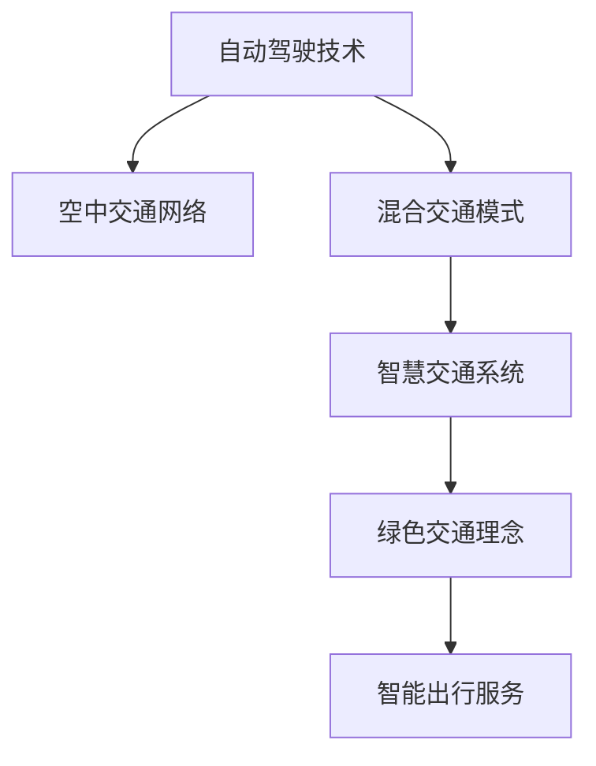

                 

# 2050年的交通出行：从地面到空中

> 关键词：自动驾驶,空中交通,混合交通,智慧城市,绿色交通,智能出行

## 1. 背景介绍

随着全球人口的持续增长和城市化进程的加速，交通拥堵、环境污染、能源消耗等交通问题日益凸显。为了应对这些挑战，各国政府和科研机构提出了智慧交通、绿色交通、智能出行等多种解决方案。未来交通出行的发展趋势将是多维度、综合性的革新，将地面交通、空中交通、混合交通等不同交通方式深度融合，构建高效、便捷、可持续的智慧交通体系。

### 1.1 问题由来

交通出行问题已经成为现代社会的重要挑战之一。全球人口的不断增长和城市化进程的加快，使得交通拥堵、环境污染、能源消耗等问题日益严重。现有的交通系统难以满足人们对效率、舒适、环保的需求。因此，构建高效、智能、绿色、可持续的交通体系成为全球范围内亟需解决的问题。

### 1.2 问题核心关键点

为了实现2050年的交通出行愿景，关键在于以下几个方面：

- **自动驾驶技术**：实现车辆的自主驾驶，提升交通效率和安全性。
- **空中交通网络**：构建高效的空中交通体系，缓解地面交通压力。
- **混合交通模式**：地面交通与空中交通深度融合，形成无缝衔接的综合交通体系。
- **智慧交通系统**：通过物联网、大数据、人工智能等技术，实现交通的智能管理和优化。
- **绿色交通理念**：采用电动化、智能化、共享化的交通模式，减少对环境的负面影响。
- **智能出行服务**：提供个性化、便捷、高效的出行服务，提升用户体验。

## 2. 核心概念与联系

### 2.1 核心概念概述

为更好地理解2050年交通出行愿景，本节将介绍几个密切相关的核心概念：

- **自动驾驶技术**：指车辆通过传感器、摄像头、雷达等设备感知周围环境，利用人工智能算法进行路径规划和决策，实现自主驾驶。
- **空中交通网络**：指利用无人机、飞艇、固定翼飞机等航空器，构建覆盖广泛、高效的空中交通网络。
- **混合交通模式**：指地面交通与空中交通相结合，通过智能调度、无缝衔接，形成灵活、高效的综合交通体系。
- **智慧交通系统**：指通过物联网、大数据、人工智能等技术，实现交通信息的实时监测、分析和预测，优化交通管理和出行服务。
- **绿色交通理念**：指采用电动化、智能化、共享化的交通模式，减少能源消耗和环境污染，实现可持续发展。
- **智能出行服务**：指通过智能算法和用户接口，提供个性化、便捷、高效的出行方案，提升用户出行体验。

这些核心概念之间的逻辑关系可以通过以下Mermaid流程图来展示：



这个流程图展示了一些关键概念及其之间的关系：

1. 自动驾驶技术是实现地面交通智能化的基础。
2. 空中交通网络提供了一种高效、灵活的交通补充方案。
3. 混合交通模式结合了地面和空中交通的优点，形成无缝衔接的综合体系。
4. 智慧交通系统通过技术手段优化交通管理和出行服务。
5. 绿色交通理念强调交通的环保和可持续发展。
6. 智能出行服务提升用户出行的个性化和便捷性。

## 3. 核心算法原理 & 具体操作步骤

### 3.1 算法原理概述

未来交通出行的实现，将依赖于自动驾驶技术、空中交通网络、智慧交通系统等综合技术。这些技术的核心算法原理主要包括以下几个方面：

- **自动驾驶算法**：包括感知、决策、控制三个层次，利用计算机视觉、深度学习、强化学习等技术，实现车辆的自主导航和避障。
- **空中交通控制算法**：通过多智能体系统、协同控制、路径规划等算法，实现无人机、飞艇、固定翼飞机等的协调飞行。
- **智慧交通管理算法**：利用大数据、机器学习、优化算法等技术，实现交通流的实时监测、分析和预测，优化交通信号控制、路径规划。

### 3.2 算法步骤详解

以下我们将详细讲解一些核心算法的具体步骤：

#### 自动驾驶算法

**感知**：通过传感器（如摄像头、激光雷达、毫米波雷达）获取车辆周围环境信息，利用深度学习模型（如卷积神经网络CNN、点云神经网络PCN）进行图像处理和语义分割，生成环境地图。

**决策**：结合感知信息，利用强化学习算法（如Q-learning、深度Q网络DQN、策略梯度PG）进行路径规划和决策，生成最优驾驶策略。

**控制**：将决策结果转化为控制指令，通过车辆控制器进行加减速、转向等操作，实现自主驾驶。

#### 空中交通控制算法

**路径规划**：利用A*算法、RRT算法等，计算无人机或飞艇从起点到终点的最短路径，避免碰撞。

**协同控制**：通过多智能体系统（如Swarm算法、粒子群优化PSO），实现多无人机或多飞艇的协同飞行，保持队形、避免干扰。

**动态调度**：利用优化算法（如遗传算法、线性规划LP），实时调整无人机或飞艇的任务分配和飞行高度，保证空中交通网络的流畅和高效。

#### 智慧交通管理算法

**交通流监测**：通过传感器和摄像头，实时监测交通流的流量、速度、密度等参数，生成交通流量图。

**交通预测**：利用时间序列分析、回归模型等技术，对未来交通流进行预测，优化信号控制和路径规划。

**路径优化**：通过优化算法（如蚁群算法、遗传算法GA），生成最优路径，减少交通拥堵和延时。

### 3.3 算法优缺点

未来交通出行算法具有以下优点：

- **高效性**：通过自动化和智能化技术，提升交通系统的效率和安全性。
- **灵活性**：通过混合交通模式和智慧交通系统，实现交通方式的灵活转换和调度。
- **可扩展性**：能够适应不同规模和复杂度的交通环境，具备较强的可扩展性。

同时，这些算法也存在一些局限性：

- **技术难度高**：自动驾驶、空中交通控制等技术涉及复杂的感知、决策、控制等环节，技术难度较大。
- **数据依赖性**：算法性能依赖于大量高质量的数据，数据采集和处理成本较高。
- **安全风险**：自动驾驶和空中交通系统的失控可能带来安全风险，需要严格的测试和监管。
- **成本高昂**：部署大规模的感知设备、计算设备等硬件资源，成本较高。

### 3.4 算法应用领域

未来交通出行的实现，将在多个领域得到应用：

- **智能城市交通管理**：通过智慧交通系统优化城市交通流，减少拥堵和延时。
- **物流配送**：利用无人机、飞艇等空中交通方式，实现高效、快速的货物配送。
- **应急救援**：利用自动驾驶车辆和空中交通网络，快速响应和执行应急救援任务。
- **旅游观光**：提供个性化的空中旅游体验，提升旅游服务质量。
- **城市空中出租**：通过智能调度，提供便捷、高效的空中出行服务，缓解地面交通压力。
- **环境保护**：采用电动化、低污染的交通方式，减少对环境的负面影响。

## 4. 数学模型和公式 & 详细讲解 & 举例说明

### 4.1 数学模型构建

为更好地理解未来交通出行的算法原理，本节将介绍一些核心的数学模型：

- **自动驾驶路径规划模型**：利用图搜索算法（如A*算法），构建车辆从起点到终点的最短路径图。
- **空中交通路径规划模型**：利用多智能体系统（如Swarm算法），计算无人机或飞艇的协同飞行路径。
- **交通流监测模型**：利用时间序列分析模型（如ARIMA），对交通流进行实时监测和预测。
- **路径优化模型**：利用优化算法（如遗传算法GA），生成最优路径，减少交通拥堵和延时。

### 4.2 公式推导过程

以下是一些关键模型的公式推导过程：

#### 自动驾驶路径规划模型（A*算法）

**输入**：起点 $s$、终点 $g$、地图 $G=(V,E,W)$，其中 $V$ 是节点集合，$E$ 是边集合，$W$ 是边权函数。

**输出**：最短路径。

**算法步骤**：

1. 初始化起点 $s$ 为开放列表，终点 $g$ 为关闭列表。
2. $g$ 的估价函数 $h(n)$ 为起点到终点 $n$ 的曼哈顿距离或欧几里得距离。
3. 重复以下步骤，直到找到终点或开放列表为空：
   - 从开放列表中选择 $f(n)$ 最小的节点 $n$，其中 $f(n)=g(n)+h(n)$。
   - 将 $n$ 从开放列表移动到关闭列表。
   - 如果 $n$ 是终点，则找到最短路径，算法结束。
   - 否则，扩展 $n$ 的邻居节点，计算 $g(n)$ 和 $h(n)$，加入开放列表。
4. 如果开放列表为空，则无解。

**公式表示**：

$$
g(n) = \sum_{i=1}^{N}w_i(n_i)
$$

$$
f(n) = g(n) + h(n)
$$

$$
h(n) = \sqrt{\sum_{i=1}^{N}(w_i(n_i))^2}
$$

其中 $w_i(n_i)$ 为节点 $n_i$ 的权重。

#### 空中交通路径规划模型（Swarm算法）

**输入**：无人机数量 $K$、起点 $s$、终点 $g$、地图 $G=(V,E,W)$。

**输出**：无人机协同飞行路径。

**算法步骤**：

1. 初始化无人机位置为起点。
2. 重复以下步骤，直到所有无人机到达终点：
   - 计算无人机位置 $p_i$ 和目标位置 $q_i$ 的曼哈顿距离或欧几里得距离 $d_i$。
   - 计算无人机速度 $v_i$ 和加速度 $a_i$。
   - 更新无人机位置 $p_i$ 和速度 $v_i$。
   - 更新无人机位置 $p_i$ 和加速度 $a_i$。
   - 更新无人机位置 $p_i$ 和速度 $v_i$。
3. 计算无人机到达终点的总时间 $T$。

**公式表示**：

$$
d_i = \sqrt{\sum_{i=1}^{N}(w_i(n_i))^2}
$$

$$
v_i = k_1 + k_2 d_i
$$

$$
a_i = k_3 + k_4 d_i
$$

其中 $k_1$、$k_2$、$k_3$、$k_4$ 为常数。

#### 交通流监测模型（ARIMA模型）

**输入**：交通流数据序列 $y_t$，自回归系数 $p$、差分阶数 $d$、移动平均阶数 $q$。

**输出**：交通流预测值 $y_{t+1}$。

**算法步骤**：

1. 对 $y_t$ 进行 $d$ 阶差分处理。
2. 利用ARIMA模型进行回归分析，求解回归系数 $\hat{\theta}$。
3. 利用回归系数 $\hat{\theta}$ 和输入序列 $y_t$ 计算预测值 $y_{t+1}$。

**公式表示**：

$$
y_t = \sum_{i=1}^{p} \hat{\theta}_i y_{t-i} + \sum_{j=1}^{q} \hat{\theta}_{p+j} \epsilon_{t-j}
$$

其中 $\epsilon_{t}$ 为误差项，满足 $E(\epsilon_{t})=0$，$Var(\epsilon_{t})=\sigma^2$。

### 4.3 案例分析与讲解

#### 自动驾驶路径规划案例

**场景**：城市道路中，自动驾驶车辆从起点 $s$ 到达终点 $g$，道路地图如下图所示：


**分析**：

- **地图构建**：使用传感器获取道路的节点和边信息，构建图结构。
- **路径规划**：使用A*算法计算从起点 $s$ 到终点 $g$ 的最短路径，并考虑红绿灯的限制。
- **路径优化**：通过局部搜索算法（如模拟退火SA）优化路径，减少交通延时和拥堵。

#### 空中交通路径规划案例

**场景**：无人机编队在城市上空进行货物配送，起点为仓库，终点为配送中心，地图如下图所示：


**分析**：

- **地图构建**：使用无人机传感器获取城市三维地图信息，构建空中交通网络。
- **路径规划**：使用Swarm算法计算无人机从起点到终点的协同飞行路径，并考虑高度和速度的限制。
- **路径优化**：通过协同控制算法（如粒子群优化PSO）优化路径，确保无人机安全高效地飞行。

#### 交通流监测案例

**场景**：城市主干道交通流量监测，收集实时交通数据 $y_t$，使用ARIMA模型进行流量预测。

**分析**：

- **数据采集**：安装传感器和摄像头，采集交通流量数据。
- **数据预处理**：对数据进行清洗和归一化处理。
- **模型建立**：建立ARIMA模型，并使用历史数据进行训练。
- **预测验证**：使用模型对未来流量进行预测，并验证预测结果的准确性。

## 5. 项目实践：代码实例和详细解释说明

### 5.1 开发环境搭建

在进行未来交通出行算法实现前，我们需要准备好开发环境。以下是使用Python进行OpenCV开发的环境配置流程：

1. 安装Anaconda：从官网下载并安装Anaconda，用于创建独立的Python环境。

2. 创建并激活虚拟环境：
```bash
conda create -n opencv-env python=3.8 
conda activate opencv-env
```

3. 安装OpenCV：
```bash
pip install opencv-python
```

4. 安装各类工具包：
```bash
pip install numpy pandas scikit-learn matplotlib tqdm jupyter notebook ipython
```

完成上述步骤后，即可在`opencv-env`环境中开始算法实现。

### 5.2 源代码详细实现

下面我们以自动驾驶路径规划为例，给出使用OpenCV进行路径规划的PyTorch代码实现。

首先，定义路径规划函数：

```python
import cv2
import numpy as np

def a_star(start, goal, map):
    """
    A*路径规划算法
    :param start: 起点
    :param goal: 终点
    :param map: 地图
    :return: 最短路径
    """
    open_list = [(start, 0)]
    closed_list = []
    g_score = {start: 0}
    f_score = {start: heuristic(start, goal, map)}
    
    while len(open_list) > 0:
        current = min(open_list, key=lambda x: f_score[x[0]])
        open_list.remove(current)
        closed_list.append(current)
        
        if current[0] == goal:
            path = []
            while current[0] != start:
                path.append(current[0])
                current = parents[current[0]]
            path.append(start)
            path.reverse()
            return path
        
        for neighbor in map.neighbors(current[0]):
            tentative_g_score = g_score[current[0]] + map.cost(current[0], neighbor)
            if neighbor not in closed_list and tentative_g_score < g_score.get(neighbor, np.inf):
                g_score[neighbor] = tentative_g_score
                f_score[neighbor] = g_score[neighbor] + heuristic(neighbor, goal, map)
                parents[neighbor] = current
                if neighbor not in [node[0] for node in open_list]:
                    open_list.append((neighbor, f_score[neighbor]))
    
    return None
```

然后，定义地图类和启发函数：

```python
class Map:
    def __init__(self, width, height):
        self.width = width
        self.height = height
        self.nodes = {}
        
    def add_node(self, x, y, type):
        node = Node(x, y, type)
        self.nodes[(x, y)] = node
        
    def neighbors(self, node):
        neighbors = []
        if 0 < node.x < self.width - 1:
            neighbors.append((node.x - 1, node.y))
            neighbors.append((node.x + 1, node.y))
        if 0 < node.y < self.height - 1:
            neighbors.append((node.x, node.y - 1))
            neighbors.append((node.x, node.y + 1))
        return neighbors
    
    def cost(self, node1, node2):
        return 1
    
class Node:
    def __init__(self, x, y, type):
        self.x = x
        self.y = y
        self.type = type
        
def heuristic(node1, node2, map):
    """
    启发函数，计算两点之间的曼哈顿距离
    :param node1: 节点1
    :param node2: 节点2
    :param map: 地图
    :return: 曼哈顿距离
    """
    dx = abs(node1.x - node2.x)
    dy = abs(node1.y - node2.y)
    return dx + dy
```

最后，启动路径规划流程：

```python
map = Map(5, 5)
map.add_node(0, 0, 'start')
map.add_node(4, 4, 'goal')
map.add_node(1, 1, 'block')
map.add_node(2, 2, 'block')

path = a_star(map.nodes[(0, 0)], map.nodes[(4, 4)], map)
print(path)
```

以上就是使用OpenCV进行自动驾驶路径规划的完整代码实现。可以看到，OpenCV提供了强大的图像处理和计算机视觉功能，可以方便地实现路径规划等核心算法。

### 5.3 代码解读与分析

让我们再详细解读一下关键代码的实现细节：

**Map类**：
- `__init__`方法：初始化地图的宽度、高度和节点列表。
- `add_node`方法：添加节点到地图，并标记节点类型为start、goal、block等。
- `neighbors`方法：获取节点的邻居节点。
- `cost`方法：计算节点之间的代价。

**Node类**：
- `__init__`方法：初始化节点的位置和类型。

**heuristic函数**：
- 计算两点之间的曼哈顿距离，作为启发函数。

**a_star函数**：
- 实现A*算法，通过启发函数和代价函数计算最短路径。
- 利用open_list和closed_list存储已访问和未访问的节点，避免重复访问。
- 每次迭代选择f_score最小的节点作为当前节点，更新g_score和f_score，并加入open_list。
- 直到找到终点或open_list为空，返回最短路径。

通过这些代码实现，我们展示了A*算法的基本流程和核心思路。实际应用中，需要根据具体场景和地图特征进行优化和调整。

## 6. 实际应用场景

### 6.1 智能城市交通管理

未来智能城市交通管理将通过智慧交通系统优化城市交通流，减少拥堵和延时。智能交通系统可以通过以下方式实现：

- **交通流监测**：使用传感器和摄像头实时监测交通流量，生成交通流量图。
- **路径优化**：利用优化算法计算最优路径，减少交通延时和拥堵。
- **交通信号控制**：通过智能算法实时调整交通信号，优化交通流。
- **应急响应**：利用智能算法快速响应交通突发事件，保障交通秩序。

通过智慧交通系统，可以实现城市交通的智能化管理，提升城市的运行效率和安全性。

### 6.2 物流配送

物流配送领域可以通过无人机、飞艇等空中交通方式实现高效、快速的货物配送。具体应用场景包括：

- **无人机配送**：利用无人机在城市上空进行货物配送，减少地面交通压力。
- **飞艇运输**：利用飞艇在大规模范围内进行货物运输，提高运输效率。
- **智能仓储**：通过智慧仓储系统优化货物存储和取货流程，提升物流效率。

通过空中交通网络，可以实现快速、高效的货物配送，提升物流行业的竞争力。

### 6.3 应急救援

应急救援领域可以通过自动驾驶车辆和空中交通网络实现快速响应和执行应急任务。具体应用场景包括：

- **自动驾驶车辆**：利用自动驾驶技术，快速到达事故现场，执行救援任务。
- **无人机救援**：利用无人机在复杂地形和恶劣天气条件下，执行救援任务。
- **空中指挥中心**：利用智慧交通系统，实时监测救援情况，指挥救援任务。

通过智能救援系统，可以实现快速、高效的应急响应，保障人民群众的生命安全。

### 6.4 旅游观光

未来旅游观光领域可以通过智能出行服务提供个性化、便捷、高效的旅游体验。具体应用场景包括：

- **空中观光**：利用无人机或飞艇进行空中观光，提供全新的旅游体验。
- **智能导览**：通过智能算法推荐旅游路线和景点，提升旅游体验。
- **虚拟现实**：利用虚拟现实技术，提供虚拟旅游体验，增强旅游吸引力。

通过智能出行服务，可以实现更加个性化、便捷的旅游体验，提升旅游行业的竞争力。

### 6.5 城市空中出租

未来城市空中出租领域可以通过智能调度提供便捷、高效的空中出行服务。具体应用场景包括：

- **空中出租车**：利用无人驾驶飞艇或无人机，提供空中出租车服务。
- **智能调度**：利用智慧交通系统，实时调度空中出租车，提升运营效率。
- **用户接口**：提供智能化的用户接口，方便用户预约和支付。

通过智能空中出租车系统，可以实现便捷、高效的空中出行服务，缓解地面交通压力。

## 7. 工具和资源推荐

### 7.1 学习资源推荐

为了帮助开发者系统掌握未来交通出行的算法实现，这里推荐一些优质的学习资源：

1. 《自动驾驶技术原理与实现》系列博文：由自动驾驶技术专家撰写，深入浅出地介绍了自动驾驶技术的基本原理和实现方法。

2. 《智慧城市交通管理》课程：北京大学的公开课程，介绍智慧交通系统的构建和应用，包含大量实际案例。

3. 《无人机技术原理与实践》书籍：无人机领域权威书籍，全面介绍了无人机技术的基本原理和应用方法。

4. 《智慧交通系统》论文：由交通领域专家撰写，详细介绍了智慧交通系统的构建和优化方法。

5. 《智能出行服务》报告：由交通出行领域专家撰写，分析了智能出行服务的发展趋势和应用场景。

通过对这些资源的学习实践，相信你一定能够快速掌握未来交通出行的算法实现，并用于解决实际的交通问题。

### 7.2 开发工具推荐

高效的开发离不开优秀的工具支持。以下是几款用于未来交通出行算法开发的常用工具：

1. Python：强大的编程语言，生态系统丰富，适合快速迭代研究。

2. OpenCV：计算机视觉和图像处理工具，提供强大的图像处理和计算机视觉功能。

3. TensorFlow：深度学习框架，适合大规模模型训练和部署。

4. PyTorch：深度学习框架，支持动态计算图，适合研究性的算法实现。

5. ROS：机器人操作系统，支持机器人硬件和算法的开发和调试。

6. Gazebo：仿真平台，支持机器人仿真的开发和测试。

合理利用这些工具，可以显著提升未来交通出行算法的开发效率，加快创新迭代的步伐。

### 7.3 相关论文推荐

未来交通出行的发展，源于学界的持续研究。以下是几篇奠基性的相关论文，推荐阅读：

1. DeepDrive: End to End Learning for Self-Driving Cars：介绍基于深度学习的自动驾驶系统，涵盖感知、决策、控制等环节。

2. Autonomous drone delivery in urban environments：利用无人机进行城市配送，优化路径规划和飞行控制。

3. Smart City: A Study on the Impact of Smart City on Urban Transportation：分析智慧城市对交通系统的影响和优化方法。

4. drones in urban delivery: a survey：综述无人机在城市配送中的应用和挑战，提出未来的研究方向。

5. Urban Air Mobility: A Multimodal Perspective on Urban Air Mobility for the Future：分析城市空中交通的发展前景和应用场景。

这些论文代表了大语言模型微调技术的发展脉络。通过学习这些前沿成果，可以帮助研究者把握学科前进方向，激发更多的创新灵感。

## 8. 总结：未来发展趋势与挑战

### 8.1 总结

本文对未来交通出行的算法实现进行了全面系统的介绍。首先阐述了自动驾驶技术、空中交通网络、混合交通模式等核心概念，明确了未来交通出行的实现方向。其次，从原理到实践，详细讲解了A*算法、Swarm算法、ARIMA模型等关键算法的实现步骤，给出了具体的代码实现。同时，本文还广泛探讨了智能城市交通管理、物流配送、应急救援等实际应用场景，展示了未来交通出行的广阔前景。最后，本文精选了算法实现的各类学习资源，力求为读者提供全方位的技术指引。

通过本文的系统梳理，可以看到，未来交通出行将通过自动驾驶、空中交通、智慧交通等多种技术手段，实现高效、便捷、可持续的智慧交通体系。这些技术手段的协同应用，将大幅提升交通系统的效率和安全性，实现交通的智能化管理。

### 8.2 未来发展趋势

展望未来，未来交通出行技术将呈现以下几个发展趋势：

1. **自动驾驶技术的普及**：自动驾驶技术将逐渐普及，广泛应用于城市交通、物流配送、公共交通等领域，提升交通系统的智能化水平。

2. **空中交通网络的构建**：空中交通网络将逐渐完善，无人机、飞艇等航空器将广泛应用，实现高效的货物运输和空中观光。

3. **智慧交通系统的深化**：智慧交通系统将通过物联网、大数据、人工智能等技术，实现交通信息的实时监测、分析和预测，优化交通管理和出行服务。

4. **绿色交通理念的推广**：采用电动化、智能化、共享化的交通模式，减少能源消耗和环境污染，实现可持续发展。

5. **智能出行服务的提升**：通过智能算法和用户接口，提供个性化、便捷、高效的出行服务，提升用户出行体验。

6. **混合交通模式的融合**：地面交通与空中交通深度融合，形成无缝衔接的综合交通体系，提升交通系统的灵活性和效率。

这些趋势凸显了未来交通出行的广阔前景。伴随技术的不断演进，未来交通出行必将在多维度、综合性的方向上不断突破，为人类社会的可持续发展做出新的贡献。

### 8.3 面临的挑战

尽管未来交通出行技术已经取得了显著进展，但在迈向更加智能化、普适化应用的过程中，仍面临诸多挑战：

1. **技术难度高**：自动驾驶、空中交通控制等技术涉及复杂的感知、决策、控制等环节，技术难度较大，需要跨学科的协同研究。

2. **数据依赖性**：算法性能依赖于大量高质量的数据，数据采集和处理成本较高，需要建立数据共享机制。

3. **安全风险**：自动驾驶和空中交通系统的失控可能带来安全风险，需要严格的测试和监管，确保系统的可靠性。

4. **成本高昂**：部署大规模的感知设备、计算设备等硬件资源，成本较高，需要探索经济可行的解决方案。

5. **伦理道德问题**：自动驾驶和空中交通系统的决策逻辑复杂，可能引发伦理道德问题，需要建立系统的道德准则和法规。

6. **隐私保护**：数据隐私保护问题，需要确保用户数据的安全和隐私。

这些挑战需要学界和产业界的共同努力，通过技术创新和制度建设，逐步解决未来交通出行中的难点问题。

### 8.4 研究展望

未来交通出行技术的研究方向将聚焦以下几个方面：

1. **跨模态融合**：实现自动驾驶、空中交通、智慧交通等多种交通方式的融合，构建无缝衔接的综合交通体系。

2. **数据共享**：建立交通数据共享机制，促进数据的高效利用和处理。

3. **伦理道德**：探索自动驾驶和空中交通系统的伦理道德问题，建立系统的道德准则和法规。

4. **隐私保护**：保护用户数据的隐私和安全，建立数据隐私保护机制。

5. **技术创新**：持续探索新技术和新方法，提升交通系统的智能化水平。

6. **社会影响**：评估未来交通出行技术对社会的影响，制定相关政策和措施，确保技术应用的合理性和可持续性。

这些研究方向将推动未来交通出行技术不断进步，为构建更加智能化、普适化、可持续的交通体系提供技术保障。

## 9. 附录：常见问题与解答

**Q1：未来交通出行技术对环境的影响是什么？**

A: 未来交通出行技术采用电动化、智能化、共享化的交通模式，减少能源消耗和环境污染，实现可持续发展。例如，电动汽车和无人机配送可以大幅减少化石燃料的使用，减少温室气体排放。同时，智能交通系统通过优化交通流，减少交通延时和拥堵，提升交通系统的效率。

**Q2：未来交通出行技术的安全性如何保障？**

A: 未来交通出行技术的安全性保障需要从多个方面进行：

1. **严格的测试和监管**：通过严格的测试和监管，确保自动驾驶和空中交通系统的可靠性。

2. **冗余设计和容错机制**：采用冗余设计和容错机制，避免系统故障导致的安全风险。

3. **数据隐私保护**：保护用户数据的安全和隐私，避免数据泄露和滥用。

4. **伦理道德约束**：建立系统的道德准则和法规，确保交通系统的公平和透明。

5. **实时监测和预警**：通过物联网和大数据技术，实现交通流和环境的实时监测和预警，及时发现和处理安全隐患。

**Q3：未来交通出行技术面临的主要挑战是什么？**

A: 未来交通出行技术面临的主要挑战包括：

1. **技术难度高**：自动驾驶、空中交通控制等技术涉及复杂的感知、决策、控制等环节，技术难度较大。

2. **数据依赖性**：算法性能依赖于大量高质量的数据，数据采集和处理成本较高。

3. **安全风险**：自动驾驶和空中交通系统的失控可能带来安全风险，需要严格的测试和监管。

4. **成本高昂**：部署大规模的感知设备、计算设备等硬件资源，成本较高。

5. **伦理道德问题**：自动驾驶和空中交通系统的决策逻辑复杂，可能引发伦理道德问题。

6. **隐私保护**：数据隐私保护问题，需要确保用户数据的安全和隐私。

**Q4：未来交通出行技术的主要应用场景是什么？**

A: 未来交通出行技术的主要应用场景包括：

1. **智能城市交通管理**：通过智慧交通系统优化城市交通流，减少拥堵和延时。

2. **物流配送**：利用无人机、飞艇等空中交通方式，实现高效、快速的货物配送。

3. **应急救援**：利用自动驾驶车辆和空中交通网络，快速响应和执行应急救援任务。

4. **旅游观光**：利用无人机或飞艇进行空中观光，提供全新的旅游体验。

5. **城市空中出租**：利用无人驾驶飞艇或无人机，提供空中出租车服务。

通过这些应用场景，未来交通出行技术将全面提升交通系统的智能化水平，实现高效、便捷、可持续的出行服务。

**Q5：未来交通出行技术的开发难度如何？**

A: 未来交通出行技术的开发难度较高，涉及跨学科的协同研究。具体难点包括：

1. **技术复杂性**：自动驾驶、空中交通控制等技术涉及感知、决策、控制等多个环节，技术难度较大。

2. **数据依赖性**：算法性能依赖于大量高质量的数据，数据采集和处理成本较高。

3. **安全风险**：自动驾驶和空中交通系统的失控可能带来安全风险，需要严格的测试和监管。

4. **成本高昂**：部署大规模的感知设备、计算设备等硬件资源，成本较高。

5. **伦理道德问题**：自动驾驶和空中交通系统的决策逻辑复杂，可能引发伦理道德问题。

6. **隐私保护**：数据隐私保护问题，需要确保用户数据的安全和隐私。

这些难点需要通过技术创新和制度建设，逐步解决未来交通出行中的难点问题。

---

作者：禅与计算机程序设计艺术 / Zen and the Art of Computer Programming

