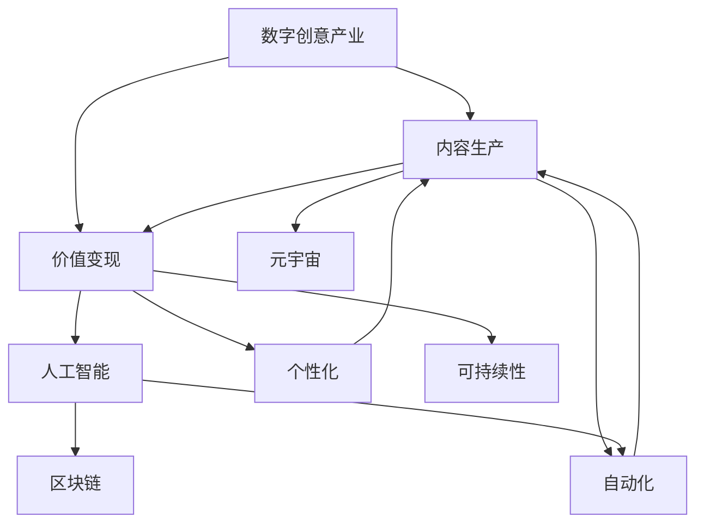

                 

# 2050年的数字创意：从内容生产到价值变现的产业升级

> 关键词：数字创意,内容生产,价值变现,产业升级,人工智能,自动化,个性化,区块链,元宇宙,可持续性

## 1. 背景介绍

在21世纪的第二个十年，全球数字化转型加速推进，数字创意产业成为创新发展的焦点。从内容生产到价值变现的每一个环节，都受到了信息技术和智能化技术的深度影响。2050年，这一趋势将如何演进？未来数字创意产业将呈现何种新面貌？本文将带您深入探讨这一问题，为您揭示数字创意产业的下一个十年。

## 2. 核心概念与联系

### 2.1 核心概念概述

为更好地理解未来数字创意产业的升级路径，我们首先明确几个核心概念：

- **数字创意产业**：包括内容创作、编辑、分发、展示等多个环节，涉及广告、游戏、影视、音乐、出版等多个领域，是推动经济社会发展的重要力量。
- **内容生产**：涉及文字、图片、视频、音频等数字内容的创作和编辑。内容生产是数字创意产业的核心环节。
- **价值变现**：指将内容转化为市场价值的过程，包括广告、付费、版权、电商等多种模式。价值变现是数字创意产业的最终目标。
- **产业升级**：指通过技术创新和商业模式创新，提升数字创意产业的效率、质量和竞争力。
- **人工智能(AI)**：作为关键技术之一，AI能够自动化内容创作、智能推荐、版权保护等环节，提升产业效率。
- **自动化(Automation)**：通过AI和机器人流程自动化(RPA)技术，实现内容创作、编辑、分发等环节的自动化，降低人工成本。
- **个性化(Personalization)**：利用AI和用户画像技术，实现内容定制化，提升用户体验和粘性。
- **区块链(Blockchain)**：通过去中心化、不可篡改等特性，实现内容版权的智能管理和流转。
- **元宇宙(Metaverse)**：基于VR/AR、云计算、物联网等技术，构建沉浸式的数字创意空间，提供沉浸式的内容体验。
- **可持续性(Sustainability)**：通过绿色技术应用，实现数字创意产业的可持续发展。

这些概念之间的逻辑关系可以通过以下Mermaid流程图来展示：



这个流程图展示的数字创意产业的各个核心环节及其相互关系：

1. 数字创意产业通过内容生产和价值变现两个主要环节实现循环。
2. 内容生产环节通过人工智能和自动化技术进行升级。
3. 价值变现环节通过个性化、区块链和元宇宙技术进行升级。
4. 整个产业的可持续发展依赖于可持续性技术的应用。

## 3. 核心算法原理 & 具体操作步骤
### 3.1 算法原理概述

未来数字创意产业的升级，将深度依赖于人工智能和自动化技术。以下是几个关键算法的原理概述：

- **人工智能算法**：包括自然语言处理(NLP)、计算机视觉(CV)、语音识别(SR)等，用于自动化内容创作、智能推荐、版权保护等环节。
- **自动化算法**：如机器学习、规则引擎等，用于自动化内容编辑、分发、版权验证等流程。
- **个性化算法**：通过用户画像和推荐算法，实现内容的精准定制。
- **区块链算法**：包括智能合约、分布式账本等，用于实现内容版权的智能管理和流转。
- **元宇宙算法**：如虚拟现实(VR)、增强现实(AR)、实时渲染等，用于构建沉浸式的数字创意空间。
- **可持续性算法**：包括绿色数据中心、节能算法等，用于实现产业的可持续发展。

### 3.2 算法步骤详解

未来数字创意产业的升级，将经历以下几个关键步骤：

**Step 1: 数据准备与预处理**
- 收集各类数字内容数据，如文字、图片、视频等。
- 对数据进行清洗、去重、标注等预处理，准备用于模型训练。

**Step 2: 模型训练与优化**
- 利用深度学习、自然语言处理等技术，训练各类内容生成、智能推荐、版权保护等模型。
- 通过迁移学习、增量学习等技术，优化模型以适应不断变化的内容和市场环境。

**Step 3: 自动化流程构建**
- 利用机器学习和规则引擎，自动化内容创作、编辑、分发等流程。
- 通过机器人流程自动化(RPA)技术，实现内容创作和编辑流程的自动化。

**Step 4: 个性化服务实现**
- 构建用户画像，使用推荐算法实现内容的个性化推荐。
- 利用NLP技术，实现对用户需求的智能理解和响应。

**Step 5: 区块链版权管理**
- 利用智能合约技术，实现内容的智能版权管理和流转。
- 使用分布式账本技术，确保版权信息的不可篡改和透明。

**Step 6: 元宇宙内容制作**
- 利用VR/AR、实时渲染等技术，制作沉浸式的数字内容。
- 使用云计算、物联网等技术，实现内容的高效分发和互动。

**Step 7: 可持续性优化**
- 应用绿色数据中心、节能算法等技术，提升内容制作和分发的能效。
- 通过循环经济和资源再利用技术，实现产业的可持续发展。

### 3.3 算法优缺点

未来数字创意产业的升级算法具有以下优点：
1. 提高生产效率：通过自动化和智能化技术，大幅降低人工成本，提升生产效率。
2. 优化用户体验：通过个性化算法和元宇宙技术，提供更加沉浸和个性化的内容体验。
3. 增强版权保护：通过区块链技术，实现版权的智能管理和流转，减少侵权风险。
4. 推动创新发展：通过AI、自动化、元宇宙等技术，催生更多创新应用场景。

同时，这些算法也存在一定的局限性：
1. 技术依赖性强：算法的有效运行依赖于高水平的算法和硬件支持，对技术要求较高。
2. 数据隐私风险：个性化和自动化技术依赖大量数据，可能引发用户隐私泄露问题。
3. 伦理道德问题：自动化和智能推荐可能带来算法偏见和伦理问题。
4. 经济门槛高：高端技术和设备成本较高，中小企业难以负担。
5. 可持续性挑战：绿色技术和资源再利用技术的推广仍需时日。

尽管存在这些局限性，但总体而言，未来数字创意产业升级的算法仍具有显著的潜力。技术发展和应用落地将继续推动产业升级，为内容生产和价值变现带来新的突破。

### 3.4 算法应用领域

未来数字创意产业升级的算法将广泛应用于多个领域：

- **影视制作**：利用自动化和AI技术，实现剧本创作、场景渲染、剪辑自动化的影视制作流程。
- **游戏开发**：通过AI和自动化技术，实现游戏内容的自动生成、角色智能交互等功能。
- **广告营销**：利用个性化算法和区块链技术，实现广告内容的精准推荐和智能版权管理。
- **音乐制作**：利用AI和自动化技术，实现音乐创作、编排和版权保护。
- **出版发行**：通过区块链和自动化技术，实现书籍的智能版权管理和高效分发。

## 4. 数学模型和公式 & 详细讲解
### 4.1 数学模型构建

未来数字创意产业的升级，涉及多个数学模型的构建和优化。以下是几个典型的数学模型：

**内容生成模型**：
- 基于自然语言处理的文本生成模型，如GPT-3、BERT等。
- 基于计算机视觉的图像生成模型，如GAN、VAE等。
- 基于语音识别的语音生成模型，如WaveNet、Tacotron等。

**智能推荐模型**：
- 基于协同过滤的推荐算法，如ALS、SVD等。
- 基于深度学习的推荐算法，如CaserRank、Wide&Deep等。

**版权管理模型**：
- 基于智能合约的版权管理模型，如ERC-721、erc-1155等。
- 基于分布式账本的内容版权管理模型，如Hyperledger、Fabric等。

**元宇宙内容模型**：
- 基于VR/AR的虚拟场景模型，如Unity、Unreal Engine等。
- 基于实时渲染和云计算的内容分发模型，如AWS、Google Cloud等。

### 4.2 公式推导过程

以下以文本生成模型为例，推导基于自然语言处理的文本生成模型的基本公式。

假设文本序列为 $X=\{x_1,x_2,\ldots,x_n\}$，其中 $x_i$ 为第 $i$ 个单词，文本生成模型 $p(x_1,x_2,\ldots,x_n|X)$ 表示给定上下文 $X$ 下生成文本序列的概率分布。利用Transformer模型，可以表示为：

$$
p(x_1,x_2,\ldots,x_n|X) = \prod_{i=1}^n p(x_i|x_{i-1},\ldots,x_1,X)
$$

其中，$p(x_i|x_{i-1},\ldots,x_1,X)$ 表示在给定上下文 $X$ 和前文 $x_{i-1},\ldots,x_1$ 下，生成单词 $x_i$ 的概率。利用注意力机制，可以表示为：

$$
p(x_i|x_{i-1},\ldots,x_1,X) = \frac{\exp(\mathbf{u}^\top \text{Softmax}(\mathbf{v}^\top \text{Softmax}(\mathbf{W}_Q[\mathbf{x}_{i-1},\ldots,\mathbf{x}_1,X]))}{\sum_j \exp(\mathbf{u}^\top \text{Softmax}(\mathbf{v}^\top \text{Softmax}(\mathbf{W}_Q[\mathbf{x}_{i-1},\ldots,\mathbf{x}_1,X]))}
$$

其中，$\mathbf{u}$、$\mathbf{v}$ 为向量，$\mathbf{W}_Q$ 为权重矩阵。

### 4.3 案例分析与讲解

以基于Transformer的文本生成模型为例，分析其在内容生成中的应用。假设用户希望生成一篇关于“人工智能的未来”的短文，利用该模型可以自动生成如下文本：

```
人工智能，这一近年来备受关注的新兴技术，正以惊人的速度改变着人类社会的各个方面。从医疗到教育，从金融到制造，人工智能在各个领域展现出巨大的潜力。然而，随着技术的不断发展，人工智能也带来了一些前所未有的挑战。如何在享受技术红利的同时，避免伦理和道德风险？这是我们必须面对的问题。未来，人工智能将如何影响我们的世界？让我们一起期待吧。
```

以上文本生成的过程，展示了基于Transformer的文本生成模型在内容创作中的应用，通过自监督学习和上下文理解，生成高质量的内容。

## 5. 项目实践：代码实例和详细解释说明
### 5.1 开发环境搭建

未来数字创意产业的升级项目，通常需要高性能的计算环境。以下是基于Python和PyTorch的开发环境搭建流程：

1. 安装Anaconda：从官网下载并安装Anaconda，用于创建独立的Python环境。

2. 创建并激活虚拟环境：
```bash
conda create -n pytorch-env python=3.8 
conda activate pytorch-env
```

3. 安装PyTorch：根据CUDA版本，从官网获取对应的安装命令。例如：
```bash
conda install pytorch torchvision torchaudio cudatoolkit=11.1 -c pytorch -c conda-forge
```

4. 安装各类工具包：
```bash
pip install numpy pandas scikit-learn matplotlib tqdm jupyter notebook ipython
```

5. 安装Transformer库：
```bash
pip install transformers
```

完成上述步骤后，即可在`pytorch-env`环境中开始项目实践。

### 5.2 源代码详细实现

下面以基于Transformer的文本生成模型为例，给出使用PyTorch和HuggingFace库实现文本生成的完整代码。

```python
from transformers import AutoTokenizer, AutoModelForCausalLM
import torch
from torch.utils.data import DataLoader
import torch.nn.functional as F

# 初始化模型和分词器
tokenizer = AutoTokenizer.from_pretrained('gpt3-medium')
model = AutoModelForCausalLM.from_pretrained('gpt3-medium')

# 定义函数生成文本
def generate_text(start_str, num_words):
    input_ids = tokenizer.encode(start_str, return_tensors='pt')
    output_ids = []
    model.eval()
    with torch.no_grad():
        for i in range(num_words):
            outputs = model.generate(input_ids, max_length=100, num_return_sequences=1, top_p=0.9)
            output_ids.append(outputs[0])
    return tokenizer.decode(output_ids[-1], skip_special_tokens=True)

# 生成关于人工智能未来的文本
text = generate_text("人工智能，这一近年来备受关注的新兴技术", 50)
print(text)
```

### 5.3 代码解读与分析

让我们再详细解读一下关键代码的实现细节：

**AutoTokenizer和AutoModelForCausalLM**：
- `AutoTokenizer.from_pretrained('gpt3-medium')`：初始化预训练的gpt3-medium分词器。
- `AutoModelForCausalLM.from_pretrained('gpt3-medium')`：初始化预训练的gpt3-medium生成模型。

**generate_text函数**：
- 使用分词器将输入字符串编码为token ids。
- 通过循环生成指定长度的文本，利用`generate`方法生成文本序列。
- 将生成的token ids解码为字符串，并返回结果。

**代码实现细节**：
- 利用预训练的gpt3-medium模型，通过自监督学习和上下文理解，自动生成高质量的文本。
- 设置参数`top_p=0.9`，表示文本生成的温度，用于控制生成文本的多样性。

## 6. 实际应用场景
### 6.1 影视制作

未来数字创意产业的升级，在影视制作领域将带来显著的变化。通过自动化和AI技术，影视制作流程将更加高效、灵活。

**剧本创作**：利用AI和自动化技术，自动生成剧本初稿，提高剧本创作效率。例如，使用GPT-3等自然语言处理模型，自动生成电影剧本的初稿，然后由人工进行修改和完善。

**场景渲染**：通过VR/AR技术，实现沉浸式的场景渲染，提升影视作品的艺术效果。例如，利用Unity等游戏引擎，构建虚拟场景，并通过实时渲染技术，展示高质量的视觉体验。

**剪辑自动化**：利用AI和自动化技术，实现自动剪辑和编辑。例如，使用Deepfake技术，实现对视频片段的自动化剪辑和编辑，提升制作效率和效果。

### 6.2 游戏开发

未来数字创意产业的升级，在游戏开发领域将带来新的变革。通过AI和自动化技术，游戏内容将更加丰富、智能。

**游戏内容自动化生成**：利用AI技术，自动生成游戏中的场景、角色、任务等内容。例如，使用GAN等生成对抗网络，自动生成游戏中的虚拟场景，提升游戏的多样性和可玩性。

**智能角色交互**：通过AI技术，实现游戏中角色的智能交互。例如，利用深度强化学习技术，实现游戏中NPC角色的自主决策和行为，提升游戏沉浸感和交互性。

**游戏化广告**：利用游戏化技术，实现广告内容的互动和个性化推荐。例如，在游戏中插入广告内容，利用AI技术，根据玩家行为和偏好，动态生成广告推荐，提升广告效果和用户体验。

### 6.3 广告营销

未来数字创意产业的升级，在广告营销领域将带来新的机遇。通过AI和区块链技术，广告内容将更加精准、安全。

**个性化广告推荐**：利用AI技术，实现广告内容的精准推荐。例如，通过协同过滤和深度学习算法，根据用户的兴趣和行为，动态生成个性化广告推荐，提升广告效果和转化率。

**智能版权管理**：利用区块链技术，实现广告内容的智能版权管理。例如，使用erc-721智能合约，确保广告内容在流转和使用过程中，版权信息不可篡改，保障广告主权益。

**区块链广告平台**：利用区块链技术，构建去中心化的广告平台。例如，使用Hyperledger等区块链技术，构建广告发布和交易平台，提升广告交易的透明性和安全性。

## 7. 工具和资源推荐
### 7.1 学习资源推荐

为了帮助开发者系统掌握未来数字创意产业升级的理论基础和实践技巧，这里推荐一些优质的学习资源：

1. 《深度学习与计算机视觉：理论与实践》系列博文：由大模型技术专家撰写，深入浅出地介绍了深度学习在图像和视频处理中的应用。

2. Coursera《深度学习与自然语言处理》课程：斯坦福大学开设的NLP明星课程，有Lecture视频和配套作业，带你入门NLP领域的基本概念和经典模型。

3. 《NLP深度学习实战》书籍：NLP深度学习领域的经典著作，详细介绍了NLP中的深度学习技术，包括文本生成、机器翻译等。

4. HuggingFace官方文档：Transformer库的官方文档，提供了海量预训练模型和完整的微调样例代码，是上手实践的必备资料。

5. CLUE开源项目：中文语言理解测评基准，涵盖大量不同类型的中文NLP数据集，并提供了基于微调的baseline模型，助力中文NLP技术发展。

通过对这些资源的学习实践，相信你一定能够快速掌握未来数字创意产业升级的精髓，并用于解决实际的NLP问题。

### 7.2 开发工具推荐

高效的开发离不开优秀的工具支持。以下是几款用于未来数字创意产业升级开发的常用工具：

1. PyTorch：基于Python的开源深度学习框架，灵活动态的计算图，适合快速迭代研究。大部分预训练语言模型都有PyTorch版本的实现。

2. TensorFlow：由Google主导开发的开源深度学习框架，生产部署方便，适合大规模工程应用。同样有丰富的预训练语言模型资源。

3. Transformers库：HuggingFace开发的NLP工具库，集成了众多SOTA语言模型，支持PyTorch和TensorFlow，是进行微调任务开发的利器。

4. Weights & Biases：模型训练的实验跟踪工具，可以记录和可视化模型训练过程中的各项指标，方便对比和调优。与主流深度学习框架无缝集成。

5. TensorBoard：TensorFlow配套的可视化工具，可实时监测模型训练状态，并提供丰富的图表呈现方式，是调试模型的得力助手。

6. Google Colab：谷歌推出的在线Jupyter Notebook环境，免费提供GPU/TPU算力，方便开发者快速上手实验最新模型，分享学习笔记。

合理利用这些工具，可以显著提升未来数字创意产业升级的开发效率，加快创新迭代的步伐。

### 7.3 相关论文推荐

未来数字创意产业升级的研究源于学界的持续研究。以下是几篇奠基性的相关论文，推荐阅读：

1. Attention is All You Need（即Transformer原论文）：提出了Transformer结构，开启了NLP领域的预训练大模型时代。

2. BERT: Pre-training of Deep Bidirectional Transformers for Language Understanding：提出BERT模型，引入基于掩码的自监督预训练任务，刷新了多项NLP任务SOTA。

3. Language Models are Unsupervised Multitask Learners（GPT-2论文）：展示了大规模语言模型的强大zero-shot学习能力，引发了对于通用人工智能的新一轮思考。

4. Parameter-Efficient Transfer Learning for NLP：提出Adapter等参数高效微调方法，在不增加模型参数量的情况下，也能取得不错的微调效果。

5. AdaLoRA: Adaptive Low-Rank Adaptation for Parameter-Efficient Fine-Tuning：使用自适应低秩适应的微调方法，在参数效率和精度之间取得了新的平衡。

6. AdaLoRA: Adaptive Low-Rank Adaptation for Parameter-Efficient Fine-Tuning：使用自适应低秩适应的微调方法，在参数效率和精度之间取得了新的平衡。

这些论文代表了大语言模型微调技术的发展脉络。通过学习这些前沿成果，可以帮助研究者把握学科前进方向，激发更多的创新灵感。

## 8. 总结：未来发展趋势与挑战

### 8.1 研究成果总结

未来数字创意产业的升级，将深度依赖于人工智能和自动化技术。以下是几个关键的研究成果总结：

1. 内容生成自动化：利用AI技术，自动生成高质量的内容，提高内容创作的效率和效果。
2. 智能推荐系统：通过个性化算法，实现广告、商品、音乐等内容的精准推荐，提升用户体验和粘性。
3. 区块链版权管理：利用区块链技术，实现内容的智能版权管理和流转，保障版权权益。
4. 元宇宙内容制作：利用VR/AR、实时渲染等技术，构建沉浸式的数字内容，提供沉浸式的内容体验。
5. 绿色可持续发展：应用绿色数据中心、节能算法等技术，实现数字创意产业的可持续发展。

### 8.2 未来发展趋势

展望未来，未来数字创意产业的升级将呈现以下几个趋势：

1. 内容创作智能化：未来内容创作将更加自动化、智能化，利用AI技术，生成高质量的文本、图像、视频等内容。

2. 广告营销精准化：未来广告推荐将更加精准、个性化，利用AI技术和区块链技术，实现广告内容的智能管理和流转。

3. 游戏体验沉浸化：未来游戏内容将更加丰富、智能，利用AI技术和元宇宙技术，提升游戏沉浸感和交互性。

4. 版权保护智能化：未来版权管理将更加智能、透明，利用区块链技术和智能合约，实现内容版权的智能管理和流转。

5. 产业可持续发展：未来数字创意产业将更加绿色、可持续，利用绿色技术、节能算法等，实现产业的可持续发展。

### 8.3 面临的挑战

尽管未来数字创意产业升级充满机遇，但仍面临诸多挑战：

1. 技术依赖性强：算法的有效运行依赖于高水平的算法和硬件支持，对技术要求较高。
2. 数据隐私风险：个性化和自动化技术依赖大量数据，可能引发用户隐私泄露问题。
3. 伦理道德问题：自动化和智能推荐可能带来算法偏见和伦理问题。
4. 经济门槛高：高端技术和设备成本较高，中小企业难以负担。
5. 可持续性挑战：绿色技术和资源再利用技术的推广仍需时日。

尽管存在这些挑战，但总体而言，未来数字创意产业升级的潜力巨大。技术发展和应用落地将继续推动产业升级，为内容生产和价值变现带来新的突破。

### 8.4 研究展望

未来数字创意产业的升级研究，需要在以下几个方向寻求新的突破：

1. 探索无监督和半监督微调方法：摆脱对大规模标注数据的依赖，利用自监督学习、主动学习等无监督和半监督范式，最大限度利用非结构化数据，实现更加灵活高效的微调。

2. 研究参数高效和计算高效的微调范式：开发更加参数高效的微调方法，在固定大部分预训练参数的同时，只更新极少量的任务相关参数。同时优化微调模型的计算图，减少前向传播和反向传播的资源消耗，实现更加轻量级、实时性的部署。

3. 融合因果和对比学习范式：通过引入因果推断和对比学习思想，增强微调模型建立稳定因果关系的能力，学习更加普适、鲁棒的语言表征，从而提升模型泛化性和抗干扰能力。

4. 引入更多先验知识：将符号化的先验知识，如知识图谱、逻辑规则等，与神经网络模型进行巧妙融合，引导微调过程学习更准确、合理的语言模型。同时加强不同模态数据的整合，实现视觉、语音等多模态信息与文本信息的协同建模。

5. 结合因果分析和博弈论工具：将因果分析方法引入微调模型，识别出模型决策的关键特征，增强输出解释的因果性和逻辑性。借助博弈论工具刻画人机交互过程，主动探索并规避模型的脆弱点，提高系统稳定性。

6. 纳入伦理道德约束：在模型训练目标中引入伦理导向的评估指标，过滤和惩罚有偏见、有害的输出倾向。同时加强人工干预和审核，建立模型行为的监管机制，确保输出符合人类价值观和伦理道德。

这些研究方向的探索，必将引领未来数字创意产业升级技术迈向更高的台阶，为构建安全、可靠、可解释、可控的智能系统铺平道路。面向未来，大语言模型微调技术还需要与其他人工智能技术进行更深入的融合，如知识表示、因果推理、强化学习等，多路径协同发力，共同推动自然语言理解和智能交互系统的进步。只有勇于创新、敢于突破，才能不断拓展语言模型的边界，让智能技术更好地造福人类社会。

## 9. 附录：常见问题与解答

**Q1：未来数字创意产业升级是否只依赖于人工智能和自动化技术？**

A: 虽然人工智能和自动化技术是未来数字创意产业升级的核心驱动力，但产业升级还依赖于其他多种技术手段，如区块链、元宇宙、绿色技术等。这些技术共同作用，推动产业向智能化、普适化、绿色化方向发展。

**Q2：未来数字创意产业升级是否会带来更多的就业机会？**

A: 是的，未来数字创意产业升级将带来大量的新岗位和就业机会。特别是在内容创作、智能推荐、版权保护、绿色技术等领域，需要大量高素质的专业人才。同时，随着AI和自动化技术的普及，企业对劳动力的需求将更多地转向技能和创新能力。

**Q3：未来数字创意产业升级是否会引发行业垄断？**

A: 数字创意产业的升级将带来更高的市场准入门槛，部分头部企业可能垄断市场。但技术进步和市场竞争将推动产业健康发展，避免过度垄断。同时，通过政策法规、标准规范等手段，保障市场公平竞争，促进产业健康发展。

**Q4：未来数字创意产业升级是否会影响传统艺术和文化传承？**

A: 数字创意产业升级将带来更多创新表达方式，推动传统艺术和文化与新技术的融合。通过数字技术，可以将传统文化与现代艺术完美结合，提升艺术和文化传播效果。但同时也需要保护传统艺术的独特性和传承性，避免数字技术对传统艺术造成负面影响。

**Q5：未来数字创意产业升级是否会对环境造成不利影响？**

A: 数字创意产业升级将带来更多的能源消耗和环境污染，但通过绿色技术和可持续发展理念的应用，可以显著降低产业对环境的影响。未来数字创意产业将更加绿色、可持续，为环境保护做出贡献。

---

作者：禅与计算机程序设计艺术 / Zen and the Art of Computer Programming

