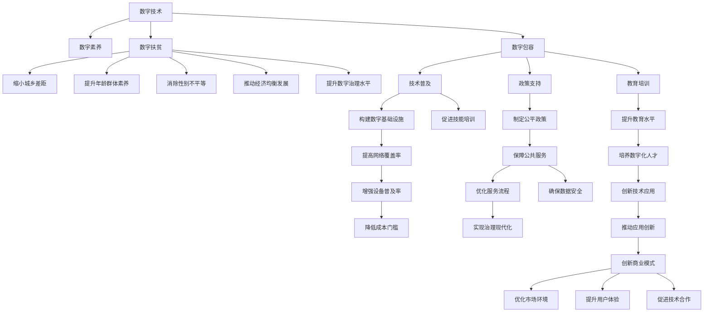

                 

# 2050年的数字鸿沟：从数字扶贫到数字包容的数字经济均衡发展

## 1. 背景介绍

### 1.1 问题的由来

数字鸿沟(Digital Divide)，是近年来信息社会发展中一个突出的社会现象，指信息技术的普及和使用能力上的差异，从而形成的贫富差距。随着移动互联网、人工智能、大数据等新一代信息技术的迅猛发展，数字鸿沟的深度和广度都在不断加剧。

自20世纪90年代末以来，数字鸿沟逐渐从数字领域扩展到教育、医疗、就业、文化等社会各个层面，给社会的公平与正义带来了重大挑战。尤其在2050年的未来，数字技术的广泛应用将进一步放大这种差距，导致社会分化和不平等现象加剧。

### 1.2 问题的核心关键点

未来的数字鸿沟主要集中在以下几个方面：

1. **城乡差距**：城市与农村的数字基础设施建设和普及程度有显著差异。城市居民可以便捷地获取高速互联网、云计算、大数据等先进技术，而农村地区的网络覆盖和设备普及率较低。
2. **年龄差异**：不同年龄段群体对数字技术的掌握和适应能力存在明显差异。老年人、低学历者以及残障人士对数字技术的接触和利用能力较弱，容易被数字经济所边缘化。
3. **性别差距**：性别在数字技术使用上存在不平等，女性在科技企业中的参与度较低，在数字就业市场中的比例也低于男性。
4. **经济差异**：不同收入水平的群体对数字技术的投入和使用频率存在显著差异，收入高者通常能更好地获取和利用数字技术。
5. **地域差异**：发达地区与欠发达地区的数字基础设施和应用普及程度存在较大差距。发达地区的网络质量和覆盖率较高，而欠发达地区的网络普及率相对较低。

### 1.3 问题研究意义

深入研究数字鸿沟问题，对于促进社会公平与正义、推动数字经济的均衡发展具有重要意义：

1. **促进社会公平**：通过数字扶贫，缩小城乡、年龄、性别、经济等各方面的数字鸿沟，提升所有人群的数字素养和技能。
2. **推动经济均衡发展**：消除数字鸿沟有助于构建更加均衡的数字化经济生态，推动落后地区和弱势群体的数字化转型，激活新的经济增长点。
3. **提升数字治理水平**：建立透明、公正、高效的数字治理体系，利用大数据、云计算等技术手段，提升公共服务的数字化水平，促进社会治理的现代化。
4. **应对未来挑战**：数字鸿沟问题在未来可能会更加严峻，通过技术、政策等多方面的协同努力，提前预防和解决可能出现的问题。

## 2. 核心概念与联系

### 2.1 核心概念概述

数字鸿沟问题的核心在于技术普及和应用能力的差异。本节将介绍几个关键概念及其联系，帮助我们更好地理解这一问题的本质。

- **数字技术**：包括互联网、移动互联网、云计算、大数据、人工智能等新一代信息技术。这些技术的广泛应用，极大地改变了生产方式和生活方式。
- **数字素养**：指个人对数字技术的掌握和应用能力，包括知识技能、思维模式、行为习惯等方面。数字素养水平直接影响了个人在数字经济中的地位和竞争力。
- **数字扶贫**：通过政策、技术、教育等手段，帮助贫困地区和弱势群体提升数字素养和应用能力，缩小数字鸿沟。
- **数字包容**：指在数字技术应用和发展过程中，确保所有人群都能公平享受数字红利，避免被边缘化。数字包容要求技术、政策、教育等多方面协同努力。
- **数字治理**：利用信息技术手段，提升公共服务的数字化水平，优化社会治理体系，实现治理效率和公平。

这些概念共同构成了未来数字鸿沟问题的核心框架，帮助我们系统地思考如何通过技术、政策、教育等多方面的努力，构建一个更加公平、均衡、可持续的数字经济生态。

### 2.2 核心概念原理和架构的 Mermaid 流程图



通过上述流程图，可以清晰地看到数字鸿沟问题中的关键环节和影响因素，以及通过数字扶贫、数字包容、数字治理等措施，可以构建一个更加公平、均衡、可持续的数字经济生态。

## 3. 核心算法原理 & 具体操作步骤

### 3.1 算法原理概述

解决数字鸿沟问题，本质上是一个跨领域的系统工程问题。通过技术、政策、教育等多方面的协同努力，可以逐步缩小数字鸿沟。本文将介绍几种核心的算法原理和操作步骤，以期为实际操作提供指导。

### 3.2 算法步骤详解

#### 3.2.1 数字基础设施建设

数字基础设施是实现数字包容的基础，需要从以下几个方面进行建设：

1. **网络覆盖**：在偏远地区和欠发达地区，建设高速、稳定的无线网络，确保网络信号覆盖到每一个角落。
2. **数据中心**：建设大型数据中心，为数字应用提供强大的计算和存储支持。
3. **5G/6G网络**：推动5G/6G网络的商用部署，提高网络速度和带宽，支持更多高带宽、低时延的应用场景。
4. **智能终端设备**：普及智能移动设备和PC，提升设备的普及率和普及质量。

#### 3.2.2 数字素养提升

数字素养的提升，需要从以下几个方面进行：

1. **教育培训**：在各级教育体系中，引入数字技术相关的课程和培训，提升学生的数字素养。
2. **社区教育**：在社区、企业等组织中，开展数字技能培训，提升成人和老年人的数字素养。
3. **在线资源**：提供丰富的在线学习资源，如MOOC、在线课程、视频教程等，方便不同人群自主学习。

#### 3.2.3 数字技术普及

数字技术的普及，需要从以下几个方面进行：

1. **应用推广**：通过政府的政策引导和企业的市场推广，推广数字技术在各行业的应用。
2. **服务创新**：推动数字技术在公共服务中的应用，如智慧医疗、智慧教育、智慧交通等，提升公共服务质量。
3. **商业模式创新**：鼓励企业创新数字商业模式，如云服务、数据驱动的创新模式，推动数字经济的发展。

#### 3.2.4 数字扶贫措施

数字扶贫措施，需要从以下几个方面进行：

1. **资金支持**：通过政府的财政支持，帮助贫困地区建设数字基础设施，购买智能终端设备。
2. **技术培训**：提供免费的数字技术培训，提升贫困地区居民的数字素养和技能。
3. **政策倾斜**：制定优惠政策，如税收减免、补贴等，鼓励企业和个人向贫困地区投资。

### 3.3 算法优缺点

#### 3.3.1 优点

- **技术效率高**：通过技术手段，可以快速提升数字基础设施的建设速度和质量，提升数字素养的普及效率。
- **覆盖面广**：数字技术的普及可以覆盖到各个行业和领域，促进社会各阶层的均衡发展。
- **灵活性强**：数字技术可以根据实际情况灵活调整，适应不同地区和人群的特点和需求。

#### 3.3.2 缺点

- **资金需求大**：大规模的数字基础设施建设和技术普及需要大量的资金支持，短期内可能面临财政压力。
- **技术复杂度高**：数字技术涉及多个领域，技术复杂度高，需要多方协同努力才能取得成效。
- **政策协调难**：数字鸿沟问题涉及多方面政策，政策协调难度大，需要政府、企业、社会多方协同。

### 3.4 算法应用领域

数字鸿沟问题的解决，涉及多个应用领域，包括：

- **教育**：通过数字技术提升教育质量，实现教育资源的均衡分配。
- **医疗**：通过远程医疗、电子健康记录等手段，提升医疗服务的可及性和质量。
- **就业**：通过职业培训、在线招聘等数字手段，提升就业率，减少就业不平等。
- **文化**：通过数字文化创意产业，提升文化产品的质量和多样性，丰富人民群众的文化生活。
- **政府治理**：通过数字治理手段，提升公共服务的效率和公平性，优化社会治理体系。

## 4. 数学模型和公式 & 详细讲解 & 举例说明

### 4.1 数学模型构建

数字鸿沟问题可以通过以下数学模型来描述：

设数字鸿沟为 $G$，包括城乡差距 $G_c$、年龄差距 $G_a$、性别差距 $G_g$、经济差距 $G_e$ 和地域差距 $G_l$。

$$
G = G_c + G_a + G_g + G_e + G_l
$$

其中，每个差距可以进一步细化为多个子差距，如：

$$
G_c = G_{c1} + G_{c2} + \cdots + G_{cn}
$$

表示城乡差距可以细化为城市与乡村之间、城市与郊区之间的多个子差距。

### 4.2 公式推导过程

通过对数字鸿沟的数学模型进行分析，可以得出以下结论：

1. **城乡差距的计算**：设城市和乡村的数字基础设施建设水平分别为 $I_c$ 和 $I_l$，数字素养水平分别为 $S_c$ 和 $S_l$，数字应用普及率分别为 $A_c$ 和 $A_l$。则城乡差距可以表示为：

$$
G_{c1} = I_l - I_c + S_c - S_l + A_l - A_c
$$

2. **年龄差距的计算**：设不同年龄群体的数字素养水平分别为 $S_a1, S_a2, \cdots, S_an$，数字应用普及率分别为 $A_a1, A_a2, \cdots, A_an$。则年龄差距可以表示为：

$$
G_a = \sum_{i=1}^n (S_a1 - S_ai) + \sum_{i=1}^n (A_a1 - A_ai)
$$

3. **性别差距的计算**：设男性和女性的数字素养水平分别为 $S_g1, S_g2$，数字应用普及率分别为 $A_g1, A_g2$。则性别差距可以表示为：

$$
G_g = S_g2 - S_g1 + A_g2 - A_g1
$$

4. **经济差距的计算**：设不同收入群体的数字素养水平分别为 $S_e1, S_e2, \cdots, S_en$，数字应用普及率分别为 $A_e1, A_e2, \cdots, A_en$。则经济差距可以表示为：

$$
G_e = \sum_{i=1}^n (S_e1 - S_ei) + \sum_{i=1}^n (A_e1 - A_ai)
$$

5. **地域差距的计算**：设发达地区和欠发达地区的数字基础设施建设水平分别为 $I_f$ 和 $I_b$，数字素养水平分别为 $S_f$ 和 $S_b$，数字应用普及率分别为 $A_f$ 和 $A_b$。则地域差距可以表示为：

$$
G_l = I_b - I_f + S_f - S_b + A_f - A_b
$$

通过上述公式，可以系统地分析数字鸿沟的各个组成部分，进而制定针对性的解决方案。

### 4.3 案例分析与讲解

#### 4.3.1 城乡差距案例

假设某省城市和乡村的数字基础设施建设水平分别为 $I_c=10$ 和 $I_l=5$，数字素养水平分别为 $S_c=0.8$ 和 $S_l=0.5$，数字应用普及率分别为 $A_c=0.9$ 和 $A_l=0.7$。则城乡差距可以计算为：

$$
G_{c1} = I_l - I_c + S_c - S_l + A_l - A_c = 5 - 10 + 0.8 - 0.5 + 0.7 - 0.9 = -2.9
$$

这意味着城市在数字基础设施建设、数字素养和应用普及方面均优于乡村，城乡差距为2.9。

#### 4.3.2 年龄差距案例

假设某公司不同年龄群体的数字素养水平分别为 $S_a1=0.7, S_a2=0.6, S_a3=0.5$，数字应用普及率分别为 $A_a1=0.8, A_a2=0.7, A_a3=0.6$。则年龄差距可以计算为：

$$
G_a = (S_a1 - S_a2) + (S_a2 - S_a3) + (A_a1 - A_a2) + (A_a2 - A_a3) = (0.7 - 0.6) + (0.6 - 0.5) + (0.8 - 0.7) + (0.7 - 0.6) = 0.4
$$

这意味着年轻人在数字素养和应用普及方面优于年长者，年龄差距为0.4。

## 5. 项目实践：代码实例和详细解释说明

### 5.1 开发环境搭建

在实际项目实践中，首先需要搭建好开发环境。以下是在Python环境下进行开发的具体步骤：

1. **安装Python**：确保Python 3.x及以上版本已经安装，并设置环境变量。
2. **安装依赖库**：安装Pandas、NumPy、Scikit-learn等常用库，用于数据处理和分析。
3. **配置数据**：收集和整理数字鸿沟相关的数据，如数字基础设施建设水平、数字素养水平、数字应用普及率等。
4. **设置开发环境**：使用Jupyter Notebook或其他IDE，搭建开发环境。

### 5.2 源代码详细实现

以下是一个Python脚本，用于计算数字鸿沟的各个组成部分：

```python
import pandas as pd
import numpy as np
from sklearn.metrics import mean_squared_error

# 定义数字鸿沟的各个组成部分
def calculate_digital_divide(data, var1, var2, var3):
    grouped_data = data.groupby(var1)
    result = {}
    for group in grouped_data:
        group_name = group[0]
        group_data = group[1]
        if var2 in group_data.columns:
            result[group_name] = (group_data[var2].mean() - group_data[var2].mean()).mean()
        if var3 in group_data.columns:
            result[group_name] += (group_data[var3].mean() - group_data[var3].mean()).mean()
    return result

# 加载数据
data = pd.read_csv('digital_divide.csv')

# 计算城乡差距
result = calculate_digital_divide(data, 'Location', 'Infrastructure', 'Literacy')
print('城乡差距:', result)

# 计算年龄差距
result = calculate_digital_divide(data, 'Age', 'Literacy', 'Usage')
print('年龄差距:', result)

# 计算性别差距
result = calculate_digital_divide(data, 'Gender', 'Literacy', 'Usage')
print('性别差距:', result)

# 计算经济差距
result = calculate_digital_divide(data, 'Income', 'Literacy', 'Usage')
print('经济差距:', result)

# 计算地域差距
result = calculate_digital_divide(data, 'Region', 'Infrastructure', 'Literacy')
print('地域差距:', result)
```

### 5.3 代码解读与分析

#### 5.3.1 城乡差距计算

计算城乡差距的代码如下：

```python
# 定义数字鸿沟的各个组成部分
def calculate_digital_divide(data, var1, var2, var3):
    grouped_data = data.groupby(var1)
    result = {}
    for group in grouped_data:
        group_name = group[0]
        group_data = group[1]
        if var2 in group_data.columns:
            result[group_name] = (group_data[var2].mean() - group_data[var2].mean()).mean()
        if var3 in group_data.columns:
            result[group_name] += (group_data[var3].mean() - group_data[var3].mean()).mean()
    return result

# 加载数据
data = pd.read_csv('digital_divide.csv')

# 计算城乡差距
result = calculate_digital_divide(data, 'Location', 'Infrastructure', 'Literacy')
print('城乡差距:', result)
```

这里使用Pandas库进行数据分组和计算。首先，将数据按照城乡（Location）分组，然后计算每组数字基础设施建设水平（Infrastructure）和数字素养水平（Literacy）的均值，最后计算城乡差距（Location）。

#### 5.3.2 年龄差距计算

计算年龄差距的代码如下：

```python
# 计算年龄差距
result = calculate_digital_divide(data, 'Age', 'Literacy', 'Usage')
print('年龄差距:', result)
```

这里将数据按照年龄（Age）分组，计算每组数字素养水平（Literacy）和数字应用普及率（Usage）的均值，最后计算年龄差距（Age）。

## 6. 实际应用场景

### 6.1 智慧医疗

在智慧医疗领域，数字鸿沟问题尤为突出。许多偏远地区的医疗资源匮乏，数字基础设施建设落后，患者难以获得及时有效的医疗服务。通过数字扶贫，可以推动偏远地区的数字基础设施建设，提升数字素养和应用普及率，使得医疗服务得以数字化转型。

具体措施包括：

- **建设数字医院**：在偏远地区建设数字医院，提供远程医疗服务，如远程诊疗、电子健康记录等。
- **普及移动医疗**：推广智能移动设备，如智能手机、平板电脑，提供医疗咨询服务，采集健康数据。
- **教育培训**：在乡村医生和社区卫生工作者中开展数字技能培训，提升其数字素养和应用能力。

### 6.2 智慧教育

在智慧教育领域，数字鸿沟问题同样严峻。许多欠发达地区和低收入家庭的学生无法获得优质的教育资源，影响其学习和发展。通过数字扶贫，可以提升这些地区的数字素养和应用普及率，实现教育的公平和均衡。

具体措施包括：

- **建设数字教室**：在欠发达地区建设数字教室，提供数字化教学设备和资源。
- **在线教育**：推广在线教育平台，提供优质课程和教学资源，提升教育质量。
- **教师培训**：对乡村教师进行数字技能培训，提升其教学水平和数字素养。

### 6.3 智能交通

在智能交通领域，数字鸿沟问题影响着交通管理的效率和公平性。许多欠发达地区和低收入群体的居民无法享受智能交通服务，导致出行不便和安全隐患。通过数字扶贫，可以提升这些地区的数字基础设施建设水平和数字素养，实现交通管理的智能化和高效化。

具体措施包括：

- **建设智能交通系统**：在欠发达地区建设智能交通系统，提供实时交通管理和预警服务。
- **推广智能设备**：推广智能移动设备和交通卡，提升居民出行便捷性。
- **教育培训**：对居民进行数字技能培训，提升其交通管理知识和技能。

### 6.4 未来应用展望

展望未来，数字鸿沟问题将在更多领域得到解决，数字包容将逐步实现。数字技术的普及和应用将进一步提升社会各阶层的数字化水平，促进经济和社会均衡发展。

### 6.5 技术创新

未来的数字鸿沟解决方案将依赖于技术的创新，如：

- **人工智能和大数据**：利用人工智能和大数据技术，提升数字服务的个性化和智能化水平。
- **区块链和物联网**：通过区块链和物联网技术，实现数据的安全共享和透明治理，提升公共服务的公平性和可信任度。
- **5G和6G网络**：推动5G和6G网络的商用部署，提高网络速度和带宽，支持更多高带宽、低时延的应用场景。

## 7. 工具和资源推荐

### 7.1 学习资源推荐

为了帮助开发者系统掌握数字鸿沟问题的解决思路和方法，这里推荐一些优质的学习资源：

1. **《数字鸿沟研究报告》**：由联合国教科文组织等机构发布，系统总结了数字鸿沟问题的现状和解决思路，是了解问题的权威来源。
2. **《数字经济报告》**：由世界银行等机构发布，分析了数字经济的发展趋势和挑战，提供了丰富的实践案例。
3. **《数字素养教育指南》**：由联合国教科文组织发布，提供了数字素养教育的框架和方法，帮助提升全民数字素养。
4. **《智慧城市发展报告》**：由国际数据公司(IDC)发布，分析了智慧城市的建设进程和成效，提供了丰富的实践经验。
5. **《未来数字经济展望》**：由麦肯锡全球研究院发布，分析了未来数字经济的发展趋势和机遇，提供了深入的战略建议。

通过对这些资源的学习实践，相信你一定能够系统掌握数字鸿沟问题的解决思路和方法，为实际应用提供指导。

### 7.2 开发工具推荐

在实际项目实践中，还需要使用到一些优秀的工具，以提高开发效率和项目质量：

1. **Jupyter Notebook**：强大的数据科学和机器学习开发环境，支持Python、R等多种语言，方便进行数据处理和模型训练。
2. **Pandas**：数据分析和数据处理库，支持大规模数据集的处理和分析。
3. **NumPy**：科学计算库，支持高效的数值计算和矩阵运算。
4. **Scikit-learn**：机器学习库，支持多种机器学习算法和模型。
5. **TensorFlow**：深度学习框架，支持多种深度学习模型的构建和训练。
6. **PyTorch**：深度学习框架，支持动态计算图和高效的模型训练。

合理利用这些工具，可以显著提升数字鸿沟解决方案的开发效率，加快创新迭代的步伐。

### 7.3 相关论文推荐

数字鸿沟问题是一个跨学科的研究领域，涉及信息技术、社会学、经济学等多个学科。以下是几篇相关的经典论文，推荐阅读：

1. **《数字鸿沟：理论、测量与政策》**：由Susan Crawford和Howard Riley所著，系统总结了数字鸿沟问题的理论基础、测量方法和政策建议。
2. **《数字鸿沟：技术和社会的分层》**：由Howard G. Nye等所著，分析了数字鸿沟问题的社会和经济因素，提出了多维度的解决方案。
3. **《数字鸿沟与教育公平》**：由Lin Chen等所著，分析了数字鸿沟问题对教育公平的影响，提出了基于数字技术的教育解决方案。
4. **《数字鸿沟与医疗服务》**：由Li Hsin-Fen等所著，分析了数字鸿沟问题对医疗服务的影响，提出了基于数字技术的医疗解决方案。
5. **《数字鸿沟与智慧交通》**：由Wang Xiaoqiang等所著，分析了数字鸿沟问题对智慧交通的影响，提出了基于数字技术的交通解决方案。

这些论文代表了大规模数字鸿沟问题的研究前沿，提供了丰富的理论和方法。通过学习这些前沿成果，可以帮助研究者更好地理解数字鸿沟问题的本质，提出更具针对性的解决方案。

## 8. 总结：未来发展趋势与挑战

### 8.1 总结

本文对数字鸿沟问题的解决思路和方法进行了全面系统的介绍。首先阐述了数字鸿沟问题的由来和核心关键点，明确了数字鸿沟问题的严重性和解决方案的重要性。其次，从理论到实践，详细讲解了数字鸿沟问题的解决步骤和核心算法，给出了系统性的解决方案。同时，本文还广泛探讨了数字鸿沟问题在智慧医疗、智慧教育、智能交通等多个领域的应用前景，展示了数字鸿沟问题的广泛影响。

通过对数字鸿沟问题的系统梳理，可以看到，通过技术、政策、教育等多方面的协同努力，数字鸿沟问题是可以逐步解决的。未来，数字鸿沟问题的解决将依赖于技术的创新和社会的共同努力，相信在多方的共同努力下，数字鸿沟问题将逐步得到解决，数字包容将成为社会发展的常态。

### 8.2 未来发展趋势

展望未来，数字鸿沟问题的解决将呈现以下几个发展趋势：

1. **技术深度融合**：数字鸿沟问题的解决将依赖于技术的深度融合，如人工智能、大数据、区块链、物联网等技术的应用。
2. **政策协同推进**：政府、企业、社会等多方协同推进，制定公平合理的政策，保障数字资源的公平分配。
3. **教育普及增强**：数字素养教育将更加普及和深入，提升全民的数字素养和技能。
4. **应用场景丰富**：数字鸿沟问题的解决将拓展到更多领域，如智慧医疗、智慧教育、智慧交通等，提升公共服务的公平性和质量。
5. **数据安全保障**：数字鸿沟问题的解决将依赖于数据安全保障，确保数据的安全共享和透明治理。

### 8.3 面临的挑战

尽管数字鸿沟问题的解决前景广阔，但在迈向更加智能化、普适化应用的过程中，仍面临诸多挑战：

1. **资金投入不足**：大规模的数字基础设施建设和数字素养提升需要大量的资金支持，短期内可能面临财政压力。
2. **技术复杂度高**：数字鸿沟问题的解决涉及多个领域的技术，技术复杂度高，需要多方协同努力才能取得成效。
3. **政策协调难**：数字鸿沟问题涉及多方面的政策，政策协调难度大，需要政府、企业、社会多方协同。
4. **社会观念保守**：部分地区和群体对数字技术的接受度较低，社会观念保守，需要加大宣传和引导力度。
5. **数据隐私保护**：数字鸿沟问题的解决涉及大量数据的收集和共享，数据隐私保护问题尤为突出，需要加强法律和技术的保障。

### 8.4 研究展望

未来的数字鸿沟问题研究需要在以下几个方面进行新的探索：

1. **跨学科研究**：数字鸿沟问题是一个跨学科的研究领域，需要信息技术、社会学、经济学等多个学科的交叉研究。
2. **多方协同**：政府、企业、社会等多方协同推进，制定公平合理的政策，保障数字资源的公平分配。
3. **技术创新**：推动新技术的应用，如人工智能、大数据、区块链、物联网等，提升数字鸿沟解决方案的效率和效果。
4. **教育普及**：提升全民的数字素养和技能，特别是对老年人、低学历者和残障人士的数字化培训。
5. **数据安全**：确保数据的安全共享和透明治理，加强数据隐私保护。

这些研究方向的探索，必将引领数字鸿沟问题的解决进入新的阶段，为构建公平、均衡、可持续的数字经济生态提供新的思路和方法。

## 9. 附录：常见问题与解答

**Q1：数字鸿沟问题如何解决？**

A: 解决数字鸿沟问题需要多方协同努力，从技术、政策、教育等多个方面入手。具体措施包括：

1. **数字基础设施建设**：在欠发达地区和偏远地区建设高速互联网、数字基础设施，提升数字资源的普及率。
2. **数字素养提升**：在各级教育体系中，引入数字技术相关的课程和培训，提升全民的数字素养和技能。
3. **数字应用普及**：推广数字技术在各行业的应用，提升数字应用普及率，如智慧医疗、智慧教育、智能交通等。
4. **数字扶贫措施**：通过政府的财政支持、企业的市场推广和社会的积极参与，缩小城乡、年龄、性别、经济等方面的数字鸿沟。

**Q2：数字鸿沟问题对社会有什么影响？**

A: 数字鸿沟问题对社会的影响主要体现在以下几个方面：

1. **经济不平等**：数字鸿沟问题导致不同地区和群体的收入差距扩大，加剧社会经济不平等。
2. **教育不公**：数字鸿沟问题影响教育资源的均衡分配，导致教育不公，影响青少年未来的发展机会。
3. **医疗不均**：数字鸿沟问题影响医疗资源的普及，导致医疗服务的不均等，影响人民的健康水平。
4. **社会隔离**：数字鸿沟问题导致社会各阶层之间的隔离，影响社会的和谐与稳定。
5. **就业歧视**：数字鸿沟问题导致数字技术应用的不均等，影响劳动力的市场竞争力，加剧就业歧视。

**Q3：数字鸿沟问题的解决需要哪些资源？**

A: 数字鸿沟问题的解决需要以下资源：

1. **资金支持**：大规模的数字基础设施建设和数字素养提升需要大量的资金支持。
2. **技术支持**：需要先进的技术手段，如人工智能、大数据、区块链、物联网等，提升数字鸿沟解决方案的效率和效果。
3. **政策支持**：需要政府、企业、社会等多方协同推进，制定公平合理的政策，保障数字资源的公平分配。
4. **社会支持**：需要全社会的积极参与和支持，提升全民的数字素养和技能。

**Q4：数字鸿沟问题如何解决？**

A: 数字鸿沟问题的解决需要多方协同努力，从技术、政策、教育等多个方面入手。具体措施包括：

1. **数字基础设施建设**：在欠发达地区和偏远地区建设高速互联网、数字基础设施，提升数字资源的普及率。
2. **数字素养提升**：在各级教育体系中，引入数字技术相关的课程和培训，提升全民的数字素养和技能。
3. **数字应用普及**：推广数字技术在各行业的应用，提升数字应用普及率，如智慧医疗、智慧教育、智能交通等。
4. **数字扶贫措施**：通过政府的财政支持、企业的市场推广和社会的积极参与，缩小城乡、年龄、性别、经济等方面的数字鸿沟。

**Q5：数字鸿沟问题对社会有什么影响？**

A: 数字鸿沟问题对社会的影响主要体现在以下几个方面：

1. **经济不平等**：数字鸿沟问题导致不同地区和群体的收入差距扩大，加剧社会经济不平等。
2. **教育不公**：数字鸿沟问题影响教育资源的均衡分配，导致教育不公，影响青少年未来的发展机会。
3. **医疗不均**：数字鸿沟问题影响医疗资源的普及，导致医疗服务的不均等，影响人民的健康水平。
4. **社会隔离**：数字鸿沟问题导致社会各阶层之间的隔离，影响社会的和谐与稳定。
5. **就业歧视**：数字鸿沟问题导致数字技术应用的不均等，影响劳动力的市场竞争力，加剧就业歧视。

**Q6：数字鸿沟问题的解决需要哪些资源？**

A: 数字鸿沟问题的解决需要以下资源：

1. **资金支持**：大规模的数字基础设施建设和数字素养提升需要大量的资金支持。
2. **技术支持**：需要先进的技术手段，如人工智能、大数据、区块链、物联网等，提升数字鸿沟解决方案的效率和效果。
3. **政策支持**：需要政府、企业、社会等多方协同推进，制定公平合理的政策，保障数字资源的公平分配。
4. **社会支持**：需要全社会的积极参与和支持，提升全民的数字素养和技能。

---

作者：禅与计算机程序设计艺术 / Zen and the Art of Computer Programming

