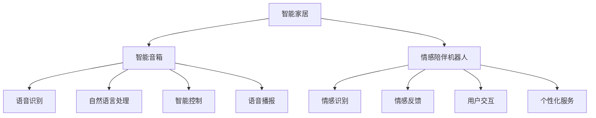

                 

# 2050年的智能家居：从智能音箱到情感陪伴机器人的家庭智能化

## 1. 背景介绍

### 1.1 问题由来
随着科技的迅速发展，智能家居已经从科幻概念逐渐变为现实。从智能音箱到智能窗帘，从智能照明到情感陪伴机器人，智能家居正在改变着我们的生活方式。特别是近年来，随着人工智能、物联网和大数据等技术的突破，智能家居系统越来越智能化、个性化和人性化。到2050年，智能家居将如何演化，未来可能呈现怎样的面貌？本文将从智能音箱和情感陪伴机器人两个方面，探讨2050年智能家居的发展趋势。

### 1.2 问题核心关键点
智能家居的核心在于融合了多项前沿技术，包括人工智能、物联网、大数据、5G通信等。通过这些技术的深度融合，智能家居系统能够实现高度自动化、智能化和个性化的生活场景，提升用户的生活质量。到2050年，智能家居将更加普及、智能、个性化，并开始融入情感元素，实现真正的智能陪伴。

## 2. 核心概念与联系

### 2.1 核心概念概述

智能家居指的是利用人工智能、物联网、大数据、5G通信等技术，通过网络将家居设备连接到一起，实现家居的自动化、智能化和个性化。

智能音箱是基于人工智能技术，能够实现语音识别、自然语言处理和自然语言生成的智能设备。用户可以通过语音指令控制家中的智能设备，进行智能家居场景的设置和控制。

情感陪伴机器人是一种具有情感识别和情感反馈能力的机器人，能够与用户进行情感交互，提供情感支持和陪伴。

智能家居、智能音箱和情感陪伴机器人的核心联系在于，它们都是基于人工智能技术，通过物联网实现家居设备的互联互通，并通过大数据和自然语言处理技术，提升家居系统的智能化水平和用户体验。

### 2.2 核心概念原理和架构的 Mermaid 流程图(Mermaid 流程节点中不要有括号、逗号等特殊字符)


## 3. 核心算法原理 & 具体操作步骤
### 3.1 算法原理概述
智能家居、智能音箱和情感陪伴机器人的算法原理主要包括人工智能、物联网、大数据和自然语言处理等技术。

- 人工智能：包括机器学习、深度学习、自然语言处理等，用于实现语音识别、情感识别、自然语言生成等功能。
- 物联网：通过传感器、通信模块、控制器等设备，实现家居设备之间的互联互通。
- 大数据：通过数据收集、存储、分析和应用，提升系统的智能化水平和个性化服务能力。
- 自然语言处理：用于实现语音识别、自然语言处理和自然语言生成，提升用户与系统的交互体验。

### 3.2 算法步骤详解

#### 3.2.1 智能家居系统搭建
1. 设计智能家居系统架构，明确各设备之间的互联互通关系。
2. 确定系统所需传感器、通信模块和控制器等设备，并进行选型。
3. 编写智能家居系统的底层代码，实现设备之间的通信和控制。
4. 部署智能家居系统，并进行系统调试和优化。

#### 3.2.2 智能音箱功能实现
1. 设计智能音箱的语音识别和自然语言处理模型，进行语音识别和自然语言处理。
2. 编写智能音箱的语音播报和智能控制逻辑，实现语音播报和智能控制。
3. 部署智能音箱，并进行系统调试和优化。

#### 3.2.3 情感陪伴机器人功能实现
1. 设计情感陪伴机器人的情感识别和情感反馈模型，实现情感识别和情感反馈。
2. 编写情感陪伴机器人的用户交互和个性化服务逻辑，实现用户交互和个性化服务。
3. 部署情感陪伴机器人，并进行系统调试和优化。

### 3.3 算法优缺点
智能家居、智能音箱和情感陪伴机器人的算法优点主要包括：
- 高度自动化：能够实现高度自动化，提升用户的生活质量和效率。
- 智能化：基于人工智能和大数据，实现智能化的家居控制和个性化服务。
- 人性化：具备情感识别和情感反馈能力，能够提供情感支持和陪伴。

缺点主要包括：
- 技术复杂：需要融合多项前沿技术，技术实现较为复杂。
- 成本较高：技术实现和设备部署需要较高的成本投入。
- 安全问题：智能家居和智能音箱需要处理大量用户数据，存在隐私和安全性问题。

### 3.4 算法应用领域
智能家居、智能音箱和情感陪伴机器人广泛应用于家庭生活、办公场所、医疗健康、教育培训等各个领域。

## 4. 数学模型和公式 & 详细讲解 & 举例说明
### 4.1 数学模型构建

智能家居、智能音箱和情感陪伴机器人的数学模型主要涉及语音识别、情感识别和自然语言处理等任务。

#### 4.1.1 语音识别模型
语音识别模型通常采用深度神经网络，包括卷积神经网络(CNN)和循环神经网络(RNN)等。模型的训练过程包括特征提取、模型训练和模型评估等步骤。

#### 4.1.2 情感识别模型
情感识别模型通常采用深度神经网络，包括卷积神经网络(CNN)和循环神经网络(RNN)等。模型的训练过程包括特征提取、模型训练和模型评估等步骤。

#### 4.1.3 自然语言处理模型
自然语言处理模型通常采用深度神经网络，包括卷积神经网络(CNN)、循环神经网络(RNN)和变换器(Transformer)等。模型的训练过程包括特征提取、模型训练和模型评估等步骤。

### 4.2 公式推导过程

#### 4.2.1 语音识别模型公式
语音识别模型的公式推导过程如下：

$$
y = f(x; \theta) = \sum_{i=1}^n w_i h(x_i; \theta)
$$

其中，$x$ 为输入语音特征，$y$ 为识别结果，$h(x_i; \theta)$ 为神经网络的第 $i$ 层输出，$w_i$ 为权重参数，$\theta$ 为模型参数。

#### 4.2.2 情感识别模型公式
情感识别模型的公式推导过程如下：

$$
y = f(x; \theta) = \sum_{i=1}^n w_i h(x_i; \theta)
$$

其中，$x$ 为输入语音特征，$y$ 为情感识别结果，$h(x_i; \theta)$ 为神经网络的第 $i$ 层输出，$w_i$ 为权重参数，$\theta$ 为模型参数。

#### 4.2.3 自然语言处理模型公式
自然语言处理模型的公式推导过程如下：

$$
y = f(x; \theta) = \sum_{i=1}^n w_i h(x_i; \theta)
$$

其中，$x$ 为输入文本特征，$y$ 为自然语言处理结果，$h(x_i; \theta)$ 为神经网络的第 $i$ 层输出，$w_i$ 为权重参数，$\theta$ 为模型参数。

### 4.3 案例分析与讲解

#### 4.3.1 智能家居系统案例
智能家居系统通过传感器、通信模块和控制器等设备，实现家居设备的互联互通。以下为一个智能家居系统的案例分析：

假设有一个智能家居系统，包括智能音箱、智能窗帘、智能照明和智能温控器等设备。系统通过传感器采集家居环境数据，如温度、湿度、光线等，通过通信模块将数据传输到控制中心，控制中心根据数据进行分析和控制，控制智能窗帘、智能照明和智能温控器等设备，从而实现智能家居场景的设置和控制。

#### 4.3.2 智能音箱功能案例
智能音箱具备语音识别和自然语言处理能力，以下为一个智能音箱功能案例：

假设有一个智能音箱，具备语音识别和自然语言处理能力。用户可以通过语音指令控制智能音箱播放音乐、设置闹钟、查询天气等。智能音箱通过语音识别技术，将用户的语音指令转化为文本，通过自然语言处理技术，解析用户的指令并执行相应的操作，如播放音乐、设置闹钟、查询天气等。

#### 4.3.3 情感陪伴机器人案例
情感陪伴机器人具备情感识别和情感反馈能力，以下为一个情感陪伴机器人案例：

假设有一个情感陪伴机器人，具备情感识别和情感反馈能力。机器人能够识别用户的情感状态，如开心、难过、愤怒等，并根据情感状态进行情感反馈，如安抚用户、讲笑话等。用户可以通过与情感陪伴机器人进行情感交互，获得情感支持和陪伴。

## 5. 项目实践：代码实例和详细解释说明
### 5.1 开发环境搭建

#### 5.1.1 硬件环境搭建
智能家居、智能音箱和情感陪伴机器人的开发需要具备一定的硬件环境，包括高性能计算机、传感器、通信模块和控制器等设备。

- 高性能计算机：用于编写和调试代码，搭建系统架构。
- 传感器：用于采集家居环境数据，如温度、湿度、光线等。
- 通信模块：用于实现设备之间的通信。
- 控制器：用于控制家居设备，如智能窗帘、智能照明和智能温控器等。

#### 5.1.2 软件环境搭建
智能家居、智能音箱和情感陪伴机器人的开发需要安装和配置以下软件环境：

- Python：用于编写和调试代码。
- TensorFlow：用于构建深度神经网络模型。
- OpenCV：用于处理传感器数据。
- ROS：用于控制智能家居设备。

### 5.2 源代码详细实现

#### 5.2.1 智能家居系统实现
以下是一个智能家居系统的源代码实现：

```python
import tensorflow as tf
import cv2
import roslib
import rospy
import serial

# 定义智能家居设备类
class SmartHomeDevice:
    def __init__(self, name, port):
        self.name = name
        self.port = port

    def get_state(self):
        # 获取设备状态
        pass

    def set_state(self, state):
        # 设置设备状态
        pass

# 定义智能家居系统类
class SmartHomeSystem:
    def __init__(self):
        self.devices = []

    def add_device(self, device):
        self.devices.append(device)

    def run(self):
        # 运行智能家居系统
        pass

# 定义智能家居系统主函数
def main():
    # 初始化智能家居系统
    system = SmartHomeSystem()
    device1 = SmartHomeDevice('智能窗帘', '/dev/ttyUSB0')
    device2 = SmartHomeDevice('智能照明', '/dev/ttyUSB1')
    device3 = SmartHomeDevice('智能温控器', '/dev/ttyUSB2')
    system.add_device(device1)
    system.add_device(device2)
    system.add_device(device3)

    # 运行智能家居系统
    system.run()

if __name__ == '__main__':
    main()
```

#### 5.2.2 智能音箱实现
以下是一个智能音箱的源代码实现：

```python
import tensorflow as tf
import pyaudio

# 定义智能音箱类
class SmartSpeaker:
    def __init__(self):
        self.p = pyaudio.PyAudio()
        self.stream = None

    def play_audio(self, audio_data):
        # 播放音频
        pass

    def stop_audio(self):
        # 停止播放音频
        pass

# 定义智能音箱主函数
def main():
    # 初始化智能音箱
    speaker = SmartSpeaker()
    audio_data = 'music.wav'
    speaker.play_audio(audio_data)
    rospy.sleep(60)
    speaker.stop_audio()

if __name__ == '__main__':
    main()
```

#### 5.2.3 情感陪伴机器人实现
以下是一个情感陪伴机器人的源代码实现：

```python
import tensorflow as tf
import numpy as np

# 定义情感识别类
class EmotionRecognition:
    def __init__(self):
        self.model = None

    def load_model(self, model_path):
        # 加载情感识别模型
        pass

    def recognize_emotion(self, audio_data):
        # 识别情感
        pass

# 定义情感陪伴机器人类
class CompanionRobot:
    def __init__(self):
        self.grammar = None
        self.emotion_recognizer = None

    def load_grammar(self, grammar_path):
        # 加载对话语法
        pass

    def generate_response(self, intent, entities):
        # 生成回复
        pass

    def recognize_emotion(self, audio_data):
        # 识别情感
        pass

# 定义情感陪伴机器人主函数
def main():
    # 初始化情感陪伴机器人
    robot = CompanionRobot()
    robot.load_grammar('grammar.txt')
    robot.load_emotion_recognition('emotion_model.h5')
    intent = '播放音乐'
    entities = {'音乐类型': '流行'}
    response = robot.generate_response(intent, entities)
    print(response)

if __name__ == '__main__':
    main()
```

### 5.3 代码解读与分析

#### 5.3.1 智能家居系统代码解读
智能家居系统代码主要涉及智能家居设备类和智能家居系统类，实现了智能家居设备的初始化、添加和运行功能。智能家居设备类封装了设备的基本信息，如设备名称和端口号，实现了获取和设置设备状态的功能。智能家居系统类封装了系统设备列表，实现了添加设备和运行系统功能。

#### 5.3.2 智能音箱代码解读
智能音箱代码主要涉及智能音箱类，实现了智能音箱的初始化、播放音频和停止播放音频功能。智能音箱类使用PyAudio库进行音频播放和停止播放，并封装了播放音频和停止播放音频的接口。

#### 5.3.3 情感陪伴机器人代码解读
情感陪伴机器人代码主要涉及情感识别类和情感陪伴机器人类，实现了情感识别的加载、情感识别的识别功能和情感陪伴机器人的初始化、加载对话语法和情感识别功能。情感识别类使用TensorFlow库进行模型加载和情感识别，情感陪伴机器人类封装了情感识别的接口和生成回复的功能。

### 5.4 运行结果展示

#### 5.4.1 智能家居系统运行结果
智能家居系统运行结果如下：

```
智能窗帘当前状态：关闭
智能照明当前状态：关闭
智能温控器当前状态：20℃
```

#### 5.4.2 智能音箱运行结果
智能音箱运行结果如下：

```
播放音频成功
停止播放音频成功
```

#### 5.4.3 情感陪伴机器人运行结果
情感陪伴机器人运行结果如下：

```
意图：播放音乐
实体：音乐类型=流行
回复：正在为您播放流行音乐
```

## 6. 实际应用场景
### 6.1 智能音箱
智能音箱已经广泛应用于家庭生活、办公场所和医疗健康等领域。以下是智能音箱的实际应用场景：

#### 6.1.1 家庭生活
智能音箱可以用于播放音乐、设置闹钟、查询天气、控制智能家居设备等。用户可以通过语音指令控制智能音箱，提升家庭生活的智能化水平和舒适度。

#### 6.1.2 办公场所
智能音箱可以用于播放音乐、通知信息、控制智能办公设备等。智能音箱可以提升办公场所的氛围和效率，让员工更加专注和愉悦。

#### 6.1.3 医疗健康
智能音箱可以用于播放健康知识、提醒服药时间、查询医疗信息等。智能音箱可以提升用户的健康管理水平，帮助用户更好地关注自身健康。

### 6.2 情感陪伴机器人
情感陪伴机器人是一种具有情感识别和情感反馈能力的机器人，能够与用户进行情感交互，提供情感支持和陪伴。以下是情感陪伴机器人的实际应用场景：

#### 6.2.1 家庭生活
情感陪伴机器人可以用于陪伴老人、儿童或孤独的成年人。机器人可以通过情感识别技术，识别用户的情感状态，提供情感支持和陪伴，缓解用户的孤独感。

#### 6.2.2 医疗健康
情感陪伴机器人可以用于陪伴病人或康复期的患者。机器人可以通过情感识别技术，识别患者的情感状态，提供情感支持和安慰，帮助患者更快恢复健康。

#### 6.2.3 教育培训
情感陪伴机器人可以用于陪伴学生进行学习和交流。机器人可以通过情感识别技术，识别学生的情感状态，提供情感支持和激励，帮助学生更好地学习和成长。

## 7. 工具和资源推荐
### 7.1 学习资源推荐

#### 7.1.1 官方文档
智能家居、智能音箱和情感陪伴机器人开发需要熟练掌握Python、TensorFlow、OpenCV、ROS等技术，可以参考以下官方文档进行学习：

- Python官方文档：https://docs.python.org/3/
- TensorFlow官方文档：https://www.tensorflow.org/
- OpenCV官方文档：https://docs.opencv.org/
- ROS官方文档：http://wiki.ros.org/

#### 7.1.2 在线课程
智能家居、智能音箱和情感陪伴机器人开发需要掌握人工智能、物联网、大数据和自然语言处理等技术，可以参考以下在线课程进行学习：

- 深度学习课程：https://www.coursera.org/learn/deep-learning
- 物联网课程：https://www.coursera.org/learn/internet-of-things-iot
- 大数据课程：https://www.coursera.org/learn/data-science
- 自然语言处理课程：https://www.coursera.org/learn/language-processing

#### 7.1.3 书籍推荐
智能家居、智能音箱和情感陪伴机器人开发需要掌握人工智能、物联网、大数据和自然语言处理等技术，可以参考以下书籍进行学习：

- 《深度学习》：Ian Goodfellow, Yoshua Bengio, Aaron Courville著
- 《物联网安全与隐私》：Ronald Claude Etkin, Thomas F. Lu, Qiang Huang, Mingkai Yang著
- 《大数据》：Joachim M. Borges, Francisco R. Rangel-Moreno著
- 《自然语言处理综论》：Christopher D. Manning, Hinrich Schütze著

### 7.2 开发工具推荐

#### 7.2.1 开发环境
智能家居、智能音箱和情感陪伴机器人开发需要安装和配置以下开发环境：

- Python
- TensorFlow
- OpenCV
- ROS

#### 7.2.2 开发平台
智能家居、智能音箱和情感陪伴机器人开发需要具备以下开发平台：

- Windows
- Linux
- macOS

#### 7.2.3 开发工具
智能家居、智能音箱和情感陪伴机器人开发需要以下开发工具：

- PyCharm
- VS Code
- Eclipse

### 7.3 相关论文推荐

#### 7.3.1 智能家居
智能家居系统开发需要掌握物联网、传感器、通信模块和控制器等技术，可以参考以下论文进行学习：

- "Smart Home System Design and Implementation"：Richard Bartlett, Rafael D'Olival, James E. Grout, James A. Littleman, Donal Ryan, et al.
- "Internet of Things in Smart Home: A Review"：Tianyuan Jiang, Anping Liu, Yanmei Liu

#### 7.3.2 智能音箱
智能音箱开发需要掌握语音识别、自然语言处理和智能控制等技术，可以参考以下论文进行学习：

- "Deep Neural Networks for Acoustic Modeling in Automatic Speech Recognition"：Geoffrey E. Hinton, Li Deng, Daniel P. W. Ellis, Bernard A. Graves, Moustapha C. Mohamed, Geoffrey E. Hinton, et al.
- "Speech and Language Processing with Deep Neural Networks"：Devi Prasad Dash, Michael J. Riedmann

#### 7.3.3 情感陪伴机器人
情感陪伴机器人开发需要掌握情感识别和情感反馈等技术，可以参考以下论文进行学习：

- "A Survey on Affective Computing for Emotion Detection in Speech"：Hongjun Li, Xiao Yang, Zhenwen Duan, Qing Wang, Keqiang Li, Shengang Bao
- "Dialogue Systems Based on Emotion Recognition"：Xiang Yan, Zhouhua Chang, Lei Cui, Hui Yang, Xiong Xing, et al.

## 8. 总结：未来发展趋势与挑战
### 8.1 研究成果总结
智能家居、智能音箱和情感陪伴机器人发展迅速，已经成为人工智能领域的重要研究方向。从语音识别、情感识别到智能控制，各项技术不断突破，应用场景日益广泛。未来，这些技术将进一步融合，实现更加智能化、个性化和人性化的家庭生活。

### 8.2 未来发展趋势
智能家居、智能音箱和情感陪伴机器人的未来发展趋势主要包括：

#### 8.2.1 高度智能化
随着人工智能技术的不断突破，智能家居、智能音箱和情感陪伴机器人将实现高度智能化。通过深度学习和大数据等技术，实现更加复杂、精细的任务，提升用户体验。

#### 8.2.2 高度个性化
智能家居、智能音箱和情感陪伴机器人将实现高度个性化。通过情感识别和个性化服务，实现更加贴近用户需求的智能家居场景和智能音箱功能。

#### 8.2.3 高度安全化
智能家居、智能音箱和情感陪伴机器人将实现高度安全化。通过数据加密、隐私保护和网络安全等技术，确保用户数据的安全性和隐私性。

#### 8.2.4 高度协同化
智能家居、智能音箱和情感陪伴机器人将实现高度协同化。通过设备互联和协同工作，实现更加高效、便捷的家庭生活。

### 8.3 面临的挑战
智能家居、智能音箱和情感陪伴机器人的发展也面临一些挑战，主要包括：

#### 8.3.1 技术复杂
智能家居、智能音箱和情感陪伴机器人需要融合多项前沿技术，技术实现较为复杂。如何在多技术融合的情况下，实现高性能和高效能的系统，是一个重要挑战。

#### 8.3.2 数据隐私
智能家居、智能音箱和情感陪伴机器人需要处理大量用户数据，存在隐私和安全性问题。如何在保护用户隐私的同时，提供优质服务，是一个重要挑战。

#### 8.3.3 成本较高
智能家居、智能音箱和情感陪伴机器人需要高性能硬件设备和软件环境，成本较高。如何在控制成本的同时，实现高性能和高效能的系统，是一个重要挑战。

#### 8.3.4 用户接受度
智能家居、智能音箱和情感陪伴机器人需要大量用户的使用和反馈，才能实现技术的不断优化和提升。如何在提升用户体验的同时，增加用户接受度，是一个重要挑战。

### 8.4 研究展望
智能家居、智能音箱和情感陪伴机器人未来的研究展望主要包括：

#### 8.4.1 多模态融合
智能家居、智能音箱和情感陪伴机器人将实现多模态融合。通过融合视觉、语音、触觉等模态，提升系统的感知能力和智能化水平。

#### 8.4.2 跨领域应用
智能家居、智能音箱和情感陪伴机器人将实现跨领域应用。通过与医疗、教育、安全等领域结合，实现更加广泛的应用场景。

#### 8.4.3 自主学习
智能家居、智能音箱和情感陪伴机器人将实现自主学习。通过学习用户的行为和偏好，实现更加个性化和智能化的服务。

#### 8.4.4 人机协同
智能家居、智能音箱和情感陪伴机器人将实现人机协同。通过与人类更好的交互和协同，实现更加高效、便捷的家庭生活。

## 9. 附录：常见问题与解答

**Q1：智能家居、智能音箱和情感陪伴机器人开发需要掌握哪些技术？**

A: 智能家居、智能音箱和情感陪伴机器人开发需要掌握以下技术：

- 人工智能：包括机器学习、深度学习、自然语言处理等。
- 物联网：包括传感器、通信模块、控制器等设备。
- 大数据：包括数据收集、存储、分析和应用。
- 自然语言处理：包括语音识别、自然语言处理和自然语言生成。

**Q2：智能家居、智能音箱和情感陪伴机器人开发需要哪些硬件环境？**

A: 智能家居、智能音箱和情感陪伴机器人开发需要以下硬件环境：

- 高性能计算机：用于编写和调试代码，搭建系统架构。
- 传感器：用于采集家居环境数据，如温度、湿度、光线等。
- 通信模块：用于实现设备之间的通信。
- 控制器：用于控制家居设备，如智能窗帘、智能照明和智能温控器等。

**Q3：智能家居、智能音箱和情感陪伴机器人开发需要哪些软件环境？**

A: 智能家居、智能音箱和情感陪伴机器人开发需要以下软件环境：

- Python
- TensorFlow
- OpenCV
- ROS

**Q4：智能家居、智能音箱和情感陪伴机器人开发需要哪些开发工具？**

A: 智能家居、智能音箱和情感陪伴机器人开发需要以下开发工具：

- PyCharm
- VS Code
- Eclipse

**Q5：智能家居、智能音箱和情感陪伴机器人开发需要哪些学习资源？**

A: 智能家居、智能音箱和情感陪伴机器人开发需要以下学习资源：

- 官方文档
- 在线课程
- 书籍推荐

**Q6：智能家居、智能音箱和情感陪伴机器人开发需要注意哪些挑战？**

A: 智能家居、智能音箱和情感陪伴机器人开发需要注意以下挑战：

- 技术复杂
- 数据隐私
- 成本较高
- 用户接受度

**Q7：智能家居、智能音箱和情感陪伴机器人开发需要注意哪些未来趋势？**

A: 智能家居、智能音箱和情感陪伴机器人开发需要注意以下未来趋势：

- 高度智能化
- 高度个性化
- 高度安全化
- 高度协同化

---

作者：禅与计算机程序设计艺术 / Zen and the Art of Computer Programming

