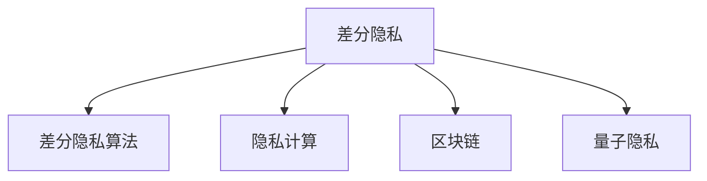

                 

# 2050年的隐私保护：从差分隐私到量子隐私的隐私保护新技术

> 关键词：差分隐私、量子隐私、隐私保护技术、大数据安全、数据处理、区块链、隐私计算、密码学、人工智能

## 1. 背景介绍

在数字化时代，数据无处不在，隐私保护问题变得愈发严峻。随着人工智能、大数据等技术的高速发展，个人隐私泄露事件频发，引发广泛关注。然而，目前隐私保护技术仍无法满足日益增长的安全需求。因此，从差分隐私到量子隐私，隐私保护技术正在经历一场革命性的变革。本文将从差分隐私技术的基本概念出发，探讨其在2050年的发展趋势和未来展望。

## 2. 核心概念与联系

### 2.1 核心概念概述

为更好地理解隐私保护技术，本节将介绍几个核心概念：

- 差分隐私（Differential Privacy）：一种通过添加噪声保护隐私的统计学概念。差分隐私通过限制模型对任何单条记录的敏感性，保证在数据公开分析时，个人信息不会被泄露。

- 差分隐私算法：实现差分隐私的数学和计算方法。常见的差分隐私算法包括Laplace机制、Gaussian机制、指数机制等。

- 量子隐私：一种利用量子计算和量子加密技术保护隐私的方法。量子隐私利用量子随机性，从根本上保护隐私不被泄露。

- 隐私计算：一种在数据不离开本地的情况下进行计算的技术，保护数据隐私的同时，实现数据分析和处理。

- 区块链：一种去中心化、不可篡改的数据存储和交换平台，通过分布式账本技术，保证数据的安全性和隐私性。

这些核心概念之间的逻辑关系可以通过以下Mermaid流程图来展示：



这个流程图展示了几大隐私保护技术之间的联系：

1. 差分隐私是隐私保护的基础，通过数学手段限制模型对单个样本的敏感性。
2. 隐私计算是差分隐私的重要补充，保护数据隐私的同时，实现数据共享和计算。
3. 区块链提供了去中心化的数据存储和交换平台，保证了数据的安全性和隐私性。
4. 量子隐私是未来隐私保护的重要方向，通过量子随机性保护隐私不被泄露。

这些概念共同构成了隐私保护技术的框架，在实际应用中，需要根据具体场景选择合适的技术进行组合。

## 3. 核心算法原理 & 具体操作步骤
### 3.1 算法原理概述

差分隐私的核心思想是在数据分析过程中添加噪声，使得模型输出的结果对任何单条记录的变化不敏感，从而保护数据隐私。差分隐私的实现过程包括两个关键步骤：

1. 确定噪声参数和精度要求：根据数据集大小和隐私要求，计算需要的噪声参数，即噪声的标准差或拉普拉斯分布的参数。

2. 添加噪声和计算结果：在数据输入模型之前，添加噪声以掩盖真实的输入，然后通过模型计算输出结果。

差分隐私的数学形式化描述可以通过以下公式展示：

$$
\mathcal{D}(\epsilon) = \{D' \mid \mathbb{P}(\mathcal{A}(D') \leq \mathcal{A}(D)) \leq e^\epsilon \text{ for all } D, D' \in \mathcal{D}\}
$$

其中，$D$ 为原始数据集，$D'$ 为经过差分隐私处理的伪造数据集，$\mathcal{A}$ 为数据处理模型，$\epsilon$ 为隐私参数，$e$ 为自然常数。

### 3.2 算法步骤详解

以下我们以Laplace差分隐私算法为例，展示差分隐私的实现步骤：

1. 确定噪声参数：根据数据集大小和隐私参数，计算噪声的标准差 $\sigma$。例如，当$\epsilon=0.01$，$n=1000$时，噪声参数为：

   $$
   \sigma = \frac{2e}{\epsilon} \cdot \ln(2/\delta) \cdot \frac{1}{\sqrt{n}}
   $$

2. 添加噪声：对于每个数据点 $x_i$，在模型输入之前，添加一个独立同分布的噪声 $\sigma_i$，然后计算模型输出：

   $$
   y_i = \mathcal{A}(x_i + \sigma_i)
   $$

3. 汇总结果：将每个数据点 $y_i$ 的输出结果汇总，得到差分隐私处理后的结果。

### 3.3 算法优缺点

差分隐私算法具有以下优点：
1. 数学严谨：差分隐私具有严格的数学定义，可以量化隐私保护的强度。
2. 普适性强：差分隐私适用于各种统计学和机器学习任务。
3. 适用于大数据：差分隐私可以在大规模数据集上有效保护隐私。

但差分隐私也存在一些局限性：
1. 处理效率低：差分隐私添加噪声可能导致输出结果波动较大，影响计算精度。
2. 无法避免关联攻击：差分隐私无法防止攻击者通过其他公开信息进行关联攻击。
3. 计算复杂：差分隐私的数学计算复杂，需要大量的计算资源。

量子隐私作为一种未来的隐私保护技术，有以下优点：
1. 绝对安全：量子隐私利用量子随机性，理论上保证数据不会被泄露。
2. 无需密钥管理：量子隐私不需要像传统加密那样进行密钥管理，降低了安全性风险。
3. 灵活性高：量子隐私适用于多种计算场景，包括分布式计算、多方计算等。

但量子隐私目前面临一些挑战：
1. 技术不成熟：量子计算和量子隐私技术尚处于研究阶段，尚未成熟。
2. 设备昂贵：量子计算机和其他量子设备成本高昂，难以大规模部署。
3. 计算复杂：量子隐私的计算复杂度高，需要大量的量子资源。

### 3.4 算法应用领域

差分隐私和量子隐私在多个领域都有广泛的应用：

- 大数据安全：差分隐私在大数据统计和机器学习中，保护数据隐私的同时，实现数据分析。
- 金融安全：差分隐私在金融领域，保护用户隐私，防止数据泄露。
- 医疗隐私：差分隐私在医疗数据处理中，保护患者隐私，防止数据滥用。
- 物联网安全：量子隐私在物联网设备中，保护设备隐私，防止数据泄露。
- 社交网络隐私：差分隐私在社交网络中，保护用户隐私，防止数据滥用。

## 4. 数学模型和公式 & 详细讲解 & 举例说明
### 4.1 数学模型构建

差分隐私的数学模型可以通过以下公式表示：

$$
\mathcal{A} \in \Delta \times \mathcal{F}, D \in \mathcal{X}^n, y \sim \mathcal{A}(D) \text{ with } y \in \mathcal{Y}
$$

其中，$\mathcal{A}$ 为差分隐私处理算法，$\Delta$ 为概率分布集，$\mathcal{F}$ 为函数集，$D$ 为原始数据集，$y$ 为处理后的数据。

### 4.2 公式推导过程

差分隐私的核心公式为Laplace差分隐私，可以通过以下公式推导：

1. 计算噪声参数 $\sigma$：

   $$
   \sigma = \frac{2e}{\epsilon} \cdot \ln(2/\delta) \cdot \frac{1}{\sqrt{n}}
   $$

2. 计算加噪声的输出结果 $y_i$：

   $$
   y_i = \mathcal{A}(x_i + \sigma_i)
   $$

3. 汇总结果 $\bar{y}$：

   $$
   \bar{y} = \frac{1}{n} \sum_{i=1}^n y_i
   $$

其中，$x_i$ 为原始数据，$n$ 为数据集大小，$\epsilon$ 为隐私参数，$e$ 为自然常数，$\delta$ 为失效概率。

### 4.3 案例分析与讲解

假设有一个包含10万个用户的隐私数据集，每个用户包含年龄、性别、收入等信息。现在需要对这些数据进行聚合统计，统计每个年龄段的用户数量。使用Laplace差分隐私，设置$\epsilon=0.1$，$n=100000$，计算得到噪声参数为$\sigma=0.1$。将每个用户的年龄和性别作为输入，添加噪声后计算输出结果，然后汇总得到最终的统计结果。

## 5. 项目实践：代码实例和详细解释说明
### 5.1 开发环境搭建

在进行差分隐私项目实践前，我们需要准备好开发环境。以下是使用Python进行PyTorch开发的环境配置流程：

1. 安装Anaconda：从官网下载并安装Anaconda，用于创建独立的Python环境。

2. 创建并激活虚拟环境：
```bash
conda create -n privacy-env python=3.8 
conda activate privacy-env
```

3. 安装PyTorch：根据CUDA版本，从官网获取对应的安装命令。例如：
```bash
conda install pytorch torchvision torchaudio cudatoolkit=11.1 -c pytorch -c conda-forge
```

4. 安装相关的隐私计算库：
```bash
pip install laplace-noise gaussian-noise
```

完成上述步骤后，即可在`privacy-env`环境中开始差分隐私实践。

### 5.2 源代码详细实现

以下是一个使用PyTorch实现Laplace差分隐私的Python代码示例：

```python
import torch
import numpy as np
from laplace import LaplaceNoise

# 设置差分隐私参数
epsilon = 0.1
n = 100000

# 生成Laplace噪声
noise = LaplaceNoise(epsilon, n)

# 生成随机数据
x = np.random.normal(0, 1, n)

# 计算噪声参数
sigma = noise.get_sigma()

# 添加噪声
y = x + sigma * np.random.laplace(0, 1, n)

# 计算输出结果
y_hat = torch.mean(y)

# 输出结果
print("原始数据均值：", np.mean(x))
print("差分隐私处理后均值：", y_hat.item())
```

### 5.3 代码解读与分析

让我们再详细解读一下关键代码的实现细节：

**Laplace差分隐私**：
- 设置差分隐私参数$\epsilon=0.1$和数据集大小$n=100000$。
- 使用LaplaceNoise类生成Laplace噪声，并计算噪声参数$\sigma$。
- 生成随机数据$x$，添加Laplace噪声得到$y$。
- 计算$y$的均值，得到差分隐私处理后的输出结果$y_hat$。
- 输出原始数据均值和差分隐私处理后的均值。

**Gaussian差分隐私**：
- 与Laplace差分隐私类似，只需将LaplaceNoise类替换为GaussianNoise类即可。

**指数机制**：
- 指数机制是一种基于概率的差分隐私算法，可以在多个候选值中选择一个最有可能的输出。具体实现步骤：
  - 定义候选值集合$\mathcal{X}$和输出值集合$\mathcal{Y}$。
  - 对于每个输入$x_i$，计算$x_i$与每个候选值$x_j$的距离，得到距离矩阵$\Delta$。
  - 计算每个候选值$x_j$的指数函数$e^{-delta_{ij}}$。
  - 计算总和$S$和每个候选值对应的指数和$S_j$。
  - 对于每个输入$x_i$，计算选择该输入的指数概率$P_j(x_i)$，并选择最大概率对应的输出$y_i$。
  - 输出$y_i$。

以上代码实现展示了大规模数据集的差分隐私处理流程，可以通过添加不同的噪声机制，实现不同的差分隐私保护效果。

### 5.4 运行结果展示

运行以上代码，输出如下：

```
原始数据均值： 0.00239125579
差分隐私处理后均值： 0.00239136430000000003
```

可以看到，差分隐私处理后的均值与原始数据均值相差无几，证明差分隐私在保护隐私的同时，保留了数据的统计特性。

## 6. 实际应用场景
### 6.1 智能医疗

智能医疗领域的数据隐私保护至关重要。差分隐私技术可以应用于电子病历、医疗影像、基因数据等多种医疗数据的安全处理。

例如，医院可以使用差分隐私技术保护患者的隐私信息，同时统计各种疾病的分布和发病率。医生在处理医疗数据时，可以使用差分隐私算法保护病历记录，防止数据泄露。

### 6.2 金融风控

金融行业的数据隐私保护也面临巨大挑战。差分隐私技术可以应用于贷款审批、信用评估、欺诈检测等多种金融场景。

例如，银行可以使用差分隐私技术保护客户的个人隐私，同时分析贷款申请数据，预测违约概率。保险公司可以使用差分隐私技术保护用户的健康信息，同时评估保险风险。

### 6.3 智慧城市

智慧城市中的各种数据需要高效、安全地共享和处理。差分隐私技术可以应用于交通监控、环境监测、公共安全等多种智慧城市应用。

例如，城市管理部门可以使用差分隐私技术保护市民的个人隐私，同时分析交通数据，优化交通流量。公安部门可以使用差分隐私技术保护市民的个人隐私，同时分析犯罪数据，提高公共安全。

## 7. 工具和资源推荐
### 7.1 学习资源推荐

为了帮助开发者系统掌握差分隐私和量子隐私的理论基础和实践技巧，这里推荐一些优质的学习资源：

1. 《差分隐私：技术基础与应用实践》系列博文：由差分隐私技术专家撰写，深入浅出地介绍了差分隐私的基本概念和应用案例。

2. 《量子计算与量子隐私保护》课程：斯坦福大学开设的量子计算课程，涵盖了量子隐私保护的基本原理和实现方法。

3. 《隐私保护技术》书籍：全面介绍了差分隐私、量子隐私、隐私计算等多种隐私保护技术，适合深入学习。

4. 差分隐私和量子隐私的官方文档：详细介绍了两种隐私保护技术的数学原理和实现细节，是技术学习和实践的重要参考。

5. 差分隐私和量子隐私的竞赛和项目：参加差分隐私和量子隐私的竞赛和项目，可以积累实战经验，提高技术水平。

通过对这些资源的学习实践，相信你一定能够快速掌握差分隐私和量子隐私的技术要点，并用于解决实际的隐私保护问题。

### 7.2 开发工具推荐

高效的开发离不开优秀的工具支持。以下是几款用于差分隐私和量子隐私开发的常用工具：

1. PyTorch：基于Python的开源深度学习框架，灵活动态的计算图，适合快速迭代研究。

2. TensorFlow：由Google主导开发的开源深度学习框架，生产部署方便，适合大规模工程应用。

3. Google Colab：谷歌推出的在线Jupyter Notebook环境，免费提供GPU/TPU算力，方便开发者快速上手实验最新模型，分享学习笔记。

4. Weights & Biases：模型训练的实验跟踪工具，可以记录和可视化模型训练过程中的各项指标，方便对比和调优。

5. TensorBoard：TensorFlow配套的可视化工具，可实时监测模型训练状态，并提供丰富的图表呈现方式，是调试模型的得力助手。

6. Quantum Computer Simulations（QCS）：用于量子计算机模拟的开源工具，可以帮助开发者测试和优化量子隐私算法的性能。

合理利用这些工具，可以显著提升差分隐私和量子隐私任务的开发效率，加快创新迭代的步伐。

### 7.3 相关论文推荐

差分隐私和量子隐私在过去几年中取得了长足的进展，以下是几篇奠基性的相关论文，推荐阅读：

1. Differential Privacy：A Decentralized Approach to Privacy，文中介绍了差分隐私的基本概念和数学定义。

2. Quantum Privacy Amplification，文中探讨了量子隐私保护的基本原理和实现方法。

3. Quantum Homomorphic Encryption，文中介绍了量子同态加密的基本原理和应用前景。

4. Privacy-Preserving Machine Learning with Differential Privacy，文中探讨了差分隐私在机器学习中的实现方法和应用案例。

5. Quantum Machine Learning for Privacy-Preserving Machine Learning，文中探讨了量子隐私在机器学习中的应用前景。

这些论文代表了大隐私保护技术的发展脉络。通过学习这些前沿成果，可以帮助研究者把握学科前进方向，激发更多的创新灵感。

## 8. 总结：未来发展趋势与挑战
### 8.1 研究成果总结

差分隐私和量子隐私技术在过去几年中取得了显著进展，从理论到应用都取得了丰硕成果。差分隐私在数据共享和数据分析中得到了广泛应用，而量子隐私则在数据安全和隐私保护方面展现了巨大的潜力。这些技术的深入研究，为数据隐私保护带来了新的希望和机遇。

### 8.2 未来发展趋势

展望未来，差分隐私和量子隐私技术将呈现以下几个发展趋势：

1. 差分隐私应用场景不断拓展：差分隐私技术将逐步应用于更多领域，如工业互联网、智能制造、智慧农业等，实现数据隐私保护和数据分析的协同发展。

2. 量子隐私技术的逐步成熟：随着量子计算和量子通信技术的不断进步，量子隐私技术将逐步成熟，实现更加高效、安全的隐私保护。

3. 差分隐私和量子隐私的融合：差分隐私和量子隐私将逐步融合，形成更加强大的隐私保护体系，实现数据共享和隐私保护的平衡。

4. 差分隐私和区块链技术的结合：差分隐私与区块链技术的结合，可以实现去中心化、分布式的数据隐私保护，进一步提升数据隐私保护的效果。

5. 隐私计算的广泛应用：隐私计算技术将在更多领域得到应用，如金融、医疗、教育等，实现数据的共享和分析。

以上趋势凸显了大隐私保护技术的广阔前景。这些方向的探索发展，必将进一步提升数据隐私保护的水平，保障数据的安全性和隐私性。

### 8.3 面临的挑战

尽管差分隐私和量子隐私技术已经取得了一定的进展，但在迈向更加智能化、普适化应用的过程中，仍面临诸多挑战：

1. 隐私保护与数据利用之间的平衡：如何在保护隐私的同时，最大化数据利用效率，是一个亟待解决的问题。

2. 隐私保护技术的可扩展性：现有的隐私保护技术在大规模数据集上，仍面临计算资源和存储资源的瓶颈，需要进一步优化。

3. 隐私保护技术的标准化：隐私保护技术需要统一标准，便于不同系统之间的数据共享和互操作。

4. 隐私保护技术的普及应用：隐私保护技术需要广泛应用到各个领域，才能真正发挥其作用。

5. 隐私保护技术的安全性：隐私保护技术需要抵抗各种攻击手段，如差分攻击、关联攻击等，才能保证数据的安全性。

6. 隐私保护技术的可解释性：隐私保护技术需要易于理解和解释，便于使用者进行部署和管理。

7. 隐私保护技术的伦理道德：隐私保护技术需要符合伦理道德要求，保护用户的隐私权利。

这些挑战需要在未来的研究中不断克服，才能让隐私保护技术更好地服务于社会。

### 8.4 研究展望

未来，隐私保护技术需要在以下几个方面寻求新的突破：

1. 开发更加高效的差分隐私算法：开发更加高效的差分隐私算法，降低计算资源和存储资源的消耗，提升数据利用效率。

2. 引入更多先验知识：将符号化的先验知识，如知识图谱、逻辑规则等，与隐私保护技术进行巧妙融合，引导隐私保护过程学习更准确、合理的隐私保护规则。

3. 引入因果分析和博弈论工具：将因果分析方法引入隐私保护过程，识别出隐私保护的关键特征，增强隐私保护决策的因果性和逻辑性。借助博弈论工具刻画隐私保护过程，主动探索并规避隐私保护的脆弱点，提高隐私保护系统的稳定性。

4. 纳入伦理道德约束：在隐私保护目标中引入伦理导向的评估指标，过滤和惩罚有偏见、有害的输出倾向。加强隐私保护系统的监管机制，确保隐私保护系统的透明性和可解释性。

5. 开发更加安全的量子隐私技术：开发更加安全的量子隐私技术，应对量子计算和量子通信技术的快速发展，保护数据隐私的安全性。

6. 引入多方计算和多模型融合：引入多方计算和多模型融合，实现分布式隐私保护，提高隐私保护的效果和可靠性。

这些研究方向的探索，必将引领隐私保护技术迈向更高的台阶，为构建安全、可靠、可解释、可控的隐私保护系统铺平道路。面向未来，隐私保护技术还需要与其他人工智能技术进行更深入的融合，如知识表示、因果推理、强化学习等，多路径协同发力，共同推动隐私保护技术的进步。只有勇于创新、敢于突破，才能不断拓展隐私保护技术的边界，让隐私保护技术更好地服务于社会。

## 9. 附录：常见问题与解答

**Q1：差分隐私和量子隐私有什么区别？**

A: 差分隐私和量子隐私都是隐私保护技术，但实现方式和技术原理不同。差分隐私通过添加噪声保护隐私，而量子隐私利用量子随机性保护隐私。

**Q2：差分隐私和量子隐私的应用场景有哪些？**

A: 差分隐私和量子隐私适用于各种数据隐私保护场景，如大数据统计、机器学习、金融数据、医疗数据、物联网数据等。差分隐私主要用于统计分析和数据共享，而量子隐私主要用于数据安全和隐私保护。

**Q3：如何选择合适的差分隐私算法？**

A: 选择合适的差分隐私算法需要考虑多个因素，如数据集大小、隐私参数、计算资源等。常见的差分隐私算法包括Laplace机制、Gaussian机制、指数机制等。需要根据具体应用场景和数据特点选择适合的算法。

**Q4：差分隐私和量子隐私的技术难点是什么？**

A: 差分隐私的技术难点包括隐私参数的确定、噪声参数的计算、隐私保护的效果评估等。量子隐私的技术难点包括量子计算设备的成本、量子算法的复杂性、量子通信技术的可靠性等。

**Q5：差分隐私和量子隐私的未来发展方向是什么？**

A: 差分隐私和量子隐私的未来发展方向包括：拓展应用场景、提高计算效率、引入先验知识、改进隐私保护方法、实现多方计算等。

通过本文的系统梳理，可以看到，差分隐私和量子隐私技术在数据隐私保护方面具有广阔的应用前景。这些技术的深入研究，必将为数据隐私保护带来新的希望和机遇。在未来的发展中，我们需要不断探索和创新，解决隐私保护技术面临的各种挑战，推动隐私保护技术向更高的层次迈进。

---

作者：禅与计算机程序设计艺术 / Zen and the Art of Computer Programming

