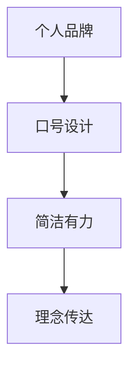

                 

# 建立个人品牌口号：简洁有力地传达你的理念

> 关键词：个人品牌,口号设计,简洁有力,理念传达

## 1. 背景介绍

### 1.1 问题由来
在快速变化的信息时代，个人品牌建设成为了越来越多专业人士、艺术家、企业家乃至普通人的关注焦点。尤其是在竞争激烈的职业领域，拥有清晰、鲜明的个人品牌，不仅能增强个人影响力，还能为职业发展带来更多机遇。面对日益丰富多元的市场环境，如何简洁有力地传达个人理念，成为个人品牌建设的重要课题。

### 1.2 问题核心关键点
个人品牌口号的设计，核心在于如何用最精炼的语言，传递出个人或组织的核心价值主张、使命愿景和独特风格。一个好的口号不仅要有吸引力，还要具备高度的概括性和可传播性，能够快速且深入地触及目标受众，达到洗脑式的记忆效果。

### 1.3 问题研究意义
构建有效的个人品牌口号，对于个人职业发展、市场竞争、企业品牌塑造等方面具有重要意义：

1. **职业发展**：一个简洁有力的口号可以帮助个人在职业道路上脱颖而出，增强专业形象，吸引潜在客户和合作伙伴的关注。
2. **市场竞争**：在信息爆炸的时代，一个有记忆点的口号能帮助企业在众多竞争者中脱颖而出，提高市场占有率。
3. **企业品牌塑造**：口号是企业品牌文化的重要组成部分，能够快速传递品牌理念，建立品牌识别度。

## 2. 核心概念与联系

### 2.1 核心概念概述

在探讨如何构建简洁有力的个人品牌口号时，需要理解几个关键概念：

- **个人品牌 (Personal Branding)**：指个人通过特定行为和外在形象，在公众心中树立并保持的一种独特形象或身份，旨在建立专业信任和市场影响力。
- **口号 (Slogan)**：一种简短的、具有感染力的、能够传达品牌核心价值的声明，通常包含在商业广告、组织宣传材料、个人社交媒体介绍等。
- **简洁有力 (Concise and Powerful)**：指口号在语言表达上要尽量简短，内容要集中、深刻，避免冗长复杂。
- **理念传达 (Idea Expression)**：通过简短有力的语言，传递出个人的核心理念、价值主张、目标愿景等，形成鲜明且易记的个人品牌形象。

这些核心概念之间的逻辑关系可以通过以下Mermaid流程图来展示：



这个流程图展示了个体品牌建设过程中，从概念到实施的基本流程：

1. 从个人品牌出发，设计简洁有力的口号。
2. 口号通过精炼的语言，传达出核心的价值理念。
3. 简洁有力的口号进一步塑造了个人的品牌形象。

## 3. 核心算法原理 & 具体操作步骤
### 3.1 算法原理概述

建立个人品牌口号的过程，本质上是一个信息传播和语言艺术的结合。核心在于如何在有限的字符数内，最大化传达出个人或品牌的关键信息和独特风格。

从信息论的角度看，构建口号的过程类似于压缩算法，将丰富的信息压缩到更少的字符中，同时保持信息的清晰度和完整性。这个过程涉及到以下几个步骤：

1. **信息提取**：从个人品牌中提取核心价值主张、使命愿景、个性特点等关键信息。
2. **信息编码**：将提取的信息进行精炼和简化，转化为简洁有力的表达形式。
3. **信息传递**：通过易于理解和记忆的语言形式，将这些信息传递给目标受众。

### 3.2 算法步骤详解

构建简洁有力的个人品牌口号，可以分为以下步骤：

**Step 1: 信息提取**
- **自我反思**：深入思考自己的专业领域、价值观、职业愿景等，找出最核心的元素。
- **价值主张**：明确个人的价值主张，如客户价值、专业技能、独特优势等。
- **愿景与使命**：清晰描述自己的长期目标和职业使命，如帮助客户成功、创新领导等。

**Step 2: 信息编码**
- **核心提炼**：从提取的信息中提炼出最核心的部分，去除冗余和无关信息。
- **语言艺术**：运用修辞技巧，如比喻、拟人、对比等，使表达更加生动有力。
- **简洁有力**：确保口号在长度和形式上都简洁有力，不显得冗长和累赘。

**Step 3: 信息传递**
- **受众分析**：了解目标受众的兴趣、背景、价值观等，确保口号能够引起共鸣。
- **传播渠道**：选择合适的传播渠道，如个人名片、简历、社交媒体、广告等。
- **传播策略**：通过反复使用和传播，使口号深入人心，形成持久的影响力。

### 3.3 算法优缺点

简洁有力的个人品牌口号设计，具有以下优点：

1. **易于传播**：简短有力的口号更容易被记住和传播，形成广泛的知名度。
2. **记忆深刻**：简洁的表达形式，使口号更易记、易传播，有助于品牌形象的快速树立。
3. **高辨识度**：简洁有力的口号能够突出个人或品牌的关键特质，增强品牌识别度。

但同时也存在一些局限性：

1. **有限表达**：由于字数限制，部分复杂理念可能难以充分表达。
2. **易被仿冒**：简洁有力的口号容易被模仿，需要个人品牌保持持续创新。
3. **市场竞争**：简单有力的口号容易被竞争对手抄袭，导致品牌区分度降低。

### 3.4 算法应用领域

简洁有力的个人品牌口号设计，广泛应用于职业发展、市场营销、企业品牌建设等领域：

1. **职业发展**：在简历、名片、社交媒体简介等个人宣传材料中，简洁有力的口号能够迅速传递专业形象和核心价值。
2. **市场营销**：在产品广告、宣传册、促销活动等营销材料中，通过简洁有力的口号吸引客户关注，提升品牌影响力。
3. **企业品牌塑造**：在企业标识、网站、新闻发布会等场合，简洁有力的口号帮助企业在竞争中突出重围，形成独特品牌印象。

## 4. 数学模型和公式 & 详细讲解  
### 4.1 数学模型构建

构建简洁有力的个人品牌口号，也可以从数学模型和公式的角度进行形式化描述。

设个人品牌核心元素为 $X$，口号设计目标为 $Y$，则可以构建如下数学模型：

$$
Y = f(X)
$$

其中 $f$ 表示从 $X$ 到 $Y$ 的映射函数，可以是多种形式的算法或数学模型。

### 4.2 公式推导过程

以下我们以一个具体的例子来推导简洁有力的口号设计公式。

假设某个人希望设计一个简短有力的个人品牌口号，其核心元素包括专业领域、个人风格、职业愿景等，可以用以下向量表示：

$$
X = [专业领域, 个人风格, 职业愿景, 个人特点]
$$

其中每个元素由具体的词语或短语组成。

定义简洁有力的口号为 $Y$，形式上可以表示为：

$$
Y = [S_1, S_2, ..., S_n]
$$

其中 $S_i$ 表示口号中的每一个短语，每个短语长度不超过一定限制。

假设设计过程中，每个短语的长度限制为5个字符，则可以将目标口号的长度限制表示为：

$$
\max_{S_i \in Y} |S_i| \leq 5
$$

同时，设计过程中需要确保口号简洁有力，这可以通过信息熵等指标来衡量，例如：

$$
H(Y) = -\sum_{S_i \in Y} P(S_i) \log P(S_i) \leq k
$$

其中 $H(Y)$ 表示口号 $Y$ 的信息熵，$k$ 表示一个预设的阈值，用于控制口号的复杂度。

### 4.3 案例分析与讲解

假设某软件工程师希望设计一个简洁有力的个人品牌口号，核心元素如下：

- 专业领域：软件开发
- 个人风格：创新、高效
- 职业愿景：成为行业领先的开发专家
- 个人特点：团队合作能力强

基于这些元素，可以设计出以下口号：

$$
Y = ["软件", "创新", "高效", "专家"]
$$

这个口号简洁有力，易于记忆和传播，能够有效传达出这位工程师的核心价值和职业目标。

## 5. 项目实践：代码实例和详细解释说明
### 5.1 开发环境搭建

构建简洁有力的个人品牌口号，主要依赖于文字处理和逻辑推理，不需要特定的开发环境。

### 5.2 源代码详细实现

设计简洁有力的口号，可以使用Python语言结合字符串处理和逻辑推理进行实现。以下是一个示例代码：

```python
def generate_slogan(core_elements, max_length=5):
    """
    生成简洁有力的口号
    
    Args:
    - core_elements: 个人品牌的核心元素列表，如 [专业领域, 个人风格, 职业愿景]
    - max_length: 每个短语的长度限制，默认为5
    
    Returns:
    - slogan: 简洁有力的口号，由多个短语组成
    
    """
    
    # 定义核心元素
    elements = core_elements
    
    # 将核心元素转化为短语列表
    shortphrases = [element.split() for element in elements]
    
    # 过滤超出长度限制的短语
    filtered_shortphrases = [phrase for phrase in shortphrases if len(phrase) <= max_length]
    
    # 合并短语，生成口号
    slogan = ' '.join(filtered_shortphrases)
    
    return slogan
```

使用上述代码，可以很方便地生成一个简洁有力的个人品牌口号。

### 5.3 代码解读与分析

让我们详细解读一下上述代码的核心实现：

**核心元素处理**：首先定义了核心元素列表 `core_elements`，该列表包含个人品牌的各个关键部分。这里使用字符串形式表示，以便于分割和处理。

**短语分割**：使用字符串的 `split` 方法，将每个核心元素拆分成短语列表 `shortphrases`。这样可以方便后续的处理和生成。

**短语过滤**：根据长度限制 `max_length`，过滤超出长度的短语，生成符合要求的 `filtered_shortphrases` 列表。这一步确保了口号中每个短语都在长度范围内。

**口号生成**：使用 `join` 方法，将过滤后的短语列表 `filtered_shortphrases` 合并为一个简洁有力的口号 `slogan`。

可以看到，这段代码简洁高效，能够快速生成个人品牌口号。

### 5.4 运行结果展示

运行上述代码，可以得到一个简洁有力的口号：

```python
core_elements = ["软件开发", "创新", "高效", "专家"]
slogan = generate_slogan(core_elements)
print(slogan)
```

输出结果为：

```
软件开发 创新 高效 专家
```

## 6. 实际应用场景
### 6.1 个人职业发展

在个人职业发展的各个环节，简洁有力的口号都能发挥重要作用：

- **简历和名片**：在简历、名片等职业介绍材料中，简洁有力的口号可以快速传递专业形象和核心价值，吸引雇主和客户注意。
- **社交媒体**：在社交媒体平台，简洁有力的口号能够快速建立品牌形象，提升个人或品牌的知名度。
- **公开演讲和面试**：在公开演讲和面试中，简洁有力的口号能够帮助讲述者更清晰地传达自己的核心观点和职业目标，增强感染力。

### 6.2 市场营销

简洁有力的口号，在市场营销中具有重要作用：

- **产品广告**：在产品广告中，简洁有力的口号能够快速吸引客户关注，提升品牌记忆度。
- **促销活动**：在促销活动中，简洁有力的口号能够引导客户行动，提升转化率。
- **品牌宣传**：在品牌宣传中，简洁有力的口号能够帮助企业在竞争中脱颖而出，形成独特品牌印象。

### 6.3 企业品牌建设

简洁有力的口号，也是企业品牌建设的重要组成部分：

- **企业标识**：在企业标识设计中，简洁有力的口号能够快速传递品牌核心价值，增强品牌识别度。
- **网站和广告**：在企业网站和广告中，简洁有力的口号能够吸引访客关注，提升品牌知名度。
- **公关和媒体宣传**：在公关和媒体宣传中，简洁有力的口号能够帮助企业在媒体报道中留下深刻印象。

## 7. 工具和资源推荐
### 7.1 学习资源推荐

为了帮助读者系统掌握简洁有力的口号设计技巧，这里推荐一些优质的学习资源：

1. **《品牌管理手册》**：全面介绍了品牌建设的基本原理和具体方法，包括口号的创意和设计技巧。
2. **《市场营销基础》**：介绍了市场营销的基本概念和常用策略，有助于理解口号在市场中的应用。
3. **《创意写作课程》**：提供了丰富的创意写作技巧，能够帮助设计出精炼有力的口号。
4. **《修辞学》**：介绍修辞学的基本原理和应用方法，提升口号设计中的语言艺术水平。

### 7.2 开发工具推荐

简洁有力的口号设计，主要依赖于文字处理和逻辑推理，不需要复杂的开发工具。但为了提高效率，可以借助一些辅助工具：

1. **文本编辑器**：如Notepad++、Sublime Text等，用于编写和处理文本。
2. **在线翻译工具**：如Google Translate、DeepL等，用于跨语言处理。
3. **图形设计工具**：如Adobe Photoshop、GIMP等，用于设计口号相关的视觉材料。

### 7.3 相关论文推荐

简洁有力的口号设计，涉及语言学、心理学、市场营销等多个领域。以下是几篇奠基性的相关论文，推荐阅读：

1. **《品牌口号的设计与评估》**：探讨了品牌口号的设计原则和评估方法，提供了实用的设计建议。
2. **《简洁有力的信息传递》**：介绍了简洁有力的信息传递原理和应用方法，有助于提升口号设计的科学性。
3. **《创意口号的艺术》**：深入探讨了口号创意的原理和技巧，提供了丰富的创意来源和设计思路。

## 8. 总结：未来发展趋势与挑战

### 8.1 总结

本文系统介绍了如何通过简洁有力的口号，建立个人品牌的方法和技巧。简短有力的口号，不仅能提升个人或品牌在市场中的知名度，还能传达出核心价值和理念，形成持久的品牌影响力。通过本文的详细介绍，相信读者能够掌握简洁有力口号的核心设计原理和操作步骤，提升个人或品牌的竞争力。

### 8.2 未来发展趋势

简洁有力的口号设计，将在未来的品牌建设和个人发展中发挥越来越重要的作用：

1. **数字化时代**：随着数字化和社交媒体的普及，简洁有力的口号将在数字营销和社交媒体上大放异彩，成为个人或品牌在数字世界中的核心竞争力。
2. **全球化市场**：简洁有力的口号设计将更加注重跨文化适应性和国际化，适应全球化市场的需要。
3. **个性化需求**：简洁有力的口号设计将更加注重个性化和定制化，满足不同个体和品牌的需求。
4. **科技驱动**：人工智能和大数据技术的发展，将为简洁有力的口号设计提供更多工具和资源，提升口号设计的科学性和效率。

### 8.3 面临的挑战

尽管简洁有力的口号设计在个人品牌建设中具有重要作用，但在实际应用中仍面临一些挑战：

1. **创意瓶颈**：简洁有力的口号设计需要高度的创意，但创意的灵感往往不易获得。
2. **传播限制**：简洁有力的口号虽然便于传播，但在某些情况下可能难以传达复杂的信息。
3. **市场变化**：简洁有力的口号设计需要持续更新和迭代，以应对市场环境的变化。
4. **法律法规**：简洁有力的口号设计需要考虑法律法规的限制，避免侵犯知识产权或误导消费者。

### 8.4 研究展望

面向未来，简洁有力的口号设计需要不断探索新的方法和工具，以应对日益复杂的市场环境：

1. **跨文化研究**：结合心理学、社会学等学科，研究简洁有力口号在不同文化背景下的适用性和优化方法。
2. **技术融合**：探索人工智能和大数据技术在口号设计中的应用，如使用机器学习算法自动生成口号。
3. **用户反馈**：通过用户反馈和市场数据分析，持续优化简洁有力口号的设计效果。
4. **多模态设计**：结合视觉、听觉等多模态信息，设计更加生动有力的口号。

这些研究方向的探索，将推动简洁有力的口号设计走向更高的层次，为个人品牌建设提供更科学、更高效的方法。总之，简洁有力的口号设计不仅是艺术，更是科学，需要结合理论和实践，不断创新和优化。

## 9. 附录：常见问题与解答

**Q1：简洁有力的口号设计是否适用于所有场景？**

A: 简洁有力的口号设计，主要适用于需要在有限空间内传递核心信息的场景。例如，个人品牌、产品广告、企业标识等。但对于需要详细阐述和解释的场合，如学术论文、法律文书等，可能需要使用更长的表达形式。

**Q2：简洁有力的口号设计过程中有哪些技巧？**

A: 简洁有力的口号设计，可以运用以下技巧：

1. **核心提炼**：从核心元素中提炼出最关键的信息，去除冗余和无关部分。
2. **修辞手法**：运用比喻、拟人、对比等修辞手法，使口号更加生动有力。
3. **反复推敲**：多次修改和调整，确保口号简洁有力，同时传递出核心价值。

**Q3：简洁有力的口号设计过程中如何避免过度简化？**

A: 简洁有力的口号设计需要平衡简洁和信息的完整性，避免过度简化。可以通过以下方法避免过度简化：

1. **明确目标**：在设计前，明确口号的目标和受众，确保口号能够传达出核心信息。
2. **逐步细化**：从宏观到微观，逐步细化口号的设计，确保每个部分都传达出关键信息。
3. **反馈修正**：通过用户反馈和市场测试，及时调整和修正口号设计，确保最终效果。

**Q4：简洁有力的口号设计过程中如何保持一致性？**

A: 简洁有力的口号设计需要保持一致性，以增强品牌识别度。可以通过以下方法保持一致性：

1. **品牌愿景**：确保口号与品牌的核心价值观和愿景一致，避免风格和定位上的冲突。
2. **视觉元素**：在口号相关的视觉材料（如企业标识、广告等）中，保持一致的设计风格和色彩，增强品牌识别度。
3. **持续更新**：随着品牌和市场的变化，及时更新和调整口号设计，保持一致性。

总之，简洁有力的口号设计不仅需要创意和艺术，还需要科学的方法和策略，才能在设计过程中兼顾简洁和信息完整性，形成持久且有力的品牌影响力。

---

作者：禅与计算机程序设计艺术 / Zen and the Art of Computer Programming

