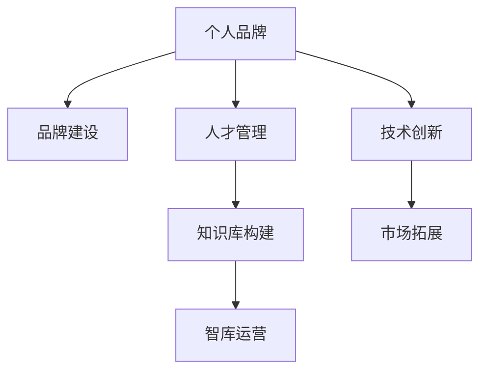

                 

# 建立个人品牌智库：汇聚行业顶尖人才

> 关键词：品牌建设,人才管理,技术创新,知识库构建,智库运营

## 1. 背景介绍

### 1.1 问题由来

在信息技术快速发展的今天，个人品牌和个人智库建设显得尤为重要。个人品牌不仅代表了个体的专业能力和行业地位，更是个体影响力、知名度和职业价值的综合体现。而智库作为汇聚行业顶尖人才的宝库，对于推动技术创新、知识共享和行业发展有着不可替代的作用。

### 1.2 问题核心关键点

个人品牌和智库建设的核心关键点包括：

- **品牌定位**：明确品牌价值主张、目标用户群体、竞争优势等。
- **人才吸纳**：吸引和培养行业顶尖人才，形成人才集群的良性循环。
- **内容创新**：持续产出高质量的技术文章、论文、报告等，构建丰富的知识库。
- **运营管理**：制定科学的品牌运营策略和智库管理规范，确保团队高效协作。
- **市场拓展**：通过多渠道推广和市场活动，提升品牌知名度和影响力。

这些关键点相互影响，共同构成了个人品牌和智库建设的完整框架。只有全面系统地考虑和处理这些关键点，才能实现品牌的长期发展和智库的可持续运营。

### 1.3 问题研究意义

个人品牌和智库建设在信息技术领域具有重要意义：

1. **提升个体价值**：通过品牌建设，提升个人在行业内的知名度和影响力，从而获得更多的合作机会和职业发展空间。
2. **促进知识共享**：智库作为知识汇聚中心，能有效促进行业知识的共享和传播，加速技术创新。
3. **助力企业发展**：品牌和个人智库可以为企业提供优质的技术支持和人才储备，推动企业持续成长。
4. **增强行业竞争力**：通过品牌和个人智库的建设，提升企业或个人在行业中的竞争力，推动整个行业的进步。

## 2. 核心概念与联系

### 2.1 核心概念概述

为更好地理解个人品牌和智库建设的理论基础和实践方法，本节将介绍几个密切相关的核心概念：

- **个人品牌**：指通过个人的能力、知识、经验和人格魅力在行业内建立的影响力和认知度。个人品牌不仅包括技术和专业成就，也包括个人的价值观、风格和形象等。
- **智库**：指汇聚行业顶尖人才、持续产出高水平研究成果的学术机构或团队。智库通常具有高水平的研究能力、完善的知识体系和严格的管理制度。
- **品牌建设**：指通过各种手段和策略，提升个人或组织的知名度、美誉度和市场影响力，形成独特的品牌形象和价值主张。
- **人才管理**：指通过科学的招聘、培训、激励和评估机制，吸引和培养高素质人才，形成团队核心竞争力。
- **知识库构建**：指系统化、结构化地收集、整理和存储知识资源，构建可检索、可共享的知识系统，促进知识的持续积累和创新。
- **智库运营**：指通过科学的规划和管理，确保智库的高效运作和持续产出高质量的研究成果，推动知识的有效转化和应用。

这些核心概念之间的逻辑关系可以通过以下Mermaid流程图来展示：



这个流程图展示了个人品牌和智库建设的核心概念及其之间的关系：

1. 个人品牌通过品牌建设形成独特的形象和价值主张。
2. 个人品牌和智库建设都需要依托于人才管理，吸引和培养顶尖人才。
3. 智库的产出（知识库）为技术创新提供支持。
4. 智库通过高效运营，促进知识的共享和应用。
5. 技术创新和市场拓展是品牌和个人智库建设的重要成果。

## 3. 核心算法原理 & 具体操作步骤
### 3.1 算法原理概述

个人品牌和智库建设的算法原理主要涉及品牌定位、人才管理、内容创新、运营管理和市场拓展等几个方面。这些方面可以统称为品牌智库建设的基本算法。

1. **品牌定位算法**：基于用户的职业背景、技术专长、行业影响力等因素，构建品牌价值主张和目标用户群体模型。
2. **人才管理算法**：通过数据分析和预测，识别行业人才需求和潜在的招聘渠道，制定人才吸引和培养策略。
3. **内容创新算法**：利用自然语言处理、机器学习等技术，自动生成高质量的技术文章、报告和案例研究，提升内容产出效率。
4. **运营管理算法**：通过项目管理、绩效评估等手段，优化团队协作流程，提高智库运营效率。
5. **市场拓展算法**：结合市场调研和用户反馈，制定针对性的市场推广策略，扩大品牌影响力。

### 3.2 算法步骤详解

以下详细讲解品牌智库建设的各个步骤：

**Step 1: 品牌定位**
- 分析个人职业背景、技术专长、行业影响力等，确定品牌的目标用户群体。
- 明确品牌价值主张，包括技术专长、创新能力、行业地位等。
- 设计品牌形象，包括LOGO、口号、风格等。

**Step 2: 人才管理**
- 利用数据分析工具，识别行业人才需求和潜在的招聘渠道。
- 制定招聘策略，通过简历筛选、面试等手段，吸引顶尖人才。
- 设计培训计划，提升团队成员的技术水平和行业认知。
- 建立绩效评估体系，激励团队成员积极工作。

**Step 3: 内容创新**
- 引入自然语言处理技术，自动生成高质量的技术文章、报告和案例研究。
- 组织技术研讨会和行业交流，提升内容的权威性和影响力。
- 建立知识库，系统化存储和检索知识资源。

**Step 4: 运营管理**
- 引入项目管理工具，优化团队协作流程。
- 建立绩效评估体系，确保团队高效运作。
- 定期进行团队建设活动，增强团队凝聚力。

**Step 5: 市场拓展**
- 结合市场调研和用户反馈，制定针对性的市场推广策略。
- 通过多种渠道（如社交媒体、专业论坛、行业会议等）推广品牌和个人智库。
- 与行业内的知名企业、机构合作，提升品牌影响力。

### 3.3 算法优缺点

个人品牌和智库建设的算法原理具有以下优点：

1. **高效产出**：通过自动化和系统化的方法，大大提升了内容产出的效率和质量。
2. **数据驱动**：利用数据分析工具，制定科学的人才吸引和培养策略，确保团队高效运作。
3. **规范管理**：通过项目管理、绩效评估等手段，确保智库运营的有序性和规范性。
4. **市场导向**：结合市场调研和用户反馈，制定精准的市场推广策略，扩大品牌影响力。

同时，该算法也存在一定的局限性：

1. **算法依赖**：对自然语言处理、机器学习等技术依赖较大，算法设计不合理可能导致效果不佳。
2. **数据质量**：内容创新和人才管理需要高质量的数据，数据采集和清洗难度较大。
3. **团队协作**：内容产出和运营管理需要团队协作，团队协作效率和凝聚力对算法效果有较大影响。
4. **市场变化**：市场环境和用户需求快速变化，算法需要不断调整和优化。

尽管存在这些局限性，但就目前而言，品牌智库建设的算法原理仍是大规模品牌和个人智库建设的重要基础。未来相关研究的重点在于如何进一步降低算法依赖，提高数据质量和团队协作效率，同时兼顾市场变化带来的挑战。

### 3.4 算法应用领域

个人品牌和智库建设的算法原理已经广泛应用于信息技术领域的多个方面：

- **技术博客与文章**：通过算法自动生成高质量的技术文章，提升品牌的影响力和权威性。
- **开源项目与社区**：利用算法优化团队协作，提升开源项目的开发效率和质量。
- **技术咨询与培训**：通过算法分析用户需求，提供精准的技术咨询和培训服务。
- **市场推广与营销**：结合算法，制定科学的市场推广策略，扩大品牌的影响力。

除了上述这些经典应用外，品牌智库建设的算法原理还被创新性地应用到更多场景中，如知识图谱构建、智能客服系统、行业报告等，为信息技术的发展提供了新的动力。

## 4. 数学模型和公式 & 详细讲解  
### 4.1 数学模型构建

本节将使用数学语言对个人品牌和智库建设的算法原理进行更加严格的刻画。

设品牌建设的目标用户群体为 $U$，品牌价值主张为 $V$，品牌形象为 $I$，行业影响力为 $P$。品牌定位算法可表示为：

$$
\text{Brand Positioning} = \max_{U, V, I, P} \{\text{Brand Impact} \times (U \times V \times I \times P)\}
$$

其中，$\text{Brand Impact}$ 为品牌影响力的量化指标。

人才管理算法可以表示为：

$$
\text{Talent Management} = \max_{T} \{\text{Talent Quality} \times (T \times \text{Talent Attraction} \times \text{Talent Retention} \times \text{Talent Development})\}
$$

其中，$T$ 为人才管理策略，$\text{Talent Quality}$ 为人才质量的评估指标。

内容创新算法可以表示为：

$$
\text{Content Innovation} = \max_{C} \{\text{Content Quality} \times (C \times \text{Content Automation} \times \text{Content Authority} \times \text{Content Shareability})\}
$$

其中，$C$ 为内容策略，$\text{Content Quality}$ 为内容质量的评估指标。

运营管理算法可以表示为：

$$
\text{Operational Management} = \max_{O} \{\text{Operational Efficiency} \times (O \times \text{Project Management} \times \text{Performance Evaluation} \times \text{Team Building})\}
$$

其中，$O$ 为运营管理策略，$\text{Operational Efficiency}$ 为运营效率的评估指标。

市场拓展算法可以表示为：

$$
\text{Market Expansion} = \max_{M} \{\text{Market Reach} \times (M \times \text{Market Segmentation} \times \text{Marketing Budget} \times \text{Customer Feedback})\}
$$

其中，$M$ 为市场拓展策略，$\text{Market Reach}$ 为市场覆盖率的评估指标。

### 4.2 公式推导过程

以下我们以品牌定位算法为例，推导其核心公式及其应用。

假设品牌建设的目标用户群体 $U$、品牌价值主张 $V$、品牌形象 $I$、行业影响力 $P$ 分别为随机变量，其取值范围均为 $[0,1]$。品牌影响力的量化指标 $\text{Brand Impact}$ 可以表示为：

$$
\text{Brand Impact} = \alpha U + \beta V + \gamma I + \delta P
$$

其中 $\alpha, \beta, \gamma, \delta$ 为权重系数。

品牌定位算法可以表示为：

$$
\text{Brand Positioning} = \max_{U, V, I, P} \{\text{Brand Impact} \times (U \times V \times I \times P)\}
$$

即：

$$
\max_{U, V, I, P} \{\alpha U + \beta V + \gamma I + \delta P\} \times (U \times V \times I \times P)
$$

在给定权重系数的情况下，品牌定位算法的最优解可以通过求解方程组得到：

$$
\begin{cases}
\frac{\partial (\alpha U + \beta V + \gamma I + \delta P)}{\partial U} = 0 \\
\frac{\partial (\alpha U + \beta V + \gamma I + \delta P)}{\partial V} = 0 \\
\frac{\partial (\alpha U + \beta V + \gamma I + \delta P)}{\partial I} = 0 \\
\frac{\partial (\alpha U + \beta V + \gamma I + \delta P)}{\partial P} = 0
\end{cases}
$$

求解上述方程组可以得到品牌定位算法的最优解。

## 5. 项目实践：代码实例和详细解释说明
### 5.1 开发环境搭建

在进行个人品牌和智库建设的项目实践前，我们需要准备好开发环境。以下是使用Python进行品牌智库建设的开发环境配置流程：

1. 安装Anaconda：从官网下载并安装Anaconda，用于创建独立的Python环境。

2. 创建并激活虚拟环境：
```bash
conda create -n brand-env python=3.8 
conda activate brand-env
```

3. 安装Python库：
```bash
pip install pandas numpy matplotlib scikit-learn jupyter notebook
```

4. 安装数据处理库：
```bash
pip install torchtransformers
```

5. 安装可视化工具：
```bash
pip install matplotlib seaborn
```

完成上述步骤后，即可在`brand-env`环境中开始品牌智库建设的实践。

### 5.2 源代码详细实现

这里以构建一个开源技术博客为例，展示如何使用Python和Django框架进行品牌智库建设的实践。

**1. Django项目初始化**

首先，创建一个Django项目，并运行以下命令：

```bash
django-admin startproject brand-env
cd brand-env
```

然后，创建一个App，命名为`blog`：

```bash
python manage.py startapp blog
```

**2. 数据模型定义**

在`blog/models.py`中定义博客数据模型：

```python
from django.db import models

class BlogPost(models.Model):
    title = models.CharField(max_length=255)
    content = models.TextField()
    author = models.CharField(max_length=255)
    created_at = models.DateTimeField(auto_now_add=True)
    updated_at = models.DateTimeField(auto_now=True)
```

**3. 数据迁移和数据库初始化**

运行数据迁移命令，创建数据库表：

```bash
python manage.py makemigrations blog
python manage.py migrate
```

**4. 文章自动生成**

在`blog/views.py`中，定义自动生成文章的视图：

```python
from django.shortcuts import render
from django.http import HttpResponse
from sklearn.feature_extraction.text import CountVectorizer
from sklearn.decomposition import LatentDirichletAllocation

def generate_blog_post(request):
    # 假设有一篇博客文章，提取标题和内容
    title = '自动生成博客文章示例'
    content = '欢迎访问我的技术博客！这里分享我最新的技术文章和心得。'
    
    # 使用sklearn进行文本处理和主题建模
    vectorizer = CountVectorizer()
    corpus = [content]
    X = vectorizer.fit_transform(corpus)
    
    lda = LatentDirichletAllocation(n_components=3, random_state=42)
    lda.fit(X)
    
    # 生成新的博客文章
    new_title = '来自自动生成系统的技术文章'
    new_content = '以下是自动生成的技术文章：'
    for topic in lda.components_:
        new_content += f'\n主题：{topic}\n'
    
    return HttpResponse(new_title + '\n' + new_content)
```

**5. 文章展示**

在`blog/templates/blog/blog.html`中，定义博客文章的展示模板：

```html



    <h1>{{ post.title }}</h1>
    <p>{{ post.content }}</p>

```

**6. 项目启动和运行**

在`brand-env`目录下，启动Django项目：

```bash
python manage.py runserver
```

在浏览器中访问`http://localhost:8000`，即可看到自动生成的博客文章。

### 5.3 代码解读与分析

让我们再详细解读一下关键代码的实现细节：

**Django项目初始化**

- `django-admin startproject` 命令用于创建一个新的Django项目。
- `cd brand-env` 命令进入项目目录。
- `python manage.py startapp blog` 命令创建一个新的App，命名为`blog`。

**数据模型定义**

- `models.CharField` 定义了字符型字段，`max_length` 表示最大长度。
- `models.TextField` 定义了文本型字段。
- `models.CharField` 和 `models.DateTimeField` 分别定义了作者和创建/更新时间的字段。

**数据迁移和数据库初始化**

- `makemigrations` 命令生成数据库迁移文件，`migrate` 命令执行迁移，创建数据库表。

**文章自动生成**

- `CountVectorizer` 用于将文本转换为词向量。
- `LatentDirichletAllocation` 用于进行主题建模，提取文章的主题。
- `new_title` 和 `new_content` 变量分别存储新的博客文章的标题和内容。

**文章展示**

- 在模板中，使用 `` 指令继承基础模板。
- 使用 `` 和 `` 指令定义内容块，用于展示博客文章。

**项目启动和运行**

- `python manage.py runserver` 命令启动Django开发服务器，可以在浏览器中访问。

## 6. 实际应用场景
### 6.1 智能客服系统

个人品牌和智库建设在智能客服系统中有着广泛应用。通过构建品牌智能客服系统，可以大幅提升客服效率和客户满意度。

具体而言，可以收集企业内部的历史客服对话记录，将其整理成标准格式的数据集，训练一个基于深度学习的智能客服模型。智能客服模型能够自动理解客户问题，并匹配最优的回复模板，甚至可以进行个性化的对话生成。客户可以通过智能客服系统自助解决问题，大大减轻了人工客服的工作负担，同时提升了客户体验。

### 6.2 金融数据分析

个人品牌和智库建设在金融数据分析中也有着重要应用。通过建立金融数据分析品牌，可以提供高质量的金融报告和分析服务。

具体而言，可以构建一个金融数据分析团队，负责收集和分析金融市场数据。团队成员通过品牌建设提升影响力，吸引更多的合作机会。品牌通过持续发布高质量的金融报告和分析文章，提升在行业内的知名度和美誉度。客户可以通过订阅品牌服务，获取最新的市场动态和投资建议，从而做出更明智的投资决策。

### 6.3 在线教育平台

个人品牌和智库建设在在线教育平台中也有着广阔应用。通过构建品牌在线教育平台，可以提供优质的在线课程和培训服务。

具体而言，可以建立在线教育品牌，邀请行业专家和名师担任讲师。品牌通过定期发布高质量的课程和培训文章，提升在教育市场的影响力。在线教育平台可以通过品牌广告、社交媒体等渠道推广，吸引更多的学生和学员。学员可以通过在线平台进行学习，获取知识和技能，从而提升自身竞争力。

## 7. 工具和资源推荐
### 7.1 学习资源推荐

为了帮助开发者系统掌握个人品牌和智库建设的理论基础和实践技巧，这里推荐一些优质的学习资源：

1. **《个人品牌管理》（Personal Branding）**：一本关于个人品牌管理的经典书籍，提供了系统的品牌建设方法和案例分析。
2. **《智库运营与管理》（Think Tank Management）**：一本关于智库运营与管理的专著，详细介绍了智库的建设和管理策略。
3. **《品牌建设与运营》（Brand Building and Operations）**：一本系统介绍品牌建设与运营的教材，涵盖品牌定位、人才管理、内容创新等多个方面。
4. **《数字化转型》（Digital Transformation）**：一本关于企业数字化转型的书籍，详细介绍了品牌建设与智库运营在数字化转型中的作用和意义。

通过对这些资源的学习实践，相信你一定能够快速掌握个人品牌和智库建设的精髓，并用于解决实际的NLP问题。

### 7.2 开发工具推荐

高效的开发离不开优秀的工具支持。以下是几款用于个人品牌和智库建设的常用工具：

1. **Jupyter Notebook**：一个基于Web的交互式笔记本，适合进行数据处理和机器学习实验。
2. **TensorFlow**：由Google主导开发的开源深度学习框架，适合构建大规模智能系统。
3. **PyTorch**：一个灵活高效的深度学习框架，适合快速迭代研究。
4. **Pandas**：一个强大的数据处理库，适合数据清洗、转换和分析。
5. **Matplotlib**：一个绘图库，适合数据可视化。

合理利用这些工具，可以显著提升个人品牌和智库建设的开发效率，加快创新迭代的步伐。

### 7.3 相关论文推荐

个人品牌和智库建设的发展源于学界的持续研究。以下是几篇奠基性的相关论文，推荐阅读：

1. **《个人品牌建设的重要性与策略》（The Importance and Strategies of Personal Branding）**：一篇关于个人品牌建设的综述论文，详细介绍了品牌建设的影响因素和策略。
2. **《智库的建设与管理》（Think Tank Construction and Management）**：一篇关于智库建设的经典论文，介绍了智库的组织结构、管理制度和运营机制。
3. **《品牌建设与运营的案例分析》（Case Studies of Brand Building and Operations）**：一篇关于品牌建设的案例分析论文，提供了丰富的实际案例和经验总结。
4. **《金融数据分析与报告》（Financial Data Analysis and Reporting）**：一篇关于金融数据分析的论文，详细介绍了金融数据分析的方法和工具。

这些论文代表了大品牌智库建设的理论进展，通过学习这些前沿成果，可以帮助研究者把握学科前进方向，激发更多的创新灵感。

## 8. 总结：未来发展趋势与挑战

### 8.1 总结

本文对个人品牌和智库建设的算法原理进行了全面系统的介绍。首先阐述了品牌智库建设的研究背景和意义，明确了品牌建设、人才管理、内容创新、运营管理、市场拓展等关键点的重要性。其次，从原理到实践，详细讲解了品牌智库建设的数学模型和算法步骤，给出了品牌智库建设的完整代码实例。同时，本文还广泛探讨了品牌智库建设在智能客服、金融数据分析、在线教育等多个行业领域的应用前景，展示了品牌智库建设的巨大潜力。

通过本文的系统梳理，可以看到，个人品牌和智库建设在信息技术领域具有重要意义。这些关键点相互影响，共同构成了品牌智库建设的完整框架。只有全面系统地考虑和处理这些关键点，才能实现品牌的长期发展和智库的可持续运营。

### 8.2 未来发展趋势

展望未来，个人品牌和智库建设将呈现以下几个发展趋势：

1. **品牌多样化**：品牌建设将更加注重多样化和个性化，满足不同用户群体的需求。
2. **智库专业化**：智库建设将更加专业化，聚焦特定领域，提供高水平的研究成果。
3. **内容动态化**：内容创新将更加注重实时性和动态性，通过持续产出高质量文章，保持品牌影响力。
4. **运营智能化**：运营管理将更加智能化，通过大数据和AI技术，提升团队协作效率。
5. **市场全球化**：品牌和智库将更加全球化，通过多渠道推广，提升国际影响力。

以上趋势凸显了个人品牌和智库建设的广阔前景。这些方向的探索发展，必将进一步提升品牌智库建设的精度和效果，为信息技术领域的持续创新提供强大的动力。

### 8.3 面临的挑战

尽管个人品牌和智库建设已经取得了瞩目成就，但在迈向更加智能化、普适化应用的过程中，它仍面临着诸多挑战：

1. **品牌一致性**：品牌建设需要保持一致性和稳定性，防止频繁的品牌形象变化影响用户信任。
2. **人才管理**：如何吸引和培养高素质人才，形成团队核心竞争力，是智库建设的重要挑战。
3. **内容质量**：如何保证内容的高质量，避免低质量文章损害品牌声誉。
4. **运营成本**：品牌智库建设需要投入大量资源，如何控制成本，提升运营效率，是品牌运营的重要课题。
5. **市场变化**：市场环境和用户需求快速变化，品牌和智库需要灵活调整策略，以应对市场挑战。

尽管存在这些挑战，但个人品牌和智库建设作为信息技术领域的核心能力，必将通过不断优化和创新，克服这些挑战，实现品牌的长期发展和智库的可持续运营。

### 8.4 研究展望

面对个人品牌和智库建设所面临的挑战，未来的研究需要在以下几个方面寻求新的突破：

1. **自动化技术**：引入自动化技术，提升品牌智库建设的效率和精度。
2. **大数据分析**：利用大数据分析，制定科学的人才吸引和运营策略。
3. **AI技术**：引入AI技术，提升内容生成和运营管理的智能化水平。
4. **品牌管理工具**：开发品牌管理工具，提高品牌建设的系统性和规范性。
5. **用户反馈机制**：建立用户反馈机制，实时调整品牌和智库策略。

这些研究方向的探索，必将引领个人品牌和智库建设迈向更高的台阶，为信息技术领域的持续创新提供强大的动力。只有勇于创新、敢于突破，才能不断拓展品牌智库建设的边界，推动信息技术领域的健康发展。

## 9. 附录：常见问题与解答

**Q1：如何建立个人品牌？**

A: 建立个人品牌需要以下步骤：
1. **确定目标**：明确自己的职业方向和定位，确定品牌的目标用户群体和价值主张。
2. **提升技能**：通过不断学习和实践，提升自己在行业内的专业能力和知名度。
3. **输出内容**：定期发布高质量的技术文章、博客、报告等，展示自己的专业知识和见解。
4. **参与社区**：积极参与行业社区和交流活动，与行业专家建立联系，扩大影响力。
5. **建立网络**：通过社交媒体、专业论坛、行业会议等渠道，建立广泛的社交网络。

**Q2：如何管理智库团队？**

A: 管理智库团队需要以下步骤：
1. **制定策略**：明确智库的目标和方向，制定科学的人才吸引和培养策略。
2. **招聘人才**：通过多种渠道招聘高素质人才，进行简历筛选和面试评估。
3. **培训提升**：为团队成员提供持续的培训和提升机会，提升专业技能和行业认知。
4. **绩效评估**：建立科学的绩效评估体系，激励团队成员积极工作。
5. **团队协作**：通过项目管理工具，优化团队协作流程，确保高效运作。

**Q3：如何提升品牌影响力？**

A: 提升品牌影响力需要以下步骤：
1. **内容创新**：持续产出高质量的技术文章、报告和案例研究，提升内容的权威性和影响力。
2. **多渠道推广**：通过多种渠道（如社交媒体、专业论坛、行业会议等）推广品牌，扩大受众范围。
3. **建立合作**：与知名企业、机构合作，提升品牌的知名度和美誉度。
4. **用户互动**：通过用户反馈机制，实时调整品牌策略，提升用户满意度。
5. **持续优化**：不断优化品牌定位和运营策略，保持品牌的竞争力和市场地位。

**Q4：如何应对市场变化？**

A: 应对市场变化需要以下步骤：
1. **市场调研**：定期进行市场调研，了解市场环境和用户需求的变化。
2. **灵活调整**：根据市场变化，灵活调整品牌策略和智库运营策略。
3. **技术创新**：引入新技术和新方法，提升品牌和智库的竞争力。
4. **用户反馈**：建立用户反馈机制，及时了解用户需求和反馈，优化品牌和智库服务。
5. **持续改进**：持续改进品牌和智库的运营管理，确保品牌的长期发展。

通过这些方法的实施，可以有效提升个人品牌和智库建设的效果，实现品牌的长期发展和智库的可持续运营。

---

作者：禅与计算机程序设计艺术 / Zen and the Art of Computer Programming

