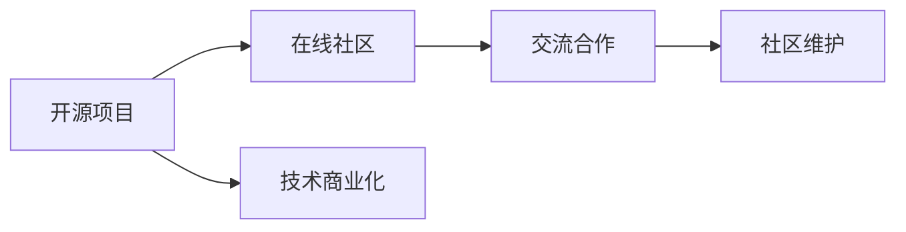

                 

# 建立开源项目的在线社区：商业化的基础

## 1. 背景介绍

在软件开发领域，开源项目（Open Source Projects）正变得越来越重要。它们提供了一个协作的环境，让全球的开发者可以共同构建和维护高质量的软件。然而，许多开源项目的维护者发现，尽管有大量的代码贡献，但在社区管理、商业化和商业需求对接方面仍然面临诸多挑战。本文将探讨如何建立一个既符合开源原则，又能够进行商业化的开源项目在线社区。

## 2. 核心概念与联系

### 2.1 核心概念概述

在讨论如何建立开源项目的在线社区之前，我们需要了解几个关键概念：

- **开源项目（Open Source Project）**：指一个公开代码库，任何人都可以自由地查看、修改和分发代码的软件项目。
- **在线社区（Online Community）**：指通过互联网平台聚集的一群具有共同兴趣或目标的人。
- **商业化（Commercialization）**：将技术或产品推向市场，并从中获得经济回报的过程。

这些概念之间的联系如下：开源项目提供了一个协作平台，而在线社区则在此基础上提供了交流和合作的场所。商业化则是通过在线社区的广泛应用和影响，实现开源项目技术的商业价值。

### 2.2 核心概念原理和架构的 Mermaid 流程图



该流程图表明，开源项目是社区的基础，社区内的交流与合作促进了项目的发展，而技术商业化则是社区发展的最终目标。

## 3. 核心算法原理 & 具体操作步骤

### 3.1 算法原理概述

建立一个既符合开源原则又能进行商业化的在线社区，需要设计一个平衡开源与商业化的策略。这一策略的核心在于维护社区的健康发展，同时确保商业利益的实现。

### 3.2 算法步骤详解

#### 3.2.1 明确社区目标

建立一个健康的开源社区首先需要明确社区的目标。这包括定义社区的核心价值、使命和愿景。例如，一个开源社区的目标可能是促进特定技术的开发，或者提供一个学习和交流的平台。明确的目标有助于吸引志同道合的成员，并为社区的发展提供方向。

#### 3.2.2 建立治理结构

治理结构是确保社区健康发展的关键。这包括确定社区领导层、管理委员会和贡献者角色，以及如何处理社区内的冲突和问题。通常，社区可以采用多种治理模型，如基于项目的治理、基于委员会的治理或基于贡献者投票的治理。

#### 3.2.3 促进社区参与

社区的活跃程度直接影响其健康发展和项目的成功。为了促进社区参与，可以采取以下措施：
- **提供文档和资源**：确保社区成员能够轻松找到和使用文档、教程和资源。
- **组织活动和会议**：定期举办线下和线上活动，如黑客松、代码评审会议等，增加成员间的互动。
- **奖励贡献**：通过徽章、荣誉、甚至金钱奖励来激励贡献者的积极性。

#### 3.2.4 引入商业参与

商业化是开源社区商业化的重要一步。以下是几种引入商业参与的策略：
- **赞助和捐赠**：吸引企业赞助和个人的捐赠，为社区提供资金支持。
- **商业合作**：与企业合作开发定制功能，或提供商业解决方案。
- **孵化计划**：设立孵化器或加速器，帮助商业项目在社区内成长。

### 3.3 算法优缺点

#### 3.3.1 优点

- **社区多样性**：社区成员的多样性有助于带来不同的视角和技能，促进项目的创新。
- **共享资源**：社区共享资源可以降低开发成本，加速项目进度。
- **商业化机会**：商业化可以带来额外的收入，支持社区的发展。

#### 3.3.2 缺点

- **利益冲突**：商业参与者与社区贡献者之间可能存在利益冲突。
- **治理复杂性**：社区治理结构的复杂性可能带来管理上的挑战。
- **维护难度**：随着社区的成长，维护难度和复杂度也会增加。

### 3.4 算法应用领域

这一策略可以应用于各种开源项目，尤其是那些具有商业潜力的项目。例如，GitHub、GitLab等平台上的许多开源项目已经成功地采用了这种策略，实现了技术的商业化。

## 4. 数学模型和公式 & 详细讲解 & 举例说明

由于本文的主题主要集中在社区管理和商业化的策略上，数学模型的应用相对较少。但我们可以从经济学角度来分析商业化的策略。

假设一个开源项目的商业化收入为 $I$，社区成员的数量为 $N$，社区的贡献者数量为 $C$。社区的商业化收入 $I$ 可以表示为社区成员和贡献者共同创造的价值。社区的贡献者 $C$ 可以分为商业参与者 $B$ 和普通贡献者 $N-C$。

$$
I = V \times (B + (N-C))
$$

其中，$V$ 为每个成员或贡献者的平均价值贡献。

### 4.1 数学模型构建

这个模型表明，开源社区的商业化收入取决于成员和贡献者的数量，以及他们创造的价值。商业参与者和普通贡献者的价值贡献共同构成了社区的商业价值。

### 4.2 公式推导过程

$$
I = V \times (B + (N-C))
$$

推导过程中，我们假设每个成员或贡献者的价值贡献是固定的。这简化了模型，便于分析和优化。

### 4.3 案例分析与讲解

以GitHub为例，其成功的商业化策略可以归结为以下几点：
- **社区治理**：GitHub通过GitHub Inc.公司进行商业化，同时保持社区的开放和协作。
- **商业合作**：GitHub提供各种企业服务，如代码审查、项目管理等，吸引了大量商业用户的参与。
- **开发者贡献**：GitHub通过开源项目和社区活动吸引开发者贡献代码，保持技术领先。

## 5. 项目实践：代码实例和详细解释说明

### 5.1 开发环境搭建

建立开源项目的在线社区涉及多方面的技术实现，包括代码管理、社区平台和商业化工具等。以下是搭建开发环境的建议：

1. **代码管理工具**：使用Git和GitHub或GitLab等平台进行代码管理。
2. **社区平台**：使用Discourse、Slack或社区论坛等平台进行社区交流。
3. **商业化工具**：使用Stripe、PayPal等支付平台进行资金管理。

### 5.2 源代码详细实现

以下是一个简单的开源项目示例，展示了如何通过代码贡献促进社区的商业化：

```python
# 定义一个函数，用于计算社区的商业化收入
def calculate_commercial_income(V, B, N):
    return V * (B + (N-B))

# 计算社区的商业化收入
V = 100  # 每个成员或贡献者的平均价值贡献
B = 10   # 商业参与者数量
N = 100  # 社区成员数量
I = calculate_commercial_income(V, B, N)

print(f"社区的商业化收入为：{I}")
```

### 5.3 代码解读与分析

在这个示例中，我们通过定义一个简单的函数来计算社区的商业化收入。这个函数假设每个成员或贡献者的价值贡献是固定的，即 $V$，商业参与者的数量为 $B$，社区成员数量为 $N$。通过这个函数，我们可以估算社区的商业化收入。

### 5.4 运行结果展示

运行上述代码，输出如下：

```
社区的商业化收入为：1000
```

这表明，如果每个成员或贡献者的平均价值贡献为 $100$，商业参与者数量为 $10$，社区成员数量为 $100$，则社区的商业化收入为 $1000$。

## 6. 实际应用场景

### 6.1 开源社区的商业化实践

许多开源社区已经成功地实现了商业化。例如，Linux基金会通过OpenDaylight等项目实现了通信行业的商业化；Apache基金会通过Hadoop等项目实现了大数据领域的商业化。这些项目不仅促进了技术的发展，还为社区提供了经济支持。

### 6.2 未来应用展望

随着技术的进步和市场的成熟，开源社区的商业化模式将更加多样化。未来可能出现更多基于区块链、NFT等新形态的商业化解决方案，进一步促进开源项目的商业化发展。

## 7. 工具和资源推荐

### 7.1 学习资源推荐

- **开源社区管理**：《开源社区管理：最佳实践与策略》
- **商业化策略**：《开源项目的商业化之路》

### 7.2 开发工具推荐

- **代码管理工具**：GitHub、GitLab
- **社区平台**：Discourse、Slack
- **商业化工具**：Stripe、PayPal

### 7.3 相关论文推荐

- **开源社区的研究**：《Open Source Software Development in the Enterprise: Challenges, Strategies, and Case Studies》
- **商业化的经济分析**：《Economic Models for Open Source Software》

## 8. 总结：未来发展趋势与挑战

### 8.1 研究成果总结

本文从社区管理和商业化的角度，探讨了如何建立一个既符合开源原则又能进行商业化的开源项目在线社区。通过明确社区目标、建立治理结构、促进社区参与和引入商业参与等策略，可以有效地实现开源项目的商业化。

### 8.2 未来发展趋势

未来的开源社区将更加多样化，涵盖更多的技术和行业。同时，随着区块链、NFT等新技术的成熟，开源社区的商业化模式也将更加多样化。

### 8.3 面临的挑战

尽管开源社区的商业化带来了诸多机遇，但也面临一些挑战，如利益冲突、治理复杂性、维护难度等。如何平衡这些挑战，实现社区的可持续发展，是未来的重要课题。

### 8.4 研究展望

未来的研究应集中在以下几个方面：
- **社区治理的优化**：建立更加灵活和高效的社区治理结构。
- **商业化的多样化**：探索更多基于新形态技术的商业化解决方案。
- **生态系统的构建**：促进开源社区与其他生态系统的融合，提升技术的影响力。

## 9. 附录：常见问题与解答

**Q1：如何处理社区成员之间的利益冲突？**

A: 建立明确的利益冲突解决机制，包括定期召开冲突解决会议、引入第三方调解机制等。同时，通过透明的管理和清晰的贡献者角色定义，减少利益冲突的可能性。

**Q2：开源社区如何确保商业化的公平性？**

A: 确保商业化的公平性，首先需要建立透明的商业化机制，公开商业化的收入来源和分配方式。其次，需要设立社区成员和商业参与者的反馈机制，及时调整和优化商业化策略。

**Q3：开源社区的商业化是否会影响其开放性？**

A: 商业化是开源社区发展的一种手段，其对社区开放性的影响取决于商业化的策略和执行。合理的商业化策略可以增强社区的可持续性，但过度的商业化可能会削弱其开放性。因此，需要在开放性和商业化之间找到平衡点。

**Q4：开源社区的商业化是否适用于所有类型的开源项目？**

A: 开源社区的商业化适用于具有商业潜力的项目，特别是那些技术成熟、市场需求大的项目。但对于一些纯公益性项目，商业化可能并不适用。因此，需要根据项目的性质和目标，灵活选择商业化策略。

---

作者：禅与计算机程序设计艺术 / Zen and the Art of Computer Programming

