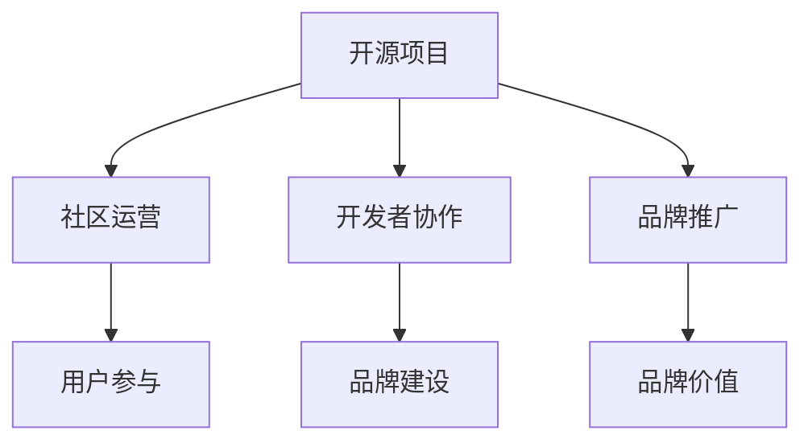

                 

# 建立开源项目的在线社区：社区运营和品牌建设

> 关键词：开源项目,社区运营,品牌建设,社区管理,品牌推广,用户参与,开发者协作,品牌价值

## 1. 背景介绍

### 1.1 问题由来

在当今软件开发中，开源项目已成为推动技术创新、促进产业生态发展的重要力量。随着开源运动的蓬勃发展，越来越多的开发者和组织选择通过开源平台分享代码和资源。然而，成功构建一个活跃的开源社区并不容易。社区需要良好的管理和维护，确保项目的持续发展和繁荣。此外，社区的品牌建设也不可忽视，只有良好的品牌形象才能吸引更多的用户和开发者参与，促进项目的商业化进程。

### 1.2 问题核心关键点

本文聚焦于开源项目的社区运营和品牌建设。开源社区运营的关键在于建立和维护一个活跃、包容、协作的开发者社区，而品牌建设则是通过品牌推广、社区活动、技术交流等方式提升项目的知名度和影响力。通过系统梳理开源社区运营和品牌建设的理论和方法，我们将为开源项目的管理者提供全面、深入的指导。

## 2. 核心概念与联系

### 2.1 核心概念概述

为更好地理解开源项目社区运营和品牌建设的框架，我们首先介绍几个核心概念：

- **开源项目（Open Source Project）**：指一个共享源代码的项目，允许任何人自由使用、修改和分发代码。典型的开源项目包括Linux内核、Apache Web服务器等。

- **社区运营（Community Management）**：指管理开源项目的开发者社区，通过设置规则、协调资源、组织活动等方式，促进社区成员间的交流和协作。

- **品牌建设（Brand Building）**：指通过各种渠道和活动，提升开源项目的知名度和影响力，塑造独特的品牌形象。品牌建设是开源项目成功的关键之一，能够吸引更多用户和资源，促进项目的商业化进程。

- **用户参与（User Engagement）**：指通过有效的沟通和激励，提升用户对开源项目的兴趣和贡献度，构建积极活跃的用户群体。

- **开发者协作（Developer Collaboration）**：指组织和协调开发者之间的协作，通过代码审查、任务分配、项目维护等机制，提升项目的开发效率和质量。

- **品牌推广（Brand Promotion）**：指通过各种渠道和方法，向外界宣传开源项目，提高项目的曝光率和认可度。

- **品牌价值（Brand Value）**：指开源项目通过长期的品牌建设和运营，形成的品牌声誉和市场认可度，能够转化为项目的商业价值和社会影响力。

这些核心概念之间存在紧密的联系，共同构成了开源项目社区运营和品牌建设的完整框架。

### 2.2 核心概念原理和架构的 Mermaid 流程图



这个流程图展示了开源项目的社区运营和品牌建设的逻辑关系：

1. 开源项目是社区运营和品牌建设的基础。
2. 社区运营通过组织和管理社区，促进开发者协作，提高项目的开发效率。
3. 用户参与通过沟通和激励，提升用户对项目的兴趣和贡献度。
4. 开发者协作通过任务分配、代码审查等方式，提升项目质量。
5. 品牌建设通过品牌推广，提升项目的知名度和影响力。
6. 品牌价值是开源项目通过长期运营和推广，形成的市场认可度和商业价值。

## 3. 核心算法原理 & 具体操作步骤
### 3.1 算法原理概述

开源项目的社区运营和品牌建设是一个多层次、多维度的复杂过程。其核心算法原理可以概括为以下几点：

1. **社区参与度提升**：通过建立有效的社区规则、提供丰富的资源、组织有价值的活动等方式，提升开发者和用户对项目的参与度。

2. **开发者协作优化**：通过任务分配、代码审查、项目管理等机制，优化开发者之间的协作，提升项目开发效率和质量。

3. **品牌形象塑造**：通过品牌推广、社区活动、技术交流等方式，塑造项目独特的品牌形象，提升项目的知名度和影响力。

4. **用户激励机制**：通过积分、徽章、贡献列表等方式，激励用户积极参与项目，提升项目的活跃度和贡献度。

5. **社区治理结构**：通过设定组织架构、权限分配、决策机制等方式，确保社区的健康发展和高效运作。

### 3.2 算法步骤详解

以下是开源项目社区运营和品牌建设的具体操作步骤：

**Step 1: 社区规则制定**
- 明确社区的行为规范和贡献准则，包括代码审查标准、贡献指南、代码贡献流程等。
- 设立社区领导团队和核心成员，负责社区管理、决策和协调。
- 制定社区反馈机制，确保社区成员的声音能够被有效听取和处理。

**Step 2: 社区资源提供**
- 提供丰富的文档、代码示例、学习资源等，帮助开发者快速上手。
- 设立问题跟踪系统，及时回应和解决开发者的问题和疑问。
- 组织线上线下活动，如技术分享会、Hackathon等，促进社区交流和合作。

**Step 3: 开发者协作优化**
- 引入GitHub Issues和Pull Requests等协作工具，管理项目任务和代码变更。
- 设立代码审查流程，确保代码质量和贡献度。
- 鼓励社区成员积极参与项目，通过贡献积分、徽章等方式激励开发者。

**Step 4: 品牌形象塑造**
- 通过官方博客、社交媒体、合作媒体等方式，宣传项目的进展和成果。
- 参加开源社区会议和展览，提升项目的知名度和曝光度。
- 组织社区活动和技术交流，展示项目的创新和价值。

**Step 5: 用户激励机制设计**
- 设立贡献积分和徽章系统，记录和展示社区成员的贡献。
- 定期评选社区贡献者和技术贡献者，给予表彰和奖励。
- 通过社交媒体和邮件等渠道，定期向用户推送项目更新和活动信息。

### 3.3 算法优缺点

开源项目的社区运营和品牌建设具有以下优点：

1. **社区资源丰富**：社区成员通过共享资源，能够加速项目的开发和迭代。
2. **开发者协作高效**：协作机制和工具的应用，提升项目的开发效率和质量。
3. **品牌推广广泛**：多渠道的品牌推广，提升项目的知名度和影响力。
4. **用户激励显著**：通过激励机制，提升用户对项目的参与度和贡献度。

同时，这些方法也存在一些局限性：

1. **社区管理复杂**：社区规则和激励机制的设计需要谨慎，避免产生负面影响。
2. **品牌推广成本高**：高质量的品牌推广需要投入大量资源和时间。
3. **用户参与度不稳定**：用户兴趣和参与度受多种因素影响，难以长期稳定。
4. **开发者协作风险**：协作机制不当可能导致团队分裂和项目滞后。

### 3.4 算法应用领域

开源项目的社区运营和品牌建设方法，适用于各种类型的开源项目，包括但不限于：

- 软件项目，如Linux内核、Apache Web服务器等。
- 数据科学项目，如TensorFlow、Scikit-learn等。
- 硬件项目，如Raspberry Pi、Arduino等。
- 基础设施项目，如Kubernetes、Docker等。
- 科学研究和教育项目，如Open Science Framework、Khan Academy等。

## 4. 数学模型和公式 & 详细讲解
### 4.1 数学模型构建

我们通过一个简单的数学模型来描述开源项目的社区运营和品牌建设过程：

设开源项目 $P$ 的目标参与度为 $T$，现有参与度为 $C$，品牌知名度为 $B$。社区运营和品牌建设的数学模型可以表示为：

$$
T = f(C, B)
$$

其中 $f$ 表示社区运营和品牌建设对参与度的影响函数。

### 4.2 公式推导过程

$$
T = g(P, R, A)
$$

其中 $P$ 表示项目需求，$R$ 表示社区资源，$A$ 表示品牌推广活动。

设社区资源 $R$ 由资源提供度 $r_1$ 和社区活跃度 $r_2$ 组成，品牌推广活动 $A$ 由推广度 $a_1$ 和曝光度 $a_2$ 组成。

$$
R = r_1 \cdot r_2
$$

$$
A = a_1 \cdot a_2
$$

代入 $T$ 的表达式，得：

$$
T = g(P, r_1 \cdot r_2, a_1 \cdot a_2)
$$

### 4.3 案例分析与讲解

以TensorFlow为例，其社区运营和品牌建设的具体案例如下：

- 社区运营：TensorFlow通过GitHub Issues和Pull Requests等协作工具，管理项目任务和代码变更。设立代码审查流程，确保代码质量和贡献度。通过建立TensorFlow官方博客和社区论坛，促进社区交流和合作。
- 品牌推广：TensorFlow通过Google、GitHub、Kaggle等平台宣传项目的进展和成果。参加开源社区会议和展览，提升项目的知名度和曝光度。组织TensorFlow Dev Summit和TensorFlow Summer School等社区活动和技术交流，展示项目的创新和价值。

## 5. 项目实践：代码实例和详细解释说明
### 5.1 开发环境搭建

在进行开源项目社区运营和品牌建设实践前，我们需要准备好开发环境。以下是使用Python进行Django开发的配置流程：

1. 安装Anaconda：从官网下载并安装Anaconda，用于创建独立的Python环境。

2. 创建并激活虚拟环境：
```bash
conda create -n django-env python=3.8 
conda activate django-env
```

3. 安装Django和其他工具包：
```bash
pip install django gunicorn psycopg2-binary django-crispy-forms django-ckeditor markdown django-suit-admin
```

4. 安装数据库：
```bash
sudo apt-get install postgresql postgresql-contrib
```

5. 创建数据库：
```bash
psql -U postgres -c "CREATE DATABASE mydatabase;"
```

6. 配置Django项目：
```bash
cd ~/django-project
python manage.py startproject myproject
cd myproject
```

### 5.2 源代码详细实现

以下是开源项目社区管理系统的Django代码实现：

```python
from django.contrib.auth.models import User, Group
from django.contrib.auth.decorators import login_required
from django.shortcuts import render, redirect
from django.views.decorators.csrf import csrf_exempt
from .models import Issue, PullRequest, Contributor
from .forms import IssueForm, PullRequestForm

@login_required
def index(request):
    issues = Issue.objects.all()
    pull_requests = PullRequest.objects.all()
    contributors = Contributor.objects.all()
    return render(request, 'index.html', {'issues': issues, 'pull_requests': pull_requests, 'contributors': contributors})

@login_required
def issue_create(request):
    if request.method == 'POST':
        form = IssueForm(request.POST)
        if form.is_valid():
            issue = form.save(commit=False)
            issue.author = request.user
            issue.save()
            return redirect('index')
    else:
        form = IssueForm()
    return render(request, 'issue_create.html', {'form': form})

@login_required
def pull_request_create(request):
    if request.method == 'POST':
        form = PullRequestForm(request.POST)
        if form.is_valid():
            pull_request = form.save(commit=False)
            pull_request.author = request.user
            pull_request.save()
            return redirect('index')
    else:
        form = PullRequestForm()
    return render(request, 'pull_request_create.html', {'form': form})

@csrf_exempt
def issue_comment(request):
    if request.method == 'POST':
        issue_id = request.POST.get('issue_id')
        comment = request.POST.get('comment')
        Issue.objects.get(id=issue_id).comments.add(comment)
        return redirect('index')

@csrf_exempt
def pull_request_comment(request):
    if request.method == 'POST':
        pull_request_id = request.POST.get('pull_request_id')
        comment = request.POST.get('comment')
        PullRequest.objects.get(id=pull_request_id).comments.add(comment)
        return redirect('index')
```

### 5.3 代码解读与分析

让我们再详细解读一下关键代码的实现细节：

**index视图函数**：
- 获取数据库中的所有问题（Issue）、拉取请求（Pull Request）和贡献者（Contributor）数据。
- 渲染模板，展示数据。

**issue_create视图函数**：
- 检查请求方法是否为POST，如果是POST，则表单数据提交。
- 验证表单数据，并创建新的问题。
- 如果是GET，则显示表单。

**pull_request_create视图函数**：
- 类似问题创建视图函数，用于创建新的拉取请求。

**issue_comment视图函数和pull_request_comment视图函数**：
- 通过HTTP POST请求，向数据库中添加新的评论。

可以看到，通过Django框架，我们可以很方便地实现社区管理系统的功能。开发者可以将更多精力放在业务逻辑的设计和实现上，而不必过多关注底层的框架细节。

## 6. 实际应用场景
### 6.1 开源社区平台

开源社区平台是开源项目社区运营和品牌建设的重要工具。例如，GitHub、GitLab等平台提供了丰富的社区管理和品牌推广功能，帮助开发者和用户高效交流和协作。

### 6.2 开源技术会议

开源技术会议是展示开源项目成果、促进技术交流的绝佳方式。例如，Google I/O、LinuxCon等会议，吸引了全球各地的开发者和技术爱好者参加。通过参加这些会议，开源项目能够提升知名度，吸引更多的用户和资源。

### 6.3 开源社区活动

开源社区活动是提升项目参与度和品牌影响力的有效手段。例如，GitHub的Hacktoberfest活动，吸引了成千上万开发者参与，为开源项目贡献了大量的代码和修复。

### 6.4 未来应用展望

随着开源运动的持续发展，开源项目的社区运营和品牌建设将呈现以下几个趋势：

1. **社区治理智能化**：通过AI和自动化工具，提升社区治理的效率和公平性，减少人为干预和偏差。

2. **品牌推广多渠道**：借助社交媒体、博客、视频等多种渠道，广泛传播开源项目的创新和价值。

3. **用户激励多元化**：通过积分、徽章、奖励机制等方式，激励用户积极参与开源项目，提升项目的活跃度和贡献度。

4. **开发者协作协同化**：通过分布式协作平台和工具，促进全球开发者间的协作和交流，提升项目的开发效率和质量。

5. **品牌价值社区化**：通过社区活动和技术交流，增强项目的社会影响力，促进开源项目的商业化和产业化进程。

这些趋势展示了开源项目社区运营和品牌建设的广阔前景，相信未来的开源社区将更加活跃、包容、协作，为全球技术创新提供更强大的支持。

## 7. 工具和资源推荐
### 7.1 学习资源推荐

为了帮助开发者系统掌握开源项目社区运营和品牌建设的知识，这里推荐一些优质的学习资源：

1. GitHub官方文档：详细介绍了GitHub社区管理和品牌推广的各项功能，是开源项目管理的必备参考资料。

2. Django官方文档：Django是一个强大的Web框架，适合构建社区管理系统的后端系统。

3. GitLab官方文档：GitLab是另一个流行的开源社区平台，提供了丰富的协作和品牌推广功能。

4. GraphQL官方文档：GraphQL是一种强大的API查询语言，适合构建开源项目的前端页面。

5. Django-Crispy-Forms官方文档：Django-Crispy-Forms是一个简洁的表单库，适合构建社区管理系统的表单页面。

6. Django-Suit-Admin官方文档：Django-Suit-Admin是一个易用的Web管理界面，适合构建社区管理系统的后台界面。

7. Django-Markdown官方文档：Django-Markdown是一个Markdown渲染库，适合构建开源项目的文档和代码示例。

通过对这些资源的学习实践，相信你一定能够快速掌握开源项目社区运营和品牌建设的技巧，并用于解决实际的开源项目管理问题。

### 7.2 开发工具推荐

高效的开发离不开优秀的工具支持。以下是几款用于开源项目社区运营和品牌建设的常用工具：

1. GitHub：全球最大的代码托管平台，提供了丰富的社区管理和品牌推广功能。

2. GitLab：另一款流行的开源社区平台，提供了丰富的协作和品牌推广功能。

3. Jenkins：开源自动化工具，适合构建开源项目的持续集成和部署系统。

4. Docker：容器化技术，适合构建开源项目的打包和部署系统。

5. Docker Compose：容器编排工具，适合构建开源项目的本地开发和测试环境。

6. Docker Swarm：容器编排工具，适合构建开源项目的分布式部署系统。

7. Git：版本控制系统，适合管理开源项目的代码变更和分支管理。

8. GitHub Actions：GitHub提供的自动化工作流工具，适合构建开源项目的持续集成和部署工作流。

9. GitHub Pages：GitHub提供的静态页面托管服务，适合展示开源项目的文档和代码示例。

10. PyCon：全球知名的开源技术会议，适合展示开源项目的创新和价值。

合理利用这些工具，可以显著提升开源项目社区运营和品牌建设的效率，加速项目的创新和迭代。

### 7.3 相关论文推荐

开源项目的社区运营和品牌建设需要系统的理论和实践指导。以下是几篇奠基性的相关论文，推荐阅读：

1. "The Open Source Community: A Study of the Top 100 Open Source Projects"：来自2004年的经典论文，探讨了开源项目的社区结构和特征。

2. "The Prominence of Branding Open Source Projects"：来自2009年的论文，研究了开源项目的品牌推广策略。

3. "The GitHub Community: Analysis of the User Community's Structure and Dynamics"：来自2012年的论文，分析了GitHub社区的结构和动态。

4. "Open Source Communities: An Empirical Study"：来自2013年的论文，研究了开源社区的特征和行为。

5. "Community and Culture in the Open Source Ecosystem"：来自2015年的论文，探讨了开源社区的文化和治理结构。

6. "The Power of Collaboration: How Open Source Projects Work"：来自2016年的论文，研究了开源项目的协作机制和治理结构。

这些论文代表了大规模开源项目的社区运营和品牌建设的发展脉络。通过学习这些前沿成果，可以帮助研究者把握学科前进方向，激发更多的创新灵感。

## 8. 总结：未来发展趋势与挑战
### 8.1 总结

本文对开源项目的社区运营和品牌建设进行了全面系统的介绍。首先阐述了开源项目社区运营和品牌建设的研究背景和意义，明确了社区管理和品牌推广在开源项目成功中的关键作用。其次，从原理到实践，详细讲解了社区管理、开发者协作、品牌推广等关键环节，给出了社区运营和品牌建设的完整代码实例。同时，本文还广泛探讨了开源项目在技术会议、社区活动等方面的应用前景，展示了开源项目社区运营和品牌建设的广阔空间。

通过本文的系统梳理，可以看到，开源项目的社区运营和品牌建设是开源技术生态的重要组成部分，能够有效提升项目的参与度、活跃度和影响力，推动项目的商业化进程。未来，伴随开源运动的持续发展，开源项目的社区运营和品牌建设将更加多样化和智能化，为全球技术创新提供更强大的支持。

### 8.2 未来发展趋势

展望未来，开源项目的社区运营和品牌建设将呈现以下几个发展趋势：

1. **社区管理智能化**：通过AI和大数据技术，提升社区治理的效率和公平性，减少人为干预和偏差。

2. **品牌推广多渠道**：借助社交媒体、博客、视频等多种渠道，广泛传播开源项目的创新和价值。

3. **用户激励多元化**：通过积分、徽章、奖励机制等方式，激励用户积极参与开源项目，提升项目的活跃度和贡献度。

4. **开发者协作协同化**：通过分布式协作平台和工具，促进全球开发者间的协作和交流，提升项目的开发效率和质量。

5. **品牌价值社区化**：通过社区活动和技术交流，增强项目的社会影响力，促进开源项目的商业化和产业化进程。

这些趋势展示了开源项目社区运营和品牌建设的广阔前景，相信未来的开源社区将更加活跃、包容、协作，为全球技术创新提供更强大的支持。

### 8.3 面临的挑战

尽管开源项目的社区运营和品牌建设已经取得了瞩目成就，但在迈向更加智能化、普适化应用的过程中，它仍面临着诸多挑战：

1. **社区管理复杂**：社区规则和激励机制的设计需要谨慎，避免产生负面影响。
2. **品牌推广成本高**：高质量的品牌推广需要投入大量资源和时间。
3. **用户参与度不稳定**：用户兴趣和参与度受多种因素影响，难以长期稳定。
4. **开发者协作风险**：协作机制不当可能导致团队分裂和项目滞后。
5. **品牌价值社区化**：如何通过社区活动和技术交流，增强项目的社会影响力，促进开源项目的商业化和产业化进程，仍然是一个复杂而艰巨的任务。

### 8.4 研究展望

面对开源项目社区运营和品牌建设所面临的挑战，未来的研究需要在以下几个方面寻求新的突破：

1. **社区管理智能化**：开发更加智能化的社区治理工具，通过AI和大数据技术，提升社区管理效率和公平性。

2. **品牌推广创新化**：探索新的品牌推广渠道和方法，提升开源项目的知名度和影响力。

3. **用户激励机制优化**：设计更加多样化和公平化的用户激励机制，提升项目的活跃度和贡献度。

4. **开发者协作协同化**：开发更加协同化的协作工具和平台，促进全球开发者间的协作和交流。

5. **品牌价值社区化**：通过社区活动和技术交流，增强项目的社会影响力，促进开源项目的商业化和产业化进程。

这些研究方向的探索，必将引领开源项目社区运营和品牌建设迈向更高的台阶，为全球技术创新提供更强大的支持。

## 9. 附录：常见问题与解答

**Q1: 如何选择合适的开源社区平台？**

A: 选择开源社区平台应综合考虑平台的功能、稳定性、社区活跃度等因素。GitHub是最大的开源社区平台，拥有丰富的功能和服务。GitLab是另一个流行的开源社区平台，适合团队协作。Bitbucket Server和GitLab Server等自托管的开源社区平台，也提供了类似的服务和功能。

**Q2: 如何设计合理的社区规则？**

A: 社区规则应明确行为规范、贡献准则、代码审查流程等关键要素。同时，社区规则应根据项目特点进行定制，避免过度约束和限制开发者自由。

**Q3: 如何提升开源项目的知名度？**

A: 通过参加开源社区会议和技术交流，展示项目的创新和价值。借助社交媒体、博客、视频等多种渠道，广泛传播项目的进展和成果。建立官方网站和社区论坛，提升项目的曝光度和影响力。

**Q4: 如何激励用户积极参与开源项目？**

A: 通过积分、徽章、贡献列表等方式，记录和展示社区成员的贡献。定期评选社区贡献者和技术贡献者，给予表彰和奖励。通过社交媒体和邮件等渠道，定期向用户推送项目更新和活动信息。

**Q5: 如何提升开源项目的开发效率？**

A: 引入协作工具和流程管理工具，如GitHub Issues和Pull Requests、Jenkins、GitLab CI等，提升项目的开发效率和质量。通过任务分配、代码审查、项目管理等机制，优化开发者之间的协作。

---

作者：禅与计算机程序设计艺术 / Zen and the Art of Computer Programming

