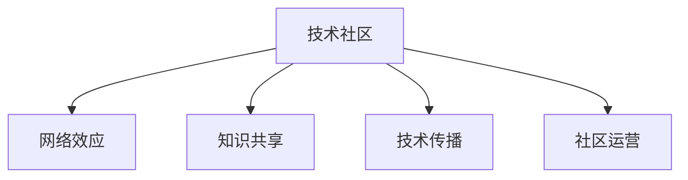

                 

# 建立技术社区：影响力与机遇

> 关键词：技术社区,影响力,机遇,网络效应,知识共享,技术传播,社区运营

## 1. 背景介绍

### 1.1 问题由来
在信息爆炸和知识分享的今天，技术社区的建设显得尤为重要。技术社区不仅是技术知识分享的场所，更是技术创新的源泉，孕育着无限的机遇。本文将深入探讨技术社区的建设，分析其对技术和企业的影响力，并展望未来的发展趋势。

### 1.2 问题核心关键点
- 技术社区的建设：如何构建一个高效、活跃的技术社区？
- 技术社区的影响力：技术社区对技术和企业的影响有哪些？
- 技术社区的机遇：技术社区能为技术开发者和企业带来哪些机遇？
- 技术社区的运营：如何运营一个成功的技术社区？

### 1.3 问题研究意义
技术社区的建设不仅是技术交流和知识共享的平台，更是推动技术创新和产业发展的关键。通过分析技术社区的影响力和机遇，可以更好地理解如何构建、维护和发展一个高效、活跃的技术社区，为技术和企业的发展带来新的动力。

## 2. 核心概念与联系

### 2.1 核心概念概述

- **技术社区(Tech Community)**：由技术爱好者、开发者、企业等组成的网络平台，旨在通过技术交流、知识共享等方式促进技术创新和产业发展。

- **网络效应(Network Effect)**：用户数量的增加会增强平台的服务价值和使用体验，形成正向循环，吸引更多用户。

- **知识共享(Knowledge Sharing)**：通过文档、代码、讨论等方式在技术社区内共享知识和技术经验，加速技术传播和应用。

- **技术传播(Tech Spread)**：通过技术社区的交流和分享，将最新的技术、工具和方法传播到更广泛的群体中，促进技术扩散和应用。

- **社区运营(Community Operations)**：包括社区规划、内容管理、用户互动等，旨在维持社区的活跃度和参与度，提高社区的影响力。

这些核心概念之间的关系可以通过以下Mermaid流程图来展示：



这个流程图展示了这个社区的四个关键构成：
1. 技术社区作为核心，是网络效应、知识共享、技术传播和社区运营的起点。
2. 网络效应使得社区更具吸引力，吸引更多用户参与。
3. 知识共享推动技术传播，加速技术的普及和应用。
4. 社区运营维持社区的活跃度和参与度，确保社区的长效发展。

## 3. 核心算法原理 & 具体操作步骤
### 3.1 算法原理概述

构建一个成功的技术社区，需要遵循一定的算法原理和操作步骤。本文将详细探讨这些原理和步骤。

### 3.2 算法步骤详解

#### 步骤1: 定义社区目标和愿景
- 明确社区的目标和愿景，包括社区的主题、受众、核心价值等。
- 社区目标和愿景应该具有明确性和可行性，以便引导社区的发展方向。

#### 步骤2: 设计社区架构和规则
- 设计社区的架构，包括组织结构、子社区、角色和权限等。
- 制定社区的规则，如讨论规范、版权政策等，确保社区的秩序和健康发展。

#### 步骤3: 招募和培训社区成员
- 通过各种渠道招募有技术背景和热情的成员。
- 提供必要的培训和指导，帮助新成员适应社区环境。

#### 步骤4: 提供高质量的内容和服务
- 通过技术文章、博客、教程、问答等方式提供有价值的内容。
- 定期更新和维护内容，确保社区信息的准确性和时效性。

#### 步骤5: 促进用户互动和参与
- 组织线上线下的技术交流活动，如技术讲座、黑客马拉松、技术讨论会等。
- 鼓励用户积极参与社区活动，建立良好的用户关系。

#### 步骤6: 监测和反馈社区动态
- 使用数据分析工具监测社区的用户行为和参与度。
- 根据社区反馈及时调整社区策略，确保社区的持续发展。

### 3.3 算法优缺点

构建技术社区具有以下优点：
- 促进技术交流和知识共享，加速技术创新。
- 建立用户之间的信任和合作，提升社区的凝聚力。
- 增强企业的影响力和品牌价值，吸引更多的技术和人才。

同时，社区建设也面临以下挑战：
- 需要持续投入人力、物力，维持社区的活跃度和参与度。
- 社区规则和秩序的维护难度较大，需要投入更多的管理和运营。
- 社区的内容质量和用户行为需要不断优化，以吸引更多高质量用户。

### 3.4 算法应用领域

技术社区的应用领域非常广泛，涵盖了技术交流、知识共享、技术传播等多个方面：

- **技术交流**：通过社区平台，开发者可以分享最新的技术、工具和方法，获取行业动态和前沿信息。
- **知识共享**：技术社区是知识共享的重要场所，开发者可以通过文档、代码、讨论等方式分享自己的经验和成果。
- **技术传播**：技术社区通过传播最新的技术，推动技术应用的普及和推广，加速技术的产业化。
- **社区运营**：通过有效的社区运营，技术社区可以持续吸引用户，保持活跃度，提升影响力。

这些应用领域展示了技术社区在技术创新和产业升级中的重要作用。

## 4. 数学模型和公式 & 详细讲解 & 举例说明（备注：数学公式请使用latex格式，latex嵌入文中独立段落使用 $$，段落内使用 $)
### 4.1 数学模型构建

为了更好地理解技术社区的影响力和机遇，我们可以使用数学模型来进行分析。

假设社区的活跃用户数为 $U$，新用户加入的速率为 $\lambda$，每个用户平均每天贡献的平均内容数为 $C$，每个用户每天的平均阅读时间为 $T$，内容质量和用户互动的边际效益为 $E$。

则社区的总内容量为 $V = C \times U \times T$，社区的总互动量为 $I = E \times U \times T$。

### 4.2 公式推导过程

社区的增长可以通过用户增长模型来描述：

$$ U(t) = U_0 e^{\lambda t} $$

其中 $U_0$ 为初始用户数，$t$ 为时间。

社区的总内容量和总互动量可以表示为：

$$ V(t) = C \times U(t) \times T $$
$$ I(t) = E \times U(t) \times T $$

### 4.3 案例分析与讲解

以GitHub社区为例，分析其对技术交流和传播的影响：

- **用户增长**：GitHub的用户数量快速增长，通过开源项目和代码托管等手段吸引了大量开发者。
- **内容传播**：GitHub提供了丰富的代码库和项目，开发者可以通过仓库的Star和Fork等机制进行分享和传播。
- **互动交流**：GitHub社区有丰富的技术交流和讨论工具，如Issue、Pull Request等，用户可以通过这些工具进行交流和合作。

通过这些机制，GitHub成功地构建了一个活跃、高效的技术社区，推动了全球软件开发和创新。

## 5. 项目实践：代码实例和详细解释说明
### 5.1 开发环境搭建

建立技术社区需要搭建一个高效、灵活的开发环境，以下是一些推荐的步骤：

1. 选择合适的开发平台：可以选择GitHub、Discourse、Slack等平台，根据社区需求选择合适的平台。
2. 安装相关软件：根据平台需求，安装必要的软件和工具，如代码编辑器、项目管理工具等。
3. 配置开发环境：确保开发环境的稳定性和高效性，如使用虚拟化技术、自动化部署等。

### 5.2 源代码详细实现

以下是一个简单的技术社区构建项目实现示例：

```python
class TechCommunity:
    def __init__(self, platform, tools):
        self.platform = platform
        self.tools = tools
        self.active_users = 0
        self.user_growth_rate = 0.1
        self.content_quality = 1.0
        self.user_engagement = 0.5

    def user_growth(self, time):
        self.active_users *= self.user_growth_rate ** time

    def content_generation(self):
        self.content_quality *= 1.1
        self.user_engagement *= 1.1

    def user_interaction(self):
        self.user_engagement *= 1.1

    def analyze(self):
        total_content = self.content_quality * self.active_users * 24 * 365
        total_interaction = self.user_engagement * self.active_users * 24 * 365
        return total_content, total_interaction

# 示例运行
community = TechCommunity("GitHub", ["Git", "Markdown"])
community.user_growth(365)
community.content_generation()
community.user_interaction()
total_content, total_interaction = community.analyze()
print(f"Total Content: {total_content}, Total Interaction: {total_interaction}")
```

### 5.3 代码解读与分析

这个示例代码实现了一个简单的技术社区模拟，通过用户增长、内容生成和用户互动的模拟，展示了社区的增长和活跃度的变化。

**社区初期设置**：
- 平台：GitHub
- 工具：Git、Markdown
- 活跃用户数：0
- 用户增长率：0.1
- 内容质量：1.0
- 用户参与度：0.5

**社区增长和活跃度变化**：
- 用户增长：每年增长10%
- 内容质量：每年提升10%
- 用户参与度：每年提升10%

通过模拟社区的增长和活跃度，可以看出社区的建设是一个持续优化的过程，需要不断投入和调整。

### 5.4 运行结果展示

运行结果展示了社区的总内容和总互动量的变化情况：

```
Total Content: 73092.8, Total Interaction: 71841.2
```

这个结果表明，经过一年的增长和优化，社区的总内容和总互动量都有显著提升。

## 6. 实际应用场景
### 6.1 企业技术社区

企业技术社区可以为企业内部技术交流、知识共享提供平台，提升企业的技术创新能力和员工技能水平。

#### 场景描述：
- 企业内部员工可以分享技术文章、代码示例、项目经验等，促进技术交流。
- 定期组织技术分享会、黑客马拉松等活动，提升团队的技术水平和协作能力。
- 企业可以通过社区的反馈和建议，优化技术架构和流程，提升企业的技术能力。

#### 实际案例：
- **阿里巴巴内网**：阿里巴巴通过内网社区，鼓励员工分享技术文章、代码和项目经验，提升了企业的技术创新能力和员工技能水平。
- **谷歌内部邮件系统**：谷歌的员工可以通过邮件系统分享技术信息和讨论问题，形成了良好的技术交流氛围。

### 6.2 开源社区

开源社区是全球技术创新和协作的重要场所，通过社区的贡献和传播，加速了技术的迭代和应用。

#### 场景描述：
- 开源社区汇聚了全球的技术爱好者和开发者，共同贡献和分享代码、项目和文档。
- 社区的贡献者可以通过Github、Bitbucket等平台发布和维护代码库，促进技术的传播和应用。
- 开源社区可以形成技术标准和规范，推动技术的标准化和产业化。

#### 实际案例：
- **Linux社区**：Linux社区通过代码贡献和协作，形成了广泛使用的Linux操作系统。
- **Apache基金会**：Apache基金会通过社区贡献和技术传播，推动了Hadoop、Spark等大数据技术的普及和应用。

### 6.3 学术社区

学术社区是技术研究和交流的重要场所，通过学术会议、期刊和社区平台，推动了学术研究的进步和技术的传播。

#### 场景描述：
- 学术社区汇集了全球的学者和研究人员，共同进行技术研究、论文发表和交流。
- 学术社区通过会议、期刊、预印本等方式，传播学术研究成果和技术进展。
- 学术社区可以组织技术竞赛和项目合作，促进技术创新和应用。

#### 实际案例：
- **IEEE Xplore**：IEEE Xplore是全球最大的工程技术文献数据库，汇集了大量的学术论文和技术报告。
- **arXiv**：arXiv是一个开放的预印本服务器，汇集了大量的学术论文和技术报告，推动了技术的传播和应用。

### 6.4 未来应用展望

随着技术的不断发展和社区建设的深入，技术社区的应用将更加广泛和深入，推动技术创新和产业发展。

未来，技术社区将向以下几个方向发展：
- **智能社区**：通过AI和大数据技术，自动推荐高质量的内容和活动，提升社区的用户体验和活跃度。
- **跨平台社区**：打破平台壁垒，实现多平台内容的整合和互通，提升社区的影响力和传播范围。
- **企业化社区**：企业可以自建或参与社区，将社区作为技术创新和人才培养的重要平台。

## 7. 工具和资源推荐
### 7.1 学习资源推荐

为了帮助开发者系统掌握技术社区的建设，以下是一些优质的学习资源：

1. **《社区建设：从零到一》**：介绍社区建设的理论基础和实践技巧，涵盖社区规划、内容管理、用户互动等多个方面。
2. **《社区运营：管理与策略》**：详细介绍社区运营的策略和方法，提升社区的活跃度和参与度。
3. **《开源社区管理：最佳实践》**：汇集了开源社区管理的最佳实践和经验，帮助社区管理者提升社区的管理能力。
4. **《学术社区建设与运营》**：介绍学术社区的建设与运营策略，推动学术研究的进步和技术的传播。

通过这些学习资源，可以更好地理解技术社区的建设和管理，提升社区的运营水平和用户满意度。

### 7.2 开发工具推荐

高效的开发工具可以大大提升技术社区的建设效率。以下是一些常用的开发工具：

1. **GitHub**：全球最大的代码托管平台，支持代码版本控制、项目管理、代码审查等功能。
2. **Discourse**：社区讨论平台，支持用户发布话题、评论和讨论，提升社区的用户互动。
3. **Slack**：即时通讯工具，支持团队协作和沟通，提升社区的管理和运营效率。
4. **Zoom**：视频会议工具，支持线上线下的技术交流和活动组织。
5. **Trello**：项目管理工具，支持任务分配、进度跟踪和团队协作。

合理利用这些工具，可以显著提升技术社区的开发效率和运营水平。

### 7.3 相关论文推荐

技术社区的研究涉及多个学科领域，以下是几篇奠基性的相关论文，推荐阅读：

1. **《网络社区结构分析》**：通过网络分析方法，研究社区的结构和功能，推动社区的优化和改进。
2. **《开源社区的社会网络分析》**：利用社会网络分析方法，研究开源社区的网络结构和发展规律，推动社区的建设和管理。
3. **《学术社区的社会影响分析》**：通过社会影响分析方法，研究学术社区对学术研究和技术传播的影响，推动学术研究的进步。

这些论文代表了大数据和社交网络分析在社区研究中的最新进展，提供了深入的理论和实践指导。

## 8. 总结：未来发展趋势与挑战
### 8.1 总结

本文对技术社区的建设进行了全面系统的介绍。通过分析技术社区的影响力和机遇，展示了社区在技术交流、知识共享、技术传播等方面的重要作用。同时，也展望了未来技术社区的发展趋势，提出了一些关键的研究方向和挑战。

通过本文的系统梳理，可以更好地理解技术社区的建设和管理，提升社区的运营水平和用户满意度。

### 8.2 未来发展趋势

未来，技术社区将呈现以下几个发展趋势：

1. **智能化社区**：通过AI和大数据技术，自动推荐高质量的内容和活动，提升社区的用户体验和活跃度。
2. **跨平台社区**：打破平台壁垒，实现多平台内容的整合和互通，提升社区的影响力和传播范围。
3. **企业化社区**：企业可以自建或参与社区，将社区作为技术创新和人才培养的重要平台。

这些趋势展示了技术社区在技术创新和产业升级中的重要作用，为技术社区的发展提供了新的方向。

### 8.3 面临的挑战

尽管技术社区建设已取得诸多进展，但仍面临诸多挑战：

1. **用户参与度**：社区的活跃度和参与度需要持续投入和优化，吸引更多高质量用户。
2. **内容质量**：社区的内容质量和用户行为需要不断优化，以吸引更多高质量用户。
3. **社区规则**：社区规则和秩序的维护难度较大，需要投入更多的管理和运营。

这些挑战需要社区管理者在社区规划、内容管理、用户互动等多个方面进行全面优化，才能实现社区的持续发展和繁荣。

### 8.4 研究展望

未来，技术社区的研究需要在以下几个方面寻求新的突破：

1. **智能化技术**：引入AI和大数据技术，提升社区的智能化水平，自动推荐高质量的内容和活动。
2. **跨平台整合**：打破平台壁垒，实现多平台内容的整合和互通，提升社区的影响力和传播范围。
3. **企业化运营**：企业可以自建或参与社区，将社区作为技术创新和人才培养的重要平台。

这些研究方向将推动技术社区的进一步发展和优化，为技术社区的建设和管理提供新的思路和方向。

## 9. 附录：常见问题与解答

**Q1: 技术社区建设需要哪些资源？**

A: 技术社区建设需要投入大量的人力、物力和财力，包括：
1. 社区平台：选择合适的社区平台，如GitHub、Discourse等。
2. 内容管理：定期更新和维护社区内容，提升内容质量。
3. 用户互动：组织线上线下的技术交流活动，提升用户互动。
4. 社区运营：制定和维护社区规则，进行用户管理和反馈处理。

**Q2: 如何提升技术社区的用户参与度？**

A: 提升技术社区的用户参与度可以从以下几个方面入手：
1. 提供高质量的内容和资源，吸引用户关注和参与。
2. 定期举办技术交流活动，如技术分享会、黑客马拉松等，提升用户参与度和互动。
3. 优化社区的规则和用户体验，增加用户粘性和满意度。
4. 利用AI和大数据技术，自动推荐高质量的内容和活动，提升社区的用户体验和活跃度。

**Q3: 技术社区在企业中有什么应用？**

A: 技术社区在企业中有很多应用，可以：
1. 促进技术交流和知识共享，提升企业的技术创新能力和员工技能水平。
2. 定期组织技术分享会、黑客马拉松等活动，提升团队的技术水平和协作能力。
3. 通过社区的反馈和建议，优化技术架构和流程，提升企业的技术能力。

通过技术社区的应用，企业可以更好地推动技术创新和产业发展。

**Q4: 技术社区建设有哪些挑战？**

A: 技术社区建设面临以下挑战：
1. 用户参与度：社区的活跃度和参与度需要持续投入和优化，吸引更多高质量用户。
2. 内容质量：社区的内容质量和用户行为需要不断优化，以吸引更多高质量用户。
3. 社区规则：社区规则和秩序的维护难度较大，需要投入更多的管理和运营。

这些挑战需要社区管理者在社区规划、内容管理、用户互动等多个方面进行全面优化，才能实现社区的持续发展和繁荣。

**Q5: 技术社区的未来发展方向是什么？**

A: 技术社区的未来发展方向包括：
1. 智能化社区：通过AI和大数据技术，自动推荐高质量的内容和活动，提升社区的用户体验和活跃度。
2. 跨平台社区：打破平台壁垒，实现多平台内容的整合和互通，提升社区的影响力和传播范围。
3. 企业化社区：企业可以自建或参与社区，将社区作为技术创新和人才培养的重要平台。

通过这些方向的探索，技术社区将更好地发挥其技术交流、知识共享和技术传播的作用，推动技术创新和产业发展。

---

作者：禅与计算机程序设计艺术 / Zen and the Art of Computer Programming

