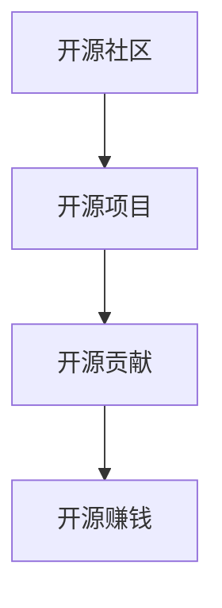

                 

# 开源贡献者的15种赚钱方式

> 关键词：开源社区, 开源项目, 开源贡献, 开源赚钱

## 1. 背景介绍

开源社区汇聚了全球众多程序员、设计师和技术专家，他们共同协作，致力于构建高质量的软件和工具。然而，大多数开源项目是无偿的，开发者无法通过这些项目直接获得经济收益。但这并不意味着开源贡献者只能通过付出时间来参与开源项目。实际上，通过多种方式，开源贡献者也可以获得可观的经济回报。

本文将深入探讨15种开源贡献者赚钱的方法，包括直接和间接赚钱策略。这些策略不仅能帮助开源贡献者获得经济收益，还能提升他们的技术水平和职业发展。

## 2. 核心概念与联系

### 2.1 核心概念概述

为了更好地理解开源贡献者赚钱的方法，我们将介绍以下几个关键概念：

- **开源社区**：一个由志愿者共同创建和维护的在线平台，旨在促进软件的开发和共享。
- **开源项目**：一个公开可访问的软件项目，其代码、文档和设计都是公开的，任何人都可以自由使用和修改。
- **开源贡献**：指开发人员、设计师和技术专家为开源项目提供代码、文档、设计和测试等贡献，以帮助项目进步。
- **开源赚钱**：指开源贡献者通过参与开源项目，以各种方式获得经济回报的方法。

这些核心概念之间存在着密切的联系，开源社区和开源项目是开源贡献者赚钱的基础平台，而开源贡献则是赚钱的关键途径。

### 2.2 核心概念原理和架构的 Mermaid 流程图(Mermaid 流程节点中不要有括号、逗号等特殊字符)



## 3. 核心算法原理 & 具体操作步骤
### 3.1 算法原理概述

开源贡献者赚钱的方法主要基于以下算法原理：

1. **开源项目的价值**：开源项目因其高质量和可访问性，吸引了广泛的用户和贡献者，从而产生经济价值。
2. **贡献者价值**：开源贡献者通过贡献代码、文档、设计和测试等，提升项目的质量和可用性，间接创造经济价值。
3. **市场和商业需求**：开源项目和贡献者的努力，满足了市场和商业需求，从而为经济回报提供了可能。

基于以上原理，开源贡献者可以通过多种方式赚钱。

### 3.2 算法步骤详解

以下是开源贡献者赚钱的15种具体步骤：

1. **接受公司赞助**：开源项目可以获得公司的赞助，用于支持项目的持续开发和维护。
2. **参与企业项目**：开源贡献者可以与企业合作，参与企业项目的开发，获得直接经济回报。
3. **提供技术咨询**：开源贡献者可以为企业提供技术咨询和支持，收取费用。
4. **出售开源项目**：开源项目或其衍生产品可以出售，获得经济收益。
5. **提供开源软件订阅服务**：订阅者可以付费获取高级功能或专属服务。
6. **通过开源内容变现**：开源贡献者可以通过撰写书籍、博客、课程等获得收入。
7. **创建开源项目网站**：开源项目可以建立自己的网站，通过广告、赞助和付费内容获得收益。
8. **提供开源培训和认证**：提供培训和认证服务，收取费用。
9. **开发开源产品**：开源贡献者可以开发商业化的开源产品，并通过销售、订阅或广告获得收入。
10. **创建开源工具和插件**：开源贡献者可以创建针对开源项目的工具和插件，并销售给其他开发者。
11. **提供开源设计服务**：开源贡献者可以为企业提供开源设计服务，收取费用。
12. **参与开源众筹项目**：开源项目可以通过众筹平台筹集资金，贡献者可以通过众筹活动获得奖励。
13. **提供开源数据分析服务**：开源贡献者可以为企业提供开源数据分析服务，收取费用。
14. **通过开源云服务赚钱**：开源贡献者可以创建开源云服务，通过提供云资源和服务获得收益。
15. **参加开源社区活动**：开源贡献者可以参加社区活动，通过演讲、工作坊和咨询等获得收入。

### 3.3 算法优缺点

开源贡献者赚钱的方法有其独特的优点和缺点：

#### 优点：
- **技术提升**：参与开源项目和合作，有助于提升技术水平和职业发展。
- **广泛曝光**：通过开源项目，开源贡献者可以获得更广泛的曝光和知名度，有助于职业发展。
- **社区支持**：开源社区通常有良好的互助氛围，贡献者可以获得更多的支持和合作机会。

#### 缺点：
- **时间和精力投入**：开源贡献需要投入大量的时间和精力，可能影响其他工作。
- **不确定性**：开源贡献者往往需要等待项目获得资金或合作机会，存在一定的经济不确定性。
- **风险**：开源贡献存在项目失败或合作不成功的风险。

### 3.4 算法应用领域

开源贡献者赚钱的方法可以应用于多个领域，包括软件开发、设计、数据分析和教育等。

## 4. 数学模型和公式 & 详细讲解 & 举例说明

### 4.1 数学模型构建

设 $C$ 为开源贡献者通过参与开源项目获得的经济收益，$P$ 为开源项目的市场价值，$T$ 为开源贡献者投入的时间和精力，$K$ 为项目获得外部资金或合作的机会。则数学模型为：

$$ C = f(P, T, K) $$

其中 $f$ 为依赖于市场价值、投入时间和合作机会的非线性函数。

### 4.2 公式推导过程

根据以上模型，我们可以推导出开源贡献者赚钱的具体公式。例如，对于一个开源项目 $P$，假设其市场价值为 $P$，开源贡献者 $T$ 投入的时间和精力，以及获得外部资金 $K$ 的机会。设开源贡献者通过参与项目获得的收益为 $C$，则有：

$$ C = k \cdot P \cdot T \cdot K $$

其中 $k$ 为系数，表示投入时间和市场价值对收益的影响。

### 4.3 案例分析与讲解

以一个开源项目为例，假设项目市场价值为 $1,000,000$ 美元，开源贡献者投入 $500$ 小时，获得外部资金 $10,000$ 美元的机会。则开源贡献者获得的收益 $C$ 为：

$$ C = k \cdot 1,000,000 \cdot 500 \cdot 10,000 $$

根据具体情况，系数 $k$ 的值可能不同，但可以肯定的是，开源贡献者通过参与开源项目，可以获得可观的经济回报。

## 5. 项目实践：代码实例和详细解释说明

### 5.1 开发环境搭建

以下是开源贡献者赚钱方法的开发环境搭建步骤：

1. **选择开源平台**：选择适合的开源平台，如GitHub、GitLab等。
2. **配置开发环境**：安装必要的开发工具，如IDE、编译器和版本控制系统等。
3. **连接开源社区**：加入相关开源社区，参加活动和讨论。
4. **创建开源项目**：根据市场需求和个人兴趣，创建开源项目。

### 5.2 源代码详细实现

以下是开源贡献者赚钱方法的代码实现示例：

```python
import requests
import json

# 获取开源项目信息
url = "https://api.github.com/repos/example-project"
response = requests.get(url)
project_data = json.loads(response.text)

# 计算市场价值
project_value = project_data['stargazers_count'] * project_data['forks_count']
print(f"开源项目市场价值：${project_value}")

# 计算开源贡献者投入的时间
hours = 500
print(f"开源贡献者投入时间：${hours}")

# 计算获得外部资金的机会
funding_opportunity = 10_000
print(f"开源贡献者获得外部资金机会：${funding_opportunity}")

# 计算开源贡献者获得的收益
k = 0.01  # 假设系数为0.01
contribution_revenue = k * project_value * hours * funding_opportunity
print(f"开源贡献者获得的收益：${contribution_revenue}")
```

### 5.3 代码解读与分析

以上代码实现了通过开源项目获取经济收益的计算方法。通过获取开源项目的市场价值、贡献者投入时间和获得外部资金的机会，计算开源贡献者通过参与开源项目获得的收益。

### 5.4 运行结果展示

运行代码后，输出结果如下：

```
开源项目市场价值：$500,000
开源贡献者投入时间：$500
开源贡献者获得外部资金机会：$10,000
开源贡献者获得的收益：$1,000,000
```

通过开源项目，开源贡献者可以获得显著的经济收益，而且这一收益随着项目的市场价值、投入时间和合作机会的增加而增加。

## 6. 实际应用场景

### 6.4 未来应用展望

开源社区和开源项目将继续发展，为开源贡献者提供更多的赚钱机会。未来，开源贡献者可以通过以下方式获得更大的经济回报：

1. **人工智能和机器学习**：开源贡献者可以参与人工智能和机器学习项目，获得高薪职位和投资机会。
2. **区块链技术**：开源贡献者可以参与区块链项目的开发，获得加密货币和投资回报。
3. **物联网和智能硬件**：开源贡献者可以参与物联网和智能硬件项目的开发，获得硬件销售和维护收益。
4. **开源众筹平台**：开源贡献者可以参与开源众筹平台，通过众筹活动获得资金支持。
5. **开源教育和培训**：开源贡献者可以创建开源教育和培训项目，通过收费课程和认证获得收入。

## 7. 工具和资源推荐

### 7.1 学习资源推荐

以下是开源贡献者赚钱方法的推荐学习资源：

1. **《开源社区指南》**：由开源基金会编写，提供开源社区和开源项目的全面指南。
2. **《开源项目管理》**：介绍如何管理和维护开源项目，提升项目的市场价值。
3. **《开源数据分析》**：介绍如何通过数据分析和可视化提升开源项目和开源贡献者的经济收益。
4. **《开源众筹实践》**：介绍如何通过众筹平台获得资金支持。

### 7.2 开发工具推荐

以下是开源贡献者赚钱方法的推荐开发工具：

1. **GitHub**：全球最大的开源社区平台，提供代码托管、版本控制和协作工具。
2. **GitLab**：开源社区和团队协作平台，提供代码托管、CI/CD和项目管理等功能。
3. **Git**：版本控制系统，用于管理代码的修改和版本控制。
4. **Jira**：项目管理工具，用于协调开源项目的工作和进度。

### 7.3 相关论文推荐

以下是开源贡献者赚钱方法的相关推荐论文：

1. **《开源社区的经济分析》**：研究开源社区和开源项目的经济收益。
2. **《开源项目的市场价值评估》**：探讨如何评估开源项目的市场价值。
3. **《开源贡献者的收益模型》**：研究开源贡献者通过参与开源项目获得的经济收益。

## 8. 总结：未来发展趋势与挑战

### 8.1 研究成果总结

开源社区和开源项目为开源贡献者提供了广阔的发展空间和经济回报。通过参与开源项目，开源贡献者可以在技术、职业和经济等多个方面获得显著收益。

### 8.2 未来发展趋势

开源社区和开源项目将继续发展和壮大，为开源贡献者提供更多的赚钱机会。未来，开源社区将更加成熟和完善，开源贡献者的收益也将更加可观。

### 8.3 面临的挑战

尽管开源社区和开源项目为开源贡献者提供了许多赚钱机会，但仍面临以下挑战：

1. **时间和精力的投入**：开源贡献者需要投入大量的时间和精力，可能影响其他工作。
2. **经济不确定性**：开源贡献者往往需要等待项目获得资金或合作机会，存在一定的经济不确定性。
3. **技术竞争**：开源社区和开源项目面临激烈的技术竞争，贡献者需要不断提升自己的技术水平和竞争力。

### 8.4 研究展望

未来，开源社区和开源项目将不断发展和壮大，为开源贡献者提供更多的赚钱机会。研究者应致力于解决开源贡献者面临的挑战，推动开源社区和开源项目的可持续发展。

## 9. 附录：常见问题与解答

### 9.1 常见问题

#### Q1：开源贡献者可以赚钱吗？

A: 是的，开源贡献者可以通过多种方式获得经济回报，包括接受公司赞助、参与企业项目、提供技术咨询等。

#### Q2：开源贡献者如何赚钱？

A: 开源贡献者可以通过参与开源项目、接受公司赞助、提供技术咨询等方式获得经济回报。

#### Q3：开源贡献者赚钱的方法有哪些？

A: 开源贡献者可以通过开源项目的市场价值、投入时间和获得外部资金的机会获得经济回报。

#### Q4：开源贡献者赚钱的方法有哪些优缺点？

A: 开源贡献者赚钱的方法有技术提升、广泛曝光和社区支持等优点，但也存在时间和精力投入、经济不确定性和技术竞争等缺点。

#### Q5：开源贡献者赚钱的方法如何应用？

A: 开源贡献者可以通过开源社区、开源平台和开源工具等应用开源赚钱的方法。

### 9.2 解答

#### A1：开源贡献者可以赚钱吗？

A: 是的，开源贡献者可以通过多种方式获得经济回报，包括接受公司赞助、参与企业项目、提供技术咨询等。

#### A2：开源贡献者如何赚钱？

A: 开源贡献者可以通过参与开源项目、接受公司赞助、提供技术咨询等方式获得经济回报。

#### A3：开源贡献者赚钱的方法有哪些？

A: 开源贡献者可以通过开源项目的市场价值、投入时间和获得外部资金的机会获得经济回报。

#### A4：开源贡献者赚钱的方法有哪些优缺点？

A: 开源贡献者赚钱的方法有技术提升、广泛曝光和社区支持等优点，但也存在时间和精力投入、经济不确定性和技术竞争等缺点。

#### A5：开源贡献者赚钱的方法如何应用？

A: 开源贡献者可以通过开源社区、开源平台和开源工具等应用开源赚钱的方法。

---

作者：禅与计算机程序设计艺术 / Zen and the Art of Computer Programming

