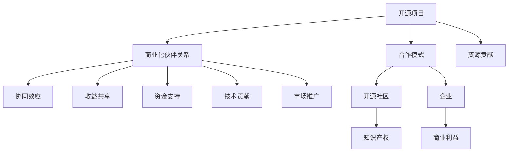

                 

# 开源项目的商业化伙伴关系：协同效应与收益共享

> 关键词：开源项目,商业化伙伴关系,协同效应,收益共享,开源生态,合作模式

## 1. 背景介绍

随着开源社区的兴起，越来越多的开发者通过共享源代码、工具和知识，推动了技术的进步和产业的创新。然而，开源项目的持续发展依赖于资金、资源和人力，单一机构或组织难以承担。因此，商业化伙伴关系应运而生，通过与企业合作，促进开源项目的发展和商业化应用。

### 1.1 问题由来

开源项目和商业化伙伴关系看似矛盾，实则互补。商业化伙伴关系不仅能获得资金和资源支持，还能促进开源项目的技术创新和市场应用。然而，在实践中，如何实现双方利益的平衡，确保开放协作的同时实现商业收益，成为一大挑战。

### 1.2 问题核心关键点

商业化伙伴关系的核心在于协同效应和收益共享，即如何通过多方合作，实现技术的协同创新和商业价值的最大化。这种伙伴关系需要考虑以下几个关键点：

1. **知识产权管理**：如何在保证开源自由的同时，保护商业化过程中的知识产权。
2. **商业化激励**：如何设计合理的激励机制，吸引企业参与，同时保障开源社区的利益。
3. **协同机制设计**：如何在开放协作中，保持技术方向和社区规则的一致性，避免商业化引入的冲突。
4. **收益分配**：如何合理分配商业化收益，平衡各方利益，促进项目的持续发展。

这些问题需要开放社区和商业伙伴共同解决，以实现共赢。

## 2. 核心概念与联系

### 2.1 核心概念概述

为更好地理解开源项目的商业化伙伴关系，本节将介绍几个密切相关的核心概念：

- **开源项目**：指在公开源代码和许可证的条件下，共享和协作开发的软件项目。开源项目促进了技术的共享和创新，推动了技术的普及和应用。

- **商业化伙伴关系**：指开源项目与企业之间的合作关系，旨在通过商业化应用，实现开源项目的可持续发展和企业的商业收益。

- **协同效应**：指多个合作伙伴在共同目标下，通过资源整合和优势互补，实现比独立合作更大的创新和效率提升。

- **收益共享**：指商业化过程中，开源项目和企业按照约定比例，分享商业收益，实现利益平衡。

这些概念之间的逻辑关系可以通过以下Mermaid流程图来展示：



这个流程图展示了几项关键概念及其之间的关系：

1. 开源项目通过与企业合作，获取资源和资金支持。
2. 商业化伙伴关系中，双方通过资源整合和优势互补，实现协同效应。
3. 收益共享机制，保障各方利益，促进项目的持续发展。
4. 合作模式多样，可以是贡献源代码、提供资金支持、进行技术合作等。

## 3. 核心算法原理 & 具体操作步骤

### 3.1 算法原理概述

商业化伙伴关系的核心在于协同效应和收益共享。其核心思想是：通过开源项目和企业的协同合作，利用各自的优势资源，共同推动技术创新和市场应用，最终实现商业收益的合理分配。

具体来说，商业化伙伴关系可以分为以下几个步骤：

1. **资源整合**：开源项目整合企业的资金、技术、市场等资源，提升项目的技术实力和市场竞争力。
2. **优势互补**：企业通过提供资金和技术支持，获得开源项目的社区认证和品牌背书，同时使用开源技术进行产品开发和市场推广。
3. **协同创新**：双方在开放协作的基础上，共同进行技术研发和市场拓展，实现技术的协同创新。
4. **收益分配**：根据合作协议，双方按照约定比例分享商业化收益，平衡利益关系。

### 3.2 算法步骤详解

基于上述核心思想，商业化伙伴关系的具体操作步骤如下：

**Step 1: 构建合作框架**
- 双方进行初步沟通，明确合作目标、任务和利益分配机制。
- 签订合作协议，明确各方的权利和义务。

**Step 2: 资源整合与调配**
- 开源项目整合企业的资金、技术、市场等资源。
- 企业提供资金支持，参与开源项目的技术开发和市场推广。

**Step 3: 协同创新与技术开发**
- 双方在共同目标下，进行技术研发和市场拓展。
- 通过定期的沟通和协作，解决技术难题，推进项目进展。

**Step 4: 市场推广与收益分配**
- 开源项目和企业在市场推广方面进行合作，提升项目知名度和市场占有率。
- 根据合作协议，按照约定比例分配商业化收益，平衡各方利益。

### 3.3 算法优缺点

商业化伙伴关系具有以下优点：
1. 资金和技术支持：企业通过参与开源项目，可以获得技术支持和品牌背书。
2. 快速技术创新：开源社区和企业共同开发，可以加速技术创新，提升项目竞争力。
3. 市场推广：开源项目和企业在市场推广方面合作，可以提升项目知名度和市场占有率。
4. 利益平衡：双方按照约定比例分配商业化收益，保障了各方的利益。

同时，这种伙伴关系也存在一定的局限性：
1. 管理复杂：合作涉及多方利益，管理复杂，容易产生利益冲突。
2. 协调成本高：双方在技术、市场、文化等方面的差异，导致协调成本高。
3. 开源自由受限：商业化过程中，开源项目需要接受企业的约束，可能影响项目的开放性。
4. 知识产权问题：如何保护知识产权，防止商业化过程中的侵权行为，是重要问题。

尽管存在这些局限性，但就目前而言，商业化伙伴关系仍是开源项目与企业合作的重要方式。未来相关研究的重点在于如何进一步降低管理复杂度和协调成本，保护知识产权，实现双赢。

### 3.4 算法应用领域

商业化伙伴关系在多个领域都有广泛应用，例如：

- **软件开发**：企业通过参与开源项目，获取技术支持，进行产品开发和市场推广。
- **云服务**：云服务提供商与开源社区合作，共同开发云平台，提升云服务竞争力。
- **硬件设备**：硬件厂商与开源社区合作，共同开发设备驱动程序和系统软件，提升硬件设备的开放性和兼容性。
- **网络安全**：安全公司与开源社区合作，共同开发安全工具和解决方案，提升网络安全水平。
- **人工智能**：AI公司和开源项目合作，共同开发智能算法和应用，推动AI技术的发展和应用。

这些领域展示了商业化伙伴关系的多样性和广泛性，为企业和开源社区提供了丰富的合作机会。

## 4. 数学模型和公式 & 详细讲解 & 举例说明

### 4.1 数学模型构建

假设开源项目和企业的合作收益为 $R$，开源项目获得的收益为 $R_S$，企业获得的收益为 $R_E$。双方按照约定比例 $\alpha$ 和 $\beta$ 分配收益，其中 $\alpha + \beta = 1$。则收益分配模型为：

$$
R_S = \alpha R \\
R_E = \beta R
$$

双方通过谈判确定 $\alpha$ 和 $\beta$ 的值，以实现利益平衡。

### 4.2 公式推导过程

根据上述模型，可以推导出双方的收益关系：

$$
R_S = \alpha R = \alpha (\alpha R + \beta R) \\
R_E = \beta R = \beta (\alpha R + \beta R)
$$

整理后得到：

$$
R_S = \alpha^2 R + \alpha \beta R \\
R_E = \beta^2 R + \alpha \beta R
$$

这个公式展示了双方收益的分配比例和关系。通过合理设计 $\alpha$ 和 $\beta$ 的值，可以实现双方利益的最大化。

### 4.3 案例分析与讲解

**案例一：Apache Hadoop与Cloudera合作**
Apache Hadoop是一个开源的分布式计算框架，而Cloudera是一家大数据解决方案提供商。双方通过合作，Cloudera提供资金和技术支持，参与Hadoop的开发和推广，同时使用Hadoop技术进行产品开发和市场推广。双方按照约定的比例分配商业化收益，实现了共赢。

**案例二：Linux基金会与Red Hat合作**
Linux基金会是一个开源软件社区，而Red Hat是一家开源软件公司。双方通过合作，Red Hat提供资金和市场支持，参与Linux的开源项目开发，同时使用Linux技术进行产品开发和市场推广。双方按照约定的比例分配商业化收益，实现了利益平衡。

这些案例展示了商业化伙伴关系的成功实践，通过合理的收益分配，实现了开源项目和企业双赢。

## 5. 项目实践：代码实例和详细解释说明

### 5.1 开发环境搭建

在进行商业化伙伴关系实践前，我们需要准备好开发环境。以下是使用Python进行PyTorch开发的环境配置流程：

1. 安装Anaconda：从官网下载并安装Anaconda，用于创建独立的Python环境。

2. 创建并激活虚拟环境：
```bash
conda create -n pytorch-env python=3.8 
conda activate pytorch-env
```

3. 安装PyTorch：根据CUDA版本，从官网获取对应的安装命令。例如：
```bash
conda install pytorch torchvision torchaudio cudatoolkit=11.1 -c pytorch -c conda-forge
```

4. 安装Transformers库：
```bash
pip install transformers
```

5. 安装各类工具包：
```bash
pip install numpy pandas scikit-learn matplotlib tqdm jupyter notebook ipython
```

完成上述步骤后，即可在`pytorch-env`环境中开始商业化伙伴关系的开发实践。

### 5.2 源代码详细实现

这里我们以Linux基金会与Red Hat合作的案例为例，给出使用Transformers库进行开源项目和商业化伙伴关系开发的PyTorch代码实现。

首先，定义开源项目和企业的收益分配函数：

```python
from sympy import symbols, Eq, solve

def calculate_revenue(R, alpha, beta):
    RS = alpha * R
    RE = beta * R
    return RS, RE
```

接着，定义企业的利润最大化问题：

```python
def maximize_profit(RS, RE, alpha, beta):
    x = symbols('x')
    # 构建利润最大化方程
    equation = Eq(RS - RE * alpha / beta, x)
    # 求解x
    solution = solve(equation, x)
    return solution[0]
```

然后，计算各方收益并输出：

```python
# 假设开源项目和企业的收益为R
R = 1000000

# 双方按照70%和30%的比例分配收益
alpha = 0.7
beta = 0.3

# 计算各方收益
RS, RE = calculate_revenue(R, alpha, beta)
print(f"开源项目收益: {RS} 元")
print(f"企业收益: {RE} 元")

# 计算企业利润最大化时的值
x_optimal = maximize_profit(RS, RE, alpha, beta)
print(f"企业利润最大化时, 开源项目收益为: {RS - x_optimal}")
```

最后，运行上述代码，得到各方收益和企业的利润最大化策略。

### 5.3 代码解读与分析

让我们再详细解读一下关键代码的实现细节：

**calculate_revenue函数**：
- 定义计算各方收益的函数，根据协议比例计算开源项目和企业获得的收益。

**maximize_profit函数**：
- 定义企业的利润最大化问题，求解企业利润最大化时的开源项目收益。

**主程序**：
- 假设开源项目和企业收益为100万，双方按照70%和30%的比例分配收益。
- 计算各方收益并输出。
- 求解企业利润最大化时，开源项目收益为多少。

可以看到，通过使用Sympy库进行数学建模和求解，我们可以方便地计算商业化伙伴关系中的收益分配和利润最大化策略。在实际应用中，还可以根据具体情况调整协议比例，以实现更好的利益平衡。

## 6. 实际应用场景

### 6.1 软件开发

在软件开发领域，商业化伙伴关系具有广泛应用。企业通过参与开源项目，获得技术支持，提升产品开发效率和市场竞争力。例如，Red Hat与Linux基金会合作，推动了Kubernetes等开源技术的商业化应用。

### 6.2 云服务

云服务提供商与开源社区合作，共同开发云平台，提升云服务竞争力。例如，Amazon Web Services与Apache Software Foundation合作，共同推动AWS的云服务基础设施发展。

### 6.3 硬件设备

硬件厂商与开源社区合作，共同开发设备驱动程序和系统软件，提升硬件设备的开放性和兼容性。例如，Google与Linux基金会合作，推动了Linux内核在Android系统中的应用。

### 6.4 网络安全

安全公司与开源社区合作，共同开发安全工具和解决方案，提升网络安全水平。例如，OpenSSL与Mozilla合作，推动了TLS协议的开放化和标准化。

### 6.5 人工智能

AI公司和开源项目合作，共同开发智能算法和应用，推动AI技术的发展和应用。例如，OpenAI与Linux基金会合作，推动了GPT-3等AI技术的商业化应用。

这些领域展示了商业化伙伴关系的多样性和广泛性，为企业和开源社区提供了丰富的合作机会。

## 7. 工具和资源推荐

### 7.1 学习资源推荐

为了帮助开发者系统掌握商业化伙伴关系和收益共享的理论基础和实践技巧，这里推荐一些优质的学习资源：

1. **《开源项目的商业化伙伴关系》系列博文**：由商业化专家撰写，深入浅出地介绍了商业化伙伴关系的原理和实践，帮助理解各方利益和协同效应。

2. **《商业化伙伴关系》课程**：Coursera等在线平台开设的商业化伙伴关系课程，涵盖商业化伙伴关系的设计、实施和评估。

3. **《开源社区与商业化伙伴关系》书籍**：介绍开源社区和商业化伙伴关系的发展历程、成功案例和未来趋势，帮助理解双方利益平衡和协同效应。

4. **GitHub开源项目**：GitHub提供了大量的开源项目和商业化伙伴关系案例，帮助学习开源社区和企业的合作模式和收益分配策略。

5. **OpenSource.org**：OpenSource.org是一个开源社区的信息平台，提供了丰富的开源项目和商业化伙伴关系资源，帮助理解开源项目和企业的合作模式。

通过对这些资源的学习实践，相信你一定能够快速掌握商业化伙伴关系的精髓，并用于解决实际的商业问题。

### 7.2 开发工具推荐

高效的开发离不开优秀的工具支持。以下是几款用于商业化伙伴关系开发的常用工具：

1. **Jira**：项目管理工具，可以帮助团队协作，跟踪项目进展，协调各方利益。

2. **Confluence**：协作平台，可以帮助团队共享文档、记录会议纪要、管理知识库。

3. **GitHub**：代码托管平台，可以帮助团队协作开发，管理代码仓库。

4. **Slack**：即时通讯工具，可以帮助团队实时沟通，协调项目进展。

5. **Zoom**：视频会议工具，可以帮助团队远程协作，进行项目评审和沟通。

6. **Trello**：项目管理工具，可以帮助团队可视化任务进度，协调项目资源。

合理利用这些工具，可以显著提升商业化伙伴关系任务的开发效率，加快创新迭代的步伐。

### 7.3 相关论文推荐

商业化伙伴关系和收益共享技术的发展源于学界的持续研究。以下是几篇奠基性的相关论文，推荐阅读：

1. **《商业化伙伴关系：合作机制和案例分析》**：通过案例分析，探讨商业化伙伴关系的合作机制和成功因素。

2. **《开源项目与商业化伙伴关系的管理》**：介绍开源项目和商业化伙伴关系的管理机制和实践，帮助理解各方利益和协同效应。

3. **《开源项目的商业化模式》**：研究开源项目的商业化模式，探讨如何通过商业化伙伴关系促进开源项目的发展和商业化应用。

4. **《收益共享机制设计》**：研究收益共享机制的设计和实施，探讨如何通过合理的收益分配，实现各方利益的平衡。

这些论文代表了大规模开源项目和商业化伙伴关系的最新研究动态，通过学习这些前沿成果，可以帮助研究者把握学科前进方向，激发更多的创新灵感。

## 8. 总结：未来发展趋势与挑战

### 8.1 总结

本文对开源项目的商业化伙伴关系进行了全面系统的介绍。首先阐述了商业化伙伴关系的背景和意义，明确了协同效应和收益共享在合作中的重要性。其次，从原理到实践，详细讲解了商业化伙伴关系的数学模型和操作步骤，给出了具体的代码实例和分析。同时，本文还广泛探讨了商业化伙伴关系在多个行业领域的应用前景，展示了其广泛的应用价值。此外，本文精选了商业化伙伴关系的各类学习资源，力求为读者提供全方位的技术指引。

通过本文的系统梳理，可以看到，商业化伙伴关系在开源项目与企业合作中具有重要意义。这种伙伴关系不仅能够促进开源项目的可持续发展，还能为企业带来商业收益，实现双赢。未来，伴随技术的不断进步和市场的逐步成熟，商业化伙伴关系将为开源项目和企业的合作提供更多机会和动力。

### 8.2 未来发展趋势

展望未来，商业化伙伴关系将呈现以下几个发展趋势：

1. **生态系统建设**：开源社区和企业将共同构建更加开放、协作的生态系统，实现资源共享和优势互补。

2. **多样化合作模式**：商业化伙伴关系将更加多样化，涵盖资金支持、技术合作、市场推广等多种形式，提升项目的综合竞争力。

3. **可持续发展**：开源项目和企业将更加注重项目的可持续发展，通过合理的收益分配，保障各方的利益，促进项目的长期发展。

4. **透明度提升**：开源社区和企业将提高合作过程的透明度，建立更加公开、公正的合作机制，增强信任和合作效果。

5. **全球化合作**：开源项目和企业将进一步拓展全球合作，提升项目的国际竞争力，推动技术在全球范围内的普及和应用。

以上趋势凸显了商业化伙伴关系的发展方向，将进一步推动开源项目和企业共同进步，实现双赢。

### 8.3 面临的挑战

尽管商业化伙伴关系在开源项目和企业的合作中取得了一定的成功，但在迈向更加智能化、普适化应用的过程中，仍面临诸多挑战：

1. **利益平衡**：如何在保证开放协作的同时，实现商业化过程中的利益平衡，避免利益冲突。

2. **资源整合**：开源项目和企业如何有效整合各自资源，提升项目的技术实力和市场竞争力。

3. **文化差异**：开源社区和企业在文化、管理等方面的差异，可能导致合作中的沟通和协调困难。

4. **知识产权问题**：如何保护知识产权，防止商业化过程中的侵权行为，是重要问题。

5. **技术协同**：如何在开放协作的基础上，保持技术方向和社区规则的一致性，避免商业化引入的冲突。

6. **市场推广**：开源项目和企业如何在市场推广方面进行合作，提升项目知名度和市场占有率。

这些挑战需要在实践中不断探索和解决，以确保商业化伙伴关系的顺利实施和持续发展。

### 8.4 研究展望

面对商业化伙伴关系所面临的挑战，未来的研究需要在以下几个方面寻求新的突破：

1. **利益平衡机制设计**：研究合理的利益平衡机制，平衡开源社区和企业之间的利益，促进合作关系的稳定和持续。

2. **资源整合优化**：研究有效的资源整合策略，提升开源项目和企业的合作效率和项目竞争力。

3. **文化融合策略**：研究如何克服文化差异，增强开源社区和企业的合作效果，促进文化的融合。

4. **知识产权保护**：研究知识产权保护策略，防止商业化过程中的侵权行为，保障各方的利益。

5. **技术协同机制**：研究技术协同机制，确保开源项目和企业之间的技术方向和社区规则一致，避免商业化引入的冲突。

6. **市场推广模式**：研究市场推广模式，提升开源项目和企业的合作效果，促进项目的商业化应用。

这些研究方向将推动商业化伙伴关系向更加成熟、稳定、高效的方向发展，为开源项目和企业带来更大的价值。

## 9. 附录：常见问题与解答

**Q1：商业化伙伴关系是否适用于所有开源项目？**

A: 商业化伙伴关系通常适用于技术成熟、市场前景广阔的开源项目。对于部分学术性较强、市场应用有限的开源项目，可能需要结合具体需求，进行差异化的商业化探索。

**Q2：如何设计合理的收益分配机制？**

A: 设计合理的收益分配机制需要考虑各方利益，通过协商和谈判确定比例。一般建议按照贡献度、市场潜力、合作形式等维度进行分配，确保各方利益的平衡。

**Q3：商业化伙伴关系中需要注意哪些关键问题？**

A: 商业化伙伴关系中需要注意以下关键问题：
1. 利益平衡：确保开源社区和企业之间的利益平衡，避免利益冲突。
2. 资源整合：提升开源项目和企业的合作效率和项目竞争力。
3. 文化差异：克服文化差异，增强开源社区和企业的合作效果。
4. 知识产权保护：防止商业化过程中的侵权行为，保障各方的利益。
5. 技术协同：确保开源项目和企业之间的技术方向和社区规则一致，避免商业化引入的冲突。
6. 市场推广：提升开源项目和企业的合作效果，促进项目的商业化应用。

这些关键问题需要在实践中不断探索和解决，以确保商业化伙伴关系的顺利实施和持续发展。

**Q4：商业化伙伴关系在实际应用中需要注意哪些问题？**

A: 商业化伙伴关系在实际应用中需要注意以下问题：
1. 项目管理：通过项目管理工具，跟踪项目进展，协调各方利益。
2. 协作平台：通过协作平台，共享文档、记录会议纪要、管理知识库。
3. 代码托管：通过代码托管平台，协作开发，管理代码仓库。
4. 实时沟通：通过即时通讯工具，实时沟通，协调项目进展。
5. 视频会议：通过视频会议工具，远程协作，进行项目评审和沟通。
6. 项目管理：通过项目管理工具，可视化任务进度，协调项目资源。

合理利用这些工具，可以显著提升商业化伙伴关系任务的开发效率，加快创新迭代的步伐。

---

作者：禅与计算机程序设计艺术 / Zen and the Art of Computer Programming

