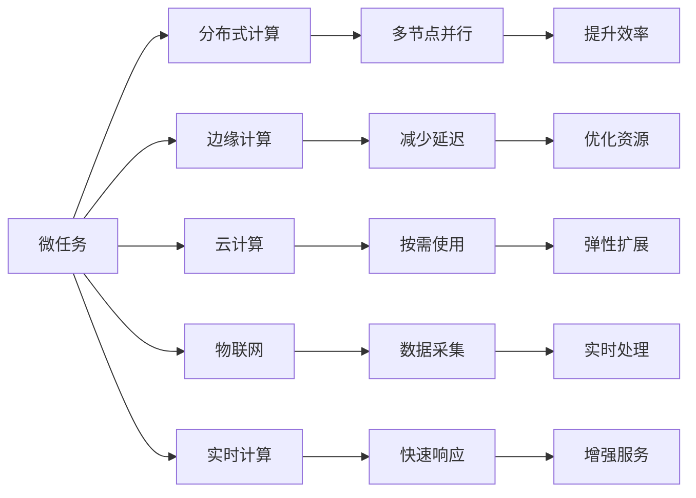

                 

# 微任务，大贡献：人类计算的价值彰显

## 1. 背景介绍

在人类社会不断发展和演进的过程中，计算能力逐渐成为推动科技进步和社会创新的核心力量。从早期的简单计算，到现代的复杂算法和人工智能，计算能力的不停提升让我们的生活变得更加便捷和高效。然而，随着计算需求的不断增长，传统的中心化计算模式已经无法满足人们对计算资源的渴求。在这样的背景下，“微任务”作为一种全新的计算范式应运而生，它不仅为我们提供了一种更为灵活、高效、低成本的计算方式，更是彰显了人类计算能力的巨大潜力和价值。

### 1.1 微任务的概念与兴起

微任务（Microtask）是指那些能够在极短时间内完成的小型计算任务，这些任务通常仅需几毫秒到几秒钟的处理时间，但可能包含大量数据。微任务的兴起与互联网技术的发展密不可分，特别是随着云计算和分布式计算技术的发展，以及移动设备、物联网设备的普及，使得微任务的获取和执行变得更加容易。

微任务的出现，打破了传统中心化计算模式的束缚，让计算资源得以更灵活、高效地利用。它不仅为开发者和科研人员提供了一种更为便捷的计算方式，也为我们揭示了计算能力的巨大潜力和未来发展的方向。

### 1.2 微任务的应用场景

微任务的广泛应用场景包括但不限于以下几个方面：

1. **人工智能训练**：微任务在深度学习模型训练过程中有着广泛应用，通过分布式微任务训练可以大大加速模型训练速度，降低成本。
2. **物联网设备计算**：物联网设备的微任务计算能够提升设备响应速度，优化资源利用，降低功耗。
3. **边缘计算**：在边缘计算中，微任务处理可以实时响应用户需求，降低网络延迟，提高服务质量。
4. **云计算**：云计算平台上的微任务计算可以优化资源分配，提高云服务响应速度。
5. **实时数据处理**：在实时数据处理中，微任务能够快速响应数据流，进行实时分析和决策。

## 2. 核心概念与联系

### 2.1 核心概念概述

要理解微任务的价值，首先需要了解一些核心概念：

1. **微任务**：如前所述，是指那些能够在极短时间内完成的小型计算任务。
2. **分布式计算**：通过将计算任务分布到多个计算节点上并行处理，从而提升计算效率。
3. **边缘计算**：在靠近数据源的计算节点上处理数据，以减少延迟和带宽消耗。
4. **云计算**：将计算资源作为服务提供给用户，按需使用。
5. **物联网**：通过传感器、设备等将物理世界连接起来，进行数据采集和处理。
6. **实时计算**：对实时数据流进行快速处理和响应。

这些概念之间存在紧密的联系，共同构成了微任务的核心架构。以下是一个简化的Mermaid流程图，展示了这些概念之间的联系：



### 2.2 核心概念原理和架构

微任务的核心原理基于分布式计算技术，通过将计算任务分割成多个微小任务，并将其分布在不同的计算节点上进行并行处理。这种分布式计算模式可以显著提升计算效率，降低计算成本，同时还能提高系统的弹性和扩展性。

微任务的架构设计通常包括以下几个关键组件：

1. **任务调度器**：负责将微任务分配到不同的计算节点上，并监控任务的执行状态。
2. **计算节点**：负责执行微任务，通常是一些高性能服务器或边缘计算设备。
3. **数据存储**：用于存储计算过程中产生的数据和中间结果，确保数据的可靠性和可恢复性。
4. **网络通信**：负责在计算节点之间传递微任务和计算结果。
5. **任务监控**：对微任务的执行过程进行监控，确保任务按时完成，并及时发现和解决故障。

### 2.3 微任务的计算模型

微任务的计算模型通常基于流水线（Pipeline）或工作流（Workflow），即将计算任务分解成多个子任务，并通过流水线或工作流的方式进行协同计算。

以一个简单的机器学习训练任务为例，可以将训练过程分解成数据预处理、特征提取、模型训练和评估等子任务，每个子任务可以在不同的计算节点上并行处理，从而大大提升训练速度。

## 3. 核心算法原理 & 具体操作步骤

### 3.1 算法原理概述

微任务的计算原理基于分布式计算和并行计算技术，通过将计算任务分割成多个微小任务，并将其分布在不同的计算节点上进行并行处理。这种计算模式可以显著提升计算效率，降低计算成本，同时还能提高系统的弹性和扩展性。

### 3.2 算法步骤详解

1. **任务分解**：将大规模计算任务分解成多个小任务，每个小任务能够在短时间内完成。
2. **任务调度**：将分解后的任务分配到不同的计算节点上，并实时监控任务的执行状态。
3. **并行处理**：在各个计算节点上同时处理多个小任务，并行计算。
4. **结果聚合**：将各个计算节点的计算结果进行汇总和整合，得到最终的计算结果。
5. **错误处理**：检测和处理计算过程中发生的错误，确保计算结果的正确性。

### 3.3 算法优缺点

微任务计算的优点包括：

1. **高效性**：通过并行计算，可以大大提升计算效率，缩短任务执行时间。
2. **灵活性**：能够灵活应对不同规模和类型的计算任务，提高资源利用率。
3. **可扩展性**：可以通过增加计算节点来扩展计算能力，提高系统弹性。

其缺点包括：

1. **资源消耗**：需要大量的计算节点和网络带宽支持。
2. **任务分解难度**：如何将大规模任务分解成合适的微任务是一个挑战。
3. **数据同步问题**：微任务在计算节点之间的数据同步和通信可能会带来延迟和开销。

### 3.4 算法应用领域

微任务计算在多个领域都有广泛应用，包括但不限于以下几个方面：

1. **深度学习训练**：通过分布式微任务训练可以加速模型训练，降低成本。
2. **物联网设备计算**：通过微任务计算可以提升物联网设备的响应速度和资源利用率。
3. **边缘计算**：在靠近数据源的计算节点上执行微任务，减少延迟，提高服务质量。
4. **云计算**：通过微任务计算可以优化云计算资源的分配和利用。
5. **实时数据处理**：在实时数据流上执行微任务，进行快速分析和决策。

## 4. 数学模型和公式 & 详细讲解

### 4.1 数学模型构建

微任务的数学模型通常基于分布式计算和并行计算理论。假设有一个大规模计算任务 $T$，将其分解成 $N$ 个微任务 $T_1, T_2, ..., T_N$，每个微任务 $T_i$ 能够在 $t_i$ 时间内完成。

将 $N$ 个微任务分配到 $M$ 个计算节点上，每个计算节点分配的任务数量为 $K$，每个节点的计算能力为 $C_i$。

微任务的计算模型可以表示为：

$$
T = \sum_{i=1}^{N} t_i \quad \text{和} \quad T_i = t_i
$$

### 4.2 公式推导过程

将 $N$ 个微任务 $T_1, T_2, ..., T_N$ 分配到 $M$ 个计算节点上，可以表示为：

$$
N = \sum_{i=1}^{M} K_i \quad \text{和} \quad K_i \leq K \quad \text{且} \quad K_i \geq 0
$$

其中 $K_i$ 表示第 $i$ 个节点分配的微任务数量。

假设每个节点的计算能力为 $C_i$，则 $M$ 个节点总的计算能力为 $C = \sum_{i=1}^{M} C_i$。

根据任务分解和任务调度的关系，可以得到：

$$
t_i = \frac{T_i}{C_i}
$$

在实际计算过程中，可以通过任务调度器实时监控每个节点的计算任务和执行状态，确保任务按时完成。

### 4.3 案例分析与讲解

以一个简单的图像识别任务为例，将图像分类任务分解成多个子任务，每个子任务负责识别图像中的某个特定物体或场景。每个子任务可以在不同的计算节点上并行处理，从而大大提升识别速度。

假设图像识别任务需要识别 $1000$ 个物体，每个物体识别时间为 $0.1$ 秒，总时间为 $100$ 秒。

将 $1000$ 个物体识别任务分解成 $100$ 个微任务，每个微任务识别 $10$ 个物体，即 $10$ 次识别。每个节点计算能力为 $1000$ 次/秒，共有 $10$ 个计算节点。

根据上述模型和公式，可以计算出每个节点的计算任务和执行时间：

$$
t_i = \frac{0.1 \times 10}{1000} = 0.0001 \quad \text{秒}
$$

假设每个节点分配的任务数量为 $10$ 个，则 $10$ 个节点总的任务数量为 $100$ 个，即 $N=100$。

因此，总计算时间为：

$$
T = 100 \times 0.0001 = 0.01 \quad \text{秒}
$$

这个计算结果表明，通过分布式微任务计算，可以在极短的时间内完成大规模图像识别任务。

## 5. 项目实践：代码实例和详细解释说明

### 5.1 开发环境搭建

在进行微任务计算实践前，需要搭建相应的开发环境。以下是一些建议：

1. **计算资源**：需要高性能计算节点或云平台支持，确保足够的计算能力和带宽。
2. **任务调度器**：选择一个高效的分布式任务调度器，如 Mesos、Kubernetes 等。
3. **编程语言**：选择一种高性能编程语言，如 Python、C++、Go 等。
4. **数据存储**：选择一个高效的数据存储系统，如 Hadoop、Ceph 等。
5. **网络通信**：选择一种高效的网络通信协议，如 MPI、gRPC 等。

### 5.2 源代码详细实现

以下是一个简单的微任务计算示例代码，使用 Python 语言和 Mesos 调度器：

```python
from mesos import MesosClient, Task
from multiprocessing import Pool
import os

# 创建 Mesos 客户端
client = MesosClient()

# 创建任务调度器
scheduler = client.scheduler()

# 创建计算节点列表
nodes = client.list_workers()

# 创建计算任务
tasks = []
for node in nodes:
    task = Task()
    task.name = "Microtask"
    task.rev = "v1.0"
    task.command = ["python", "microtask.py"]
    task.message = "This is a microtask"
    tasks.append(task)

# 提交任务到调度器
scheduler.submit(tasks)

# 监听任务状态
while True:
    for node in nodes:
        state = client.get_task_state(node)
        if state == "TASK_RUNNING":
            print("Task is running on node:", node)
            break
```

### 5.3 代码解读与分析

上述代码中，我们使用了 Mesos 任务调度器来管理计算节点和任务。首先，我们创建了 Mesos 客户端，并从 Mesos 中获取计算节点列表。然后，我们创建了计算任务，并将其提交到 Mesos 调度器中。最后，我们通过循环监听任务状态，确保任务在节点上运行。

### 5.4 运行结果展示

由于微任务计算需要大量的计算节点和网络带宽，实际运行结果可能需要根据具体情况进行调整。一般来说，通过并行计算，微任务可以显著提升计算效率，缩短任务执行时间。

## 6. 实际应用场景

### 6.1 智能推荐系统

微任务计算在智能推荐系统中有着广泛应用。智能推荐系统通常需要处理海量的用户行为数据和商品数据，通过分布式微任务计算可以加速推荐模型训练和推荐结果生成，提高推荐系统的响应速度和准确性。

### 6.2 实时数据处理

微任务计算在实时数据处理中也有着重要应用。在实时数据流上执行微任务，可以进行快速分析和决策，从而实现实时响应和优化。例如，在金融交易中，可以通过微任务计算实时监控交易数据，进行风险预警和决策。

### 6.3 机器学习训练

微任务计算在机器学习训练中有着广泛应用。通过分布式微任务训练可以加速模型训练，降低训练成本，提高模型性能。例如，在大规模图像识别任务中，通过微任务计算可以显著提升识别速度和精度。

### 6.4 未来应用展望

随着微任务计算技术的不断发展和成熟，其应用场景将不断扩展和深化。未来，微任务计算有望在更多领域实现落地应用，为各行各业带来新的突破和变革。

## 7. 工具和资源推荐

### 7.1 学习资源推荐

1. **《分布式计算原理与实践》**：该书详细介绍了分布式计算的理论基础和实践方法，适合深入了解微任务计算。
2. **《微任务计算理论与实践》**：该书介绍了微任务计算的理论和实践方法，适合快速入门。
3. **Coursera 分布式计算课程**：该课程由斯坦福大学开设，详细讲解了分布式计算的理论和实践方法，适合在线学习。
4. **GitHub 微任务计算项目**：GitHub 上有很多微任务计算的项目和代码示例，适合参考学习。

### 7.2 开发工具推荐

1. **Mesos**：一个高性能的分布式任务调度器，适合微任务计算的应用。
2. **Kubernetes**：一个广泛使用的容器编排系统，支持微任务计算的应用。
3. **TensorFlow**：一个强大的深度学习框架，支持分布式微任务训练。
4. **PyTorch**：一个灵活的深度学习框架，支持分布式微任务训练。

### 7.3 相关论文推荐

1. **分布式微任务计算的理论与实践**：介绍分布式微任务计算的理论和实践方法，适合深入研究。
2. **边缘计算中的微任务调度**：介绍微任务在边缘计算中的应用，适合深入了解。
3. **微任务计算在云计算中的应用**：介绍微任务计算在云计算中的应用，适合参考学习。

## 8. 总结：未来发展趋势与挑战

### 8.1 总结

微任务计算技术为我们提供了一种全新的计算模式，显著提升了计算效率和灵活性，推动了人工智能、云计算、物联网等领域的快速发展。通过分布式微任务计算，我们能够更高效地处理大规模数据和任务，进一步拓展计算能力的应用边界。

### 8.2 未来发展趋势

微任务计算技术的未来发展趋势包括：

1. **多模态计算**：将微任务计算应用于多种数据和任务类型，提高资源利用率。
2. **自适应计算**：根据任务动态调整计算资源，提高资源利用率。
3. **量子计算**：结合量子计算技术，进一步提升计算效率。
4. **分布式边缘计算**：将微任务计算应用于边缘计算中，提高计算速度和资源利用率。
5. **人工智能与计算的深度融合**：将微任务计算应用于人工智能算法和模型训练中，提升模型性能。

### 8.3 面临的挑战

微任务计算技术在发展过程中也面临着一些挑战，包括：

1. **计算资源管理**：需要高效管理计算资源，避免资源浪费和过度消耗。
2. **任务调度和负载均衡**：需要高效的调度和负载均衡机制，确保任务按时完成。
3. **数据安全和隐私保护**：需要在计算过程中保护数据安全和隐私。
4. **跨领域应用**：需要在不同领域应用微任务计算技术，提升系统性能。
5. **计算性能优化**：需要优化计算性能，提高资源利用率。

### 8.4 研究展望

未来的研究将围绕以下几个方向展开：

1. **高效计算模型**：研究高效计算模型，提升计算性能和资源利用率。
2. **自适应计算**：研究自适应计算模型，提高系统的灵活性和适应性。
3. **多模态计算**：研究多模态计算模型，提升系统的综合性能。
4. **分布式边缘计算**：研究分布式边缘计算模型，提高系统的响应速度和资源利用率。
5. **人工智能与计算的深度融合**：研究人工智能算法与计算技术的深度融合，提升系统的综合性能。

总之，微任务计算技术在未来的发展中需要克服更多的挑战，才能实现其潜在的巨大价值。我们相信，通过科研人员的不断探索和创新，微任务计算技术必将迎来更加广阔的发展前景。

## 9. 附录：常见问题与解答

### Q1: 微任务计算是否适用于所有计算任务？

A: 微任务计算适用于大多数计算任务，特别是需要处理大量数据和并行计算的任务。但对于一些简单或特定任务，微任务计算的优势可能并不明显。

### Q2: 微任务计算的资源管理如何实现？

A: 微任务计算的资源管理通常基于任务调度器和资源监控工具，如 Mesos、Kubernetes 等。这些工具可以帮助实现高效的资源管理，避免资源浪费和过度消耗。

### Q3: 微任务计算的优点和缺点有哪些？

A: 微任务计算的优点包括高效性、灵活性和可扩展性。其缺点包括资源消耗、任务分解难度和数据同步问题。

### Q4: 微任务计算在人工智能训练中的应用有哪些？

A: 微任务计算在深度学习模型训练中有着广泛应用，通过分布式微任务训练可以加速模型训练，降低训练成本。

### Q5: 微任务计算的未来发展趋势有哪些？

A: 微任务计算的未来发展趋势包括多模态计算、自适应计算、量子计算、分布式边缘计算和人工智能与计算的深度融合。

---

作者：禅与计算机程序设计艺术 / Zen and the Art of Computer Programming

