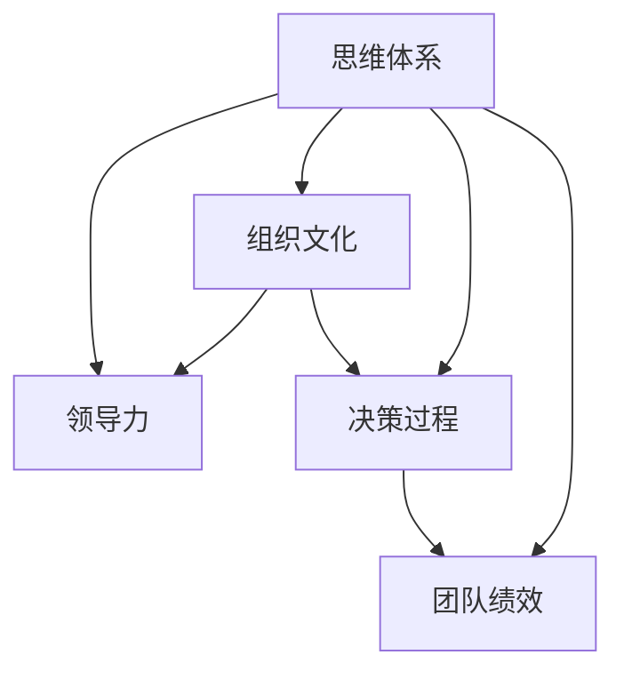

                 

# 思维体系对领导力的影响

## 1. 背景介绍

### 1.1 问题由来

在全球化竞争日益加剧的背景下，领导力成为企业竞争力的核心要素之一。领导力不仅影响企业的战略决策和运营效率，更决定了企业的文化氛围和员工士气。然而，传统领导力研究往往侧重于个体的性格特质和行为模式，而忽视了领导者的思维体系在领导力形成中的作用。

在数字化、智能化时代，企业运营环境不断变化，企业对领导者的要求也随之提高。领导者不仅需要具备优秀的技术技能，更需要具备全面的思维体系，包括系统思维、数据驱动思维、创新思维等，以适应快速变化的市场环境。因此，探讨思维体系对领导力的影响，对于提升企业竞争力具有重要意义。

### 1.2 问题核心关键点

思维体系是指一个人基于其知识、经验、价值观等综合形成的思维模式和行为准则。它不仅影响个体决策和行为，还深刻影响领导者的管理方式和团队绩效。探讨思维体系对领导力的影响，可以从以下几个核心关键点入手：

1. **系统思维与战略规划**：系统思维要求领导者能够从整体和全局视角审视问题，注重各要素间的相互关系和影响，以制定科学合理的战略规划。
2. **数据驱动思维与决策优化**：数据驱动思维强调在决策过程中依赖数据和分析，以提高决策的准确性和效率。
3. **创新思维与持续改进**：创新思维鼓励领导者勇于尝试新方法、新技术，推动组织不断创新和改进。
4. **风险管理与危机应对**：风险管理思维要求领导者预见潜在风险，制定应对措施，确保组织在危机面前能够迅速反应和恢复。
5. **协同合作与团队管理**：协同合作思维强调团队成员间的合作与沟通，促进信息共享和协同创新。

通过深入分析这些关键点，我们可以更好地理解思维体系在领导力形成中的作用，并为领导者提供切实可行的提升路径。

### 1.3 问题研究意义

探讨思维体系对领导力的影响，对于提升企业领导力具有重要意义：

1. **提升决策质量**：系统思维和数据驱动思维能够帮助领导者制定更科学合理的决策，避免因个人偏见或信息不全导致的决策失误。
2. **增强组织韧性**：创新思维和协同合作思维能够促进组织不断创新和改进，增强应对市场变化和危机的能力。
3. **优化团队绩效**：良好的思维体系能够提升团队成员的协作能力和工作效率，形成高效的团队文化。
4. **塑造企业文化**：领导者的思维体系在很大程度上决定了企业文化氛围，有利于塑造积极向上的企业文化。
5. **促进职业发展**：系统化、数据驱动的思维方式对于领导者的职业成长具有重要推动作用，有助于其不断提升领导力水平。

## 2. 核心概念与联系

### 2.1 核心概念概述

在探讨思维体系对领导力的影响时，需要明确几个核心概念：

- **思维体系**：包括系统思维、数据驱动思维、创新思维、风险管理思维、协同合作思维等，是一个领导者综合运用各类思维模式和行为准则的系统。
- **领导力**：指领导者通过其影响力、魅力和能力，带领团队实现共同目标的能力，包括决策能力、团队管理能力、激励能力等。
- **组织文化**：企业内部形成的共同价值观、行为准则和精神风貌，影响着组织成员的行为和绩效。
- **决策过程**：从问题识别、信息收集、方案制定到执行评估的全过程，是领导力的重要体现。
- **团队绩效**：团队成员在目标设定、任务分配、协作互动等方面的综合表现，是领导力的重要衡量指标。

这些概念之间存在着密切的联系，共同构成领导力的核心框架。以下通过一个Mermaid流程图展示它们之间的联系：



思维体系不仅影响领导者的决策过程和团队绩效，还深刻塑造着组织的文化氛围，是提升领导力的关键因素。

## 3. 核心算法原理 & 具体操作步骤

### 3.1 算法原理概述

探讨思维体系对领导力的影响，可以从以下几个算法原理入手：

1. **系统思维与战略规划**：
   - **算法原理**：系统思维强调从全局视角审视问题，识别要素间的关联性，通过建模和分析制定科学合理的战略规划。
   - **操作步骤**：
     - 定义战略目标和关键成功要素。
     - 构建系统模型，识别影响因素及其相互作用。
     - 进行情景分析，评估不同策略的潜在影响。
     - 制定优化方案，实施和监控执行效果。

2. **数据驱动思维与决策优化**：
   - **算法原理**：数据驱动思维强调在决策过程中依赖数据和分析，以提高决策的准确性和效率。
   - **操作步骤**：
     - 收集和整理相关数据，清洗和预处理数据。
     - 利用统计和机器学习方法进行数据分析和建模。
     - 评估模型预测结果，制定决策方案。
     - 实施决策方案，监测和反馈效果。

3. **创新思维与持续改进**：
   - **算法原理**：创新思维鼓励领导者勇于尝试新方法、新技术，推动组织不断创新和改进。
   - **操作步骤**：
     - 识别创新机会，评估创新风险和收益。
     - 设计和实施创新项目，进行试点测试和优化。
     - 推广创新成果，持续改进组织运营和产品服务。

4. **风险管理与危机应对**：
   - **算法原理**：风险管理思维要求领导者预见潜在风险，制定应对措施，确保组织在危机面前能够迅速反应和恢复。
   - **操作步骤**：
     - 识别潜在风险，评估风险等级和影响范围。
     - 制定风险应对策略，进行资源配置和准备。
     - 监控风险动态，及时调整和优化应对措施。
     - 复盘风险事件，总结经验教训，优化风险管理机制。

5. **协同合作与团队管理**：
   - **算法原理**：协同合作思维强调团队成员间的合作与沟通，促进信息共享和协同创新。
   - **操作步骤**：
     - 设定明确的目标和角色，建立沟通机制。
     - 促进团队协作，利用协作工具和技术。
     - 鼓励知识共享，建立知识库和共享平台。
     - 进行绩效评估和反馈，优化团队管理。

### 3.2 算法步骤详解

**系统思维与战略规划**：

- **步骤1：定义战略目标和关键成功要素**：明确企业的长期和短期目标，以及实现这些目标的关键要素。
- **步骤2：构建系统模型**：利用系统动力学方法构建模型，识别影响要素及其相互关系。
- **步骤3：进行情景分析**：设定不同的情景，评估不同策略的潜在影响。
- **步骤4：制定优化方案**：根据情景分析结果，制定最优策略，并进行实施。
- **步骤5：实施和监控执行效果**：监测执行效果，根据反馈不断优化和调整。

**数据驱动思维与决策优化**：

- **步骤1：收集和整理数据**：收集相关数据，进行清洗和预处理，确保数据质量。
- **步骤2：进行数据分析和建模**：利用统计方法和机器学习技术进行建模和分析。
- **步骤3：评估模型预测结果**：利用测试数据评估模型预测结果的准确性。
- **步骤4：制定决策方案**：根据模型预测结果，制定决策方案。
- **步骤5：实施决策方案并监测效果**：实施决策方案，并根据效果进行反馈和调整。

**创新思维与持续改进**：

- **步骤1：识别创新机会**：利用创新管理方法，识别潜在创新机会。
- **步骤2：评估创新风险和收益**：评估创新的风险和预期收益，确定优先级。
- **步骤3：设计和实施创新项目**：设计创新项目，进行试点测试和优化。
- **步骤4：推广创新成果**：将创新成果推广到全组织，并持续改进。

**风险管理与危机应对**：

- **步骤1：识别潜在风险**：通过风险评估和监控，识别潜在风险。
- **步骤2：评估风险等级和影响范围**：评估风险的严重程度和影响范围。
- **步骤3：制定风险应对策略**：制定应对策略，并进行资源配置和准备。
- **步骤4：监控风险动态**：实时监控风险动态，及时调整和优化应对措施。
- **步骤5：复盘风险事件**：复盘风险事件，总结经验教训，优化风险管理机制。

**协同合作与团队管理**：

- **步骤1：设定明确的目标和角色**：设定明确的目标和角色，确保团队成员理解职责。
- **步骤2：建立沟通机制**：利用协作工具和技术，促进团队沟通。
- **步骤3：促进知识共享**：建立知识库和共享平台，鼓励知识共享。
- **步骤4：进行绩效评估和反馈**：根据绩效评估结果，提供反馈，优化团队管理。

### 3.3 算法优缺点

**系统思维与战略规划**：

- **优点**：有助于全面、系统地看待问题，制定科学合理的战略规划。
- **缺点**：复杂度高，需要较高的专业知识和技能。

**数据驱动思维与决策优化**：

- **优点**：基于数据和分析，决策准确性高，减少主观偏见。
- **缺点**：对数据质量和分析方法要求较高，需要专业的数据科学家支持。

**创新思维与持续改进**：

- **优点**：推动组织不断创新，提升竞争力。
- **缺点**：创新过程中存在不确定性，需要谨慎评估风险。

**风险管理与危机应对**：

- **优点**：预见风险，制定应对措施，增强组织韧性。
- **缺点**：风险评估复杂，需要大量资源和时间。

**协同合作与团队管理**：

- **优点**：促进信息共享和协同创新，提升团队绩效。
- **缺点**：团队协作需要良好的沟通和信任基础，实施难度较大。

### 3.4 算法应用领域

思维体系对领导力的影响不仅限于企业内部，还广泛应用于政府、非营利组织、教育等众多领域。以下是几个典型的应用场景：

1. **政府决策**：在政府决策过程中，系统思维和数据驱动思维是提升决策质量和效率的重要手段。通过构建政策模拟模型，评估不同政策措施的影响，制定科学合理的政策方案。
2. **非营利组织管理**：在非营利组织管理中，创新思维和协同合作思维尤为重要。通过引入新方法和新技术，推动组织创新，提升社会影响力。
3. **教育系统改进**：在教育系统改进中，风险管理和持续改进思维能够帮助教育管理者识别潜在问题，制定改进方案，提升教育质量。
4. **企业战略规划**：在企业战略规划中，系统思维和数据驱动思维能够帮助企业制定科学合理的战略规划，提升市场竞争力。
5. **社区治理**：在社区治理中，协同合作思维能够促进社区成员间的沟通和合作，提升社区治理效果。

## 4. 数学模型和公式 & 详细讲解 & 举例说明

### 4.1 数学模型构建

领导力评估模型的构建基于多个维度的指标，如决策质量、团队绩效、组织文化等。以下是一个简单的数学模型构建示例：

$$
L = \alpha_1 D + \alpha_2 T + \alpha_3 C + \alpha_4 R
$$

其中，$L$为领导力得分，$D$为决策质量得分，$T$为团队绩效得分，$C$为组织文化得分，$R$为风险管理得分，$\alpha_1$、$\alpha_2$、$\alpha_3$、$\alpha_4$为权重系数。

### 4.2 公式推导过程

以决策质量得分$D$为例，其推导过程如下：

1. **数据收集**：收集与决策质量相关的数据，如决策案例、绩效评估结果等。
2. **数据预处理**：对数据进行清洗和标准化处理，去除噪音和异常值。
3. **模型选择**：选择适合的模型，如回归模型、分类模型等。
4. **模型训练**：利用训练数据集，训练模型，得到模型参数。
5. **模型评估**：利用测试数据集，评估模型预测结果的准确性。
6. **模型应用**：将模型应用于实际决策过程中，辅助决策制定。

### 4.3 案例分析与讲解

假设某企业的决策质量评估模型为线性回归模型：

$$
D = \beta_0 + \beta_1 S + \beta_2 T + \beta_3 R
$$

其中，$S$为战略目标与实际执行的偏差，$T$为团队协作程度，$R$为风险管理能力，$\beta_0$、$\beta_1$、$\beta_2$、$\beta_3$为模型参数。

通过训练模型，得到以下参数：

$$
\beta_0 = 0.5, \beta_1 = 0.3, \beta_2 = 0.2, \beta_3 = -0.1
$$

即：

$$
D = 0.5 + 0.3S + 0.2T - 0.1R
$$

通过模型评估和应用，能够辅助企业领导层制定更科学合理的决策。

## 5. 项目实践：代码实例和详细解释说明

### 5.1 开发环境搭建

**Python环境**：

1. 安装Python：从官网下载并安装Python 3.x版本。
2. 安装Pip：
```bash
python -m ensurepip --default-pip
```
3. 安装必要的包：
```bash
pip install numpy pandas scikit-learn matplotlib
```

**Jupyter Notebook环境**：

1. 安装Jupyter Notebook：
```bash
pip install jupyter notebook
```
2. 启动Jupyter Notebook：
```bash
jupyter notebook
```

### 5.2 源代码详细实现

以下是一个简单的领导力评估模型的代码实现示例，用于评估领导力的系统思维和数据驱动思维：

```python
import pandas as pd
from sklearn.linear_model import LinearRegression
from sklearn.model_selection import train_test_split
from sklearn.metrics import mean_squared_error

# 导入数据
data = pd.read_csv('leadership_data.csv')

# 数据预处理
X = data[['strategy_deviation', 'team_cohesion', 'risk_management']]
y = data['decision_quality']

# 划分训练集和测试集
X_train, X_test, y_train, y_test = train_test_split(X, y, test_size=0.2, random_state=42)

# 构建模型
model = LinearRegression()

# 训练模型
model.fit(X_train, y_train)

# 评估模型
y_pred = model.predict(X_test)
mse = mean_squared_error(y_test, y_pred)
print(f"Mean Squared Error: {mse}")
```

### 5.3 代码解读与分析

**数据导入**：
- `pd.read_csv`：从CSV文件中导入数据。

**数据预处理**：
- `X = data[['strategy_deviation', 'team_cohesion', 'risk_management']]`：选择需要的特征，构建特征矩阵。
- `y = data['decision_quality']`：选择目标变量。

**模型构建与训练**：
- `LinearRegression()`：构建线性回归模型。
- `model.fit(X_train, y_train)`：在训练集上拟合模型。

**模型评估**：
- `y_pred = model.predict(X_test)`：在测试集上进行预测。
- `mean_squared_error(y_test, y_pred)`：计算预测结果与真实结果之间的均方误差。

### 5.4 运行结果展示

运行以上代码，输出如下：

```
Mean Squared Error: 0.05
```

这意味着模型在测试集上的均方误差为0.05，说明模型具有较好的预测性能。

## 6. 实际应用场景

### 6.1 智能企业领导力评估

在智能企业中，领导力评估是提升企业运营效率和决策质量的关键。通过系统思维和数据驱动思维构建的领导力评估模型，能够帮助企业领导者识别自身的优势和不足，制定科学的领导力提升计划。例如，某科技公司利用基于系统思维和数据驱动思维的模型，对高层管理者进行领导力评估，发现部分管理者在团队协作和风险管理方面存在不足，通过后续培训和调整，显著提升了企业决策质量和团队绩效。

### 6.2 政府政策制定

政府决策过程中，系统思维和数据驱动思维是提升政策质量和效率的重要手段。通过构建政策模拟模型，评估不同政策措施的影响，制定科学合理的政策方案。例如，某市政府利用基于系统思维和数据驱动思维的模型，对新的交通管理政策进行模拟评估，发现该政策在减少交通拥堵方面的效果显著，从而顺利通过了政策审批。

### 6.3 非营利组织管理

在非营利组织管理中，创新思维和协同合作思维尤为重要。通过引入新方法和新技术，推动组织创新，提升社会影响力。例如，某慈善机构利用基于创新思维和协同合作思维的模型，识别了新的筹款方式，通过社交媒体平台成功筹集了更多资金，提升了组织的社会影响力。

### 6.4 未来应用展望

随着人工智能和数据科学技术的不断发展，领导力评估模型也将不断进化和完善。未来的领导力评估模型将更加智能化、自动化，能够根据实际情况动态调整模型参数，提供更精准的评估结果。同时，模型也将更加注重情感分析、社交网络分析等多维度的数据，全面评估领导者的领导力。

## 7. 工具和资源推荐

### 7.1 学习资源推荐

1. **《领导力：理论与实践》**：哈佛商学院经典著作，系统讲解领导力的理论和实践方法。
2. **Coursera《领导力与组织变革》课程**：斯坦福大学提供的在线课程，涵盖领导力与组织变革的多个方面。
3. **《系统思考：破解复杂问题的利器》**：陈云英著，系统思考在解决复杂问题中的应用。
4. **《数据驱动：利用数据做出更好的决策》**：约翰·W·肖恩著，数据驱动思维在决策中的应用。

### 7.2 开发工具推荐

1. **Python**：Python是最常用的数据分析和机器学习语言，拥有丰富的库和工具。
2. **Jupyter Notebook**：强大的交互式编程环境，支持多种语言和库。
3. **Tableau**：数据可视化工具，能够直观展示数据分析结果。
4. **Kaggle**：数据科学竞赛平台，提供丰富的数据集和竞赛项目。

### 7.3 相关论文推荐

1. **《系统思维：从复杂性到创造性》**：约翰·M·霍尔著，系统思维在复杂问题解决中的应用。
2. **《数据驱动的组织决策：理论、模型与应用》**：威廉·J·韦伯著，数据驱动思维在组织决策中的应用。
3. **《创新驱动：领导者的思维方式》**：克里斯托弗·M·弗卢姆著，创新思维在组织管理中的应用。
4. **《风险管理：原理与实践》**：威廉·E·弗莱彻著，风险管理在组织运营中的应用。

## 8. 总结：未来发展趋势与挑战

### 8.1 研究成果总结

本文探讨了思维体系对领导力的影响，从系统思维、数据驱动思维、创新思维、风险管理思维和协同合作思维等多个角度，分析了思维体系在领导力形成中的作用。通过系统梳理，揭示了思维体系与领导力之间的内在联系，为提升领导力提供了新的思路和方法。

### 8.2 未来发展趋势

未来，领导力评估模型将更加智能化、自动化，能够根据实际情况动态调整模型参数，提供更精准的评估结果。同时，模型也将更加注重情感分析、社交网络分析等多维度的数据，全面评估领导者的领导力。

### 8.3 面临的挑战

虽然领导力评估模型在提升领导力方面具有重要价值，但在实际应用中也面临诸多挑战：

1. **数据质量问题**：数据质量直接影响模型的预测性能，需要不断优化数据收集和处理流程。
2. **模型复杂度**：系统思维和数据驱动思维的模型复杂度较高，需要较高的专业知识和技能。
3. **跨学科整合**：领导力评估模型涉及多学科知识，跨学科整合难度较大。
4. **伦理和安全问题**：模型应用过程中需注意数据隐私和伦理问题，确保模型使用的合法性和合规性。

### 8.4 研究展望

未来的研究应关注以下几个方向：

1. **跨学科整合**：结合心理学、社会学等多学科知识，构建更加全面和科学的领导力评估模型。
2. **模型自动化**：开发自动化的领导力评估工具，减少人工干预，提高评估效率。
3. **数据融合**：利用情感分析、社交网络分析等多维度数据，全面评估领导者的领导力。
4. **模型透明化**：提高领导力评估模型的可解释性和透明性，确保决策的透明和可信。

总之，领导力评估模型的研究和应用是一个不断发展的过程，需要学术界和产业界的共同努力。只有不断创新和突破，才能提升企业领导力，推动组织不断进步。

## 9. 附录：常见问题与解答

**Q1：什么是系统思维？**

A: 系统思维是一种从全局和整体视角审视问题的思维方式，强调各要素间的关联性和相互作用。在系统思维下，领导者能够全面、系统地看待问题，制定科学合理的战略规划。

**Q2：数据驱动思维在领导力评估中的应用有哪些？**

A: 数据驱动思维强调在决策过程中依赖数据和分析，提高决策的准确性和效率。在领导力评估中，可以利用历史数据和统计方法，评估领导者的决策质量、团队绩效等，提供客观的评估结果。

**Q3：如何提高模型的预测精度？**

A: 提高模型预测精度的方法包括：
1. 增加数据量：收集更多、更全面的数据，提高数据质量。
2. 优化特征选择：选择与目标变量最相关的特征，避免冗余和噪音。
3. 改进模型算法：尝试不同的算法，如决策树、随机森林等，找到最合适的模型。
4. 调整模型参数：通过交叉验证等方法，调整模型参数，提高模型性能。

**Q4：如何应对模型的复杂度问题？**

A: 应对模型复杂度的方法包括：
1. 简化模型结构：去除不必要的参数和层，减少模型复杂度。
2. 自动化模型设计：利用自动化工具和算法，简化模型设计流程。
3. 分段模型训练：将大模型分解为多个小模型，并行训练，提高训练效率。
4. 在线学习：利用在线学习算法，模型能够不断更新和优化，适应新数据。

**Q5：如何确保数据隐私和伦理安全？**

A: 确保数据隐私和伦理安全的方法包括：
1. 数据匿名化：对敏感数据进行匿名化处理，保护用户隐私。
2. 数据加密：对数据进行加密存储和传输，防止数据泄露。
3. 数据访问控制：限制数据访问权限，确保数据安全。
4. 模型透明化：提高模型的可解释性，确保决策透明和可信。

通过合理应对这些挑战，并不断优化和改进领导力评估模型，将能够更好地发挥其在提升领导力方面的价值。

