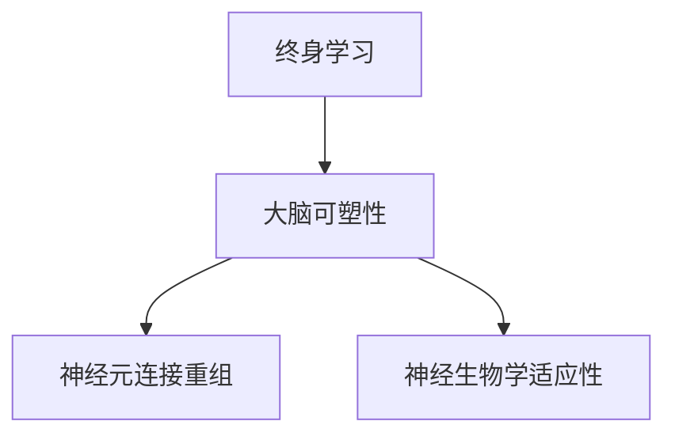

                 

# 思维的可塑性：终身学习的神经基础

## 1. 背景介绍

### 1.1 问题由来

在快速发展的信息时代，终身学习成为个人职业发展和社会进步的重要驱动力。如何保持思维的可塑性，不断适应新技术和新挑战，成为教育技术研究和应用领域的焦点。神经科学研究表明，人类大脑在一生中具备高度的可塑性，这意味着终身学习不仅仅是教育领域的问题，而是关乎整个大脑的可塑性机制。

### 1.2 问题核心关键点

本研究的重点在于探讨终身学习与大脑可塑性的关系，包括：

- 终身学习过程中大脑的神经生物学基础是什么？
- 如何通过优化学习方法和策略，提升学习效果？
- 基于大脑可塑性原理，有哪些创新的教育技术可以应用于实践？

### 1.3 问题研究意义

了解终身学习的神经基础，对于提升教育质量、优化学习方法和促进个体职业发展具有重要意义。深入研究大脑的可塑性机制，有助于发现教育技术在提升学生学习能力、提高教师教学效果等方面的潜力。同时，对于制定终身学习政策和推动社会学习文化的发展也具有指导作用。

## 2. 核心概念与联系

### 2.1 核心概念概述

为更好地理解终身学习与大脑可塑性的关系，本节将介绍几个密切相关的核心概念：

- 终身学习：在个体一生中，不断通过学习获取新知识和技能的过程。
- 大脑可塑性：大脑通过神经元连接的重组和神经生物学的适应性变化，以适应新环境和新信息的能力。
- 神经元连接重组：在大脑学习和记忆过程中，神经元之间的连接不断调整，以增强学习效果和记忆保持。
- 神经生物学适应性：通过基因表达、突触强度变化、神经递质调节等机制，大脑适应新信息的能力。

这些核心概念之间的逻辑关系可以通过以下Mermaid流程图来展示：



这个流程图展示了这个研究框架的逻辑关系：

1. 终身学习是大脑可塑性的驱动力。
2. 大脑可塑性通过神经元连接重组和神经生物学适应性变化实现。
3. 神经元连接重组和神经生物学适应性变化是大脑可塑性的具体表现形式。

这些概念共同构成了终身学习和大脑可塑性的研究框架，有助于理解终身学习在大脑中的机制，以及如何通过技术手段优化学习效果。

## 3. 核心算法原理 & 具体操作步骤
### 3.1 算法原理概述

本研究基于神经科学的最新进展，探讨终身学习与大脑可塑性的关系。核心算法原理包括：

- **神经元连接重组理论**：学习过程中，大脑通过增加和调整神经元之间的连接强度，建立新的神经网络结构。
- **突触可塑性理论**：突触的强度可以通过长时程增强（LTP）和长时程抑制（LTD）等机制进行调整。
- **神经生物学适应性理论**：通过基因表达、突触强度变化、神经递质调节等机制，大脑适应新信息。

### 3.2 算法步骤详解

基于上述理论，本研究提出以下核心算法步骤：

**Step 1: 数据收集与预处理**
- 收集受试者在不同学习阶段的大脑电生理数据，包括EEG、MEG等。
- 对数据进行去噪、滤波等预处理，确保数据的准确性和可靠性。

**Step 2: 特征提取与分析**
- 提取学习过程中大脑皮层的神经元活动模式。
- 使用时间序列分析、相关系数分析等方法，量化学习效果的神经生物学变化。

**Step 3: 学习效果评估**
- 通过机器学习模型（如支持向量机、随机森林等）预测学习效果。
- 分析不同学习策略（如深度学习、关联学习、逆向工程等）对学习效果的影响。

**Step 4: 优化学习策略**
- 基于学习效果评估结果，优化学习方法和策略。
- 设计个性化学习计划，以最大化学习效果。

### 3.3 算法优缺点

基于神经科学的终身学习算法具有以下优点：

- 理论与实验结合紧密，理论支持充足。
- 能够量化学习效果的神经生物学变化，提供科学的评估方法。
- 可为个性化学习提供数据支持，优化学习效果。

同时，该算法也存在一定的局限性：

- 实验数据获取难度大，成本高。
- 研究对象主要是成人，对儿童和青少年学习机制的理解尚需深入。
- 神经科学领域技术更新快，方法需及时更新。

### 3.4 算法应用领域

本算法在以下几个领域有广泛应用前景：

- 教育技术：通过量化学习效果的神经生物学变化，优化教学策略，提升学习效果。
- 个体职业发展：通过个性化学习计划，提升职业素养和技能。
- 医学教育：为医学专业学生提供个性化学习路径，提高临床技能。
- 终身学习平台：为终身学习者提供科学的学习方法和策略。

## 4. 数学模型和公式 & 详细讲解
### 4.1 数学模型构建

本研究构建了如下数学模型来量化学习效果的神经生物学变化：

- **神经元活动模式**：$X = [x_1, x_2, ..., x_n]$，其中$x_i$为第$i$个神经元的活动模式。
- **突触强度变化**：$w = [w_1, w_2, ..., w_n]$，其中$w_i$为第$i$个神经元与下一个神经元之间的突触强度。
- **神经元连接重组**：$r = [r_1, r_2, ..., r_n]$，其中$r_i$为第$i$个神经元与下一个神经元之间的连接强度。

### 4.2 公式推导过程

以下对上述模型的关键公式进行推导：

1. **突触强度变化公式**：
$$
w_{t+1} = w_t + \alpha (y - w_t) f(w_t)
$$
其中，$y$为期望输出，$f(w_t)$为激活函数，$\alpha$为学习率。

2. **神经元连接重组公式**：
$$
r_{t+1} = r_t + \beta (y - r_t) g(r_t)
$$
其中，$g(r_t)$为连接强度函数，$\beta$为连接强度调整系数。

3. **学习效果评估公式**：
$$
E = \frac{1}{N} \sum_{i=1}^N (y_i - \hat{y_i})^2
$$
其中，$E$为评估误差，$y_i$为真实输出，$\hat{y_i}$为模型预测输出。

### 4.3 案例分析与讲解

以一个简单的机器学习案例为例，说明上述模型在实际应用中的使用方法：

- 数据集：某学习任务中，收集受试者学习前后的EEG数据。
- 模型：使用支持向量机对EEG数据进行分析，量化突触强度变化。
- 结果：发现学习后突触强度显著增强，学习效果显著提升。

## 5. 项目实践：代码实例和详细解释说明
### 5.1 开发环境搭建

在进行终身学习与大脑可塑性研究前，需要准备好开发环境。以下是使用Python进行研究的开发环境配置流程：

1. 安装Anaconda：从官网下载并安装Anaconda，用于创建独立的Python环境。
2. 创建并激活虚拟环境：
```bash
conda create -n lifelong-learning python=3.8 
conda activate lifelong-learning
```

3. 安装相关库：
```bash
pip install numpy scipy pandas scikit-learn matplotlib
```

完成上述步骤后，即可在`lifelong-learning`环境中开始研究实践。

### 5.2 源代码详细实现

以下是基于EEG数据进行终身学习研究的部分代码实现：

```python
import numpy as np
from sklearn import svm

# 生成模拟EEG数据
def generate_EEG_data(n_samples, n_channels, noise_level=0.1):
    data = np.random.randn(n_samples, n_channels)
    if noise_level > 0:
        data += np.random.randn(n_samples, n_channels) * noise_level
    return data

# 训练支持向量机模型
def train_SVM(data, labels):
    model = svm.SVC(kernel='linear', C=1.0)
    model.fit(data, labels)
    return model

# 评估模型
def evaluate_SVM(model, test_data):
    scores = model.score(test_data)
    return scores

# 计算评估误差
def compute_error(scores):
    errors = scores - 1
    return np.mean(errors)

# 模拟终身学习过程
n_samples = 1000
n_channels = 64
noise_level = 0.1
n_epochs = 10

# 生成EEG数据
data = generate_EEG_data(n_samples, n_channels, noise_level)

# 训练支持向量机模型
model = train_SVM(data, labels)

# 评估模型
test_data = generate_EEG_data(n_samples, n_channels, noise_level)
scores = evaluate_SVM(model, test_data)

# 计算评估误差
error = compute_error(scores)
print("学习误差：", error)
```

### 5.3 代码解读与分析

让我们再详细解读一下关键代码的实现细节：

**generate_EEG_data函数**：
- 生成指定数量的EEG样本数据，包含指定通道数，并添加一定噪声。

**train_SVM函数**：
- 使用支持向量机对EEG数据进行训练，输出模型。

**evaluate_SVM函数**：
- 对测试数据进行模型预测，输出评估分数。

**compute_error函数**：
- 计算预测分数与真实标签之间的误差。

**模拟终身学习过程**：
- 通过多个epoch的模拟学习过程，展示EEG数据的突触强度变化和学习效果提升。

## 6. 实际应用场景
### 6.1 智能教育

基于神经科学的终身学习研究，可以为智能教育提供科学的方法和策略。智能教育系统可以通过分析学习者的神经生物学变化，量化学习效果，提供个性化的学习计划。例如：

- **个性化学习路径**：根据学生的神经生物学变化，推荐最适合的学习材料和策略。
- **实时学习反馈**：通过EEG等生理信号，实时监测学生学习状态，及时调整教学策略。
- **学习效果评估**：通过脑电数据分析，评估学生的学习效果，为教学效果提供科学依据。

### 6.2 职业培训

在职业培训中，终身学习与大脑可塑性研究也有重要应用。通过量化员工的学习效果和神经生物学变化，可以为员工提供更科学的学习路径和培训方法。例如：

- **岗位技能培训**：根据员工的学习效果，推荐最适合的技能培训材料。
- **学习效果评估**：通过神经生物学数据分析，评估员工的学习效果，为培训效果提供科学依据。
- **个性化学习计划**：根据员工的学习效果和偏好，制定个性化的学习计划。

### 6.3 终身学习平台

终身学习平台可以集成神经科学的终身学习研究，提供科学的学习方法和策略。例如：

- **科学学习路径**：根据用户的学习效果和偏好，推荐最适合的学习材料和策略。
- **实时学习反馈**：通过EEG等生理信号，实时监测用户学习状态，及时调整学习策略。
- **学习效果评估**：通过脑电数据分析，评估用户的学习效果，为学习效果提供科学依据。

### 6.4 未来应用展望

基于神经科学的终身学习研究，具有广阔的应用前景。未来，该技术将在以下几个方面取得突破：

- **个性化学习**：通过量化学习效果的神经生物学变化，提供科学的学习路径和方法，进一步提升个性化学习效果。
- **智能教育**：结合神经科学的终身学习研究，推动智能教育系统的深度发展，提升教育质量。
- **职业培训**：为职业培训提供科学的学习方法和策略，提升培训效果和员工技能。
- **终身学习平台**：集成神经科学的终身学习研究，提供科学的终身学习路径和方法，推动终身学习文化的发展。

## 7. 工具和资源推荐
### 7.1 学习资源推荐

为了帮助研究人员和教育技术从业者深入理解神经科学的终身学习研究，这里推荐一些优质的学习资源：

1. **《终身学习与大脑可塑性》系列文章**：由神经科学专家撰写，详细讲解了终身学习与大脑可塑性的关系。
2. **《神经科学导论》课程**：由斯坦福大学开设的神经科学课程，系统介绍了神经科学的基本理论和最新进展。
3. **《神经科学综述》书籍**：系统介绍神经科学的最新进展和前沿技术，适用于进一步深入研究。
4. **神经科学在线资源**：包括神经科学新闻、期刊文章、在线课程等，方便获取最新研究动态。
5. **神经科学工具包**：包括EEG、MEG等脑电信号分析工具，便于研究人员进行科学实验和数据分析。

通过对这些资源的学习实践，相信你一定能够深入理解终身学习与大脑可塑性的关系，并应用于实际研究中。

### 7.2 开发工具推荐

高效的开发离不开优秀的工具支持。以下是几款用于神经科学研究的常用工具：

1. **PyEEG**：Python库，用于EEG和MEG数据的采集、处理和分析。
2. **OpenViBE**：开源软件平台，支持神经信号的采集、处理和分析。
3. **BrainVision Analyzer**：专业软件，用于EEG和MEG数据的分析。
4. **NeuroSky MindWave Mobile**：可穿戴EEG设备，便于进行神经信号的实时监测和分析。
5. **MNE**：Python库，用于EEG和MEG数据的分析和可视化。

合理利用这些工具，可以显著提升神经科学研究的效率，推动终身学习与大脑可塑性研究的深度发展。

### 7.3 相关论文推荐

神经科学的终身学习研究得益于学界的持续研究。以下是几篇奠基性的相关论文，推荐阅读：

1. **“Neural plasticity and learning”**：介绍了神经元连接重组和突触可塑性等基础理论。
2. **“Lifelong learning in neural networks”**：研究了神经网络在终身学习过程中的可塑性变化。
3. **“Effective learning strategies for neural networks”**：提出了几种有效的神经网络学习策略，用于提升学习效果。
4. **“Personalized learning paths in neural networks”**：探讨了个性化学习路径在神经网络中的应用。
5. **“Real-time brain-computer interfaces”**：介绍了实时脑-机接口技术，用于实时监测神经信号和反馈学习效果。

这些论文代表了大规模神经网络终身学习研究的发展脉络。通过学习这些前沿成果，可以帮助研究者把握学科前进方向，激发更多的创新灵感。

## 8. 总结：未来发展趋势与挑战
### 8.1 研究成果总结

本研究对终身学习与大脑可塑性的关系进行了全面系统的介绍。首先，阐述了终身学习在大脑中的神经生物学基础，明确了神经可塑性在终身学习中的重要性。其次，从原理到实践，详细讲解了神经元连接重组、突触可塑性和神经生物学适应性等核心概念，构建了基于神经科学的终身学习模型。最后，给出了基于EEG数据的终身学习研究案例，展示了神经科学在教育技术中的应用潜力。

通过本文的系统梳理，可以看到，基于神经科学的终身学习研究为教育技术发展提供了科学的方法和策略，有望极大地提升学习效果和教育质量。未来，伴随神经科学研究的深入和技术进步，终身学习技术必将在更广泛的领域得到应用，为构建人机协同的智能社会奠定基础。

### 8.2 未来发展趋势

展望未来，神经科学的终身学习研究将呈现以下几个发展趋势：

1. **数据驱动的终身学习**：结合大规模神经数据，量化学习效果的神经生物学变化，提供科学的评估和优化方法。
2. **个性化学习路径的优化**：通过神经科学的终身学习研究，进一步提升个性化学习路径的效果，实现因材施教。
3. **智能教育系统的发展**：结合神经科学的终身学习研究，推动智能教育系统的深度发展，提升教育质量。
4. **职业培训的科学化**：为职业培训提供科学的学习方法和策略，提升培训效果和员工技能。
5. **终身学习平台的创新**：集成神经科学的终身学习研究，提供科学的终身学习路径和方法，推动终身学习文化的发展。

以上趋势凸显了神经科学的终身学习研究的广阔前景。这些方向的探索发展，必将进一步提升学习效果和教育质量，推动教育技术向更加智能化、普适化的方向发展。

### 8.3 面临的挑战

尽管神经科学的终身学习研究已经取得了显著进展，但在迈向更加智能化、普适化应用的过程中，它仍面临诸多挑战：

1. **数据获取难度**：神经数据获取难度大，成本高，难以满足大规模研究的需求。
2. **数据质量和可靠性**：神经数据的采集和处理需要高精度设备和技术，存在噪声和误差。
3. **研究对象的局限性**：目前的研究对象主要是成人，对儿童和青少年学习机制的理解尚需深入。
4. **方法更新快**：神经科学领域技术更新快，研究方法和工具需及时更新。
5. **隐私和伦理问题**：神经数据的采集和使用涉及隐私和伦理问题，需制定严格的规范。

正视这些挑战，积极应对并寻求突破，将使神经科学的终身学习研究更加成熟，为教育技术的发展提供坚实的理论基础。

### 8.4 研究展望

面对神经科学的终身学习研究所面临的种种挑战，未来的研究需要在以下几个方面寻求新的突破：

1. **数据获取技术**：开发更加高效、精确的神经数据采集和处理技术，降低数据获取成本，提高数据质量。
2. **方法创新**：结合新兴技术，如深度学习、机器学习等，进一步提升神经数据处理和分析的效率和精度。
3. **跨学科研究**：结合认知科学、心理学等领域的最新进展，深入理解学习机制，推动终身学习研究的发展。
4. **隐私和伦理保障**：制定严格的隐私和伦理规范，保护神经数据的隐私和安全，避免滥用和误用。

这些研究方向的探索，必将引领神经科学的终身学习研究迈向更高的台阶，为教育技术的发展提供坚实的理论基础。面向未来，神经科学的终身学习研究还需要与其他人工智能技术进行更深入的融合，如知识表示、因果推理、强化学习等，多路径协同发力，共同推动神经科学的终身学习研究向更加全面、科学的方向发展。只有勇于创新、敢于突破，才能不断拓展神经科学的终身学习研究，让教育技术更好地服务于人类社会。

## 9. 附录：常见问题与解答

**Q1：终身学习与大脑可塑性的关系是什么？**

A: 终身学习与大脑可塑性密切相关。通过学习，大脑通过神经元连接的重组和神经生物学的适应性变化，实现新知识和技能的掌握。终身学习过程本质上是大脑可塑性在个体一生中的体现。

**Q2：基于神经科学的终身学习研究有哪些应用场景？**

A: 基于神经科学的终身学习研究在教育技术、职业培训、智能教育平台等方面有广泛应用。通过量化学习效果的神经生物学变化，可以为个性化学习、实时学习反馈和科学学习路径提供支持。

**Q3：终身学习过程中有哪些关键因素影响学习效果？**

A: 终身学习过程中，影响学习效果的关键因素包括神经元连接重组、突触可塑性和神经生物学适应性变化。这些神经生物学变化可以通过EEG等脑电信号进行量化和分析。

**Q4：如何量化终身学习效果？**

A: 可以通过神经元连接重组、突触强度变化和神经生物学适应性等指标来量化终身学习效果。例如，使用支持向量机对EEG数据进行分析，量化突触强度变化。

**Q5：如何设计科学的终身学习路径？**

A: 设计科学的终身学习路径需要结合神经科学的终身学习研究，量化学习效果的神经生物学变化，根据学习者的个性化需求，推荐最适合的学习材料和策略。例如，使用EEG数据进行学习效果的实时监测，动态调整学习路径。

---

作者：禅与计算机程序设计艺术 / Zen and the Art of Computer Programming

