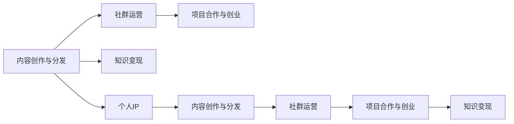

                 

## 1. 背景介绍

在数字化时代，程序员不再只是技术的执行者，更是知识的创造者和传播者。伴随着开源社区的繁荣、在线教育的兴起和社交媒体的普及，程序员的知识变现途径日趋多样化，不再仅限于传统的雇佣关系。在AI、大数据、云计算等新兴技术的推动下，越来越多的程序员开始通过打造个人品牌、分享技术文章、参加技术会议等方式，将自己的专业知识和经验转化为市场价值。本文将从理论到实践，深入探讨程序员如何借助知识变现，打造个人IP，开启一段全新的职业旅程。

## 2. 核心概念与联系

### 2.1 核心概念概述

为了深入理解程序员知识变现的机制，我们将先介绍一些关键概念：

- **个人IP（Personal Intellectual Property）**：指个人所拥有的独特品牌或形象，通过社交媒体、博客、视频等多种渠道进行传播和维护，以吸引特定受众群体的关注和信任。

- **知识变现**：指将个人的专业知识、技能和经验等转化为经济收益的过程。知识变现方式多种多样，包括写作书籍、开设在线课程、技术咨询、演讲分享等。

- **内容创作与分发**：在社交媒体和博客等平台上，通过撰写文章、发布视频、设计课程等方式，创造有价值的内容，并将其分发至更广泛的受众群体。

- **社群运营**：通过建立和管理社群，聚集志趣相投的技术爱好者，增强社区粘性，提升个人品牌影响力。

- **项目合作与创业**：利用个人IP影响力，进行技术咨询、合作项目开发或创办技术公司，实现知识变现。

这些概念之间相互关联，共同构成了程序员知识变现的核心框架。

### 2.2 核心概念原理和架构的 Mermaid 流程图



## 3. 核心算法原理 & 具体操作步骤

### 3.1 算法原理概述

程序员的知识变现过程，本质上是一种基于内容的价值创造和商业化过程。其核心在于：

1. **内容质量**：优质的内容是知识变现的基础，内容需具有深度、广度和创新性，能满足目标受众的需求。
2. **品牌定位**：明确的个人品牌定位，有助于吸引特定的受众群体，建立市场认知。
3. **渠道选择**：选择适当的传播渠道，如博客、YouTube、Twitter、Slack等，将内容传达给目标受众。
4. **用户互动**：与受众建立互动，通过评论、社交媒体等方式，提升品牌忠诚度和用户粘性。
5. **商业变现**：将内容转化为商业模式，如通过广告、付费会员、课程销售等方式实现收益。

### 3.2 算法步骤详解

#### 3.2.1 内容创作与分发

1. **选题与规划**：根据个人兴趣和市场需求，确定创作主题和内容形式。
2. **内容创作**：撰写高质量的技术文章、开发编程示例、制作技术视频等。
3. **平台分发**：选择合适的平台，如博客（如Medium、GitHub Pages）、视频平台（如YouTube、Bilibili）、社交媒体（如Twitter、LinkedIn）等，进行内容分发。

#### 3.2.2 社群运营

1. **社区建设**：建立技术兴趣社群，如GitHub上的开源项目、Slack技术讨论群等。
2. **互动交流**：积极参与社群讨论，解答技术问题，分享学习心得。
3. **社群管理**：制定社群规范，设置管理员权限，维护良好的社区氛围。

#### 3.2.3 项目合作与创业

1. **技术咨询**：利用个人品牌和专业知识，参与企业技术顾问、技术培训等工作。
2. **项目开发**：组建技术团队，开发自有技术产品或参与开源项目。
3. **创办公司**：根据市场需求和个人兴趣，创办技术公司，实现商业化运营。

### 3.3 算法优缺点

#### 3.3.1 优点

1. **灵活性**：知识变现过程不受时间地点限制，可以实现远程工作和自由职业。
2. **多样性**：变现方式多样，可以根据个人兴趣和市场需求，灵活选择。
3. **高收益潜力**：高质量的内容和品牌影响力，可以带来高额收益。

#### 3.3.2 缺点

1. **高门槛**：需要具备较强的专业能力和内容创作能力。
2. **不确定性**：市场竞争激烈，知识变现过程存在不确定性。
3. **时间投入**：高质量的内容创作和社群运营需要大量时间精力。

### 3.4 算法应用领域

知识变现方式广泛应用于以下几个领域：

1. **技术博客与媒体**：通过撰写技术博客、发布技术文章，吸引技术爱好者和开发者关注。
2. **在线教育与培训**：开设在线课程、编写技术书籍，传授编程技能和经验。
3. **技术咨询与顾问**：提供企业技术咨询、技术培训等专业服务。
4. **项目开发与创业**：开发自有技术产品或创办技术公司，实现商业化运营。
5. **技术演讲与讲座**：参加技术会议、行业峰会，分享技术见解和成果。

## 4. 数学模型和公式 & 详细讲解 & 举例说明

### 4.1 数学模型构建

假设一个程序员通过内容创作、社交媒体和课程销售三种方式变现，设每周投入的时间分别为 $t_1$、$t_2$、$t_3$，每周获得的收入分别为 $r_1$、$r_2$、$r_3$。则总收益为 $R = r_1t_1 + r_2t_2 + r_3t_3$。

### 4.2 公式推导过程

$$
R = r_1t_1 + r_2t_2 + r_3t_3
$$

其中，$r_1$、$r_2$、$r_3$ 为每小时的变现收入，$t_1$、$t_2$、$t_3$ 为每周投入的时间。

### 4.3 案例分析与讲解

- **技术博客**：某程序员撰写技术博客，每篇平均收益为 $50元/小时$，每周投入 $10小时$，总收益为 $50 \times 10 = 500元$。
- **在线课程**：该程序员开设在线编程课程，每小时收益为 $100元$，每周投入 $5小时$，总收益为 $100 \times 5 = 500元$。
- **社交媒体**：通过在Twitter上发布编程技巧，获得广告收益，每小时收益为 $20元$，每周投入 $5小时$，总收益为 $20 \times 5 = 100元$。

根据以上模型，该程序员的总收益为 $500 + 500 + 100 = 1100元$。

## 5. 项目实践：代码实例和详细解释说明

### 5.1 开发环境搭建

为了进行内容创作与分发，需要搭建一个适合的技术环境。以下是基本的搭建流程：

1. **服务器选择**：可以选择云服务器（如AWS、Google Cloud）或本地服务器（如Linode）。
2. **开发工具**：安装编辑器（如VS Code、Atom）、版本控制工具（如Git、GitHub）、Markdown编辑器（如Typora、Notion）等。
3. **平台集成**：将技术博客与GitHub Pages、Medium等平台集成，方便内容分发。

### 5.2 源代码详细实现

#### 5.2.1 博客搭建

使用GitHub Pages搭建博客，步骤如下：

1. 在GitHub上创建一个仓库。
2. 在本地安装Jekyll，并运行 `jekyll new blog` 命令，创建博客目录。
3. 运行 `jekyll serve` 命令，启动本地服务器。
4. 将博客部署到GitHub Pages，访问地址为 `username.github.io/blog`。

#### 5.2.2 在线课程开发

使用Kaggle平台搭建在线课程，步骤如下：

1. 注册Kaggle账号。
2. 创建新的课程，选择课程类别。
3. 上传课程内容，包括视频、文本、代码示例等。
4. 设置课程收费，开始销售。

#### 5.2.3 社交媒体管理

使用Twitter、LinkedIn等社交媒体平台，步骤如下：

1. 创建Twitter、LinkedIn账号，完善个人资料。
2. 发布技术文章、分享编程经验，积极参与讨论。
3. 定期更新内容，保持活跃度。

### 5.3 代码解读与分析

#### 5.3.1 博客搭建

```python
# 创建GitHub仓库
!git init
!git remote add origin https://github.com/username/blog.git

# 创建本地仓库
!git clone origin

# 安装Jekyll
!pip install jekyll

# 创建博客目录
!jekyll new blog

# 运行本地服务器
!jekyll serve
```

#### 5.3.2 在线课程开发

```python
# 注册Kaggle账号
# 创建课程
# 上传课程内容
# 设置收费
```

#### 5.3.3 社交媒体管理

```python
# 注册Twitter、LinkedIn账号
# 发布内容
# 参与讨论
# 更新内容
```

### 5.4 运行结果展示

在博客上发布技术文章，示例代码如下：

```markdown
# 深度学习中的常见优化器

深度学习中的优化器（optimizer）是用来更新模型参数的算法。常见的优化器包括SGD、Adam、Adagrad等。本文将介绍几种常见的优化器及其特点。

## 1. 梯度下降（Gradient Descent）

梯度下降是最基础的优化算法，通过反向传播计算梯度，更新参数以最小化损失函数。

## 2. 随机梯度下降（Stochastic Gradient Descent，SGD）

随机梯度下降每次仅使用一个样本来更新参数，具有计算效率高的特点，但收敛速度较慢。

## 3. Adam

Adam结合了Adagrad和RMSprop的优点，使用梯度的一阶矩估计和二阶矩估计，能够自适应调整学习率。

## 4. Adagrad

Adagrad对每个参数的更新都采用不同的学习率，对于频繁出现的参数会逐渐减小学习率，对不频繁出现的参数则会增大学习率。

## 5. RMSprop

RMSprop是对Adagrad的改进，使用指数加权平均梯度的平方，平滑梯度变化。
```

## 6. 实际应用场景

### 6.1 个人IP建设

个人IP建设是知识变现的重要基础。通过在技术领域建立起强大的品牌影响力，可以吸引更多的关注和合作机会。

**案例：Jane Doe**

Jane Doe 是一位专注于机器学习的AI专家，通过撰写高品质的技术文章、开设在线课程、参与技术会议等方式，逐步建立起了个人品牌。她在Medium上发表的技术文章每月有数万阅读量，开设的在线课程每月销售额超万美元，同时还在多个技术峰会担任主讲嘉宾。

### 6.2 知识变现模式

知识变现可以通过多种方式实现，根据个人兴趣和市场需求，选择合适的变现模式。

**案例：Jane Doe**

Jane Doe 通过以下三种方式变现：

1. **技术博客**：在Medium上发布技术文章，获得大量读者关注，并开设了付费订阅功能，每月收入数千美元。
2. **在线课程**：在Udemy和Coursera上开设机器学习课程，每月销售额超过万元。
3. **技术顾问**：为企业提供技术咨询服务，参与多个大型技术项目，每年收入数十万美元。

### 6.3 社群运营

社群运营是知识变现的重要辅助手段，通过建立和管理技术社群，可以提升个人品牌影响力，增强用户粘性。

**案例：Jane Doe**

Jane Doe 通过以下方式运营社群：

1. **Slack技术讨论群**：邀请业内专家、爱好者加入，定期分享技术文章、代码示例等。
2. **GitHub开源项目**：参与维护多个开源机器学习项目，吸引开发者关注和贡献。
3. **Meetup技术活动**：定期组织技术分享会和线下活动，提升社群活跃度。

## 7. 工具和资源推荐

### 7.1 学习资源推荐

为了提升技术水平和知识变现能力，推荐以下学习资源：

1. **Coursera、Udacity、Udemy**：提供高质量的在线课程，涵盖机器学习、深度学习、计算机视觉等领域。
2. **Medium、博客园、知乎**：发布技术文章，吸引读者关注，参与技术讨论。
3. **GitHub**：分享开源项目，参与技术社区，提升代码质量和编程能力。
4. **LinkedIn Learning**：学习商业和技术软技能，拓展职业发展机会。

### 7.2 开发工具推荐

以下是几款用于知识变现的开发工具：

1. **VS Code**：功能强大的编辑器，支持多种编程语言和技术栈。
2. **Git**：版本控制工具，方便代码管理和协作。
3. **Jekyll**：用于搭建技术博客，支持Markdown格式。
4. **Kaggle**：提供数据集、竞赛和平台，方便开发和发布在线课程。
5. **Twitter、LinkedIn**：社交媒体平台，用于发布内容和互动。

### 7.3 相关论文推荐

以下是几篇关于知识变现和社群运营的论文，推荐阅读：

1. **《深度学习中的优化器》**：介绍各种优化器的原理和应用场景。
2. **《知识变现：一位程序员的转型之路》**：分享个人知识变现的经验和心得。
3. **《社群运营：提升个人品牌影响力》**：介绍如何建立和管理技术社群，增强社区粘性。

## 8. 总结：未来发展趋势与挑战

### 8.1 总结

本文系统介绍了程序员如何通过内容创作、社交媒体和课程销售等方式，实现知识变现，打造个人IP。从理论到实践，详细讲解了知识变现的核心概念和具体操作步骤，并给出了代码实例和运行结果展示。通过分析典型案例，展示了知识变现的强大潜力和多样化路径。

### 8.2 未来发展趋势

未来，知识变现将呈现以下趋势：

1. **多样化和细分**：随着市场需求的多样化，知识变现将更加细分化，出现更多专业化、细分的领域。
2. **智能化和自动化**：借助AI和自动化技术，优化知识创作和分发过程，提升效率和质量。
3. **全球化和本地化**：知识变现不再局限于本地市场，可以面向全球，提供国际化服务。

### 8.3 面临的挑战

知识变现虽然充满机遇，但也面临诸多挑战：

1. **市场竞争激烈**：技术领域竞争激烈，如何打造独特个人品牌，获取更多关注和信任，仍需不断努力。
2. **内容质量要求高**：高质量的内容创作需要大量时间和精力，如何持续产出优质内容，保持品牌影响力，是重要挑战。
3. **技术更新快**：技术日新月异，如何紧跟技术前沿，持续学习和更新，保持竞争力，也是不小的挑战。

### 8.4 研究展望

未来，知识变现和社群运营的研究将更加深入，以下几个方向值得关注：

1. **知识图谱和语义网络**：利用知识图谱和语义网络技术，提升内容检索和推荐效果，增强知识传播的准确性和时效性。
2. **自动化内容生成**：借助生成对抗网络（GAN）和自然语言生成（NLG）技术，自动生成高质量的技术文章和课程内容。
3. **个性化推荐系统**：开发个性化推荐算法，根据用户兴趣和行为，推荐最适合的知识内容。

## 9. 附录：常见问题与解答

**Q1：如何选择适合自己的知识变现模式？**

A: 选择适合自己的知识变现模式，需考虑以下几点：

1. **个人兴趣**：选择自己感兴趣的技术领域，更容易持续创作高质量内容。
2. **市场需求**：研究市场需求，选择有潜在需求的技术领域，如深度学习、人工智能等。
3. **技术能力**：评估自己的技术能力，选择能发挥优势的技术领域，如自然语言处理、计算机视觉等。

**Q2：如何进行内容创作和分发？**

A: 内容创作和分发是知识变现的核心，以下是一些关键步骤：

1. **选题与规划**：根据市场需求和个人兴趣，确定创作主题和内容形式。
2. **内容创作**：撰写高质量的技术文章、开发编程示例、制作技术视频等。
3. **平台分发**：选择合适的平台，如博客、视频平台、社交媒体等，进行内容分发。
4. **用户互动**：积极参与用户互动，通过评论、社交媒体等方式，提升用户粘性。

**Q3：如何建立和管理技术社群？**

A: 建立和管理技术社群，可以增强社区粘性，提升个人品牌影响力，以下是一些关键步骤：

1. **社区建设**：建立技术兴趣社群，如GitHub上的开源项目、Slack技术讨论群等。
2. **互动交流**：积极参与社群讨论，解答技术问题，分享学习心得。
3. **社群管理**：制定社群规范，设置管理员权限，维护良好的社区氛围。

**Q4：如何进行技术咨询和项目开发？**

A: 技术咨询和项目开发是知识变现的重要方式，以下是一些关键步骤：

1. **技术顾问**：利用个人品牌和专业知识，参与企业技术顾问、技术培训等工作。
2. **项目开发**：组建技术团队，开发自有技术产品或参与开源项目。
3. **创办公司**：根据市场需求和个人兴趣，创办技术公司，实现商业化运营。

---

作者：禅与计算机程序设计艺术 / Zen and the Art of Computer Programming

