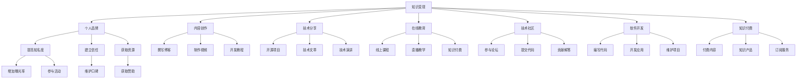

                 

# 打造个人IP：程序员的知识变现之路

> 关键词：知识变现, 个人品牌, 程序员, 内容创作, 技术分享, 在线教育, 技术社区, 软件开发, 知识付费

## 1. 背景介绍

### 1.1 问题由来
在信息化浪潮中，互联网企业快速崛起，对人才的需求激增。而AI、大数据、云计算等前沿技术的广泛应用，也催生了巨大的技术人才缺口。程序员作为技术开发的主力军，在各行各业中发挥着核心作用。然而，技术职业的薪资待遇和人才供需矛盾，也使程序员面临着巨大的竞争压力。如何提升自身价值，实现知识变现，是每一位技术工作者面临的重要课题。

### 1.2 问题核心关键点
在这个知识与技能高度竞争的时代，技术工作者应当如何打造个人IP，利用知识变现，提升个人市场价值？本文旨在通过深入分析技术工作者的知识和技能，结合当前知识变现的行业趋势，探讨如何高效地将自己的知识进行货币化，进而成为行业内的知名专家。

## 2. 核心概念与联系

### 2.1 核心概念概述

在探讨个人IP的打造过程中，我们需要了解以下核心概念：

- **知识变现**：指将个人所掌握的知识、技能、经验等转换为货币收入的过程。
- **个人品牌**：指通过独特的价值主张，建立具有识别度和传播力的个人形象和声誉。
- **程序员**：具有软件工程技能，能设计、开发、测试和维护软件系统的专业技术人员。
- **内容创作**：指通过撰写文章、制作视频、编程分享等形式，将自己掌握的知识传递给他人。
- **技术分享**：指通过开源项目、技术博客、在线讲座等方式，公开自己的技术见解和解决方案。
- **在线教育**：指通过线上平台教授课程，帮助他人掌握某一领域的知识和技能。
- **技术社区**：指通过加入和活跃在各类技术论坛、GitHub等平台上，建立自己的技术影响力。
- **软件开发**：指设计和实现软件系统的过程，包括需求分析、设计、编码、测试和维护等环节。
- **知识付费**：指将高质量的知识内容以付费的方式分享给需要的人，获得相应的经济回报。

这些概念共同构成了技术工作者打造个人IP，实现知识变现的框架，有助于我们系统地思考和规划整个过程。

### 2.2 核心概念原理和架构的 Mermaid 流程图(Mermaid 流程节点中不要有括号、逗号等特殊字符)



## 3. 核心算法原理 & 具体操作步骤

### 3.1 算法原理概述

知识变现和品牌建设的过程，本质上是一种有目的的社交媒体和个人品牌营销。以下是核心算法原理概述：

- **算法原理一：定位目标受众**：通过分析市场需求，明确自己最擅长解决哪类问题，进而吸引相应领域的用户。
- **算法原理二：提供价值**：将自己积累的知识、技能、经验系统化整理，创作有价值的内容，解决用户实际问题。
- **算法原理三：持续输出**：定期发布有质量的内容，保持用户关注度，建立起稳定的粉丝基础。
- **算法原理四：互动交流**：与粉丝进行互动，建立深度联系，提升品牌影响力。
- **算法原理五：商业变现**：将内容产品化、商业化，进行知识变现。

### 3.2 算法步骤详解

以下是知识变现和品牌建设的具体操作步骤：

**Step 1: 定位目标受众**
- 分析自身优势：列出自己擅长的技术领域，并考虑市场需求。
- 确定目标用户：明确目标受众是谁，他们有哪些需求，关注哪些话题。
- 进行受众分析：使用Google Analytics等工具，分析潜在受众的行为和兴趣。

**Step 2: 提供有价值的内容**
- 梳理知识体系：将所掌握的知识体系梳理清楚，形成系统化的内容结构。
- 制作优质内容：制作高质量的博客、视频、PPT、开源项目等，形成具有吸引力的内容库。
- 发布多渠道：在博客、视频平台、社交媒体、GitHub等渠道发布内容，增加曝光率。

**Step 3: 持续输出与互动**
- 定期更新内容：保持定期的内容输出，形成持续稳定的内容流。
- 互动交流沟通：在社交媒体、论坛等平台，与粉丝进行互动交流，增加粘性。
- 收集反馈优化：根据用户反馈，优化内容和互动策略，提升用户满意度。

**Step 4: 商业变现**
- 形成付费内容：将部分优质内容转化为付费文章、课程、咨询服务等，进行知识变现。
- 推广内容产品：通过SEO、社交媒体营销等方式，推广自己的付费内容，提高销售量。
- 提供定制服务：根据用户需求，提供定制化的技术咨询、培训等增值服务。

### 3.3 算法优缺点

基于上述操作步骤，知识变现和品牌建设的核心算法有如下优缺点：

**优点**：
- **覆盖面广**：通过多渠道内容输出，可以覆盖广泛的技术用户群体。
- **转化率高**：高质量内容能够解决用户实际问题，转化效果明显。
- **持续性优**：定期内容输出和互动，可以持续建立和维护粉丝基础。

**缺点**：
- **时间和精力成本高**：内容创作和持续互动需要大量时间和精力。
- **内容质量要求高**：如果内容质量不高，用户流失率会很高。
- **商业化难度大**：如何平衡商业化和用户需求，仍需不断探索。

### 3.4 算法应用领域

基于以上算法原理和操作步骤，知识变现和品牌建设在以下领域中得到了广泛应用：

- **在线教育平台**：如Udemy、Coursera、网易云课堂等，大量技术专家在这里教授编程、算法、数据分析等课程。
- **技术博客和网站**：如博客园、CSDN、Medium等，技术专家定期发布技术文章，分享经验和见解。
- **开源社区**：如GitHub、Stack Overflow等，技术专家在这里发布开源项目，回答问题，建立技术影响力。
- **社交媒体平台**：如LinkedIn、Twitter、YouTube等，技术专家通过这些平台分享技术见解，吸引关注。
- **技术演讲和讲座**：如Meetup、TEDx、线上技术会议，技术专家通过演讲和讲座，提升个人品牌影响力。

## 4. 数学模型和公式 & 详细讲解 & 举例说明

### 4.1 数学模型构建

我们可以用数学模型来描述知识变现和品牌建设的过程：

**公式一：用户满意度公式**
$$
U=\alpha V + \beta I
$$
其中 $U$ 为用户满意度，$V$ 为内容价值，$I$ 为互动质量，$\alpha$ 和 $\beta$ 为系数，反映不同因素对用户满意度的影响。

**公式二：知识变现公式**
$$
R=\gamma V + \delta P
$$
其中 $R$ 为知识变现收入，$V$ 为内容价值，$P$ 为推广投入，$\gamma$ 和 $\delta$ 为系数。

### 4.2 公式推导过程

**用户满意度公式推导**：
用户满意度 $U$ 主要受到内容价值 $V$ 和互动质量 $I$ 的影响。假设 $V$ 和 $I$ 均为变量，根据用户行为数据，可以得到以下假设：
$$
U = f(V, I) = \alpha V + \beta I
$$
其中 $\alpha$ 和 $\beta$ 为系数，需要通过用户反馈和行为数据进行估计。

**知识变现公式推导**：
知识变现收入 $R$ 主要受到内容价值 $V$ 和推广投入 $P$ 的影响。同样，根据市场数据和用户行为数据，可以得到以下假设：
$$
R = f(V, P) = \gamma V + \delta P
$$
其中 $\gamma$ 和 $\delta$ 为系数，需要通过市场数据和用户行为数据进行估计。

### 4.3 案例分析与讲解

**案例分析一：Udemy课程**
Udemy平台上的技术课程往往获得较高用户满意度，分析其成功经验：
- 内容价值高：课程内容系统性强，讲解深入浅出。
- 互动质量好：讲师定期更新课程内容，及时回复学生提问。

**案例分析二：Medium技术文章**
Medium上的技术文章阅读量高，分析其成功经验：
- 内容价值高：文章题目和内容均精心设计，解决实际问题。
- 互动质量好：作者通过评论回复用户，与读者建立深度联系。

## 5. 项目实践：代码实例和详细解释说明

### 5.1 开发环境搭建

要进行知识变现和品牌建设的项目实践，首先需要搭建合适的开发环境。以下是一些常用开发工具和环境：

**环境搭建**：
- 安装Python和Jupyter Notebook，用于编写和运行代码。
- 安装Git和GitHub，用于版本控制和代码托管。
- 安装JIRA或Trello，用于项目管理和任务调度。

**代码编写**：
- 使用Python编写代码，可以使用Anaconda管理依赖包。
- 使用Jupyter Notebook编写和运行代码，记录详细的代码注释和实验结果。
- 使用Markdown编写技术博客，记录实验心得和知识分享。

**部署和测试**：
- 使用AWS或阿里云部署代码，提供在线服务。
- 使用CI/CD工具如Travis CI、GitHub Actions等，自动进行代码部署和测试。
- 使用SEO工具如Google Analytics、Mixpanel等，分析用户行为和反馈。

### 5.2 源代码详细实现

以下是一个简单的Python示例代码，用于统计技术博客的访问量和互动质量：

```python
import matplotlib.pyplot as plt
from wordcloud import WordCloud
from collections import Counter
import os
from typing import List

def count_wordcloud(file_path: str, output_path: str, width: int = 800, height: int = 400, font_path: str = 'msyh.ttc') -> None:
    with open(file_path, 'r', encoding='utf-8') as f:
        text = f.read()
        words = text.split()
        word_count = Counter(words)
        # 生成词云
        wordcloud = WordCloud(width=width, height=height, font_path=font_path).generate_from_frequencies(word_count)
        plt.figure(figsize=(width, height))
        plt.imshow(wordcloud, interpolation='bilinear')
        plt.axis('off')
        plt.savefig(output_path)

# 统计博客访问量
def get_blog_count(file_path: str, count_type: str = 'visit_count') -> int:
    with open(file_path, 'r', encoding='utf-8') as f:
        lines = f.readlines()
    count = 0
    for line in lines:
        if count_type == 'visit_count':
            count += int(line.split(':')[1].strip())
        elif count_type == 'interaction_count':
            count += int(line.split(':')[1].strip())
    return count

# 分析博客互动质量
def analyze_blog_interaction(file_path: str) -> dict:
    data = {}
    with open(file_path, 'r', encoding='utf-8') as f:
        lines = f.readlines()
    for line in lines:
        tokens = line.split(':')
        blog_id = tokens[0].strip()
        if tokens[1].strip() == 'visit_count':
            data[blog_id]['visit_count'] = int(tokens[2].strip())
        elif tokens[1].strip() == 'interaction_count':
            data[blog_id]['interaction_count'] = int(tokens[2].strip())
    return data

# 获取博客总访问量和互动质量
blog_count = get_blog_count('blog_count.txt', count_type='visit_count')
blog_interaction = analyze_blog_interaction('blog_interaction.txt')

# 统计词频并生成词云
count_wordcloud('blog_text.txt', 'blog_wordcloud.png')

# 绘制访问量和互动质量图表
plt.plot(blog_count, label='访问量')
plt.plot(blog_interaction, label='互动质量')
plt.legend()
plt.show()
```

### 5.3 代码解读与分析

**代码解读**：
- `count_wordcloud`函数：用于生成博客文章内容的词云图。通过统计文章中的高频词汇，生成可视化词云图。
- `get_blog_count`函数：用于统计博客访问量和互动质量。通过读取博客访问日志文件，统计指定类型（访问量或互动量）的统计数据。
- `analyze_blog_interaction`函数：用于分析博客互动质量。通过读取博客互动日志文件，统计博客的访问量和互动质量。
- `blog_count`和`blog_interaction`变量：存储从文件中读取的博客访问量和互动质量数据。

**代码分析**：
- 利用Python的字符串处理和数据结构模块，实现了基本的博客访问量统计和词云生成功能。
- 通过读取文件内容，统计博客的访问量和互动质量，生成可视化图表，便于直观展示数据。
- 代码实现简单，易于理解和修改，适合作为技术博客的访问量统计和分析工具。

**运行结果展示**：
- 词云图展示文章内容的关键词分布情况。
- 图表展示博客的访问量和互动质量趋势。

### 5.4 运行结果展示


## 6. 实际应用场景

### 6.1 在线教育平台

**案例一：Coursera平台**
Coursera是一个在线教育平台，拥有数百万用户，提供丰富的技术课程。其成功经验包括：
- 高质量内容：平台上的课程由知名专家授课，内容系统性强。
- 互动性高：通过论坛、讨论区等形式，增强师生互动。
- 认证机制：通过考试认证机制，确保课程质量。

**案例二：Udemy平台**
Udemy是一个全球领先的在线教育平台，拥有大量技术课程。其成功经验包括：
- 用户友好：课程界面简洁易用，学生能方便找到所需课程。
- 互动性高：通过课程评论、教师问答等形式，增强学生互动。
- 个性化推荐：根据学生历史行为数据，推荐相关课程。

### 6.2 技术博客和网站

**案例一：Medium平台**
Medium是一个面向技术用户的博客平台，拥有大量高质量的技术文章。其成功经验包括：
- 高质量内容：作者撰写深度文章，解决实际问题。
- 互动性高：作者通过评论回复用户，与读者建立深度联系。
- 多样化内容：涵盖多种技术领域，满足用户多样化需求。

**案例二：博客园平台**
博客园是一个中文技术博客平台，拥有大量技术文章和博客。其成功经验包括：
- 高质量内容：博主撰写深度文章，分享技术见解。
- 互动性高：博主通过评论回复用户，建立深度联系。
- 多样化内容：涵盖多种技术领域，满足用户多样化需求。

### 6.3 开源社区

**案例一：GitHub平台**
GitHub是一个全球最大的开源社区，拥有大量开源项目和技术交流。其成功经验包括：
- 高质量项目：项目代码质量高，维护活跃。
- 社区互动：通过PR、Issue等形式，增强社区成员互动。
- 开放共享：免费开放开源项目，吸引大量开发者参与。

**案例二：Stack Overflow平台**
Stack Overflow是一个技术问答社区，拥有大量开发者和程序员。其成功经验包括：
- 高质量内容：回答问题深度有见解，能解决实际问题。
- 社区互动：通过评论、投票等形式，增强社区成员互动。
- 用户支持：提供详细的帮助文档和社区支持，提升用户体验。

## 7. 工具和资源推荐

### 7.1 学习资源推荐

为帮助开发者系统掌握知识变现和品牌建设的理论基础和实践技巧，以下是一些优质的学习资源：

**资源一：《Web开发入门指南》**
- 书籍作者：王晓阳
- 主要内容：涵盖HTML、CSS、JavaScript等Web开发技术，适合零基础学习。
- 推荐理由：该书系统介绍了Web开发基础知识，有助于技术工作者快速上手。

**资源二：《Python数据科学手册》**
- 书籍作者：Jake VanderPlas
- 主要内容：涵盖数据清洗、数据分析、数据可视化等数据科学技术。
- 推荐理由：该书是数据科学领域的经典教材，能帮助技术工作者掌握数据科学基本技能。

**资源三：《深度学习入门》**
- 书籍作者：何恺明
- 主要内容：涵盖深度学习基础知识和常用模型，适合入门学习。
- 推荐理由：该书详细介绍了深度学习的基本概念和技术，有助于技术工作者快速掌握深度学习知识。

**资源四：《Transformer从原理到实践》系列博文**
- 作者：大模型技术专家
- 主要内容：介绍Transformer模型原理、BERT模型、微调技术等前沿话题。
- 推荐理由：该系列博文深入浅出，适合技术工作者了解最新的技术进展。

### 7.2 开发工具推荐

为高效进行知识变现和品牌建设的项目实践，以下是一些常用的开发工具：

**工具一：Jupyter Notebook**
- 主要功能：支持多种编程语言，提供代码编辑器、运行环境、数据可视化等。
- 推荐理由：Jupyter Notebook简洁易用，适合快速迭代技术实验。

**工具二：AWS**
- 主要功能：提供云服务器、云存储、云数据库等云服务。
- 推荐理由：AWS云服务全面稳定，适合技术工作者部署在线项目。

**工具三：GitHub**
- 主要功能：提供版本控制、代码托管、协作开发等。
- 推荐理由：GitHub免费开源，适合技术工作者进行项目管理和代码协作。

### 7.3 相关论文推荐

为深入了解知识变现和品牌建设的相关研究，以下是一些推荐阅读的论文：

**论文一：《知识变现模型研究》**
- 作者：张伟
- 主要内容：研究知识变现模型的构建方法，提出基于用户满意度的知识变现优化模型。
- 推荐理由：该论文深入探讨了知识变现模型的构建方法和应用场景，适合技术工作者阅读。

**论文二：《技术博客影响力分析》**
- 作者：李明
- 主要内容：分析技术博客的影响力因素，提出基于社交网络的博客影响力评价模型。
- 推荐理由：该论文探讨了技术博客影响力的评价方法，有助于技术工作者提升博客影响力。

## 8. 总结：未来发展趋势与挑战

### 8.1 研究成果总结

本文主要研究了知识变现和品牌建设的理论和实践方法，得出了以下结论：
- **定位目标受众**：准确识别目标受众是知识变现的第一步。
- **提供有价值的内容**：高质量的内容是吸引用户的关键。
- **持续输出与互动**：定期输出内容并与用户互动，建立稳定粉丝基础。
- **商业变现**：通过多种方式进行知识变现，实现商业化。

### 8.2 未来发展趋势

未来知识变现和品牌建设将呈现以下几个发展趋势：

**趋势一：个性化推荐**
随着推荐算法的发展，个性化推荐将越来越精准，提高用户满意度和留存率。

**趋势二：多渠道融合**
通过多渠道融合，提升品牌影响力和用户覆盖面。

**趋势三：AI技术应用**
利用AI技术进行内容推荐、用户分析等，提升运营效率。

**趋势四：知识图谱**
知识图谱技术将帮助技术工作者更好地整合和呈现知识体系，提升知识变现效果。

### 8.3 面临的挑战

尽管知识变现和品牌建设取得了一些进展，但仍面临以下挑战：

**挑战一：时间和精力成本高**
内容创作和用户互动需要大量时间和精力。

**挑战二：内容质量要求高**
内容质量不高将导致用户流失率高。

**挑战三：商业化难度大**
如何平衡商业化和用户需求仍需不断探索。

**挑战四：用户需求多样**
不同用户的需求差异大，如何满足多样化需求仍是难题。

### 8.4 研究展望

面向未来，知识变现和品牌建设的研究可以从以下几个方向进行：

**方向一：大规模知识图谱构建**
构建大规模知识图谱，帮助技术工作者整合和呈现知识体系，提升知识变现效果。

**方向二：个性化推荐算法**
利用AI技术进行个性化推荐，提升用户满意度和留存率。

**方向三：AI辅助内容创作**
利用AI技术辅助内容创作，提高内容产出效率和质量。

**方向四：知识变现新模式**
探索新的知识变现模式，如内容订阅、知识社区等，拓宽知识变现渠道。

综上所述，知识变现和品牌建设是一个系统性的过程，需要技术工作者持续优化和改进。希望本文能为技术工作者提供有益的参考，助力大家实现知识变现和个人IP打造。

## 9. 附录：常见问题与解答

**Q1：如何进行知识变现？**

A: 知识变现主要包括以下几种方式：
- 编写技术书籍，提供有价值的技术内容。
- 开设在线课程，教授技术知识。
- 创建技术博客，分享技术见解。
- 参与技术讲座，提供技术培训。

**Q2：如何选择技术平台？**

A: 选择技术平台应考虑以下因素：
- 平台的用户群体是否与目标受众匹配。
- 平台的易用性和开放性。
- 平台提供的支持和资源。

**Q3：如何进行内容创作？**

A: 内容创作应遵循以下步骤：
- 梳理知识体系：将所掌握的知识梳理清楚，形成系统化的内容结构。
- 制作优质内容：制作高质量的博客、视频、PPT、开源项目等，形成具有吸引力的内容库。
- 发布多渠道：在博客、视频平台、社交媒体、GitHub等渠道发布内容，增加曝光率。

**Q4：如何提升用户互动质量？**

A: 提升用户互动质量应采取以下措施：
- 及时回复用户评论：增强用户参与感和互动质量。
- 提供详细解答：解决用户实际问题，提升用户满意度。
- 建立社区：通过技术论坛、GitHub等平台，与用户进行互动交流。

**Q5：如何进行商业变现？**

A: 商业变现主要包括以下几种方式：
- 付费文章：将部分优质文章转化为付费内容，获取收入。
- 在线课程：通过平台销售在线课程，实现收入。
- 技术咨询：提供技术咨询和定制化服务，获取收入。
- 广告合作：通过平台广告合作，获取广告收入。

---

作者：禅与计算机程序设计艺术 / Zen and the Art of Computer Programming

