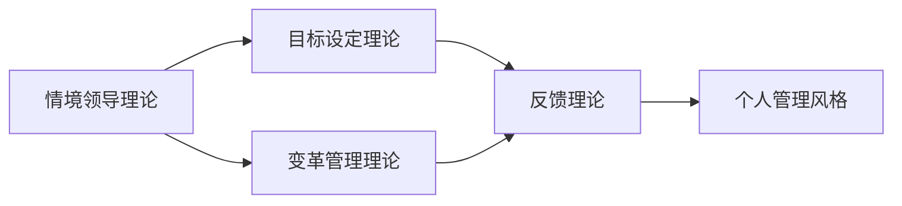

                 

## 1. 背景介绍

在当今这个快节奏、高度竞争的工作环境中，个人管理风格（Personal Management Style）对于职业成功至关重要。一个有效的管理风格不仅能提升工作效率，还能促进团队合作，增强组织灵活性。然而，要打造一个既高效又适应性强，既能满足当前需求，又能应对未来变化的管理风格，并非易事。本文将深入探讨打造个人管理风格的方法论，从核心概念、算法原理、操作步骤到实际应用，力求提供一个全面、系统的指南。

## 2. 核心概念与联系

### 2.1 核心概念概述

在探讨个人管理风格的方法论之前，我们先明确几个关键概念及其相互关系。

- **个人管理风格**：指个体在管理和领导过程中所表现出的独特的态度、行为和决策方式。这些风格通常由个体的性格、经验、价值观和技能等因素共同塑造。
- **情境领导理论**：由保罗·赫塞（Paul Hersey）和肯尼思·布兰查德（Kenneth Blanchard）提出，强调根据情境（如任务复杂性、团队成熟度）调整领导风格。
- **目标设定理论**：由埃德温·洛克（Edwin Locke）提出，主张设定明确、具体、可达成的目标，以提高个人和团队的表现。
- **反馈理论**：包括正反馈和负反馈机制，通过及时、具体的反馈促进个人和团队持续改进。
- **变革管理理论**：关注如何有效地引导组织和个体适应变化，保持组织的竞争力和个体的适应性。

这些概念之间的逻辑关系可以通过以下Mermaid流程图来展示：



这个流程图展示了个人管理风格理论的各个关键组成部分及其相互作用：情境领导理论提供适应的框架，目标设定理论提供清晰的方向，反馈理论提供改进的工具，变革管理理论提供应对变化的策略，最终塑造了个体独特且高效的管理风格。

## 3. 核心算法原理 & 具体操作步骤

### 3.1 算法原理概述

打造个人管理风格的方法论基于以下几个核心算法原理：

1. **情境感知与适应**：根据情境调整管理风格，以适应不同的任务和团队需求。
2. **目标设定与分解**：设定明确、可衡量的目标，并通过SMART原则（Specific, Measurable, Achievable, Relevant, Time-bound）分解为可操作的任务。
3. **持续反馈与调整**：通过定期反馈和调整来优化管理行为，确保目标的达成。
4. **变革管理与创新**：引入变革管理理论，持续监测环境变化，适应新技术和新方法。

### 3.2 算法步骤详解

基于上述原理，打造个人管理风格的步骤如下：

1. **情境评估**：评估当前任务的特点（如复杂性、资源需求）和团队的状态（如技能水平、合作能力）。
2. **确定目标**：根据情境评估结果设定具体的、可达成的目标，并通过SMART原则进行分解。
3. **选择合适的领导风格**：根据情境评估和目标设定选择合适的领导风格（如指令型、支持型、参与型、授权型）。
4. **实施与监控**：实施领导行为，并通过定期反馈监控进展，及时调整策略。
5. **持续改进**：引入变革管理理论，定期评估和调整目标、策略，以适应环境变化。

### 3.3 算法优缺点

打造个人管理风格的方法论具有以下优点：

- **灵活性高**：根据不同情境和任务调整管理风格，提高适应性。
- **目标明确**：通过SMART目标设定，提升工作效率和团队绩效。
- **反馈及时**：通过持续反馈机制，促进团队成员的改进和成长。
- **适应性强**：引入变革管理理论，帮助团队适应环境变化，保持竞争力和创新力。

同时，该方法也存在一些局限性：

- **复杂度高**：需要综合考虑情境、目标、反馈和变革多个维度，操作复杂。
- **实施成本高**：需要持续的监控和调整，需要一定的资源和时间投入。
- **理论性强**：对于缺乏理论基础的团队，可能需要额外的培训和指导。

### 3.4 算法应用领域

打造个人管理风格的方法论适用于多个领域，包括但不限于：

- **项目管理**：通过调整管理风格和目标设定，提升项目团队的工作效率和项目成功率。
- **人力资源管理**：通过适应不同的团队阶段和员工需求，提升员工满意度和组织绩效。
- **组织变革管理**：通过引入变革管理理论，帮助组织适应市场和技术的变化，保持竞争优势。
- **个人职业发展**：通过设定职业目标和持续反馈，促进个人的职业成长和发展。

## 4. 数学模型和公式 & 详细讲解 & 举例说明

### 4.1 数学模型构建

打造个人管理风格的方法论可以构建一个多变量数学模型来量化和管理。设情境为 $S$，目标为 $T$，领导风格为 $L$，反馈为 $F$，变革管理策略为 $C$，则模型可表示为：

$$
\text{PM} = f(S, T, L, F, C)
$$

其中 $f$ 为多变量函数，映射上述各个因素以生成最终的管理风格 $\text{PM}$。

### 4.2 公式推导过程

以情境领导理论为例，推导目标设定理论在管理风格中的影响。假设情境 $S$ 可以分解为任务复杂度 $T_C$ 和团队成熟度 $T_M$，目标 $T$ 可以分解为任务完成时间 $T_T$ 和质量 $T_Q$。根据情境领导理论，领导风格 $L$ 由情境 $S$ 决定，并通过目标 $T$ 进一步影响管理风格的选择。

设情境感知函数为 $g(S)$，目标设定函数为 $h(T)$，则领导风格选择函数为 $p(L, S, T) = g(S) \times h(T)$。在实际应用中，目标 $T$ 需要通过SMART原则进行设定，确保其可操作性。

### 4.3 案例分析与讲解

假设某项目团队正在开发一个复杂的软件产品，面临高任务复杂度和中等团队成熟度。通过情境评估，确定使用参与型领导风格。设定的目标是：在六个月内交付高质量的产品，并在三个月内完成项目中期评估。

根据目标设定理论，该团队可以分解目标为：

- 每月完成软件的核心功能开发。
- 每两周进行一次代码评审，确保代码质量。
- 每月进行一次项目状态评估，及时调整策略。

通过持续反馈和调整，团队在规定时间内成功交付了高质量的产品，并在后续的维护和更新中表现出色。

## 5. 项目实践：代码实例和详细解释说明

### 5.1 开发环境搭建

为实践上述方法论，我们需要搭建一个项目管理工具，以便跟踪和管理任务、目标、反馈和变革策略。推荐的工具包括：

- **JIRA**：功能强大的项目管理平台，支持敏捷开发和Scrum框架。
- **Trello**：简单易用的看板工具，适合小型团队的项目管理。
- **Microsoft Project**：企业级的项目管理软件，支持复杂的项目计划和资源分配。

### 5.2 源代码详细实现

以JIRA为例，展示如何使用其API实现项目管理：

```python
from jira import JIRA

jira = JIRA('https://your-jira-instance.com', auth=('your-username', 'your-api-token'))

def create_project(project_name, project_description):
    project = jira.create_project(
        key=project_name,
        name=project_name,
        description=project_description,
        issue_type='Task'
    )
    return project

def add_task(task_name, project_key, issue_type, priority, description):
    issue = jira.create_issue(
        project={'key': project_key},
        summary=task_name,
        labels=['task'],
        priority=priority,
        description=description
    )
    return issue

def update_task(issue_key, status):
    jira.update_issue(
        issue_key,
        status={'self': 'https://your-jira-instance.com/rest/api/2/issue/' + issue_key},
        status={"name": status}
    )
```

### 5.3 代码解读与分析

上述代码展示了如何使用JIRA的API创建项目、添加任务和更新任务状态。通过这些代码，团队可以高效地进行项目管理，确保每个任务都有明确的目标和状态，并通过持续的反馈和调整，优化项目管理效果。

### 5.4 运行结果展示

运行上述代码后，可以在JIRA的项目页面上查看新创建的任务和更新后的任务状态，确保每个任务都在按计划进行，并通过定期反馈和调整，不断优化项目管理过程。

## 6. 实际应用场景

### 6.1 智能制造

在智能制造领域，打造个人管理风格的方法论可以应用于工厂的精益生产管理。通过情境感知，识别生产线的瓶颈和资源需求，设定具体、可达成的生产目标，并根据实际情况调整管理风格。例如，在紧急任务时采用指令型领导风格，在常态下采用支持型领导风格，确保生产效率和质量。

### 6.2 金融科技

在金融科技领域，该方法论可以应用于风险管理和客户服务。通过情境评估，识别不同的风险类型和客户需求，设定具体的风险控制目标和客户服务目标，并根据反馈及时调整管理策略。例如，在金融危机期间，采用更严格的授权型领导风格，在日常服务中采用更灵活的支持型领导风格，确保风险可控和客户满意度。

### 6.3 零售电商

在零售电商领域，该方法论可以应用于供应链管理和客户关系管理。通过情境感知，识别供应链的不同环节和客户需求，设定具体的供应链优化目标和客户服务目标，并根据反馈及时调整管理策略。例如，在电商旺季时，采用更积极的支持型领导风格，在淡季时采用更灵活的参与型领导风格，确保供应链的高效运作和客户关系的持续维护。

### 6.4 未来应用展望

随着数字技术的发展，打造个人管理风格的方法论将在更多领域得到应用。未来，该方法论将结合人工智能和大数据分析，提供更智能、更个性化的管理建议，进一步提升管理效果。例如，通过大数据分析识别管理风格与团队绩效之间的关联，优化领导风格的选择；通过机器学习预测情境变化，提前调整管理策略，保持组织和个人的适应性。

## 7. 工具和资源推荐

### 7.1 学习资源推荐

为了帮助开发者系统掌握个人管理风格的方法论，这里推荐一些优质的学习资源：

1. **情境领导理论**：《情境领导》（Paul Hersey）——介绍了情境领导理论的核心理念和方法。
2. **目标设定理论**：《目标设定理论》（Edwin Locke）——详细讲解了SMART原则在目标设定中的应用。
3. **反馈理论**：《反馈的艺术》（Douglas McGregor）——探讨了正反馈和负反馈在管理中的应用。
4. **变革管理理论**：《变革管理》（John Kotter）——介绍了变革管理的经典框架和实践方法。
5. **项目管理工具**：《项目管理实战》——介绍了常用的项目管理工具及其使用方法。

通过这些资源的学习实践，相信你一定能够快速掌握个人管理风格的方法论，并将其应用于实际的管理工作中。

### 7.2 开发工具推荐

高效的开发离不开优秀的工具支持。以下是几款用于个人管理风格实践的常用工具：

1. **JIRA**：功能强大的项目管理平台，支持敏捷开发和Scrum框架。
2. **Trello**：简单易用的看板工具，适合小型团队的项目管理。
3. **Microsoft Project**：企业级的项目管理软件，支持复杂的项目计划和资源分配。
4. **Asana**：直观易用的项目管理工具，支持任务分配和进度跟踪。
5. **Slack**：团队沟通和协作工具，支持实时消息和文件共享。

合理利用这些工具，可以显著提升个人管理风格实践的效率，加快创新迭代的步伐。

### 7.3 相关论文推荐

个人管理风格的方法论源于学界的持续研究。以下是几篇奠基性的相关论文，推荐阅读：

1. **情境领导理论**：《情境领导》（Paul Hersey）——介绍了情境领导理论的核心理念和方法。
2. **目标设定理论**：《目标设定理论》（Edwin Locke）——详细讲解了SMART原则在目标设定中的应用。
3. **反馈理论**：《反馈的艺术》（Douglas McGregor）——探讨了正反馈和负反馈在管理中的应用。
4. **变革管理理论**：《变革管理》（John Kotter）——介绍了变革管理的经典框架和实践方法。
5. **项目管理方法论**：《项目管理实战》——介绍了常用的项目管理方法和工具。

这些论文代表了个体管理风格理论的发展脉络。通过学习这些前沿成果，可以帮助研究者把握学科前进方向，激发更多的创新灵感。

## 8. 总结：未来发展趋势与挑战

### 8.1 总结

本文对打造个人管理风格的方法论进行了全面系统的介绍。首先阐述了情境领导理论、目标设定理论、反馈理论和变革管理理论的基本概念及其相互作用。其次，从原理到实践，详细讲解了情境感知与适应、目标设定与分解、持续反馈与调整以及变革管理与创新的核心步骤，给出了项目管理实践的完整代码实例。同时，本文还探讨了该方法论在智能制造、金融科技、零售电商等诸多领域的应用前景，展示了其广泛的应用价值。

通过本文的系统梳理，可以看到，打造个人管理风格的方法论是一个系统性、理论性、实践性相结合的管理框架，能够帮助个体和组织在不同情境下，灵活调整管理策略，提升管理效率和绩效。未来，伴随数字技术的发展，该方法论将进一步结合人工智能和大数据分析，提供更智能、更个性化的管理建议，为组织的可持续发展提供坚实的理论基础和实践指南。

### 8.2 未来发展趋势

展望未来，打造个人管理风格的方法论将呈现以下几个发展趋势：

1. **智能化管理**：结合人工智能和大数据分析，提供个性化的管理建议，提升管理效率和效果。
2. **自动化管理**：引入自动化工具和系统，减少人为干预，提高管理过程的透明度和可追溯性。
3. **多模态管理**：结合视觉、语音等多模态数据，增强管理决策的全面性和准确性。
4. **区块链管理**：利用区块链技术，保障管理过程和数据的透明、可信和安全。
5. **混合管理**：结合传统管理和数字化管理，形成混合管理模式，提升组织的灵活性和适应性。

以上趋势凸显了个人管理风格方法论的广阔前景。这些方向的探索发展，必将进一步提升组织的竞争力和个体的管理效果，为组织的可持续发展提供新的动力。

### 8.3 面临的挑战

尽管个人管理风格的方法论已经取得了一定的成果，但在迈向更加智能化、自动化的管理过程中，它仍面临诸多挑战：

1. **数据隐私和安全**：在引入大数据和AI技术的同时，需要严格保护数据隐私和安全，防止数据泄露和滥用。
2. **技术门槛高**：需要引入新技术，如AI、区块链等，对技术基础要求较高，可能存在一定的学习成本和技术障碍。
3. **人员培训**：新技术的应用需要相应的人员培训和适应，可能面临人员抵触和技术接受度的问题。
4. **文化适应**：不同的组织文化对新技术的接受度不同，需要逐步推动文化变革，促进新技术的普及和应用。

尽管存在这些挑战，但通过持续的技术创新和组织变革，相信这些挑战终将得到克服，个人管理风格的方法论必将在未来管理实践中发挥更大的作用。

### 8.4 研究展望

面对个人管理风格方法论面临的挑战，未来的研究需要在以下几个方面寻求新的突破：

1. **引入新技术**：结合最新的人工智能、区块链等技术，提升管理的智能化和自动化水平。
2. **优化工具和系统**：开发更加智能、易用的管理工具和系统，降低技术门槛，提高管理效率。
3. **培养跨界人才**：培养既懂管理又懂技术的人才，促进管理与技术的深度融合。
4. **推动文化变革**：通过组织变革和文化建设，促进新技术在组织中的广泛应用。

这些研究方向将有助于进一步提升个人管理风格的方法论，为组织和个体的管理实践提供更加科学、高效、智能的管理工具和方法。

## 9. 附录：常见问题与解答

**Q1: 如何选择合适的情境感知模型？**

A: 情境感知模型应根据组织的实际需求和环境特点进行选择。常用的情境感知模型包括环境感知模型（如PEST分析）、竞争环境模型（如五力模型）和资源感知模型（如SWOT分析）。这些模型可以帮助组织识别外部环境和内部资源，为情境感知提供数据支持。

**Q2: 如何设定具体的、可达成的目标？**

A: 设定具体的、可达成的目标需要遵循SMART原则，即Specific（具体）、Measurable（可衡量）、Achievable（可达成）、Relevant（相关性）、Time-bound（有时间限制）。目标设定应基于情境感知，结合组织的战略方向和资源情况，确保目标的可操作性和可达性。

**Q3: 如何应对快速变化的环境？**

A: 快速变化的环境要求组织具有较强的适应性和灵活性。应对快速变化的环境可以通过引入变革管理理论，定期评估环境变化，及时调整管理策略。此外，建立弹性的组织结构，如敏捷组织、虚拟组织等，可以提高组织的适应性和反应速度。

**Q4: 如何确保反馈机制的有效性？**

A: 确保反馈机制的有效性需要建立开放的反馈文化，鼓励员工和管理层之间的双向交流。反馈应具体、及时、建设性，并定期进行反馈分析，总结反馈结果和改进措施。同时，引入反馈工具，如360度反馈、在线问卷等，可以提升反馈的效率和覆盖面。

**Q5: 如何衡量管理风格的有效性？**

A: 衡量管理风格的有效性需要建立系统的评价指标，如员工满意度、项目成功率、团队绩效等。通过定期评估和管理风格的改进，确保管理风格与组织目标和环境变化相适应。此外，引入数据分析工具，如KPI指标分析、情感分析等，可以更全面地评估管理风格的效果。

总之，打造个人管理风格的方法论是一个动态、持续优化的过程，需要根据组织的具体情况和环境变化进行调整和优化。通过系统化的管理方法和工具，提升组织的竞争力和个体的管理效率，为组织的可持续发展提供坚实的基础。

