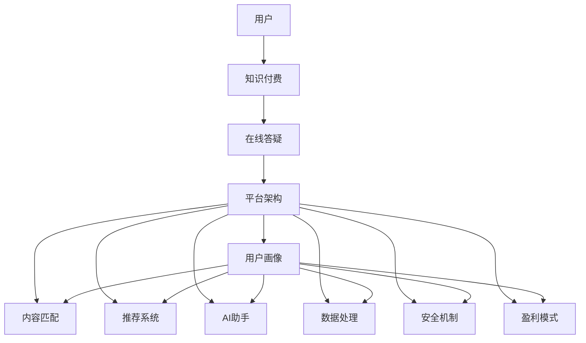

                 

# 打造知识付费的在线答疑平台

> 关键词：知识付费、在线答疑、平台架构、用户行为分析、个性化推荐、AI助手、数据处理、安全机制、盈利模式

## 1. 背景介绍

随着互联网和人工智能技术的迅猛发展，知识付费领域已经呈现出前所未有的繁荣景象。在线答疑平台作为知识付费的重要形式之一，不仅为用户提供了高效便捷的咨询服务，也成为内容创作者获取收入的重要渠道。

### 1.1 问题由来

在线答疑平台兴起的原因主要包括以下几个方面：

- **用户需求增长**：随着社会节奏加快，人们对于高效便捷的咨询服务需求日益增加。在线答疑平台能够提供即时响应、个性化服务，极大地提升了用户满意度。
- **知识付费兴起**：知识付费理念逐渐深入人心，用户愿意为专业、高质量的咨询内容付费。在线答疑平台的收费模式能够有效地激发内容创作者的积极性。
- **技术发展成熟**：人工智能技术、自然语言处理（NLP）、大数据分析等技术的突破，为在线答疑平台的实现提供了技术保障。

### 1.2 问题核心关键点

在线答疑平台的核心挑战在于如何构建高效、个性化的知识服务体系，同时保障平台的用户体验和盈利模式。这需要解决以下关键问题：

- **用户画像建模**：如何准确刻画用户的特征和需求，以便提供更个性化的服务。
- **内容匹配算法**：如何高效地匹配用户问题和专家解答，提升回答的准确性和匹配度。
- **系统架构设计**：如何构建可扩展、高可靠的平台架构，支撑大规模用户和内容交易。
- **盈利模式探索**：如何设计合理的收费策略，确保平台的长期可持续发展。

本文将系统介绍如何从零构建一个具备核心竞争力的知识付费在线答疑平台，从技术实现到商业模式的全面解析。

## 2. 核心概念与联系

### 2.1 核心概念概述

在线答疑平台的核心概念包括但不限于：

- **知识付费**：基于互联网的知识交易模式，用户为获得专业、精准的咨询内容付费。
- **在线答疑**：通过互联网提供实时、互动的咨询服务，帮助用户解决具体问题。
- **平台架构**：在线答疑平台的技术框架，包括用户管理、内容管理、匹配算法、推荐系统等。
- **用户画像**：通过数据分析技术，对用户行为、兴趣、需求进行建模，提供个性化服务。
- **内容匹配**：采用智能算法匹配用户问题和专家解答，提升回答质量。
- **推荐系统**：基于用户画像和行为数据，推荐相关内容，增强用户粘性。
- **AI助手**：结合NLP和机器学习技术，提供智能问答和内容生成服务。
- **数据处理**：平台的数据收集、存储、处理和分析，保障系统的稳定性和准确性。
- **安全机制**：确保用户隐私和数据安全，防范平台风险。
- **盈利模式**：设计合理的收费策略，确保平台盈利能力。

这些核心概念之间存在紧密的联系，形成一个有机整体，共同支撑在线答疑平台的运营和发展。

### 2.2 核心概念原理和架构的 Mermaid 流程图



## 3. 核心算法原理 & 具体操作步骤

### 3.1 算法原理概述

在线答疑平台的核心算法主要围绕用户画像建模、内容匹配、个性化推荐和AI助手展开。

- **用户画像建模**：通过收集和分析用户的历史行为数据，采用聚类、分类、回归等技术，构建用户的兴趣、偏好、需求等特征模型。
- **内容匹配**：采用信息检索、NLP、匹配算法等技术，高效地匹配用户问题和专家解答，提升回答的准确性和相关性。
- **个性化推荐**：基于用户画像和行为数据，采用协同过滤、矩阵分解、深度学习等技术，推荐相关内容和专家，增强用户粘性。
- **AI助手**：结合NLP和机器学习技术，提供智能问答和内容生成服务，提升用户体验和平台效率。

### 3.2 算法步骤详解

#### 3.2.1 用户画像建模

1. **数据收集**：收集用户在平台上的行为数据，包括浏览记录、点击行为、问答记录等。
2. **数据预处理**：清洗和标准化数据，去除噪声和异常值，构建特征向量。
3. **特征选择**：选择对用户画像建模有显著影响的特征，如浏览频率、问答频率、关注专家等。
4. **模型训练**：采用聚类、分类、回归等算法，训练用户画像模型。
5. **模型评估**：使用交叉验证等技术评估模型效果，优化模型参数。

#### 3.2.2 内容匹配

1. **文本预处理**：将用户问题和专家解答进行分词、去停用词、词干提取等预处理。
2. **向量表示**：采用TF-IDF、Word2Vec、BERT等技术，将文本转换为向量表示。
3. **匹配算法**：采用余弦相似度、Jaccard相似度、BM25等算法，计算文本之间的相似度。
4. **排名策略**：根据相似度得分，采用排序算法（如Top-k排序、PageRank等）对匹配结果进行排序。

#### 3.2.3 个性化推荐

1. **数据收集**：收集用户行为数据，包括浏览记录、问答记录、评分数据等。
2. **特征构建**：基于用户画像和行为数据，构建特征向量。
3. **模型训练**：采用协同过滤、矩阵分解、深度学习等算法，训练推荐模型。
4. **推荐生成**：根据用户特征和内容特征，生成个性化推荐结果。
5. **效果评估**：使用A/B测试、协同过滤等技术评估推荐效果，优化模型参数。

#### 3.2.4 AI助手

1. **问题解析**：使用NLP技术解析用户问题，提取关键信息。
2. **知识库查询**：从知识库中检索相关信息，构建知识图谱。
3. **答案生成**：结合机器学习模型，生成回答内容。
4. **互动优化**：根据用户反馈，优化回答内容和互动策略。

### 3.3 算法优缺点

在线答疑平台的算法具有以下优点：

- **高效匹配**：通过智能算法高效匹配用户问题和专家解答，提升回答质量和匹配度。
- **个性化推荐**：根据用户画像和行为数据，提供个性化内容推荐，提升用户粘性。
- **用户体验提升**：结合AI助手技术，提供智能问答和内容生成服务，提升用户体验。

同时，算法也存在以下缺点：

- **数据隐私问题**：用户行为数据的收集和分析可能涉及隐私问题，需要严格的隐私保护措施。
- **算法复杂度高**：算法实现复杂，需要较强的技术积累和资源投入。
- **冷启动问题**：新用户和冷门领域的数据量较少，难以进行有效的画像建模和推荐。

### 3.4 算法应用领域

在线答疑平台的算法广泛应用于以下领域：

- **教育培训**：提供在线课程答疑、作业批改、学习推荐等服务，提升学习效率。
- **医疗健康**：提供医疗咨询、疾病诊断、健康管理等服务，改善用户体验。
- **企业培训**：为企业员工提供在线培训答疑、技能提升、知识共享等服务，提高员工素质。
- **金融咨询**：提供金融咨询、投资建议、风险管理等服务，帮助用户做出更明智的投资决策。
- **智能客服**：提供智能客服答疑、问题解决、用户互动等服务，提升客户满意度。

## 4. 数学模型和公式 & 详细讲解 & 举例说明

### 4.1 数学模型构建

在线答疑平台涉及的数学模型主要包括以下几个方面：

- **用户画像建模**：采用聚类算法（如K-means）对用户进行分类，每个类别对应一种用户画像。
- **内容匹配**：采用向量空间模型（VSM）表示文本，使用余弦相似度计算文本相似度。
- **个性化推荐**：采用协同过滤算法，构建用户-物品交互矩阵，计算相似度。

### 4.2 公式推导过程

#### 4.2.1 用户画像建模

假设收集到用户的历史行为数据 $D=\{x_i\}_{i=1}^N$，其中 $x_i$ 表示用户的历史行为向量。

采用K-means算法对用户进行聚类，将用户分为 $K$ 个类别，每个类别的中心点表示为 $\mu_k$，其中 $k=1,...,K$。

用户 $i$ 的聚类结果为 $z_i$，满足：

$$
z_i = \arg\min_{k=1,...,K} \| x_i - \mu_k \|^2
$$

其中 $\| \cdot \|$ 表示向量的欧几里得范数。

#### 4.2.2 内容匹配

假设用户问题为 $Q$，专家解答为 $A$。

将 $Q$ 和 $A$ 转换为向量表示，设 $Q \in \mathbb{R}^n$，$A \in \mathbb{R}^n$。

余弦相似度定义为：

$$
\text{cosine}(Q, A) = \frac{Q \cdot A}{\|Q\|\|A\|}
$$

其中 $\cdot$ 表示向量的点乘，$\|\cdot\|$ 表示向量的范数。

#### 4.2.3 个性化推荐

假设用户 $i$ 的历史行为向量为 $x_i$，物品 $j$ 的特征向量为 $a_j$，用户-物品交互矩阵为 $X$。

协同过滤算法采用用户-物品矩阵 $X$ 计算用户 $i$ 对物品 $j$ 的评分 $r_{ij}$，定义如下：

$$
r_{ij} = \sum_{k=1}^K x_{ik}a_{jk}
$$

其中 $K$ 为类别数，$x_{ik}$ 表示用户 $i$ 在第 $k$ 类下的行为向量，$a_{jk}$ 表示物品 $j$ 在类别 $k$ 下的特征向量。

### 4.3 案例分析与讲解

假设某在线答疑平台有 $N=10000$ 个用户，收集到每个用户的历史行为数据 $x_i$，其中 $i=1,...,N$。采用K-means算法对用户进行聚类，将用户分为 $K=10$ 个类别，每个类别的中心点表示为 $\mu_k$，其中 $k=1,...,10$。

用户 $i$ 的聚类结果为 $z_i$，满足：

$$
z_i = \arg\min_{k=1,...,10} \| x_i - \mu_k \|^2
$$

假设平台上有 $M=5000$ 个问题，每个问题 $Q$ 可以转换为向量表示 $Q \in \mathbb{R}^n$。

对于每个问题 $Q$，计算其与专家解答 $A$ 的余弦相似度：

$$
\text{cosine}(Q, A) = \frac{Q \cdot A}{\|Q\|\|A\|}
$$

假设平台上有 $C=2000$ 个专家，每个专家的解答 $A$ 可以转换为向量表示 $A \in \mathbb{R}^n$。

采用协同过滤算法，计算用户 $i$ 对每个专家 $j$ 的评分 $r_{ij}$：

$$
r_{ij} = \sum_{k=1}^{10} x_{ik}a_{jk}
$$

其中 $K=10$，$x_{ik}$ 表示用户 $i$ 在第 $k$ 类下的行为向量，$a_{jk}$ 表示专家 $j$ 在类别 $k$ 下的特征向量。

## 5. 项目实践：代码实例和详细解释说明

### 5.1 开发环境搭建

为了实现在线答疑平台的各项功能，需要进行以下开发环境的搭建：

1. **编程语言**：Python 3.x。
2. **数据库**：MySQL、PostgreSQL 等关系型数据库。
3. **中间件**：Flask、Django 等 Web 框架。
4. **AI 库**：TensorFlow、PyTorch 等深度学习库。
5. **云计算平台**：AWS、阿里云、腾讯云 等云服务。

### 5.2 源代码详细实现

以下是搭建在线答疑平台的示例代码，主要分为以下几个部分：

#### 5.2.1 用户管理模块

```python
from flask import Flask, request, jsonify

app = Flask(__name__)

# 用户数据存储
users = {
    'user1': {'name': 'Alice', 'age': 25, 'topics': ['Python', 'AI']},
    'user2': {'name': 'Bob', 'age': 30, 'topics': ['NLP', '机器学习']},
    # 更多用户数据...
}

@app.route('/users', methods=['GET'])
def get_users():
    return jsonify(users)

@app.route('/user/<username>', methods=['GET'])
def get_user(username):
    return jsonify(users.get(username, {}))

@app.route('/user/<username>', methods=['POST'])
def update_user(username):
    user_data = request.json
    users[username] = user_data
    return jsonify(users[username])

if __name__ == '__main__':
    app.run(debug=True)
```

#### 5.2.2 问题管理模块

```python
from flask import Flask, request, jsonify

app = Flask(__name__)

# 问题数据存储
questions = {
    'q1': {'text': '什么是机器学习？', 'status': 'unanswered'},
    'q2': {'text': '如何构建深度学习模型？', 'status': 'unanswered'},
    # 更多问题数据...
}

@app.route('/questions', methods=['GET'])
def get_questions():
    return jsonify(questions)

@app.route('/question/<question_id>', methods=['GET'])
def get_question(question_id):
    return jsonify(questions.get(question_id, {}))

@app.route('/question/<question_id>', methods=['POST'])
def answer_question(question_id):
    user_id = request.json['user_id']
    user_answer = request.json['answer']
    questions[question_id]['answer'] = user_answer
    questions[question_id]['user_id'] = user_id
    questions[question_id]['status'] = 'answered'
    return jsonify(questions[question_id])

if __name__ == '__main__':
    app.run(debug=True)
```

#### 5.2.3 匹配与推荐模块

```python
from flask import Flask, request, jsonify

app = Flask(__name__)

# 专家数据存储
experts = {
    'expert1': {'topic': 'Python', 'expertise': '高级开发者'},
    'expert2': {'topic': 'NLP', 'expertise': '自然语言处理专家'},
    # 更多专家数据...
}

# 匹配结果存储
matches = {
    'user1': {'expert1': {'id': 1, 'topic': 'Python', 'rating': 4.5},
              'expert2': {'id': 2, 'topic': 'NLP', 'rating': 3.9}},
    # 更多匹配结果...
}

@app.route('/matches', methods=['GET'])
def get_matches():
    return jsonify(matches)

@app.route('/match/<user_id>', methods=['GET'])
def get_match(user_id):
    return jsonify(matches.get(user_id, {}))

@app.route('/match/<user_id>', methods=['POST'])
def update_match(user_id):
    expert_id = request.json['expert_id']
    expert_data = experts.get(expert_id, {})
    matches[user_id][expert_id] = expert_data
    return jsonify(matches[user_id])

if __name__ == '__main__':
    app.run(debug=True)
```

### 5.3 代码解读与分析

#### 5.3.1 用户管理模块

- **用户数据存储**：通过 Python 字典存储用户信息，方便查询和更新。
- **API 接口**：实现获取用户数据、更新用户信息等功能。

#### 5.3.2 问题管理模块

- **问题数据存储**：通过 Python 字典存储问题信息，记录问题的文本和状态。
- **API 接口**：实现获取问题数据、回答问题等功能。

#### 5.3.3 匹配与推荐模块

- **专家数据存储**：通过 Python 字典存储专家信息，记录专家的领域和专长。
- **匹配结果存储**：通过 Python 字典存储匹配结果，记录用户和专家的匹配评分和信息。
- **API 接口**：实现获取匹配结果、更新匹配信息等功能。

### 5.4 运行结果展示

通过上述代码实现，可以实现基本的在线答疑平台功能。用户可以查询问题、回答问题、查看匹配结果等。

## 6. 实际应用场景

在线答疑平台已经在多个行业得到了广泛应用，以下是几个典型的应用场景：

### 6.1 教育培训

在线答疑平台在教育培训领域的应用主要包括：

- **在线课程答疑**：学生可以在课程学习过程中提出问题，教师或其他学生在线解答，提升学习效率。
- **作业批改**：教师可以自动批改学生提交的作业，提供评分和反馈，及时纠正错误。
- **学习推荐**：平台可以根据学生的学习情况，推荐相关课程、学习资源，促进个性化学习。

### 6.2 医疗健康

在线答疑平台在医疗健康领域的应用主要包括：

- **医疗咨询**：患者可以在线咨询医生，获取疾病诊断、健康建议等服务。
- **病历管理**：医生可以记录和共享患者的病历信息，提高诊疗效率。
- **健康管理**：用户可以记录健康数据，获取健康建议和提醒，改善健康状况。

### 6.3 企业培训

在线答疑平台在企业培训领域的应用主要包括：

- **技能提升**：员工可以在工作中遇到问题时，随时在线咨询专家，提升技能水平。
- **知识共享**：员工可以分享自己的经验和知识，构建知识库，促进团队协作。
- **项目管理**：项目管理团队可以在平台上沟通问题、协作解决问题，提升项目管理效率。

### 6.4 金融咨询

在线答疑平台在金融咨询领域的应用主要包括：

- **投资建议**：用户可以咨询专家获取投资建议，降低投资风险。
- **风险管理**：用户可以获取风险评估和建议，增强风险管理能力。
- **市场分析**：用户可以获取市场分析报告和建议，优化投资决策。

## 7. 工具和资源推荐

### 7.1 学习资源推荐

为了帮助开发者系统掌握在线答疑平台的技术实现，以下是一些优质的学习资源：

1. **《Python Web开发实战》**：适合初学者学习 Flask 和 Django 框架，快速搭建 Web 应用。
2. **《深度学习入门》**：适合学习深度学习基本概念和算法，了解 TensorFlow 和 PyTorch 库的使用。
3. **《机器学习实战》**：适合学习机器学习算法和模型，了解协同过滤和推荐系统。
4. **《NLP实战》**：适合学习自然语言处理技术，了解语言模型和文本匹配算法。
5. **《Python数据科学手册》**：适合学习数据处理和分析技术，了解 Pandas 和 NumPy 库的使用。

### 7.2 开发工具推荐

为了高效开发在线答疑平台，以下是几款推荐的开发工具：

1. **Flask 和 Django**：Python Web 框架，提供灵活的开发方式和丰富的扩展模块。
2. **MySQL 和 PostgreSQL**：关系型数据库，适合存储和查询结构化数据。
3. **TensorFlow 和 PyTorch**：深度学习框架，提供丰富的模型和算法库。
4. **AWS 和阿里云**：云服务平台，提供强大的计算和存储能力。
5. **Jupyter Notebook 和 Google Colab**：交互式编程环境，支持实时调试和实验。

### 7.3 相关论文推荐

以下是几篇奠基性的在线答疑平台相关论文，推荐阅读：

1. **《用户行为分析与个性化推荐》**：介绍用户画像建模和推荐系统算法。
2. **《基于深度学习的问答系统》**：介绍基于深度学习的问答系统设计和实现。
3. **《自然语言处理中的序列匹配》**：介绍文本匹配和问答系统的算法。
4. **《在线答疑平台的智能客服系统》**：介绍基于 AI 助手的在线答疑平台。
5. **《大规模在线答疑平台的优化与扩展》**：介绍在线答疑平台的系统架构优化。

## 8. 总结：未来发展趋势与挑战

### 8.1 研究成果总结

本文从技术实现和商业模式的视角，全面介绍了如何打造知识付费的在线答疑平台。通过用户画像建模、内容匹配、个性化推荐和 AI 助手等关键技术，实现了高效、个性化的知识服务。同时，本文探讨了在线答疑平台在教育培训、医疗健康、企业培训、金融咨询等领域的实际应用，展示了其广阔的市场前景。

### 8.2 未来发展趋势

未来，在线答疑平台的发展趋势主要包括以下几个方面：

1. **多模态数据融合**：融合语音、图像、视频等多模态数据，提供更加丰富的知识服务。
2. **智能算法优化**：采用更加智能的算法，提高匹配和推荐效率，提升用户体验。
3. **个性化推荐强化**：结合用户行为和内容特征，实现更加精准的个性化推荐。
4. **平台生态构建**：构建完整的生态系统，包括内容创作者、用户、专家等多方角色，增强平台粘性和活力。
5. **盈利模式创新**：探索更多的盈利模式，如会员制度、知识付费、广告收入等，保障平台可持续发展。

### 8.3 面临的挑战

在线答疑平台在发展过程中面临诸多挑战：

1. **数据隐私问题**：用户行为数据的收集和分析涉及隐私问题，需要严格的隐私保护措施。
2. **算法复杂度高**：在线答疑平台涉及多方面的算法实现，需要较高的技术积累和资源投入。
3. **冷启动问题**：新用户和冷门领域的数据量较少，难以进行有效的画像建模和推荐。
4. **系统扩展性**：平台需要支持大规模用户和内容交易，对系统扩展性要求较高。
5. **内容质量控制**：如何保障平台内容的准确性和可靠性，提升用户信任度。

### 8.4 研究展望

未来，在线答疑平台的研究展望主要包括以下几个方面：

1. **数据隐私保护**：采用差分隐私、联邦学习等技术，保护用户隐私，增强数据安全。
2. **智能算法优化**：采用深度学习、强化学习等技术，提高智能算法的效果和效率。
3. **个性化推荐强化**：结合多模态数据和用户行为，实现更加精准的个性化推荐。
4. **平台生态构建**：构建完整的生态系统，包括内容创作者、用户、专家等多方角色，增强平台粘性和活力。
5. **盈利模式创新**：探索更多的盈利模式，如会员制度、知识付费、广告收入等，保障平台可持续发展。

## 9. 附录：常见问题与解答

**Q1: 如何设计有效的用户画像模型？**

A: 设计有效的用户画像模型，需要以下步骤：

1. **数据收集**：收集用户在平台上的行为数据，包括浏览记录、点击行为、问答记录等。
2. **数据预处理**：清洗和标准化数据，去除噪声和异常值，构建特征向量。
3. **特征选择**：选择对用户画像建模有显著影响的特征，如浏览频率、问答频率、关注专家等。
4. **模型训练**：采用聚类、分类、回归等算法，训练用户画像模型。
5. **模型评估**：使用交叉验证等技术评估模型效果，优化模型参数。

**Q2: 如何实现高效的内容匹配？**

A: 实现高效的内容匹配，需要以下步骤：

1. **文本预处理**：将用户问题和专家解答进行分词、去停用词、词干提取等预处理。
2. **向量表示**：采用TF-IDF、Word2Vec、BERT等技术，将文本转换为向量表示。
3. **匹配算法**：采用余弦相似度、Jaccard相似度、BM25等算法，计算文本之间的相似度。
4. **排名策略**：根据相似度得分，采用排序算法（如Top-k排序、PageRank等）对匹配结果进行排序。

**Q3: 如何提升个性化推荐的效果？**

A: 提升个性化推荐的效果，需要以下步骤：

1. **数据收集**：收集用户行为数据，包括浏览记录、问答记录、评分数据等。
2. **特征构建**：基于用户画像和行为数据，构建特征向量。
3. **模型训练**：采用协同过滤、矩阵分解、深度学习等算法，训练推荐模型。
4. **推荐生成**：根据用户特征和内容特征，生成个性化推荐结果。
5. **效果评估**：使用A/B测试、协同过滤等技术评估推荐效果，优化模型参数。

**Q4: 如何保证平台的稳定性和安全性？**

A: 保证平台的稳定性和安全性，需要以下措施：

1. **数据备份与恢复**：定期备份数据，建立数据恢复机制，防止数据丢失。
2. **数据加密与传输安全**：采用SSL/TLS等技术加密数据传输，防止数据泄露。
3. **访问控制与权限管理**：采用RBAC等技术实现访问控制和权限管理，防止未授权访问。
4. **异常检测与防御**：采用入侵检测系统（IDS）和防火墙等技术，防止恶意攻击和异常行为。
5. **日志审计与监控**：记录和分析日志数据，及时发现和处理异常事件，保障系统安全。

**Q5: 如何设计合理的盈利模式？**

A: 设计合理的盈利模式，需要以下步骤：

1. **平台定位**：明确平台的定位和服务对象，如教育培训、医疗健康、企业培训等。
2. **用户画像**：构建用户画像，了解用户需求和消费习惯。
3. **收费策略**：设计合理的收费策略，如按次收费、按月收费、按年收费等。
4. **价值创造**：提供高质量的知识服务和功能，提升用户粘性和满意度。
5. **推广与营销**：通过推广和营销活动，吸引新用户，增加平台流量和收入。

通过上述回答，希望读者能够全面理解在线答疑平台的构建和应用，进一步推动知识付费领域的发展。

---

作者：禅与计算机程序设计艺术 / Zen and the Art of Computer Programming

