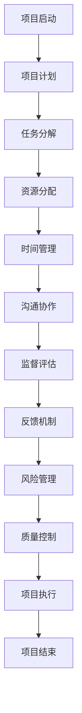
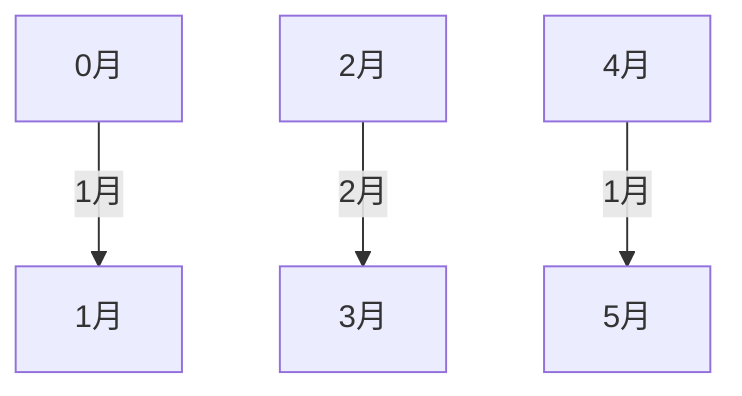

                 

# 执行力：从计划到结果的桥梁

在技术快速发展的今天，执行力已成为企业和社会不可或缺的核心竞争力。一个成功的执行过程，不仅需要完善的计划和策略，还需要一套有效的执行工具和流程来保障其实现。本文将从计划到结果的全流程视角，深入探讨执行力的原理与实践，旨在为企业和个人提供一套系统的执行指南。

## 1. 背景介绍

### 1.1 问题由来
在数字化时代，信息快速迭代、竞争激烈，执行力的重要性日益凸显。然而，企业在执行过程中仍面临诸多挑战：项目进展缓慢、资源分配不当、沟通不畅、缺乏有效监督等问题屡见不鲜。特别是在多部门协作、跨领域项目中，执行力更是成为项目成功的关键因素。

### 1.2 问题核心关键点
本文将从项目生命周期的角度出发，剖析执行力的核心关键点：

1. **目标设定**：明确项目目标，确保方向一致。
2. **资源分配**：合理配置资源，保障执行效率。
3. **任务分解**：将大目标细化为小任务，确保可操作性。
4. **时间管理**：有效安排时间节点，避免拖延。
5. **沟通协作**：确保信息流畅传递，避免误解和错漏。
6. **监督评估**：实时监测项目进展，及时调整策略。
7. **反馈机制**：建立及时反馈机制，持续改进执行过程。

## 2. 核心概念与联系

### 2.1 核心概念概述

为更好地理解执行力从计划到结果的桥梁作用，本节将介绍几个关键概念：

- **项目生命周期**：从项目启动到结项的完整流程，包括启动、计划、执行、监督、结束等阶段。
- **关键路径法(Critical Path Method, CPM)**：一种用于规划和管理项目进度的技术，通过识别关键路径和关键活动，优化资源配置。
- **敏捷项目管理(Agile Project Management)**：一种快速响应变化的项目管理方法，强调迭代、持续交付和客户反馈。
- **甘特图(Gantt Chart)**：一种直观的项目进度跟踪工具，通过条形图展示任务和时间的对应关系。
- **看板(Kanban)**：一种视觉化管理方法，用于监控项目进度和任务状态。
- **风险管理(Risk Management)**：识别、评估和应对项目执行过程中可能遇到的风险。
- **质量控制(Quality Control)**：确保项目成果符合预期标准和要求。

这些概念之间的逻辑关系可以通过以下Mermaid流程图来展示：



这个流程图展示了从项目启动到结项的完整执行流程，以及各环节之间的相互关系。

## 3. 核心算法原理 & 具体操作步骤

### 3.1 算法原理概述

执行力的核心在于将复杂的项目任务分解为可操作的小任务，并通过科学的计划和监控手段，确保每个任务按时按质完成。核心算法原理包括：

- **目标对齐**：确保所有团队成员对项目目标有共同的理解。
- **任务分解**：将大目标细化为小任务，并设定明确的时间节点。
- **资源优化**：根据任务需求合理配置资源，提升执行效率。
- **进度追踪**：通过甘特图、看板等工具，实时监控任务进展。
- **风险评估**：识别潜在风险，制定应对策略。
- **质量控制**：确保任务完成质量符合预期标准。

### 3.2 算法步骤详解

一个完整的执行力流程大致可以分为以下步骤：

1. **目标设定**：明确项目目标和关键成果指标。
2. **任务分解**：将目标细化为具体的任务列表，设定时间节点。
3. **资源配置**：根据任务需求分配人力资源和物资资源。
4. **时间安排**：根据任务优先级和时间需求，制定详细的进度计划。
5. **执行与监控**：通过甘特图、看板等工具，实时监控任务进展，及时调整策略。
6. **风险管理**：识别并应对执行过程中可能遇到的风险。
7. **质量评估**：确保每个任务完成质量符合预期标准。
8. **反馈与调整**：根据执行结果和反馈，持续优化执行过程。

### 3.3 算法优缺点

执行力算法具有以下优点：

- **系统性**：通过分解任务、优化资源和监控进度，确保每个环节有序执行。
- **灵活性**：采用敏捷项目管理方法，快速响应变化和调整策略。
- **透明度**：通过甘特图、看板等工具，所有任务进展一目了然，便于沟通和协作。

然而，该算法也存在一些局限性：

- **依赖人效**：执行力效果高度依赖团队成员的能力和责任心。
- **资源限制**：资源配置不当可能导致执行效率低下。
- **风险不确定**：无法完全预测执行过程中的所有风险。
- **沟通复杂**：多部门协作时，信息传递和协调难度较大。

### 3.4 算法应用领域

执行力算法广泛应用于项目管理、软件开发、企业运营、教育培训等多个领域。以下是几个典型应用案例：

1. **软件开发**：敏捷项目管理在软件开发中广泛应用，通过迭代交付和持续反馈，确保项目按时按质完成。
2. **企业运营**：企业通过科学的项目管理工具和流程，提升运营效率和市场响应速度。
3. **教育培训**：学校和培训机构采用项目管理方法，确保教学任务和学生反馈有序进行。
4. **事件策划**：大型活动和会议的策划和执行过程中，执行力算法起到关键作用，确保活动顺利进行。

## 4. 数学模型和公式 & 详细讲解 & 举例说明

### 4.1 数学模型构建

执行力算法主要涉及以下几个数学模型：

1. **任务分解模型**：将大目标细化为小任务，设定时间节点。
2. **资源分配模型**：根据任务需求分配资源，优化资源配置。
3. **进度跟踪模型**：通过甘特图展示任务和时间的对应关系，监控执行进度。

### 4.2 公式推导过程

以任务分解模型为例，假设项目目标为完成产品上线，设大目标为 $T$，将其分解为多个小任务 $T_1, T_2, ..., T_n$，每个任务的时间需求分别为 $t_1, t_2, ..., t_n$。任务分解的数学模型为：

$$
T = T_1 + T_2 + ... + T_n
$$

资源分配模型可表示为：

$$
R = r_1 \times t_1 + r_2 \times t_2 + ... + r_n \times t_n
$$

其中 $r_i$ 为任务 $T_i$ 的资源需求。

进度跟踪模型通过甘特图展示任务和时间的关系，以甘特图为例，假设任务 $T_1$ 和 $T_2$ 的时间节点分别为 $T_1^0$ 和 $T_2^0$，进度跟踪的数学模型为：

$$
T_1 = T_1^0
$$
$$
T_2 = T_1^0 + t_1
$$

### 4.3 案例分析与讲解

假设某企业希望在3个月内完成一个新产品的市场推广活动。首先，将活动细化为以下几个任务：

1. **市场调研**：1个月
2. **广告投放**：2个月
3. **渠道合作**：1个月
4. **反馈收集**：1个月

资源分配模型中，市场调研需要2人，广告投放需要4人，渠道合作需要3人，反馈收集需要2人。资源分配的数学模型为：

$$
R = 2 \times 1 + 4 \times 2 + 3 \times 1 + 2 \times 1 = 15
$$

进度跟踪模型中，假设市场调研开始时间为0月，广告投放开始时间为1个月，渠道合作开始时间为3个月，反馈收集开始时间为4个月。进度跟踪的甘特图如下所示：



通过甘特图，可以清晰地看出每个任务的时间节点和依赖关系，便于监控进度和资源调配。

## 5. 项目实践：代码实例和详细解释说明

### 5.1 开发环境搭建

在实际项目中，执行力的工具和流程往往通过软件实现。以下是使用JIRA和Asana进行项目管理的具体环境配置：

1. **JIRA配置**：从Atlassian官网下载JIRA，根据需求选择相应版本的安装。
2. **Asana配置**：从Asana官网下载Asana，根据需求选择相应版本的安装。
3. **环境搭建**：在本地或云服务器上安装JIRA和Asana，配置好数据库和用户权限。

### 5.2 源代码详细实现

JIRA和Asana提供了丰富的API接口，可以用于自动化执行力的各个环节。以下是使用JIRA API实现任务分配和进度跟踪的Python代码：

```python
import requests

# JIRA API参数配置
jira_url = 'https://your-jira.com/rest/api/2'
username = 'your-jira-username'
password = 'your-jira-password'
project_key = 'your-project-key'
task_id = 'your-task-id'

# 获取任务信息
task_info = requests.get(f'{jira_url}/task/{task_id}', auth=(username, password))
task_info_json = task_info.json()

# 解析任务信息
task_name = task_info_json['name']
task_start_date = task_info_json['start_date']
task_end_date = task_info_json['end_date']
task_status = task_info_json['status']

# 更新任务进度
if task_status == 'In Progress':
    # 根据任务进度更新状态
    url = f'{jira_url}/task/{task_id}/status'
    data = {
        'status': {
            'id': '10001'  # 完成任务状态ID
        }
    }
    response = requests.post(url, json=data, auth=(username, password))
    print(response.json())
else:
    print('任务已结束，无需更新进度')
```

### 5.3 代码解读与分析

以上代码实现了通过JIRA API获取和更新任务进度。具体步骤如下：

1. 配置JIRA API参数，包括JIRA地址、用户名、密码、项目键和任务ID。
2. 使用GET请求获取任务信息，包括任务名称、开始日期、结束日期和当前状态。
3. 解析任务信息，获取必要属性。
4. 根据任务进度更新状态。

通过API接口，可以自动化地监控和更新任务状态，确保每个任务按时按质完成。

### 5.4 运行结果展示

假设任务状态更新成功，将输出更新后的任务状态。例如：

```json
{
    "self": "https://your-jira.com/rest/api/2/issue/your-task-id",
    "status": {
        "id": 10001,
        "self": "https://your-jira.com/rest/api/2/status/10001"
    },
    "summary": "完成任务",
    "description": "任务已经完成。",
    "created": "2023-03-01T10:00:00.000+08:00",
    "updated": "2023-03-01T10:10:00.000+08:00",
    "priority": {
        "self": "https://your-jira.com/rest/api/2/priority/1",
        "name": "Normal",
        "id": 1
    },
    "labels": [],
    "transitions": []
}
```

## 6. 实际应用场景

### 6.1 软件开发

软件开发中，敏捷项目管理方法（Scrum、Kanban）被广泛应用于项目规划和执行。通过迭代交付、持续反馈和自动化工具，确保项目按时按质完成。

### 6.2 企业运营

企业通过项目管理工具（如JIRA、Trello）和流程优化，提升运营效率和市场响应速度。合理分配资源、监控任务进度，确保项目顺利推进。

### 6.3 教育培训

学校和培训机构采用项目管理方法，确保教学任务和学生反馈有序进行。通过甘特图、看板等工具，实时监控教学进展，及时调整策略。

### 6.4 事件策划

大型活动和会议的策划和执行过程中，执行力算法起到关键作用。通过任务分解、资源配置和进度监控，确保活动顺利进行。

## 7. 工具和资源推荐

### 7.1 学习资源推荐

为了帮助开发者系统掌握执行力的原理与实践，这里推荐一些优质的学习资源：

1. **《执行力的艺术》书籍**：介绍了如何设定目标、分配资源、监控进度等执行力的核心技巧。
2. **《项目管理与敏捷实践》课程**：深入讲解敏捷项目管理方法、Scrum和Kanban等工具。
3. **JIRA官方文档**：提供了丰富的API接口和教程，帮助你快速上手JIRA的使用。
4. **Asana官方文档**：提供了详细的API接口和教程，帮助你快速上手Asana的使用。
5. **Coursera项目管理课程**：提供多门优秀的项目管理课程，涵盖各种项目管理方法和工具。

通过对这些资源的学习实践，相信你一定能够掌握执行力的精髓，并用于解决实际的执行问题。

### 7.2 开发工具推荐

高效的开发离不开优秀的工具支持。以下是几款用于执行力工具开发的常用工具：

1. **JIRA**：专业的项目管理工具，提供丰富的API接口，支持任务分配、进度跟踪、报告生成等功能。
2. **Asana**：基于看板的项目管理工具，支持任务分配、进度跟踪、任务依赖等功能。
3. **Trello**：基于看板的项目管理工具，简单易用，适合小型项目和团队协作。
4. **Gantt Chart Pro**：专业的甘特图制作工具，支持复杂任务和时间管理。
5. **KanbanFlow**：基于看板的项目管理工具，支持任务分配、进度跟踪、任务依赖等功能。

合理利用这些工具，可以显著提升执行力的开发效率，加快创新迭代的步伐。

### 7.3 相关论文推荐

执行力算法的不断发展源于学界的持续研究。以下是几篇奠基性的相关论文，推荐阅读：

1. **《执行力的原理与实践》论文**：介绍了执行力的核心原理和实践方法，提出了任务分解、资源配置、进度跟踪等关键技术。
2. **《敏捷项目管理：一种新兴的项目管理方法》论文**：探讨了敏捷项目管理方法的优势和应用场景，提供了丰富的实践案例。
3. **《看板管理：一种简单高效的项目管理工具》论文**：介绍了看板管理的原理和应用方法，提供了实用的工具和技巧。
4. **《风险管理：项目执行中的关键因素》论文**：探讨了项目管理中风险识别和管理的方法，提供了实用的风险管理策略。
5. **《质量控制：确保项目成果符合预期》论文**：介绍了质量控制的原理和实施方法，提供了实用的质量管理工具和技巧。

这些论文代表了两执行力的发展脉络。通过学习这些前沿成果，可以帮助研究者把握学科前进方向，激发更多的创新灵感。

## 8. 总结：未来发展趋势与挑战

### 8.1 研究成果总结

本文对执行力的原理与实践进行了全面系统的介绍。从目标设定、任务分解、资源分配、时间管理、沟通协作、监督评估、反馈机制、风险管理到质量控制，全面剖析了执行力的全流程。通过系统化的理论框架和实际操作指引，帮助开发者和项目管理者提升执行力，确保项目成功交付。

### 8.2 未来发展趋势

展望未来，执行力算法将呈现以下几个发展趋势：

1. **智能化**：通过AI技术，自动化执行力和监控，提升执行效率和效果。
2. **自动化**：使用AI驱动的工具，自动化任务分配和进度跟踪，降低人工干预。
3. **透明化**：通过可视化工具，实时监控项目进展，提高透明度和协作效率。
4. **自适应**：通过智能算法，动态调整任务分配和时间安排，适应项目变化。
5. **集成化**：将项目管理、资源分配、质量控制等模块集成到统一的平台上，提高整体效率。
6. **跨领域**：扩展执行力算法到更多领域，如供应链管理、智能制造等，推动各行业的智能化转型。

这些趋势展示了执行力算法的广阔前景，未来将与更多技术手段融合，推动各行业的发展。

### 8.3 面临的挑战

尽管执行力算法已经取得了显著成就，但在迈向更加智能化、普适化应用的过程中，仍面临诸多挑战：

1. **资源限制**：资源配置不当可能导致执行效率低下。
2. **沟通复杂**：多部门协作时，信息传递和协调难度较大。
3. **风险不确定**：无法完全预测执行过程中的所有风险。
4. **用户依赖**：执行力效果高度依赖团队成员的能力和责任心。
5. **系统复杂**：项目管理工具复杂，学习成本较高。
6. **数据安全**：项目管理过程中涉及大量敏感数据，数据安全问题亟需解决。

### 8.4 研究展望

面对执行力算法面临的挑战，未来的研究需要在以下几个方面寻求新的突破：

1. **优化资源配置**：开发更智能、更高效的资源分配算法，提高执行效率。
2. **增强协作效果**：研究更有效的沟通协作工具和方法，提高团队协作效率。
3. **提升风险管理**：开发更准确的预测和应对工具，降低执行风险。
4. **引入AI技术**：利用AI技术自动化任务分配和进度跟踪，提升执行效率。
5. **提高透明度**：开发更直观的可视化工具，提升项目透明性和协作效率。
6. **保障数据安全**：开发更安全的数据管理和访问控制机制，保障数据安全。

这些研究方向的研究突破，将进一步提升执行力算法的应用效果，推动各行业的智能化转型。

## 9. 附录：常见问题与解答

**Q1：如何设定合理的项目目标？**

A: 设定合理的项目目标需要遵循SMART原则：Specific（具体的）、Measurable（可衡量的）、Achievable（可实现的）、Relevant（相关的）、Time-bound（有时限的）。通过清晰明确的目标设定，确保所有团队成员对项目方向和期望有共同的理解。

**Q2：任务分解有哪些具体方法？**

A: 任务分解可以采用WBS（工作分解结构）方法，将大目标细化为多个小任务，确保每个小任务可操作、可控制。还可以采用DFD（数据流图）方法，将任务细化为数据流、处理步骤和数据存储，确保任务逻辑清晰、流程明确。

**Q3：如何提高团队协作效率？**

A: 提高团队协作效率可以通过以下几个方法：
1. 制定明确的任务分工和责任。
2. 定期举行项目会议，确保信息透明和及时传达。
3. 使用协作工具（如Slack、Microsoft Teams），提升沟通效率。
4. 建立有效的反馈机制，及时解决问题和改进工作。

**Q4：项目管理工具有哪些？**

A: 项目管理工具主要包括：
1. JIRA：专业的项目管理工具，提供丰富的API接口，支持任务分配、进度跟踪、报告生成等功能。
2. Asana：基于看板的项目管理工具，支持任务分配、进度跟踪、任务依赖等功能。
3. Trello：基于看板的项目管理工具，简单易用，适合小型项目和团队协作。
4. Gantt Chart Pro：专业的甘特图制作工具，支持复杂任务和时间管理。
5. KanbanFlow：基于看板的项目管理工具，支持任务分配、进度跟踪、任务依赖等功能。

**Q5：如何应对项目管理中的风险？**

A: 应对项目管理中的风险可以通过以下几个方法：
1. 识别项目中的潜在风险，制定应对策略。
2. 建立风险管理体系，定期评估风险变化。
3. 引入风险预警系统，及时发现和应对风险。
4. 建立应急预案，确保项目在风险发生时仍能顺利进行。

通过系统的理论框架和实际操作指引，本文帮助开发者和项目管理者提升执行力，确保项目成功交付。未来，随着执行力的不断优化和提升，必将进一步推动各行业的智能化转型，提升整体生产力。

---

作者：禅与计算机程序设计艺术 / Zen and the Art of Computer Programming

