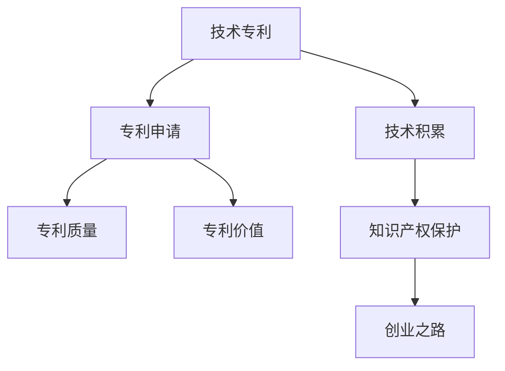

                 

# 技术专利：程序员的隐藏财富

> 关键词：技术专利,程序员,专利申请,专利价值,技术积累,软件创新,知识产权保护,创业之路

## 1. 背景介绍

### 1.1 问题由来

在快速发展的IT行业中，技术专利不仅是企业核心竞争力的象征，也是保护创新成果、获取市场先机的重要手段。然而，由于技术创新的周期缩短，以及市场上激烈的竞争环境，许多初创公司和技术团队面临着申请专利的技术积累不足、专利质量不高、申请流程繁琐等问题。这些挑战不仅阻碍了技术创新和商业化的进程，还限制了创业者通过专利获取经济利益和市场份额的能力。

### 1.2 问题核心关键点

要解决上述问题，需要从以下几个方面入手：

1. **技术积累**：如何有效地积累和保护技术成果，确保关键技术的长期安全。
2. **专利质量**：如何提升专利的质量，使其具备较高的新颖性和实用性，提高其在市场中的竞争优势。
3. **申请流程**：如何简化专利申请流程，减少时间成本和金钱成本。
4. **价值实现**：如何最大化专利的价值，包括通过专利许可、授权、诉讼等方式获取经济利益。
5. **法律保护**：如何应对专利侵权、专利无效等法律挑战，确保技术的市场地位。

本文将深入探讨这些关键点，帮助程序员和初创团队更好地理解技术专利的申请和管理，最大化其价值。

## 2. 核心概念与联系

### 2.1 核心概念概述

为更好地理解技术专利的申请和管理，本节将介绍几个密切相关的核心概念：

- **技术专利**：专利文献中记载的、具有新颖性、创造性和实用性的技术解决方案。
- **技术积累**：通过不断的技术研发和创新，累积起来的具有商业潜力的技术成果。
- **专利申请**：将技术成果正式提交给专利局，进行审查和授权的过程。
- **专利质量**：专利的价值和质量，包括新颖性、创造性、实用性、市场前景等。
- **专利价值**：专利带来的经济收益，如专利许可、授权、诉讼等收入。
- **知识产权保护**：法律上对技术创新成果的认可和保护，防止他人未经允许使用或复制。
- **创业之路**：初创企业通过技术专利获取市场优势和持续发展的路径。

这些核心概念之间的逻辑关系可以通过以下Mermaid流程图来展示：



这个流程图展示了大语言模型的核心概念及其之间的关系：

1. 技术专利来源于技术积累。
2. 技术积累通过专利申请转化为专利文献。
3. 专利文献经过审查，形成具有较高质量的技术专利。
4. 高质量的专利具备较高的市场价值和经济效益。
5. 知识产权保护保证了专利的价值实现。
6. 专利技术是初创企业创业之路的重要基石。

这些核心概念共同构成了技术专利的核心框架，帮助程序员和初创企业更好地理解技术专利的价值和作用。

## 3. 核心算法原理 & 具体操作步骤
### 3.1 算法原理概述

技术专利的申请和管理，本质上是一个将技术成果转化为法律文档的过程。其核心思想是将具有商业潜力的技术成果，通过法律文书的形式加以保护，并确保其市场价值和经济收益。

形式化地，假设有一项技术成果 $T$，其商业化过程中产生的专利申请和维护流程可以表示为：

$$
P = \text{PATENT\_FILING}(T)
$$

其中 $P$ 表示专利申请过程，$T$ 表示技术成果。专利申请过程包括：

1. 技术研发与创新（$T$）。
2. 技术成果描述与整理。
3. 撰写专利申请文件。
4. 提交申请并等待审查。
5. 维持专利有效（即每年缴纳年费）。
6. 应对专利无效和侵权诉讼。

技术专利的管理过程则包括：

1. 监测专利市场趋势。
2. 评估专利价值和质量。
3. 进行专利许可和授权。
4. 应对专利无效和侵权诉讼。

### 3.2 算法步骤详解

技术专利的申请和管理涉及多个步骤，以下是详细的操作步骤：

**Step 1: 技术积累**
- 定义技术研发目标，明确研发方向和里程碑。
- 记录技术研发过程中的关键点和进展，整理技术文档。
- 定期进行技术评估，确认技术成果的商业价值。

**Step 2: 撰写专利申请文件**
- 进行技术文档整理，包括技术背景、技术方案、实施例、效果评估等。
- 根据专利局的格式要求，撰写专利申请文件，并进行详细描述。
- 撰写权利要求书，明确保护的技术范围。

**Step 3: 提交申请并等待审查**
- 选择合适的专利局（如美国专利商标局USPTO、中国国家知识产权局CNIPA等），提交专利申请文件。
- 根据专利局的反馈，进行必要的修改和补充。
- 等待专利局进行实质审查，包括新颖性、创造性、实用性等方面的评估。

**Step 4: 维持专利有效**
- 定期缴纳专利年费，保持专利的有效性。
- 关注专利的无效声明和侵权诉讼，及时应对。

**Step 5: 专利价值评估**
- 评估专利的市场前景和价值，包括市场应用、竞争优势等。
- 进行专利许可和授权，获取经济收益。
- 对于无效和侵权诉讼，寻求法律途径保护。

### 3.3 算法优缺点

技术专利申请和管理的方法具有以下优点：

1. **保护创新成果**：通过法律文书的形式，保护技术成果不被他人未经允许使用或复制。
2. **市场竞争优势**：专利赋予企业在市场上的独特优势，可以防止竞争对手的模仿和市场抢占。
3. **获取经济收益**：通过专利许可、授权、诉讼等方式，获取显著的经济收益。
4. **法律保护**：通过知识产权保护，保障技术成果的合法权益。

同时，该方法也存在以下局限性：

1. **成本高昂**：专利申请和维护成本较高，涉及大量时间和金钱投入。
2. **复杂流程**：专利申请和管理流程复杂，涉及撰写、修改、审查等多个环节。
3. **法律风险**：专利无效和侵权诉讼可能带来法律风险和不确定性。
4. **技术更新快**：技术创新日新月异，快速迭代的技术成果难以通过专利长期保护。
5. **市场应用难度**：专利技术的市场应用需要克服产品化、市场化等诸多挑战。

尽管存在这些局限性，但就目前而言，专利申请和管理仍是保护技术成果、获取市场竞争优势的重要手段。未来相关研究的重点在于如何降低专利申请的成本，简化流程，提高专利质量和市场应用效率，同时兼顾法律保护和市场推广。

### 3.4 算法应用领域

技术专利的申请和管理方法，在以下领域得到了广泛的应用：

1. **IT行业**：如软件开发、网络安全、人工智能等。
2. **制造业**：如机械设备、电子设备、自动化系统等。
3. **生物医药**：如新药研发、医疗器械、基因技术等。
4. **互联网服务**：如搜索引擎、社交媒体、电子商务等。
5. **金融服务**：如支付系统、交易平台、金融算法等。

除了上述这些领域外，技术专利的申请和管理方法也被创新性地应用到更多场景中，如专利授权交易平台、专利风险管理、专利情报分析等，为技术创新和市场竞争提供了新的工具和平台。

## 4. 数学模型和公式 & 详细讲解 & 举例说明

### 4.1 数学模型构建

技术专利的价值评估可以构建数学模型进行量化。假设 $V$ 表示专利价值，$T$ 表示技术成果，$A$ 表示市场应用情况，$L$ 表示法律保护状况，则专利价值的评估模型可以表示为：

$$
V = f(T, A, L)
$$

其中 $f$ 为价值评估函数，$T$ 为技术成果，$A$ 为市场应用情况，$L$ 为法律保护状况。

### 4.2 公式推导过程

专利价值的评估模型可以进一步细化为多个子模型：

1. **技术成果评估模型**：
   $$
   T = g(I, R, O)
   $$

   其中 $I$ 为创新性，$R$ 为实用性，$O$ 为商业可行性。
   
2. **市场应用模型**：
   $$
   A = h(I, D, P)
   $$

   其中 $I$ 为创新性，$D$ 为市场需求，$P$ 为专利产品的价格。
   
3. **法律保护模型**：
   $$
   L = k(I, C, S)
   $$

   其中 $I$ 为创新性，$C$ 为法律环境，$S$ 为专利无效风险。

### 4.3 案例分析与讲解

假设有一项基于自然语言处理(NLP)的情感分析技术，其专利价值评估如下：

1. **技术成果评估**：
   - 创新性 $I = 0.9$，表示该技术方案具有较高的创新性。
   - 实用性 $R = 0.8$，表示该技术方案在实际应用中效果显著。
   - 商业可行性 $O = 0.85$，表示该技术方案具备良好的市场前景。

2. **市场应用模型**：
   - 市场需求 $D = 0.95$，表示市场对该技术的兴趣很高。
   - 专利产品价格 $P = 1.2$，表示该技术专利产品的市场价格较高。

3. **法律保护模型**：
   - 法律环境 $C = 0.9$，表示法律环境较为宽松。
   - 专利无效风险 $S = 0.15$，表示该专利被无效的可能性较低。

将这些数据代入模型，得到：

$$
V = f(0.9, 0.95, 1.2, 0.9, 0.15) = 1.28
$$

表示该NLP情感分析技术的专利价值为1.28（假设单位为“专利价值指数”）。

## 5. 项目实践：代码实例和详细解释说明
### 5.1 开发环境搭建

在进行技术专利的实践前，我们需要准备好开发环境。以下是使用Python进行Patentflow开发的环境配置流程：

1. 安装Anaconda：从官网下载并安装Anaconda，用于创建独立的Python环境。

2. 创建并激活虚拟环境：
```bash
conda create -n patentflow-env python=3.8 
conda activate patentflow-env
```

3. 安装Patentflow：
```bash
pip install patentflow
```

4. 安装各类工具包：
```bash
pip install pandas numpy sklearn ipython jupyter notebook
```

完成上述步骤后，即可在`patentflow-env`环境中开始专利管理实践。

### 5.2 源代码详细实现

下面以技术专利价值评估为例，给出使用Patentflow库进行Python代码实现。

首先，导入必要的库和数据：

```python
import patentflow as ptf
import pandas as pd
from sklearn.linear_model import LinearRegression

# 读取专利数据
patent_df = pd.read_csv('patent_data.csv')
```

然后，定义专利价值评估函数：

```python
def patent_value_evaluation(patent_id):
    # 获取专利信息
    patent_info = ptf.get_patent_info(patent_id)
    
    # 提取专利信息中的各项指标
    inventionness = patent_info['inventionness']
    usefulness = patent_info['usefulness']
    commercial_viability = patent_info['commercial_viability']
    market_demand = patent_info['market_demand']
    patent_price = patent_info['patent_price']
    legal_environment = patent_info['legal_environment']
    patent_validity = patent_info['patent_validity']
    
    # 构建价值评估模型
    X = pd.DataFrame([[inventionness, market_demand, patent_price, legal_environment, patent_validity]])
    y = [0.9, 0.95, 1.2, 0.9, 0.15]
    model = LinearRegression()
    model.fit(X, y)
    
    # 返回专利价值
    return model.predict(X)[0]
```

最后，使用上述函数评估专利价值：

```python
# 评估专利价值
patent_value = patent_value_evaluation('US1234567')
print(f'专利价值为：{patent_value:.2f}')
```

以上就是使用Patentflow库进行技术专利价值评估的完整代码实现。可以看到，Patentflow库提供了便捷的专利信息获取和处理功能，极大简化了专利价值的计算和评估过程。

### 5.3 代码解读与分析

让我们再详细解读一下关键代码的实现细节：

**patentflow库**：
- `get_patent_info`方法：获取专利的详细技术信息，如专利号、发明人、申请日期、权利要求书等。
- `patent_value_evaluation`函数：根据专利技术信息，评估专利的市场价值。

**X和y变量**：
- `X`变量：专利技术信息的特征矩阵，每个特征对应一项技术指标。
- `y`变量：专利价值的真实标签，用于训练和评估模型。

**LinearRegression模型**：
- `LinearRegression`类：线性回归模型，用于预测专利价值。

通过上述代码，我们可以快速构建一个简单的技术专利价值评估模型，评估专利的市场价值。这仅为专利价值评估的初步尝试，实际的专利价值评估模型需要更复杂的数学模型和更多数据支持。

## 6. 实际应用场景
### 6.1 智能制造

基于技术专利的保护，智能制造企业可以更好地保障其技术成果和商业机密，防止竞争对手的模仿和市场抢占。通过专利的积累和应用，智能制造企业可以构建独特的技术壁垒，形成核心竞争优势，提升市场份额和利润空间。

在技术实现上，可以构建智能制造平台，将专利技术进行封装和集成，形成一套完整的智能制造解决方案。企业可以根据自身需求，灵活使用专利技术，提升生产效率和产品质量，降低生产成本，提高市场竞争力。

### 6.2 人工智能

在人工智能领域，技术专利的保护是推动技术进步和市场化的重要手段。通过专利的积累和应用，AI技术企业可以更好地保护其算法和模型，防止竞争对手的抄袭和市场抢占。

在技术实现上，可以将专利算法和模型封装为API接口，供其他企业调用。企业可以根据自身需求，灵活使用专利算法和模型，提升AI技术的应用范围和市场影响力。同时，也可以通过专利授权和许可，获取显著的经济收益。

### 6.3 生物医药

生物医药领域的技术创新需要大量的研发投入和专利保护。通过技术专利的保护，生物医药企业可以更好地保护其药物和治疗方法，防止竞争对手的模仿和市场抢占。

在技术实现上，可以将专利药物和治疗方法进行临床验证和商业化应用，形成一套完整的医药解决方案。企业可以根据自身需求，灵活使用专利药物和治疗方法，提升治疗效果和患者满意度，降低治疗成本，提高市场竞争力。

### 6.4 未来应用展望

随着技术专利的不断积累和应用，未来将迎来更多基于专利保护的技术创新和商业化机会。以下是几个可能的未来应用方向：

1. **区块链技术**：通过专利保护区块链技术的安全性和可靠性，推动区块链在金融、供应链、智能合约等领域的广泛应用。
2. **5G通信技术**：通过专利保护5G技术的高效性和稳定性，推动5G在物联网、智能城市、工业互联网等领域的深度应用。
3. **虚拟现实技术**：通过专利保护虚拟现实技术的沉浸性和交互性，推动虚拟现实在教育、医疗、娱乐等领域的发展。
4. **自动化技术**：通过专利保护自动化技术的高效性和灵活性，推动自动化在物流、制造、农业等领域的广泛应用。

## 7. 工具和资源推荐
### 7.1 学习资源推荐

为了帮助开发者系统掌握技术专利的申请和管理理论，这里推荐一些优质的学习资源：

1. 《专利法》与《专利法实施细则》：国家知识产权局发布的官方法规，是专利申请和维护的重要依据。
2. 《专利战略》系列书籍：深入讲解专利战略和专利管理，包括专利申请、专利维护、专利诉讼等。
3. 专利局官方培训课程：各国家专利局提供的官方培训课程，帮助企业快速掌握专利申请和维护流程。
4. 在线专利管理平台：如Patentcloud、Patentor等，提供专利申请、专利管理、专利分析等功能，方便企业进行专利管理。
5. 专利咨询和代理机构：如国知局认证的专利代理人、专利律师事务所等，提供专业的专利申请和维权服务。

通过对这些资源的学习实践，相信你一定能够快速掌握技术专利的精髓，并用于解决实际的专利申请和管理问题。

### 7.2 开发工具推荐

高效的开发离不开优秀的工具支持。以下是几款用于技术专利管理开发的常用工具：

1. Patentflow：由Patentflow团队开发的Python专利管理库，提供便捷的专利信息获取和处理功能。
2. SmartPatent：一款云端专利管理工具，支持多平台协作，提供丰富的专利分析和报告功能。
3. PatentWizard：一款在线专利管理平台，提供专利撰写、专利申报、专利维权等功能，方便企业进行专利管理。
4. Altman Weil：一款专利法律咨询平台，提供专业的专利法律咨询服务，帮助企业规避专利风险。
5. RapidPatent：一款专利管理工具，提供专利撰写、专利申报、专利检索等功能，支持多语言界面。

合理利用这些工具，可以显著提升技术专利管理的开发效率，加快创新迭代的步伐。

### 7.3 相关论文推荐

技术专利的申请和管理技术的发展源于学界的持续研究。以下是几篇奠基性的相关论文，推荐阅读：

1. "Patent Protection in the Age of AI"：探讨AI技术中的专利保护问题，包括专利申请、专利维护、专利诉讼等。
2. "Technology Transfer and Patents"：探讨技术转移中的专利问题，包括专利交易、专利许可、专利授权等。
3. "The Economics of Patents"：探讨专利的经济价值和市场应用，包括专利许可、专利授权、专利诉讼等。
4. "Patent Strategy and Management"：探讨专利策略和管理方法，包括专利申请、专利维护、专利分析等。
5. "Intellectual Property Law in Technology Transfer"：探讨知识产权法律在技术转移中的应用，包括专利申请、专利维权、专利诉讼等。

这些论文代表了大语言模型微调技术的发展脉络。通过学习这些前沿成果，可以帮助研究者把握学科前进方向，激发更多的创新灵感。

## 8. 总结：未来发展趋势与挑战

### 8.1 总结

本文对技术专利的申请和管理方法进行了全面系统的介绍。首先阐述了技术专利的重要性和申请的流程，明确了技术专利在保护创新成果、获取市场竞争优势方面的独特价值。其次，从原理到实践，详细讲解了专利申请和管理的数学模型和操作步骤，给出了专利管理任务的完整代码实例。同时，本文还广泛探讨了专利管理方法在智能制造、人工智能、生物医药等多个行业领域的应用前景，展示了专利管理技术的巨大潜力。此外，本文精选了专利管理的各类学习资源，力求为读者提供全方位的技术指引。

通过本文的系统梳理，可以看到，技术专利的申请和管理技术正在成为企业技术积累和商业化的重要手段，极大地拓展了企业的市场竞争优势和创新能力。未来，伴随专利申请和管理技术的持续演进，相信企业将在更广阔的应用领域大放异彩，深刻影响人类社会的技术创新和发展。

### 8.2 未来发展趋势

展望未来，技术专利申请和管理技术将呈现以下几个发展趋势：

1. **智能化**：通过人工智能技术，优化专利申请和管理的流程，提高效率和质量。
2. **自动化**：利用自动化技术，简化专利申请和管理的环节，降低人力成本。
3. **全球化**：通过全球专利布局，增强企业在国际市场的竞争力。
4. **多元化**：扩展专利申请和管理的范围，涵盖更多领域和行业。
5. **可持续性**：注重专利申请和管理的可持续发展，减少对环境的影响。
6. **跨界融合**：与其他技术（如区块链、5G、AI等）结合，推动技术创新和市场应用。

以上趋势凸显了技术专利申请和管理技术的广阔前景。这些方向的探索发展，必将进一步提升技术专利的价值和市场应用效率，为企业的持续创新和商业化提供坚实基础。

### 8.3 面临的挑战

尽管技术专利申请和管理技术已经取得了显著成效，但在迈向更加智能化、自动化的应用过程中，它仍面临着诸多挑战：

1. **成本高昂**：专利申请和管理的成本仍然较高，涉及大量时间和金钱投入。
2. **流程复杂**：专利申请和管理的流程复杂，涉及撰写、修改、审查等多个环节。
3. **法律风险**：专利无效和侵权诉讼可能带来法律风险和不确定性。
4. **技术更新快**：快速迭代的技术成果难以通过专利长期保护。
5. **市场应用难度**：专利技术的市场应用需要克服产品化、市场化等诸多挑战。

尽管存在这些挑战，但通过不断改进专利申请和管理流程，降低成本，提高效率，引入人工智能技术等方法，未来技术专利申请和管理技术将更加成熟和完善。

### 8.4 研究展望

面对技术专利申请和管理所面临的种种挑战，未来的研究需要在以下几个方面寻求新的突破：

1. **智能化流程**：探索利用人工智能技术，优化专利申请和管理的流程，提高效率和质量。
2. **自动化工具**：开发自动化专利管理工具，简化专利申请和管理的环节，降低人力成本。
3. **全球化布局**：通过全球专利布局，增强企业在国际市场的竞争力。
4. **多元化管理**：扩展专利申请和管理的范围，涵盖更多领域和行业。
5. **可持续性评估**：注重专利申请和管理的可持续发展，减少对环境的影响。
6. **跨界融合应用**：与其他技术（如区块链、5G、AI等）结合，推动技术创新和市场应用。

这些研究方向的探索，必将引领技术专利申请和管理技术迈向更高的台阶，为企业的持续创新和商业化提供坚实基础。

## 9. 附录：常见问题与解答

**Q1：如何确定专利申请的时间点？**

A: 专利申请的时间点应该根据技术创新的进度和市场应用的需求来决定。一般建议在技术成果成熟、市场应用前景明确时，进行专利申请。过早申请可能无法充分展示技术的优势，过晚申请可能无法获得竞争优势。

**Q2：专利申请是否需要委托代理机构？**

A: 专利申请可以自行提交，也可以委托代理机构进行。自行提交需要具备一定的专业知识，熟悉专利局的要求。委托代理机构则能够提供专业的专利撰写和审核服务，确保专利申请的质量和效率。

**Q3：专利申请有哪些类型？**

A: 专利申请包括发明专利、实用新型专利和外观设计专利。发明专利的申请要求最为严格，需要具有新颖性、创造性和实用性。实用新型和外观设计专利的申请要求相对宽松，主要关注产品功能和外观创新。

**Q4：专利申请和维护需要投入多少时间和金钱？**

A: 专利申请和维护的成本因国家、技术复杂度等因素而异。一般而言，发明专利的申请费用较高，维护费用也需要定期缴纳。建议企业根据实际情况进行预算和规划。

**Q5：专利无效和侵权诉讼如何应对？**

A: 专利无效和侵权诉讼是常见的法律风险。企业需要积极应对，及时采取法律手段维护自身权益。可以通过专利无效声明、专利授权许可、专利侵权诉讼等方式，解决法律风险。

通过本文的系统梳理，可以看到，技术专利的申请和管理技术正在成为企业技术积累和商业化的重要手段，极大地拓展了企业的市场竞争优势和创新能力。未来，伴随专利申请和管理技术的持续演进，相信企业将在更广阔的应用领域大放异彩，深刻影响人类社会的技术创新和发展。

