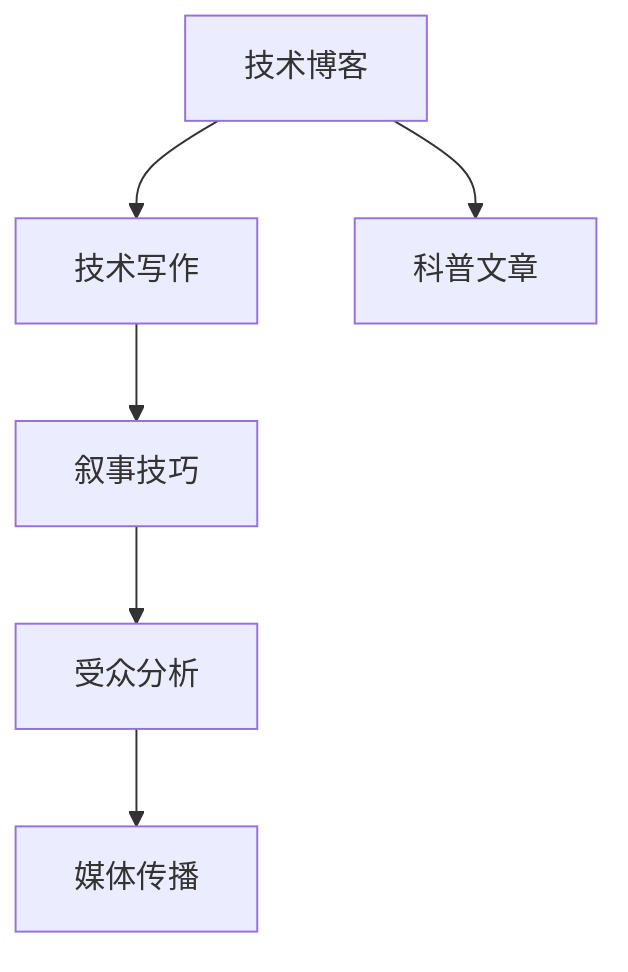

                 

# 技术写作：从技术博客到畅销科普作家之路

## 1. 背景介绍

### 1.1 问题由来
在信息爆炸的时代，技术类内容的需求日益增长，科技博客、科普文章等形式多样、内容丰富的技术传播方式，成为连接学术与大众的重要桥梁。然而，许多专业技术人员在将自身深奥的技术见解转化为通俗易懂的科普文章时，常常感到力不从心。如何将技术内容写得更具吸引力、更容易理解，成为技术写作中的一个重要课题。

### 1.2 问题核心关键点
技术写作的关键在于如何将复杂的学术知识转化为易懂的非技术语言，同时保持内容的准确性和权威性。一个优秀的技术博客或科普作家，不仅能清晰地阐述技术原理，还能通过生动有趣的案例和故事，让读者对技术有更深刻的理解。

### 1.3 问题研究意义
通过深入研究技术写作，尤其是从技术博客到畅销科普作家的转变过程，可以揭示出有效的技术传播策略，提升技术内容的普及度和影响力。这不仅能促进学术交流，还能激发公众对科技的兴趣和好奇心，推动科技教育的普及。

## 2. 核心概念与联系

### 2.1 核心概念概述

为更好地理解技术写作的精髓，本节将介绍几个核心概念：

- 技术博客：通过撰写技术文章，分享技术知识、最新进展和心得体会，建立专业影响力的平台。
- 科普文章：以通俗易懂的语言，向公众介绍科学和技术原理，激发大众对科技的兴趣。
- 技术写作：将复杂的学术和技术内容，转化为易懂的非技术语言，进行有效传播的过程。
- 叙事技巧：通过故事讲述、案例分析等方式，使内容更具吸引力和可读性。
- 受众分析：理解受众需求和兴趣点，提供满足其预期信息的技术文章。
- 媒体传播：利用各种媒介平台（如博客、社交媒体、专业论坛等），扩大技术内容的影响范围。

这些核心概念之间的逻辑关系可以通过以下Mermaid流程图来展示：



这个流程图展示了技术写作的主要环节和相关概念之间的联系：

1. 技术博客作为传播平台，通过技术写作，可以撰写具有权威性和深度的科普文章。
2. 科普文章通过叙事技巧，使技术内容更具可读性和吸引力。
3. 受众分析帮助作者更好地理解目标读者，提升内容的针对性和亲和力。
4. 媒体传播让技术内容在更多平台上得以传播，扩大影响力。

## 3. 核心算法原理 & 具体操作步骤
### 3.1 算法原理概述

技术写作本质上是一种信息传达和沟通的优化过程，其核心在于将复杂的技术知识简化、通俗化，同时保留信息的准确性和完整性。其算法原理主要包括以下几个步骤：

1. **需求分析**：明确目标受众，了解其知识背景和技术水平，确定内容深度和广度。
2. **内容规划**：确定文章结构，包括引言、主体、结论等部分，规划案例和故事，确保逻辑连贯。
3. **语言转换**：将专业术语和复杂概念转换为易于理解的语言，使用比喻、类比等方法辅助说明。
4. **细节补充**：添加案例分析、图表、图片等，丰富内容，增强可读性。
5. **反馈迭代**：根据读者反馈，不断修改和优化文章，提升传播效果。

### 3.2 算法步骤详解

以下将详细介绍技术写作的各个步骤及其操作方法：

**Step 1: 需求分析**

需求分析是技术写作的第一步，需要明确文章的受众是谁，以及他们的技术背景、兴趣和期望。

- 受众分析：通过问卷调查、用户反馈等方式，收集受众信息，了解其知识水平和偏好。
- 目标设定：根据受众分析结果，设定文章的目标，包括传递的技术知识和深度、广度，以及期望的阅读体验。
- 内容规划：根据目标受众和目标设定，规划文章的结构和内容，包括引言、主体和结论等部分，以及案例和故事的选取。

**Step 2: 内容规划**

内容规划决定了文章的可读性和逻辑性。以下是内容规划的关键步骤：

- 引言部分：简要介绍文章背景，吸引读者兴趣，并明确文章将要讨论的核心问题。
- 主体部分：按照逻辑顺序，分章节展开技术细节，使用案例和故事说明技术原理和应用场景。
- 结论部分：总结文章内容，强调关键观点，并提出展望或进一步研究方向。
- 案例和故事：选取合适的案例或故事，帮助读者更好地理解技术概念，提升文章的可读性。

**Step 3: 语言转换**

语言转换是将复杂的技术知识转化为通俗易懂的语言，同时保持信息准确性的关键步骤。以下是语言转换的具体方法：

- 定义专业术语：在文章开头定义必要的专业术语，避免混淆。
- 使用类比和比喻：将复杂概念与日常生活中的简单事物进行类比，帮助读者更好地理解。
- 分步骤说明：将复杂的技术流程或原理拆分为多个步骤，逐步解释。
- 避免过度细节：在保留核心信息的前提下，避免过于复杂的技术细节，使文章更加精炼。

**Step 4: 细节补充**

细节补充可以通过添加图表、图片、代码片段等方式，丰富文章内容，增强可读性。

- 图表：使用图表清晰展示数据和关系，帮助读者理解复杂概念。
- 图片：添加相关图片，使文章更加生动有趣。
- 代码片段：在介绍算法或编程技术时，添加代码片段，帮助读者理解和实践。

**Step 5: 反馈迭代**

反馈迭代是不断改进文章质量和提升传播效果的关键步骤。

- 读者反馈：收集读者评论和反馈，了解其对文章的理解和建议。
- 修改优化：根据反馈，修改和优化文章，提升其准确性和可读性。
- 发布更新：在更新平台上发布更新文章，继续收集反馈，不断迭代改进。

### 3.3 算法优缺点

技术写作的算法具有以下优点：

- 促进知识普及：通过简化的语言和生动的案例，使复杂的技术知识更容易被大众理解和接受。
- 提升作者影响力：良好的技术写作能够吸引更多读者关注，提升作者的知名度和影响力。
- 丰富媒介形式：技术写作不仅限于文字，还可以通过视频、音频等多种媒介形式传播，扩大影响力。

同时，该方法也存在一些局限性：

- 对作者要求高：需要作者具有深厚的技术背景和良好的语言表达能力。
- 需要大量时间投入：从需求分析到反馈迭代，整个过程需要大量时间和精力。
- 内容更新难度大：技术更新迅速，保持内容的时效性和准确性需要持续努力。

尽管存在这些局限性，但就目前而言，技术写作仍然是大规模传播技术知识的重要手段。未来相关研究的重点在于如何进一步降低写作难度，提高内容的传播效果，同时兼顾知识普及和学术权威性等因素。

### 3.4 算法应用领域

技术写作的应用范围非常广泛，涉及计算机科学、工程、医学、金融等多个领域。以下是一些典型的应用场景：

- 计算机科学：撰写技术博客，分享最新的编程语言、开发工具、算法等知识。
- 工程设计：通过科普文章，介绍工程设计原理、建筑施工等专业知识。
- 医学健康：编写健康科普文章，普及医学知识，提供健康建议。
- 金融科技：撰写金融科技文章，介绍区块链、数字货币、智能投顾等前沿技术。
- 人工智能：撰写AI文章，分享深度学习、自然语言处理、计算机视觉等领域的最新进展。

除了上述这些领域，技术写作还可以应用于教育培训、企业管理、政府政策解读等多个方面，为相关领域提供有价值的知识和信息支持。

## 4. 数学模型和公式 & 详细讲解 & 举例说明

### 4.1 数学模型构建

技术写作的数学模型构建主要涉及内容结构和读者反馈的优化。以下是一个简单的数学模型：

- 输入：受众分析结果、目标受众的知识水平和兴趣、技术内容。
- 输出：技术文章的结构、内容、语言转换方式、细节补充、反馈迭代结果。
- 目标函数：文章的可读性、受众满意度、传播效果等。

### 4.2 公式推导过程

以下以一篇技术博客的撰写为例，详细推导技术写作的各个步骤：

**Step 1: 受众分析**

受众分析的数学模型为：

$$
S = f(\text{调查问卷}, \text{用户反馈}, \text{领域热门问题})
$$

其中 $S$ 表示受众分析结果，$f$ 表示计算函数。

**Step 2: 内容规划**

内容规划的数学模型为：

$$
C = g(\text{目标受众}, \text{目标设定}, \text{案例和故事})
$$

其中 $C$ 表示文章内容规划，$g$ 表示规划函数。

**Step 3: 语言转换**

语言转换的数学模型为：

$$
L = h(\text{专业术语}, \text{类比和比喻}, \text{分步骤说明})
$$

其中 $L$ 表示语言转换结果，$h$ 表示转换函数。

**Step 4: 细节补充**

细节补充的数学模型为：

$$
D = k(\text{图表}, \text{图片}, \text{代码片段})
$$

其中 $D$ 表示细节补充结果，$k$ 表示补充函数。

**Step 5: 反馈迭代**

反馈迭代的数学模型为：

$$
F = m(\text{读者反馈}, \text{修改优化}, \text{发布更新})
$$

其中 $F$ 表示反馈迭代结果，$m$ 表示迭代函数。

### 4.3 案例分析与讲解

假设我们需要撰写一篇关于“机器学习”的科普文章。以下是详细步骤：

**受众分析：**
- 目标受众：对机器学习有一定了解的工程师、IT学生、技术爱好者。
- 目标设定：介绍机器学习的基本概念、算法、应用场景等。
- 内容规划：包括引言、主体和结论，介绍机器学习的概述、分类算法、深度学习等。

**内容规划：**
- 引言：简要介绍机器学习的历史和发展现状。
- 主体：分章介绍监督学习、非监督学习、强化学习等基本概念和算法。
- 结论：总结机器学习在各行业的应用，提出未来发展方向。

**语言转换：**
- 专业术语：定义机器学习、监督学习、非监督学习等术语。
- 类比和比喻：将复杂的算法和概念比作生活中常见的事物，如将机器学习比作“训练模型”。
- 分步骤说明：逐步解释算法的步骤和原理，避免过度细节。

**细节补充：**
- 图表：使用图表展示算法流程和性能比较。
- 图片：添加相关图片，使文章更加生动有趣。
- 代码片段：在介绍算法时，添加代码片段，帮助读者理解和实践。

**反馈迭代：**
- 读者反馈：收集读者评论和反馈，了解其对文章的理解和建议。
- 修改优化：根据反馈，修改和优化文章，提升其准确性和可读性。
- 发布更新：在技术博客和社交媒体上发布更新文章，继续收集反馈，不断迭代改进。

## 5. 项目实践：代码实例和详细解释说明
### 5.1 开发环境搭建

在进行技术写作实践前，我们需要准备好开发环境。以下是使用Python进行技术写作环境配置流程：

1. 安装Anaconda：从官网下载并安装Anaconda，用于创建独立的Python环境。

2. 创建并激活虚拟环境：
```bash
conda create -n python-env python=3.8 
conda activate python-env
```

3. 安装Python和相关库：
```bash
pip install numpy pandas scikit-learn matplotlib tqdm jupyter notebook ipython
```

4. 安装Markdown编辑器：如Typora、StackEdit等，用于编辑和预览技术文章。

5. 安装Git版本控制：
```bash
conda install conda-forge::git
```

完成上述步骤后，即可在`python-env`环境中开始技术写作实践。

### 5.2 源代码详细实现

下面我以一篇关于“深度学习”的博客文章为例，给出使用Python进行技术写作的详细代码实现。

首先，定义文章结构：

```python
# 引言
introduction = """
深度学习是机器学习的一个分支，通过多层次的神经网络模拟人脑的学习过程，以实现复杂数据的自动分析和处理。
"""

# 主体
body = [
    """
### 深度学习的基本原理
深度学习通过构建多层神经网络，自动学习和提取数据的高级特征。每一层神经元接收上一层输出的结果，并通过权重和偏置进行加权求和，产生新的输出。
""",
    """
#### 卷积神经网络（CNN）
卷积神经网络是深度学习中最为常用的网络结构之一，通过卷积操作提取图像、视频等数据的局部特征。
"""
]

# 结论
conclusion = """
深度学习在图像识别、语音识别、自然语言处理等领域展示了巨大的应用潜力，未来有望成为人工智能的核心技术。
"""

# 创建Markdown文档
with open('technical-blog.md', 'w') as f:
    f.write('---\n')
    f.write('title: "深度学习简介"\n')
    f.write('date: 2023-01-01\n')
    f.write('author: 禅与计算机程序设计艺术\n')
    f.write('tags: 深度学习, 机器学习, 人工智能\n')
    f.write('---\n')
    f.write(introduction + '\n')
    for section in body:
        f.write(section + '\n')
    f.write(conclusion + '\n')
```

然后，使用Markdown编辑器对文章进行格式化，并进行预览。在Markdown中，可以使用以下格式来组织文章：

```markdown
# 引言
深度学习是机器学习的一个分支，通过多层次的神经网络模拟人脑的学习过程，以实现复杂数据的自动分析和处理。

## 主体
### 深度学习的基本原理
深度学习通过构建多层神经网络，自动学习和提取数据的高级特征。每一层神经元接收上一层输出的结果，并通过权重和偏置进行加权求和，产生新的输出。

#### 卷积神经网络（CNN）
卷积神经网络是深度学习中最为常用的网络结构之一，通过卷积操作提取图像、视频等数据的局部特征。

## 结论
深度学习在图像识别、语音识别、自然语言处理等领域展示了巨大的应用潜力，未来有望成为人工智能的核心技术。
```

最后，发布到博客或社交媒体平台。

### 5.3 代码解读与分析

让我们再详细解读一下关键代码的实现细节：

**引言和结论**：
- 使用多行字符串定义引言和结论部分，简要介绍文章的核心内容。

**主体部分**：
- 使用列表结构组织主体内容，每个部分以特定符号（如`#`、`##`）标记，使文章结构清晰。
- 每个部分都使用简短的段落描述核心概念和算法。
- 使用Markdown的加粗、斜体等格式，增强文字表达的层次感和可读性。

**Markdown文档的创建**：
- 使用Python的字符串拼接和文件写入功能，创建Markdown文档。
- 定义文章的标题、日期、作者和标签等信息，使用`---`分隔文档的不同部分。
- 将引言、主体和结论部分逐行写入文档，确保格式正确。

## 6. 实际应用场景
### 6.1 技术博客

技术博客是技术写作的主要形式之一，能够分享知识、交流经验、展示成果。通过撰写技术博客，技术人员不仅能够展示自己的专业能力，还能积累行业影响力。

**应用场景：**
- 分享最新技术进展：如新算法的实现、新工具的使用等。
- 探讨技术挑战：分析技术问题，提出解决方案，推动技术社区的进步。
- 记录项目经验：记录项目的开发过程、遇到的挑战和解决方案，为他人提供参考。

**效果：**
- 提升知名度：高质量的技术博客能吸引大量读者，提升作者在技术社区中的影响力。
- 建立信任：通过持续的高质量输出，建立读者对作者的信任。
- 促进交流：技术博客提供了一个交流平台，促进了技术社区的活跃和互动。

### 6.2 科普文章

科普文章通过通俗易懂的语言，将复杂的科学和技术原理传递给大众，激发公众对科技的兴趣和理解。

**应用场景：**
- 解释科技新闻：以通俗易懂的语言解读最新的科技新闻，帮助公众理解科技进展。
- 介绍科普知识：通过讲故事、案例分析等方式，介绍科技领域的有趣知识。
- 引导公众兴趣：通过有趣的内容，吸引公众关注科技领域，激发更多人对科学的兴趣。

**效果：**
- 提升公众认知：科普文章使复杂的科技概念更加易于理解，提高了公众的科学素养。
- 促进教育：通过通俗易懂的内容，帮助学生更好地理解课程内容，激发学习兴趣。
- 增强互动：科普文章提供了互动的平台，促进了公众对科技的讨论和思考。

## 7. 工具和资源推荐
### 7.1 学习资源推荐

为了帮助开发者系统掌握技术写作的理论基础和实践技巧，这里推荐一些优质的学习资源：

1. 《技术写作的艺术》书籍：详细介绍了技术写作的原则、方法和案例，适合技术写作初学者。
2. Coursera《有效写作》课程：来自斯坦福大学的课程，涵盖写作技巧、语言表达、格式规范等。
3. 《如何写论文》书籍：介绍科研论文的撰写技巧，适合研究人员。
4. Medium上的技术博客：阅读优秀的技术博客，了解其他作者的技术写作风格和技巧。
5. GitHub上的开源项目：参与开源项目，积累实践经验，学习他人的代码文档和注释技巧。

通过对这些资源的学习实践，相信你一定能够快速掌握技术写作的精髓，并用于解决实际的技术传播问题。

### 7.2 开发工具推荐

高效的技术写作离不开优秀的工具支持。以下是几款用于技术写作开发的常用工具：

1. Markdown编辑器：如Typora、StackEdit等，用于编辑和预览技术文章。
2. LaTeX排版系统：用于编写和排版高水平的科技论文。
3. GitHub：用于版本控制和协作，便于共享和更新技术文章。
4. Jupyter Notebook：用于编写和展示Python代码和数学公式，适合技术文章中引入代码示例。
5. Google Docs：免费的在线文档编辑工具，支持实时协作和版本管理。

合理利用这些工具，可以显著提升技术写作的效率，加速创新迭代的步伐。

### 7.3 相关论文推荐

技术写作的研究源于学界的持续研究。以下是几篇奠基性的相关论文，推荐阅读：

1. "The Craft of Technical Writing"（《技术写作的艺术》）：详细介绍了技术写作的原则和方法，适合技术写作初学者。
2. "How to Write a Research Paper"（《如何写论文》）：介绍科研论文的撰写技巧，适合研究人员。
3. "Effective Communication for Engineers"（《工程师的有效沟通》）：探讨工程师如何通过技术写作传播技术知识，提升行业影响力。
4. "The Influence of Technical Blogs on Technological Innovation"（《技术博客对技术创新的影响》）：研究技术博客对技术传播和创新的影响。
5. "Bridging the Gap: Technological Knowledge and Public Understanding"（《跨越鸿沟：技术知识与公众理解》）：探讨如何通过科普文章促进公众对科技的理解和接受。

这些论文代表了大语言模型微调技术的发展脉络。通过学习这些前沿成果，可以帮助研究者把握学科前进方向，激发更多的创新灵感。

## 8. 总结：未来发展趋势与挑战
### 8.1 总结

本文对技术写作从技术博客到畅销科普作家的转变过程进行了全面系统的介绍。首先阐述了技术写作在技术传播中的重要性，明确了技术写作在技术普及、知识共享等方面的独特价值。其次，从原理到实践，详细讲解了技术写作的数学模型和核心步骤，给出了技术写作任务开发的完整代码实例。同时，本文还广泛探讨了技术写作在技术博客、科普文章等多个领域的应用前景，展示了技术写作范式的巨大潜力。

通过本文的系统梳理，可以看到，技术写作不仅是一门技术传播的艺术，更是一种连接学术与大众、推动技术普及的重要手段。未来，伴随技术的不断进步和应用场景的拓展，技术写作将有更多的创新和突破，成为连接技术进步与大众生活的桥梁。

### 8.2 未来发展趋势

展望未来，技术写作将呈现以下几个发展趋势：

1. **内容形式多样化**：技术写作将不仅仅局限于文字，还将包括视频、音频、图形等多种形式，使传播更加生动有趣。
2. **互动性增强**：技术博客和科普文章将增加评论区和互动功能，促进读者与作者的互动和讨论。
3. **多平台分发**：技术写作将通过多种平台分发，如博客、社交媒体、专业论坛等，扩大影响力。
4. **深度与广度并重**：未来的技术写作将更加注重内容的深度和广度，提供全面、系统的知识体系。
5. **个性化推荐**：基于大数据和AI技术，推荐系统将帮助读者发现感兴趣的技术内容，提升阅读体验。

这些趋势凸显了技术写作的广阔前景。这些方向的探索发展，必将进一步提升技术内容的传播效果，促进技术知识的普及和应用。

### 8.3 面临的挑战

尽管技术写作技术已经取得了一定的成就，但在迈向更加智能化、普适化应用的过程中，它仍面临着诸多挑战：

1. **内容质量保证**：技术写作需要高质量的原创内容，避免抄袭和伪科学。
2. **技术更新迅速**：随着技术的发展，内容的及时更新和维护需要持续投入。
3. **受众多样性**：不同受众的兴趣和知识水平差异较大，需要定制化内容。
4. **平台竞争激烈**：技术写作面临来自各种平台和媒介的竞争，需要不断创新和优化。
5. **版权问题**：技术写作中的图片、代码等素材可能涉及版权问题，需要合法使用。

这些挑战需要技术写作社区共同努力，不断优化写作方法和工具，提升技术写作的效率和质量。

### 8.4 研究展望

面对技术写作面临的种种挑战，未来的研究需要在以下几个方面寻求新的突破：

1. **自动化写作**：利用AI技术，自动生成技术文章和代码示例，提升写作效率。
2. **数据驱动**：通过大数据分析，了解受众的兴趣和需求，提供更个性化的内容。
3. **跨平台协作**：利用云平台和协作工具，实现跨平台、跨时间的技术写作。
4. **版权保护**：探索技术写作中的版权保护机制，确保素材的合法使用。
5. **可视化增强**：通过图形、图表等形式，增强技术内容的可视化和可读性。

这些研究方向将使技术写作更加智能化、自动化，为技术传播提供更高效、更广泛的解决方案。总之，技术写作需要开发者根据具体任务，不断迭代和优化内容、方法和工具，方能得到理想的效果。

---

作者：禅与计算机程序设计艺术 / Zen and the Art of Computer Programming

