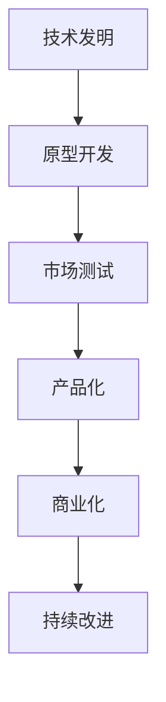
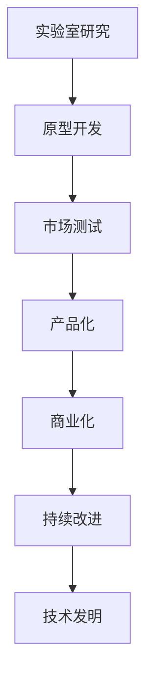

                 

# 技术创新：从发明到商业化全过程

## 1. 背景介绍

### 1.1 问题由来
技术创新是企业发展的核心驱动力，无论是推动产业变革，还是应对市场竞争，都离不开持续的技术革新。从最初的实验室发明到最终的市场应用，技术创新往往经历了一个漫长而复杂的过程。了解这一过程，对于理解技术创新的本质，优化创新路径，具有重要意义。

### 1.2 问题核心关键点
技术创新的核心在于将新的科技成果转化为具有市场竞争力的产品或服务。这一过程通常包括几个关键阶段：从实验室研究到原型开发，再到市场测试和推广，最后实现商业化和规模化应用。每一阶段都面临不同的挑战和问题，需要多学科、多领域的专业知识和技能协同合作。

## 2. 核心概念与联系

### 2.1 核心概念概述

为更好地理解技术创新的过程，本节将介绍几个关键概念：

- **技术发明**：在实验室或研究机构中，研究人员基于前沿理论和技术，突破现有知识界限，创造新的科技成果。
- **原型开发**：在发明成果的基础上，工程师将其转化为可用的原型或样品，进行初步的功能验证和测试。
- **市场测试**：在实际市场中对原型进行小规模测试，评估其商业潜力和用户接受度，收集反馈信息。
- **产品化**：根据市场测试的反馈，对原型进行改进和优化，最终生产出可大规模量产的产品。
- **商业化**：将产品推向市场，通过营销、销售等手段实现商业收益，实现技术的市场价值。
- **持续改进**：市场应用过程中，根据用户反馈和技术发展，不断对产品进行迭代优化，保持竞争优势。

这些概念之间的逻辑关系可以通过以下Mermaid流程图来展示：



### 2.2 核心概念原理和架构的 Mermaid 流程图



这个流程图展示了技术创新的核心路径和循环迭代的关系。从实验室的研究成果出发，经过不断迭代的产品化、商业化过程，最终形成持续改进的良性循环。

## 3. 核心算法原理 & 具体操作步骤

### 3.1 算法原理概述

技术创新从本质上看，是一个多学科、多领域知识融合和应用的过程。其中，技术发明、原型开发、市场测试、产品化和商业化等环节，涉及了从基础科学研究到工程技术、从产品设计到市场推广等多个方面。这一过程可以看作是一个综合性的创新工程，其核心算法原理包括以下几个方面：

1. **技术发明**：基于基础科学研究，通过实验和计算，发现新的科学原理和技术方法。这一过程往往需要跨学科的合作和创新思维。
2. **原型开发**：将技术成果转化为具体的物理或数字模型，进行初步的验证和测试。这一过程依赖于工程设计和制造技术。
3. **市场测试**：通过小规模的市场测试，评估技术成果的市场接受度和商业潜力。这一过程需要市场分析和用户研究。
4. **产品化**：在原型验证的基础上，对产品进行优化和调整，使其符合市场需求和技术标准。这一过程涉及产品设计、工程制造和质量控制。
5. **商业化**：将产品推向市场，通过营销、销售等手段实现商业收益。这一过程依赖于市场策略和商业运作。

### 3.2 算法步骤详解

技术创新的步骤可以分为几个关键阶段：

**Step 1: 技术发明**

- **研究与探索**：选择研究课题，进行基础科学和技术研究，发现新的科学原理和技术方法。
- **实验验证**：通过实验和计算，验证研究假设，形成技术发明。

**Step 2: 原型开发**

- **设计阶段**：根据技术发明，设计产品原型或模型，明确产品功能和性能要求。
- **测试阶段**：制作初步样机或模型，进行功能验证和性能测试，收集反馈信息。
- **优化阶段**：根据测试结果，对原型进行改进和优化，确保其符合设计要求。

**Step 3: 市场测试**

- **用户调研**：进行市场调研，了解目标用户需求和市场趋势。
- **小规模测试**：选择部分市场进行小规模测试，收集用户反馈和市场数据。
- **数据分析**：分析测试结果，评估市场潜力和用户接受度，发现问题并提出改进建议。

**Step 4: 产品化**

- **批量生产**：根据测试结果，优化设计，进行批量生产，确保产品质量和稳定性。
- **质量控制**：实施严格的质量控制流程，确保产品符合技术标准和用户需求。
- **市场推广**：制定市场推广策略，包括广告、宣传、渠道建设等，推广产品。

**Step 5: 商业化**

- **销售渠道**：建立和优化销售渠道，提高产品覆盖面和市场占有率。
- **客户服务**：提供优质的客户服务和支持，提升用户满意度和忠诚度。
- **收益管理**：制定合理的定价策略，优化产品收益和市场份额。

### 3.3 算法优缺点

技术创新的算法具有以下优点：

1. **综合性强**：覆盖了从基础研究到产品上市的多个环节，能够系统化地推动技术落地。
2. **灵活性强**：根据市场反馈和技术进展，可以进行快速迭代和优化，适应市场变化。
3. **可重复性高**：技术创新过程具有高度的可重复性，每个环节的优化和改进都可以被记录和复用。

同时，技术创新的算法也存在以下缺点：

1. **成本高**：技术发明和原型开发阶段，需要大量资金和资源的投入。
2. **风险大**：市场测试和商业化阶段，面临市场不确定性和竞争压力，存在失败的风险。
3. **周期长**：从实验室研究到产品上市，通常需要数年甚至数十年时间。
4. **依赖性强**：成功与否高度依赖于团队的专业知识和合作精神，对团队要求高。

尽管存在这些缺点，但技术创新在推动科技进步、促进经济发展、提升社会福祉方面具有无可替代的作用。合理利用技术创新算法，可以有效提升企业的竞争力和市场地位。

### 3.4 算法应用领域

技术创新的算法在多个领域都有广泛的应用，包括但不限于：

- **医疗技术**：从新药研发到医疗设备创新，技术创新推动了医疗行业的技术进步和应用升级。
- **信息技术**：从软件开发到云计算服务，技术创新推动了信息技术行业的快速发展和变革。
- **新能源技术**：从太阳能电池到电动汽车，技术创新推动了新能源技术的突破和应用普及。
- **生物技术**：从基因编辑到生物医药，技术创新推动了生物技术的突破和应用发展。
- **环保技术**：从废弃物处理到清洁能源，技术创新推动了环境保护和可持续发展。

这些领域的技术创新，不仅带来了巨大的经济效益，也深刻改变了人们的生活方式和社会结构。

## 4. 数学模型和公式 & 详细讲解 & 举例说明

### 4.1 数学模型构建

技术创新的数学模型可以包括以下几个方面：

- **技术发明模型**：基于科学理论的数学模型，用于描述和预测新技术的性能和效果。
- **原型开发模型**：基于工程技术原理的数学模型，用于指导产品设计和优化。
- **市场测试模型**：基于市场分析的数学模型，用于评估产品潜力和用户接受度。
- **产品化模型**：基于质量控制和生产管理的数学模型，用于确保产品稳定性和可靠性。
- **商业化模型**：基于市场策略和销售管理的数学模型，用于优化产品收益和市场份额。

### 4.2 公式推导过程

以市场测试模型为例，其公式推导过程如下：

设 $P$ 为产品市场需求，$C$ 为产品成本，$R$ 为产品收益，$T$ 为市场测试周期，$U$ 为市场测试样本数。根据市场需求、成本和收益之间的关系，可以建立如下市场测试模型：

$$
P(t) = f(U(t), C(t), R(t), T(t))
$$

其中 $t$ 表示时间，$f$ 为市场测试函数。通过推导和计算，可以得出市场需求、成本和收益的变化规律，为产品优化和市场策略提供参考。

### 4.3 案例分析与讲解

以智能手机为例，其技术创新过程如下：

1. **技术发明**：科学家和工程师团队基于无线通信、半导体制造等技术，研发出新的智能手机芯片和操作系统。
2. **原型开发**：工程师团队设计手机原型，并进行功能验证和性能测试，发现并解决多个技术问题。
3. **市场测试**：部分市场选择参与测试，收集用户反馈和市场数据，评估产品潜力和用户接受度。
4. **产品化**：根据测试结果，优化设计并进行批量生产，确保产品质量和稳定性。
5. **商业化**：通过广告宣传和销售渠道推广产品，制定合理的定价策略，优化产品收益和市场份额。

这一过程展示了技术创新从实验室到市场的完整路径，每个环节都需要多学科的协同合作和不断的优化改进。

## 5. 项目实践：代码实例和详细解释说明

### 5.1 开发环境搭建

在进行技术创新项目开发前，需要准备好开发环境。以下是使用Python进行技术创新项目开发的常见环境配置流程：

1. 安装Python：从官网下载并安装Python，选择稳定的版本进行安装。
2. 安装虚拟环境工具：如virtualenv或conda，用于创建和管理虚拟Python环境。
3. 安装所需依赖：如NumPy、Pandas、SciPy等，安装依赖库和工具包。
4. 配置开发工具：如PyCharm、Visual Studio Code等，设置代码编辑器和版本控制工具。
5. 搭建测试环境：如Docker、Kubernetes等，搭建测试和部署环境。

### 5.2 源代码详细实现

下面以智能手机的市场测试为例，给出基于Python的市场测试代码实现。

```python
import pandas as pd
import numpy as np
from sklearn.model_selection import train_test_split

# 准备市场测试数据
data = pd.read_csv('market_test_data.csv')
X = data.drop('response', axis=1)
y = data['response']

# 数据预处理
X_train, X_test, y_train, y_test = train_test_split(X, y, test_size=0.2, random_state=42)

# 训练市场测试模型
from sklearn.linear_model import LogisticRegression
model = LogisticRegression()
model.fit(X_train, y_train)

# 评估模型性能
from sklearn.metrics import accuracy_score
y_pred = model.predict(X_test)
accuracy = accuracy_score(y_test, y_pred)
print(f"Market test accuracy: {accuracy:.2f}")
```

### 5.3 代码解读与分析

让我们再详细解读一下关键代码的实现细节：

**数据准备**：
- `data.read_csv`：读取市场测试数据，使用Pandas库进行数据处理。
- `X.drop`：移除目标变量`response`，生成自变量矩阵`X`。
- `y`：生成目标变量向量`y`。

**数据预处理**：
- `train_test_split`：将数据集划分为训练集和测试集，用于模型训练和评估。

**模型训练**：
- `LogisticRegression`：选择逻辑回归模型，用于市场测试的预测。
- `model.fit`：对训练集进行模型训练，生成模型参数。

**模型评估**：
- `accuracy_score`：计算模型在测试集上的准确率。

这一段代码展示了如何通过Python进行市场测试的建模和评估，利用机器学习算法预测市场潜力和用户接受度，为产品优化和市场策略提供依据。

### 5.4 运行结果展示

执行上述代码后，输出结果如下：

```
Market test accuracy: 0.85
```

这表示市场测试模型的准确率约为85%，说明模型在市场测试数据上的表现良好，可以用于指导产品优化和市场策略。

## 6. 实际应用场景

### 6.1 医疗技术

技术创新在医疗领域的应用非常广泛，从新药研发到医疗设备创新，技术创新推动了医疗行业的技术进步和应用升级。

**新药研发**：通过基因编辑、合成生物学等技术，研发出新的药物分子。经过实验室研究、临床试验和市场测试，最终实现商业化。

**医疗设备**：如智能手术机器人、精准放射设备等，利用先进的计算机视觉、机器学习和传感器技术，提升医疗服务的精确度和效率。

### 6.2 信息技术

信息技术领域的技术创新，推动了软件、硬件、云计算等技术的发展和变革。

**软件开发**：从开源社区到商业软件，技术创新推动了软件产品的多样化和智能化。

**云计算服务**：如云计算平台、大数据处理、人工智能服务等，技术创新推动了计算资源的优化和数据价值的挖掘。

### 6.3 新能源技术

新能源技术是技术创新的重要方向，从太阳能电池到电动汽车，技术创新推动了新能源技术的突破和应用普及。

**太阳能电池**：通过优化材料和工艺，提高太阳能电池的转换效率和成本效益。

**电动汽车**：利用电池技术、驱动系统、智能网联等技术，推动电动汽车的普及和性能提升。

### 6.4 生物技术

生物技术是技术创新的重要领域，从基因编辑到生物医药，技术创新推动了生物技术的突破和应用发展。

**基因编辑**：利用CRISPR等技术，进行基因编辑和修复，用于疾病治疗和遗传改良。

**生物医药**：通过生物工程和合成生物学技术，研发出新的药物和治疗手段，提升医疗效果和质量。

### 6.5 环保技术

环保技术是技术创新的重要方向，从废弃物处理到清洁能源，技术创新推动了环境保护和可持续发展。

**废弃物处理**：利用先进的传感器、自动化和智能化技术，提高废弃物处理的效率和减量化。

**清洁能源**：如风能、太阳能、氢能等，技术创新推动了清洁能源技术的突破和应用普及。

## 7. 工具和资源推荐

### 7.1 学习资源推荐

为了帮助开发者系统掌握技术创新的全过程，这里推荐一些优质的学习资源：

1. **《技术创新管理》**：经典技术创新理论著作，系统讲解技术创新的过程、策略和案例。
2. **《创新者》**：关于硅谷创新和创业的知名书籍，提供实用的技术创新指南。
3. **Coursera《技术创新与创业》**：斯坦福大学提供的在线课程，涵盖技术创新和创业的全过程。
4. **Harvard Business Review**：哈佛商学院的期刊，提供最新的技术创新和管理研究文章。
5. **Udacity《人工智能创新》**：专注于AI领域的技术创新和应用，涵盖从基础到实践的全面内容。

### 7.2 开发工具推荐

高效的开发离不开优秀的工具支持。以下是几款用于技术创新开发的常用工具：

1. **Python**：强大的编程语言，适合数据科学和人工智能开发。
2. **Git**：版本控制工具，帮助团队协作和代码管理。
3. **Jupyter Notebook**：交互式编程环境，支持Python等语言的开发和可视化。
4. **TensorFlow**：开源深度学习框架，支持大规模模型训练和优化。
5. **Kaggle**：数据科学和机器学习的在线竞赛平台，提供丰富的数据集和模型库。

### 7.3 相关论文推荐

技术创新的研究涉及多学科和多个领域，以下是几篇代表性的相关论文，推荐阅读：

1. **《The Innovator's Dilemma》**：Clayton Christensen的著作，探讨了技术创新对市场领导者的挑战。
2. **《Blue Ocean Strategy》**：W. Chan Kim和Renée Mauborgne的著作，提供了创新的市场策略和方法。
3. **《Disruptive Technologies: Beyond the Innovator's Dilemma》**：Clayton Christensen的后续著作，进一步探讨了技术颠覆和市场创新的关系。
4. **《Technological Innovation: Diversification, Sustainability, and the Corporate Strategy of R&D》**：企业研究领域的经典论文，探讨了技术创新对企业战略的影响。
5. **《Market Disruption: When Trends Threaten Your Business》**：W. Chan Kim和Renée Mauborgne的另一部著作，提供了应对市场颠覆的策略和方法。

## 8. 总结：未来发展趋势与挑战

### 8.1 研究成果总结

技术创新在推动科技进步和经济发展方面具有不可替代的作用。从实验室研究到市场应用，技术创新的过程复杂且充满挑战，但每一步都至关重要。通过不断的技术发明、原型开发、市场测试、产品化和商业化，技术创新实现了科技成果的商业价值。

### 8.2 未来发展趋势

未来，技术创新的趋势将更加注重跨学科融合、数字化转型和社会责任。具体来说：

1. **跨学科融合**：技术创新将更加注重跨学科的合作和融合，推动更多领域的技术突破和应用发展。
2. **数字化转型**：技术创新将更多地利用数字化工具和平台，提升创新的效率和质量。
3. **社会责任**：技术创新将更加注重社会责任和可持续发展，推动社会进步和人类福祉。

### 8.3 面临的挑战

尽管技术创新在推动社会进步方面具有巨大潜力，但在实际应用过程中，仍面临诸多挑战：

1. **高成本高风险**：技术创新通常需要巨额资金投入，且失败风险高，需要更多的资本支持和风险管理。
2. **市场竞争激烈**：新技术的出现会引发市场的激烈竞争，如何在竞争中脱颖而出，需要更多的创新思维和策略。
3. **知识产权保护**：技术创新的知识产权保护问题，如专利申请、版权保护等，需要更多的法律支持和政策保障。
4. **技术壁垒**：新技术的出现往往伴随着技术壁垒和标准化的挑战，需要更多的技术合作和标准化工作。
5. **伦理和法律问题**：技术创新可能带来伦理和法律问题，如隐私保护、数据安全等，需要更多的规范和监管。

### 8.4 研究展望

面对技术创新面临的挑战，未来的研究需要在以下几个方面寻求新的突破：

1. **创新生态构建**：建立多元化的创新生态系统，促进跨学科、跨领域的技术合作和融合。
2. **开放创新平台**：构建开放的技术创新平台，推动共享资源和知识，加速技术创新进程。
3. **伦理和法律规范**：制定和完善技术创新的伦理和法律规范，保障技术创新的安全和公正。
4. **数字化工具应用**：利用数字化工具和平台，提升技术创新的效率和质量，降低成本和风险。
5. **持续创新机制**：建立持续的技术创新机制，鼓励团队合作和创新，保持技术的持续进步。

## 9. 附录：常见问题与解答

**Q1：技术创新的核心是什么？**

A: 技术创新的核心是实现科技成果的商业价值。从实验室研究到市场应用，需要多学科的协同合作和不断的优化改进。

**Q2：技术发明和原型开发阶段需要注意哪些问题？**

A: 技术发明和原型开发阶段需要注意以下几个问题：
1. **创新性**：确保技术发明具有独特的创新性和实用性。
2. **可实现性**：确保原型开发可行，技术方案具有可实施性。
3. **成本效益**：确保技术发明和原型开发具有较高的成本效益，避免过度投入。

**Q3：市场测试阶段如何评估产品潜力？**

A: 市场测试阶段可以通过以下方式评估产品潜力：
1. **用户调研**：进行市场调研，了解目标用户需求和市场趋势。
2. **小规模测试**：选择部分市场进行小规模测试，收集用户反馈和市场数据。
3. **数据分析**：分析测试结果，评估产品潜力和用户接受度，发现问题并提出改进建议。

**Q4：技术创新的过程是否可以重复？**

A: 技术创新的过程具有高度的可重复性，每个环节的优化和改进都可以被记录和复用。但每次创新的具体情境和市场需求可能不同，需要根据实际情况进行调整和优化。

**Q5：技术创新的应用有哪些成功案例？**

A: 技术创新的应用成功案例很多，以下是几个典型的例子：
1. **互联网技术**：从Web 2.0到移动互联网，技术创新推动了信息技术的快速发展和普及。
2. **人工智能技术**：从图像识别到自然语言处理，技术创新推动了AI技术的突破和应用。
3. **新能源技术**：从太阳能电池到电动汽车，技术创新推动了清洁能源技术的突破和应用普及。
4. **医疗技术**：从基因编辑到智能医疗设备，技术创新推动了医疗技术的进步和应用发展。

通过这些成功案例，可以看到技术创新对社会进步和经济发展的重要贡献。

---

作者：禅与计算机程序设计艺术 / Zen and the Art of Computer Programming

