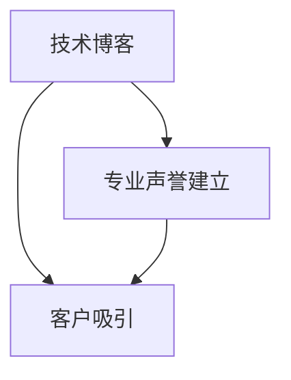

                 

# 技术博客写作：建立专业声誉和吸引客户

> 关键词：技术博客, 专业声誉, 客户吸引, 内容策略, 技术分享, 数据分析, 内容优化

## 1. 背景介绍

在快速变化的技术环境中，建立和维护专业声誉对IT从业者至关重要。技术博客是一个展示专业知识和解决实际问题的绝佳平台，不仅能够提升个人知名度，还能吸引和留住客户。本文将详细探讨如何通过技术博客写作，建立并维护专业声誉，吸引潜在客户。

## 2. 核心概念与联系

### 2.1 核心概念概述

本文涉及的几个关键概念包括：

- **技术博客**：作者撰写并发布在公开平台上的技术文章，旨在分享技术知识、解决问题、展示专业能力。
- **专业声誉**：作者在特定技术领域内建立的权威性和可信度，通常通过其博客内容的质量和影响力来衡量。
- **客户吸引**：通过博客内容展示的深厚技术功底和对客户需求的敏感度，吸引潜在客户，增加业务机会。

这些概念之间具有紧密联系：高质量的技术博客内容能够建立和提升专业声誉，而良好的专业声誉又能够吸引更多客户。接下来，我们将探讨如何通过技术博客写作，实现这一过程。

### 2.2 核心概念原理和架构的 Mermaid 流程图



该流程图展示了技术博客与专业声誉和客户吸引之间的逻辑关系。高质量的博客内容通过提升专业声誉，进而吸引更多客户。

## 3. 核心算法原理 & 具体操作步骤

### 3.1 算法原理概述

技术博客写作的核心算法原理围绕内容质量、频率和互动三个方面展开：

- **内容质量**：博客内容必须解决实际问题、展示深入理解，提供可操作的解决方案。
- **发布频率**：定期发布内容，保持观众的兴趣和关注度。
- **互动参与**：通过评论区、社交媒体等渠道与读者互动，收集反馈并持续改进内容。

### 3.2 算法步骤详解

1. **内容规划**：
   - 定义博客主题和目标受众。
   - 确定博客的核心问题和解决方案。
   - 调研现有资源，避免重复内容。

2. **内容创作**：
   - 编写清晰、结构化的博客文章，使用简明扼要的语言解释技术原理和解决方案。
   - 加入实例和代码片段，增加内容的可操作性。
   - 使用专业术语，提升文章的技术深度。

3. **发布和维护**：
   - 在合适的平台（如GitHub、Medium、CSDN等）发布博客。
   - 定期更新博客，补充最新技术动态。
   - 与读者互动，解答疑问，收集反馈。

4. **数据分析**：
   - 使用网站分析工具（如Google Analytics）监控博客流量和用户行为。
   - 分析读者的反馈和评论，调整内容策略。
   - 根据数据分析结果，优化博客内容。

### 3.3 算法优缺点

**优点**：

- 通过博客展示技术能力，建立权威性。
- 长期维护和更新，保持读者兴趣。
- 读者反馈和互动，增强内容质量。

**缺点**：

- 需要持续投入时间和精力。
- 内容质量要求高，需要深入理解技术。
- 博客互动可能需要额外时间和精力管理。

### 3.4 算法应用领域

技术博客不仅限于技术人员的个人品牌建设，还可以应用于企业品牌推广、技术产品宣传、社区知识共享等多个领域。在企业层面，技术博客成为展示企业技术实力和创新能力的重要渠道。

## 4. 数学模型和公式 & 详细讲解 & 举例说明

### 4.1 数学模型构建

假设读者阅读博客的频率遵循泊松分布，文章被阅读的概率为$p$，则读者访问文章的期望次数为$\lambda = np$，其中$n$为博客发布频率。

### 4.2 公式推导过程

$$
\text{期望访问次数} = \lambda = np
$$

在实际应用中，$n$通常为一个月内博客的发布次数，$p$需要通过读者互动和数据分析来估算。

### 4.3 案例分析与讲解

以一个技术博客为例，该博客每两周发布一次，每篇博客平均被阅读10,000次。计算期望的博客访问次数：

$$
\lambda = n \times p = 2 \times 10,000 = 20,000
$$

这意味着，该博客每月预计会吸引20,000次访问。

## 5. 项目实践：代码实例和详细解释说明

### 5.1 开发环境搭建

1. 安装Markdown编辑器（如Typora、Dillinger）。
2. 注册并发布到GitHub Pages、Medium等平台。
3. 配置CI/CD流程，自动化发布新文章。

### 5.2 源代码详细实现

以下是一个简单的技术博客发布流程示例：

```python
# 使用Python的博客发布库发布博客
from blogpy import BlogPost, BlogClient

# 创建博客帖子
post = BlogPost(title="My First Technical Blog Post",
                content="This is my first blog post on [blog platform name].",
                tags=["python", "blogging"])

# 发布博客帖子
client = BlogClient()
client.publish(post)
```

### 5.3 代码解读与分析

这段代码展示了如何创建一个博客帖子并发布到博客平台。通过简单的API调用，可以轻松地实现博客的自动化发布。需要注意的是，实际的博客发布库可能会有不同的API调用方式和参数要求。

### 5.4 运行结果展示

博客发布成功后，可以在博客平台查看新帖子的访问量和互动情况。通过分析这些数据，可以进一步优化博客内容和发布策略。

## 6. 实际应用场景

### 6.1 客户关系管理

企业可以通过技术博客展示其在特定技术领域的深度理解和创新能力，吸引潜在客户。博客可以介绍企业技术团队和产品，展示成功案例，提供技术支持。

### 6.2 技术产品推广

技术博客是推广新产品的理想平台。通过博客介绍产品功能、使用案例、用户反馈等，可以吸引潜在用户并促进销售。

### 6.3 社区知识共享

技术博客还可以作为社区知识共享的渠道，企业或个人分享技术经验、解答技术问题，促进技术社区的活跃和知识共享。

### 6.4 未来应用展望

随着技术的不断进步和博客平台的不断发展，技术博客将越来越多地应用于各个行业。未来，技术博客可能会与更多的新兴技术结合，如区块链、人工智能等，成为展示最新技术动态的重要平台。

## 7. 工具和资源推荐

### 7.1 学习资源推荐

1. **《博客的艺术：如何撰写并营销博客》**：提供从规划到发布完整的博客撰写指南。
2. **《内容营销的艺术》**：探讨如何通过博客内容吸引并保留读者。
3. **《博客运营：提高博客访问量和影响力》**：提供博客管理和优化的实用技巧。

### 7.2 开发工具推荐

1. **GitHub Pages**：免费的博客托管服务，适合展示技术博客内容。
2. **Medium**：用户友好的博客发布平台，易于管理和推广。
3. **Jekyll**：开源博客框架，支持高度定制化。

### 7.3 相关论文推荐

1. **《技术博客的效果评估：一个混合模型》**：研究如何通过技术博客提升作者的影响力和客户吸引力。
2. **《社交媒体上的技术博客：影响力和互动》**：探讨社交媒体对技术博客读者互动和影响力的影响。
3. **《技术博客的SEO优化策略》**：提供提升博客搜索引擎排名的方法。

## 8. 总结：未来发展趋势与挑战

### 8.1 研究成果总结

本文详细探讨了技术博客在建立专业声誉和吸引客户方面的作用。通过科学的内容规划、高质量的内容创作、持续的互动和分析，技术博客能够有效提升作者的专业声誉，吸引和留住客户。

### 8.2 未来发展趋势

- **内容多元化**：博客内容将更加多样化，涉及更多新兴技术和行业。
- **多渠道互动**：博客将与更多社交媒体和知识共享平台结合，提升互动效果。
- **AI辅助创作**：利用AI技术生成和优化博客内容，提高创作效率。

### 8.3 面临的挑战

- **内容质量维持**：需要持续投入时间和精力，保持内容的高质量。
- **读者互动管理**：如何有效管理读者的评论和反馈，提升互动效果。
- **技术更新快速**：需要快速响应技术变化，更新博客内容。

### 8.4 研究展望

未来的研究将聚焦于如何通过技术博客建立和维护专业声誉，以及如何利用新兴技术和工具提升博客的效果和影响力。探索更具创新性的内容形式和互动策略，将是技术博客未来发展的重要方向。

## 9. 附录：常见问题与解答

**Q1：如何提升博客的搜索引擎排名？**

A: 通过优化博客标题、关键词、Meta描述和内部链接，可以提升博客的搜索引擎排名。

**Q2：如何增加博客的读者互动？**

A: 通过社交媒体推广、定期举办问答活动、收集读者反馈等方式，可以增强博客的读者互动。

**Q3：如何选择博客发布平台？**

A: 根据博客内容特点和目标受众，选择合适的博客发布平台，如GitHub Pages适合技术博客，Medium适合广泛受众。

**Q4：博客内容创作需要哪些工具？**

A: 使用Markdown编辑器撰写博客，使用CI/CD工具自动化发布，使用网站分析工具监控流量和互动效果。

**Q5：如何衡量博客的效果？**

A: 通过网站分析工具收集博客流量、读者行为数据，评估博客的影响力和效果。

---

作者：禅与计算机程序设计艺术 / Zen and the Art of Computer Programming

